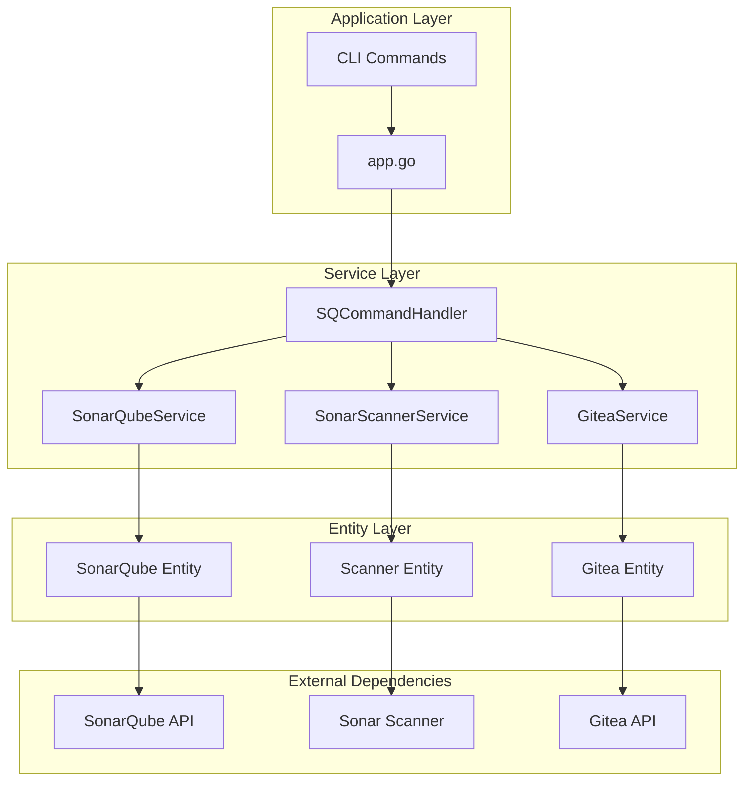

# Design Document

## Overview

Данный документ описывает архитектурное решение для интеграции с SonarQube в проекте benadis-runner. Интеграция будет реализована с использованием принципов SOLID, современных возможностей Go 1.25 и существующих архитектурных паттернов проекта.

Интеграция обеспечит полный жизненный цикл работы с SonarQube: создание проектов, сканирование кода, синхронизацию репозиториев, генерацию отчетов и управление проектами.

## Architecture

### High-Level Architecture

Архитектура интеграции следует существующим паттернам проекта benadis-runner:



### Layered Architecture

1. **Application Layer** - точки входа и координация команд
2. **Service Layer** - бизнес-логика и оркестрация
3. **Entity Layer** - взаимодействие с внешними системами
4. **External Dependencies** - внешние API и инструменты

## Components and Interfaces

### Core Interfaces

#### SonarQubeAPIInterface
```go
type SonarQubeAPIInterface interface {
    // Project Management
    CreateProject(owner, repo, branch string) (*Project, error)
    GetProject(projectKey string) (*Project, error)
    UpdateProject(projectKey string, updates *ProjectUpdate) error
    DeleteProject(projectKey string) error
    ListProjects(owner, repo string) ([]Project, error)
    
    // Authentication
    Authenticate(token string) error
    ValidateToken() error
    
    // Analysis Management
    GetAnalyses(projectKey string) ([]Analysis, error)
    GetAnalysisStatus(analysisID string) (*AnalysisStatus, error)
    
    // Issues and Quality Gates
    GetIssues(projectKey string, params *IssueParams) ([]Issue, error)
    GetQualityGateStatus(projectKey string) (*QualityGateStatus, error)
    
    // Metrics
    GetMetrics(projectKey string, metricKeys []string) (*Metrics, error)
}
```

#### SonarScannerInterface
```go
type SonarScannerInterface interface {
    // Scanner Management
    Download(giteaURL, scannerRepo string) error
    Configure(config *ScannerConfig) error
    Execute(ctx context.Context) (*ScanResult, error)
    
    // Configuration
    SetProperty(key, value string)
    GetProperty(key string) string
    ValidateConfig() error
    
    // Lifecycle
    Initialize() error
    Cleanup() error
}
```

#### SQCommandHandlerInterface
```go
type SQCommandHandlerInterface interface {
    // Branch Operations
    HandleSQScanBranch(ctx context.Context, params *ScanBranchParams) error
    HandleSQScanPR(ctx context.Context, params *ScanPRParams) error
    
    // Project Operations
    HandleSQProjectUpdate(ctx context.Context, params *ProjectUpdateParams) error
    HandleSQRepoSync(ctx context.Context, params *RepoSyncParams) error
    HandleSQRepoClear(ctx context.Context, params *RepoClearParams) error
    
    // Reporting Operations
    HandleSQReportPR(ctx context.Context, params *ReportPRParams) error
    HandleSQReportBranch(ctx context.Context, params *ReportBranchParams) error
    HandleSQReportProject(ctx context.Context, params *ReportProjectParams) error
}
```

### Service Components

#### SonarQubeService
Основной сервис для работы с SonarQube API:
- Управление проектами
- Аутентификация
- Получение метрик и отчетов
- Кэширование результатов

#### SonarScannerService
Сервис для управления sonar-scanner:
- Загрузка и настройка scanner'а
- Выполнение сканирования
- Обработка результатов
- Управление жизненным циклом

#### SQCommandHandler
Координатор команд SonarQube:
- Обработка всех SQ команд
- Оркестрация между сервисами
- Валидация параметров
- Обработка ошибок

### Entity Components

#### SonarQubeEntity
Низкоуровневое взаимодействие с SonarQube API:
- HTTP клиент для SonarQube
- Сериализация/десериализация данных
- Обработка ошибок API
- Retry механизмы

#### SonarScannerEntity
Управление sonar-scanner:
- Загрузка исполняемых файлов
- Конфигурирование
- Запуск процессов
- Парсинг результатов

## Data Models

### Core Models

```go
// Project представляет проект в SonarQube
type Project struct {
    Key         string            `json:"key"`
    Name        string            `json:"name"`
    Description string            `json:"description"`
    Visibility  string            `json:"visibility"`
    Tags        []string          `json:"tags"`
    Created     time.Time         `json:"created"`
    Updated     time.Time         `json:"updated"`
    Metadata    map[string]string `json:"metadata"`
}

// Analysis представляет анализ кода
type Analysis struct {
    ID          string            `json:"id"`
    ProjectKey  string            `json:"projectKey"`
    Date        time.Time         `json:"date"`
    Revision    string            `json:"revision"`
    Status      AnalysisStatus    `json:"status"`
    Metrics     map[string]string `json:"metrics"`
}

// ScanResult представляет результат сканирования
type ScanResult struct {
    Success     bool              `json:"success"`
    AnalysisID  string            `json:"analysisId"`
    ProjectKey  string            `json:"projectKey"`
    Duration    time.Duration     `json:"duration"`
    Issues      []Issue           `json:"issues"`
    Metrics     map[string]string `json:"metrics"`
    Errors      []string          `json:"errors"`
}

// Issue представляет проблему в коде
type Issue struct {
    Key         string    `json:"key"`
    Rule        string    `json:"rule"`
    Severity    string    `json:"severity"`
    Component   string    `json:"component"`
    Line        int       `json:"line"`
    Message     string    `json:"message"`
    Type        string    `json:"type"`
    CreatedAt   time.Time `json:"createdAt"`
    UpdatedAt   time.Time `json:"updatedAt"`
}
```

### Configuration Models

```go
// SonarQubeConfig конфигурация SonarQube
type SonarQubeConfig struct {
    URL                string        `yaml:"url"`
    Token              string        `yaml:"token"`
    Timeout            time.Duration `yaml:"timeout"`
    RetryAttempts      int           `yaml:"retryAttempts"`
    RetryDelay         time.Duration `yaml:"retryDelay"`
    ProjectPrefix      string        `yaml:"projectPrefix"`
    DefaultVisibility  string        `yaml:"defaultVisibility"`
    QualityGateTimeout time.Duration `yaml:"qualityGateTimeout"`
}

// ScannerConfig конфигурация sonar-scanner
type ScannerConfig struct {
    ScannerURL      string            `yaml:"scannerUrl"`
    ScannerVersion  string            `yaml:"scannerVersion"`
    JavaOpts        string            `yaml:"javaOpts"`
    Properties      map[string]string `yaml:"properties"`
    Timeout         time.Duration     `yaml:"timeout"`
    WorkDir         string            `yaml:"workDir"`
    TempDir         string            `yaml:"tempDir"`
}
```

## Error Handling

### Error Types

```go
// SonarQubeError представляет ошибки SonarQube API
type SonarQubeError struct {
    Code    int    `json:"code"`
    Message string `json:"message"`
    Details string `json:"details"`
}

// ScannerError представляет ошибки sonar-scanner
type ScannerError struct {
    ExitCode int    `json:"exitCode"`
    Output   string `json:"output"`
    Error    string `json:"error"`
}

// ValidationError представляет ошибки валидации
type ValidationError struct {
    Field   string `json:"field"`
    Value   string `json:"value"`
    Message string `json:"message"`
}
```

### Error Handling Strategy

1. **Retry Mechanism**: Экспоненциальная задержка для сетевых ошибок
2. **Circuit Breaker**: Защита от каскадных сбоев
3. **Graceful Degradation**: Частичная функциональность при ошибках
4. **Detailed Logging**: Структурированное логирование ошибок
5. **User-Friendly Messages**: Понятные сообщения для пользователей

## Testing Strategy

### Unit Testing
- Тестирование каждого компонента изолированно
- Мокирование внешних зависимостей
- Покрытие edge cases и error scenarios
- Использование testify/mock для Go

### Integration Testing
- Тестирование взаимодействия между компонентами
- Тестирование с реальными API (в тестовой среде)
- Тестирование полных сценариев использования

### End-to-End Testing
- Тестирование полных workflow'ов
- Автоматизированные тесты CLI команд
- Тестирование в Docker контейнерах

### Test Structure
```
internal/
├── entity/
│   └── sonarqube/
│       ├── sonarqube_test.go
│       └── scanner_test.go
├── service/
│   └── sonarqube/
│       ├── service_test.go
│       └── handler_test.go
└── testdata/
    ├── fixtures/
    └── mocks/
```

## Security Considerations

### Authentication & Authorization
- Secure token storage в secret.yaml
- Token rotation support
- Минимальные права доступа
- Audit logging для всех операций

### Data Protection
- Шифрование sensitive данных
- Secure communication (HTTPS only)
- Input validation и sanitization
- Protection от injection attacks

### Network Security
- TLS verification
- Certificate pinning (опционально)
- Network timeouts
- Rate limiting

## Performance Optimization

### Caching Strategy
- In-memory кэширование проектов
- TTL-based cache invalidation
- Distributed caching (Redis) для масштабирования

### Concurrent Processing
- Goroutines для параллельного сканирования
- Worker pools для batch операций
- Context-based cancellation
- Resource pooling

### Resource Management
- Connection pooling для HTTP клиентов
- Memory management для больших файлов
- Disk space management для временных файлов
- CPU throttling для scanner процессов

## Monitoring and Observability

### Metrics
- Request/response times
- Success/failure rates
- Resource utilization
- Queue depths

### Logging
- Structured logging с slog
- Correlation IDs для трассировки
- Different log levels
- Log aggregation ready

### Health Checks
- SonarQube API availability
- Scanner availability
- Disk space monitoring
- Memory usage monitoring

## Configuration Management

### Configuration Files Structure
```yaml
# app.yaml - добавляем секцию sonarqube
sonarqube:
  url: "https://sonarqube.example.com"
  timeout: "30s"
  retryAttempts: 3
  retryDelay: "5s"
  projectPrefix: "benadis"
  defaultVisibility: "private"
  qualityGateTimeout: "300s"
  
scanner:
  url: "https://gitea.example.com/tools/sonar-scanner"
  version: "latest"
  javaOpts: "-Xmx2g"
  timeout: "600s"
  properties:
    sonar.java.binaries: "target/classes"
    sonar.exclusions: "**/*test*/**"

# secret.yaml - добавляем токен SonarQube
sonarqube:
  token: "squ_1234567890abcdef"
```

### Environment Variables
- `SONARQUBE_URL` - URL SonarQube сервера
- `SONARQUBE_TOKEN` - токен аутентификации
- `SCANNER_JAVA_OPTS` - JVM опции для scanner'а

## Deployment Considerations

### Docker Integration
- Multi-stage builds для оптимизации размера
- Health checks в Docker containers
- Resource limits и requests
- Volume mounts для persistent data

### CI/CD Integration
- Automated testing в pipeline
- Security scanning
- Performance benchmarks
- Automated deployment

### Scaling Considerations
- Horizontal scaling support
- Load balancing
- Database connection pooling
- Distributed caching

## Migration Strategy

### Phase 1: Core Infrastructure
1. Создание базовых интерфейсов и структур
2. Реализация SonarQube API клиента
3. Базовая конфигурация и логирование

### Phase 2: Scanner Integration
1. Реализация sonar-scanner management
2. Интеграция с существующей системой
3. Базовые команды сканирования

### Phase 3: Advanced Features
1. Reporting и analytics
2. Batch operations
3. Advanced error handling

### Phase 4: Optimization
1. Performance tuning
2. Monitoring и observability
3. Security hardening

## Go 1.25 Features Utilization

### Modern Go Features
- **Generics**: Для type-safe коллекций и утилит
- **Context**: Для cancellation и timeouts
- **slog**: Для structured logging
- **net/http**: Современный HTTP клиент
- **time**: Улучшенная работа с временем

### Performance Features
- **sync.Pool**: Для object pooling
- **context.WithTimeout**: Для timeout management
- **go routines**: Для concurrent processing
- **channels**: Для communication между goroutines

## SOLID Principles Implementation

### Single Responsibility Principle (SRP)
- Каждый сервис имеет одну ответственность
- Разделение concerns между layers
- Специализированные интерфейсы

### Open/Closed Principle (OCP)
- Интерфейсы для расширяемости
- Plugin architecture для scanner'ов
- Strategy pattern для различных типов анализа

### Liskov Substitution Principle (LSP)
- Все реализации интерфейсов взаимозаменяемы
- Consistent behavior across implementations
- Proper error handling contracts

### Interface Segregation Principle (ISP)
- Маленькие, специализированные интерфейсы
- Клиенты зависят только от нужных методов
- Композиция интерфейсов при необходимости

### Dependency Inversion Principle (DIP)
- Зависимость от абстракций, не от конкретных типов
- Dependency injection через конструкторы
- Инверсия контроля через интерфейсы