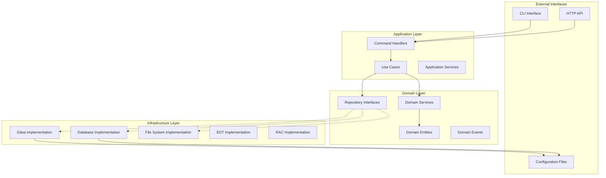
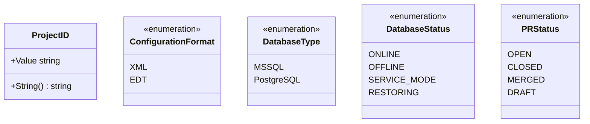
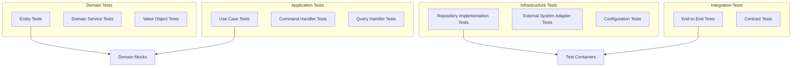

# Дизайн рефакторинга Clean Architecture для apk-ci

## Обзор

Данный документ описывает комплексную стратегию рефакторинга для преобразования проекта apk-ci из текущей структуры в реализацию clean architecture. Рефакторинг направлен на улучшение поддерживаемости, тестируемости, управления зависимостями и разделения ответственности при сохранении существующей функциональности.

### Анализ текущей архитектуры

Существующая кодовая база следует паттерну модульного монолита с несколькими архитектурными проблемами:

- **Тесная связанность**: Прямые зависимости между слоями без должной абстракции
- **Смешанные обязанности**: Бизнес-логика разбросана по разным package'ам
- **Утечка конфигурации**: Configuration объекты передаются по всей системе
- **Infrastructure зависимости**: Бизнес-логика тесно связана с внешними системами
- **Сложности тестирования**: Трудно создавать mock'и зависимостей из-за конкретных реализаций

## Целевая структура Clean Architecture



### Ответственность слоев

#### 1. Domain Layer (Основная бизнес-логика)
- **Entities**: Основные бизнес-объекты с ключевыми бизнес-правилами
- **Value Objects**: Неизменяемые объекты, представляющие бизнес-концепции
- **Domain Services**: Бизнес-логика, которая не подходит для entities
- **Repository Interfaces**: Абстракции для доступа к данным
- **Domain Events**: Бизнес-события для слабой связанности

#### 2. Application Layer (Use Cases)
- **Use Cases**: Правила бизнеса, специфичные для приложения и workflow'ы
- **Command/Query Handlers**: Обработка входящих запросов
- **Application Services**: Оркестрация domain services и repositories
- **DTOs**: Объекты передачи данных для связи между слоями

#### 3. Infrastructure Layer (Внешние связи)
- **Repository Implementations**: Конкретные реализации доступа к данным
- **External API Clients**: Интеграции с Gitea, RAC, EDT
- **File System Operations**: Управление файлами и директориями
- **Configuration Management**: Управление конфигурацией через окружение и файлы

#### 4. Presentation Layer (Точки входа)
- **CLI Commands**: Обработчики интерфейса командной строки
- **HTTP Handlers**: REST API endpoints (будущая расширяемость)
- **Configuration Loaders**: Запуск приложения и конфигурация

## Дизайн Domain Model

### Основные домены

```mermaid
classDiagram
    class Project {
        +ID ProjectID
        +Name string
        +Type ProjectType
        +Configuration ProjectConfig
        +GetBranches() []Branch
        +ValidateConfiguration() error
    }
    
    class Configuration {
        +ID ConfigurationID
        +ProjectID ProjectID
        +Format ConfigurationFormat
        +Content []byte
        +Version ConfigurationVersion
        +Convert(targetFormat) Configuration
        +Validate() error
    }
    
    class Database {
        +ID DatabaseID
        +Name string
        +Server string
        +Type DatabaseType
        +Status DatabaseStatus
        +EnableServiceMode() error
        +DisableServiceMode() error
        +Restore(backup) error
    }
    
    class Repository {
        +URL RepositoryURL
        +Owner string
        +Name string
        +DefaultBranch string
        +CreateBranch(name) Branch
        +GetPullRequests() []PullRequest
        +MergePullRequest(id) error
    }
    
    class Branch {
        +Name string
        +CommitSHA string
        +IsProtected bool
        +GetCommits() []Commit
    }
    
    class PullRequest {
        +ID PullRequestID
        +Number int64
        +Title string
        +SourceBranch Branch
        +TargetBranch Branch
        +Status PRStatus
        +HasConflicts() bool
        +Merge() error
    }
    
    Project ||--o{ Configuration
    Project ||--o{ Database
    Repository ||--o{ Branch
    Repository ||--o{ PullRequest
    PullRequest ||--|| Branch : source
    PullRequest ||--|| Branch : target
```

### Value Objects и Enums



## Рефакторенная структура package'ов

```
cmd/
├── github.com/Kargones/apk-ci/           # Точка входа приложения
│   └── main.go

pkg/                          # Публичные API (при необходимости для библиотек)

internal/
├── domain/                   # Domain Layer
│   ├── entities/
│   │   ├── project.go
│   │   ├── configuration.go
│   │   ├── database.go
│   │   ├── repository.go
│   │   └── pullrequest.go
│   ├── valueobjects/
│   │   ├── project_id.go
│   │   ├── configuration_format.go
│   │   └── database_status.go
│   ├── services/
│   │   ├── configuration_converter.go
│   │   ├── merge_conflict_detector.go
│   │   └── service_mode_manager.go
│   ├── repositories/
│   │   ├── project_repository.go
│   │   ├── configuration_repository.go
│   │   ├── database_repository.go
│   │   └── git_repository.go
│   └── events/
│       ├── configuration_converted.go
│       ├── service_mode_changed.go
│       └── pull_request_merged.go

├── application/              # Application Layer
│   ├── usecases/
│   │   ├── convert_configuration.go
│   │   ├── manage_service_mode.go
│   │   ├── restore_database.go
│   │   ├── sync_git_to_store.go
│   │   └── test_merge_conflicts.go
│   ├── commands/
│   │   ├── convert_command.go
│   │   ├── service_mode_command.go
│   │   ├── database_command.go
│   │   └── git_command.go
│   ├── queries/
│   │   ├── get_project_info.go
│   │   ├── get_database_status.go
│   │   └── get_pull_requests.go
│   ├── services/
│   │   ├── application_service.go
│   │   └── event_dispatcher.go
│   └── dto/
│       ├── project_dto.go
│       ├── configuration_dto.go
│       └── database_dto.go

├── infrastructure/           # Infrastructure Layer
│   ├── persistence/
│   │   ├── file_configuration_repository.go
│   │   ├── memory_project_repository.go
│   │   └── yaml_config_loader.go
│   ├── external/
│   │   ├── gitea/
│   │   │   ├── client.go
│   │   │   ├── repository_adapter.go
│   │   │   └── pull_request_adapter.go
│   │   ├── edt/
│   │   │   ├── client.go
│   │   │   └── converter_adapter.go
│   │   ├── rac/
│   │   │   ├── client.go
│   │   │   └── service_mode_adapter.go
│   │   └── database/
│   │       ├── mssql_client.go
│   │       └── database_adapter.go
│   ├── filesystem/
│   │   ├── file_operations.go
│   │   └── temp_directory_manager.go
│   └── config/
│       ├── app_config.go
│       ├── environment_loader.go
│       └── secrets_manager.go

├── presentation/            # Presentation Layer
│   ├── cli/
│   │   ├── commands/
│   │   │   ├── convert.go
│   │   │   ├── service_mode.go
│   │   │   ├── database.go
│   │   │   └── git2store.go
│   │   ├── handlers/
│   │   │   └── command_handler.go
│   │   └── app.go
│   └── http/               # Будущий REST API
│       ├── handlers/
│       ├── middleware/
│       └── routes.go

└── shared/                 # Общие утилиты
    ├── logging/
    │   └── logger.go
    ├── errors/
    │   ├── domain_errors.go
    │   ├── application_errors.go
    │   └── infrastructure_errors.go
    ├── validation/
    │   └── validator.go
    └── utils/
        ├── file_utils.go
        └── string_utils.go
```

## Ключевые стратегии рефакторинга

### 1. Реализация Dependency Inversion

#### Текущая проблема
```go
// Текущая: Прямая зависимость от конкретных типов
func Convert(ctx *context.Context, l *slog.Logger, cfg *config.Config) error {
    g := git.Git{}  // Прямое создание экземпляра
    c := &edt.Convert{}  // Прямое создание экземпляра
    // ...
}
```

#### Рефакторенное решение
```go
// Domain repository interface
type ConfigurationRepository interface {
    GetByProjectID(projectID domain.ProjectID) (*domain.Configuration, error)
    Save(config *domain.Configuration) error
    ConvertFormat(config *domain.Configuration, targetFormat domain.ConfigurationFormat) error
}

// Use case с dependency injection
type ConvertConfigurationUseCase struct {
    configRepo ConfigurationRepository
    gitRepo    domain.GitRepository
    logger     shared.Logger
}

func (uc *ConvertConfigurationUseCase) Execute(cmd ConvertCommand) error {
    // Бизнес-логика без infrastructure зависимостей
}
```

### 2. Рефакторинг управления конфигурацией

#### Текущая структура
- Монолитная `Config` struct со смешанными обязанностями
- Прямой доступ к конфигурации по всей системе
- Отсутствие разделения между application и domain конфигурацией

#### Предлагаемая структура
```go
// Domain конфигурация (бизнес-правила)
type ProjectConfiguration struct {
    ProjectID   domain.ProjectID
    Type        domain.ProjectType
    Branches    []string
    Rules       ValidationRules
}

// Application конфигурация (настройки use case'ов)
type ApplicationConfig struct {
    DefaultTimeout  time.Duration
    RetryAttempts   int
    LogLevel        string
}

// Infrastructure конфигурация (настройки внешних систем)
type InfrastructureConfig struct {
    GiteaURL     string
    DatabaseURL  string
    EdtPath      string
    RacSettings  RacConfig
}
```

### 3. Стратегия обработки ошибок

```mermaid
classDiagram
    class DomainError {
        <<interface>>
        +Error() string
        +Code() string
        +Details() map[string]interface{}
    }
    
    class ValidationError {
        +Field string
        +Message string
        +Error() string
        +Code() string
    }
    
    class BusinessRuleError {
        +Rule string
        +Context map[string]interface{}
        +Error() string
        +Code() string
    }
    
    class InfrastructureError {
        +Operation string
        +Cause error
        +Retryable bool
        +Error() string
        +Code() string
    }
    
    DomainError <|-- ValidationError
    DomainError <|-- BusinessRuleError
    DomainError <|-- InfrastructureError
```

### 4. Event-Driven архитектура

```go
// Domain events для слабой связанности
type ConfigurationConverted struct {
    ProjectID    domain.ProjectID
    SourceFormat domain.ConfigurationFormat
    TargetFormat domain.ConfigurationFormat
    ConvertedAt  time.Time
}

type ServiceModeChanged struct {
    DatabaseID domain.DatabaseID
    NewStatus  domain.DatabaseStatus
    ChangedBy  string
    ChangedAt  time.Time
}

// Event dispatcher interface
type EventDispatcher interface {
    Dispatch(event domain.Event) error
    Subscribe(eventType string, handler EventHandler) error
}
```

## Стратегия миграции

### Фаза 1: Основа (недели 1-2)
1. **Создать новую структуру package'ов** без нарушения существующего кода
2. **Извлечь domain entities** из текущих struct'ов
3. **Определить repository interfaces** в domain слое
4. **Реализовать базовые типы ошибок** и абстракции logging

### Фаза 2: Основной рефакторинг (недели 3-4)
1. **Мигрировать управление конфигурацией** на новую структуру
2. **Извлечь use cases** из текущего application слоя
3. **Реализовать dependency injection** container
4. **Создать infrastructure adapters** для внешних систем

### Фаза 3: Миграция бизнес-логики (недели 5-6)
1. **Перенести бизнес-логику** в domain services
2. **Реализовать repository паттерны** для доступа к данным
3. **Извлечь command/query handlers**
4. **Добавить комплексные unit тесты** для domain слоя

### Фаза 4: Рефакторинг Infrastructure (недели 7-8)
1. **Рефакторить client'ы внешних систем** (Gitea, EDT, RAC)
2. **Реализовать configuration loaders** с правильным разделением
3. **Добавить integration тесты** для infrastructure компонентов
4. **Оптимизировать операции файловой системы**

### Фаза 5: Presentation Layer (недели 9-10)
1. **Рефакторить CLI команды** для использования новой архитектуры
2. **Реализовать правильную валидацию команд**
3. **Добавить комплексную обработку ошибок**
4. **Подготовить к будущему HTTP API** расширению

## Стратегия тестирования

### Unit Testing архитектура


### Целевое покрытие тестами
- **Domain Layer**: 95%+ покрытие с фокусом на бизнес-правилах
- **Application Layer**: 90%+ покрытие с mock зависимостями
- **Infrastructure Layer**: 80%+ покрытие с integration тестами
- **End-to-End**: Покрытие критических пользовательских сценариев

## Обратная совместимость

### Подход
1. **Adapter Pattern**: Обертывание старых interfaces новыми реализациями
2. **Feature Flags**: Постепенное включение новой функциональности
3. **Двойная реализация**: Параллельное выполнение старого и нового кода во время перехода
4. **Миграция конфигурации**: Автоматическая миграция старых форматов конфигурации

### Пример слоя совместимости
```go
// Совместимость legacy interface
type LegacyConfigAdapter struct {
    newConfig *application.ApplicationConfig
}

func (a *LegacyConfigAdapter) GetOldConfig() *config.Config {
    // Преобразование новой конфигурации в старый формат
    return convertToLegacyFormat(a.newConfig)
}
```

## Соображения производительности

### Области оптимизации
1. **Dependency Injection**: Использование compile-time DI где возможно для избежания runtime накладных расходов
2. **Обработка событий**: Реализация асинхронной обработки событий для некритичных операций
3. **Загрузка конфигурации**: Кэширование конфигурации для избежания повторного обращения к файловой системе
4. **Вызовы внешних API**: Реализация connection pooling и retry механизмов

### Мониторинг и Observability
```go
// Instrumentation interfaces
type Metrics interface {
    RecordDuration(operation string, duration time.Duration)
    IncrementCounter(metric string, tags map[string]string)
    RecordGauge(metric string, value float64)
}

type Tracer interface {
    StartSpan(operation string) Span
    InjectHeaders(span Span, headers map[string]string)
}
```

## Улучшения безопасности

### Управление секретами
1. **Централизованные секреты**: Использование выделенного secrets management для чувствительной конфигурации
2. **Шифрование**: Шифрование чувствительных данных в состоянии покоя и при передаче
3. **Контроль доступа**: Реализация контроля доступа на основе ролей к различным уровням конфигурации
4. **Логирование аудита**: Отслеживание всех чувствительных операций

### Валидация и санитария
```go
// Валидация ввода на границах приложения
type InputValidator interface {
    ValidateCommand(cmd interface{}) error
    SanitizeInput(input string) string
    ValidatePermissions(user string, operation string) error
}
```

## Документация и передача знаний

### Обновления документации
1. **Architecture Decision Records (ADRs)**: Документирование ключевых архитектурных решений
2. **Документация API**: Генерация документации из аннотаций кода
3. **Руководство по миграции**: Пошаговое руководство для членов команды
4. **Документация по тестированию**: Рекомендации по написанию тестов в новой архитектуре

### План обучения
1. **Принципы Clean Architecture**: Обучение команды SOLID принципам и clean architecture
2. **Domain-Driven Design**: Мастер-класс по domain modeling и bounded contexts
3. **Стратегии тестирования**: Лучшие практики тестирования в слоистой архитектуре
4. **Рекомендации по code review**: Обновленные рекомендации, отражающие стандарты новой архитектуры