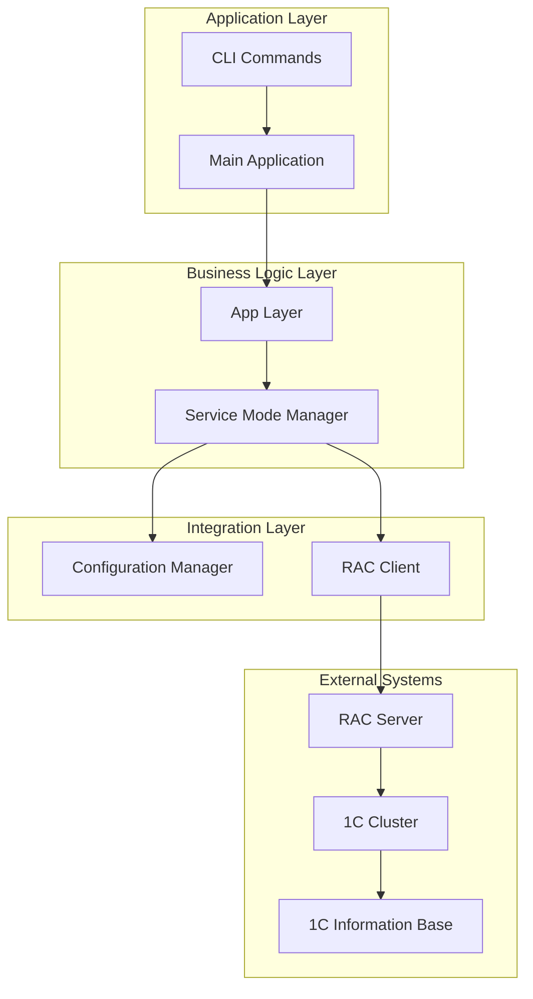
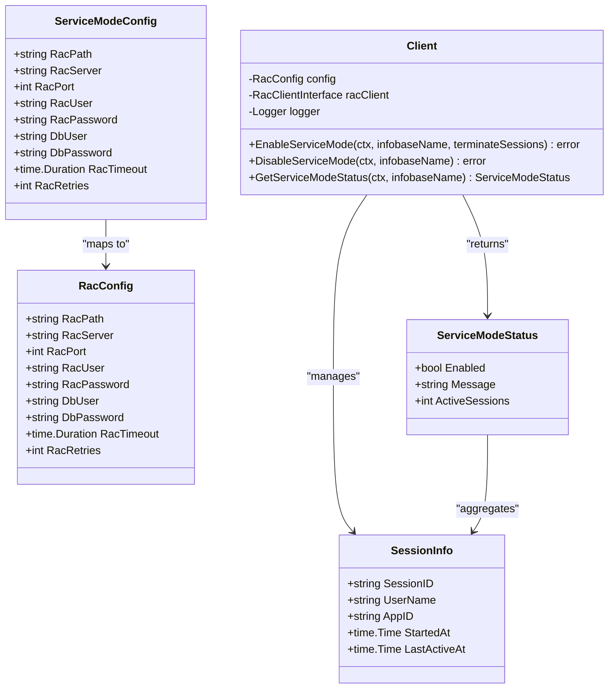
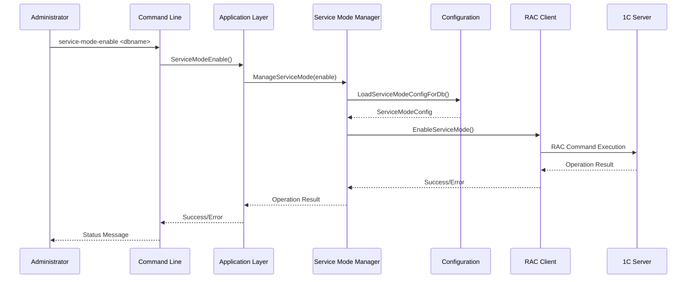
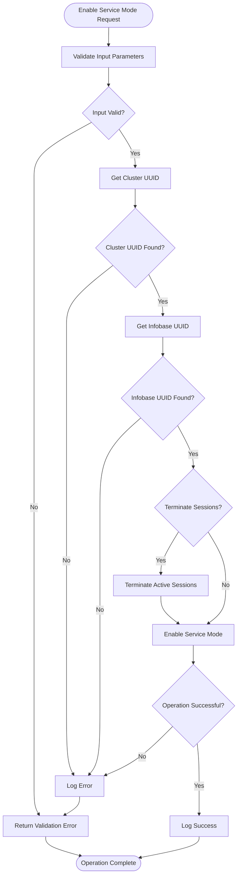
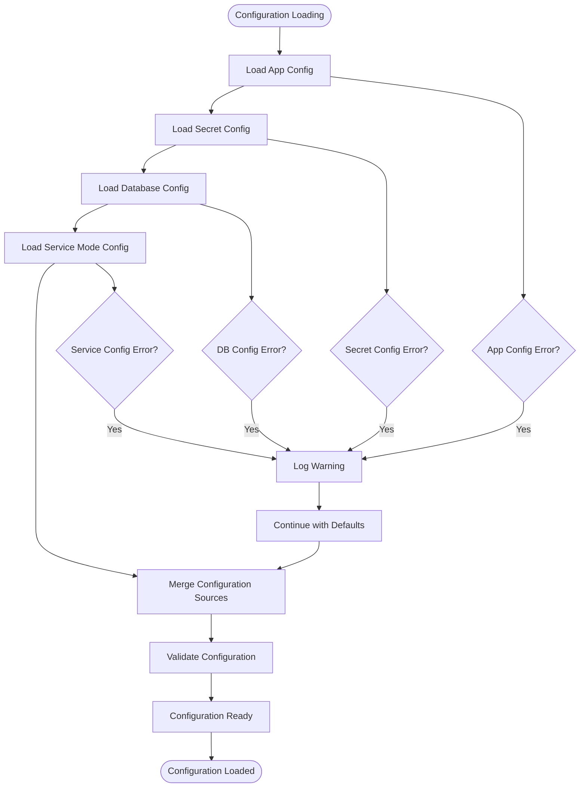
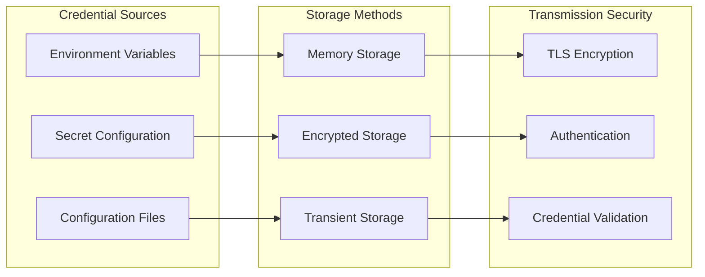

# 1C:Enterprise Platform Integration

<cite>
**Referenced Files in This Document**
- [servicemode.go](file://internal/servicemode/servicemode.go)
- [service_mode.go](file://internal/rac/service_mode.go)
- [rac.go](file://internal/rac/rac.go)
- [config.go](file://internal/config/config.go)
- [constants.go](file://internal/constants/constants.go)
- [main.go](file://cmd/benadis-runner/main.go)
- [app.go](file://internal/app/app.go)
- [servicemode_test.go](file://internal/servicemode/servicemode_test.go)
</cite>

## Table of Contents
1. [Introduction](#introduction)
2. [Architecture Overview](#architecture-overview)
3. [Domain Model](#domain-model)
4. [Service Mode Management](#service-mode-management)
5. [Configuration Management](#configuration-management)
6. [Error Handling](#error-handling)
7. [Security Considerations](#security-considerations)
8. [Usage Examples](#usage-examples)
9. [Troubleshooting Guide](#troubleshooting-guide)
10. [Best Practices](#best-practices)

## Introduction

The 1C:Enterprise platform integration in benadis-runner provides comprehensive service mode management capabilities for 1C information bases. This system enables administrators to control access to 1C databases through Remote Administration Console (RAC) commands, allowing for safe maintenance operations, updates, and administrative tasks while preventing user interference.

The integration consists of several key components that work together to provide a robust, secure, and reliable service mode management solution. The system supports three primary operations: enabling service mode, disabling service mode, and checking the current service mode status for 1C information bases.

## Architecture Overview

The service mode management system follows a layered architecture with clear separation of concerns:



**Diagram sources**
- [main.go](file://cmd/benadis-runner/main.go#L1-L50)
- [app.go](file://internal/app/app.go#L1-L100)
- [servicemode.go](file://internal/servicemode/servicemode.go#L1-L50)

The architecture ensures loose coupling between components while maintaining clear interfaces for extensibility and testing.

## Domain Model

### Core Entities

The service mode management system revolves around several key domain entities:



**Diagram sources**
- [servicemode.go](file://internal/servicemode/servicemode.go#L80-L120)
- [service_mode.go](file://internal/rac/service_mode.go#L15-L45)

### Connection Parameters

The system manages various connection parameters for secure communication with 1C systems:

- **RAC Path**: Absolute path to the RAC executable
- **RAC Server**: Hostname or IP address of the RAC server
- **RAC Port**: Port number for RAC communication (default: 1545)
- **RAC User**: Administrative username for RAC access
- **RAC Password**: Password for RAC authentication
- **Database User**: Database username for information base access
- **Database Password**: Database password for information base access
- **Timeout**: Maximum duration for RAC operations
- **Retries**: Number of retry attempts for failed operations

**Section sources**
- [servicemode.go](file://internal/servicemode/servicemode.go#L80-L95)
- [config.go](file://internal/config/config.go#L820-L850)

## Service Mode Management

### Service Mode Operations

The service mode management system provides three primary operations:



**Diagram sources**
- [app.go](file://internal/app/app.go#L200-L250)
- [servicemode.go](file://internal/servicemode/servicemode.go#L200-L250)

### Enable Service Mode

The `EnableServiceMode` operation performs the following steps:

1. **Validation**: Ensures the information base name is not empty
2. **UUID Resolution**: Retrieves cluster and information base UUIDs
3. **Session Management**: Optionally terminates active user sessions
4. **Service Mode Activation**: Executes RAC command to enable service mode
5. **Verification**: Confirms successful activation



**Diagram sources**
- [servicemode.go](file://internal/servicemode/servicemode.go#L300-L350)
- [service_mode.go](file://internal/rac/service_mode.go#L30-L80)

### Disable Service Mode

The `DisableServiceMode` operation reverses the enable process:

1. **UUID Resolution**: Retrieves cluster and information base UUIDs
2. **Status Check**: Determines current service mode state
3. **Service Mode Deactivation**: Executes RAC command to disable service mode
4. **Cleanup**: Removes service mode restrictions

### Status Monitoring

The `GetServiceModeStatus` operation provides real-time monitoring:

1. **UUID Resolution**: Retrieves cluster and information base UUIDs
2. **Status Query**: Executes RAC command to get current status
3. **Session Count**: Retrieves active session information
4. **Result Formatting**: Returns structured status information

**Section sources**
- [servicemode.go](file://internal/servicemode/servicemode.go#L350-L450)
- [service_mode.go](file://internal/rac/service_mode.go#L150-L200)

## Configuration Management

### Configuration Loading Process

The system employs a hierarchical configuration loading mechanism:



**Diagram sources**
- [config.go](file://internal/config/config.go#L820-L870)
- [config.go](file://internal/config/config.go#L1200-L1250)

### Environment Variables and Parameterization

The system supports multiple configuration sources with precedence:

1. **Environment Variables**: Highest priority
2. **Configuration Files**: YAML-based configuration
3. **Default Values**: Built-in fallback values

Key environment variables for service mode configuration:

- `SERVICE_RAC_PATH`: Path to RAC executable
- `SERVICE_RAC_SERVER`: RAC server hostname/IP
- `SERVICE_RAC_PORT`: RAC server port (default: 1545)
- `SERVICE_RAC_USER`: RAC administrative username
- `SERVICE_RAC_PASSWORD`: RAC password
- `SERVICE_DB_USER`: Database username
- `SERVICE_DB_PASSWORD`: Database password
- `SERVICE_RAC_TIMEOUT`: Operation timeout (default: 30s)
- `SERVICE_RAC_RETRIES`: Retry attempts (default: 3)

**Section sources**
- [config.go](file://internal/config/config.go#L820-L870)
- [constants.go](file://internal/constants/constants.go#L1-L50)

## Error Handling

### Error Categories

The system handles several categories of errors:

```mermaid
graph TB
subgraph "Connection Errors"
CE1[Network Unreachable]
CE2[Authentication Failed]
CE3[Timeout]
end
subgraph "Resource Errors"
RE1[Infobase Not Found]
RE2[Locked Infobase]
RE3[Insufficient Permissions]
end
subgraph "Operational Errors"
OE1[Command Execution Failed]
OE2[UUID Resolution Failed]
OE3[Session Termination Failed]
end
subgraph "Configuration Errors"
CEE1[Missing Configuration]
CEE2[Invalid Credentials]
CEE3[Malformed Parameters]
end
CE1 --> ErrorHandler[Error Handler]
CE2 --> ErrorHandler
CE3 --> ErrorHandler
RE1 --> ErrorHandler
RE2 --> ErrorHandler
RE3 --> ErrorHandler
OE1 --> ErrorHandler
OE2 --> ErrorHandler
OE3 --> ErrorHandler
CEE1 --> ErrorHandler
CEE2 --> ErrorHandler
CEE3 --> ErrorHandler
```



### Error Recovery Strategies

The system implements several error recovery mechanisms:

1. **Retry Logic**: Automatic retry with exponential backoff
2. **Fallback Configuration**: Graceful degradation with default values
3. **Partial Success Handling**: Continue operation despite individual failures
4. **Logging and Monitoring**: Comprehensive error logging for troubleshooting

### Common Error Scenarios

#### Infobase Not Found
- **Cause**: Information base name does not exist or is misspelled
- **Solution**: Verify database name and check cluster configuration
- **Prevention**: Implement database existence validation

#### Access Denied
- **Cause**: Insufficient permissions for RAC or database operations
- **Solution**: Verify user credentials and permission assignments
- **Prevention**: Implement role-based access control validation

#### Timeout During Service Mode Transition
- **Cause**: Network latency or server overload
- **Solution**: Increase timeout values and implement retry logic
- **Prevention**: Monitor server health and optimize network configuration

**Section sources**
- [rac.go](file://internal/rac/rac.go#L70-L120)
- [service_mode.go](file://internal/rac/service_mode.go#L400-L450)

## Security Considerations

### Credential Storage and Transmission

The system implements secure credential management practices:



### Production Environment Security

For production 1C environments, the system emphasizes:

1. **Secure Credential Storage**: Use encrypted secret management systems
2. **Network Security**: Implement VPN or dedicated network segments
3. **Access Control**: Role-based access with least privilege principle
4. **Audit Logging**: Comprehensive logging of all administrative actions
5. **Certificate Management**: Proper SSL/TLS certificate handling

### Best Practices for Production Deployment

- **Separate Environments**: Use distinct configurations for development, testing, and production
- **Credential Rotation**: Regular rotation of administrative credentials
- **Network Segmentation**: Isolate 1C infrastructure from public networks
- **Monitoring**: Implement comprehensive monitoring and alerting
- **Backup Strategy**: Regular backups of configuration and operational data

## Usage Examples

### Basic Service Mode Operations

#### Enable Service Mode
```bash
# Enable service mode with session termination
export BR_COMMAND="service-mode-enable"
export BR_INFOBASE_NAME="MyDatabase"
export BR_TERMINATE_SESSIONS="true"
./benadis-runner

# Enable service mode without terminating sessions
export BR_TERMINATE_SESSIONS="false"
./benadis-runner
```

#### Disable Service Mode
```bash
# Disable service mode
export BR_COMMAND="service-mode-disable"
export BR_INFOBASE_NAME="MyDatabase"
./benadis-runner
```

#### Check Service Mode Status
```bash
# Check current service mode status
export BR_COMMAND="service-mode-status"
export BR_INFOBASE_NAME="MyDatabase"
./benadis-runner
```

### Advanced Configuration Examples

#### Using Configuration Files
```yaml
# app.yaml
rac:
  port: 1545
  timeout: 30
  retries: 3
users:
  rac: admin
  db: db_user
paths:
  rac: /opt/1cv8/x86_64/8.3.27.1606/rac
```

```yaml
# secret.yaml
passwords:
  rac: secure_password_here
  db: database_password_here
```

```yaml
# dbconfig.yaml
MyDatabase:
  one-server: 192.168.1.100
  prod: true
  dbserver: sql-server.company.com
```

#### Environment Variable Configuration
```bash
# Set environment variables
export SERVICE_RAC_PATH="/opt/1cv8/x86_64/8.3.27.1606/rac"
export SERVICE_RAC_SERVER="192.168.1.100"
export SERVICE_RAC_PORT="1545"
export SERVICE_RAC_USER="admin"
export SERVICE_RAC_PASSWORD="secure_password"
export SERVICE_DB_USER="db_user"
export SERVICE_DB_PASSWORD="database_password"
export SERVICE_RAC_TIMEOUT="30s"
export SERVICE_RAC_RETRIES="3"
```

**Section sources**
- [main.go](file://cmd/benadis-runner/main.go#L50-L100)
- [app.go](file://internal/app/app.go#L200-L250)

## Troubleshooting Guide

### Common Issues and Solutions

#### Issue: RAC Connection Failed
**Symptoms**: Connection timeout or authentication errors
**Diagnosis Steps**:
1. Verify RAC server accessibility
2. Check network connectivity
3. Validate RAC credentials
4. Confirm RAC server status

**Resolution**:
```bash
# Test RAC connectivity manually
/opt/1cv8/x86_64/8.3.27.1606/rac 192.168.1.100:1545 --cluster-user=admin --cluster-pwd=password
```

#### Issue: Information Base Not Found
**Symptoms**: "Infobase not found" error messages
**Diagnosis Steps**:
1. Verify database name spelling
2. Check cluster configuration
3. Confirm database exists on server
4. Validate cluster UUID resolution

**Resolution**:
```bash
# List available information bases
/opt/1cv8/x86_64/8.3.27.1606/rac 192.168.1.100:1545 infobase list
```

#### Issue: Service Mode Stuck in Transition
**Symptoms**: Service mode appears to be stuck in enabling/disabling state
**Diagnosis Steps**:
1. Check active sessions
2. Verify RAC command completion
3. Review operation logs
4. Monitor server resources

**Resolution**:
```bash
# Force session termination
/opt/1cv8/x86_64/8.3.27.1606/rac 192.168.1.100:1545 session terminate --session=session_uuid
```

### Diagnostic Commands

#### Check Service Mode Status
```bash
# Manual status check
/opt/1cv8/x86_64/8.3.27.1606/rac 192.168.1.100:1545 infobase info \
  --cluster=cluster_uuid --infobase=infobase_uuid
```

#### List Active Sessions
```bash
# Check for active sessions
/opt/1cv8/x86_64/8.3.27.1606/rac 192.168.1.100:1545 session list \
  --cluster=cluster_uuid --infobase=infobase_uuid
```

#### Verify Cluster Configuration
```bash
# Check cluster status
/opt/1cv8/x86_64/8.3.27.1606/rac 192.168.1.100:1545 cluster info
```

### Log Analysis

The system provides comprehensive logging for troubleshooting:

```bash
# Enable debug logging
export INPUT_LOGLEVEL="Debug"
./benadis-runner

# Check logs for specific operations
grep "service-mode" /var/log/benadis-runner.log
```

**Section sources**
- [rac.go](file://internal/rac/rac.go#L150-L200)
- [service_mode.go](file://internal/rac/service_mode.go#L400-L450)

## Best Practices

### Operational Guidelines

1. **Pre-Operation Checklist**:
   - Verify database availability
   - Check network connectivity
   - Confirm user permissions
   - Backup critical data

2. **Maintenance Window Planning**:
   - Schedule during low-usage periods
   - Notify affected users
   - Prepare rollback procedures
   - Monitor system health

3. **Session Management**:
   - Use session termination judiciously
   - Communicate with users before termination
   - Monitor user impact
   - Implement graceful shutdown procedures

4. **Monitoring and Alerting**:
   - Set up alerts for service mode transitions
   - Monitor system performance during operations
   - Track user session activity
   - Log all administrative actions

### Configuration Management

1. **Environment Separation**:
   - Use separate configurations for different environments
   - Implement configuration validation
   - Maintain version control for configurations
   - Document configuration changes

2. **Security Hardening**:
   - Rotate credentials regularly
   - Use least privilege access
   - Implement network segmentation
   - Monitor access patterns

3. **Documentation and Training**:
   - Document operational procedures
   - Train administrators on service mode operations
   - Maintain runbooks for common scenarios
   - Conduct regular training sessions

### Performance Optimization

1. **Network Optimization**:
   - Use dedicated network connections
   - Implement Quality of Service (QoS)
   - Monitor network latency
   - Optimize bandwidth allocation

2. **Resource Management**:
   - Monitor server resource utilization
   - Implement resource limits
   - Optimize database performance
   - Use appropriate timeouts

3. **Automation and Monitoring**:
   - Automate routine operations
   - Implement comprehensive monitoring
   - Set up automated alerts
   - Use dashboards for visibility

The 1C:Enterprise platform integration provides a robust foundation for managing service mode operations in production environments. By following these guidelines and best practices, organizations can ensure reliable, secure, and efficient administration of their 1C information bases while minimizing disruption to end-users and maintaining system integrity.