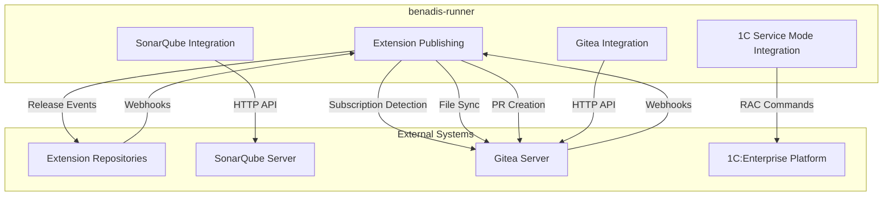
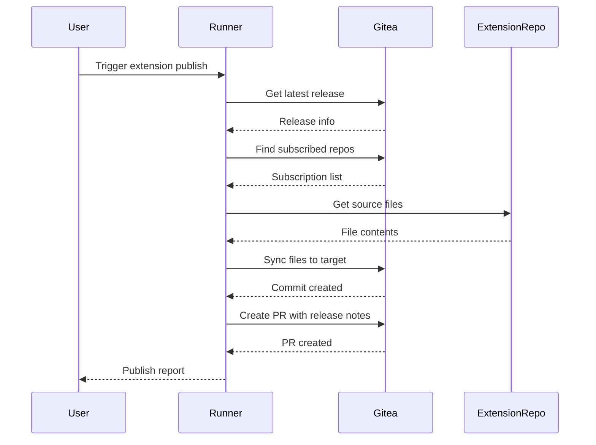

# Advanced Integrations

<cite>
**Referenced Files in This Document**
- [extension_publish.go](file://internal/app/extension_publish.go)
- [extension_publish_integration_test.go](file://internal/app/extension_publish_integration_test.go)
- [gitea.go](file://internal/entity/gitea/gitea.go)
- [interfaces.go](file://internal/entity/gitea/interfaces.go)
- [sonarqube.go](file://internal/entity/sonarqube/sonarqube.go)
- [service.go](file://internal/entity/sonarqube/service.go)
- [branch_scanner.go](file://internal/entity/sonarqube/branch_scanner.go)
- [servicemode.go](file://internal/servicemode/servicemode.go)
- [sonarqube.go](file://internal/config/sonarqube.go)
- [extension-publish.md](file://docs/epics/extension-publish.md)
- [external-extension-workflow.md](file://docs/diagrams/external-extension-workflow.md)
</cite>

## Update Summary
**Changes Made**
- Added comprehensive documentation for new Extension Publishing functionality
- Enhanced Gitea Integration section with new API methods for release management
- Updated authentication mechanisms to include new Gitea API endpoints
- Added new data flow diagrams for extension publishing workflow
- Expanded troubleshooting guide with extension publishing scenarios

## Table of Contents
1. [Introduction](#introduction)
2. [Extension Publishing Integration](#extension-publishing-integration)
3. [Enhanced Gitea Integration](#enhanced-gitea-integration)
4. [SonarQube Integration](#sonarqube-integration)
5. [1C:Enterprise Service Mode Integration](#1centerprise-service-mode-integration)
6. [Authentication Mechanisms](#authentication-mechanisms)
7. [API Rate Limiting and Error Recovery](#api-rate-limiting-and-error-recovery)
8. [Data Flow Diagrams](#data-flow-diagrams)
9. [Troubleshooting Guide](#troubleshooting-guide)

## Introduction
This document provides comprehensive documentation for the advanced integration features in benadis-runner, focusing on four key external systems: Extension Publishing for automated distribution, SonarQube for code quality analysis, Gitea for version control operations, and 1C:Enterprise platform for service mode management. The integrations enable automated code scanning, repository management, extension distribution, and database maintenance operations within the CI/CD pipeline. Each integration follows a modular design with dedicated services, configuration management, and error handling strategies to ensure reliable operation.

## Extension Publishing Integration

The Extension Publishing integration enables benadis-runner to automatically distribute 1C:Enterprise extensions to subscribed repositories through a sophisticated subscription-based mechanism. This functionality addresses the challenge of maintaining consistent extension versions across multiple projects by automating the distribution process triggered by release events.

The core functionality is implemented in the `ExtensionPublish` function within `internal/app/extension_publish.go`, which orchestrates the complete extension distribution workflow. The system operates on a subscription model where target repositories create special subscription branches in the format `{Org}_{Repo}_{ExtDir}` to indicate their interest in receiving extension updates.

### Subscription Management System

The subscription detection mechanism works by scanning all accessible repositories for branches matching the subscription pattern. The `FindSubscribedRepos` function generates branch patterns based on the current repository owner, repository name, and extension directories, then systematically checks each organization's repositories for matching subscription branches.

For each detected subscription, the system performs a comprehensive analysis of the target repository structure using the `AnalyzeProject` method to determine the correct project naming conventions and extension directory mappings. This ensures that files are placed in the appropriate locations within each target project.

### File Synchronization Process

The file synchronization process involves three distinct phases: source file collection, target file preparation, and batch commit execution. The `GetSourceFiles` function recursively enumerates all files in the source extension directory, encoding their contents in base64 format for transmission to the Gitea API. The `GetTargetFilesToDelete` function identifies existing files in the target directory that need to be removed to maintain synchronization.

The synchronization algorithm compares source and target file sets to determine the optimal operations: create for new files, update for modified files, and delete for files that no longer exist in the source. This approach ensures complete synchronization while minimizing unnecessary operations.

### Pull Request Automation

The integration automatically creates pull requests in each subscribed repository with comprehensive release information. The `BuildExtensionPRBody` function generates detailed markdown-formatted descriptions including version information, release notes, and source repository links. The `CreateExtensionPR` function handles the creation of pull requests with proper title formatting and branch targeting.

### Comprehensive Reporting System

The system provides detailed reporting capabilities through the `PublishReport` structure, which tracks the success or failure of each subscription operation. Reports include timing information, file counts, and error details for troubleshooting purposes. The reporting system supports both human-readable text output and machine-readable JSON format for integration with monitoring systems.

**Section sources**
- [extension_publish.go](file://internal/app/extension_publish.go#L1-L1253)
- [extension_publish_integration_test.go](file://internal/app/extension_publish_integration_test.go#L1-L297)
- [extension-publish.md](file://docs/epics/extension-publish.md#L1-L326)

## Enhanced Gitea Integration

The Gitea integration has been significantly enhanced to support the new extension publishing functionality and provides comprehensive API coverage for repository management operations. The integration extends beyond basic CRUD operations to include advanced features such as release management, organization enumeration, and sophisticated file synchronization capabilities.

### Release Management API

The integration now includes comprehensive release management capabilities through the `GetLatestRelease` and `GetReleaseByTag` methods. These functions provide access to Gitea's release API, enabling the extension publishing system to retrieve version information and release notes for automated distribution. The release retrieval methods handle URL encoding for tag names and provide robust error handling for cases where releases are not found.

### Organization and Repository Discovery

The enhanced integration includes sophisticated discovery mechanisms for finding subscribed repositories. The `GetUserOrganizations` method provides paginated access to all organizations accessible by the authenticated user, with built-in safeguards against infinite loops through configurable page limits. The `SearchOrgRepos` method enables comprehensive repository enumeration with automatic pagination support.

### Advanced File Operations

The file synchronization system leverages the `SetRepositoryStateWithNewBranch` method, which enables atomic batch operations that create new branches and apply multiple file modifications in a single commit. This approach ensures consistency and prevents partial updates during the synchronization process.

The file operations system supports three operation types: create for new files, update for modified files, and delete for removed files. Each operation maintains proper file metadata including SHA hashes for update operations and full path specifications for accurate file placement.

### Subscription Branch Management

The integration includes specialized methods for subscription branch management, including the `HasBranch` method that efficiently checks for the existence of subscription branches without retrieving full branch details. This optimization reduces API calls during the subscription discovery process.

### Enhanced Project Analysis

The `AnalyzeProject` method has been enhanced to provide more sophisticated project structure analysis, supporting complex 1C:Enterprise project configurations with multiple extension directories. The analysis determines the correct project naming conventions and extension directory mappings for accurate file placement.

**Section sources**
- [gitea.go](file://internal/entity/gitea/gitea.go#L1180-L1246)
- [gitea.go](file://internal/entity/gitea/gitea.go#L1461-L1528)
- [gitea.go](file://internal/entity/gitea/gitea.go#L2109-L2182)
- [gitea.go](file://internal/entity/gitea/gitea.go#L1705-L1751)

## SonarQube Integration

The SonarQube integration in benadis-runner provides comprehensive code quality analysis capabilities through a multi-layered architecture that handles branch scanning, pull request analysis, and report generation. The integration is implemented across several components in the `internal/entity/sonarqube` package, with the core functionality centered around the `BranchScannerEntity` and `SonarScannerService` classes.

The scanning workflow begins with the `ScanBranch` method in `branch_scanner.go`, which orchestrates the complete analysis process. When initiated, the scanner first retrieves Git metadata for the specified branch using the `GetBranchMetadata` method, capturing essential information such as commit hash, author, timestamp, and whether the branch is the main branch. This metadata is then used to configure the scanner with appropriate properties, including setting the `sonar.branch.name` property for non-main branches.

For pull request analysis, the integration follows a two-step process where it first identifies the source branch of the PR and then delegates to the branch scanning service to perform the actual analysis. The `HandleSQScanPR` command handler in `command_handler.go` coordinates this process by retrieving active PRs from Gitea, finding the requested PR, and creating appropriate scanning parameters. This approach ensures consistent analysis regardless of whether the trigger is a direct branch scan or a pull request event.

Report generation is handled by the reporting service component, which can generate detailed reports for pull requests, branches, and entire projects. The `HandleSQReportPR`, `HandleSQReportBranch`, and `HandleSQReportProject` methods in the command handler delegate to the reporting service to produce comprehensive analysis summaries that can be shared with development teams.

**Section sources**
- [branch_scanner.go](file://internal/entity/sonarqube/branch_scanner.go#L195-L244)
- [service.go](file://internal/entity/sonarqube/service.go#L0-L414)
- [command_handler.go](file://internal/service/sonarqube/command_handler.go#L0-L343)

## 1C:Enterprise Service Mode Integration

The 1C:Enterprise service mode integration allows benadis-runner to control the operational state of 1C databases through the Remote Administration Console (RAC). Implemented in the `internal/servicemode` package, this integration provides functions to enable, disable, and query the status of service mode for specified information bases.

The core component is the `Client` struct in `servicemode.go`, which manages connections to the RAC and executes commands to control service mode states. The `ManageServiceMode` function serves as the primary entry point, accepting parameters for the action (enable, disable, status), information base name, and configuration. This function validates the action, loads the appropriate RAC configuration, and creates a client instance to execute the requested operation.

When enabling service mode, the `EnableServiceMode` method first obtains the cluster UUID and information base UUID through the RAC client, then calls `EnableServiceMode` on the RAC interface with the option to terminate existing sessions. This ensures that no users can connect to the database during maintenance operations. The `terminateSessions` parameter controls whether active user sessions should be forcibly closed.

Disabling service mode follows a similar pattern, with the `DisableServiceMode` method obtaining the necessary UUIDs and calling the corresponding RAC function to restore normal operation. The `GetServiceModeStatus` method provides monitoring capabilities by returning detailed status information including whether service mode is enabled and the number of active sessions.

Configuration for the RAC connection is managed through the `RacConfig` struct, which contains parameters such as the RAC path, server address, port, authentication credentials, timeout settings, and retry attempts. This configuration can be loaded from environment variables, application configuration files, or passed directly to the client constructor.

**Section sources**
- [servicemode.go](file://internal/servicemode/servicemode.go#L0-L440)
- [rac.go](file://internal/rac/rac.go#L0-L100)

## Authentication Mechanisms

Each integration in benadis-runner implements secure authentication mechanisms appropriate to the target system. For SonarQube, authentication is handled through API tokens configured in the `SonarQubeConfig` struct. The token is stored in the `Token` field and passed in HTTP headers when making API requests to the SonarQube server. This token-based authentication provides secure access without requiring username/password credentials.

The Gitea integration uses personal access tokens for authentication, specified in the `AccessToken` field of the `Config` struct. These tokens are included in API requests as Bearer tokens in the Authorization header. The integration supports loading the token from environment variables, configuration files, or direct assignment, with environment variables taking precedence for security reasons.

For the 1C:Enterprise RAC integration, authentication involves both cluster-level and database-level credentials. The `RacConfig` struct contains fields for `RacUser` and `RacPassword` for authenticating with the RAC server, as well as optional `DbUser` and `DbPassword` for database-specific authentication. These credentials are passed to the RAC command-line tool when executing administrative commands.

**Section sources**
- [sonarqube.go](file://internal/config/sonarqube.go#L0-L252)
- [gitea.go](file://internal/entity/gitea/gitea.go#L179-L214)
- [servicemode.go](file://internal/servicemode/servicemode.go#L0-L440)

## API Rate Limiting and Error Recovery

The integrations implement robust error recovery strategies and respect API rate limiting to ensure reliable operation under various conditions. For SonarQube, the configuration includes `RetryAttempts` and `RetryDelay` parameters that control how many times failed requests should be retried and the initial delay between attempts, which increases exponentially for subsequent retries.

The SonarQube integration also includes timeouts at multiple levels: `Timeout` for API requests and `QualityGateTimeout` for waiting on quality gate status. These timeouts prevent operations from hanging indefinitely and allow the system to recover from unresponsive servers.

For Gitea operations, the integration handles common HTTP errors such as rate limiting (HTTP 429) and server errors (HTTP 5xx) by implementing retry logic with exponential backoff. The `sendReq` method in `gitea.go` captures HTTP status codes and returns appropriate errors that can be handled by higher-level components.

The 1C:Enterprise RAC integration includes built-in retry mechanisms through the `RacRetries` configuration parameter, which specifies how many times failed RAC commands should be retried. The `RacTimeout` parameter limits the execution time of individual commands, preventing indefinite hangs during network or server issues.

All integrations follow a consistent error handling pattern where errors are logged with structured logging, wrapped with context about the operation being performed, and returned to calling components for appropriate action. This allows higher-level workflows to implement custom recovery strategies based on the type and context of errors encountered.

**Section sources**
- [sonarqube.go](file://internal/config/sonarqube.go#L0-L252)
- [gitea.go](file://internal/entity/gitea/gitea.go#L0-L199)
- [servicemode.go](file://internal/servicemode/servicemode.go#L0-L440)

## Data Flow Diagrams

**Diagram sources**
- [extension_publish.go](file://internal/app/extension_publish.go#L979-L1253)
- [gitea.go](file://internal/entity/gitea/gitea.go#L0-L50)
- [servicemode.go](file://internal/servicemode/servicemode.go#L0-L50)

**Diagram sources**
- [extension_publish.go](file://internal/app/extension_publish.go#L979-L1253)
- [gitea.go](file://internal/entity/gitea/gitea.go#L1180-L1246)

## Troubleshooting Guide

Common integration issues and their solutions:

**Connection Timeouts**: For SonarQube and Gitea integrations, increase the `Timeout` configuration value. For 1C RAC operations, adjust the `RacTimeout` parameter. Ensure network connectivity between benadis-runner and the target systems.

**Authentication Failures**: Verify that authentication tokens and credentials are correctly configured in environment variables or configuration files. Check that tokens have not expired and have the required permissions for the operations being performed.

**Data Synchronization Problems**: For Gitea batch operations, ensure that the base branch has not changed since the operations were prepared. Use the `GetBranchCommitRange` method to verify branch state before applying changes.

**Rate Limiting Issues**: Implement exponential backoff in custom scripts if encountering HTTP 429 errors. For SonarQube, reduce the frequency of API calls or contact your administrator to increase rate limits.

**Service Mode Operations Failing**: Verify RAC connectivity and credentials. Check that the RAC path is correct and the executable is available. Ensure the 1C cluster is running and accessible from the runner environment.

**Extension Publishing Failures**: Verify that subscription branches exist in the correct format `{Org}_{Repo}_{ExtDir}`. Check that the source repository contains valid extension files and that the target repositories have the correct project structure. Ensure that release tags exist and contain the expected version information.

**Scan Failures**: Check that the working directory contains valid source code and that sonar-scanner has the necessary permissions to read files. Verify that the SonarQube project key is correctly formatted and does not contain invalid characters.

**Subscription Detection Issues**: Verify that the Gitea token has sufficient permissions to enumerate organizations and repositories. Check that the subscription branch names follow the required format and that the target repositories are accessible to the authenticated user.

**Section sources**
- [extension_publish.go](file://internal/app/extension_publish.go#L979-L1253)
- [gitea.go](file://internal/entity/gitea/gitea.go#L0-L199)
- [servicemode.go](file://internal/servicemode/servicemode.go#L0-L440)