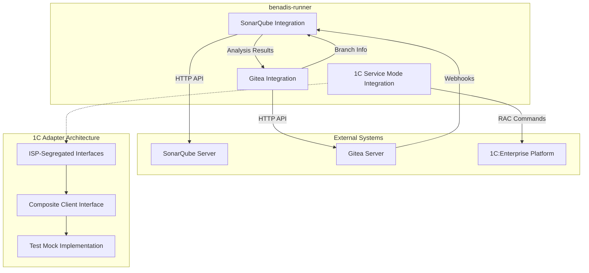
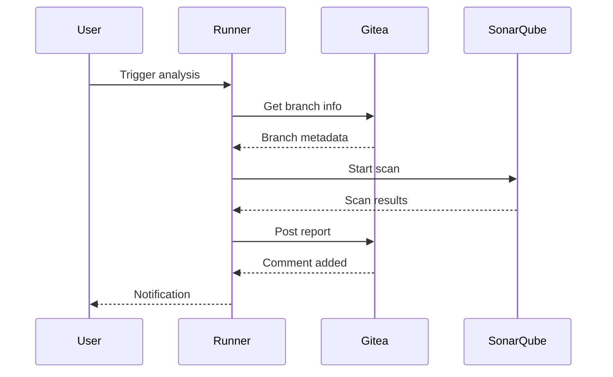

# Advanced Integrations

<cite>
**Referenced Files in This Document**   
- [sonarqube.go](file://internal/entity/sonarqube/sonarqube.go)
- [service.go](file://internal/entity/sonarqube/service.go)
- [branch_scanner.go](file://internal/entity/sonarqube/branch_scanner.go)
- [gitea.go](file://internal/entity/gitea/gitea.go)
- [interfaces.go](file://internal/entity/gitea/interfaces.go)
- [servicemode.go](file://internal/servicemode/servicemode.go)
- [sonarqube.go](file://internal/config/sonarqube.go)
- [client.go](file://internal/adapter/onec/rac/client.go)
- [interfaces.go](file://internal/adapter/onec/rac/interfaces.go)
- [mock.go](file://internal/adapter/onec/rac/ractest/mock.go)
- [client_test.go](file://internal/adapter/onec/rac/client_test.go)
- [interfaces_test.go](file://internal/adapter/onec/rac/interfaces_test.go)
- [rac.go](file://internal/rac/rac.go)
- [service_mode.go](file://internal/rac/service_mode.go)
</cite>

## Update Summary
**Changes Made**   
- Updated 1C:Enterprise Service Mode Integration section to reflect new ISP-segregated RAC adapter implementation
- Added documentation for composite Client interface and interface segregation principle
- Documented flexible mock implementation for unit testing without requiring real 1C server
- Updated architecture diagrams to show new adapter structure
- Enhanced troubleshooting guidance for new adapter implementation

## Table of Contents
1. [Introduction](#introduction)
2. [SonarQube Integration](#sonarqube-integration)
3. [Gitea Integration](#gitea-integration)
4. [1C:Enterprise Service Mode Integration](#1centerprise-service-mode-integration)
5. [Authentication Mechanisms](#authentication-mechanisms)
6. [API Rate Limiting and Error Recovery](#api-rate-limiting-and-error-recovery)
7. [Data Flow Diagrams](#data-flow-diagrams)
8. [Troubleshooting Guide](#troubleshooting-guide)

## Introduction
This document provides comprehensive documentation for the advanced integration features in benadis-runner, focusing on three key external systems: SonarQube for code quality analysis, Gitea for version control operations, and 1C:Enterprise platform for service mode management. The integrations enable automated code scanning, repository management, and database maintenance operations within the CI/CD pipeline. Each integration follows a modular design with dedicated services, configuration management, and error handling strategies to ensure reliable operation.

## SonarQube Integration

The SonarQube integration in benadis-runner provides comprehensive code quality analysis capabilities through a multi-layered architecture that handles branch scanning, pull request analysis, and report generation. The integration is implemented across several components in the `internal/entity/sonarqube` package, with the core functionality centered around the `BranchScannerEntity` and `SonarScannerService` classes.

The scanning workflow begins with the `ScanBranch` method in `branch_scanner.go`, which orchestrates the complete analysis process. When initiated, the scanner first retrieves Git metadata for the specified branch using the `GetBranchMetadata` method, capturing essential information such as commit hash, author, timestamp, and whether the branch is the main branch. This metadata is then used to configure the scanner with appropriate properties, including setting the `sonar.branch.name` property for non-main branches.

For pull request analysis, the integration follows a two-step process where it first identifies the source branch of the PR and then delegates to the branch scanning service to perform the actual analysis. The `HandleSQScanPR` command handler in `command_handler.go` coordinates this process by retrieving active PRs from Gitea, finding the requested PR, and creating appropriate scanning parameters. This approach ensures consistent analysis regardless of whether the trigger is a direct branch scan or a pull request event.

Report generation is handled by the reporting service component, which can generate detailed reports for pull requests, branches, and entire projects. The `HandleSQReportPR`, `HandleSQReportBranch`, and `HandleSQReportProject` methods in the command handler delegate to the reporting service to produce comprehensive analysis summaries that can be shared with development teams.

**Section sources**
- [branch_scanner.go](file://internal/entity/sonarqube/branch_scanner.go#L195-L244)
- [service.go](file://internal/entity/sonarqube/service.go#L0-L414)
- [command_handler.go](file://internal/service/sonarqube/command_handler.go#L0-L343)

## Gitea Integration

The Gitea integration enables benadis-runner to perform various repository operations through the Gitea REST API. Implemented in the `internal/entity/gitea` package, this integration provides functionality for branch management, issue tracking, and batch file operations. The core component is the `API` struct defined in `gitea.go`, which encapsulates all interactions with the Gitea server.

For branch management, the integration supports creating and deleting test branches through the `CreateTestBranch` and `DeleteTestBranch` methods. These operations are essential for implementing safe testing workflows where changes can be evaluated in isolated environments before being merged into main branches. The `ActivePR` method retrieves all currently open pull requests, enabling automated processing of pending merge requests.

Issue tracking capabilities allow the system to retrieve issue details with `GetIssue`, add comments with `AddIssueComment`, and close issues with `CloseIssue`. These functions support automated issue management workflows, such as updating tickets with analysis results or closing tasks when associated code changes are merged.

A powerful feature of the Gitea integration is the batch operations capability through the `SetRepositoryState` method. This function accepts an array of `ChangeFileOperation` objects, each specifying an operation (create, update, delete) on a specific file path. This enables atomic updates to multiple files in a single commit, maintaining repository consistency during complex configuration changes.

The integration also includes project analysis functionality through the `AnalyzeProject` and `AnalyzeProjectStructure` methods, which examine repository contents to identify project characteristics and file organization patterns. This information can be used for automated configuration and optimization of subsequent processing steps.

**Section sources**
- [gitea.go](file://internal/entity/gitea/gitea.go#L179-L214)
- [gitea.go](file://internal/entity/gitea/gitea.go#L798-L828)
- [gitea.go](file://internal/entity/gitea/gitea.go#L231-L265)
- [interfaces.go](file://internal/entity/gitea/interfaces.go#L0-L56)

## 1C:Enterprise Service Mode Integration

**Updated** The 1C:Enterprise service mode integration has been completely redesigned with a modern adapter architecture that implements Interface Segregation Principle (ISP) and provides flexible testing capabilities.

The new implementation is organized in the `internal/adapter/onec/rac` package with a clean separation of concerns through specialized interfaces. The core architecture consists of four focused interfaces: `ClusterProvider`, `InfobaseProvider`, `SessionProvider`, and `ServiceModeManager`, which are combined into a composite `Client` interface.

The `ClusterProvider` interface handles cluster-level operations, providing the `GetClusterInfo` method for retrieving cluster information. The `InfobaseProvider` interface manages information base operations with `GetInfobaseInfo` for fetching base details. The `SessionProvider` interface controls user session management through `GetSessions`, `TerminateSession`, and `TerminateAllSessions` methods. Finally, the `ServiceModeManager` interface handles service mode operations with `EnableServiceMode`, `DisableServiceMode`, `GetServiceModeStatus`, and `VerifyServiceMode`.

The implementation uses a `racClient` struct that satisfies all interface requirements, providing concrete implementations for each operation. The client supports comprehensive authentication through separate cluster and database credentials, with optional user/password combinations for both cluster administration and database access.

A sophisticated mock implementation is provided in the `ractest` subpackage, offering `MockRACClient` with customizable behavior through functional fields. This allows developers to create flexible test scenarios without requiring access to a real 1C server. The mock supports pre-defined behaviors through helper constructors like `NewMockRACClientWithSessions` and `NewMockRACClientWithServiceMode`, enabling comprehensive unit testing of service mode operations.

The new architecture maintains backward compatibility with the legacy `internal/rac` package while providing enhanced functionality and testability. The `servicemode` package now uses the new adapter through the `RacClientInterface`, which abstracts the underlying implementation details and enables seamless switching between real RAC operations and mock implementations during testing.

Key improvements in the new implementation include:
- **ISP Compliance**: Clear separation of concerns through focused interfaces
- **Flexible Testing**: Comprehensive mock implementation for unit testing
- **Enhanced Error Handling**: Structured error codes and detailed logging
- **Improved Authentication**: Separate credentials for cluster and database access
- **Better Type Safety**: Strongly typed data structures for all operations

**Section sources**
- [client.go](file://internal/adapter/onec/rac/client.go#L1-L559)
- [interfaces.go](file://internal/adapter/onec/rac/interfaces.go#L1-L109)
- [mock.go](file://internal/adapter/onec/rac/ractest/mock.go#L1-L197)
- [client_test.go](file://internal/adapter/onec/rac/client_test.go#L1-L469)
- [interfaces_test.go](file://internal/adapter/onec/rac/interfaces_test.go#L1-L474)
- [servicemode.go](file://internal/servicemode/servicemode.go#L1-L441)
- [rac.go](file://internal/rac/rac.go#L1-L331)
- [service_mode.go](file://internal/rac/service_mode.go#L1-L460)

## Authentication Mechanisms

Each integration in benadis-runner implements secure authentication mechanisms appropriate to the target system. For SonarQube, authentication is handled through API tokens configured in the `SonarQubeConfig` struct. The token is stored in the `Token` field and passed in HTTP headers when making API requests to the SonarQube server. This token-based authentication provides secure access without requiring username/password credentials.

The Gitea integration uses personal access tokens for authentication, specified in the `AccessToken` field of the `Config` struct. These tokens are included in API requests as Bearer tokens in the Authorization header. The integration supports loading the token from environment variables, configuration files, or direct assignment, with environment variables taking precedence for security reasons.

For the 1C:Enterprise RAC integration, authentication involves both cluster-level and database-level credentials. The new adapter architecture provides separate authentication fields for `ClusterUser`/`ClusterPass` and `InfobaseUser`/`InfobasePass`, allowing granular control over access permissions. The legacy `internal/rac` package maintained similar authentication patterns but with different field naming.

All authentication credentials are designed to be configurable through environment variables, allowing secure deployment in CI/CD environments without hardcoding sensitive information in configuration files. The configuration system prioritizes environment variables over other sources, enabling runtime specification of credentials.

**Section sources**
- [sonarqube.go](file://internal/config/sonarqube.go#L0-L252)
- [gitea.go](file://internal/entity/gitea/gitea.go#L179-L214)
- [servicemode.go](file://internal/servicemode/servicemode.go#L0-L440)
- [client.go](file://internal/adapter/onec/rac/client.go#L27-L47)

## API Rate Limiting and Error Recovery

The integrations implement robust error recovery strategies and respect API rate limiting to ensure reliable operation under various conditions. For SonarQube, the configuration includes `RetryAttempts` and `RetryDelay` parameters that control how many times failed requests should be retried and the initial delay between attempts, which increases exponentially for subsequent retries.

The SonarQube integration also includes timeouts at multiple levels: `Timeout` for API requests and `QualityGateTimeout` for waiting on quality gate status. These timeouts prevent operations from hanging indefinitely and allow the system to recover from unresponsive servers.

For Gitea operations, the integration handles common HTTP errors such as rate limiting (HTTP 429) and server errors (HTTP 5xx) by implementing retry logic with exponential backoff. The `sendReq` method in `gitea.go` captures HTTP status codes and returns appropriate errors that can be handled by higher-level components.

The 1C:Enterprise RAC integration includes built-in retry mechanisms through the `RacRetries` configuration parameter, which specifies how many times failed RAC commands should be retried. The `RacTimeout` parameter limits the execution time of individual commands, preventing indefinite hangs during network or server issues.

The new adapter architecture enhances error handling with structured error codes defined as constants (`ErrRACExec`, `ErrRACTimeout`, `ErrRACParse`, etc.), providing consistent error identification across all operations. The client implementation includes comprehensive logging with sensitive data masking for security.

All integrations follow a consistent error handling pattern where errors are logged with structured logging, wrapped with context about the operation being performed, and returned to calling components for appropriate action. This allows higher-level workflows to implement custom recovery strategies based on the type and context of errors encountered.

**Section sources**
- [sonarqube.go](file://internal/config/sonarqube.go#L0-L252)
- [gitea.go](file://internal/entity/gitea/gitea.go#L0-L199)
- [servicemode.go](file://internal/servicemode/servicemode.go#L0-L440)
- [client.go](file://internal/adapter/onec/rac/client.go#L17-L25)

## Data Flow Diagrams

**Diagram sources**
- [sonarqube.go](file://internal/entity/sonarqube/sonarqube.go#L0-L100)
- [gitea.go](file://internal/entity/gitea/gitea.go#L0-L50)
- [servicemode.go](file://internal/servicemode/servicemode.go#L0-L50)
- [interfaces.go](file://internal/adapter/onec/rac/interfaces.go#L1-L109)
- [client.go](file://internal/adapter/onec/rac/client.go#L1-L559)
- [mock.go](file://internal/adapter/onec/rac/ractest/mock.go#L1-L197)

**Diagram sources**
- [command_handler.go](file://internal/service/sonarqube/command_handler.go#L0-L343)
- [gitea.go](file://internal/entity/gitea/gitea.go#L0-L199)

## Troubleshooting Guide

Common integration issues and their solutions:

**Connection Timeouts**: For SonarQube and Gitea integrations, increase the `Timeout` configuration value. For 1C RAC operations, adjust the `RacTimeout` parameter. Ensure network connectivity between benadis-runner and the target systems.

**Authentication Failures**: Verify that authentication tokens and credentials are correctly configured in environment variables or configuration files. Check that tokens have not expired and have the required permissions for the operations being performed. For the new RAC adapter, ensure both cluster and database credentials are properly set if required.

**Data Synchronization Problems**: For Gitea batch operations, ensure that the base branch has not changed since the operations were prepared. Use the `GetBranchCommitRange` method to verify branch state before applying changes.

**Rate Limiting Issues**: Implement exponential backoff in custom scripts if encountering HTTP 429 errors. For SonarQube, reduce the frequency of API calls or contact your administrator to increase rate limits.

**Service Mode Operations Failing**: Verify RAC connectivity and credentials. Check that the RAC path is correct and the executable is available. Ensure the 1C cluster is running and accessible from the runner environment. For the new adapter, confirm that the `sanitizeArgs` function is properly masking sensitive credentials in logs.

**Adapter Migration Issues**: When migrating from the legacy `internal/rac` package to the new `internal/adapter/onec/rac` package, ensure that all interface implementations are updated to use the new `Client` interface with ISP-segregated components. The `RacClientInterface` in the `servicemode` package provides backward compatibility during transition.

**Unit Testing Problems**: For testing scenarios requiring mock RAC operations, use the `ractest` package's `MockRACClient` with appropriate helper constructors. The mock implementation supports customizable behavior through functional fields, eliminating the need for real 1C server access during development.

**Scan Failures**: Check that the working directory contains valid source code and that sonar-scanner has the necessary permissions to read files. Verify that the SonarQube project key is correctly formatted and does not contain invalid characters.

**Section sources**
- [sonarqube.go](file://internal/entity/sonarqube/sonarqube.go#L0-L100)
- [gitea.go](file://internal/entity/gitea/gitea.go#L0-L199)
- [servicemode.go](file://internal/servicemode/servicemode.go#L0-L440)
- [client.go](file://internal/adapter/onec/rac/client.go#L1-L559)
- [mock.go](file://internal/adapter/onec/rac/ractest/mock.go#L1-L197)