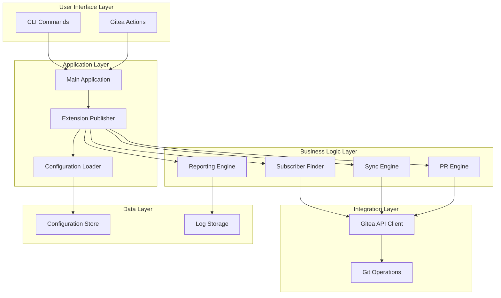
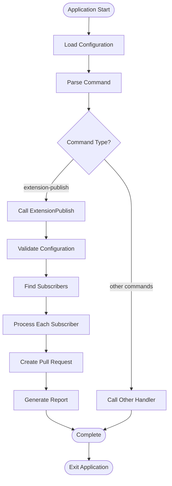
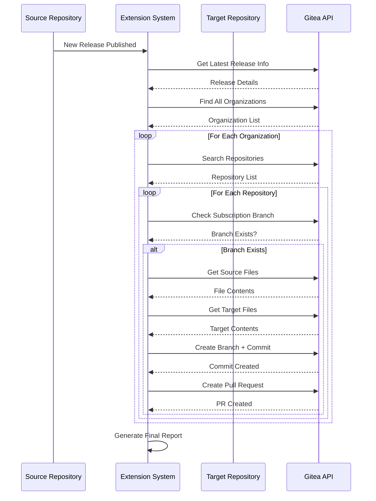
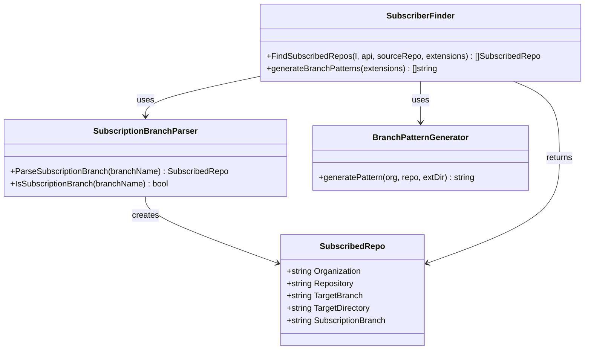
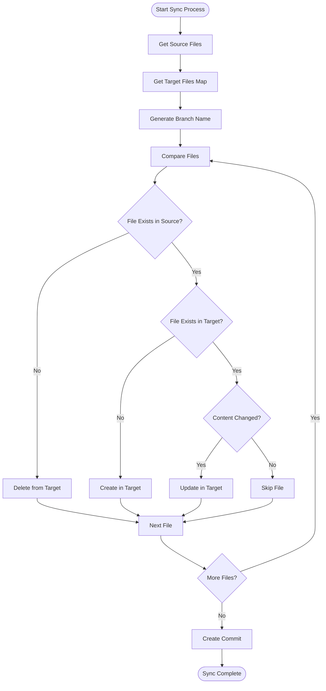
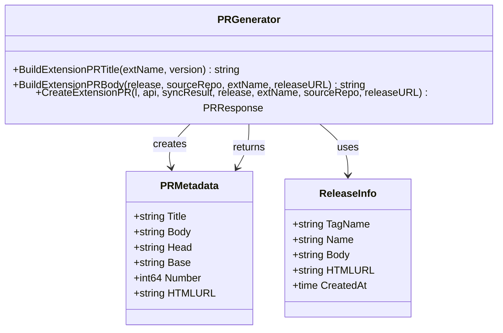
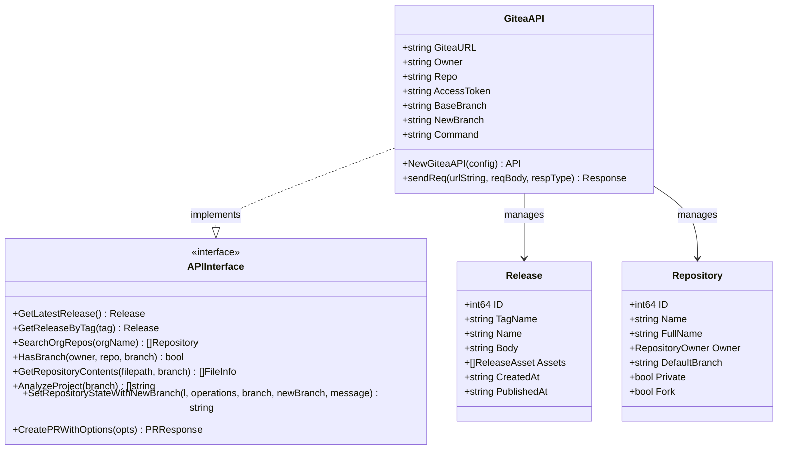
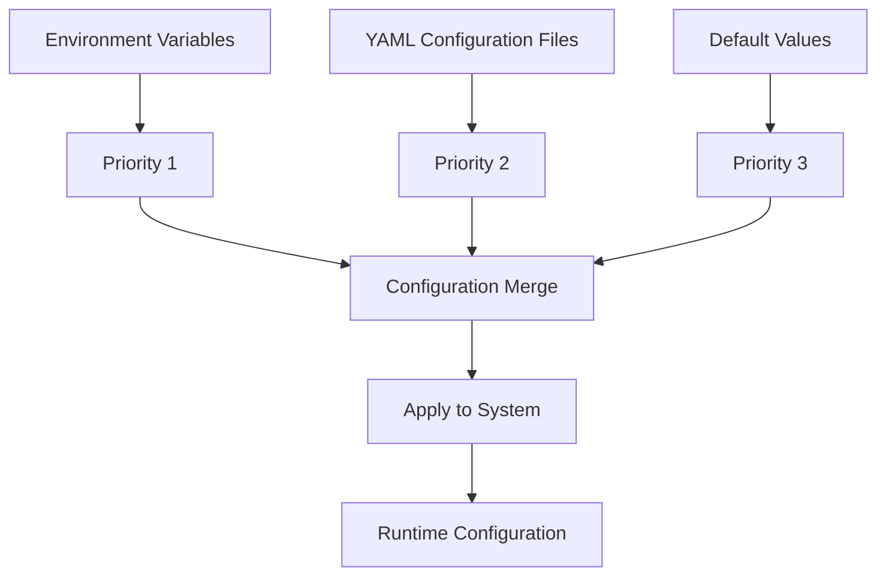
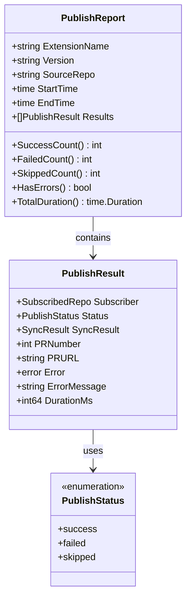
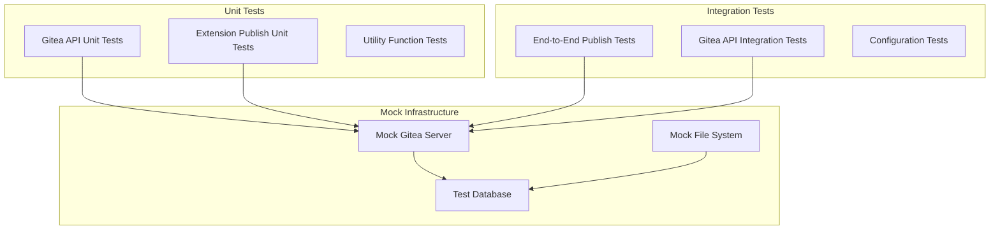

# Extension Publishing System

<cite>
**Referenced Files in This Document**
- [README.md](file://README.md)
- [main.go](file://cmd/benadis-runner/main.go)
- [extension_publish.go](file://internal/app/extension_publish.go)
- [extension-publish.md](file://docs/epics/extension-publish.md)
- [external-extension-workflow.md](file://docs/diagrams/external-extension-workflow.md)
- [gitea.go](file://internal/entity/gitea/gitea.go)
- [interfaces.go](file://internal/entity/gitea/interfaces.go)
- [constants.go](file://internal/constants/constants.go)
- [config.go](file://internal/config/config.go)
- [app.yaml](file://config/app.yaml)
</cite>

## Table of Contents
1. [Introduction](#introduction)
2. [System Architecture](#system-architecture)
3. [Core Components](#core-components)
4. [Extension Publishing Workflow](#extension-publishing-workflow)
5. [Gitea API Integration](#gitea-api-integration)
6. [Configuration Management](#configuration-management)
7. [Error Handling and Reporting](#error-handling-and-reporting)
8. [Testing Strategy](#testing-strategy)
9. [Deployment and Usage](#deployment-and-usage)
10. [Troubleshooting Guide](#troubleshooting-guide)

## Introduction

The Extension Publishing System is a sophisticated automation framework designed to streamline the distribution of 1C:Enterprise external extensions across multiple subscribed repositories. This system automates the entire process of extension updates, from detecting new releases to creating pull requests in target repositories, ensuring consistent and reliable deployment across organizational infrastructure.

The system operates on a subscription-based model where target repositories maintain special "subscription branches" that indicate their interest in receiving extension updates. When a new release is published in the source extension repository, the system automatically discovers all subscribing repositories and propagates the updated extension files through automated pull requests.

## System Architecture

The Extension Publishing System follows a modular architecture with clear separation of concerns:



**Diagram sources**
- [main.go](file://cmd/benadis-runner/main.go#L16-L262)
- [extension_publish.go](file://internal/app/extension_publish.go#L979-L1253)

The architecture consists of several key layers:

- **Presentation Layer**: CLI interface and Gitea Actions integration
- **Application Layer**: Central command routing and configuration management
- **Business Logic Layer**: Core publishing algorithms and orchestration
- **Integration Layer**: Gitea API connectivity and Git operations
- **Data Layer**: Configuration persistence and logging

## Core Components

### Main Application Entry Point

The application entry point serves as the central command router, handling various operational modes and delegating to appropriate subsystems based on the selected command.



**Diagram sources**
- [main.go](file://cmd/benadis-runner/main.go#L30-L260)

**Section sources**
- [main.go](file://cmd/benadis-runner/main.go#L16-L262)

### Extension Publishing Engine

The core publishing engine orchestrates the complete extension distribution process, implementing sophisticated algorithms for subscriber discovery, file synchronization, and pull request creation.



**Diagram sources**
- [extension_publish.go](file://internal/app/extension_publish.go#L979-L1253)

**Section sources**
- [extension_publish.go](file://internal/app/extension_publish.go#L456-L567)

### Subscription Management System

The subscription management system maintains a registry of interested parties through a unique branch naming convention that enables automatic discovery of target repositories.



**Diagram sources**
- [extension_publish.go](file://internal/app/extension_publish.go#L60-L148)

**Section sources**
- [extension_publish.go](file://internal/app/extension_publish.go#L150-L267)

## Extension Publishing Workflow

### Subscription Branch Format

The system uses a standardized branch naming convention to identify subscription targets:

```
{Organization}_{Repository}_{ExtensionDirectory}
```

Where:
- **Organization**: Target repository's organization name
- **Repository**: Target repository name  
- **ExtensionDirectory**: Path to extension directory within target project

**Example**: `APKHolding_ERP_cfe_CommonExt` indicates the `APKHolding/ERP` repository wants updates for the `cfe/CommonExt` extension directory.

### File Synchronization Process

The synchronization process ensures complete parity between source and target repositories:



**Diagram sources**
- [extension_publish.go](file://internal/app/extension_publish.go#L456-L567)

**Section sources**
- [extension_publish.go](file://internal/app/extension_publish.go#L269-L418)

### Pull Request Generation

Each successful synchronization triggers automated pull request creation with comprehensive metadata:



**Diagram sources**
- [extension_publish.go](file://internal/app/extension_publish.go#L625-L688)

**Section sources**
- [extension_publish.go](file://internal/app/extension_publish.go#L569-L624)

## Gitea API Integration

### API Client Architecture

The system integrates deeply with Gitea's REST API through a comprehensive client implementation that supports all required operations for extension publishing.



**Diagram sources**
- [gitea.go](file://internal/entity/gitea/gitea.go#L288-L317)
- [interfaces.go](file://internal/entity/gitea/interfaces.go#L18-L57)

**Section sources**
- [gitea.go](file://internal/entity/gitea/gitea.go#L1182-L1200)
- [interfaces.go](file://internal/entity/gitea/interfaces.go#L18-L57)

### Authentication and Security

The system implements robust authentication mechanisms for secure Gitea API access:

- **Token-Based Authentication**: Uses bearer tokens for API requests
- **Environment Variable Management**: Secure token storage through environment variables
- **Rate Limiting**: Built-in handling for API rate limits and retry logic
- **Error Handling**: Comprehensive error propagation with meaningful error messages

**Section sources**
- [gitea.go](file://internal/entity/gitea/gitea.go#L469-L503)

## Configuration Management

### Multi-Layer Configuration System

The system employs a hierarchical configuration approach supporting environment variables, YAML files, and default values:



**Diagram sources**
- [config.go](file://internal/config/config.go#L548-L702)

### Key Configuration Parameters

| Parameter | Purpose | Environment Variable | Default Value |
|-----------|---------|---------------------|---------------|
| `BR_COMMAND` | Command selection | `BR_COMMAND` | Empty |
| `GITEA_TOKEN` | API authentication | `GITHUB_TOKEN` | None |
| `GITHUB_REPOSITORY` | Source repository | `GITHUB_REPOSITORY` | None |
| `GITHUB_REF_NAME` | Release tag | `GITHUB_REF_NAME` | `main` |
| `BR_EXT_DIR` | Extension directory | `BR_EXT_DIR` | Auto-detected |
| `BR_DRY_RUN` | Test mode | `BR_DRY_RUN` | `false` |

**Section sources**
- [config.go](file://internal/config/config.go#L128-L209)
- [app.yaml](file://config/app.yaml#L1-L138)

## Error Handling and Reporting

### Comprehensive Error Management

The system implements structured error handling with detailed reporting capabilities:



**Diagram sources**
- [extension_publish.go](file://internal/app/extension_publish.go#L745-L849)

### Reporting Formats

The system supports dual reporting formats:

**JSON Output** (`BR_OUTPUT_JSON=true`):
- Machine-readable structured data
- Complete execution statistics
- Error details for automation

**Human-Readable Output**:
- Formatted console logs
- Summary statistics
- Individual subscriber status

**Section sources**
- [extension_publish.go](file://internal/app/extension_publish.go#L869-L977)

## Testing Strategy

### Comprehensive Test Coverage

The system implements extensive testing across multiple layers:



**Diagram sources**
- [extension_publish_test.go](file://internal/app/extension_publish_test.go)
- [extension_publish_integration_test.go](file://internal/app/extension_publish_integration_test.go)

### Test Categories

- **Unit Tests**: Individual function and method testing
- **Integration Tests**: Cross-component functionality validation
- **Mock Testing**: External dependency simulation
- **Regression Tests**: Prevent functionality degradation

**Section sources**
- [extension_publish_test.go](file://internal/app/extension_publish_test.go)
- [extension_publish_integration_test.go](file://internal/app/extension_publish_integration_test.go)

## Deployment and Usage

### Gitea Actions Integration

The system seamlessly integrates with Gitea Actions for automated extension publishing:

```yaml
name: Publish Extension
on:
  release:
    types: [published]

jobs:
  publish:
    runs-on: ubuntu-latest
    steps:
      - name: Publish extension to subscribers
        uses: docker://your-registry/benadis-runner:latest
        env:
          BR_COMMAND: extension-publish
          GITEA_TOKEN: ${{ secrets.GITEA_TOKEN }}
          GITHUB_REPOSITORY: ${{ github.repository }}
```

### Manual Execution

For manual execution scenarios:

```bash
# Configure environment
export BR_COMMAND=extension-publish
export GITEA_TOKEN=your_access_token
export GITHUB_REPOSITORY=organization/repository

# Execute publisher
./benadis-runner extension-publish
```

**Section sources**
- [extension-publish.md](file://docs/epics/extension-publish.md#L299-L326)

## Troubleshooting Guide

### Common Issues and Solutions

| Issue | Symptoms | Solution |
|-------|----------|----------|
| **Authentication Failure** | API returns 401/403 errors | Verify GITEA_TOKEN validity and permissions |
| **Subscription Not Found** | No subscribers detected | Check branch naming format `{Org}_{Repo}_{Dir}` |
| **File Synchronization Errors** | Partial updates or missing files | Verify source repository structure and permissions |
| **Pull Request Creation Failures** | PR not created despite successful sync | Check target repository branch protection rules |

### Debug Mode

Enable debug logging for detailed troubleshooting:

```bash
export LOG_LEVEL=debug
export BR_OUTPUT_JSON=true
./benadis-runner extension-publish
```

### Monitoring and Metrics

The system provides comprehensive logging for operational visibility:

- **Execution Time**: Per-subscriber processing duration
- **Success Rates**: Overall publication success metrics  
- **Error Patterns**: Common failure categories and frequencies
- **API Usage**: Rate limiting and quota consumption

**Section sources**
- [extension_publish.go](file://internal/app/extension_publish.go#L869-L977)