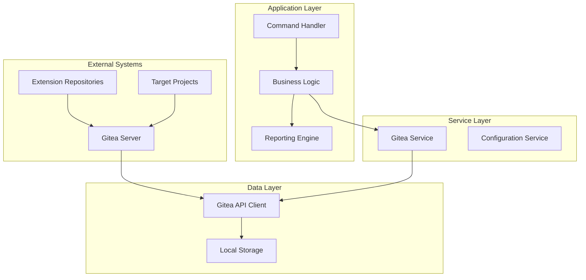
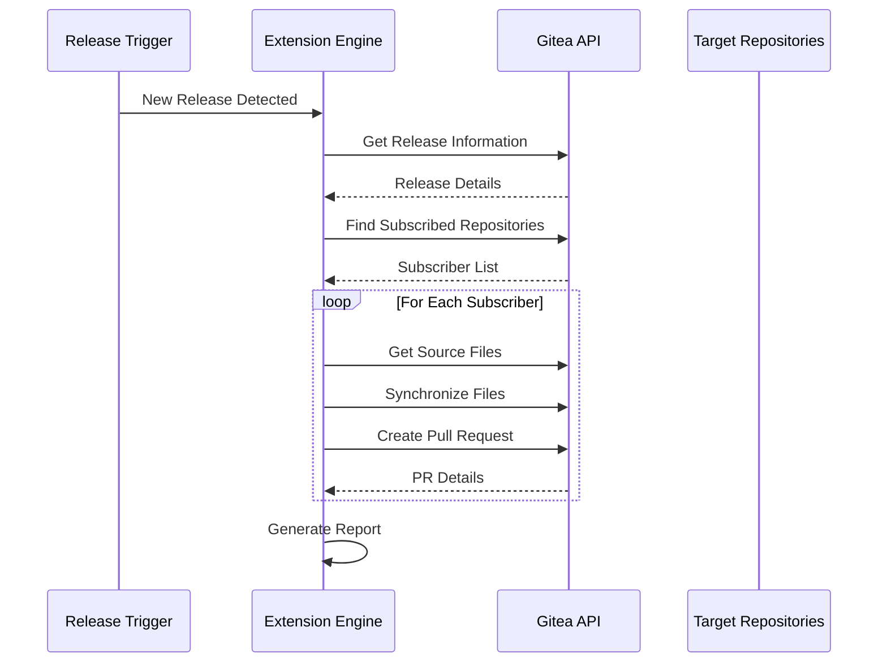
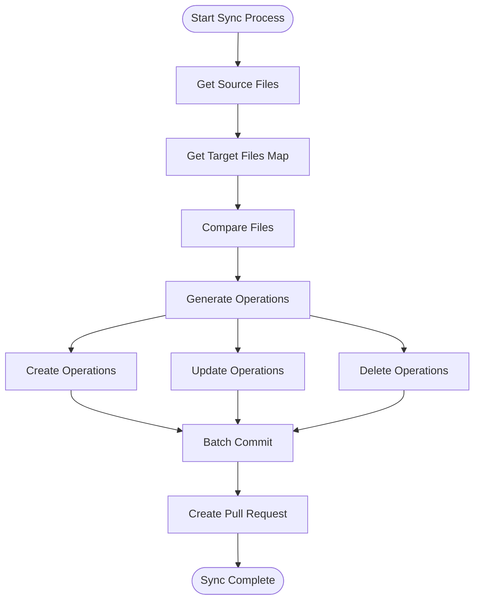
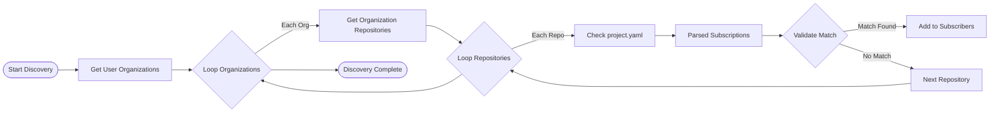
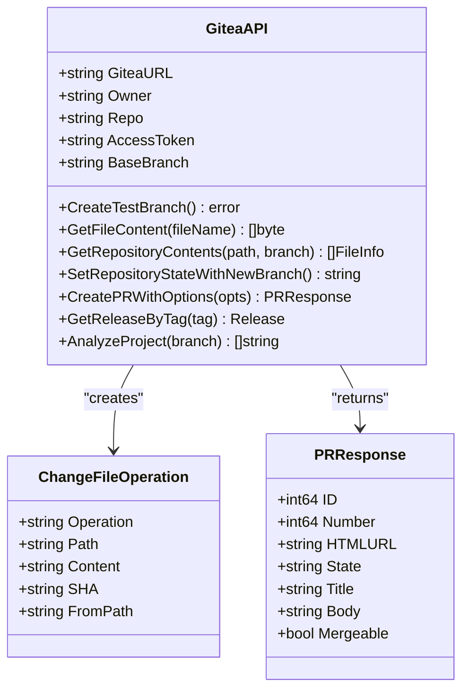
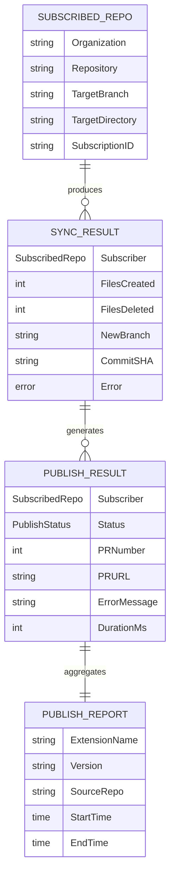
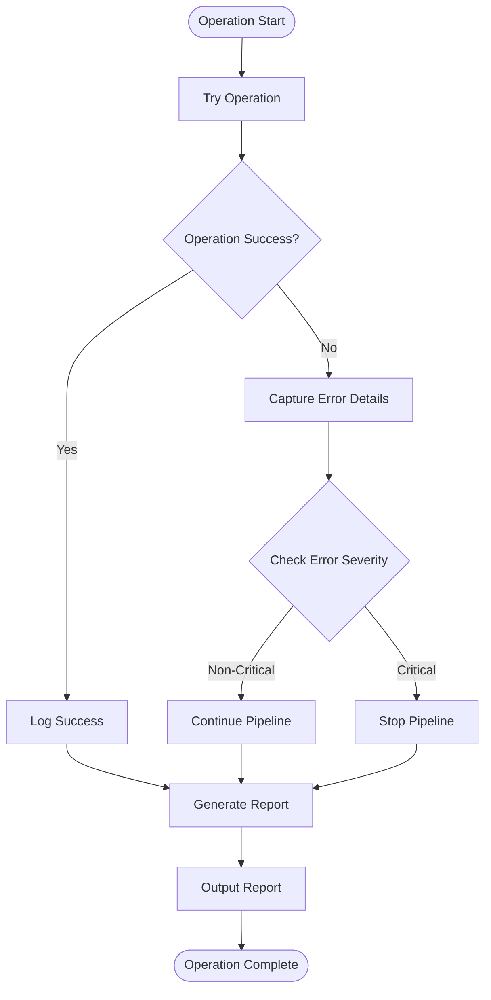
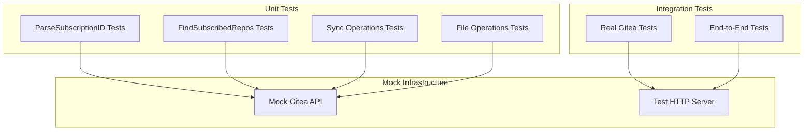
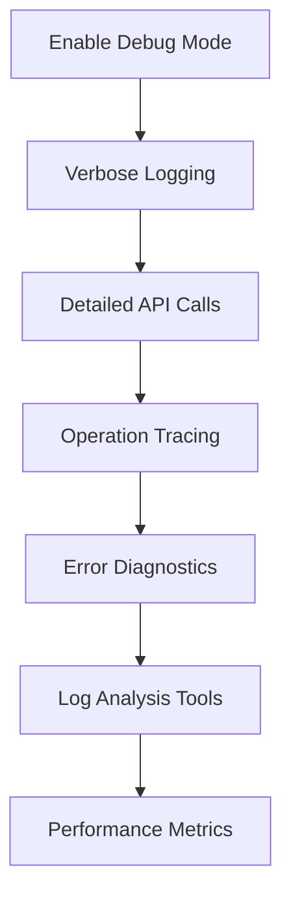

# Extension Publishing System

<cite>
**Referenced Files in This Document**
- [extension_publish.go](file://internal/app/extension_publish.go)
- [gitea.go](file://internal/entity/gitea/gitea.go)
- [gitea_service.go](file://internal/service/gitea_service.go)
- [main.go](file://cmd/apk-ci/main.go)
- [constants.go](file://internal/constants/constants.go)
- [extension-publish.md](file://docs/epics/extension-publish.md)
- [external-extension-workflow.md](file://docs/diagrams/external-extension-workflow.md)
- [extension_publish_test.go](file://internal/app/extension_publish_test.go)
- [extension_publish_integration_test.go](file://internal/app/extension_publish_integration_test.go)
- [action.yaml](file://config/action.yaml)
- [app.yaml](file://config/app.yaml)
</cite>

## Table of Contents
1. [Introduction](#introduction)
2. [System Architecture](#system-architecture)
3. [Core Components](#core-components)
4. [Extension Publishing Workflow](#extension-publishing-workflow)
5. [Gitea API Integration](#gitea-api-integration)
6. [Data Models and Structures](#data-models-and-structures)
7. [Error Handling and Reporting](#error-handling-and-reporting)
8. [Testing Strategy](#testing-strategy)
9. [Configuration Management](#configuration-management)
10. [Deployment and CI/CD](#deployment-and-cicd)
11. [Troubleshooting Guide](#troubleshooting-guide)
12. [Conclusion](#conclusion)

## Introduction

The Extension Publishing System is an automated solution designed to distribute 1C extension updates across multiple subscribed repositories. This system implements a subscription-based mechanism where target repositories maintain "subscription branches" that trigger automatic updates when new releases are published in source extension repositories.

The system operates through a comprehensive workflow that includes release detection, subscriber discovery, file synchronization, and Pull Request creation. It ensures consistency across distributed extension deployments while maintaining audit trails and providing detailed reporting capabilities.

## System Architecture

The Extension Publishing System follows a layered architecture pattern with clear separation of concerns:



**Diagram sources**
- [extension_publish.go](file://internal/app/extension_publish.go#L1049-L1322)
- [gitea_service.go](file://internal/service/gitea_service.go#L12-L35)

The architecture consists of several key layers:

- **Presentation Layer**: Command-line interface and CI/CD integration
- **Application Layer**: Core business logic and workflow orchestration
- **Service Layer**: Gitea API abstraction and configuration management
- **Data Layer**: Gitea API client and local storage mechanisms

## Core Components

### Extension Publishing Engine

The core engine handles the complete lifecycle of extension distribution:



**Diagram sources**
- [extension_publish.go](file://internal/app/extension_publish.go#L1049-L1322)

### Subscription Management

The system uses a sophisticated subscription mechanism where target repositories maintain specific branch naming patterns:

| Subscription Pattern | Description | Example |
|---------------------|-------------|---------|
| `{Org}_{Repo}_{ExtDir}` | Standard subscription format | `lib_apk_ssl_AПК_БСП` |
| `lib_common_cfe_utils` | Nested directory support | `lib/common/cfe/utils` |
| `MyOrg_MyProject_extensions_v2_common` | Deep nesting support | `MyOrg/MyProject/extensions/v2/common` |

**Section sources**
- [extension_publish.go](file://internal/app/extension_publish.go#L117-L153)
- [extension_publish.go](file://internal/app/extension_publish.go#L19-L27)

### File Synchronization Engine

The synchronization process ensures complete file replacement with intelligent comparison:



**Diagram sources**
- [extension_publish.go](file://internal/app/extension_publish.go#L458-L637)

**Section sources**
- [extension_publish.go](file://internal/app/extension_publish.go#L271-L319)
- [extension_publish.go](file://internal/app/extension_publish.go#L458-L637)

## Extension Publishing Workflow

### Release Detection and Processing

The system monitors Gitea for new releases and automatically triggers the publishing process:

1. **Release Detection**: Monitors release events in source repositories
2. **Metadata Extraction**: Retrieves release information including version tags and notes
3. **Subscriber Discovery**: Scans all accessible repositories for subscription branches
4. **File Synchronization**: Updates target repositories with new extension files
5. **Pull Request Creation**: Generates PRs with detailed release information

### Subscriber Discovery Process

The discovery mechanism employs a multi-stage approach:



**Diagram sources**
- [extension_publish.go](file://internal/app/extension_publish.go#L155-L269)

**Section sources**
- [extension_publish.go](file://internal/app/extension_publish.go#L155-L269)

### Pull Request Generation

Each successful synchronization creates a standardized Pull Request with comprehensive metadata:

| PR Field | Content Format | Purpose |
|----------|----------------|---------|
| **Title** | `Update {Extension} to {Version}` | Clear identification of changes |
| **Body** | Markdown with release details | Comprehensive change information |
| **Head** | `update-{extname}-{version}` | Branch reference for changes |
| **Base** | Target repository default branch | Merge target |

**Section sources**
- [extension_publish.go](file://internal/app/extension_publish.go#L639-L758)

## Gitea API Integration

### API Client Architecture

The system implements a robust Gitea API client with comprehensive functionality:



**Diagram sources**
- [gitea.go](file://internal/entity/gitea/gitea.go#L288-L774)

### Authentication and Security

The system implements secure authentication through personal access tokens with comprehensive error handling:

| Security Feature | Implementation | Purpose |
|------------------|----------------|---------|
| **Personal Access Tokens** | OAuth 2.0 compatible | Secure API access |
| **Token Validation** | Pre-flight checks | Prevent unauthorized access |
| **Rate Limiting** | Built-in Gitea protection | Prevent API abuse |
| **Error Propagation** | Structured error handling | Clear failure diagnosis |

**Section sources**
- [gitea.go](file://internal/entity/gitea/gitea.go#L469-L503)

## Data Models and Structures

### Core Data Structures

The system defines several critical data structures for managing extension publishing:



**Diagram sources**
- [extension_publish.go](file://internal/app/extension_publish.go#L94-L115)
- [extension_publish.go](file://internal/app/extension_publish.go#L75-L92)
- [extension_publish.go](file://internal/app/extension_publish.go#L827-L853)

### Status Management

The system tracks publication status through a comprehensive state machine:

| Status | Description | Trigger Condition |
|--------|-------------|-------------------|
| **Success** | Publication completed successfully | Files synchronized and PR created |
| **Failed** | Publication encountered errors | API failures, permission issues, or sync errors |
| **Skipped** | Operation bypassed (dry-run) | Dry-run mode enabled or manual skip |

**Section sources**
- [extension_publish.go](file://internal/app/extension_publish.go#L815-L825)

## Error Handling and Reporting

### Comprehensive Error Management

The system implements robust error handling with detailed reporting:



**Diagram sources**
- [extension_publish.go](file://internal/app/extension_publish.go#L1154-L1322)

### Reporting System

The system provides dual-format reporting for different consumption patterns:

| Report Type | Format | Use Case |
|-------------|--------|----------|
| **Text Report** | Human-readable | Console output, logs |
| **JSON Report** | Machine-parseable | CI/CD integration, automation |

**Section sources**
- [extension_publish.go](file://internal/app/extension_publish.go#L939-L1047)

## Testing Strategy

### Unit Testing Approach

The system employs comprehensive unit testing with specialized test scenarios:



**Diagram sources**
- [extension_publish_test.go](file://internal/app/extension_publish_test.go#L26-L118)
- [extension_publish_integration_test.go](file://internal/app/extension_publish_integration_test.go#L24-L66)

### Test Coverage Areas

| Test Category | Coverage Area | Test Methods |
|---------------|---------------|--------------|
| **Parser Tests** | Subscription ID parsing | Valid/Invalid formats |
| **Discovery Tests** | Subscriber finding | Empty lists, errors, success |
| **Synchronization Tests** | File operations | Create, update, delete |
| **Integration Tests** | Real system testing | End-to-end workflows |

**Section sources**
- [extension_publish_test.go](file://internal/app/extension_publish_test.go#L120-L451)
- [extension_publish_integration_test.go](file://internal/app/extension_publish_integration_test.go#L68-L151)

## Configuration Management

### Environment Variables

The system uses a comprehensive set of environment variables for configuration:

| Variable | Purpose | Required | Default |
|----------|---------|----------|---------|
| **GITEA_URL** | Gitea server URL | Yes | - |
| **ACCESS_TOKEN** | API authentication | Yes | - |
| **REPOSITORY** | Source repository name | Yes | - |
| **COMMAND** | Execution command | Yes | - |
| **LOG_LEVEL** | Logging verbosity | No | info |
| **BR_EXT_DIR** | Extension directory override | No | - |
| **BR_DRY_RUN** | Dry-run mode toggle | No | false |
| **BR_OUTPUT_JSON** | JSON output format | No | false |

### Configuration Files

The system supports multiple configuration file formats:

| File Type | Purpose | Location |
|-----------|---------|----------|
| **app.yaml** | Application settings | `/config/app.yaml` |
| **action.yaml** | GitHub Actions configuration | `/config/action.yaml` |
| **project.yaml** | Project-specific settings | Repository root |

**Section sources**
- [app.yaml](file://config/app.yaml#L1-L138)
- [action.yaml](file://config/action.yaml#L1-L121)

## Deployment and CI/CD

### GitHub Actions Integration

The system integrates seamlessly with GitHub Actions workflows:

```yaml
name: Extension Publish
on:
  release:
    types: [published]

jobs:
  publish:
    runs-on: ubuntu-latest
    steps:
      - name: Publish extension to subscribers
        uses: docker://your-registry/apk-ci:latest
        env:
          BR_COMMAND: extension-publish
          GITEA_TOKEN: ${{ secrets.GITEA_TOKEN }}
          GITHUB_REPOSITORY: ${{ github.repository }}
          GITHUB_REF_NAME: ${{ github.ref_name }}
```

### Docker Containerization

The system is containerized for easy deployment and scaling:

| Container Feature | Implementation |
|------------------|----------------|
| **Multi-stage Builds** | Optimized image size |
| **Health Checks** | Container readiness verification |
| **Resource Limits** | CPU and memory constraints |
| **Logging Integration** | Structured log output |

**Section sources**
- [external-extension-workflow.md](file://docs/diagrams/external-extension-workflow.md#L299-L316)

## Troubleshooting Guide

### Common Issues and Solutions

| Issue Category | Symptoms | Solution Steps |
|----------------|----------|----------------|
| **Authentication Failures** | 401/403 errors | Verify ACCESS_TOKEN validity |
| **Repository Not Found** | 404 errors | Check GITEA_URL and repository names |
| **Permission Denied** | Access control errors | Verify user permissions |
| **Rate Limiting** | API throttling | Implement retry delays |
| **Network Connectivity** | Timeout errors | Check firewall and proxy settings |

### Debug Mode Features

The system provides comprehensive debugging capabilities:



**Diagram sources**
- [extension_publish.go](file://internal/app/extension_publish.go#L1068-L1106)

### Monitoring and Alerting

The system includes built-in monitoring capabilities:

| Monitoring Aspect | Implementation | Alerts |
|-------------------|----------------|--------|
| **API Health** | Connection testing | Service availability |
| **Operation Success** | Result tracking | Failure notifications |
| **Performance Metrics** | Timing measurements | Slow operation alerts |
| **Error Rates** | Error counting | Exception thresholds |

**Section sources**
- [extension_publish.go](file://internal/app/extension_publish.go#L949-L957)

## Conclusion

The Extension Publishing System provides a robust, scalable solution for automated 1C extension distribution across multiple repositories. Its subscription-based architecture ensures consistent updates while maintaining flexibility for diverse project structures.

Key strengths of the system include:

- **Automated Workflow**: End-to-end automation from release detection to PR creation
- **Scalable Architecture**: Support for unlimited subscribers and extensions
- **Comprehensive Error Handling**: Detailed diagnostics and recovery mechanisms
- **Flexible Configuration**: Environment-based customization for various deployment scenarios
- **Production Ready**: Thorough testing, monitoring, and CI/CD integration

The system successfully addresses the challenges of distributed extension management while maintaining auditability, traceability, and operational reliability. Its modular design facilitates future enhancements and adaptation to evolving requirements.