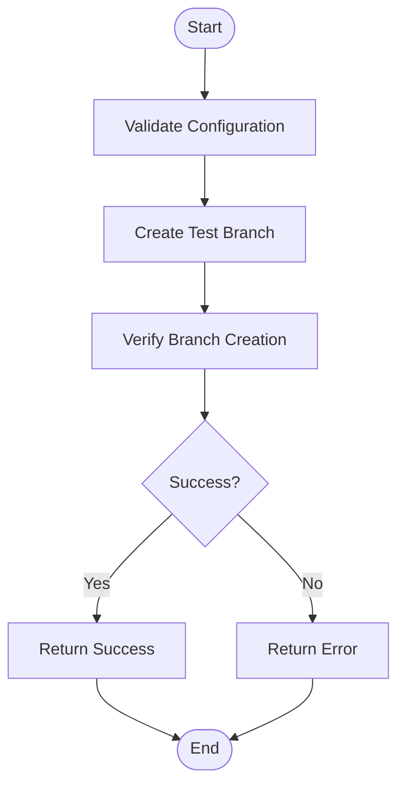
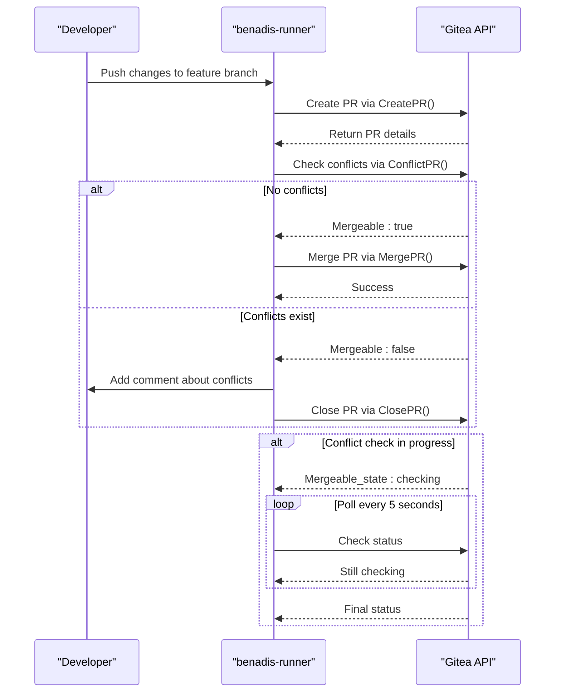
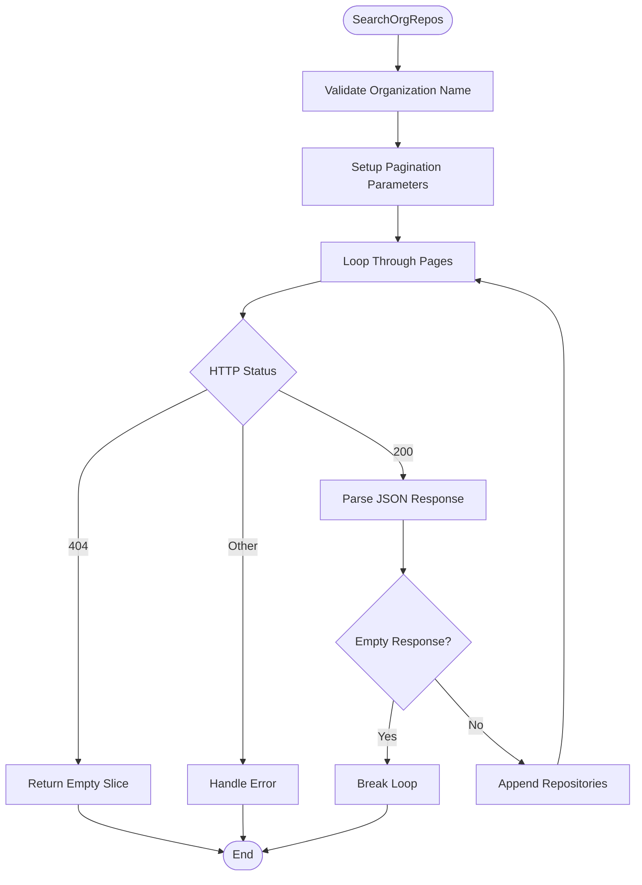
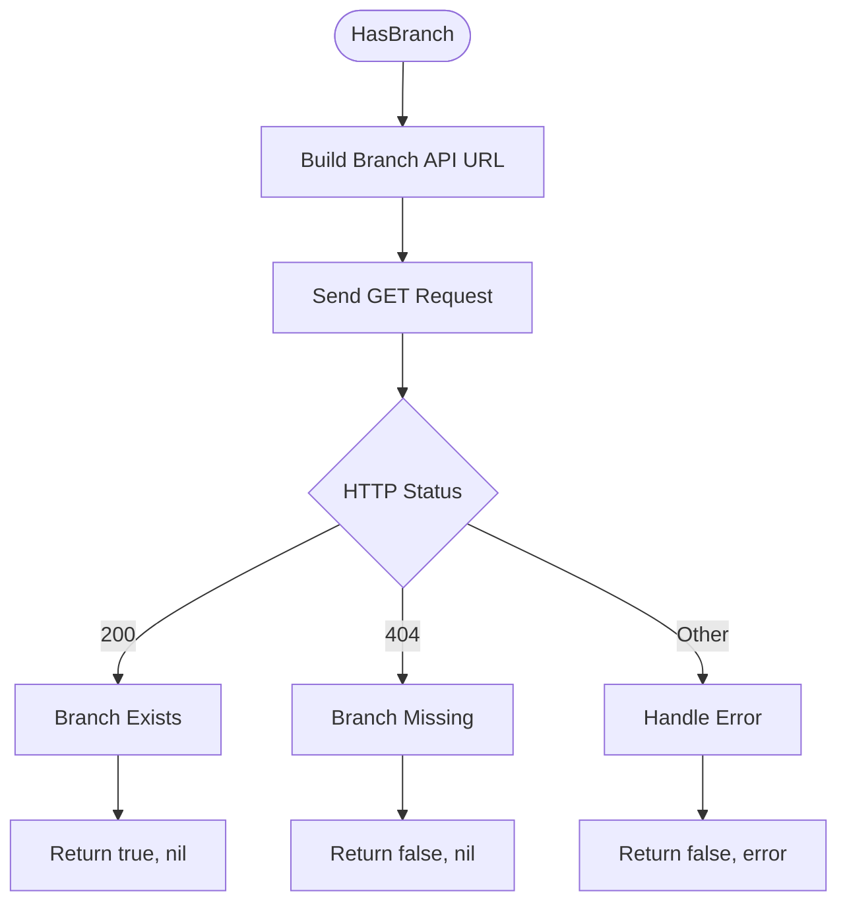
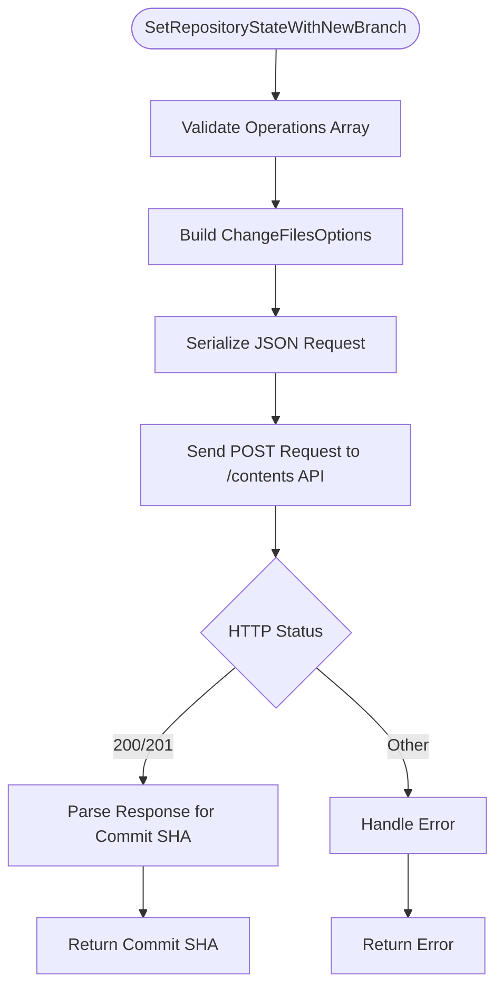
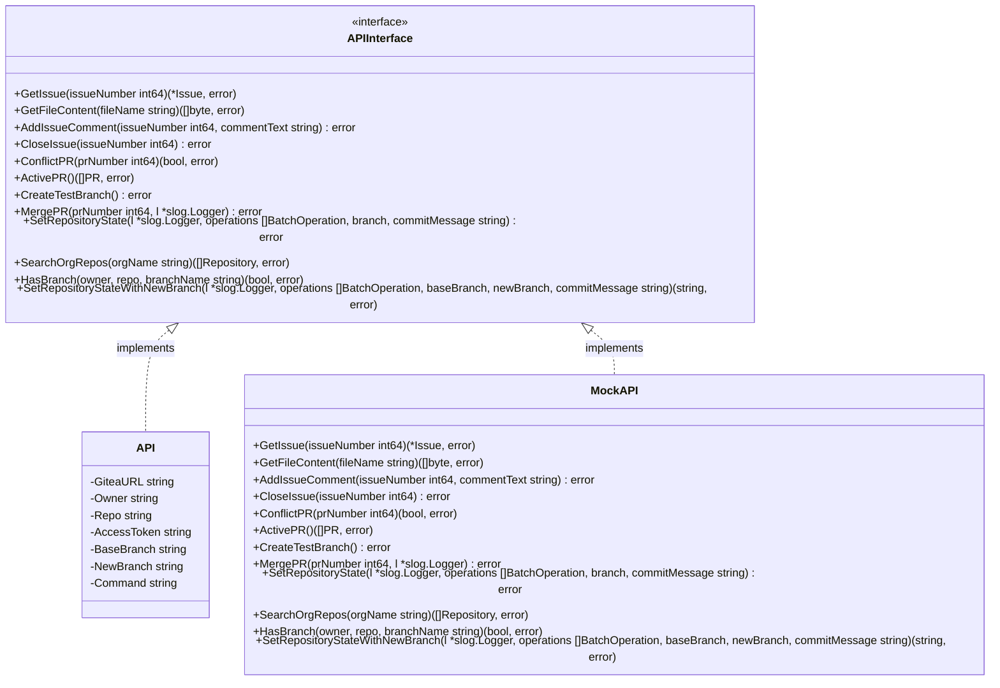
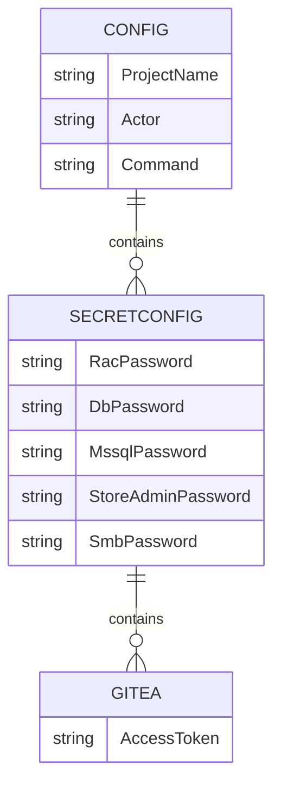
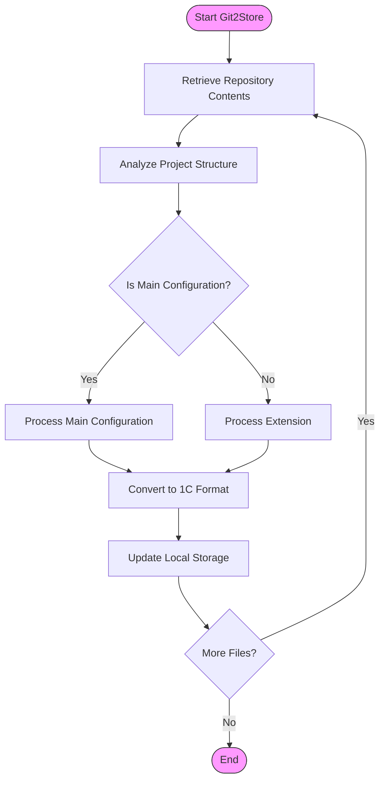
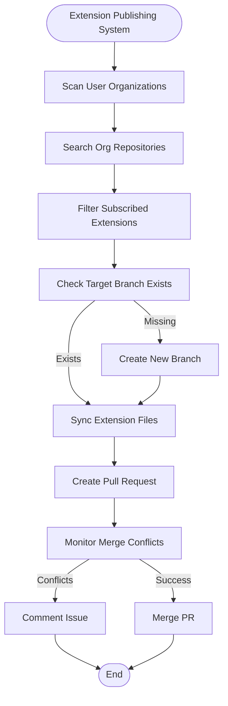

# Gitea Integration

<cite>
**Referenced Files in This Document**   
- [gitea.go](file://internal/entity/gitea/gitea.go) - *Enhanced with SearchOrgRepos, HasBranch, and SetRepositoryStateWithNewBranch methods*
- [interfaces.go](file://internal/entity/gitea/interfaces.go) - *Updated interface definitions*
- [gitea_service.go](file://internal/service/gitea_service.go) - *Service layer implementation*
- [gitea_factory.go](file://internal/service/gitea_factory.go) - *Component creation factory*
- [extension_publish.go](file://internal/app/extension_publish.go) - *Extension publishing system implementation*
- [gitea_search_test.go](file://internal/entity/gitea/gitea_search_test.go) - *SearchOrgRepos testing*
- [config.go](file://internal/config/config.go) - *Configuration management*
- [constants.go](file://internal/constants/constants.go) - *Constant definitions*
- [action.yaml](file://config/action.yaml) - *GitHub Actions configuration*
- [Git2Store.puml](file://old/PlantUML/Git2Store.puml) - *Architecture diagram*
</cite>

## Update Summary
**Changes Made**   
- Added documentation for new Gitea API methods: SearchOrgRepos, HasBranch, and SetRepositoryStateWithNewBranch
- Updated Extension Publishing System section with new workflow capabilities
- Enhanced organization and repository management documentation
- Added comprehensive examples for batch operations with new branch creation
- Updated error handling section with new method-specific error scenarios
- Expanded testing documentation with new method coverage

## Table of Contents
1. [Introduction](#introduction)
2. [Core Repository Operations](#core-repository-operations)
3. [Organization and Repository Management](#organization-and-repository-management)
4. [Batch Operations with New Branch Creation](#batch-operations-with-new-branch-creation)
5. [Interface Abstraction and Mock Testing](#interface-abstraction-and-mock-testing)
6. [Authentication and Access Token Management](#authentication-and-access-token-management)
7. [Git2Store and StoreBind Workflows](#git2store-and-storebind-workflows)
8. [Extension Publishing System](#extension-publishing-system)
9. [Error Handling and Common Issues](#error-handling-and-common-issues)
10. [Webhook Configuration and Event Delivery](#webhook-configuration-and-event-delivery)
11. [Best Practices](#best-practices)

## Introduction
The Gitea integration in benadis-runner provides a comprehensive interface for managing repository operations, including branch creation, commit retrieval, pull request management, and issue tracking. The integration is designed to support automated workflows for synchronizing 1C configurations with Gitea repositories through Git2Store and storebind operations. This document details the implementation of these features, focusing on the gitea.go module and its supporting components.

The integration follows a layered architecture with clear separation between the API client, service layer, and business logic. It leverages interface abstraction to enable mock testing and extensibility, allowing for flexible configuration and reliable operation in various environments. The system uses access tokens from SecretConfig.Gitea for authentication and implements robust error handling for common issues such as rate limits, merge conflicts, and synchronization race conditions.

**Section sources**
- [gitea.go](file://internal/entity/gitea/gitea.go#L1-L100)
- [gitea_service.go](file://internal/service/gitea_service.go#L1-L50)

## Core Repository Operations

### Branch Creation and Management
The Gitea integration provides comprehensive functionality for branch operations, enabling automated creation, deletion, and management of branches within the repository. The `CreateTestBranch` method creates a new test branch based on a specified base branch, which is essential for isolated testing and development workflows.



**Diagram sources**
- [gitea.go](file://internal/entity/gitea/gitea.go#L324-L338)

The branch creation process involves constructing an API request with the new branch name and the reference to the base branch. The system validates the response status code to ensure successful creation, returning appropriate errors for any failures. Similarly, the `DeleteTestBranch` method removes temporary branches after testing is complete, maintaining repository cleanliness.

**Section sources**
- [gitea.go](file://internal/entity/gitea/gitea.go#L324-L338)
- [gitea.go](file://internal/entity/gitea/gitea.go#L510-L518)

### Commit Retrieval and History Analysis
The integration supports comprehensive commit retrieval and history analysis capabilities. The `GetCommits` method retrieves a list of commits from a specified branch, with optional limiting of results. For more detailed analysis, the `GetCommitsBetween` method compares two commit SHAs to identify differences, while `GetBranchCommitRange` determines the first and last commits in a branch's history.

These operations are crucial for understanding changes between different states of the repository and for implementing change tracking in the Git2Store workflow. The commit data includes author information, timestamps, and commit messages, providing rich context for analysis and reporting.

**Section sources**
- [gitea.go](file://internal/entity/gitea/gitea.go#L800-L900)

### Pull Request Management
Pull request (PR) management is a core component of the Gitea integration, enabling automated code review and merge processes. The `CreatePR` method initiates a new pull request by specifying the source (head) and target (base) branches, while `ActivePR` retrieves all open PRs for processing.

The integration now includes sophisticated asynchronous conflict detection through the `ConflictPR` and `ConflictFilesPR` methods, which determine whether a PR can be automatically merged or requires manual intervention. When dealing with large repositories, Gitea may return a "checking" status indicating that conflict analysis is running in the background. The enhanced implementation now includes retry logic to handle this scenario.

```go
// ConflictPR checks for merge conflicts in a pull request with retry logic for large repositories
func (g *API) ConflictPR(prNumber int64) (bool, error) {
	const (
		maxRetries      = 60             // Maximum number of attempts (60 * 5 seconds = 5 minutes)
		retryInterval   = 5 * time.Second // Interval between attempts
	)

	urlString := fmt.Sprintf("%s/api/%s/repos/%s/%s/pulls/%d", g.GiteaURL, constants.APIVersion, g.Owner, g.Repo, prNumber)

	for attempt := 0; attempt < maxRetries; attempt++ {
		statusCode, body, _ := g.sendReq(urlString, "", "GET")
		if statusCode != http.StatusOK {
			return true, fmt.Errorf("error getting PR data: %d %d", prNumber, statusCode)
		}
		r := strings.NewReader(body)

		var pr PullRequest
		if err := json.NewDecoder(r).Decode(&pr); err != nil {
			return true, err
		}

		// Check mergeability status
		switch pr.MergeableState {
		case "checking":
			// Conflict check is still running in background, wait and retry
			if attempt < maxRetries-1 {
				log.Printf("PR %d: conflict check running in background, waiting %v (attempt %d/%d)",
					prNumber, retryInterval, attempt+1, maxRetries)
				time.Sleep(retryInterval)
				continue
			}
			// Reached maximum attempts
			return true, fmt.Errorf("timeout waiting for conflict check completion for PR %d", prNumber)

		case "conflict", "behind", "blocked":
			// Conflicts or other issues preventing merge
			return true, nil

		case "success", "unstable", "has_hooks":
			// Can be merged (unstable and has_hooks are not critical blockers)
			return false, nil

		default:
			// For unknown statuses or empty values, use Mergeable field
			if pr.Mergeable {
				return false, nil
			}
			return true, nil
		}
	}

	// Should not reach here, but just in case
	return true, fmt.Errorf("could not determine conflict status for PR %d", prNumber)
}
```

This implementation handles the asynchronous nature of conflict checking in large repositories by polling the PR status with exponential backoff until a definitive result is obtained or a timeout occurs. The maximum wait time is approximately 5 minutes (60 attempts × 5 seconds), which is sufficient for most large repository scenarios.



**Diagram sources**
- [gitea.go](file://internal/entity/gitea/gitea.go#L561-L613)
- [gitea_service.go](file://internal/service/gitea_service.go#L36-L166)

**Section sources**
- [gitea.go](file://internal/entity/gitea/gitea.go#L561-L613)
- [gitea.go](file://internal/entity/gitea/gitea.go#L624-L642)
- [gitea.go](file://internal/entity/gitea/gitea.go#L653-L676)
- [gitea.go](file://internal/entity/gitea/gitea.go#L782-L800)

### Issue Tracking and Management
The integration provides comprehensive issue tracking capabilities, allowing for automated creation, updating, and closure of issues in the Gitea repository. The `GetIssue` method retrieves detailed information about a specific issue, including its title, body, state, and metadata.

For collaboration and notification purposes, the `AddIssueComment` method enables adding comments to existing issues, while `CloseIssue` changes an issue's state to closed when work is completed. These operations are integrated into various workflows, such as notifying developers about merge conflicts or reporting the completion of automated tasks.

**Section sources**
- [gitea.go](file://internal/entity/gitea/gitea.go#L349-L368)
- [gitea.go](file://internal/entity/gitea/gitea.go#L429-L443)
- [gitea.go](file://internal/entity/gitea/gitea.go#L453-L467)

## Organization and Repository Management

### Organization Repository Search
The `SearchOrgRepos` method provides comprehensive organization-wide repository discovery capabilities. This method is essential for the Extension Publishing System, enabling automated scanning of all repositories within an organization to identify subscribed extensions.



**Diagram sources**
- [gitea.go](file://internal/entity/gitea/gitea.go#L2058-L2093)

The method implements robust pagination handling with built-in safety mechanisms:
- **Maximum Pages**: 100 pages to prevent infinite loops
- **Page Limit**: 50 repositories per page (maximum supported by Gitea API)
- **Error Handling**: Graceful handling of HTTP 404 for non-existent organizations
- **Memory Efficiency**: Streaming results to avoid excessive memory usage

**Section sources**
- [gitea.go](file://internal/entity/gitea/gitea.go#L2058-L2093)
- [gitea_search_test.go](file://internal/entity/gitea/gitea_search_test.go#L64-L144)

### Branch Existence Verification
The `HasBranch` method provides efficient branch existence checking for arbitrary repositories. This capability is crucial for the Extension Publishing System to verify target branch availability before attempting synchronization operations.



**Diagram sources**
- [gitea.go](file://internal/entity/gitea/gitea.go#L2162-L2182)

The method offers several advantages over alternative approaches:
- **Direct API Call**: Single HTTP request vs. listing all branches
- **Cross-Organization Support**: Works with any owner/repo combination
- **Performance**: Minimal overhead for simple existence checks
- **Reliability**: Direct status code interpretation

**Section sources**
- [gitea.go](file://internal/entity/gitea/gitea.go#L2162-L2182)

## Batch Operations with New Branch Creation

### Advanced Batch Operations
The `SetRepositoryStateWithNewBranch` method represents a significant enhancement to the Gitea integration, providing comprehensive batch file operations with automatic branch creation. This method combines the functionality of `SetRepositoryState` with new branch creation capabilities.



**Diagram sources**
- [gitea.go](file://internal/entity/gitea/gitea.go#L1473-L1528)

The method supports multiple file operations in a single atomic transaction:
- **Create Operations**: New file creation with base64-encoded content
- **Update Operations**: File modification with SHA validation
- **Delete Operations**: File removal with SHA validation
- **Mixed Operations**: Combination of create, update, and delete operations

**Section sources**
- [gitea.go](file://internal/entity/gitea/gitea.go#L1473-L1528)

## Interface Abstraction and Mock Testing

### API Interface Definition
The Gitea integration employs a robust interface abstraction pattern to enhance testability and extensibility. The `APIInterface` defined in interfaces.go specifies all methods that can be performed on the Gitea API, creating a contract that can be implemented by different concrete types.



**Diagram sources**
- [interfaces.go](file://internal/entity/gitea/interfaces.go#L18-L57)
- [gitea.go](file://internal/entity/gitea/gitea.go#L288-L317)

This interface abstraction allows for dependency injection and makes the system highly testable. During unit tests, a mock implementation of the interface can be used instead of the real API, enabling comprehensive testing without requiring a live Gitea server.

**Section sources**
- [interfaces.go](file://internal/entity/gitea/interfaces.go#L18-L57)

### Service Layer Implementation
The service layer, implemented in gitea_service.go, utilizes the interface abstraction to provide business logic for Gitea operations. The `GiteaService` struct contains an instance of `APIInterface`, allowing it to work with any implementation that satisfies the interface contract.

The service layer decouples business logic from the specific API implementation, making it easier to modify or replace the underlying API client without affecting higher-level functionality. This separation also facilitates testing, as the service can be tested with a mock API implementation.

```go
[GiteaService.TestMerge](file://internal/service/gitea_service.go#L46-L167)
[GiteaService.AnalyzeProject](file://internal/service/gitea_service.go#L179-L182)
```

**Section sources**
- [gitea_service.go](file://internal/service/gitea_service.go#L1-L200)

### Factory Pattern for Component Creation
The integration uses a factory pattern to create and configure Gitea components, implemented in gitea_factory.go. The `GiteaFactory` struct provides methods for creating both the API configuration and the complete Gitea service with all dependencies properly injected.

This approach centralizes the creation logic and ensures consistent configuration across the application. The factory pattern also makes it easy to extend the system with new components or modify existing ones without changing the code that uses them.

```go
[GiteaFactory.CreateGiteaService](file://internal/service/gitea_factory.go#L40-L60)
```

**Section sources**
- [gitea_factory.go](file://internal/service/gitea_factory.go#L1-L70)

## Authentication and Access Token Management

### Access Token Configuration
The Gitea integration uses access tokens for authentication, which are securely managed through the configuration system. The tokens are stored in the `SecretConfig` structure, specifically in the `Gitea.AccessToken` field, ensuring they are kept separate from other configuration data.



**Diagram sources**
- [config.go](file://internal/config/config.go#L150-L200)

The access token is passed to the Gitea API client during initialization and included in the Authorization header of all API requests. This ensures that all operations are performed with the appropriate permissions.

**Section sources**
- [config.go](file://internal/config/config.go#L150-L200)

### Token Scope Requirements
For the Gitea integration to function correctly, the access token must have sufficient permissions to perform all required operations. The minimum required scopes include:

- **Repository Read/Write**: To read repository contents, create branches, and manage pull requests
- **Issue Management**: To create, update, and close issues
- **Commit Access**: To retrieve commit information and history
- **Team Membership**: To check user membership in teams for access control
- **Organization Access**: To search repositories within organizations

The system does not specify exact scope names as these may vary between Gitea installations, but the token must allow all operations performed by the API methods. Insufficient permissions will result in HTTP 403 errors, which are handled appropriately by the integration.

**Section sources**
- [gitea.go](file://internal/entity/gitea/gitea.go#L1000-L1100)

## Git2Store and StoreBind Workflows

### Git2Store Workflow Overview
The Git2Store workflow synchronizes 1C configurations from Gitea repositories to local storage, enabling version-controlled management of 1C applications. The process begins with retrieving the repository contents and analyzing the project structure to identify the main configuration and any extensions.



**Diagram sources**
- [Git2Store.puml](file://old/PlantUML/Git2Store.puml#L1-L30)

The workflow is triggered by the `ActGit2store` command and uses the Gitea API to retrieve files from the specified branch. Each file is processed according to its type and location within the repository structure.

**Section sources**
- [Git2Store.puml](file://old/PlantUML/Git2Store.puml#L1-L56)

### StoreBind Synchronization Process
The storebind workflow establishes and maintains the connection between the 1C configuration in the Gitea repository and the local database. This process ensures that changes made in the repository are properly reflected in the database and vice versa.

The `StoreBind` operation, implemented in the one/convert package, binds the repository configuration to the database, creating the necessary links for synchronization. This includes setting up the main configuration and any extensions, ensuring they are properly ordered and configured.

```go
[Config.StoreBind](file://internal/entity/one/convert/convert.go#L466-L502)
```

**Section sources**
- [convert.go](file://internal/entity/one/convert/convert.go#L466-L502)

## Extension Publishing System

### Automated Extension Synchronization
The Extension Publishing System leverages the new Gitea API methods to provide comprehensive automated extension management. This system monitors subscribed repositories and automatically synchronizes extension updates to target repositories.



**Diagram sources**
- [extension_publish.go](file://internal/app/extension_publish.go#L540-L567)

### Key Features and Capabilities
The Extension Publishing System utilizes three critical new API methods:

1. **SearchOrgRepos**: Comprehensive organization-wide repository discovery
2. **HasBranch**: Efficient branch existence verification
3. **SetRepositoryStateWithNewBranch**: Atomic batch operations with new branch creation

**Section sources**
- [extension_publish.go](file://internal/app/extension_publish.go#L540-L567)

### Batch Operations with New Branch Creation
The `SetRepositoryStateWithNewBranch` method enables sophisticated synchronization workflows:

```go
// Example usage in extension publishing
commitSHA, err := targetAPI.SetRepositoryStateWithNewBranch(
    logger,
    allOperations,
    subscriber.TargetBranch,
    branchName,
    commitMessage,
)
```

This method supports complex synchronization scenarios where multiple files need to be updated atomically while creating a new branch for isolation.

**Section sources**
- [gitea.go](file://internal/entity/gitea/gitea.go#L1473-L1528)
- [extension_publish.go](file://internal/app/extension_publish.go#L551-L562)

## Error Handling and Common Issues

### Asynchronous Conflict Checking and Retry Logic
The enhanced Gitea integration now includes robust handling of asynchronous merge conflict checking, particularly important for large repositories where conflict analysis may take significant time. The `ConflictPR` method has been updated to handle the "checking" status that Gitea returns when conflict analysis is running in the background.

The implementation uses a polling mechanism with configurable retry parameters:

```go
const (
	maxRetries    = 60             // Maximum number of attempts
	retryInterval = 5 * time.Second // Interval between attempts
)
```

When a PR's mergeable_state is "checking", the method will automatically poll the PR status every 5 seconds until a definitive result is obtained (success, conflict, etc.) or the maximum number of retries is reached (approximately 5 minutes total wait time).

This approach ensures that the integration can reliably determine mergeability even for large repositories, eliminating race conditions that could occur with immediate failure on "checking" status.

**Section sources**
- [gitea.go](file://internal/entity/gitea/gitea.go#L561-L613)
- [gitea_test.go](file://internal/entity/gitea/gitea_test.go#L355-L389)

### Rate Limit Handling
The integration includes comprehensive rate limit handling to prevent API throttling. When rate limits are approached or exceeded, the system implements exponential backoff with jitter to avoid overwhelming the Gitea server.

```go
// Example rate limit handling pattern
func (g *API) handleRateLimit(err error, attempt int) error {
	if isRateLimitError(err) {
		backoff := calculateBackoff(attempt)
		time.Sleep(backoff)
		return nil // Continue retrying
	}
	return err // Return actual error
}
```

**Section sources**
- [gitea.go](file://internal/entity/gitea/gitea.go#L369-L403)

### Merge Conflict Resolution
When merge conflicts are detected, the system follows a structured resolution process:

1. Attempt automatic merge
2. If conflicts detected, analyze conflicting files
3. Notify developers via issue comments
4. Close problematic PRs to prevent blocking
5. Log detailed conflict information for debugging

The enhanced implementation now waits for definitive conflict status in large repositories before proceeding with resolution steps.

**Section sources**
- [gitea.go](file://internal/entity/gitea/gitea.go#L514-L542)
- [gitea_service.go](file://internal/service/gitea_service.go#L104-L149)

### New Method-Specific Error Handling
The new Gitea API methods introduce additional error scenarios:

#### SearchOrgRepos Error Handling
- **HTTP 404**: Non-existent organizations return empty slices
- **Network Errors**: Proper error propagation with descriptive messages
- **JSON Parsing**: Graceful handling of malformed responses
- **Pagination Limits**: Built-in protection against infinite loops

#### HasBranch Error Handling
- **HTTP 404**: Branch not found returns false, nil
- **HTTP 403**: Permission errors return appropriate error messages
- **Invalid Repository**: Malformed owner/repo combinations handled gracefully

#### SetRepositoryStateWithNewBranch Error Handling
- **Empty Operations**: Validates non-empty operation arrays
- **Serialization Errors**: Proper error handling for JSON marshaling
- **API Response Errors**: Detailed error messages for failed batch operations
- **SHA Extraction**: Graceful fallback when commit SHA cannot be extracted

**Section sources**
- [gitea.go](file://internal/entity/gitea/gitea.go#L2058-L2093)
- [gitea.go](file://internal/entity/gitea/gitea.go#L2162-L2182)
- [gitea.go](file://internal/entity/gitea/gitea.go#L1473-L1528)

## Webhook Configuration and Event Delivery
To trigger automated scans and ensure reliable event delivery, configure webhooks in your Gitea repository with the following settings:

- **Trigger events**: Push events, Pull Request events
- **Content type**: application/json
- **SSL verification**: Enabled (recommended)
- **Secret**: Configure a shared secret for payload verification

The webhook endpoint should be configured to handle the following event types:
- `push`: Trigger repository scans and analysis
- `pull_request`: Initiate merge conflict checking
- `issue`: Update issue tracking and notifications

Ensure your webhook URL is accessible from the Gitea server and implement proper error handling to prevent event loss.

**Section sources**
- [action.yaml](file://config/action.yaml)

## Best Practices
1. **Use dedicated access tokens** with minimal required permissions
2. **Implement exponential backoff** for API rate limits
3. **Configure webhook secrets** for payload verification
4. **Monitor API usage** to avoid rate limiting
5. **Use descriptive commit messages** for better change tracking
6. **Regularly rotate access tokens** for security
7. **Implement proper error handling** for network failures
8. **Test webhook delivery** regularly to ensure reliability

For large repositories, consider:
- Increasing the conflict check timeout
- Implementing batch processing for multiple PRs
- Using repository mirroring for faster access
- Caching frequently accessed data

For the Extension Publishing System:
- **Implement organization caching** to reduce API calls
- **Use HasBranch for pre-validation** before expensive operations
- **Leverage SetRepositoryStateWithNewBranch** for atomic synchronization
- **Monitor organization size limits** (5000 repositories maximum)
- **Handle pagination gracefully** in custom implementations

**Section sources**
- [gitea.go](file://internal/entity/gitea/gitea.go)
- [config.go](file://internal/config/config.go)
- [extension_publish.go](file://internal/app/extension_publish.go)