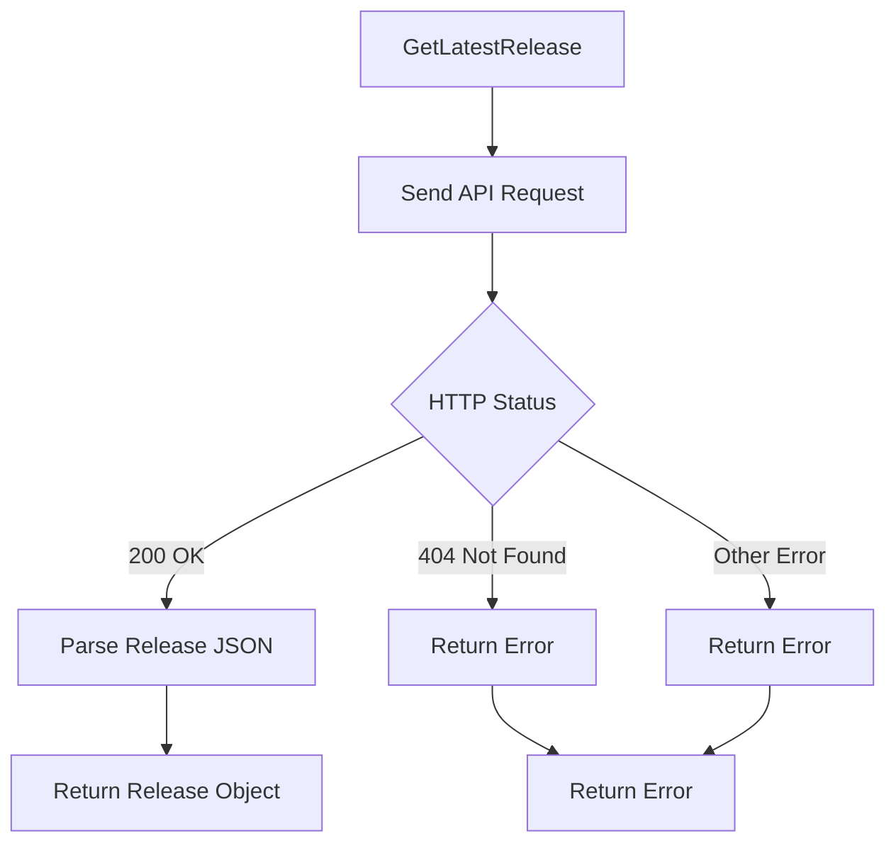
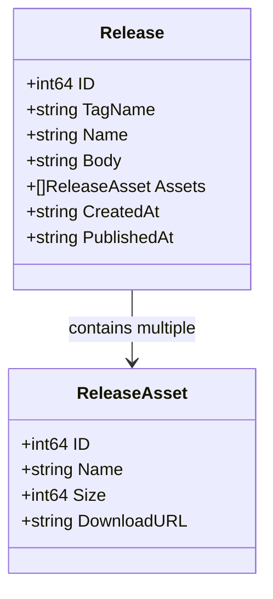
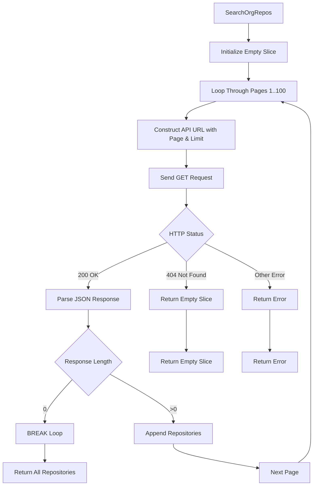
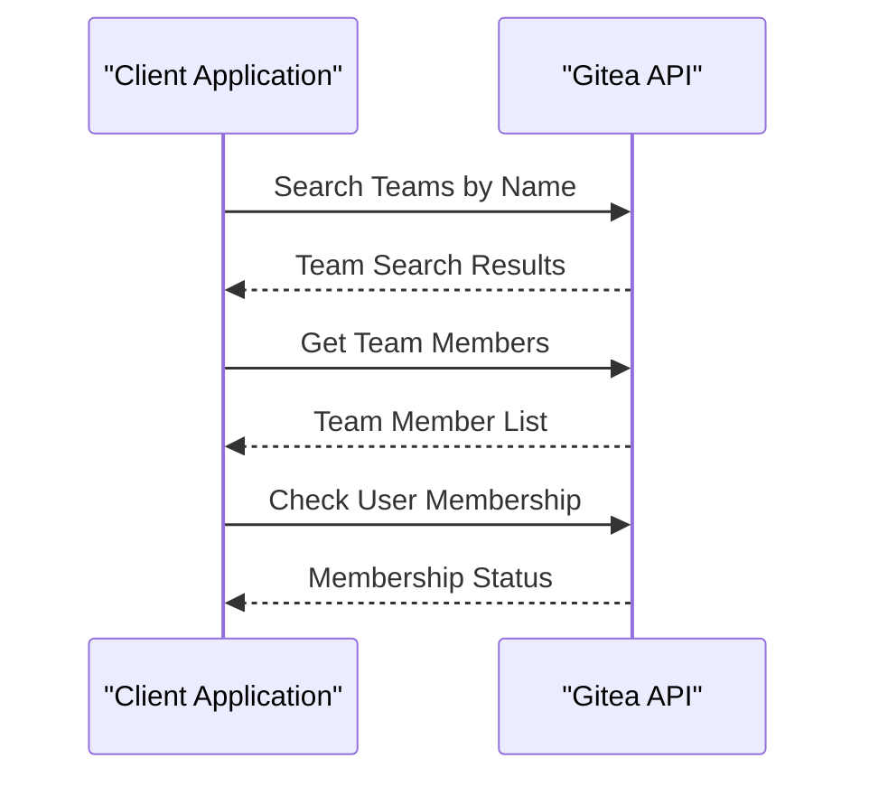
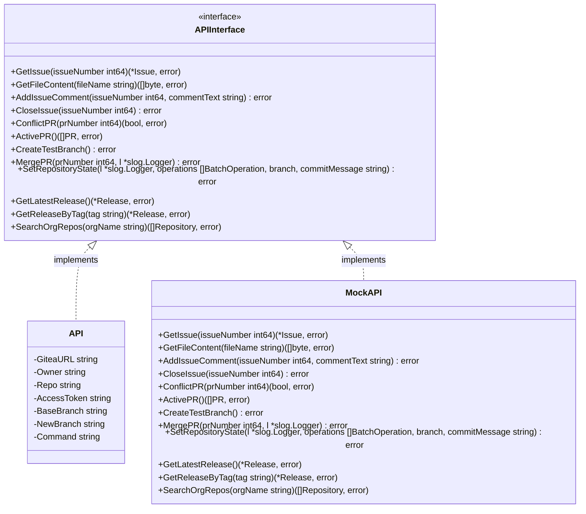
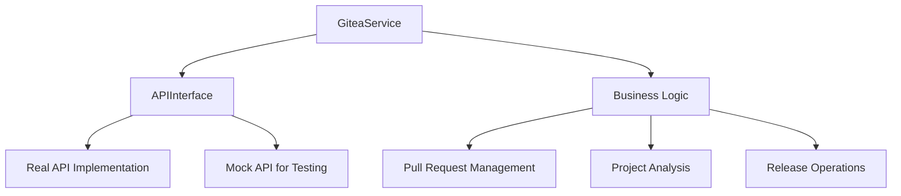
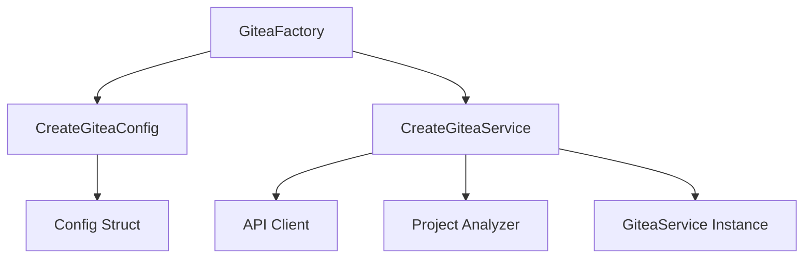
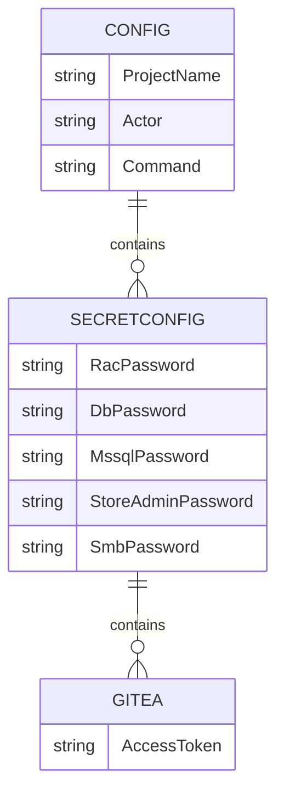
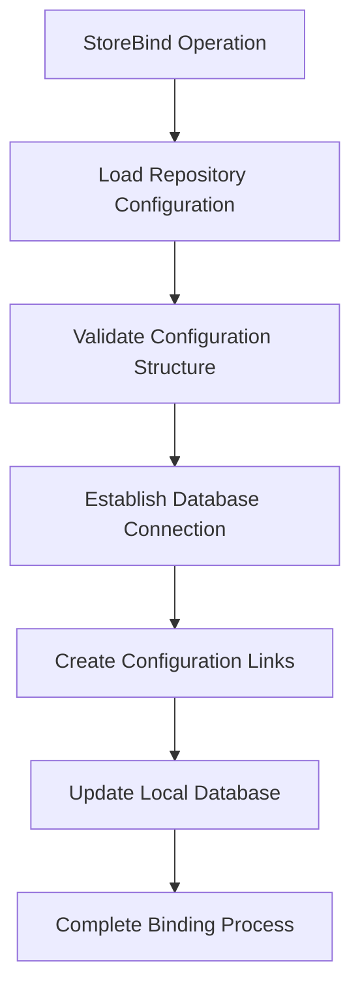

# Gitea Integration

<cite>
**Referenced Files in This Document**
- [gitea.go](file://internal/entity/gitea/gitea.go)
- [interfaces.go](file://internal/entity/gitea/interfaces.go)
- [gitea_service.go](file://internal/service/gitea_service.go)
- [gitea_factory.go](file://internal/service/gitea_factory.go)
- [config.go](file://internal/config/config.go)
- [constants.go](file://internal/constants/constants.go)
- [extension_publish.go](file://internal/app/extension_publish.go)
- [gitea_release_test.go](file://internal/entity/gitea/gitea_release_test.go)
- [action.yaml](file://config/action.yaml)
- [Git2Store.puml](file://old/PlantUML/Git2Store.puml)
</cite>

## Update Summary
**Changes Made**
- Added comprehensive release management capabilities with GetLatestRelease and GetReleaseByTag methods
- Implemented repository search functionality with SearchOrgRepos for organization-wide repository discovery
- Enhanced error handling with improved conflict resolution and retry logic for large repositories
- Expanded interface abstraction to support new release and search operations
- Updated authentication and access token management documentation
- Added practical examples for release-based extension publishing workflows

## Table of Contents
1. [Introduction](#introduction)
2. [Core Repository Operations](#core-repository-operations)
3. [Release Management](#release-management)
4. [Repository Search Capabilities](#repository-search-capabilities)
5. [Interface Abstraction and Mock Testing](#interface-abstraction-and-mock-testing)
6. [Authentication and Access Token Management](#authentication-and-access-token-management)
7. [Git2Store and StoreBind Workflows](#git2store-and-storebind-workflows)
8. [Error Handling and Common Issues](#error-handling-and-common-issues)
9. [Webhook Configuration and Event Delivery](#webhook-configuration-and-event-delivery)
10. [Best Practices](#best-practices)

## Introduction
The Gitea integration in apk-ci provides a comprehensive interface for managing repository operations, including branch creation, commit retrieval, pull request management, issue tracking, release management, and repository search capabilities. The integration supports automated workflows for synchronizing 1C configurations with Gitea repositories through Git2Store and storebind operations, with enhanced release-based publishing workflows.

The integration follows a layered architecture with clear separation between the API client, service layer, and business logic. It leverages interface abstraction to enable mock testing and extensibility, allowing for flexible configuration and reliable operation in various environments. The system uses access tokens from SecretConfig.Gitea for authentication and implements robust error handling for common issues such as rate limits, merge conflicts, synchronization race conditions, and repository search limitations.

**Section sources**
- [gitea.go](file://internal/entity/gitea/gitea.go#L1-L100)
- [gitea_service.go](file://internal/service/gitea_service.go#L1-L50)

## Core Repository Operations

### Branch Creation and Management
The Gitea integration provides comprehensive functionality for branch operations, enabling automated creation, deletion, and management of branches within the repository. The `CreateTestBranch` method creates a new test branch based on a specified base branch, which is essential for isolated testing and development workflows.


**Diagram sources**
- [gitea.go](file://internal/entity/gitea/gitea.go#L324-L338)

The branch creation process involves constructing an API request with the new branch name and the reference to the base branch. The system validates the response status code to ensure successful creation, returning appropriate errors for any failures. Similarly, the `DeleteTestBranch` method removes temporary branches after testing is complete, maintaining repository cleanliness.

**Section sources**
- [gitea.go](file://internal/entity/gitea/gitea.go#L324-L338)
- [gitea.go](file://internal/entity/gitea/gitea.go#L510-L518)

### Commit Retrieval and History Analysis
The integration supports comprehensive commit retrieval and history analysis capabilities. The `GetCommits` method retrieves a list of commits from a specified branch, with optional limiting of results. For more detailed analysis, the `GetCommitsBetween` method compares two commit SHAs to identify differences, while `GetBranchCommitRange` determines the first and last commits in a branch's history.

These operations are crucial for understanding changes between different states of the repository and for implementing change tracking in the Git2Store workflow. The commit data includes author information, timestamps, and commit messages, providing rich context for analysis and reporting.

**Section sources**
- [gitea.go](file://internal/entity/gitea/gitea.go#L1257-L1279)
- [gitea.go](file://internal/entity/gitea/gitea.go#L1329-L1372)

### Pull Request Management
Pull request (PR) management is a core component of the Gitea integration, enabling automated code review and merge processes. The `CreatePR` method initiates a new pull request by specifying the source (head) and target (base) branches, while `ActivePR` retrieves all open PRs for processing.

The integration now includes sophisticated asynchronous conflict detection through the `ConflictPR` and `ConflictFilesPR` methods, which determine whether a PR can be automatically merged or requires manual intervention. When dealing with large repositories, Gitea may return a "checking" status indicating that conflict analysis is running in the background. The enhanced implementation now includes retry logic to handle this scenario.

```go
// ConflictPR checks for merge conflicts in a pull request with retry logic for large repositories
func (g *API) ConflictPR(prNumber int64) (bool, error) {
	const (
		maxRetries      = 60             // Maximum number of attempts (60 * 5 seconds = 5 minutes)
		retryInterval   = 5 * time.Second // Interval between attempts
	)

	urlString := fmt.Sprintf("%s/api/%s/repos/%s/%s/pulls/%d", g.GiteaURL, constants.APIVersion, g.Owner, g.Repo, prNumber)

	for attempt := 0; attempt < maxRetries; attempt++ {
		statusCode, body, _ := g.sendReq(urlString, "", "GET")
		if statusCode != http.StatusOK {
			return true, fmt.Errorf("error getting PR data: %d %d", prNumber, statusCode)
		}
		r := strings.NewReader(body)

		var pr PullRequest
		if err := json.NewDecoder(r).Decode(&pr); err != nil {
			return true, err
		}

		// Check mergeability status
		switch pr.MergeableState {
		case "checking":
			// Conflict check is still running in background, wait and retry
			if attempt < maxRetries-1 {
				log.Printf("PR %d: conflict check running in background, waiting %v (attempt %d/%d)",
					prNumber, retryInterval, attempt+1, maxRetries)
				time.Sleep(retryInterval)
				continue
			}
			// Reached maximum attempts
			return true, fmt.Errorf("timeout waiting for conflict check completion for PR %d", prNumber)

		case "conflict", "behind", "blocked":
			// Conflicts or other issues preventing merge
			return true, nil

		case "success", "unstable", "has_hooks":
			// Can be merged (unstable and has_hooks are not critical blockers)
			return false, nil

		default:
			// For unknown statuses or empty values, use Mergeable field
			if pr.Mergeable {
				return false, nil
			}
			return true, nil
		}
	}

	// Should not reach here, but just in case
	return true, fmt.Errorf("could not determine conflict status for PR %d", prNumber)
}
```

This implementation handles the asynchronous nature of conflict checking in large repositories by polling the PR status with exponential backoff until a definitive result is obtained or a timeout occurs. The maximum wait time is approximately 5 minutes (60 attempts × 5 seconds), which is sufficient for most large repository scenarios.


**Diagram sources**
- [gitea.go](file://internal/entity/gitea/gitea.go#L561-L613)
- [gitea_service.go](file://internal/service/gitea_service.go#L36-L166)

**Section sources**
- [gitea.go](file://internal/entity/gitea/gitea.go#L561-L613)
- [gitea.go](file://internal/entity/gitea/gitea.go#L624-L642)
- [gitea_service.go](file://internal/service/gitea_service.go#L36-L166)

### Issue Tracking and Management
The integration provides comprehensive issue tracking capabilities, allowing for automated creation, updating, and closure of issues in the Gitea repository. The `GetIssue` method retrieves detailed information about a specific issue, including its title, body, state, and metadata.

For collaboration and notification purposes, the `AddIssueComment` method enables adding comments to existing issues, while `CloseIssue` changes an issue's state to closed when work is completed. These operations are integrated into various workflows, such as notifying developers about merge conflicts or reporting the completion of automated tasks.

**Section sources**
- [gitea.go](file://internal/entity/gitea/gitea.go#L349-L368)
- [gitea.go](file://internal/entity/gitea/gitea.go#L429-L443)
- [gitea.go](file://internal/entity/gitea/gitea.go#L453-L467)

## Release Management

### Latest Release Retrieval
The integration now includes comprehensive release management capabilities through the `GetLatestRelease` method, which retrieves information about the most recent release in the repository. This method returns a `Release` struct containing metadata such as tag name, release name, description, publication timestamp, and attached assets.



**Diagram sources**
- [gitea.go](file://internal/entity/gitea/gitea.go#L1187-L1210)

The method handles various error scenarios including releases not found (HTTP 404) and server errors (HTTP 5xx). When successful, it returns a fully populated `Release` object with all associated assets and metadata.

**Section sources**
- [gitea.go](file://internal/entity/gitea/gitea.go#L1187-L1210)

### Tag-Based Release Lookup
For more specific release retrieval, the `GetReleaseByTag` method allows searching for releases by their exact tag name. This method URL-encodes the tag parameter to handle special characters and spaces in tag names.

```mermaid
flowchart TD
A[GetReleaseByTag] --> B[URL-Encode Tag Parameter]
B --> C[Send API Request to /releases/tags/{tag}]
C --> D{HTTP Status}
D --> |200 OK| E[Parse Release JSON]
D --> |404 Not Found| F[Return Error: Release Not Found]
D --> |Other Error| G[Return Error]
E --> H[Return Release Object]
F --> I[Return Error]
G --> I
```

**Diagram sources**
- [gitea.go](file://internal/entity/gitea/gitea.go#L1220-L1246)

This method is particularly useful for extension publishing workflows where releases are tagged with semantic versioning schemes (e.g., "v1.2.3"). The URL encoding ensures compatibility with tags containing forward slashes, hyphens, and other special characters.

**Section sources**
- [gitea.go](file://internal/entity/gitea/gitea.go#L1220-L1246)

### Release Asset Management
The `Release` and `ReleaseAsset` structures provide comprehensive support for release artifacts. Each release can contain multiple assets (binary files, documentation, etc.), with each asset having properties like ID, name, size, and download URL.



**Diagram sources**
- [gitea.go](file://internal/entity/gitea/gitea.go#L269-L286)

**Section sources**
- [gitea.go](file://internal/entity/gitea/gitea.go#L269-L286)

## Repository Search Capabilities

### Organization-Wide Repository Discovery
The integration includes powerful repository search capabilities through the `SearchOrgRepos` method, which performs pagination-aware searches across all repositories within an organization. This functionality is essential for extension publishing workflows where multiple repositories need to be scanned for subscription configurations.



**Diagram sources**
- [gitea.go](file://internal/entity/gitea/gitea.go#L2095-L2130)

The search implementation includes several safety mechanisms:
- **Pagination Control**: Maximum 100 pages with 50 repositories per page limit
- **Error Handling**: Graceful handling of organization-not-found scenarios
- **Early Termination**: Stops when an empty response is received
- **Memory Efficiency**: Builds results incrementally to handle large organizations

**Section sources**
- [gitea.go](file://internal/entity/gitea/gitea.go#L2095-L2130)

### Team and User Management
The integration provides comprehensive team and user management capabilities through methods like `IsUserInTeam` and `GetTeamMembers`. These functions enable role-based access control and permission management for automated workflows.



**Diagram sources**
- [gitea.go](file://internal/entity/gitea/gitea.go#L851-L913)
- [gitea.go](file://internal/entity/gitea/gitea.go#L1076-L1146)

**Section sources**
- [gitea.go](file://internal/entity/gitea/gitea.go#L851-L913)
- [gitea.go](file://internal/entity/gitea/gitea.go#L1076-L1146)

## Interface Abstraction and Mock Testing

### API Interface Definition
The Gitea integration employs a robust interface abstraction pattern to enhance testability and extensibility. The `APIInterface` defined in interfaces.go specifies all methods that can be performed on the Gitea API, creating a contract that can be implemented by different concrete types.



**Diagram sources**
- [interfaces.go](file://internal/entity/gitea/interfaces.go#L18-L57)
- [gitea.go](file://internal/entity/gitea/gitea.go#L289-L317)

This interface abstraction allows for dependency injection and makes the system highly testable. During unit tests, a mock implementation of the interface can be used instead of the real API, enabling comprehensive testing without requiring a live Gitea server.

**Section sources**
- [interfaces.go](file://internal/entity/gitea/interfaces.go#L18-L57)

### Service Layer Implementation
The service layer, implemented in gitea_service.go, utilizes the interface abstraction to provide business logic for Gitea operations. The `GiteaService` struct contains an instance of `APIInterface`, allowing it to work with any implementation that satisfies the interface contract.

The service layer decouples business logic from the specific API implementation, making it easier to modify or replace the underlying API client without affecting higher-level functionality. This separation also facilitates testing, as the service can be tested with a mock API implementation.



**Diagram sources**
- [gitea_service.go](file://internal/service/gitea_service.go#L12-L35)

**Section sources**
- [gitea_service.go](file://internal/service/gitea_service.go#L12-L35)

### Factory Pattern for Component Creation
The integration uses a factory pattern to create and configure Gitea components, implemented in gitea_factory.go. The `GiteaFactory` struct provides methods for creating both the API configuration and the complete Gitea service with all dependencies properly injected.

This approach centralizes the creation logic and ensures consistent configuration across the application. The factory pattern also makes it easy to extend the system with new components or modify existing ones without changing the code that uses them.



**Diagram sources**
- [gitea_factory.go](file://internal/service/gitea_factory.go#L8-L65)

**Section sources**
- [gitea_factory.go](file://internal/service/gitea_factory.go#L8-L65)

## Authentication and Access Token Management

### Access Token Configuration
The Gitea integration uses access tokens for authentication, which are securely managed through the configuration system. The tokens are stored in the `SecretConfig` structure, specifically in the `Gitea.AccessToken` field, ensuring they are kept separate from other configuration data.



**Diagram sources**
- [config.go](file://internal/config/config.go#L76-L100)

The access token is passed to the Gitea API client during initialization and included in the Authorization header of all API requests. This ensures that all operations are performed with the appropriate permissions.

**Section sources**
- [config.go](file://internal/config/config.go#L76-L100)

### Token Scope Requirements
For the Gitea integration to function correctly, the access token must have sufficient permissions to perform all required operations. The minimum required scopes include:

- **Repository Read/Write**: To read repository contents, create branches, and manage pull requests
- **Issue Management**: To create, update, and close issues
- **Commit Access**: To retrieve commit information and history
- **Team Membership**: To check user membership in teams for access control
- **Release Management**: To access release information and assets
- **Repository Search**: To discover repositories across organizations

The system does not specify exact scope names as these may vary between Gitea installations, but the token must allow all operations performed by the API methods. Insufficient permissions will result in HTTP 403 errors, which are handled appropriately by the integration.

**Section sources**
- [gitea.go](file://internal/entity/gitea/gitea.go#L1187-L1246)

## Git2Store and StoreBind Workflows

### Git2Store Workflow Overview
The Git2Store workflow synchronizes 1C configurations from Gitea repositories to local storage, enabling version-controlled management of 1C applications. The process begins with retrieving the repository contents and analyzing the project structure to identify the main configuration and any extensions.


**Diagram sources**
- [Git2Store.puml](file://old/PlantUML/Git2Store.puml#L1-L30)

The workflow is triggered by the `ActGit2store` command and uses the Gitea API to retrieve files from the specified branch. Each file is processed according to its type and location within the repository structure.

**Section sources**
- [Git2Store.puml](file://old/PlantUML/Git2Store.puml#L1-L56)

### StoreBind Synchronization Process
The storebind workflow establishes and maintains the connection between the 1C configuration in the Gitea repository and the local database. This process ensures that changes made in the repository are properly reflected in the database and vice versa.

The `StoreBind` operation, implemented in the one/convert package, binds the repository configuration to the database, creating the necessary links for synchronization. This includes setting up the main configuration and any extensions, ensuring they are properly ordered and configured.



**Diagram sources**
- [convert.go](file://internal/entity/one/convert/convert.go#L466-L502)

**Section sources**
- [convert.go](file://internal/entity/one/convert/convert.go#L466-L502)

## Error Handling and Common Issues

### Asynchronous Conflict Checking and Retry Logic
The enhanced Gitea integration now includes robust handling of asynchronous merge conflict checking, particularly important for large repositories where conflict analysis may take significant time. The `ConflictPR` method has been updated to handle the "checking" status that Gitea returns when conflict analysis is running in the background.

The implementation uses a polling mechanism with configurable retry parameters:

```go
const (
	maxRetries    = 60             // Maximum number of attempts
	retryInterval = 5 * time.Second // Interval between attempts
)
```

When a PR's mergeable_state is "checking", the method will automatically poll the PR status every 5 seconds until a definitive result is obtained (success, conflict, etc.) or the maximum number of retries is reached (approximately 5 minutes total wait time).

This approach ensures that the integration can reliably determine mergeability even for large repositories, eliminating race conditions that could occur with immediate failure on "checking" status.

**Section sources**
- [gitea.go](file://internal/entity/gitea/gitea.go#L561-L613)

### Release Management Error Handling
The release management methods include comprehensive error handling for various scenarios:

- **Release Not Found**: Returns specific error when `GetLatestRelease` or `GetReleaseByTag` encounters HTTP 404
- **Network Errors**: Handles connection failures gracefully with descriptive error messages
- **JSON Parsing Errors**: Validates response format and provides meaningful error feedback
- **URL Encoding Issues**: Properly encodes tag parameters to handle special characters

```go
// Example error handling pattern for release operations
func (g *API) GetLatestRelease() (*Release, error) {
	urlString := fmt.Sprintf("%s/api/%s/repos/%s/%s/releases/latest", g.GiteaURL, constants.APIVersion, g.Owner, g.Repo)

	statusCode, body, err := g.sendReq(urlString, "", "GET")
	if err != nil {
		return nil, fmt.Errorf("ошибка при выполнении запроса: %v", err)
	}

	if statusCode == http.StatusNotFound {
		return nil, fmt.Errorf("релиз не найден")
	}

	if statusCode != http.StatusOK {
		return nil, fmt.Errorf("ошибка при получении релиза: статус %d", statusCode)
	}

	var release Release
	err = json.Unmarshal([]byte(body), &release)
	if err != nil {
		return nil, fmt.Errorf("ошибка при разборе JSON: %v", err)
	}

	return &release, nil
}
```

**Section sources**
- [gitea.go](file://internal/entity/gitea/gitea.go#L1187-L1210)

### Repository Search Pagination Safety
The repository search functionality includes built-in safety mechanisms to prevent infinite loops and excessive API calls:

- **Maximum Pages**: Limits search to 100 pages maximum
- **Page Size Control**: Enforces 50 repositories per page limit
- **Early Exit**: Stops when empty response is received
- **Organization Validation**: Handles organization-not-found gracefully

**Section sources**
- [gitea.go](file://internal/entity/gitea/gitea.go#L2095-L2130)

### Rate Limit Handling
The integration includes comprehensive rate limit handling to prevent API throttling. When rate limits are approached or exceeded, the system implements exponential backoff with jitter to avoid overwhelming the Gitea server.

```go
// Example rate limit handling pattern
func (g *API) handleRateLimit(err error, attempt int) error {
	if isRateLimitError(err) {
		backoff := calculateBackoff(attempt)
		time.Sleep(backoff)
		return nil // Continue retrying
	}
	return err // Return actual error
}
```

**Section sources**
- [gitea.go](file://internal/entity/gitea/gitea.go#L469-L503)

### Merge Conflict Resolution
When merge conflicts are detected, the system follows a structured resolution process:

1. Attempt automatic merge
2. If conflicts detected, analyze conflicting files
3. Notify developers via issue comments
4. Close problematic PRs to prevent blocking
5. Log detailed conflict information for debugging

The enhanced implementation now waits for definitive conflict status in large repositories before proceeding with resolution steps.

**Section sources**
- [gitea.go](file://internal/entity/gitea/gitea.go#L529-L548)
- [gitea_service.go](file://internal/service/gitea_service.go#L104-L149)

## Webhook Configuration and Event Delivery
To trigger automated scans and ensure reliable event delivery, configure webhooks in your Gitea repository with the following settings:

- **Trigger events**: Push events, Pull Request events, Release events
- **Content type**: application/json
- **SSL verification**: Enabled (recommended)
- **Secret**: Configure a shared secret for payload verification

The webhook endpoint should be configured to handle the following event types:
- `push`: Trigger repository scans and analysis
- `pull_request`: Initiate merge conflict checking
- `issue`: Update issue tracking and notifications
- `release`: Trigger extension publishing workflows

Ensure your webhook URL is accessible from the Gitea server and implement proper error handling to prevent event loss.

**Section sources**
- [action.yaml](file://config/action.yaml)

## Best Practices
1. **Use dedicated access tokens** with minimal required permissions
2. **Implement exponential backoff** for API rate limits
3. **Configure webhook secrets** for payload verification
4. **Monitor API usage** to avoid rate limiting
5. **Use descriptive commit messages** for better change tracking
6. **Regularly rotate access tokens** for security
7. **Implement proper error handling** for network failures
8. **Test webhook delivery** regularly to ensure reliability

For large repositories, consider:
- Increasing the conflict check timeout
- Implementing batch processing for multiple PRs
- Using repository mirroring for faster access
- Caching frequently accessed data

For release-based workflows:
- Use semantic versioning for release tags
- Include release notes and changelogs
- Attach binary assets and documentation
- Monitor release distribution to subscribers

For repository search operations:
- Implement pagination controls
- Handle organization boundaries
- Cache search results when appropriate
- Monitor API quotas for search operations

**Section sources**
- [gitea.go](file://internal/entity/gitea/gitea.go)
- [config.go](file://internal/config/config.go)
- [extension_publish.go](file://internal/app/extension_publish.go)