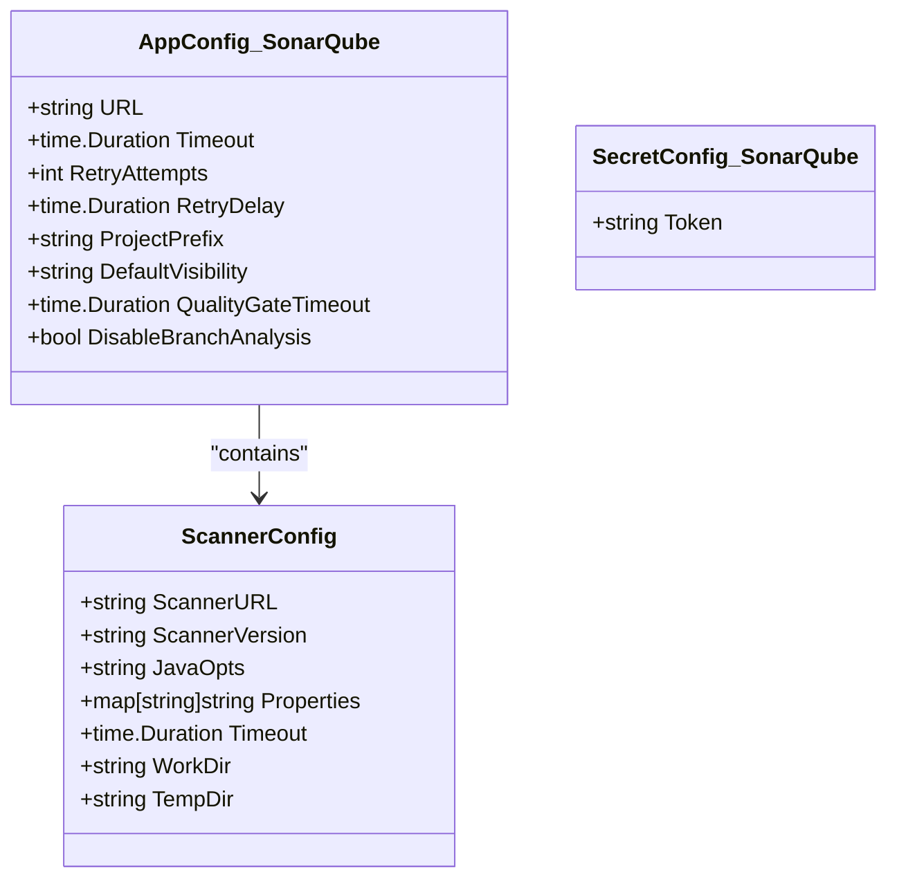
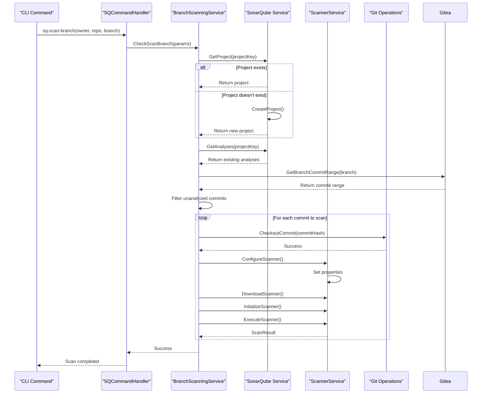
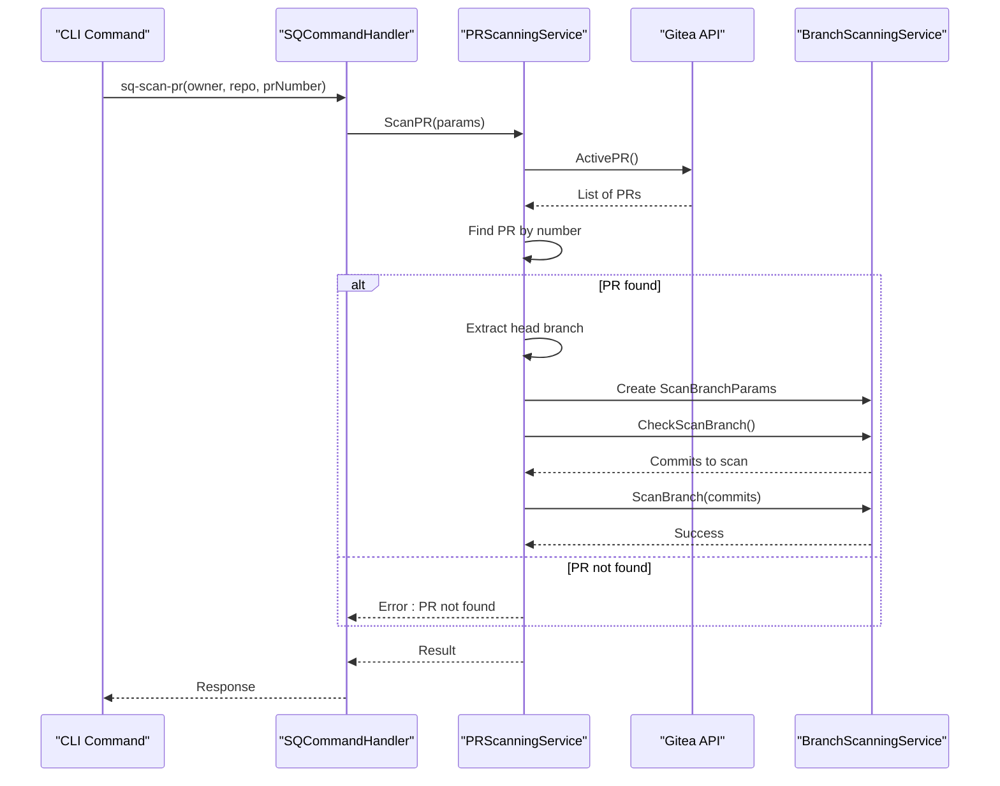
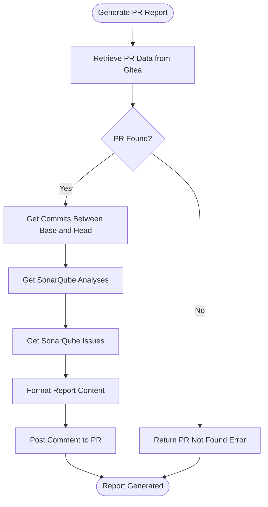
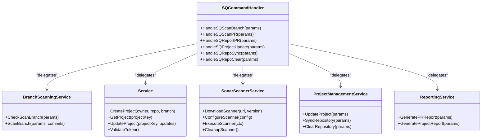
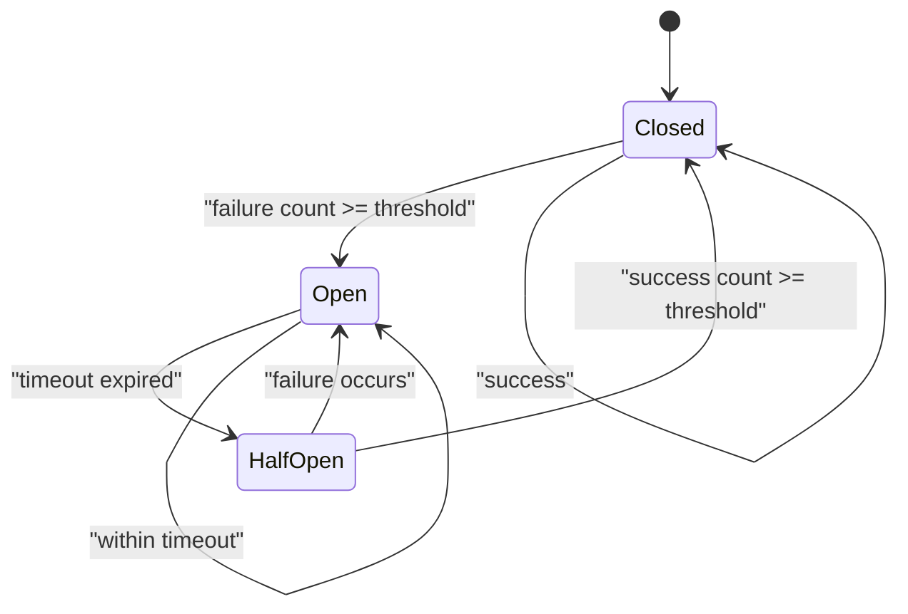

# SonarQube Integration

<cite>
**Referenced Files in This Document**   
- [sonarqube.go](file://internal/config/sonarqube.go)
- [service.go](file://internal/service/sonarqube/service.go)
- [command_handler.go](file://internal/service/sonarqube/command_handler.go)
- [branch_scanner_service.go](file://internal/service/sonarqube/branch_scanner_service.go)
- [scanner.go](file://internal/service/sonarqube/scanner.go)
- [reporting.go](file://internal/service/sonarqube/reporting.go)
- [branch.go](file://internal/service/sonarqube/branch.go)
- [pr.go](file://internal/service/sonarqube/pr.go)
- [config.go](file://internal/service/sonarqube/config.go)
- [error_handling.go](file://internal/service/sonarqube/error_handling.go)
</cite>

## Table of Contents
1. [Introduction](#introduction)
2. [Configuration Structure](#configuration-structure)
3. [Branch Scanning Implementation](#branch-scanning-implementation)
4. [Pull Request Analysis Workflow](#pull-request-analysis-workflow)
5. [Report Generation Process](#report-generation-process)
6. [Command Execution Flow](#command-execution-flow)
7. [Error Handling and Retry Mechanisms](#error-handling-and-retry-mechanisms)
8. [Data Flow and API Interactions](#data-flow-and-api-interactions)
9. [Performance Considerations](#performance-considerations)
10. [Troubleshooting Guide](#troubleshooting-guide)

## Introduction
The SonarQube integration in apk-ci provides comprehensive code quality analysis capabilities through seamless integration with the SonarQube platform. This documentation details the implementation of branch scanning, pull request analysis, and report generation functionality that enables automated code quality checks within the CI/CD pipeline. The integration is designed to support both individual branch scans and pull request analyses, with robust error handling, retry mechanisms, and performance optimizations. The system leverages a modular architecture with distinct service layers for configuration management, scanning operations, reporting, and error resilience, ensuring maintainability and extensibility.

**Section sources**
- [service.go](file://internal/service/sonarqube/service.go#L1-L50)
- [command_handler.go](file://internal/service/sonarqube/command_handler.go#L1-L50)

## Configuration Structure
The SonarQube integration utilizes a dual-configuration approach with separate structures for application and secret configurations. The `AppConfig.SonarQube` structure defines the operational parameters including the SonarQube server URL, timeout settings, retry attempts, retry delay, project prefix, default visibility, quality gate timeout, and branch analysis enablement. These values can be set via configuration files or environment variables, with environment variables taking precedence. The `SecretConfig.SonarQube` structure contains sensitive information, primarily the authentication token used for accessing the SonarQube API. Token-based authentication is implemented with the token being passed as the "sonar.login" parameter during scanner execution. The configuration system supports hierarchical loading from multiple sources and includes validation logic to ensure all required fields are properly configured before use.

**Diagram sources**
- [sonarqube.go](file://internal/config/sonarqube.go#L15-L150)
- [config.go](file://internal/service/sonarqube/config.go#L15-L100)

**Section sources**
- [sonarqube.go](file://internal/config/sonarqube.go#L15-L250)
- [config.go](file://internal/service/sonarqube/config.go#L15-L200)

## Branch Scanning Implementation
The branch scanning functionality is implemented through a coordinated workflow between multiple service components. When the `sq-scan-branch` command is invoked, the `BranchScanningService` orchestrates the scanning process by first determining which commits require analysis. This determination is made by comparing existing SonarQube analyses with the commit history from the Gitea repository. The service generates a project key using the owner, repository, and branch names, optionally prefixed according to configuration. If the project doesn't exist in SonarQube, it is automatically created. For each commit identified for scanning, the system performs a git checkout to the specific commit hash, configures the sonar-scanner with appropriate properties (including project key, source directory, SonarQube server URL, authentication token, and commit SHA), downloads and initializes the scanner if necessary, and executes the scan. The scanner configuration also includes branch-specific parameters when branch analysis is enabled.

**Diagram sources**
- [branch.go](file://internal/service/sonarqube/branch.go#L15-L400)
- [branch_scanner_service.go](file://internal/service/sonarqube/branch_scanner_service.go#L15-L400)
- [command_handler.go](file://internal/service/sonarqube/command_handler.go#L15-L100)

**Section sources**
- [branch.go](file://internal/service/sonarqube/branch.go#L15-L400)
- [branch_scanner_service.go](file://internal/service/sonarqube/branch_scanner_service.go#L15-L400)

## Pull Request Analysis Workflow
The pull request analysis workflow begins when the `sq-scan-pr` command is executed with the pull request number as a parameter. The `SQCommandHandler` processes this command by first retrieving all active pull requests from the Gitea API to locate the specific PR by its number. Once the PR is identified, the system extracts the head branch information from the PR metadata and creates branch scanning parameters targeting this source branch. The same commit filtering logic used in branch scanning is applied to determine which commits require analysis, preventing redundant scans of already-analyzed commits. The scanning process then proceeds identically to the branch scanning workflow, with the scanner being configured and executed for each unanalyzed commit. After successful scanning, the system can generate a PR-specific report that summarizes the analysis findings and posts them as a comment on the pull request, providing immediate feedback to developers.

**Diagram sources**
- [pr.go](file://internal/service/sonarqube/pr.go#L15-L120)
- [command_handler.go](file://internal/service/sonarqube/command_handler.go#L15-L100)
- [branch.go](file://internal/service/sonarqube/branch.go#L15-L400)

**Section sources**
- [pr.go](file://internal/service/sonarqube/pr.go#L15-L120)
- [command_handler.go](file://internal/service/sonarqube/command_handler.go#L15-L100)

## Report Generation Process
The report generation process is handled by the `ReportingService`, which coordinates the creation of various types of reports including pull request reports, branch reports, and project reports. For pull request reports, the service retrieves the latest SonarQube analysis data and issues for the associated project, formats this information into a structured markdown report, and posts it as a comment on the pull request using the Gitea API. The report includes key metrics such as analysis date, project key, number of commits in the PR, and a summary of detected issues grouped by severity. Project reports provide a more comprehensive overview, aggregating analysis data across multiple branches and presenting detailed issue statistics. The reporting system is designed to be extensible, allowing for additional report types and output formats to be added as needed. All reports include a standardized footer identifying the generating system.

**Diagram sources**
- [reporting.go](file://internal/service/sonarqube/reporting.go#L15-L300)
- [command_handler.go](file://internal/service/sonarqube/command_handler.go#L15-L100)

**Section sources**
- [reporting.go](file://internal/service/sonarqube/reporting.go#L15-L300)

## Command Execution Flow
The command execution flow is managed by the `SQCommandHandler`, which serves as the central coordinator for all SonarQube-related operations. When commands such as `sq-scan-branch`, `sq-scan-pr`, or `sq-report-pr` are invoked, they are routed through the command handler which delegates the work to specialized services based on the command type. The handler maintains references to various service instances including the branch scanning service, SonarQube service, scanner service, project management service, and reporting service. This design follows the command pattern, providing a consistent interface for executing different operations while encapsulating the complexity of service coordination. The command handler also handles parameter validation, error propagation, and logging, ensuring that all operations are properly monitored and that failures are reported consistently.

**Diagram sources**
- [command_handler.go](file://internal/service/sonarqube/command_handler.go#L15-L300)
- [service.go](file://internal/service/sonarqube/service.go#L15-L100)
- [scanner.go](file://internal/service/sonarqube/scanner.go#L15-L100)

**Section sources**
- [command_handler.go](file://internal/service/sonarqube/command_handler.go#L15-L300)

## Error Handling and Retry Mechanisms
The SonarQube integration implements comprehensive error handling and retry mechanisms to ensure reliability in the face of transient failures. The `ErrorHandlingService` provides a unified approach to error management, including typed errors for different failure categories (SonarQube errors, scanner errors, and validation errors), retry logic with exponential backoff, and circuit breaker patterns. The retry mechanism allows configurable maximum retry attempts, initial delay, and maximum delay, with delays increasing exponentially between attempts. The circuit breaker prevents cascading failures by temporarily blocking requests when a service is deemed unhealthy, transitioning through closed, open, and half-open states based on failure and success thresholds. Specific retryable errors include connection issues, timeouts, and temporary failures, while non-retryable errors typically indicate permanent problems such as invalid credentials or missing resources.

**Diagram sources**
- [error_handling.go](file://internal/service/sonarqube/error_handling.go#L15-L300)
- [branch_scanner_service.go](file://internal/service/sonarqube/branch_scanner_service.go#L15-L100)

**Section sources**
- [error_handling.go](file://internal/service/sonarqube/error_handling.go#L15-L300)

## Data Flow and API Interactions
The data flow between apk-ci and SonarQube involves multiple API interactions across different service layers. The primary data flow begins with command invocation, proceeds through configuration retrieval, project identification, scanner initialization, and finally analysis execution. During scanner initialization, the system downloads the sonar-scanner CLI from the configured URL, extracts it to a working directory, and configures it with project-specific properties. The scanner communicates directly with the SonarQube server to submit analysis results, while the apk-ci services interact with the SonarQube REST API for project management, analysis retrieval, and issue querying. Resource management is handled through temporary directories for scanner operation and cleanup routines that remove temporary files after analysis completion. Validation logic ensures that all required parameters are present and valid before initiating any API calls or scanner executions.

```mermaid
flowchart LR
A[Command Invocation] --> B[Configuration Retrieval]
B --> C[Project Identification]
C --> D[Scanner Initialization]
D --> E[Resource Management]
E --> F[Validation Logic]
F --> G[API Communication]
G --> H[Analysis Execution]
H --> I[Result Processing]
I --> J[Cleanup]
```

**Diagram sources**
- [scanner.go](file://internal/service/sonarqube/scanner.go#L15-L200)
- [service.go](file://internal/service/sonarqube/service.go#L15-L100)
- [branch.go](file://internal/service/sonarqube/branch.go#L15-L100)

**Section sources**
- [scanner.go](file://internal/service/sonarqube/scanner.go#L15-L200)
- [service.go](file://internal/service/sonarqube/service.go#L15-L100)

## Performance Considerations
The SonarQube integration incorporates several performance optimizations to minimize analysis duration and resource consumption. Scan duration optimization is achieved through incremental analysis, where only unanalyzed commits are processed, avoiding redundant scans of previously analyzed code. The system implements parallel execution constraints through semaphore-based limiting of concurrent operations, preventing resource exhaustion when processing multiple branches or repositories. Scanner reuse is optimized by maintaining scanner instances across multiple analyses when possible, reducing the overhead of repeated downloads and initialization. Configuration caching minimizes repeated file I/O operations, while efficient data structures are used for tracking analysis history and commit status. The system also includes timeout mechanisms at multiple levels to prevent hanging operations, with configurable timeout values for both API calls and scanner execution.

**Section sources**
- [branch_scanner_service.go](file://internal/service/sonarqube/branch_scanner_service.go#L15-L100)
- [scanner.go](file://internal/service/sonarqube/scanner.go#L15-L100)
- [monitoring.go](file://internal/service/sonarqube/monitoring.go#L15-L100)

## Troubleshooting Guide
Common issues in the SonarQube integration can be addressed through systematic troubleshooting. For project key mismatches, verify that the owner, repository, and branch names used in the project key generation match exactly with those in the repository, paying attention to case sensitivity and special characters. Webhook misconfigurations can be diagnosed by checking the Gitea webhook settings to ensure they point to the correct apk-ci endpoint and include the necessary payload content. Coverage report upload failures may occur due to incorrect file paths, insufficient permissions, or network connectivity issues; verify that coverage files are generated in the expected location and that the scanner has read access to them. Authentication failures typically stem from invalid or expired tokens; validate the token in the SecretConfig and ensure it has the necessary permissions in SonarQube. Timeout issues can be resolved by adjusting the timeout configuration values or investigating network connectivity between apk-ci and the SonarQube server.

**Section sources**
- [service.go](file://internal/service/sonarqube/service.go#L15-L100)
- [error_handling.go](file://internal/service/sonarqube/error_handling.go#L15-L100)
- [config.go](file://internal/service/sonarqube/config.go#L15-L100)