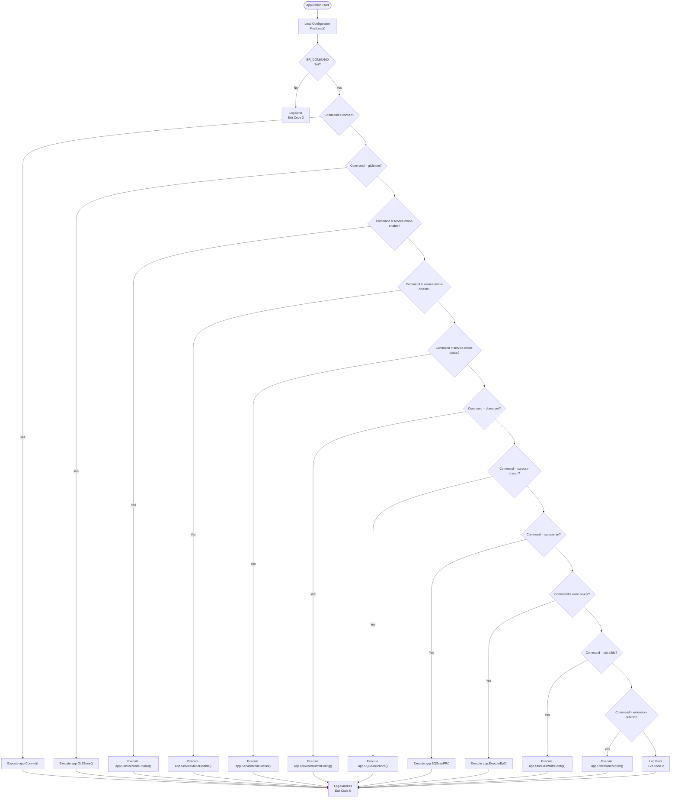

# Command Reference

<cite>
**Referenced Files in This Document**
- [main.go](file://cmd/benadis-runner/main.go)
- [app.go](file://internal/app/app.go)
- [extension_publish.go](file://internal/app/extension_publish.go)
- [constants.go](file://internal/constants/constants.go)
- [config.go](file://internal/config/config.go)
- [action.yaml](file://config/action.yaml)
- [extension-publish.md](file://docs/epics/extension-publish.md)
</cite>

## Table of Contents
1. [Introduction](#introduction)
2. [Command Dispatch Mechanism](#command-dispatch-mechanism)
3. [Exit Codes](#exit-codes)
4. [Command Reference](#command-reference)
   - [convert](#convert)
   - [dbrestore](#dbrestore)
   - [service-mode-enable](#service-mode-enable)
   - [service-mode-disable](#service-mode-disable)
   - [service-mode-status](#service-mode-status)
   - [git2store](#git2store)
   - [store2db](#store2db)
   - [sq-scan-branch](#sq-scan-branch)
   - [sq-scan-pr](#sq-scan-pr)
   - [execute-epf](#execute-epf)
   - [extension-publish](#extension-publish)

## Introduction
The benadis-runner application provides a comprehensive set of commands for automating various operations related to 1C:Enterprise development and deployment processes. These commands are designed to streamline workflows involving database management, configuration synchronization, code analysis, external processing execution, and extension publishing. The command-line interface is driven by environment variables, with the primary BR_COMMAND variable determining which operation to execute. Each command follows a consistent pattern of configuration loading, parameter validation, execution, and error handling, ensuring reliable automation capabilities for CI/CD pipelines and operational tasks.

**Section sources**
- [main.go](file://cmd/benadis-runner/main.go#L1-L50)
- [README.md](file://README.md#L1-L50)

## Command Dispatch Mechanism
The benadis-runner application uses a centralized command dispatch mechanism based on the BR_COMMAND environment variable. When the application starts, it loads configuration from multiple sources (environment variables, configuration files) and then evaluates the BR_COMMAND value to determine which function to invoke. This approach provides flexibility in automation scenarios, allowing different operations to be triggered without changing the executable or its parameters.

The dispatch process begins in main.go where the application loads configuration using config.MustLoad() and then uses a switch statement to route execution to the appropriate handler function in the app package. Each command maps directly to a specific function in app.go, maintaining a clean separation between command routing and business logic implementation.

**Diagram sources**
- [main.go](file://cmd/benadis-runner/main.go#L50-L262)

**Section sources**
- [main.go](file://cmd/benadis-runner/main.go#L50-L262)
- [constants.go](file://internal/constants/constants.go#L50-L100)

## Exit Codes
The benadis-runner application uses a standardized exit code system to communicate the outcome of command execution to calling processes. These exit codes enable automation scripts to handle different scenarios appropriately, such as retrying failed operations or alerting on specific error conditions.

| Exit Code | Meaning | Description |
|-----------|--------|-------------|
| 0 | Success | Command completed successfully |
| 2 | Unknown Command | The specified command was not recognized |
| 5 | Configuration Load Failed | Failed to load configuration from files or environment |
| 6 | Conversion Error | Error occurred during conversion process |
| 7 | Storage Update Error | Error occurred while updating storage |
| 8 | Service Operation Failed | Error occurred during service mode operations |
| 9 | External Processing Failed | Error occurred while executing external processing |
| 10 | Extension Publish Error | Error occurred during extension publishing process |

These exit codes are consistently used across all commands, providing a predictable interface for integration with workflow systems like GitHub Actions, as evidenced by the action.yaml configuration file.

**Section sources**
- [main.go](file://cmd/benadis-runner/main.go#L50-L262)
- [action.yaml](file://config/action.yaml#L1-L50)

## Command Reference

### convert
The convert command performs conversion of 1C:Enterprise projects from repository format. It clones the repository, switches to the appropriate branch, loads converter configuration, and executes the conversion process.

**Syntax**: `BR_COMMAND=convert`

**Parameters**:
- `BR_CONFIG_SYSTEM`: Path to system configuration file
- `BR_CONFIG_PROJECT`: Path to project configuration file
- `BR_WORKDIR`: Working directory path
- `BR_REPOSITORY`: Repository name
- `BR_OWNER`: Repository owner
- `BR_GITEAURL`: Gitea server URL
- `BR_ACCESSTOKEN`: Access token for authentication

**Workflow**:
1. Create temporary directory for repository cloning
2. Initialize Git connection with repository URL and access token
3. Clone the repository to the temporary location
4. Switch to the main branch, then to the source branch specified in converter configuration
5. Load and execute the conversion process using EDT converter
6. Handle any errors during the conversion process

**Expected Outputs**:
- Success: "Конвертация успешно завершена" logged at Info level
- Failure: Error message logged with details about the failure

**Common Usage Patterns**:
- Automated build pipelines that need to convert EDT format to other formats
- Migration scenarios between different 1C configurations

**Anti-patterns**:
- Running without proper repository access permissions
- Insufficient disk space in working directory

**Section sources**
- [main.go](file://cmd/benadis-runner/main.go#L60-L75)
- [app.go](file://internal/app/app.go#L80-L150)

### dbrestore
The dbrestore command restores a 1C database from a backup. It initializes HASP network protection, creates a DBRestore instance from configuration, establishes a connection with timeout context, and performs the restoration process.

**Syntax**: `BR_COMMAND=dbrestore`

**Parameters**:
- `BR_INFOBASE_NAME`: Name of the database to restore
- `BR_CONFIG_SYSTEM`: Path to system configuration file
- `BR_CONFIG_DBDATA`: Path to database configuration file
- `BR_WORKDIR`: Working directory path
- `BR_TMPDIR`: Temporary directory path

**Workflow**:
1. Initialize HASP network protection with predefined server settings
2. Create DBRestore instance from configuration and database name
3. Create context with 30-second timeout for the operation
4. Connect to the database using the configured connection string
5. Perform the restoration process with progress monitoring
6. Clean up resources and handle any errors

**Expected Outputs**:
- Success: "DbRestore успешно выполнен" logged at Info level with database name
- Failure: Error message logged with details about the restoration failure

**Common Usage Patterns**:
- Restoring production databases to test environments
- Disaster recovery procedures
- Database refresh operations for testing

**Anti-patterns**:
- Attempting to restore over an active production database without proper downtime planning
- Insufficient storage space for the restored database

**Section sources**
- [main.go](file://cmd/benadis-runner/main.go#L120-L135)
- [app.go](file://internal/app/app.go#L600-L650)

### service-mode-enable
The service-mode-enable command enables service mode for a specified 1C information base. This blocks user access to the database, allowing administrative operations to be performed without interference from active sessions.

**Syntax**: `BR_COMMAND=service-mode-enable`

**Parameters**:
- `BR_INFOBASE_NAME`: Name of the information base to place in service mode
- `BR_TERMINATE_SESSIONS`: Boolean flag indicating whether to terminate active sessions
- `BR_CONFIG_SYSTEM`: Path to system configuration file
- `BR_CONFIG_DBDATA`: Path to database configuration file

**Workflow**:
1. Validate that BR_INFOBASE_NAME is provided
2. Create a SlogLogger wrapper for structured logging
3. Call servicemode.ManageServiceMode with "enable" action
4. If BR_TERMINATE_SESSIONS is true, force termination of active sessions
5. Wait for all users to disconnect before completing
6. Log success or failure based on the operation result

**Expected Outputs**:
- Success: "Сервисный режим успешно включен" logged at Info level with database name
- Failure: Error message logged with details about why service mode could not be enabled

**Common Usage Patterns**:
- Preparing for database updates or schema changes
- Performing maintenance operations that require exclusive access
- Applying configuration changes that need service mode

**Anti-patterns**:
- Enabling service mode during peak business hours without notification
- Forgetting to disable service mode after completing maintenance

**Section sources**
- [main.go](file://cmd/benadis-runner/main.go#L75-L95)
- [app.go](file://internal/app/app.go#L150-L200)

### service-mode-disable
The service-mode-disable command disables service mode for a specified 1C information base. This restores normal user access to the database after administrative operations have been completed.

**Syntax**: `BR_COMMAND=service-mode-disable`

**Parameters**:
- `BR_INFOBASE_NAME`: Name of the information base to remove from service mode
- `BR_CONFIG_SYSTEM`: Path to system configuration file
- `BR_CONFIG_DBDATA`: Path to database configuration file

**Workflow**:
1. Validate that BR_INFOBASE_NAME is provided
2. Create a SlogLogger wrapper for structured logging
3. Call servicemode.ManageServiceMode with "disable" action
4. Verify that no administrative operations are still running
5. Restore normal connection parameters for user access
6. Log success or failure based on the operation result

**Expected Outputs**:
- Success: "Сервисный режим успешно отключен" logged at Info level with database name
- Failure: Error message logged with details about why service mode could not be disabled

**Common Usage Patterns**:
- Completing maintenance windows
- Restoring access after configuration updates
- Finalizing database migration procedures

**Anti-patterns**:
- Disabling service mode before completing all required administrative tasks
- Not verifying database integrity before restoring user access

**Section sources**
- [main.go](file://cmd/benadis-runner/main.go#L95-L110)
- [app.go](file://internal/app/app.go#L200-L250)

### service-mode-status
The service-mode-status command checks the current status of service mode for a specified 1C information base. It returns information about whether service mode is active and what restrictions are in place.

**Syntax**: `BR_COMMAND=service-mode-status`

**Parameters**:
- `BR_INFOBASE_NAME`: Name of the information base to check
- `BR_CONFIG_SYSTEM`: Path to system configuration file
- `BR_CONFIG_DBDATA`: Path to database configuration file

**Workflow**:
1. Validate that BR_INFOBASE_NAME is provided
2. Create a SlogLogger wrapper for structured logging
3. Call servicemode.ManageServiceMode with "status" action
4. Retrieve information about current service mode settings
5. Check for active sessions and connection restrictions
6. Log the current status regardless of success or failure

**Expected Outputs**:
- Success: Status information logged including whether service mode is enabled and session counts
- Failure: Error message logged with details about why status could not be retrieved

**Common Usage Patterns**:
- Verifying service mode state before performing operations
- Monitoring scripts that track database availability
- Troubleshooting connection issues

**Anti-patterns**:
- Relying solely on this command without attempting actual connections
- Not considering network latency when interpreting results

**Section sources**
- [main.go](file://cmd/benadis-runner/main.go#L110-L120)
- [app.go](file://internal/app/app.go#L250-L300)

### git2store
The git2store command synchronizes data from a Git repository into a 1C configuration repository. This process involves cloning the repository, creating a temporary database, binding to the configuration repository, merging changes, and committing the results.

**Syntax**: `BR_COMMAND=git2store`

**Parameters**:
- `BR_CONFIG_SYSTEM`: Path to system configuration file
- `BR_CONFIG_PROJECT`: Path to project configuration file
- `BR_WORKDIR`: Working directory path
- `BR_REPOSITORY`: Repository name
- `BR_OWNER`: Repository owner
- `BR_GITEAURL`: Gitea server URL
- `BR_ACCESSTOKEN`: Access token for authentication
- `BR_INFOBASE_NAME`: Name of the target information base

**Workflow**:
1. Initialize HASP network protection
2. Create temporary directory for repository cloning
3. Initialize and clone Git repository from EDT branch
4. If using local base, create temporary database
5. Load configuration and initialize database connection
6. Unbind from storage (to resolve locking issues)
7. Switch to 1C branch and update database structure
8. Dump current configuration
9. Bind to storage and perform merge operation
10. Update database again (for extensions)
11. Commit changes to storage with lock release

**Expected Outputs**:
- Success: "Обновление хранилища успешно завершено" logged at Info level
- Failure: Error message logged with details about the synchronization failure

**Common Usage Patterns**:
- Integrating code changes from development branches into 1C configuration
- Automating regular synchronization between Git and 1C repositories
- Deploying configuration changes from version control

**Anti-patterns**:
- Running without sufficient permissions to modify the configuration repository
- Attempting to merge conflicting changes without proper review

**Section sources**
- [main.go](file://cmd/benadis-runner/main.go#L95-L110)
- [app.go](file://internal/app/app.go#L300-L500)

### store2db
The store2db command loads configuration from a 1C configuration repository into a database. This extracts the latest version of the configuration from storage and applies it to the specified database, updating both structure and data according to configuration changes.

**Syntax**: `BR_COMMAND=store2db`

**Parameters**:
- `BR_INFOBASE_NAME`: Name of the database to update
- `BR_CONFIG_SYSTEM`: Path to system configuration file
- `BR_CONFIG_PROJECT`: Path to project configuration file
- `BR_STOREDB`: Type of storage database
- `BR_WORKDIR`: Working directory path

**Workflow**:
1. Initialize HASP network protection
2. Load configuration using the provided parameters
3. Bind to the configuration repository
4. Validate that the bind operation succeeded
5. Complete the configuration loading process
6. Handle any errors during the loading process

**Expected Outputs**:
- Success: "Обновление хранилища успешно завершено" logged at Info level
- Failure: Error message logged with details about the loading failure

**Common Usage Patterns**:
- Deploying configuration changes to test or production environments
- Refreshing databases with the latest configuration
- Initializing new databases with standard configuration

**Anti-patterns**:
- Overwriting customizations in target databases
- Not backing up databases before applying configuration changes

**Section sources**
- [main.go](file://cmd/benadis-runner/main.go#L60-L75)
- [app.go](file://internal/app/app.go#L500-L550)

### sq-scan-branch
The sq-scan-branch command performs SonarQube analysis on a specific branch of code. It initializes SonarQube services, creates scan parameters, checks which commits need scanning, and executes the branch scanning process.

**Syntax**: `BR_COMMAND=sq-scan-branch`

**Parameters**:
- `BR_OWNER`: Repository owner
- `BR_REPO`: Repository name
- `BR_BRANCHFORSCAN`: Branch name to scan
- `BR_COMMITHASH`: Specific commit hash to scan (optional)
- `BR_CONFIG_SYSTEM`: Path to system configuration file
- `BR_CONFIG_PROJECT`: Path to project configuration file

**Workflow**:
1. Validate configuration is not nil
2. Initialize Gitea API client with configuration
3. Initialize SonarQube services with logging
4. Create ProjectUpdateParams with owner, repo, and branch
5. Call HandleSQProjectUpdate with context and parameters
6. Process the scan results and generate reports
7. Handle any errors during the scanning process

**Expected Outputs**:
- Success: "Сканирование ветки SonarQube успешно завершено" logged at Info level
- Failure: Error message logged with details about the scanning failure

**Common Usage Patterns**:
- Continuous integration pipelines that require code quality analysis
- Pre-deployment checks for code quality metrics
- Regular monitoring of technical debt in active branches

**Anti-patterns**:
- Scanning every commit without considering performance impact
- Ignoring critical issues reported by the scan

**Section sources**
- [main.go](file://cmd/benadis-runner/main.go#L200-L215)
- [app.go](file://internal/app/app.go#L550-L600)

### sq-scan-pr
The sq-scan-pr command performs SonarQube analysis on a pull request. It retrieves active PRs from Gitea, finds the requested PR, creates branch scanning parameters, checks commits for scanning, and executes the PR scanning process.

**Syntax**: `BR_COMMAND=sq-scan-pr`

**Parameters**:
- `BR_OWNER`: Repository owner
- `BR_REPO`: Repository name
- `BR_CONFIG_SYSTEM`: Path to system configuration file
- `BR_CONFIG_PROJECT`: Path to project configuration file

**Workflow**:
1. Validate configuration is not nil
2. Initialize Gitea API client with configuration
3. Initialize SonarQube services with logging
4. Retrieve list of active PRs from Gitea
5. Find the specific PR number in the list
6. Create branch scanning parameters using the PR's head branch
7. Check which commits need to be scanned
8. Execute the scanning process on the identified commits
9. Generate quality gate results and reports
10. Handle any errors during the scanning process

**Expected Outputs**:
- Success: "Сканирование pull request SonarQube успешно завершено" logged at Info level
- Failure: Error message logged with details about the scanning failure, including "PR not found" if the PR doesn't exist

**Common Usage Patterns**:
- Pull request gating in CI/CD pipelines
- Code quality enforcement before merging
- Automated feedback on pull request quality

**Anti-patterns**:
- Setting overly strict quality gates that block legitimate development
- Not reviewing false positives in issue detection

**Section sources**
- [main.go](file://cmd/benadis-runner/main.go#L200-L215)
- [app.go](file://internal/app/app.go#L600-L650)

### execute-epf
The execute-epf command executes external 1C:Enterprise processing files (EPF). It validates the EPF URL, downloads the file, and runs it using the 1C Enterprise runtime with proper configuration and logging.

**Syntax**: `BR_COMMAND=execute-epf`

**Parameters**:
- `BR_START_EPF`: URL to the EPF file to execute
- `BR_CONFIG_SYSTEM`: Path to system configuration file
- `BR_CONFIG_PROJECT`: Path to project configuration file
- `BR_WORKDIR`: Working directory path

**Workflow**:
1. Validate that BR_START_EPF is provided
2. Download EPF file from the specified URL
3. Initialize 1C Enterprise runtime with configuration
4. Execute the EPF file with proper logging
5. Handle any errors during execution

**Expected Outputs**:
- Success: "Внешняя обработка успешно выполнена" logged at Info level
- Failure: Error message logged with details about the execution failure

**Common Usage Patterns**:
- Running automated business processes
- Executing custom 1C:Enterprise scripts
- Performing batch operations

**Anti-patterns**:
- Running without proper EPF file permissions
- Not validating EPF file integrity before execution

**Section sources**
- [main.go](file://cmd/benadis-runner/main.go#L184-L193)
- [app.go](file://internal/app/app.go#L700-L750)

### extension-publish
The extension-publish command automatically publishes 1C:Enterprise extensions to all subscribed repositories. This command is triggered by Gitea Actions when a new release is created in the extension repository, and it distributes the updated extension version to all subscribing organizations through automated pull requests.

**Syntax**: `BR_COMMAND=extension-publish`

**Parameters**:
- `GITEA_URL`: Gitea server URL
- `GITHUB_REPOSITORY`: Current repository in format `owner/repo`
- `GITHUB_REF_NAME`: Release tag name (defaults to "main")
- `BR_ACCESS_TOKEN`: Access token for authentication
- `BR_DRY_RUN`: Boolean flag for dry-run mode (default: false)
- `BR_EXT_DIR`: Extension directory path (optional)
- `BR_OUTPUT_JSON`: Output format flag (default: false)

**Workflow**:
1. **Initialization**: Parse repository information from GITHUB_REPOSITORY and validate configuration
2. **Release Retrieval**: Fetch release information using GetReleaseByTag with the specified release tag
3. **Subscriber Discovery**: Search for all subscribed repositories by parsing subscription branches in the format `{Org}_{Repo}_{ExtDir}`
4. **Processing Loop**: For each subscriber repository:
   - Initialize target Gitea API with organization credentials
   - Analyze target project to get project name
   - Determine source and target directory names
   - Synchronize extension files from source to target repository
   - Create automated pull request with release notes and changelog
5. **Reporting**: Generate comprehensive report with success/failure statistics

**Expected Outputs**:
- Success: "Публикация расширения успешно завершена" logged at Info level
- Failure: Error message logged with details about the publication failure
- Report: Comprehensive summary of all operations performed

**Common Usage Patterns**:
- Automated extension distribution in multi-organization environments
- Version synchronization across multiple 1C:Enterprise projects
- CI/CD pipeline integration for extension releases

**Anti-patterns**:
- Running without proper Gitea access tokens
- Not setting up subscription branches in target repositories
- Skipping dry-run testing in production environments

**Section sources**
- [main.go](file://cmd/benadis-runner/main.go#L244-L253)
- [extension_publish.go](file://internal/app/extension_publish.go#L997-L1251)
- [extension-publish.md](file://docs/epics/extension-publish.md#L1-L326)

**Diagram sources**
- [extension_publish.go](file://internal/app/extension_publish.go#L997-L1251)

**Section sources**
- [extension_publish.go](file://internal/app/extension_publish.go#L997-L1251)
- [extension-publish.md](file://docs/epics/extension-publish.md#L1-L326)