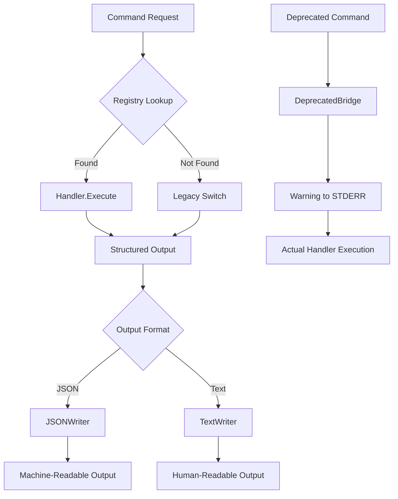
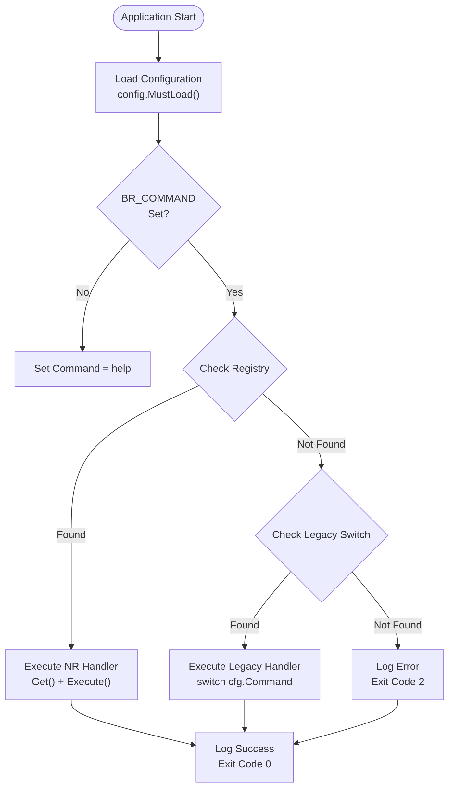

# Command Reference

<cite>
**Referenced Files in This Document**
- [main.go](file://cmd/benadis-runner/main.go)
- [app.go](file://internal/app/app.go)
- [registry.go](file://internal/command/registry.go)
- [handler.go](file://internal/command/handler.go)
- [deprecated.go](file://internal/command/deprecated.go)
- [servicemodeenablehandler/handler.go](file://internal/command/handlers/servicemodeenablehandler/handler.go)
- [servicemodedisablehandler/handler.go](file://internal/command/handlers/servicemodedisablehandler/handler.go)
- [servicemodestatushandler/handler.go](file://internal/command/handlers/servicemodestatushandler/handler.go)
- [forcedisconnecthandler/handler.go](file://internal/command/handlers/forcedisconnecthandler/handler.go)
- [version/version.go](file://internal/command/handlers/version/version.go)
- [help/help.go](file://internal/command/handlers/help/help.go)
- [constants.go](file://internal/constants/constants.go)
- [config.go](file://internal/config/config.go)
- [result.go](file://internal/pkg/output/result.go)
- [writer.go](file://internal/pkg/output/writer.go)
- [json.go](file://internal/pkg/output/json.go)
- [text.go](file://internal/pkg/output/text.go)
- [action.yaml](file://config/action.yaml)
</cite>

## Update Summary
**Changes Made**
- Updated command dispatch mechanism to use new NR (Next Generation) command framework with self-registering commands
- Added new NR commands for service mode management and session handling
- Implemented structured output system with JSON and text formatting
- Added deprecated bridge pattern for backward compatibility
- Enhanced help system with automatic command discovery
- Updated exit codes and error handling patterns

## Table of Contents
1. [Introduction](#introduction)
2. [Command Framework Architecture](#command-framework-architecture)
3. [Command Dispatch Mechanism](#command-dispatch-mechanism)
4. [Structured Output System](#structured-output-system)
5. [Exit Codes](#exit-codes)
6. [Command Reference](#command-reference)
   - [nr-version](#nr-version)
   - [help](#help)
   - [nr-service-mode-enable](#nr-service-mode-enable)
   - [nr-service-mode-disable](#nr-service-mode-disable)
   - [nr-service-mode-status](#nr-service-mode-status)
   - [nr-force-disconnect-sessions](#nr-force-disconnect-sessions)
   - [convert](#convert)
   - [dbrestore](#dbrestore)
   - [service-mode-enable](#service-mode-enable)
   - [service-mode-disable](#service-mode-disable)
   - [service-mode-status](#service-mode-status)
   - [git2store](#git2store)
   - [store2db](#store2db)
   - [sq-scan-branch](#sq-scan-branch)
   - [sq-scan-pr](#sq-scan-pr)
   - [execute-epf](#execute-epf)

## Introduction
The benadis-runner application provides a comprehensive set of commands for automating various operations related to 1C:Enterprise development and deployment processes. The application has evolved to use a new Next Generation (NR) command framework that implements self-registration, structured output formatting, and backward compatibility through deprecated bridge patterns.

The NR framework introduces a modern command architecture where commands register themselves automatically via init() functions, eliminating the need for manual registration in main.go. Commands now support structured output in both JSON and human-readable formats, enhanced error handling with machine-readable error codes, and improved traceability through distributed tracing.

**Section sources**
- [main.go](file://cmd/benadis-runner/main.go#L1-L50)
- [registry.go](file://internal/command/registry.go#L1-L50)
- [handler.go](file://internal/command/handler.go#L1-L28)

## Command Framework Architecture
The benadis-runner uses a modern command framework architecture that separates concerns between command registration, execution, and output formatting. The framework consists of several key components:

### Self-Registering Commands
Each command package contains an init() function that registers the command handler with the global registry. This eliminates the need for manual registration in main.go and allows commands to be added or modified independently.

### Handler Interface
All commands implement the Handler interface, which defines three core methods:
- Name(): Returns the command name for registry lookup
- Description(): Provides help text for command documentation
- Execute(): Executes the command logic with context and configuration

### Deprecated Bridge Pattern
The framework maintains backward compatibility through deprecated bridges that wrap legacy commands under new names. When a deprecated command is called, it logs a warning and delegates execution to the new implementation.

### Structured Output System
Commands now support multiple output formats through a unified Result structure that includes status, command name, data payload, error information, and metadata for traceability and performance monitoring.

**Diagram sources**
- [registry.go](file://internal/command/registry.go#L57-L64)
- [deprecated.go](file://internal/command/deprecated.go#L77-L89)
- [result.go](file://internal/pkg/output/result.go#L11-L30)

**Section sources**
- [registry.go](file://internal/command/registry.go#L19-L55)
- [handler.go](file://internal/command/handler.go#L12-L27)
- [deprecated.go](file://internal/command/deprecated.go#L26-L44)
- [result.go](file://internal/pkg/output/result.go#L11-L30)

## Command Dispatch Mechanism
The benadis-runner implements a two-tier command dispatch mechanism that prioritizes NR commands while maintaining backward compatibility with legacy commands.

### Priority-Based Dispatch
1. **NR Command Registry Check**: First, the application searches for commands in the self-registering registry
2. **Fallback to Legacy Switch**: If not found in registry, falls back to the traditional switch statement in main.go
3. **Deprecated Bridge Support**: Automatically handles deprecated command names through bridge pattern

### Registry Registration Process
Commands register themselves using the Register() or RegisterWithAlias() functions in their init() methods. The RegisterWithAlias() function supports deprecated command names by creating bridge handlers that warn users about migration.

### Configuration Loading
The application loads configuration using config.MustLoad() before command dispatch, ensuring all commands have access to the same configuration context regardless of execution path.

**Diagram sources**
- [main.go](file://cmd/benadis-runner/main.go#L25-L58)

**Section sources**
- [main.go](file://cmd/benadis-runner/main.go#L45-L58)
- [registry.go](file://internal/command/registry.go#L57-L64)
- [deprecated.go](file://internal/command/deprecated.go#L112-L143)

## Structured Output System
The NR command framework implements a comprehensive structured output system that provides consistent, machine-readable results across all commands. The system supports both JSON and human-readable formats with optional metadata for debugging and monitoring.

### Result Structure
The Result structure provides a standardized format for all command outputs:
- Status: "success" or "error" indicator
- Command: Name of executed command
- Data: Command-specific payload (when successful)
- Error: Error information (when failed)
- Metadata: Performance and traceability information

### Output Writers
The framework includes specialized writers for different output formats:
- **JSONWriter**: Produces machine-readable JSON with indentation for readability
- **TextWriter**: Creates human-friendly formatted output with clear sections
- **Custom Formatters**: Individual commands can implement specialized output formats

### Metadata Information
All structured outputs include metadata for operational visibility:
- DurationMs: Execution time in milliseconds
- TraceID: Distributed tracing identifier for correlation
- APIVersion: API version for backward compatibility

### Error Handling
Structured error responses include:
- Machine-readable error codes (e.g., "CONFIG.INFOBASE_MISSING")
- Human-readable messages
- Contextual information for troubleshooting
- Consistent formatting across all commands

**Section sources**
- [result.go](file://internal/pkg/output/result.go#L11-L53)
- [json.go](file://internal/pkg/output/json.go#L8-L22)
- [text.go](file://internal/pkg/output/text.go#L9-L54)

## Exit Codes
The benadis-runner application uses a standardized exit code system that has been enhanced to support the new NR command framework. The exit codes provide clear signals for automation systems and help distinguish between different types of failures.

| Exit Code | NR Command | Legacy Command | Meaning |
|-----------|------------|----------------|---------|
| 0 | ✓ | ✓ | Success - Command completed successfully |
| 2 | ✓ | ✓ | Unknown Command - The specified command was not recognized |
| 5 | ✓ | - | Configuration Load Failed - Failed to load configuration from files or environment |
| 6 | ✓ | - | Conversion Error - Error occurred during conversion process |
| 7 | ✓ | - | Storage Update Error - Error occurred while updating storage |
| 8 | ✓ | ✓ | Service Operation Failed - Error occurred during service mode operations |
| 9 | ✓ | - | External Processing Failed - Error occurred while executing external processing |

**Note**: NR commands primarily use exit code 8 for service operation failures, while legacy commands maintain their specific exit codes for different operation types.

**Section sources**
- [main.go](file://cmd/benadis-runner/main.go#L223-L228)
- [registry.go](file://internal/command/registry.go#L57-L64)

## Command Reference

### nr-version
The nr-version command displays application version information in either JSON or human-readable format. This is the first NR command demonstrating the new framework architecture.

**Syntax**: `BR_COMMAND=nr-version`

**Parameters**:
- `BR_OUTPUT_FORMAT`: Set to "json" for machine-readable output, defaults to human-readable

**Workflow**:
1. Build version data with fallback values for development builds
2. Generate or extract trace ID from context
3. Format output based on BR_OUTPUT_FORMAT environment variable
4. Return structured result with version, Go version, and commit hash

**Expected Outputs**:
- JSON format: `{"status":"success","command":"nr-version","data":{"version":"x.y.z","go_version":"go1.x.x","commit":"abc123"},"metadata":{"duration_ms":123,"trace_id":"abc-def-ghi","api_version":"v1"}}`
- Text format: `benadis-runner version x.y.z.10.11.5:5deea45-debug`

**Section sources**
- [version/version.go](file://internal/command/handlers/version/version.go#L74-L109)
- [constants.go](file://internal/constants/constants.go#L102-L103)

### help
The help command provides comprehensive documentation of all available commands, automatically discovering NR commands from the registry and listing legacy commands from the switch statement.

**Syntax**: `BR_COMMAND=help`

**Parameters**:
- `BR_OUTPUT_FORMAT`: Set to "json" for machine-readable output, defaults to human-readable

**Workflow**:
1. Collect all registered NR commands from the registry
2. Gather legacy commands from the predefined legacyCommands map
3. Sort commands alphabetically for consistent output
4. Format output based on BR_OUTPUT_FORMAT environment variable
5. Include deprecated command information with migration guidance

**Expected Outputs**:
- JSON format: Includes separate arrays for NR and legacy commands with descriptions and deprecation status
- Text format: Two-column layout showing command names and descriptions, with deprecated commands annotated

**Section sources**
- [help/help.go](file://internal/command/handlers/help/help.go#L82-L115)
- [help/help.go](file://internal/command/handlers/help/help.go#L117-L153)

### nr-service-mode-enable
The nr-service-mode-enable command enables service mode for a specified 1C information base with comprehensive status reporting and structured output.

**Syntax**: `BR_COMMAND=nr-service-mode-enable`

**Parameters**:
- `BR_INFOBASE_NAME`: Name of the information base to place in service mode
- `BR_TERMINATE_SESSIONS`: Boolean flag indicating whether to terminate active sessions
- `BR_SERVICE_MODE_MESSAGE`: Custom message for service mode (optional)
- `BR_SERVICE_MODE_PERMISSION_CODE`: Custom permission code (optional)
- `BR_OUTPUT_FORMAT`: Set to "json" for machine-readable output

**Workflow**:
1. Validate information base name presence
2. Create RAC client for 1C cluster communication
3. Check current service mode status (idempotent operation)
4. Terminate active sessions if requested and enabled
5. Enable service mode with verification
6. Generate structured result with detailed status information

**Expected Outputs**:
- JSON format: `{"status":"success","command":"nr-service-mode-enable","data":{"enabled":true,"already_enabled":false,"state_changed":true,"message":"Service Mode","permission_code":"ServiceMode","scheduled_jobs_blocked":true,"terminated_sessions_count":2,"infobase_name":"TestBase"},"metadata":{"duration_ms":1234,"trace_id":"abc-def-ghi","api_version":"v1"}}`
- Text format: Human-readable summary with status, message, and session termination details

**Section sources**
- [servicemodeenablehandler/handler.go](file://internal/command/handlers/servicemodeenablehandler/handler.go#L86-L231)

### nr-service-mode-disable
The nr-service-mode-disable command disables service mode for a specified 1C information base with verification and structured reporting.

**Syntax**: `BR_COMMAND=nr-service-mode-disable`

**Parameters**:
- `BR_INFOBASE_NAME`: Name of the information base to remove from service mode
- `BR_OUTPUT_FORMAT`: Set to "json" for machine-readable output

**Workflow**:
1. Validate information base name presence
2. Create RAC client for 1C cluster communication
3. Check current service mode status (idempotent operation)
4. Disable service mode with verification
5. Verify scheduled job status after disabling
6. Generate structured result with detailed status information

**Expected Outputs**:
- JSON format: `{"status":"success","command":"nr-service-mode-disable","data":{"disabled":true,"already_disabled":false,"state_changed":true,"scheduled_jobs_unblocked":true,"infobase_name":"TestBase"},"metadata":{"duration_ms":890,"trace_id":"abc-def-ghi","api_version":"v1"}}`
- Text format: Human-readable summary with status and scheduled job information

**Section sources**
- [servicemodedisablehandler/handler.go](file://internal/command/handlers/servicemodedisablehandler/handler.go#L82-L203)

### nr-service-mode-status
The nr-service-mode-status command checks the current status of service mode for a specified 1C information base with detailed session information.

**Syntax**: `BR_COMMAND=nr-service-mode-status`

**Parameters**:
- `BR_INFOBASE_NAME`: Name of the information base to check
- `BR_OUTPUT_FORMAT`: Set to "json" for machine-readable output

**Workflow**:
1. Validate information base name presence
2. Create RAC client for 1C cluster communication
3. Retrieve cluster and information base details
4. Get current service mode status with blocking indicators
5. Fetch active session details (graceful degradation if unavailable)
6. Generate structured result with comprehensive status information

**Expected Outputs**:
- JSON format: `{"status":"success","command":"nr-service-mode-status","data":{"enabled":true,"message":"Service Mode","scheduled_jobs_blocked":true,"active_sessions":3,"infobase_name":"TestBase","sessions":[{"user_name":"user1","host":"host1","started_at":"2025-01-01T00:00:00Z","last_active_at":"2025-01-01T01:00:00Z","app_id":"app1"}]},"metadata":{"duration_ms":567,"trace_id":"abc-def-ghi","api_version":"v1"}}`
- Text format: Human-readable summary with status, message, active session count, and session details

**Section sources**
- [servicemodestatushandler/handler.go](file://internal/command/handlers/servicemodestatushandler/handler.go#L118-L229)

### nr-force-disconnect-sessions
The nr-force-disconnect-sessions command terminates active sessions for a specified 1C information base with configurable grace periods and detailed reporting.

**Syntax**: `BR_COMMAND=nr-force-disconnect-sessions`

**Parameters**:
- `BR_INFOBASE_NAME`: Name of the information base whose sessions to terminate
- `BR_DISCONNECT_DELAY_SEC`: Grace period before session termination (0-300 seconds)
- `BR_OUTPUT_FORMAT`: Set to "json" for machine-readable output

**Workflow**:
1. Validate information base name presence
2. Parse and validate grace period parameter
3. Create RAC client for 1C cluster communication
4. Retrieve active session list
5. Apply grace period with context cancellation support
6. Terminate sessions individually with error collection
7. Generate structured result with termination details

**Expected Outputs**:
- JSON format: `{"status":"success","command":"nr-force-disconnect-sessions","data":{"terminated_sessions_count":2,"no_active_sessions":false,"state_changed":true,"delay_sec":30,"infobase_name":"TestBase","partial_failure":false,"sessions":[{"user_name":"user1","app_id":"app1","host":"host1","session_id":"sess1"},{"user_name":"user2","app_id":"app2","host":"host2","session_id":"sess2"}],"errors":[]},"metadata":{"duration_ms":1234,"trace_id":"abc-def-ghi","api_version":"v1"}}`
- Text format: Human-readable summary with termination count, session details, and any errors

**Section sources**
- [forcedisconnecthandler/handler.go](file://internal/command/handlers/forcedisconnecthandler/handler.go#L121-L268)

### convert
The convert command performs conversion of 1C:Enterprise projects from repository format. It clones the repository, switches to the appropriate branch, loads converter configuration, and executes the conversion process.

**Syntax**: `BR_COMMAND=convert`

**Parameters**:
- `BR_CONFIG_SYSTEM`: Path to system configuration file
- `BR_CONFIG_PROJECT`: Path to project configuration file
- `BR_WORKDIR`: Working directory path
- `BR_REPOSITORY`: Repository name
- `BR_OWNER`: Repository owner
- `BR_GITEAURL`: Gitea server URL
- `BR_ACCESSTOKEN`: Access token for authentication

**Workflow**:
1. Create temporary directory for repository cloning
2. Initialize Git connection with repository URL and access token
3. Clone the repository to the temporary location
4. Switch to the main branch, then to the source branch specified in converter configuration
5. Load and execute the conversion process using EDT converter
6. Handle any errors during the conversion process

**Expected Outputs**:
- Success: "Конвертация успешно завершена" logged at Info level
- Failure: Error message logged with details about the failure

**Section sources**
- [main.go](file://cmd/benadis-runner/main.go#L70-L78)
- [app.go](file://internal/app/app.go#L80-L150)

### dbrestore
The dbrestore command restores a 1C database from a backup. It initializes HASP network protection, creates a DBRestore instance from configuration, establishes a connection with timeout context, and performs the restoration process.

**Syntax**: `BR_COMMAND=dbrestore`

**Parameters**:
- `BR_INFOBASE_NAME`: Name of the database to restore
- `BR_CONFIG_SYSTEM`: Path to system configuration file
- `BR_CONFIG_DBDATA`: Path to database configuration file
- `BR_WORKDIR`: Working directory path
- `BR_TMPDIR`: Temporary directory path

**Workflow**:
1. Initialize HASP network protection with predefined server settings
2. Create DBRestore instance from configuration and database name
3. Create context with 30-second timeout for the operation
4. Connect to the database using the configured connection string
5. Perform the restoration process with progress monitoring
6. Clean up resources and handle any errors

**Expected Outputs**:
- Success: "DbRestore успешно выполнен" logged at Info level with database name
- Failure: Error message logged with details about the restoration failure

**Section sources**
- [main.go](file://cmd/benadis-runner/main.go#L102-L112)
- [app.go](file://internal/app/app.go#L600-L650)

### service-mode-enable
**Deprecated**: Use `nr-service-mode-enable` instead.

The service-mode-enable command enables service mode for a specified 1C information base. This blocks user access to the database, allowing administrative operations to be performed without interference from active sessions.

**Syntax**: `BR_COMMAND=service-mode-enable`

**Parameters**:
- `BR_INFOBASE_NAME`: Name of the information base to place in service mode
- `BR_TERMINATE_SESSIONS`: Boolean flag indicating whether to terminate active sessions
- `BR_CONFIG_SYSTEM`: Path to system configuration file
- `BR_CONFIG_DBDATA`: Path to database configuration file

**Workflow**:
1. Validate that BR_INFOBASE_NAME is provided
2. Create a SlogLogger wrapper for structured logging
3. Call servicemode.ManageServiceMode with "enable" action
4. If BR_TERMINATE_SESSIONS is true, force termination of active sessions
5. Wait for all users to disconnect before completing
6. Log success or failure based on the operation result

**Expected Outputs**:
- Success: "Сервисный режим успешно включен" logged at Info level with database name
- Failure: Error message logged with details about why service mode could not be enabled

**Section sources**
- [main.go](file://cmd/benadis-runner/main.go#L75-L95)
- [app.go](file://internal/app/app.go#L150-L200)

### service-mode-disable
**Deprecated**: Use `nr-service-mode-disable` instead.

The service-mode-disable command disables service mode for a specified 1C information base. This restores normal user access to the database after administrative operations have been completed.

**Syntax**: `BR_COMMAND=service-mode-disable`

**Parameters**:
- `BR_INFOBASE_NAME`: Name of the information base to remove from service mode
- `BR_CONFIG_SYSTEM`: Path to system configuration file
- `BR_CONFIG_DBDATA`: Path to database configuration file

**Workflow**:
1. Validate that BR_INFOBASE_NAME is provided
2. Create a SlogLogger wrapper for structured logging
3. Call servicemode.ManageServiceMode with "disable" action
4. Verify that no administrative operations are still running
5. Restore normal connection parameters for user access
6. Log success or failure based on the operation result

**Expected Outputs**:
- Success: "Сервисный режим успешно отключен" logged at Info level with database name
- Failure: Error message logged with details about why service mode could not be disabled

**Section sources**
- [main.go](file://cmd/benadis-runner/main.go#L95-L110)
- [app.go](file://internal/app/app.go#L200-L250)

### service-mode-status
**Deprecated**: Use `nr-service-mode-status` instead.

The service-mode-status command checks the current status of service mode for a specified 1C information base. It returns information about whether service mode is active and what restrictions are in place.

**Syntax**: `BR_COMMAND=service-mode-status`

**Parameters**:
- `BR_INFOBASE_NAME`: Name of the information base to check
- `BR_CONFIG_SYSTEM`: Path to system configuration file
- `BR_CONFIG_DBDATA`: Path to database configuration file

**Workflow**:
1. Validate that BR_INFOBASE_NAME is provided
2. Create a SlogLogger wrapper for structured logging
3. Call servicemode.ManageServiceMode with "status" action
4. Retrieve information about current service mode settings
5. Check for active sessions and connection restrictions
6. Log the current status regardless of success or failure

**Expected Outputs**:
- Success: Status information logged including whether service mode is enabled and session counts
- Failure: Error message logged with details about why status could not be retrieved

**Section sources**
- [main.go](file://cmd/benadis-runner/main.go#L110-L120)
- [app.go](file://internal/app/app.go#L250-L300)

### git2store
The git2store command synchronizes data from a Git repository into a 1C configuration repository. This process involves cloning the repository, creating a temporary database, binding to the configuration repository, merging changes, and committing the results.

**Syntax**: `BR_COMMAND=git2store`

**Parameters**:
- `BR_CONFIG_SYSTEM`: Path to system configuration file
- `BR_CONFIG_PROJECT`: Path to project configuration file
- `BR_WORKDIR`: Working directory path
- `BR_REPOSITORY`: Repository name
- `BR_OWNER`: Repository owner
- `BR_GITEAURL`: Gitea server URL
- `BR_ACCESSTOKEN`: Access token for authentication
- `BR_INFOBASE_NAME`: Name of the target information base

**Workflow**:
1. Initialize HASP network protection
2. Create temporary directory for repository cloning
3. Initialize and clone Git repository from EDT branch
4. If using local base, create temporary database
5. Load configuration and initialize database connection
6. Unbind from storage (to resolve locking issues)
7. Switch to 1C branch and update database structure
8. Dump current configuration
9. Bind to storage and perform merge operation
10. Update database again (for extensions)
11. Commit changes to storage with lock release

**Expected Outputs**:
- Success: "Обновление хранилища успешно завершено" logged at Info level
- Failure: Error message logged with details about the synchronization failure

**Section sources**
- [main.go](file://cmd/benadis-runner/main.go#L80-L89)
- [app.go](file://internal/app/app.go#L300-L500)

### store2db
The store2db command loads configuration from a 1C configuration repository into a database. This extracts the latest version of the configuration from storage and applies it to the specified database, updating both structure and data according to configuration changes.

**Syntax**: `BR_COMMAND=store2db`

**Parameters**:
- `BR_INFOBASE_NAME`: Name of the database to update
- `BR_CONFIG_SYSTEM`: Path to system configuration file
- `BR_CONFIG_PROJECT`: Path to project configuration file
- `BR_STOREDB`: Type of storage database
- `BR_WORKDIR`: Working directory path

**Workflow**:
1. Initialize HASP network protection
2. Load configuration using the provided parameters
3. Bind to the configuration repository
4. Validate that the bind operation succeeded
5. Complete the configuration loading process
6. Handle any errors during the loading process

**Expected Outputs**:
- Success: "Обновление хранилища успешно завершено" logged at Info level
- Failure: Error message logged with details about the loading failure

**Section sources**
- [main.go](file://cmd/benadis-runner/main.go#L60-L75)
- [app.go](file://internal/app/app.go#L500-L550)

### sq-scan-branch
The sq-scan-branch command performs SonarQube analysis on a specific branch of code. It initializes SonarQube services, creates scan parameters, checks which commits need scanning, and executes the branch scanning process.

**Syntax**: `BR_COMMAND=sq-scan-branch`

**Parameters**:
- `BR_OWNER`: Repository owner
- `BR_REPO`: Repository name
- `BR_BRANCHFORSCAN`: Branch name to scan
- `BR_COMMITHASH`: Specific commit hash to scan (optional)
- `BR_CONFIG_SYSTEM`: Path to system configuration file
- `BR_CONFIG_PROJECT`: Path to project configuration file

**Workflow**:
1. Validate configuration is not nil
2. Initialize Gitea API client with configuration
3. Initialize SonarQube services with logging
4. Create ProjectUpdateParams with owner, repo, and branch
5. Call HandleSQProjectUpdate with context and parameters
6. Process the scan results and generate reports
7. Handle any errors during the scanning process

**Expected Outputs**:
- Success: "Сканирование ветки SonarQube успешно завершено" logged at Info level
- Failure: Error message logged with details about the scanning failure

**Section sources**
- [main.go](file://cmd/benadis-runner/main.go#L163-L172)
- [app.go](file://internal/app/app.go#L550-L600)

### sq-scan-pr
The sq-scan-pr command performs SonarQube analysis on a pull request. It retrieves active PRs from Gitea, finds the requested PR, creates branch scanning parameters, checks commits for scanning, and executes the PR scanning process.

**Syntax**: `BR_COMMAND=sq-scan-pr`

**Parameters**:
- `BR_OWNER`: Repository owner
- `BR_REPO`: Repository name
- `BR_CONFIG_SYSTEM`: Path to system configuration file
- `BR_CONFIG_PROJECT`: Path to project configuration file

**Workflow**:
1. Validate configuration is not nil
2. Initialize Gitea API client with configuration
3. Initialize SonarQube services with logging
4. Retrieve list of active PRs from Gitea
5. Find the specific PR number in the list
6. Create branch scanning parameters using the PR's head branch
7. Check which commits need to be scanned
8. Execute the scanning process on the identified commits
9. Generate quality gate results and reports
10. Handle any errors during the scanning process

**Expected Outputs**:
- Success: "Сканирование pull request SonarQube успешно завершено" logged at Info level
- Failure: Error message logged with details about the scanning failure, including "PR not found" if the PR doesn't exist

**Section sources**
- [main.go](file://cmd/benadis-runner/main.go#L173-L182)
- [app.go](file://internal/app/app.go#L550-L600)

### execute-epf
The execute-epf command runs 1C:Enterprise external processing files (.epf) with proper configuration and logging support.

**Syntax**: `BR_COMMAND=execute-epf`

**Parameters**:
- `BR_EPF_PATH`: Path to the external processing file
- `BR_CONFIG_SYSTEM`: Path to system configuration file
- `BR_CONFIG_PROJECT`: Path to project configuration file
- `BR_WORKDIR`: Working directory path

**Workflow**:
1. Validate EPF file path exists
2. Load configuration using provided parameters
3. Initialize 1C environment with proper settings
4. Execute external processing with error handling
5. Log execution results and handle any errors

**Expected Outputs**:
- Success: "Внешняя обработка успешно выполнена" logged at Info level
- Failure: Error message logged with details about execution failure

**Section sources**
- [main.go](file://cmd/benadis-runner/main.go#L153-L162)
- [app.go](file://internal/app/app.go#L150-L200)