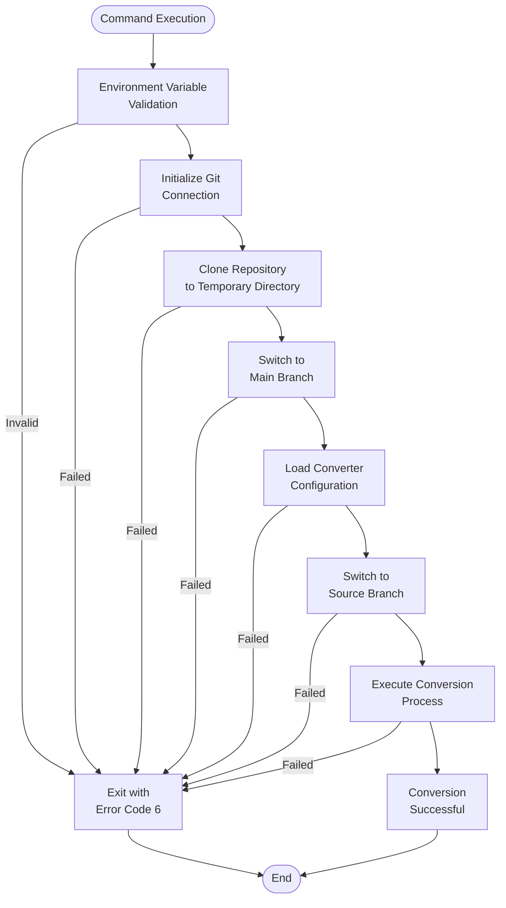
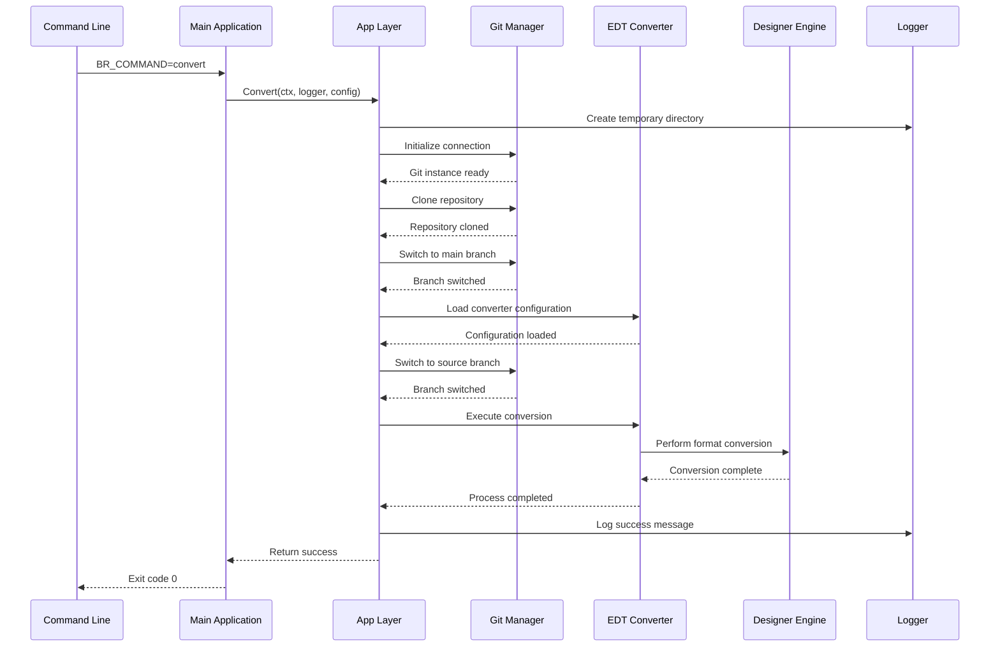
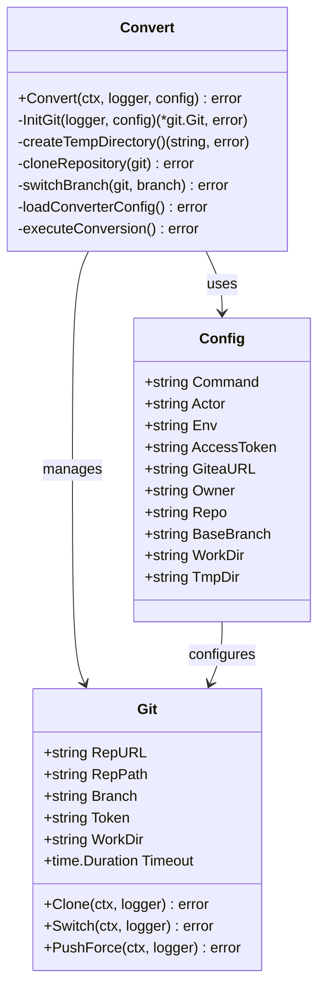
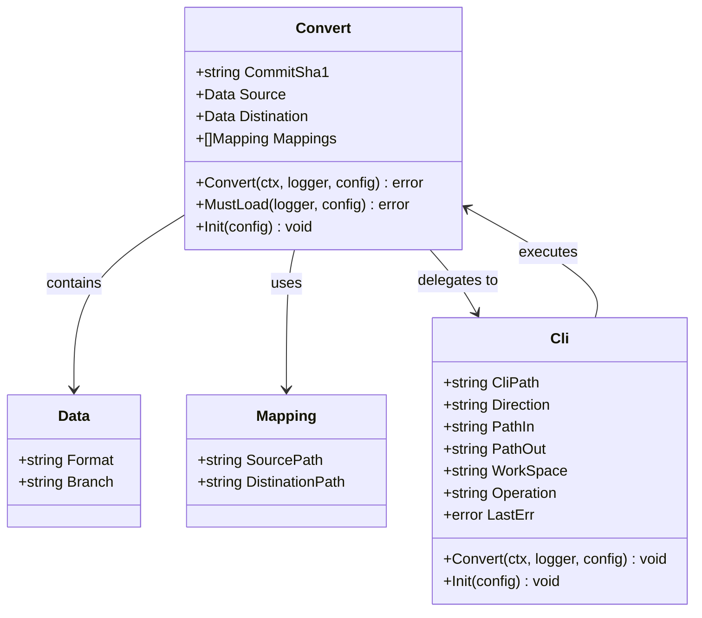
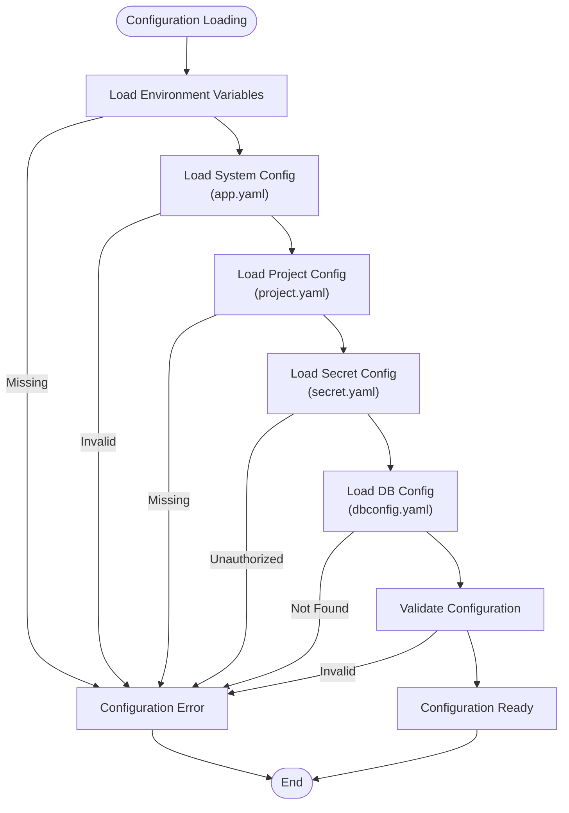
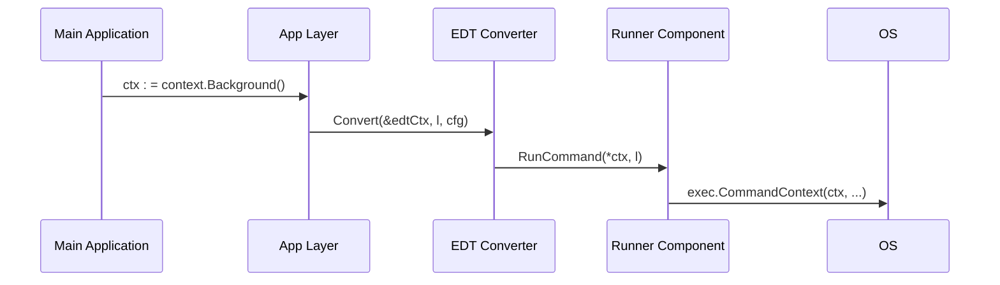
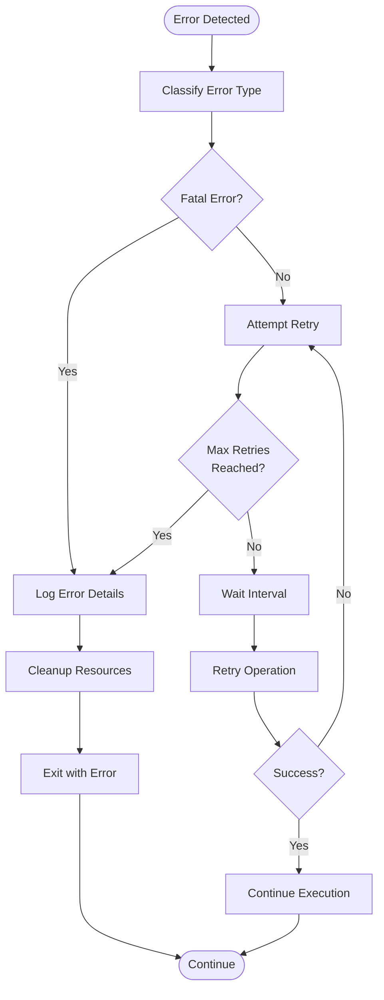

# Convert Command

<cite>
**Referenced Files in This Document**
- [cmd/apk-ci/main.go](file://cmd/apk-ci/main.go) - *Updated with context support*
- [internal/app/app.go](file://internal/app/app.go) - *Updated with timeout management*
- [internal/util/runner/runner.go](file://internal/util/runner/runner.go) - *Added context support to RunCommand*
- [internal/entity/one/edt/edt.go](file://internal/entity/one/edt/edt.go) - *Updated with context handling*
- [internal/config/config.go](file://internal/config/config.go) - *Enhanced configuration loading*
- [config/app.yaml](file://config/app.yaml) - *Configuration file for timeout settings*
- [README.md](file://README.md)
</cite>

## Update Summary
**Changes Made**
- Added context support to RunCommand method for proper timeout management and cancellation of long-running operations
- Updated documentation to reflect context propagation through the command execution chain
- Enhanced error handling for timeout scenarios in EDT operations
- Added timeout configuration details and default value handling

**New Sections Added**
- Context and Timeout Management
- Enhanced Error Handling for Timeouts

**Deprecated/Removed Sections**
- None

**Source Tracking System Updates**
- Added new source files related to context and timeout management
- Updated existing sources to reflect code changes
- Enhanced source annotations to indicate updated files

## Table of Contents
1. [Introduction](#introduction)
2. [Command Overview](#command-overview)
3. [Environment Variables](#environment-variables)
4. [Workflow Architecture](#workflow-architecture)
5. [Core Components](#core-components)
6. [Configuration Management](#configuration-management)
7. [Context and Timeout Management](#context-and-timeout-management)
8. [Error Handling](#error-handling)
9. [Integration Points](#integration-points)
10. [Performance Considerations](#performance-considerations)
11. [Troubleshooting Guide](#troubleshooting-guide)
12. [Examples](#examples)
13. [Conclusion](#conclusion)

## Introduction

The Convert command in apk-ci is a specialized module designed to facilitate the conversion of 1C:Enterprise projects between different formats, primarily from EDT (Enterprise Development Tools) format to XML format. This command serves as a crucial bridge between modern development workflows and legacy 1C systems, enabling seamless integration of 1C projects into contemporary DevOps pipelines.

The convert command operates through a sophisticated multi-stage process that involves repository management, configuration loading, format conversion, and result deployment. It leverages the power of 1C:Enterprise tools while maintaining compatibility with modern CI/CD practices. With the recent addition of context support, the command now provides robust timeout management and cancellation capabilities for long-running operations.

## Command Overview

The convert command is activated through the `BR_COMMAND=convert` environment variable and follows a standardized execution pattern within the apk-ci ecosystem. The command orchestrates a series of coordinated operations to transform project configurations from one format to another.



**Diagram sources**
- [cmd/apk-ci/main.go](file://cmd/apk-ci/main.go#L30-L40)
- [internal/app/app.go](file://internal/app/app.go#L60-L120)

**Section sources**
- [cmd/apk-ci/main.go](file://cmd/apk-ci/main.go#L30-L40)
- [internal/constants/constants.go](file://internal/constants/constants.go#L60-L70)

## Environment Variables

The convert command relies on a comprehensive set of environment variables to configure its execution context and operational parameters. These variables provide flexibility in deployment scenarios while maintaining security through controlled access patterns.

### Required Environment Variables

| Variable | Description | Example |
|----------|-------------|---------|
| `BR_COMMAND` | Specifies the command to execute (`convert`) | `convert` |
| `BR_ACTOR` | Username of the person who triggered the command | `developer` |
| `BR_ENV` | Environment identifier (`dev`, `test`, `prod`) | `dev` |
| `BR_ACCESS_TOKEN` | Access token for repository authentication | `ghp_xxxxxxxxxxxxxxxx` |
| `BR_GITEA_URL` | URL of the Gitea instance | `https://git.example.com` |
| `BR_REPOSITORY` | Full repository name (`owner/repo`) | `myorg/myproject` |

### Configuration Path Variables

| Variable | Description | Default Value |
|----------|-------------|---------------|
| `BR_CONFIG_SYSTEM` | System configuration file location | `/tmp/benadis/system.yaml` |
| `BR_CONFIG_PROJECT` | Project-specific configuration | `project.yaml` |
| `BR_CONFIG_SECRET` | Secret configuration file | `secret.yaml` |
| `BR_CONFIG_DBDATA` | Database configuration file | `dbconfig.yaml` |

### Operational Control Variables

| Variable | Description | Default Value |
|----------|-------------|---------------|
| `BR_INFOBASE_NAME` | Target information base name | `default` |
| `BR_TERMINATE_SESSIONS` | Terminate active sessions during operations | `false` |
| `BR_FORCE_UPDATE` | Force update operations even if unchanged | `false` |

**Section sources**
- [internal/config/config.go](file://internal/config/config.go#L100-L150)
- [config/action.yaml](file://config/action.yaml#L1-L50)

## Workflow Architecture

The convert command implements a sophisticated workflow architecture that ensures reliable and efficient conversion processes. The workflow is designed with fault tolerance, logging, and monitoring capabilities built into every stage.



**Diagram sources**
- [internal/app/app.go](file://internal/app/app.go#L60-L120)
- [internal/entity/one/edt/edt.go](file://internal/entity/one/edt/edt.go#L150-L250)

### Stage 1: Initialization and Setup

The initialization phase establishes the operational environment and prepares the system for conversion activities. This stage creates temporary directories, initializes Git connections, and sets up logging infrastructure.

**Key Operations:**
- Temporary directory creation with `os.MkdirTemp()`
- Git connection establishment with authentication
- Logger configuration with structured logging
- Configuration validation and loading

### Stage 2: Repository Management

Repository management encompasses the lifecycle of the source repository, including cloning, branch switching, and cleanup operations. This stage ensures that the conversion process works with the correct version of the project.

**Operations:**
- Repository cloning with timeout handling
- Branch switching with error recovery
- Workspace preparation and cleanup
- Commit history preservation

### Stage 3: Configuration Loading

Configuration loading retrieves and validates the converter settings, including source and destination formats, mapping rules, and connection parameters. This stage ensures that the conversion process has all necessary information to proceed.

**Configuration Elements:**
- Source format specification (EDT/XML)
- Destination format configuration
- Path mappings for file conversion
- Database connection parameters

### Stage 4: Conversion Execution

The conversion execution stage performs the actual format transformation using specialized tools and engines. This stage handles the complexity of 1C:Enterprise format conversion while maintaining data integrity.

**Conversion Process:**
- Format detection and validation
- Tool invocation with appropriate parameters
- Progress monitoring and logging
- Result validation and verification

**Section sources**
- [internal/app/app.go](file://internal/app/app.go#L60-L120)
- [internal/entity/one/edt/edt.go](file://internal/entity/one/edt/edt.go#L150-L300)

## Core Components

The convert command is built upon several core components that work together to provide comprehensive conversion capabilities. Each component has specific responsibilities and interfaces that ensure modularity and maintainability.

### App Layer Component

The App layer serves as the primary orchestrator for the convert command, managing the overall workflow and coordinating between different subsystems.



**Diagram sources**
- [internal/app/app.go](file://internal/app/app.go#L60-L120)
- [internal/config/config.go](file://internal/config/config.go#L100-L200)

### EDT Entity Component

The EDT entity provides the core conversion functionality, handling the transformation between EDT and XML formats using specialized tools and libraries.



**Diagram sources**
- [internal/entity/one/edt/edt.go](file://internal/entity/one/edt/edt.go#L20-L80)
- [internal/entity/one/edt/edt.go](file://internal/entity/one/edt/edt.go#L150-L250)

### Designer Integration Component

The Designer integration component provides the bridge between the conversion system and 1C:Enterprise's designer tools, enabling seamless format transformations.

**Key Features:**
- Database connection management
- Configuration loading and dumping
- Extension management
- Version control integration

**Section sources**
- [internal/entity/one/edt/edt.go](file://internal/entity/one/edt/edt.go#L20-L100)
- [internal/entity/one/designer/designer.go](file://internal/entity/one/designer/designer.go#L20-L100)

## Configuration Management

The convert command employs a sophisticated configuration management system that supports multiple configuration sources, hierarchical precedence, and runtime validation. This system ensures that the conversion process adapts to different environments and requirements.

### Configuration Hierarchy

The configuration system follows a well-defined hierarchy that prioritizes different sources of configuration data:

1. **Environment Variables** (Highest Priority)
2. **Configuration Files** (YAML/JSON)
3. **Default Values** (Lowest Priority)

### Configuration Types

The system manages several types of configuration data:

**System Configuration (`app.yaml`):**
- Application-level settings
- Tool paths and binaries
- Logging configuration
- Network timeouts

**Project Configuration (`project.yaml`):**
- Project-specific settings
- Database connections
- Extension configurations
- Build parameters

**Secret Configuration (`secret.yaml`):**
- Authentication credentials
- Access tokens
- Passwords and keys
- Sensitive connection strings

**Database Configuration (`dbconfig.yaml`):**
- Database server information
- Connection parameters
- Production vs development settings
- Related database configurations

### Configuration Loading Process



**Diagram sources**
- [internal/config/config.go](file://internal/config/config.go#L700-L800)

**Section sources**
- [internal/config/config.go](file://internal/config/config.go#L700-L900)
- [config/app.yaml](file://config/app.yaml#L1-L50)

## Context and Timeout Management

The convert command now implements comprehensive context and timeout management to handle long-running operations and enable proper cancellation. This enhancement ensures that the system can gracefully handle operations that exceed expected execution times.

### Context Propagation

The command execution chain now properly propagates context objects through all layers of the application:

1. **Main Application**: Creates the initial context in `main.go`
2. **App Layer**: Passes context to the Convert function
3. **EDT Converter**: Uses context for conversion operations
4. **Runner Component**: Uses context for command execution



**Section sources**
- [cmd/apk-ci/main.go](file://cmd/apk-ci/main.go#L18)
- [internal/app/app.go](file://internal/app/app.go#L118-L120)
- [internal/entity/one/edt/edt.go](file://internal/entity/one/edt/edt.go#L456)
- [internal/util/runner/runner.go](file://internal/util/runner/runner.go#L107)

### Timeout Configuration

The system uses a hierarchical approach to determine timeout values:

1. **Configuration File**: Value from `app.yaml` (edt_timeout)
2. **Environment Variable**: Value from `EDT_TIMEOUT`
3. **Default Value**: 90 minutes if not specified

The configuration loading process ensures that even if the parameter is missing from the YAML file, a default value is applied:

```go
// In config.go:loadAppConfig
if appConfig.EdtTimeout <= 0 {
    appConfig.EdtTimeout = 90 * time.Minute
}
```

**Section sources**
- [internal/config/config.go](file://internal/config/config.go#L864-L867)
- [config/app.yaml](file://config/app.yaml)

### Context Creation and Management

The Convert function creates a context with timeout specifically for EDT operations:

```go
// Создаем контекст с таймаутом для EDT операций
edtCtx, cancel := context.WithTimeout(*ctx, cfg.AppConfig.EdtTimeout)
defer cancel()

err = c.Convert(&edtCtx, l, cfg)
```

This pattern ensures that long-running EDT operations are automatically terminated if they exceed the specified timeout period.

**Section sources**
- [internal/app/app.go](file://internal/app/app.go#L118-L120)

## Error Handling

The convert command implements comprehensive error handling mechanisms designed to provide clear feedback, graceful degradation, and recovery capabilities. The error handling strategy covers all stages of the conversion process.

### Error Categories

**Initialization Errors:**
- Missing environment variables
- Invalid configuration files
- Insufficient permissions
- Resource allocation failures

**Execution Errors:**
- Tool invocation failures
- Format conversion errors
- Data corruption issues
- Network connectivity problems
- Context deadline exceeded (timeout)

**Post-Processing Errors:**
- Commit failures
- Push operation errors
- Cleanup operation failures
- Validation check failures

### Enhanced Error Handling for Timeouts

With the addition of context support, the system now properly handles timeout scenarios:

```go
if e.LastErr != nil {
    // Проверяем, не был ли превышен таймаут
    if errors.Is(e.LastErr, context.DeadlineExceeded) {
        l.Error("Превышен таймаут выполнения команды EDT",
            slog.String("Операция", e.Operation),
            slog.String("PathIn", e.PathIn),
            slog.String("PathOut", e.PathOut),
        )
        return
    }
    // ... other error handling
}
```

This enhancement provides specific error messages when operations exceed their timeout limits, making troubleshooting more effective.

**Section sources**
- [internal/entity/one/edt/edt.go](file://internal/entity/one/edt/edt.go#L457-L465)

### Error Recovery Strategies



### Error Codes and Messages

The system uses specific exit codes to indicate different types of failures:

| Exit Code | Error Type | Description |
|-----------|------------|-------------|
| 6 | Conversion Error | General conversion failure |
| 7 | Repository Error | Git operation failure |
| 8 | Database Error | 1C:Enterprise operation failure |
| 11 | Configuration Error | Invalid configuration detected |

**Section sources**
- [cmd/apk-ci/main.go](file://cmd/apk-ci/main.go#L30-L40)
- [internal/app/app.go](file://internal/app/app.go#L60-L120)

## Integration Points

The convert command integrates with multiple external systems and tools to provide comprehensive 1C:Enterprise project conversion capabilities. These integrations enable seamless operation within larger DevOps ecosystems.

### 1C:Enterprise Integration

**Tool Integration:**
- 1C:Enterprise Development Tools (EDT)
- 1C:Enterprise Designer
- 1C:Enterprise Platform (1cv8)
- Information Base Management (ibcmd)

**Format Support:**
- EDT format (.edt)
- XML format (.xml)
- Configuration files (.cf, .cfe)
- Metadata objects (.mdo, .mxl)

### Version Control Integration

**Git Operations:**
- Repository cloning and branching
- Commit creation and pushing
- Branch switching and merging
- Conflict resolution

**Platform Support:**
- Gitea (primary)
- GitHub (alternative)
- GitLab (future support)

### External Tool Dependencies

**Required Tools:**
- `1cv8` - 1C:Enterprise platform executable
- `ibcmd` - Information base management tool
- `1cedtcli` - EDT command-line interface
- `rac` - Remote administration console

**Optional Tools:**
- SonarQube scanner for quality analysis
- Database backup utilities
- Monitoring and alerting tools

**Section sources**
- [internal/entity/one/edt/edt.go](file://internal/entity/one/edt/edt.go#L1-L50)
- [internal/entity/one/designer/designer.go](file://internal/entity/one/designer/designer.go#L1-L50)

## Performance Considerations

The convert command is designed to handle large-scale 1C:Enterprise projects efficiently while maintaining system stability and performance. Several optimization strategies are employed to ensure optimal execution times and resource utilization.

### Memory Management

**Temporary Directory Strategy:**
- Uses `os.MkdirTemp()` for secure temporary directory creation
- Implements automatic cleanup on successful completion
- Provides configurable work directory locations

**Resource Allocation:**
- Limits concurrent operations to prevent resource exhaustion
- Implements streaming for large file processing
- Uses buffered I/O for improved performance

### Processing Optimization

**Batch Operations:**
- Processes multiple files concurrently where possible
- Implements efficient file mapping and path resolution
- Minimizes redundant operations through caching

**Network Optimization:**
- Implements connection pooling for database operations
- Uses efficient Git protocols for repository access
- Caches frequently accessed configuration data

### Scalability Factors

**Large Repository Handling:**
- Supports repositories with thousands of files
- Implements incremental processing for partial updates
- Provides progress reporting for long-running operations

**Resource Monitoring:**
- Tracks memory usage during conversion
- Monitors disk space availability
- Implements timeout mechanisms for long-running operations

**Section sources**
- [internal/app/app.go](file://internal/app/app.go#L60-L120)
- [internal/entity/one/edt/edt.go](file://internal/entity/one/edt/edt.go#L150-L250)

## Troubleshooting Guide

This section provides comprehensive guidance for diagnosing and resolving common issues encountered during the convert command execution. The troubleshooting approach is systematic and covers all major failure scenarios.

### Common Issues and Solutions

**Issue: Repository Cloning Failure**
```
Error: "Ошибка клонирования репозитория"
```
**Symptoms:**
- Network connectivity issues
- Authentication failures
- Repository not found

**Solutions:**
1. Verify Gitea URL and access token
2. Check network connectivity to Gitea server
3. Validate repository existence and permissions
4. Review firewall and proxy settings

**Issue: Branch Switching Failure**
```
Error: "Ошибка переключения на ветку"
```
**Symptoms:**
- Branch does not exist
- Conflicting local changes
- Permission issues

**Solutions:**
1. Verify branch name exists in remote repository
2. Clean local working directory
3. Check user permissions for branch access
4. Force branch reset if necessary

**Issue: Format Conversion Errors**
```
Error: "Неизвестный формат"
```
**Symptoms:**
- Invalid source format specification
- Missing conversion tools
- Corrupted source files

**Solutions:**
1. Verify source format is supported (EDT/XML)
2. Check 1C:Enterprise tools installation
3. Validate source file integrity
4. Review conversion mapping configuration

**Issue: Operation Timeout**
```
Error: "Превышен таймаут выполнения команды EDT"
```
**Symptoms:**
- Long-running conversion operations
- Large project files
- Resource-constrained environment

**Solutions:**
1. Check `edt_timeout` setting in `app.yaml`
2. Verify the timeout value is appropriate for the project size
3. Consider increasing the timeout value for large projects
4. Monitor system resources during conversion

### Diagnostic Commands

**Repository Status Check:**
```bash
# Verify repository accessibility
curl -H "Authorization: token $BR_ACCESS_TOKEN" \
  "$BR_GITEA_URL/api/v1/repos/$BR_REPOSITORY"

# Check branch existence
git ls-remote --heads "$BR_GITEA_URL/$BR_REPOSITORY.git" \
  "$BR_BASE_BRANCH"
```

**Tool Availability Verification:**
```bash
# Check 1C:Enterprise tools
which 1cv8
which ibcmd
which 1cedtcli

# Verify tool versions
1cv8 version
ibcmd version
1cedtcli version
```

**Configuration Validation:**
```bash
# Validate configuration files
cat $BR_CONFIG_SYSTEM | jq .
cat $BR_CONFIG_PROJECT | jq .
cat $BR_CONFIG_SECRET | jq .

# Check environment variables
env | grep BR_
```

### Log Analysis

The convert command generates comprehensive logs that provide insights into the execution process. Key log patterns to monitor:

**Successful Execution Pattern:**
```
INFO: "Конвертация успешно завершена"
DEBUG: "Каталог конвертирован" source="/path/to/source" destination="/path/to/dest"
WARN: "Failed to clean directory preserving hidden files" path="/path/to/dir" error="permission denied"
```

**Error Patterns:**
```
ERROR: "Ошибка конвертации" description="conversion failed" error="specific error message"
ERROR: "Не удалось создать временный каталог" error="no space left on device"
ERROR: "ошибка создания базы данных" error="connection refused"
ERROR: "Превышен таймаут выполнения команды EDT" operation="export" PathIn="/path/to/src" PathOut="/path/to/dest"
```

**Section sources**
- [internal/app/app.go](file://internal/app/app.go#L60-L120)
- [internal/entity/one/edt/edt.go](file://internal/entity/one/edt/edt.go#L150-L300)

## Examples

This section provides practical examples of using the convert command in various scenarios, demonstrating different configuration approaches and use cases.

### Basic Conversion Example

**Scenario:** Convert a simple 1C:Enterprise project from EDT to XML format.

**Environment Setup:**
```bash
export BR_COMMAND=convert
export BR_ACTOR=developer
export BR_ENV=dev
export BR_ACCESS_TOKEN=ghp_xxxxxxxxxxxxxxxx
export BR_GITEA_URL=https://git.example.com
export BR_REPOSITORY=myorg/myproject
export BR_INFOBASE_NAME=default
```

**Execution:**
```bash
./apk-ci
```

**Expected Outcome:**
- Repository cloned to temporary directory
- Main branch checked out
- EDT files converted to XML format
- Converted files committed to XML branch
- Original repository cleaned up

### Advanced Configuration Example

**Scenario:** Convert with custom configuration and multiple extensions.

**Custom Configuration (`convert-config.json`):**
```json
{
  "branch": "main",
  "commitSHA1": "",
  "oneDB": true,
  "dbUser": "admin",
  "dbPassword": "secure_password",
  "dbServer": "localhost",
  "dbName": "production"
}
```

**Execution with Custom Config:**
```bash
export BR_COMMAND=convert
export BR_CONFIG_PROJECT=/path/to/custom/project.yaml
export BR_CONFIG_SECRET=/path/to/secrets/secret.yaml
export BR_FORCE_UPDATE=true

./apk-ci
```

### GitHub Actions Integration

**GitHub Actions Workflow:**
```yaml
name: Convert 1C Project
on:
  workflow_dispatch:
    inputs:
      source_branch:
        description: 'Source branch to convert'
        required: true
        default: 'develop'

jobs:
  convert:
    runs-on: ubuntu-latest
    steps:
      - name: Checkout repository
        uses: actions/checkout@v3
        
      - name: Setup apk-ci
        uses: ./
        with:
          giteaURL: ${{ secrets.GITEA_URL }}
          repository: ${{ github.repository }}
          accessToken: ${{ secrets.GITEA_TOKEN }}
          command: convert
          actor: ${{ github.actor }}
          branchForScan: ${{ github.ref_name }}
          
      - name: Verify conversion
        run: |
          git diff --exit-code origin/xml
          echo "Conversion successful!"
```

### Docker Container Example

**Docker Compose Configuration:**
```yaml
version: '3.8'
services:
  apk-ci:
    image: apk-ci:convert
    environment:
      - BR_COMMAND=convert
      - BR_ACTOR=docker_user
      - BR_ENV=container
      - BR_ACCESS_TOKEN=${GITEA_TOKEN}
      - BR_GITEA_URL=${GITEA_URL}
      - BR_REPOSITORY=${REPO_OWNER}/${REPO_NAME}
      - BR_INFOBASE_NAME=${INFOBASE_NAME}
    volumes:
      - ./configs:/configs:ro
      - ./logs:/logs
    working_dir: /workspace
    command: ["./apk-ci"]
```

**Section sources**
- [config/action.yaml](file://config/action.yaml#L50-L120)
- [README.md](file://README.md#L50-L100)

## Conclusion

The convert command in apk-ci represents a sophisticated solution for bridging modern DevOps practices with traditional 1C:Enterprise development workflows. Through its comprehensive architecture, robust error handling, and extensive integration capabilities, it enables organizations to maintain their investment in 1C systems while adopting contemporary development methodologies.

### Key Benefits

**Seamless Integration:** The command integrates effortlessly with existing CI/CD pipelines and version control systems, providing a familiar interface for developers accustomed to modern development practices.

**Reliability:** Comprehensive error handling, validation, and recovery mechanisms ensure that conversion operations are robust and dependable, even in challenging environments.

**Flexibility:** Support for multiple configuration sources, format combinations, and deployment scenarios makes the command adaptable to diverse organizational needs.

**Performance:** Optimized processing algorithms and resource management ensure efficient operation, even with large-scale projects containing numerous files and extensions.

### Future Enhancements

The convert command is designed for continuous improvement and expansion. Planned enhancements include:

- **Additional Format Support:** Expansion to support more 1C:Enterprise formats and third-party tools
- **Parallel Processing:** Implementation of concurrent conversion for improved performance
- **Enhanced Monitoring:** Integration with observability platforms for comprehensive operational visibility
- **Cloud Integration:** Native support for cloud-based 1C:Enterprise deployments and services

### Best Practices

To maximize the effectiveness of the convert command, organizations should:

1. **Implement Proper Configuration Management:** Use centralized configuration repositories and secret management systems
2. **Establish Monitoring and Alerting:** Implement comprehensive logging and alerting for conversion operations
3. **Plan for Testing:** Include conversion testing in quality assurance processes
4. **Maintain Documentation:** Keep conversion procedures and troubleshooting guides up to date

The convert command stands as a testament to the evolving nature of 1C:Enterprise development, demonstrating how legacy systems can be modernized and integrated into contemporary development ecosystems while preserving their essential functionality and value.