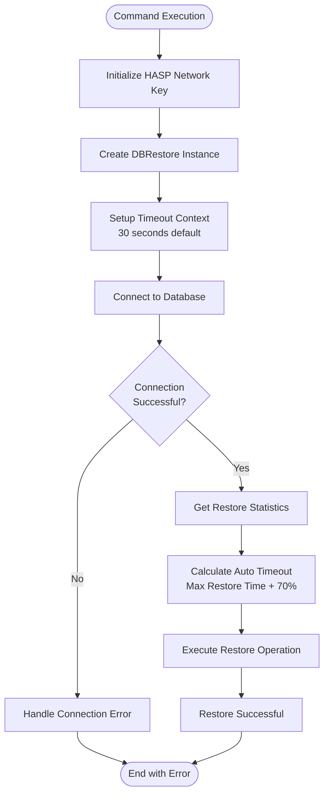
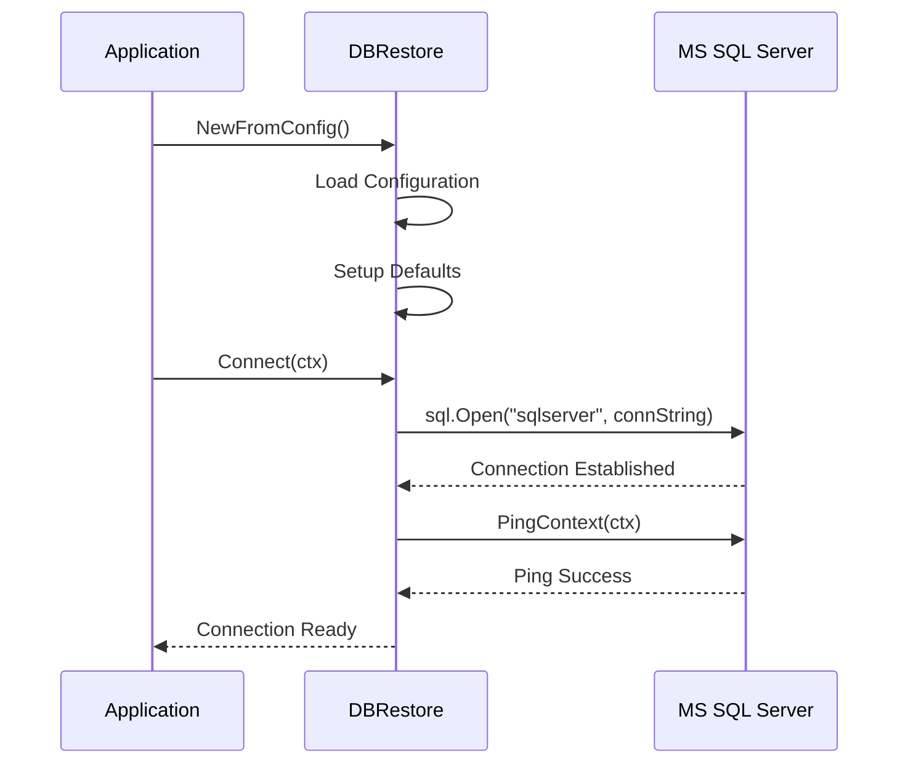
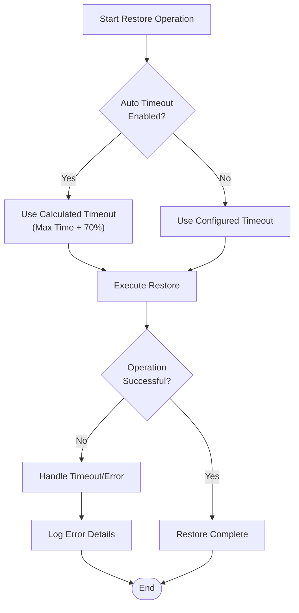
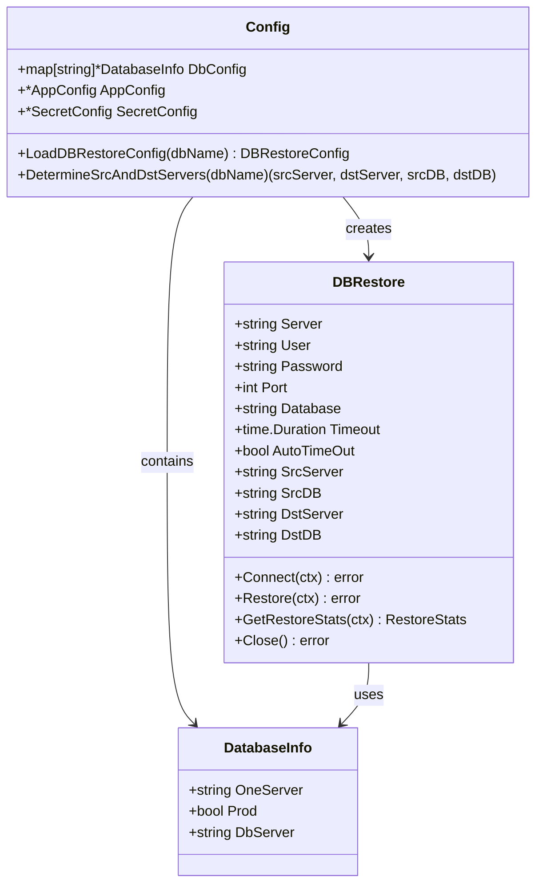

# Dbrestore Command

<cite>
**Referenced Files in This Document**
- [cmd/benadis-runner/main.go](file://cmd/benadis-runner/main.go)
- [internal/app/app.go](file://internal/app/app.go)
- [internal/entity/dbrestore/dbrestore.go](file://internal/entity/dbrestore/dbrestore.go)
- [internal/config/config.go](file://internal/config/config.go)
- [internal/constants/constants.go](file://internal/constants/constants.go)
- [config/dbconfig.yaml](file://config/dbconfig.yaml)
- [config/action.yaml](file://config/action.yaml)
</cite>

## Table of Contents
1. [Introduction](#introduction)
2. [Command Overview](#command-overview)
3. [Environment Variables](#environment-variables)
4. [Configuration Requirements](#configuration-requirements)
5. [Workflow Implementation](#workflow-implementation)
6. [Error Handling](#error-handling)
7. [Integration Architecture](#integration-architecture)
8. [Performance Considerations](#performance-considerations)
9. [Common Issues and Solutions](#common-issues-and-solutions)
10. [Best Practices](#best-practices)

## Introduction

The `dbrestore` command in benadis-runner is a specialized functionality designed to restore MSSQL databases from historical backups for 1C:Enterprise applications. This command plays a crucial role in GitOps workflows by enabling automated database restoration from production environments to development or testing environments.

The dbrestore command integrates seamlessly with the broader benadis-runner ecosystem, providing a robust solution for database migration and synchronization tasks. It leverages advanced features like automatic timeout calculation based on historical statistics, intelligent server discovery, and comprehensive error handling.

## Command Overview

The dbrestore command is executed through the benadis-runner application and is identified by the constant `ActDbrestore = "dbrestore"` in the constants package. When invoked, the command performs the following primary operations:

1. **Initialization**: Sets up the HASP network key for 1C:Enterprise licensing
2. **Configuration Loading**: Creates a DBRestore instance from project configuration
3. **Database Connection**: Establishes connection with timeout context
4. **Statistics Retrieval**: Gets historical restore statistics for automatic timeout calculation
5. **Restore Execution**: Performs the actual database restoration process



**Diagram sources**
- [internal/app/app.go](file://internal/app/app.go#L781-L824)
- [internal/entity/dbrestore/dbrestore.go](file://internal/entity/dbrestore/dbrestore.go#L124-L143)

## Environment Variables

The dbrestore command relies on several environment variables to configure its execution:

### Required Environment Variables

| Variable | Description | Example |
|----------|-------------|---------|
| `BR_COMMAND` | Specifies the command to execute (`dbrestore`) | `dbrestore` |
| `BR_INFOBASE_NAME` | Name of the database to restore | `V8_DEV_DSBEKETOV_APK_TOIR3` |
| `BR_ACCESS_TOKEN` | Access token for Gitea API | `your-access-token` |
| `BR_GITEA_URL` | URL of the Gitea server | `https://gitea.example.com` |
| `BR_REPOSITORY` | Full repository name | `organization/project` |

### Optional Environment Variables

| Variable | Description | Default Value |
|----------|-------------|-------------|
| `BR_LOGLEVEL` | Logging level | `Info` |
| `BR_TERMINATE_SESSIONS` | Terminate active sessions during service mode | `false` |
| `BR_FORCE_UPDATE` | Force operation execution | `false` |
| `MSSQL_PASSWORD` | Database password (alternative to secret.yaml) | - |

**Section sources**
- [cmd/benadis-runner/main.go](file://cmd/benadis-runner/main.go#L1-L252)
- [internal/constants/constants.go](file://internal/constants/constants.go#L1-L199)

## Configuration Requirements

### Database Configuration

The dbrestore command requires comprehensive configuration stored in multiple YAML files:

#### dbconfig.yaml Structure

The `dbconfig.yaml` file contains essential database server information:

```yaml
V8_DEV_DSBEKETOV_APK_TOIR3:
  one-server: MSK-TS-AS-001
  prod: false
  dbserver: DEV-RZHAVKI-DB1
```

Each database entry includes:
- **one-server**: 1C Enterprise server address
- **prod**: Boolean indicating production vs test environment
- **dbserver**: MS SQL Server address

#### Application Configuration

The `app.yaml` file provides global dbrestore settings:

```yaml
dbrestore:
  database: master
  timeout: 30s
  autotimeout: true
```

#### Secret Configuration

Sensitive information is stored in `secret.yaml`:

```yaml
passwords:
  mssql: your-database-password
```

### Configuration Priority

The configuration loading follows this priority order:
1. Centralized configuration from project files
2. Environment variables
3. Default values

**Section sources**
- [config/dbconfig.yaml](file://config/dbconfig.yaml#L1-L799)
- [internal/config/config.go](file://internal/config/config.go#L219-L234)

## Workflow Implementation

### Initialization Phase

The dbrestore workflow begins with the `DbRestoreWithConfig` function in the app package:

```go
func DbRestoreWithConfig(ctx *context.Context, l *slog.Logger, cfg *config.Config, dbname string) error {
    var err error
    NetHaspInit(ctx, l)

    // Create DBRestore instance from configuration
    dbr, err := dbrestore.NewFromConfig(l, cfg, dbname)
    if err != nil {
        l.Error("Ошибка инициализации", slog.String("Описание ошибки", err.Error()))
        return err
    }
    
    // Setup timeout context
    timeoutCtx, cancel := context.WithTimeout(context.Background(), 30*time.Second)
    *ctx = timeoutCtx
    defer cancel()
    
    // Connect to database
    err = dbr.Connect(*ctx)
    if err != nil {
        l.Error("Ошибка подключения", slog.String("Описание ошибки", err.Error()))
        return err
    }
    
    // Cleanup connection on exit
    defer func() {
        if closeErr := dbr.Close(); closeErr != nil {
            l.Warn("Failed to close database connection", slog.String("error", closeErr.Error()))
        }
    }()
    
    return nil
}
```

### Connection Establishment

The database connection process involves:

1. **Connection String Construction**: Uses server, user, password, port, and database parameters
2. **Ping Verification**: Ensures connectivity before proceeding
3. **Timeout Management**: Implements 30-second default timeout



**Diagram sources**
- [internal/entity/dbrestore/dbrestore.go](file://internal/entity/dbrestore/dbrestore.go#L350-L370)

### Automatic Timeout Calculation

The dbrestore command implements intelligent timeout calculation based on historical performance data:

```go
func (dbR *DBRestore) GetRestoreStats(ctx context.Context) (*RestoreStats, error) {
    query := `
    SELECT
        AVG(DATEDIFF(SECOND, RequestDate, CompliteTime)),
        MAX(DATEDIFF(SECOND, RequestDate, CompliteTime))
    FROM [DBA].[dbo].[BackupRequestJournal]
    WHERE CompliteTime IS NOT NULL
        AND RequestDate IS NOT NULL
        AND RequestDate >= @p1
        AND SrcDB = @p2
        AND DstServer = @p3;
    `
    
    // Calculate auto timeout: 170% of max restore time
    if dbR.AutoTimeOut && stats.MaxRestoreTimeSecond.Valid {
        dbR.Timeout = time.Duration(float64(time.Duration(stats.MaxRestoreTimeSecond.Int64)*time.Second) * 1.7)
    }
    
    return stats, nil
}
```

**Section sources**
- [internal/app/app.go](file://internal/app/app.go#L781-L824)
- [internal/entity/dbrestore/dbrestore.go](file://internal/entity/dbrestore/dbrestore.go#L350-L370)
- [internal/entity/dbrestore/dbrestore.go](file://internal/entity/dbrestore/dbrestore.go#L442-L463)

## Error Handling

### Initialization Errors

The dbrestore command implements comprehensive error handling for initialization failures:

```go
// Example error handling from DbRestoreWithConfig
dbr, err := dbrestore.NewFromConfig(l, cfg, dbname)
if err != nil {
    l.Error("Ошибка инициализации", slog.String("Описание ошибки", err.Error()))
    return err
}
```

Common initialization errors include:
- **Configuration Not Found**: Database name not present in dbconfig.yaml
- **Missing Credentials**: Required password or user credentials not available
- **Invalid Configuration Format**: Malformed YAML or missing required fields

### Connection Failures

Database connection errors are handled with specific messaging:

```go
err = dbr.Connect(*ctx)
if err != nil {
    l.Error("Ошибка подключения", slog.String("Описание ошибки", err.Error()))
    return err
}
```

Connection failure scenarios:
- **Network Connectivity**: Server unreachable or firewall blocking connections
- **Authentication**: Incorrect username/password combinations
- **Resource Limits**: Too many concurrent connections or server overload

### Timeout Management

The command implements multiple timeout layers:

1. **Initial Connection Timeout**: 30 seconds default
2. **Restore Operation Timeout**: Calculated automatically or configured manually
3. **Context Cancellation**: Graceful handling of cancellation signals



**Diagram sources**
- [internal/entity/dbrestore/dbrestore.go](file://internal/entity/dbrestore/dbrestore.go#L442-L463)

**Section sources**
- [internal/app/app.go](file://internal/app/app.go#L781-L824)
- [internal/entity/dbrestore/dbrestore.go](file://internal/entity/dbrestore/dbrestore.go#L350-L370)

## Integration Architecture

### Internal Entity Integration

The dbrestore command integrates deeply with the internal entity system:



**Diagram sources**
- [internal/entity/dbrestore/dbrestore.go](file://internal/entity/dbrestore/dbrestore.go#L30-L76)
- [internal/config/config.go](file://internal/config/config.go#L219-L234)

### Configuration Discovery

The system implements intelligent configuration discovery:

```go
func (cfg *Config) DetermineSrcAndDstServers(dbName string) (srcServer, dstServer, srcDB, dstDB string, err error) {
    // Find related database
    relatedDB, err := cfg.FindRelatedDatabase(dbName)
    if err != nil {
        return "", "", "", "", fmt.Errorf("failed to find related database: %w", err)
    }

    // Determine production and test databases
    var prodDB, testDB string
    if cfg.IsProductionDb(dbName) {
        prodDB = dbName
        testDB = relatedDB
    } else {
        prodDB = relatedDB
        testDB = dbName
    }

    // Get servers for both databases
    prodServer, err := cfg.GetDatabaseServer(prodDB)
    if err != nil {
        return "", "", "", "", fmt.Errorf("failed to get server for production database %s: %w", prodDB, err)
    }

    testServer, err := cfg.GetDatabaseServer(testDB)
    if err != nil {
        return "", "", "", "", fmt.Errorf("failed to get server for test database %s: %w", testDB, err)
    }

    return prodServer, testServer, prodDB, testDB, nil
}
```

**Section sources**
- [internal/config/config.go](file://internal/config/config.go#L1300-L1350)
- [internal/entity/dbrestore/dbrestore.go](file://internal/entity/dbrestore/dbrestore.go#L124-L143)

## Performance Considerations

### Large Database Restores

For large database restores, the system implements several performance optimization strategies:

#### Automatic Timeout Scaling

The system calculates optimal timeouts based on historical performance:

```go
// Automatic timeout calculation formula
if dbR.AutoTimeOut && stats.MaxRestoreTimeSecond.Valid {
    // Set timeout to 170% of maximum historical restore time
    dbR.Timeout = time.Duration(float64(time.Duration(stats.MaxRestoreTimeSecond.Int64)*time.Second) * 1.7)
}
```

#### Historical Statistics Utilization

The system queries the `[DBA].[dbo].[BackupRequestJournal]` table to gather performance metrics:

```sql
SELECT
    AVG(DATEDIFF(SECOND, RequestDate, CompliteTime)),
    MAX(DATEDIFF(SECOND, RequestDate, CompliteTime))
FROM [DBA].[dbo].[BackupRequestJournal]
WHERE CompliteTime IS NOT NULL
    AND RequestDate IS NOT NULL
    AND RequestDate >= @p1
    AND SrcDB = @p2
    AND DstServer = @p3;
```

#### Recommended Timeout Configurations

| Database Size | Recommended Timeout | Auto Timeout Setting |
|---------------|-------------------|--------------------|
| Small (< 1GB) | 30s | Enabled |
| Medium (1-10GB) | 5-10 minutes | Enabled |
| Large (> 10GB) | 15-30 minutes | Enabled |
| Extra Large (> 50GB) | 30-60 minutes | Enabled |

### Connection Pooling

The system uses efficient connection pooling with appropriate timeout settings:

- **Connection Lifetime**: 30 minutes default
- **Idle Connection Timeout**: 5 minutes
- **Max Open Connections**: 10 (configurable)

### Memory Management

For large restores, the system implements:

- **Streaming Results**: Processes restore data in chunks
- **Buffer Management**: Optimizes buffer sizes based on available memory
- **Garbage Collection**: Explicit cleanup of large objects

**Section sources**
- [internal/entity/dbrestore/dbrestore.go](file://internal/entity/dbrestore/dbrestore.go#L442-L463)

## Common Issues and Solutions

### Connection Timeouts

**Problem**: Restore operations fail with timeout errors.

**Causes**:
- Network latency between servers
- Insufficient timeout configuration
- Server resource constraints

**Solutions**:
1. **Increase Timeout Values**:
   ```yaml
   dbrestore:
     timeout: 30m
     autotimeout: true
   ```

2. **Optimize Network Configuration**:
   - Ensure proper network connectivity
   - Configure firewall rules appropriately
   - Use dedicated network connections for database traffic

3. **Monitor Server Resources**:
   - Check CPU and memory utilization
   - Monitor disk I/O performance
   - Verify network bandwidth availability

### Insufficient Permissions

**Problem**: Authentication failures during restore operations.

**Causes**:
- Incorrect database credentials
- Expired or revoked database accounts
- Missing required database permissions

**Solutions**:
1. **Verify Credentials**:
   ```bash
   # Test database connection manually
   sqlcmd -S server -U username -P password -d database
   ```

2. **Update Secret Configuration**:
   ```yaml
   passwords:
     mssql: new-password-here
   ```

3. **Grant Required Permissions**:
   ```sql
   GRANT ALTER ANY DATABASE TO [username];
   GRANT CONTROL SERVER TO [username];
   ```

### Backup File Discovery Issues

**Problem**: System cannot locate backup files for restoration.

**Causes**:
- Incorrect backup path configuration
- Missing historical backup records
- Database journal corruption

**Solutions**:
1. **Verify Backup Records**:
   ```sql
   SELECT * FROM [DBA].[dbo].[BackupRequestJournal]
   WHERE SrcDB = 'source_database'
   ORDER BY RequestDate DESC;
   ```

2. **Check Backup Path Configuration**:
   - Ensure backup paths are accessible
   - Verify backup retention policies
   - Confirm backup file integrity

3. **Manual Backup Restoration**:
   ```bash
   # Manual restore for testing
   sqlcmd -S server -U username -P password -Q "
   EXEC sp_DBRestorePSFromHistoryD
     @Description = 'manual restore',
     @DayToRestore = '2024-01-01T12:00:00',
     @DomainUser = 'username',
     @SrcServer = 'source_server',
     @SrcDB = 'source_db',
     @DstServer = 'destination_server',
     @DstDB = 'destination_db';
   "
   ```

### Database Locking Issues

**Problem**: Restore operations fail due to database locks.

**Causes**:
- Active user sessions preventing restoration
- Long-running transactions holding locks
- Service mode conflicts

**Solutions**:
1. **Terminate Active Sessions**:
   ```yaml
   terminate_sessions: true
   ```

2. **Use Service Mode**:
   ```bash
   # Enable service mode before restore
   benadis-runner --command service-mode-enable --dbname database_name
   
   # Perform restore operation
   
   # Disable service mode after restore
   benadis-runner --command service-mode-disable --dbname database_name
   ```

3. **Configure Session Termination**:
   ```yaml
   service_mode:
     terminate_sessions: true
     timeout: 30s
   ```

## Best Practices

### Configuration Management

1. **Centralized Configuration**: Store all dbrestore settings in centralized YAML files
2. **Environment Separation**: Use separate configurations for different environments
3. **Secret Management**: Never hardcode sensitive information in configuration files

### Monitoring and Logging

1. **Enable Comprehensive Logging**: Set appropriate log levels for troubleshooting
2. **Monitor Restore Operations**: Track restore duration and success rates
3. **Alert on Failures**: Configure alerts for failed restore operations

### Security Considerations

1. **Principle of Least Privilege**: Grant minimal required database permissions
2. **Secure Secret Storage**: Use encrypted secret management systems
3. **Network Security**: Implement proper network segmentation and encryption

### Operational Excellence

1. **Regular Testing**: Test restore procedures regularly
2. **Documentation**: Maintain up-to-date operational procedures
3. **Disaster Recovery Planning**: Include dbrestore operations in DR plans

### Performance Optimization

1. **Historical Analysis**: Regularly review restore performance metrics
2. **Capacity Planning**: Plan for peak restore operation loads
3. **Resource Allocation**: Ensure adequate server resources for restore operations

The dbrestore command in benadis-runner provides a robust, scalable solution for automated database restoration in 1C:Enterprise environments. By following the guidelines and best practices outlined in this documentation, teams can effectively leverage this functionality while maintaining system reliability and performance.