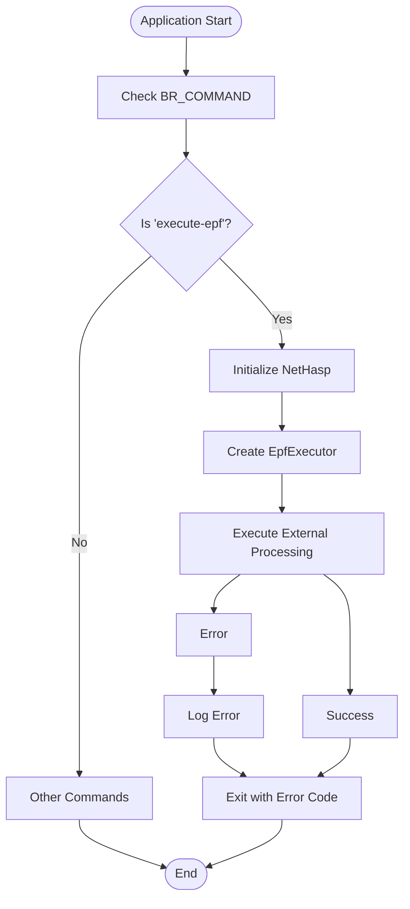
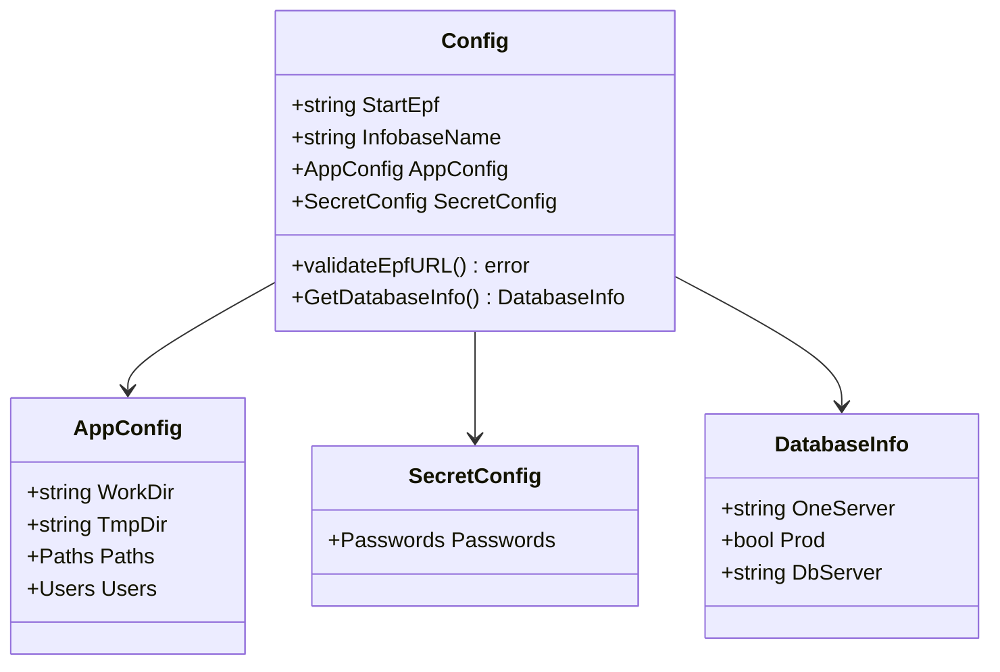
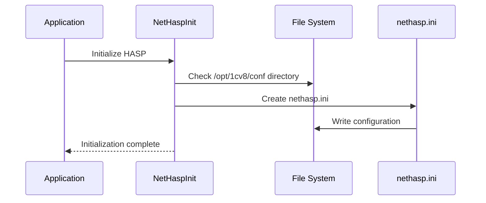
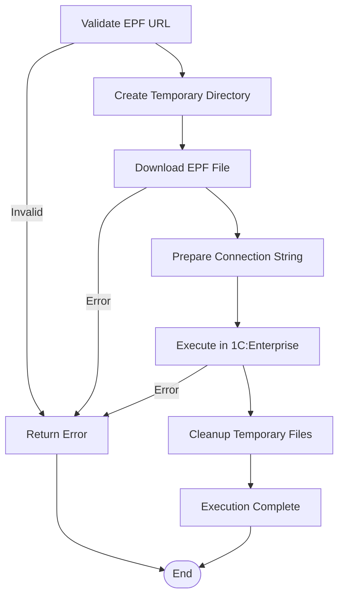
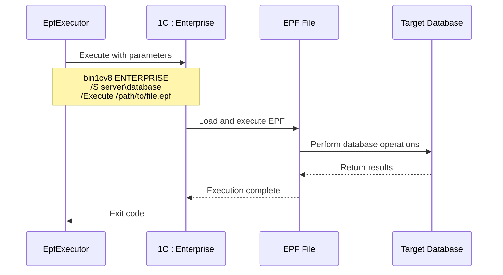

# Execute-EPF Command Documentation

<cite>
**Referenced Files in This Document**
- [cmd/apk-ci/main.go](file://cmd/apk-ci/main.go)
- [internal/app/app.go](file://internal/app/app.go)
- [internal/app/execute_epf_test.go](file://internal/app/execute_epf_test.go)
- [internal/entity/one/enterprise/enterprise.go](file://internal/entity/one/enterprise/enterprise.go)
- [internal/constants/constants.go](file://internal/constants/constants.go)
- [internal/config/config.go](file://internal/config/config.go)
- [config/action.yaml](file://config/action.yaml)
- [README.md](file://README.md)
- [old/execute-epf-architecture.md](file://old/execute-epf-architecture.md)
</cite>

## Table of Contents
1. [Introduction](#introduction)
2. [Command Overview](#command-overview)
3. [Environment Variables](#environment-variables)
4. [Configuration Requirements](#configuration-requirements)
5. [Execution Workflow](#execution-workflow)
6. [Error Handling](#error-handling)
7. [Integration with 1C Platform](#integration-with-1c-platform)
8. [Common Issues and Solutions](#common-issues-and-solutions)
9. [Use Cases](#use-cases)
10. [Testing](#testing)
11. [Troubleshooting](#troubleshooting)

## Introduction

The `execute-epf` command in apk-ci is designed to execute external processing files (.epf) in 1C:Enterprise applications. This command enables automation of various administrative tasks, data processing operations, and system maintenance procedures through programmatically executed external processing files.

The command integrates seamlessly with GitHub Actions and provides a robust framework for executing .epf files stored in remote repositories, managing temporary file creation, and interfacing with the 1C command-line tools.

## Command Overview

The `execute-epf` command is identified by the constant `ActExecuteEpf = "execute-epf"` and is processed in the main application flow through the switch statement in `main.go`. When this command is specified via the `BR_COMMAND` environment variable, the application initiates the external processing execution workflow.



**Section sources**
- [cmd/apk-ci/main.go](file://cmd/apk-ci/main.go#L200-L210)
- [internal/constants/constants.go](file://internal/constants/constants.go#L85-L85)

## Environment Variables

The execute-epf command relies on several environment variables for proper operation:

### Required Variables

| Variable | Description | Example |
|----------|-------------|---------|
| `BR_COMMAND` | Specifies the command to execute (`execute-epf`) | `execute-epf` |
| `BR_START_EPF` | URL to the external processing file (.epf) | `https://example.com/path/to/file.epf` |
| `BR_INFOBASE_NAME` | Name of the target 1C infobase | `MyInfobase` |

### Optional Variables

| Variable | Description | Default Value |
|----------|-------------|---------------|
| `BR_ACTOR` | User who initiated the command | `""` |
| `BR_ENV` | Environment type | `dev` |
| `BR_TERMINATE_SESSIONS` | Terminate active sessions during service mode | `false` |
| `BR_FORCE_UPDATE` | Force operation execution | `false` |
| `BR_ISSUE_NUMBER` | Associated issue number | `1` |

### GitHub Actions Integration

When used in GitHub Actions, the command is configured through the `action.yaml` file:

```yaml
inputs:
  startEpf:
    description: 'URL внешней обработки (.epf файла) для выполнения'
    required: false
    default: 'https://regdv.apkholding.ru/api/v1/repos/gitops-tools/gitops_congif/contents/start.epf?ref=main'
```

**Section sources**
- [internal/config/config.go](file://internal/config/config.go#L100-L110)
- [config/action.yaml](file://config/action.yaml#L50-L55)

## Configuration Requirements

### Basic Configuration Structure

The execute-epf command requires a properly configured `Config` structure with the following essential components:



**Diagram sources**
- [internal/config/config.go](file://internal/config/config.go#L120-L180)
- [internal/config/config.go](file://internal/config/config.go#L200-L220)

### Path Configuration

The application requires specific paths to be configured for proper operation:

- **Bin1cv8**: Path to the 1C:Enterprise command-line executable
- **WorkDir**: Working directory for temporary files
- **TmpDir**: Temporary directory for intermediate processing

### Database Connection Information

The command requires database connection details for the target infobase:

```go
// Example database configuration
dbInfo := &DatabaseInfo{
    OneServer: "localhost",
    Prod:      false,
    DbServer:  "MSSQLSERVER",
}
```

**Section sources**
- [internal/config/config.go](file://internal/config/config.go#L120-L180)
- [internal/entity/one/enterprise/enterprise.go](file://internal/entity/one/enterprise/enterprise.go#L150-L170)

## Execution Workflow

### Step 1: Initialization

The execution begins with the `ExecuteEpf()` function in the app package:

```go
func ExecuteEpf(ctx *context.Context, l *slog.Logger, cfg *config.Config) error {
    if cfg == nil {
        return errors.New("конфигурация не может быть nil")
    }

    NetHaspInit(ctx, l)

    // Создаем исполнитель внешних обработок
    executor := enterprise.NewEpfExecutor(l, cfg.WorkDir)

    // Выполняем внешнюю обработку
    return executor.Execute(ctx, cfg)
}
```

### Step 2: NetHasp Initialization

The `NetHaspInit()` function prepares the HASP network license server configuration:



**Diagram sources**
- [internal/app/app.go](file://internal/app/app.go#L700-L750)

### Step 3: EPF Executor Creation

The `EpfExecutor` is created with the logger and working directory:

```go
executor := enterprise.NewEpfExecutor(l, cfg.WorkDir)
```

### Step 4: Execution Process

The `Execute()` method in `EpfExecutor` performs the following steps:

1. **URL Validation**: Validates the EPF file URL format
2. **Temporary Directory Creation**: Ensures the temporary directory exists
3. **File Download**: Downloads the EPF file from the specified URL
4. **Connection String Preparation**: Creates the database connection string
5. **External Processing Execution**: Runs the 1C command-line tool



**Diagram sources**
- [internal/entity/one/enterprise/enterprise.go](file://internal/entity/one/enterprise/enterprise.go#L30-L80)

### Step 5: Command Execution

The actual execution uses the 1C command-line interface with specific parameters:

```go
e.runner.RunString = cfg.AppConfig.Paths.Bin1cv8
e.runner.Params = append(e.runner.Params, "@")
e.runner.Params = append(e.runner.Params, "ENTERPRISE")
e.runner.Params = append(e.runner.Params, connectString)
e.runner.Params = append(e.runner.Params, "/Execute")
e.runner.Params = append(e.runner.Params, epfPath)
addDisableParam(e.runner)
```

**Section sources**
- [internal/app/app.go](file://internal/app/app.go#L680-L701)
- [internal/entity/one/enterprise/enterprise.go](file://internal/entity/one/enterprise/enterprise.go#L30-L100)

## Error Handling

### Nil Configuration Handling

The system includes robust error handling for nil configurations:

```go
func ExecuteEpf(ctx *context.Context, l *slog.Logger, cfg *config.Config) error {
    if cfg == nil {
        return errors.New("конфигурация не может быть nil")
    }
    // Continue with execution...
}
```

### URL Validation Errors

The EPF executor validates URLs before attempting downloads:

```go
func (e *EpfExecutor) validateEpfURL(url string) error {
    if !strings.HasPrefix(url, "http://") && !strings.HasPrefix(url, "https://") {
        return fmt.Errorf("некорректный URL для StartEpf: %s", url)
    }
    return nil
}
```

### File Download Errors

Multiple error scenarios are handled during file download:

1. **Temporary File Creation Failure**: Returns detailed error message
2. **Network Download Failure**: Logs error and cleans up resources
3. **File Writing Failure**: Closes and removes temporary files

### Execution Failures

When the 1C command fails, the system provides comprehensive error logging:

```go
if err := e.executeEpfInEnterprise(cfg, tempEpfPath, connectString); err != nil {
    return err
}
```

**Section sources**
- [internal/app/app.go](file://internal/app/app.go#L685-L690)
- [internal/entity/one/enterprise/enterprise.go](file://internal/entity/one/enterprise/enterprise.go#L60-L70)

## Integration with 1C Platform

### Enterprise Module Integration

The execute-epf command integrates with the `enterprise` package through the `NewEpfExecutor()` function:

```go
executor := enterprise.NewEpfExecutor(l, cfg.WorkDir)
```

This creates an `EpfExecutor` instance that encapsulates all EPF execution functionality.

### Command-Line Interface

The integration uses the standard 1C:Enterprise command-line interface with the `/Execute` parameter:



**Diagram sources**
- [internal/entity/one/enterprise/enterprise.go](file://internal/entity/one/enterprise/enterprise.go#L180-L210)

### Parameter Configuration

The system automatically adds disable parameters to prevent dialog boxes:

```go
func addDisableParam(r *runner.Runner) {
    r.Params = append(r.Params, "/DisableStartupDialogs")
    r.Params = append(r.Params, "/DisableStartupMessages")
    r.Params = append(r.Params, "/DisableUnrecoverableErrorMessage")
    r.Params = append(r.Params, "/UC ServiceMode")
}
```

**Section sources**
- [internal/entity/one/enterprise/enterprise.go](file://internal/entity/one/enterprise/enterprise.go#L180-L210)

## Common Issues and Solutions

### File Permission Errors

**Issue**: Unable to create temporary files or directories
**Solution**: 
- Verify write permissions in the working directory
- Ensure the application has sufficient privileges
- Check disk space availability

### Network Connectivity Issues

**Issue**: Cannot download EPF file from remote URL
**Solution**:
- Verify network connectivity
- Check firewall settings
- Validate URL accessibility
- Ensure proper authentication if required

### Incompatible EPF Versions

**Issue**: EPF file not compatible with 1C version
**Solution**:
- Verify EPF file version compatibility
- Update 1C:Enterprise installation
- Use appropriate EPF version for target platform

### Database Connection Problems

**Issue**: Cannot connect to target infobase
**Solution**:
- Verify database server accessibility
- Check connection string format
- Validate user credentials
- Ensure database is online and accessible

### Memory and Resource Constraints

**Issue**: Out of memory or resource limitations
**Solution**:
- Increase available memory
- Optimize EPF file size
- Monitor system resources during execution

## Use Cases

### Automated Data Migration

Execute EPF files for automated data migration between systems:

```bash
export BR_COMMAND="execute-epf"
export BR_START_EPF="https://example.com/migration.epf"
export BR_INFOBASE_NAME="ProductionDB"
./apk-ci
```

### Report Generation

Automate report generation using pre-built EPF templates:

```bash
export BR_COMMAND="execute-epf"
export BR_START_EPF="https://example.com/report_generator.epf"
export BR_INFOBASE_NAME="ReportingDB"
./apk-ci
```

### System Maintenance Tasks

Perform routine maintenance operations:

```bash
export BR_COMMAND="execute-epf"
export BR_START_EPF="https://example.com/maintenance.epf"
export BR_INFOBASE_NAME="MaintenanceDB"
./apk-ci
```

### Batch Processing Operations

Execute batch operations on large datasets:

```bash
export BR_COMMAND="execute-epf"
export BR_START_EPF="https://example.com/batch_processor.epf"
export BR_INFOBASE_NAME="BatchDB"
./apk-ci
```

## Testing

### Unit Tests

The system includes comprehensive unit tests for the execute-epf functionality:

```go
func TestExecuteEpf(t *testing.T) {
    tests := []struct {
        name        string
        startEpf    string
        expectError bool
        description string
    }{
        {
            name:        "empty_url",
            startEpf:    "",
            expectError: true,
            description: "Должен возвращать ошибку при пустом URL",
        },
        {
            name:        "invalid_url",
            startEpf:    "invalid-url",
            expectError: true,
            description: "Должен возвращать ошибку при некорректном URL",
        },
    }
}
```

### Integration Tests

Tests verify the complete workflow from configuration to execution:

```go
func TestExecuteEpfValidation(t *testing.T) {
    t.Run("nil_config", func(t *testing.T) {
        logger := slog.New(slog.NewTextHandler(os.Stdout, &slog.HandlerOptions{
            Level: slog.LevelDebug,
        }))
        ctx := context.Background()

        err := ExecuteEpf(&ctx, logger, nil)
        if err == nil {
            t.Error("Ожидалась ошибка при передаче nil конфигурации")
        }
    })
}
```

### Test Coverage

The testing framework covers:
- Configuration validation
- URL format validation
- Temporary file handling
- Error scenarios
- Successful execution paths

**Section sources**
- [internal/app/execute_epf_test.go](file://internal/app/execute_epf_test.go#L10-L50)
- [internal/app/execute_epf_test.go](file://internal/app/execute_epf_test.go#L58-L90)

## Troubleshooting

### Debug Mode

Enable debug logging for detailed troubleshooting:

```bash
export LOG_LEVEL="debug"
export BR_COMMAND="execute-epf"
./apk-ci
```

### Common Error Messages

| Error Message | Cause | Solution |
|---------------|-------|----------|
| "конфигурация не может быть nil" | Missing configuration | Verify all required environment variables |
| "некорректный URL для StartEpf" | Invalid EPF URL | Check URL format and accessibility |
| "ошибка создания временной директории" | Permission or disk issues | Verify directory permissions and space |
| "ошибка выполнения внешней обработки" | 1C command failure | Check 1C installation and parameters |

### Log Analysis

Monitor logs for detailed error information:

```bash
# Enable verbose logging
export LOG_LEVEL="debug"

# Run with logging
./apk-ci 2>&1 | tee execution.log
```

### Performance Optimization

For large-scale operations:
- Use appropriate temporary directory locations
- Monitor system resources during execution
- Consider batch processing for multiple operations
- Implement retry mechanisms for transient failures

### Security Considerations

- Validate EPF file sources before execution
- Use HTTPS URLs for EPF file downloads
- Implement proper access controls for sensitive operations
- Monitor execution logs for security events