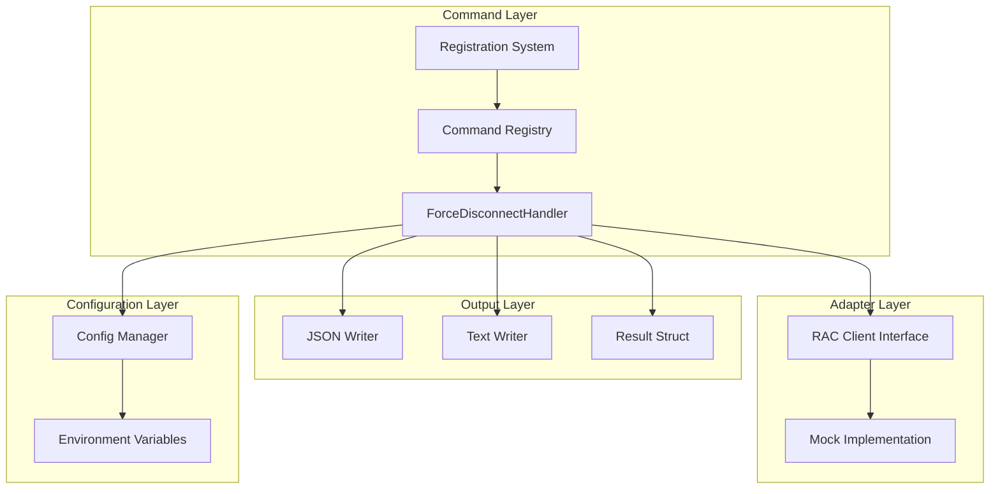
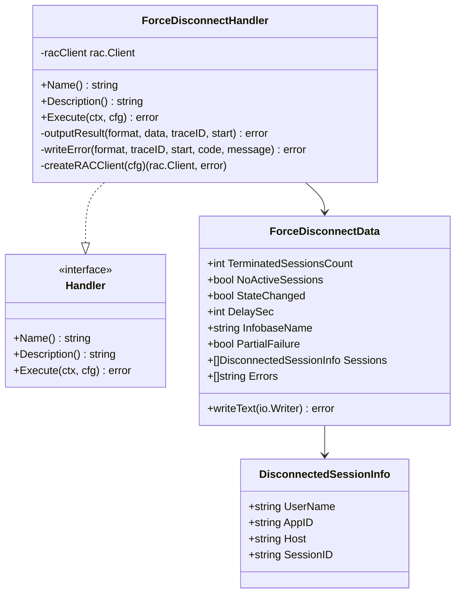
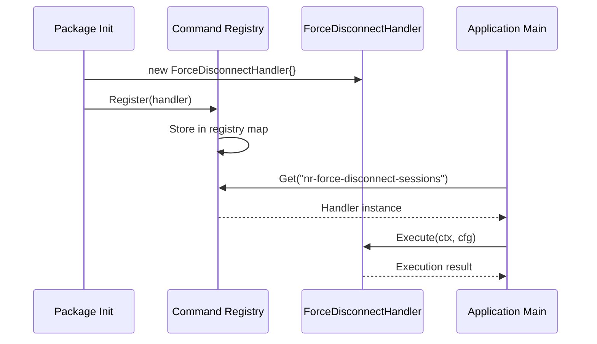
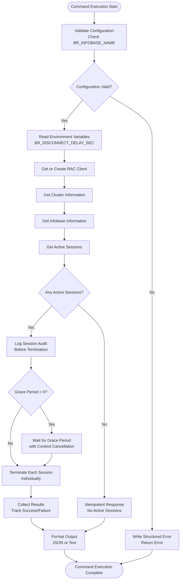
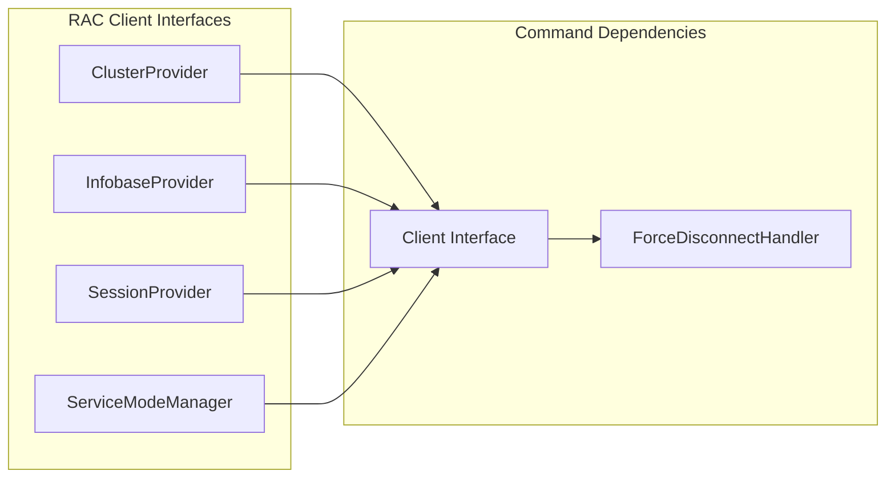

# Force Disconnect Sessions Command

<cite>
**Referenced Files in This Document**
- [handler.go](file://internal/command/handlers/forcedisconnecthandler/handler.go)
- [handler_test.go](file://internal/command/handlers/forcedisconnecthandler/handler_test.go)
- [registry.go](file://internal/command/registry.go)
- [handler.go](file://internal/command/handler.go)
- [interfaces.go](file://internal/adapter/onec/rac/interfaces.go)
- [mock.go](file://internal/adapter/onec/rac/ractest/mock.go)
- [constants.go](file://internal/constants/constants.go)
- [result.go](file://internal/pkg/output/result.go)
- [main.go](file://cmd/apk-ci/main.go)
- [2-6-force-disconnect-sessions.md](file://_bmad-output/implementation-artifacts/stories/2-6-force-disconnect-sessions.md)
</cite>

## Table of Contents
1. [Introduction](#introduction)
2. [Command Overview](#command-overview)
3. [Architecture and Design](#architecture-and-design)
4. [Core Components Analysis](#core-components-analysis)
5. [Execution Flow](#execution-flow)
6. [Data Structures](#data-structures)
7. [Error Handling](#error-handling)
8. [Testing Strategy](#testing-strategy)
9. [Integration Points](#integration-points)
10. [Usage Examples](#usage-examples)
11. [Performance Considerations](#performance-considerations)
12. [Troubleshooting Guide](#troubleshooting-guide)
13. [Conclusion](#conclusion)

## Introduction

The Force Disconnect Sessions Command (nr-force-disconnect-sessions) is a specialized NR- (Native Runner) command designed to provide DevOps engineers with the ability to forcibly terminate active user sessions in 1C:Enterprise information bases. This command serves as a critical tool for database maintenance, emergency session termination, and operational control, operating independently of the service mode activation process.

Unlike traditional session termination methods that rely on service mode enablement, this command provides direct, immediate access to session management capabilities. It is particularly valuable during database maintenance windows, emergency situations requiring immediate session clearance, or when bypassing service mode restrictions becomes necessary for operational procedures.

## Command Overview

The nr-force-disconnect-sessions command operates on the principle of immediate, targeted session termination with comprehensive audit logging and graceful error handling. It provides both structured JSON output for programmatic consumption and human-readable text output for manual operations.

### Key Capabilities

- **Immediate Session Termination**: Forces the termination of all active sessions in a specified information base
- **Graceful Degradation**: Supports configurable delay periods (grace period) before session termination
- **Comprehensive Auditing**: Logs detailed information about all sessions being terminated for audit trails
- **Partial Failure Handling**: Continues operation even when individual session terminations fail
- **Idempotent Operations**: Safe to run multiple times without causing adverse effects
- **Multi-format Output**: Supports both JSON and text output formats for different use cases

### Target Environment

The command is specifically designed for 1C:Enterprise environments with Remote Administration Console (RAC) connectivity. It requires proper configuration of RAC server connections and appropriate authentication credentials to function effectively.

## Architecture and Design

The Force Disconnect Sessions Command follows a well-established pattern within the apk-ci framework, leveraging the self-registration command architecture and dependency injection principles.



**Diagram sources**
- [handler.go](file://internal/command/handlers/forcedisconnecthandler/handler.go#L105-L120)
- [registry.go](file://internal/command/registry.go#L36-L55)
- [interfaces.go](file://internal/adapter/onec/rac/interfaces.go#L102-L109)

### Design Patterns

The implementation employs several established Go design patterns:

- **Self-Registration Pattern**: Commands register themselves automatically via package initialization
- **Interface Segregation Pattern**: Clear separation between RAC client interfaces and command logic
- **Strategy Pattern**: Pluggable output formatters (JSON/Text)
- **Dependency Injection**: Optional RAC client injection for testability
- **Command Pattern**: Standardized handler interface for all commands

## Core Components Analysis

### ForceDisconnectHandler Structure

The core handler implements the standardized command interface while providing specialized session termination logic.



**Diagram sources**
- [handler.go](file://internal/command/handlers/forcedisconnecthandler/handler.go#L105-L120)
- [handler.go](file://internal/command/handlers/forcedisconnecthandler/handler.go#L26-L56)

### Command Registration System

The command integrates seamlessly with the global command registry through automatic registration in the package initialization phase.



**Diagram sources**
- [handler.go](file://internal/command/handlers/forcedisconnecthandler/handler.go#L22-L24)
- [registry.go](file://internal/command/registry.go#L36-L55)
- [main.go](file://cmd/apk-ci/main.go#L17)

**Section sources**
- [handler.go](file://internal/command/handlers/forcedisconnecthandler/handler.go#L105-L120)
- [registry.go](file://internal/command/registry.go#L36-L55)
- [handler.go](file://internal/command/handler.go#L15-L27)

## Execution Flow

The command execution follows a carefully orchestrated sequence designed for reliability, auditability, and graceful error handling.



**Diagram sources**
- [handler.go](file://internal/command/handlers/forcedisconnecthandler/handler.go#L122-L269)

### Execution Phases

The execution process consists of several distinct phases, each with specific responsibilities and error handling mechanisms:

1. **Initialization Phase**: Validates configuration, reads environment variables, and establishes RAC client connections
2. **Discovery Phase**: Retrieves cluster and information base metadata, enumerates active sessions
3. **Audit Phase**: Logs comprehensive session information for audit trails
4. **Grace Period Phase**: Implements configurable delay with cancellation support
5. **Termination Phase**: Executes individual session terminations with partial failure handling
6. **Reporting Phase**: Formats and outputs results in requested format

**Section sources**
- [handler.go](file://internal/command/handlers/forcedisconnecthandler/handler.go#L122-L269)

## Data Structures

The command utilizes well-defined data structures to represent session termination results and maintain consistency across different output formats.

### ForceDisconnectData Structure

The primary result structure encapsulates all information about the session termination operation:

| Field | Type | Description | JSON Key |
|-------|------|-------------|----------|
| TerminatedSessionsCount | int | Number of successfully terminated sessions | terminated_sessions_count |
| NoActiveSessions | bool | Indicates no active sessions were found | no_active_sessions |
| StateChanged | bool | Whether any sessions were actually terminated | state_changed |
| DelaySec | int | Configured grace period in seconds | delay_sec |
| InfobaseName | string | Name of the information base processed | infobase_name |
| PartialFailure | bool | Indicates some sessions failed to terminate | partial_failure |
| Sessions | []DisconnectedSessionInfo | Array of successfully terminated sessions | sessions |
| Errors | []string | Array of error messages for failed terminations | errors |

### DisconnectedSessionInfo Structure

Individual session termination records provide detailed information about each completed operation:

| Field | Type | Description | JSON Key |
|-------|------|-------------|----------|
| UserName | string | Name of the user whose session was terminated | user_name |
| AppID | string | Application identifier (1CV8, 1CV8C, WebClient) | app_id |
| Host | string | Hostname or IP address where session originated | host |
| SessionID | string | Unique session identifier | session_id |

### Output Formatting

The command supports dual output formats with consistent data representation:

**JSON Output Schema:**
```json
{
  "status": "success",
  "command": "nr-force-disconnect-sessions",
  "data": {
    "terminated_sessions_count": 2,
    "no_active_sessions": false,
    "delay_sec": 0,
    "infobase_name": "MyBase",
    "partial_failure": false,
    "sessions": [
      {
        "user_name": "Иванов",
        "app_id": "1CV8C", 
        "host": "workstation-01",
        "session_id": "uuid-1"
      }
    ],
    "errors": []
  },
  "metadata": {
    "duration_ms": 350,
    "trace_id": "abc123def456...",
    "api_version": "v1"
  }
}
```

**Text Output Format:**
```
Принудительное завершение сессий: MyBase
Завершено сессий: 2
  1. Иванов (1CV8C) — workstation-01
  2. Петров (1CV8) — workstation-02
```

**Section sources**
- [handler.go](file://internal/command/handlers/forcedisconnecthandler/handler.go#L26-L56)
- [handler.go](file://internal/command/handlers/forcedisconnecthandler/handler.go#L58-L103)

## Error Handling

The command implements comprehensive error handling designed for operational reliability and clear diagnostic information.

### Error Categories

| Error Code | Scenario | JSON Code | Description |
|------------|----------|-----------|-------------|
| CONFIG.INFOBASE_MISSING | Missing BR_INFOBASE_NAME | CONFIG.INFOBASE_MISSING | Required configuration parameter missing |
| RAC.CLIENT_CREATE_FAILED | RAC client creation failure | RAC.CLIENT_CREATE_FAILED | Unable to establish RAC connection |
| RAC.CLUSTER_FAILED | Cluster information retrieval failure | RAC.CLUSTER_FAILED | RAC cluster access error |
| RAC.INFOBASE_FAILED | Information base lookup failure | RAC.INFOBASE_FAILED | Information base not found or inaccessible |
| RAC.SESSIONS_FAILED | Session enumeration failure | RAC.SESSIONS_FAILED | Unable to list active sessions |

### Error Propagation Strategy

The error handling follows a consistent pattern:

1. **Structured Errors**: All errors are returned as structured JSON with machine-readable codes
2. **Human-Readable Messages**: Clear, actionable messages for operators
3. **Context Preservation**: Error context maintained through trace IDs and metadata
4. **Graceful Degradation**: Partial failures don't prevent overall command completion

### Partial Failure Handling

The command uniquely handles scenarios where some session terminations succeed while others fail:

- **Success State**: Command returns success even with partial failures
- **Detailed Reporting**: Individual failure reasons are captured and reported
- **Audit Trail**: Both successful and failed operations are logged comprehensively
- **Continued Operation**: Processing continues despite individual operation failures

**Section sources**
- [handler.go](file://internal/command/handlers/forcedisconnecthandler/handler.go#L134-L164)
- [handler.go](file://internal/command/handlers/forcedisconnecthandler/handler.go#L294-L325)

## Testing Strategy

The implementation includes comprehensive test coverage following established patterns from related command handlers.

### Test Categories

| Test Category | Coverage | Purpose |
|-------------|----------|---------|
| Unit Tests | 20+ tests | Core functionality verification |
| Integration Tests | Registry integration | Command registration and discovery |
| Error Path Tests | Multiple scenarios | Robust error handling validation |
| Output Format Tests | JSON and text | Dual format compatibility |
| Environment Variable Tests | Delay parsing and validation | Configuration robustness |

### Key Test Scenarios

1. **Basic Functionality**: Successful session termination with proper output formatting
2. **Idempotency**: No active sessions scenario returns appropriate response
3. **Grace Period**: Configurable delay with proper cancellation support
4. **Partial Failures**: Mixed success/failure scenarios with comprehensive reporting
5. **Error Conditions**: Various failure modes with structured error responses
6. **Configuration Validation**: Missing parameters and invalid configurations

### Test Utilities

The testing infrastructure leverages specialized utilities:

- **Mock RAC Client**: Comprehensive mocking for all RAC operations
- **Output Capture**: Standardized stdout capture for result validation
- **Environment Management**: Clean environment variable setup for each test
- **Context Cancellation**: Proper testing of cancellation scenarios

**Section sources**
- [handler_test.go](file://internal/command/handlers/forcedisconnecthandler/handler_test.go#L39-L110)
- [handler_test.go](file://internal/command/handlers/forcedisconnecthandler/handler_test.go#L112-L155)
- [mock.go](file://internal/adapter/onec/rac/ractest/mock.go#L143-L197)

## Integration Points

The command integrates with multiple system components to provide comprehensive functionality.

### RAC Client Integration

The command relies on the RAC (Remote Administration Console) client for all 1C:Enterprise operations:



**Diagram sources**
- [interfaces.go](file://internal/adapter/onec/rac/interfaces.go#L63-L109)

### Configuration Management

The command integrates with the centralized configuration system:

- **Environment Variables**: BR_INFOBASE_NAME, BR_DISCONNECT_DELAY_SEC
- **Secret Management**: Secure credential handling through SecretConfig
- **Application Configuration**: RAC server settings and timeouts
- **Output Formatting**: BR_OUTPUT_FORMAT selection

### Command Registry Integration

Automatic integration with the global command registry ensures seamless discoverability:

- **Self-Registration**: Automatic registration via package initialization
- **Command Discovery**: Global registry lookup for command execution
- **Legacy Compatibility**: Coexistence with traditional command patterns

**Section sources**
- [interfaces.go](file://internal/adapter/onec/rac/interfaces.go#L102-L109)
- [constants.go](file://internal/constants/constants.go#L108-L110)
- [main.go](file://cmd/apk-ci/main.go#L17)

## Usage Examples

### Basic Usage

The simplest invocation requires only the command name and information base specification:

```bash
export BR_COMMAND="nr-force-disconnect-sessions"
export BR_INFOBASE_NAME="ProductionDB"
./apk-ci
```

### With Grace Period

For operations requiring a controlled shutdown window:

```bash
export BR_COMMAND="nr-force-disconnect-sessions"
export BR_INFOBASE_NAME="ProductionDB"
export BR_DISCONNECT_DELAY_SEC="30"
./apk-ci
```

### Programmatic Integration

JSON output format enables easy integration with automation systems:

```bash
export BR_COMMAND="nr-force-disconnect-sessions"
export BR_INFOBASE_NAME="TestDB"
export BR_OUTPUT_FORMAT="json"
./apk-ci
```

### Error Handling Example

The command provides structured error responses for automated error handling:

```json
{
  "status": "error",
  "command": "nr-force-disconnect-sessions",
  "error": {
    "code": "CONFIG.INFOBASE_MISSING",
    "message": "Не указано имя информационной базы (BR_INFOBASE_NAME)"
  },
  "metadata": {
    "duration_ms": 1,
    "trace_id": "abc123...",
    "api_version": "v1"
  }
}
```

## Performance Considerations

The command is designed for efficient operation in production environments with careful consideration of performance characteristics.

### Execution Time Factors

| Factor | Impact | Optimization Strategy |
|--------|--------|----------------------|
| Session Count | Linear scaling | Batch processing considerations |
| Network Latency | Direct correlation | Connection pooling and reuse |
| Grace Period | Fixed overhead | Configurable delays |
| Logging Volume | Proportional | Selective logging levels |

### Memory Usage

The command maintains minimal memory footprint:
- **Session Enumeration**: Memory proportional to active session count
- **Result Collection**: Minimal overhead for success/failure tracking
- **Logging**: Efficient structured logging with context preservation

### Scalability Limits

Current implementation scales linearly with session count. For environments with very large numbers of concurrent sessions, consider:

- **Batch Processing**: Implement session batching for extremely large counts
- **Connection Pooling**: Reuse RAC connections across operations
- **Parallel Processing**: Consider parallel termination for high-volume scenarios

## Troubleshooting Guide

### Common Issues and Solutions

**Issue**: Command fails with "CONFIG.INFOBASE_MISSING"
**Solution**: Verify BR_INFOBASE_NAME environment variable is set correctly

**Issue**: RAC connection timeouts during session enumeration
**Solution**: Check RAC server accessibility and network connectivity

**Issue**: Grace period not applying as expected
**Solution**: Validate BR_DISCONNECT_DELAY_SEC contains numeric value within 0-300 range

**Issue**: Partial failures in session termination
**Solution**: Review individual error messages and RAC server logs for specific failure reasons

### Diagnostic Commands

For troubleshooting session-related issues:

```bash
# Check current session status
export BR_COMMAND="nr-service-mode-status"
export BR_INFOBASE_NAME="YourDB"
./apk-ci

# Verify RAC connectivity
export BR_COMMAND="nr-version"
./apk-ci
```

### Log Analysis

Key log entries to monitor:

- **Session Audit Logs**: Pre-termination session information
- **Grace Period Logs**: Delay configuration and execution
- **Termination Results**: Individual session termination outcomes
- **Error Messages**: Specific failure reasons and remediation steps

**Section sources**
- [handler.go](file://internal/command/handlers/forcedisconnecthandler/handler.go#L134-L164)
- [handler.go](file://internal/command/handlers/forcedisconnecthandler/handler.go#L212-L220)

## Conclusion

The Force Disconnect Sessions Command represents a sophisticated addition to the apk-ci ecosystem, providing essential session management capabilities for 1C:Enterprise environments. Its implementation demonstrates best practices in Go development, including comprehensive error handling, robust testing, and clean architectural design.

The command's key strengths include its idempotent nature, comprehensive audit logging, graceful error handling, and flexible output formats. These features make it suitable for both automated operations and manual administrative tasks.

Future enhancements could include session filtering capabilities, batch processing optimizations, and integration with monitoring systems for real-time session tracking. The current implementation provides a solid foundation for these potential extensions while maintaining backward compatibility and operational reliability.

The command successfully fills a critical gap in database administration tooling, offering DevOps teams precise control over session lifecycle management independent of service mode constraints. This capability proves invaluable for maintenance operations, emergency response scenarios, and routine database administration tasks.