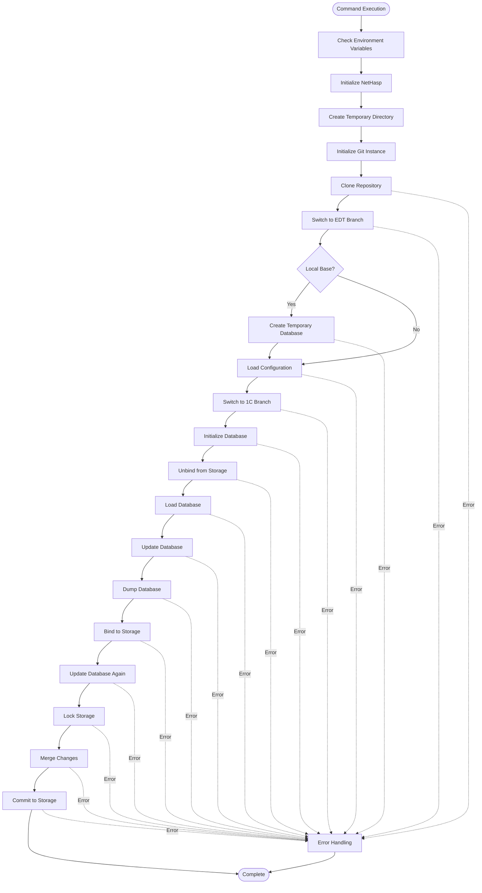
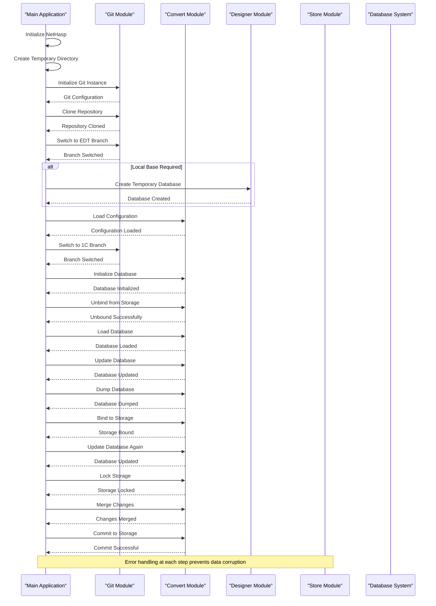
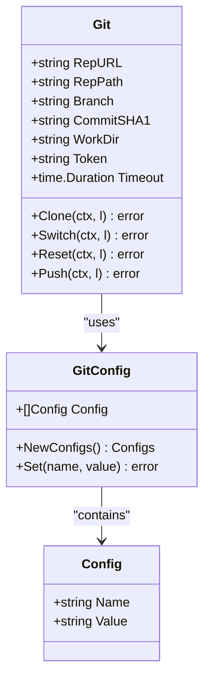
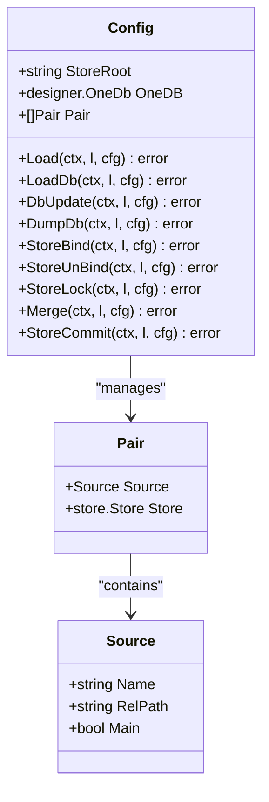
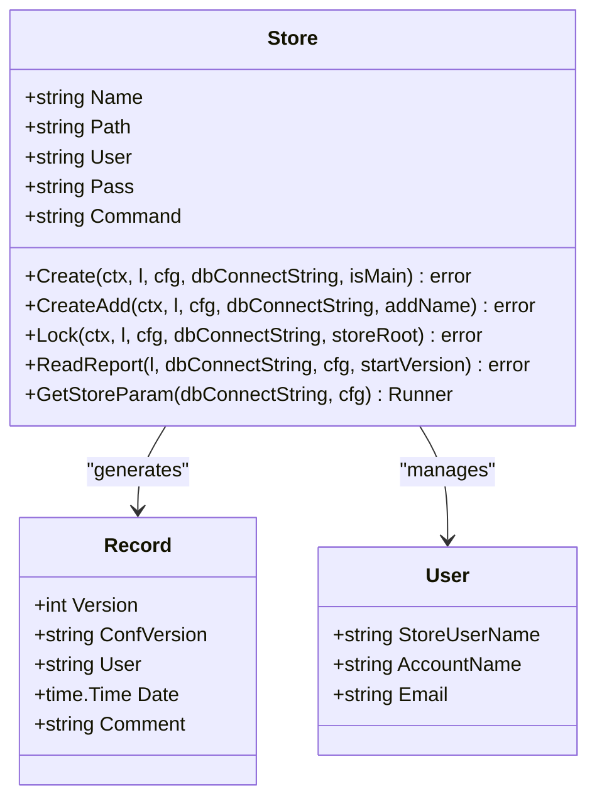

# Git2store Command Documentation

<cite>
**Referenced Files in This Document**
- [cmd/benadis-runner/main.go](file://cmd/benadis-runner/main.go) - *Updated in recent commit*
- [internal/app/app.go](file://internal/app/app.go) - *Updated in recent commit*
- [internal/git/git.go](file://internal/git/git.go) - *Updated with configurable timeouts*
- [internal/config/config.go](file://internal/config/config.go) - *Added GitConfig structure*
- [internal/entity/one/convert/convert.go](file://internal/entity/one/convert/convert.go)
- [internal/entity/one/store/store.go](file://internal/entity/one/store/store.go)
- [internal/entity/one/designer/designer.go](file://internal/entity/one/designer/designer.go)
- [internal/constants/constants.go](file://internal/constants/constants.go)
- [config/app.yaml](file://config/app.yaml) - *Updated with Git timeout configuration*
- [old/PlantUML/Git2Store.puml](file://old/PlantUML/Git2Store.puml)
</cite>

## Update Summary
**Changes Made**
- Updated Git operations with configurable timeouts for clone, push, add, commit, and reset operations
- Increased default timeout values for Git operations to accommodate large repositories
- Added GitConfig structure to centralize Git operation configurations
- Updated documentation to reflect new timeout configuration options and default values
- Enhanced error handling for timeout scenarios in Git operations

## Table of Contents
1. [Introduction](#introduction)
2. [Command Overview](#command-overview)
3. [Environment Variables](#environment-variables)
4. [Workflow Architecture](#workflow-architecture)
5. [Detailed Workflow Analysis](#detailed-workflow-analysis)
6. [Component Integration](#component-integration)
7. [Error Handling](#error-handling)
8. [Performance Considerations](#performance-considerations)
9. [Common Issues and Solutions](#common-issues-and-solutions)
10. [Configuration Examples](#configuration-examples)
11. [Troubleshooting Guide](#troubleshooting-guide)

## Introduction

The `git2store` command in benadis-runner is a specialized tool designed to synchronize configuration data from Git repositories to 1C configuration storage. This command serves as a critical bridge between modern version control practices and traditional 1C configuration management systems, enabling seamless integration of development workflows with enterprise configuration management.

The command automates the complex process of converting Git-based configuration files into 1C-compatible formats, managing database operations, and ensuring data integrity throughout the synchronization process. It handles everything from repository initialization to final storage commits, providing a robust solution for organizations transitioning to Git-based workflows while maintaining compatibility with existing 1C infrastructure.

## Command Overview

The `git2store` command is executed by setting the `BR_COMMAND=git2store` environment variable and configuring appropriate parameters. The command follows a structured workflow that ensures reliable data transfer between Git repositories and 1C configuration storage systems.



**Diagram sources**
- [internal/app/app.go](file://internal/app/app.go#L417-L531)

**Section sources**
- [cmd/benadis-runner/main.go](file://cmd/benadis-runner/main.go#L40-L45)
- [internal/constants/constants.go](file://internal/constants/constants.go#L58-L59)

## Environment Variables

The `git2store` command relies on several environment variables to configure its operation. These variables provide essential configuration parameters for repository access, authentication, and operational settings.

### Required Environment Variables

| Variable | Description | Example |
|----------|-------------|---------|
| `BR_COMMAND` | Specifies the command to execute (`git2store`) | `git2store` |
| `BR_INFOBASE_NAME` | Name of the target 1C infobase | `my_project` |
| `BR_CONFIG_SYSTEM` | Path to system configuration file | `/path/to/system.yaml` |
| `BR_CONFIG_PROJECT` | Path to project configuration file | `/path/to/project.yaml` |
| `BR_CONFIG_SECRET` | Path to secret configuration file | `/path/to/secret.yaml` |

### Authentication Variables

| Variable | Description | Purpose |
|----------|-------------|---------|
| `BR_GITEA_URL` | URL of the Gitea instance | Repository access |
| `BR_ACCESS_TOKEN` | Access token for authentication | Secure repository access |
| `BR_OWNER` | Repository owner | Organization/user identifier |
| `BR_REPO` | Repository name | Target repository |

### Operational Variables

| Variable | Description | Default | Purpose |
|----------|-------------|---------|---------|
| `BR_WORK_DIR` | Working directory | `/tmp` | Temporary file storage |
| `BR_TMP_DIR` | Temporary directory | Same as work directory | Intermediate file storage |
| `BR_TIMEOUT` | Operation timeout | 1200 seconds | Prevent hanging operations |
| `BR_FORCE_UPDATE` | Force update flag | `false` | Override safety checks |

**Section sources**
- [internal/config/config.go](file://internal/config/config.go#L100-L150)
- [internal/config/config.go](file://internal/config/config.go#L150-L200)

## Workflow Architecture

The `git2store` command implements a sophisticated multi-stage workflow that orchestrates the entire synchronization process. The architecture is designed around modularity and error resilience, ensuring reliable operation even in complex environments.



**Diagram sources**
- [internal/app/app.go](file://internal/app/app.go#L417-L531)
- [internal/git/git.go](file://internal/git/git.go#L150-L200)

**Section sources**
- [internal/app/app.go](file://internal/app/app.go#L417-L531)

## Detailed Workflow Analysis

### Stage 1: Initialization and Setup

The workflow begins with system initialization and temporary directory creation. This stage establishes the foundation for subsequent operations.

```go
// Initialize NetHasp for licensing
NetHaspInit(ctx, l)

// Create temporary directory for repository operations
cfg.RepPath, err = os.MkdirTemp(cfg.WorkDir, "s")
if err != nil {
    l.Error("Error creating temporary directory",
        slog.String("error_description", err.Error()),
    )
    return err
}
```

The initialization process involves:
- **NetHasp Initialization**: Ensures proper licensing for 1C components
- **Temporary Directory Creation**: Provides isolated workspace for operations
- **Git Instance Setup**: Configures repository access with authentication tokens

### Stage 2: Repository Management

The repository management phase handles Git operations including cloning, branching, and conflict resolution. The command now features configurable timeouts for all Git operations with increased default values.

```go
// Initialize Git with authentication
g, err := InitGit(l, cfg)
if err != nil {
    return err
}

// Clone repository with configured timeout
err = g.Clone(ctx, l)
if err != nil {
    l.Error("Error cloning repository",
        slog.String("error_description", err.Error()),
    )
    return err
}

// Switch to EDT branch for development
g.Branch = constants.EdtBranch
if err := g.Switch(*ctx, l); err != nil {
    l.Error("Error switching to EDT branch",
        slog.String("error_description", err.Error()),
        slog.String("branch", constants.EdtBranch),
    )
    return err
}
```

Key operations include:
- **Repository Cloning**: Downloads full repository history with configurable timeout
- **Branch Switching**: Navigates to development branch for configuration updates
- **Conflict Resolution**: Handles merge conflicts during branch transitions

### Stage 3: Database Operations

The database operations stage manages the creation and manipulation of temporary databases for configuration processing.

```go
if cfg.ProjectConfig.StoreDb == constants.LocalBase {
    // Generate temporary database path
    dbPath := filepath.Join(cfg.TmpDir, "temp_db_"+time.Now().Format("20060102_150405"))
    
    // Create temporary database
    oneDb, errTempDbCreate := designer.CreateTempDb(l, cfg, dbPath, cfg.AddArray)
    if errTempDbCreate != nil {
        l.Error("Error creating temporary database",
            slog.String("error_description", errTempDbCreate.Error()),
        )
        return errTempDbCreate
    }
    
    cc.OneDB = oneDb
}
```

Database operations encompass:
- **Temporary Database Creation**: Generates isolated database instances for processing
- **Extension Management**: Creates and configures database extensions
- **Configuration Loading**: Loads Git-based configurations into database format

### Stage 4: Storage Integration

The storage integration phase connects the processed configuration to the 1C storage system.

```go
// Unbind database from storage to prevent conflicts
err = cc.StoreUnBind(ctx, l, cfg)
if err != nil {
    l.Error("Error unbinding database from storage",
        slog.String("error_description", err.Error()),
    )
    return err
}

// Load database with configuration changes
if err = cc.LoadDb(ctx, l, cfg); err != nil {
    return err
}

// Update database to apply changes
if err = cc.DbUpdate(ctx, l, cfg); err != nil {
    return err
}

// Dump database to prepare for storage operations
if err = cc.DumpDb(ctx, l, cfg); err != nil {
    return err
}
```

Storage integration steps include:
- **Storage Unbinding**: Disconnects database from existing storage to enable modifications
- **Database Loading**: Applies configuration changes to the database
- **Database Updates**: Ensures all changes are properly integrated
- **Database Dumping**: Prepares database state for storage operations

### Stage 5: Final Storage Operations

The final stage performs storage-specific operations including locking, merging, and committing changes.

```go
// Bind database to storage for modification
if err = cc.StoreBind(ctx, l, cfg); err != nil {
    return err
}

// Lock storage to prevent concurrent modifications
if err = cc.StoreLock(ctx, l, cfg); err != nil {
    return err
}

// Merge configuration changes with storage
if err = cc.Merge(ctx, l, cfg); err != nil {
    return err
}

// Commit changes to storage with appropriate metadata
if err = cc.StoreCommit(ctx, l, cfg); err != nil {
    return err
}
```

Final operations involve:
- **Storage Binding**: Reconnects database to storage for modification
- **Storage Locking**: Prevents concurrent access during critical operations
- **Change Merging**: Integrates configuration changes with existing storage
- **Commit Operations**: Persists changes with proper versioning and metadata

**Section sources**
- [internal/app/app.go](file://internal/app/app.go#L417-L531)
- [internal/git/git.go](file://internal/git/git.go#L150-L200)

## Component Integration

The `git2store` command integrates multiple specialized components to achieve its functionality. Each component handles specific aspects of the synchronization process, working together to provide a cohesive solution.

### Git Integration

The Git integration component manages all repository operations, providing robust version control capabilities with configurable timeouts.



**Diagram sources**
- [internal/git/git.go](file://internal/git/git.go#L40-L80)

### Configuration Conversion

The configuration conversion component transforms Git-based configurations into 1C-compatible formats.



**Diagram sources**
- [internal/entity/one/convert/convert.go](file://internal/entity/one/convert/convert.go#L30-L60)

### Storage Management

The storage management component handles all operations related to 1C configuration storage.



**Diagram sources**
- [internal/entity/one/store/store.go](file://internal/entity/one/store/store.go#L30-L60)

**Section sources**
- [internal/git/git.go](file://internal/git/git.go#L40-L80)
- [internal/entity/one/convert/convert.go](file://internal/entity/one/convert/convert.go#L30-L60)
- [internal/entity/one/store/store.go](file://internal/entity/one/store/store.go#L30-L60)

## Error Handling

The `git2store` command implements comprehensive error handling at each stage of the workflow. This ensures graceful degradation and provides meaningful feedback for troubleshooting.

### Error Categories

The command handles several categories of errors:

1. **Initialization Errors**: Network connectivity, authentication failures
2. **Repository Errors**: Clone failures, branch switching issues
3. **Database Errors**: Creation failures, loading problems
4. **Storage Errors**: Binding/unbinding issues, locking failures
5. **Merge Errors**: Conflict resolution problems

### Error Recovery Strategies

```go
// Example error handling pattern from the Git2Store function
if err := g.Switch(*ctx, l); err != nil {
    l.Error("Error switching to EDT branch",
        slog.String("error_description", err.Error()),
        slog.String("branch", constants.EdtBranch),
    )
    return err
}

// Error handling for database operations
if err = cc.LoadDb(ctx, l, cfg); err != nil {
    return err
}
```

### Logging and Diagnostics

The command provides extensive logging for troubleshooting:

- **Structured Logging**: Uses structured log entries with context
- **Error Context**: Includes relevant parameters and state information
- **Step Tracking**: Logs progress through workflow stages
- **Diagnostic Information**: Captures system state for analysis

**Section sources**
- [internal/app/app.go](file://internal/app/app.go#L417-L531)

## Performance Considerations

### Timeout Settings

The command implements configurable timeout settings to handle various network conditions and repository sizes. The default values have been increased to accommodate large repositories:

```go
// Default timeout values for Git operations
- Clone: 60 minutes (previously 20 minutes)
- Push: 60 minutes (previously 20 minutes)
- Add: 30 minutes (previously 10 minutes)
- Commit: 30 minutes (previously 10 minutes)
- Reset: 60 minutes (previously 20 minutes)
```

The timeout values can be configured through the GitConfig structure in the application configuration:

```yaml
git:
  timeout: "60m"
```

### Large Configuration Sets

For large configuration sets, consider:

- **Memory Management**: Monitor memory usage during database operations
- **Network Bandwidth**: Optimize repository cloning and pushing
- **Storage Performance**: Ensure adequate storage I/O capacity
- **Concurrent Operations**: Limit simultaneous operations to prevent resource contention

### Recommended Settings

| Parameter | Recommended Value | Description |
|-----------|-------------------|-------------|
| `BR_TIMEOUT` | 1200 seconds | Repository operations timeout |
| `BR_WORK_DIR` | SSD storage | Fast temporary file access |
| `BR_TMP_DIR` | Separate partition | Isolated temporary storage |
| `GIT_CONFIG` | `core.autocrlf=false` | Consistent line endings |

**Section sources**
- [internal/git/git.go](file://internal/git/git.go#L150-L200)
- [internal/config/config.go](file://internal/config/config.go#L263-L281)

## Common Issues and Solutions

### Merge Conflicts

**Issue**: Git merge conflicts during branch switching or repository operations.

**Solution**: 
```bash
# Manual conflict resolution
git checkout main
git pull origin main
git checkout xml
git merge main
# Resolve conflicts manually
git add .
git commit -m "Resolved merge conflicts"
```

### Storage Lock Failures

**Issue**: Storage lock acquisition fails due to concurrent operations.

**Solution**:
```go
// Implement retry logic for storage operations
for i := 0; i < 3; i++ {
    err = cc.StoreLock(ctx, l, cfg)
    if err == nil {
        break
    }
    time.Sleep(time.Duration(i+1) * time.Second)
}
```

### Database Connection Issues

**Issue**: Database connection failures during configuration loading.

**Solution**:
- Verify database server accessibility
- Check user credentials and permissions
- Ensure sufficient database resources
- Review connection string format

### Repository Access Problems

**Issue**: Authentication failures accessing Git repository.

**Solution**:
- Verify access token validity
- Check repository permissions
- Ensure network connectivity
- Validate repository URL format

**Section sources**
- [internal/app/app.go](file://internal/app/app.go#L417-L531)

## Configuration Examples

### Basic Configuration

```yaml
# app.yaml
logLevel: Info
workDir: /tmp/benadis
tmpDir: /tmp/benadis/tmp
timeout: 1200
paths:
  bin1cv8: /opt/1C/v8.3/x86_64/1cv8
  binIbcmd: /opt/1C/v8.3/x86_64/ibcmd
  edtCli: /opt/1C/edt-cli
  rac: /opt/1C/rac
users:
  db: Administrator
  storeAdmin: Administrator
git:
  userName: benadis-runner
  userEmail: runner@benadis.ru
  defaultBranch: main
  timeout: "60m"
  credentialHelper: store
  credentialTimeout: "24h"
```

### Project Configuration

```yaml
# project.yaml
debug: false
store-db: local
prod:
  test:
    dbName: test_base
    add-disable: []
    related:
      - prod_base
```

### Secret Configuration

```yaml
# secret.yaml
passwords:
  db: secure_password
  storeAdminPassword: admin_password
gitea:
  accessToken: ghp_token_string
sonarqube:
  token: sq_token_string
```

**Section sources**
- [internal/config/config.go](file://internal/config/config.go#L25-L100)

## Troubleshooting Guide

### Diagnostic Commands

```bash
# Check repository access
git ls-remote $BR_GITEA_URL/$BR_OWNER/$BR_REPO.git

# Verify database connectivity
/opt/1C/v8.3/x86_64/1cv8 DESIGNER /F $DB_PATH /DisableStartupDialogs

# Test storage connection
/opt/1C/v8.3/x86_64/1cv8 DESIGNER /F $DB_PATH /ConfigurationRepositoryF $STORE_PATH
```

### Log Analysis

Monitor logs for common patterns:
- **Success Patterns**: Look for "successfully" messages in log output
- **Error Patterns**: Identify recurring error messages and stack traces
- **Performance Patterns**: Monitor timing information for bottlenecks

### Common Error Messages

| Error Message | Cause | Solution |
|---------------|-------|----------|
| "Error creating temporary directory" | Insufficient disk space | Free up disk space |
| "Error cloning repository" | Network issues | Check network connectivity |
| "Error unbinding database from storage" | Storage server unavailable | Verify storage service status |
| "Unknown error capturing main configuration" | Concurrent access | Retry operation |

### Performance Tuning

For improved performance:
- Increase timeout values for slow networks
- Use SSD storage for temporary directories
- Configure appropriate database connection limits
- Monitor system resources during operations

**Section sources**
- [internal/app/app.go](file://internal/app/app.go#L417-L531)