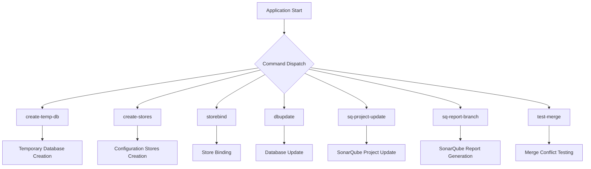
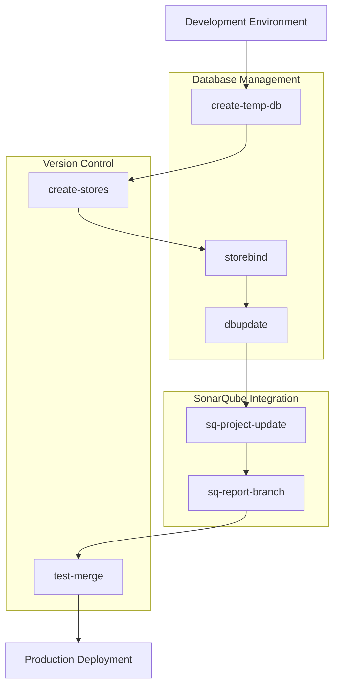

# Other Commands

<cite>
**Referenced Files in This Document **   
- [main.go](file://cmd/apk-ci/main.go)
- [constants.go](file://internal/constants/constants.go)
- [app.go](file://internal/app/app.go)
</cite>

## Table of Contents
1. [Introduction](#introduction)
2. [Command Overview](#command-overview)
3. [Detailed Command Analysis](#detailed-command-analysis)
   - [create-temp-db (ActCreateTempDb)](#create-temp-db-actcreatetempdb)
   - [create-stores (ActCreateStores)](#create-stores-actcreatestores)
   - [storebind (ActStoreBind)](#storebind-actstorebind)
   - [dbupdate (ActDbupdate)](#dbupdate-actdbupdate)
   - [sq-project-update (ActSQProjectUpdate)](#sq-project-update-actsqprojectupdate)
   - [sq-report-branch (ActSQReportBranch)](#sq-report-branch-actsqreportbranch)
   - [test-merge (ActTestMerge)](#test-merge-acttestmerge)
4. [Integration and Workflows](#integration-and-workflows)
5. [Common Use Cases and Issues](#common-use-cases-and-issues)

## Introduction
This document provides detailed information about additional commands in the apk-ci application beyond the primary ones. These specialized commands support various development, testing, and integration workflows within the 1C:Enterprise ecosystem. The commands are implemented in the main.go and app.go files and are triggered through environment variables that map to specific constant values defined in constants.go.

**Section sources**
- [main.go](file://cmd/apk-ci/main.go#L0-L252)
- [constants.go](file://internal/constants/constants.go#L0-L219)

## Command Overview
The apk-ci application implements several specialized commands for managing databases, configuration stores, and SonarQube integration. Each command is associated with a specific constant value (BR_COMMAND) that determines which functionality is executed when the application runs.

**Diagram sources **
- [main.go](file://cmd/apk-ci/main.go#L0-L252)
- [constants.go](file://internal/constants/constants.go#L0-L219)

**Section sources**
- [main.go](file://cmd/apk-ci/main.go#L0-L252)
- [constants.go](file://internal/constants/constants.go#L0-L219)

## Detailed Command Analysis

### create-temp-db (ActCreateTempDb)
The create-temp-db command creates temporary databases for testing purposes. This command is essential for setting up isolated environments for development and quality assurance workflows.

**Purpose**: Creates temporary database instances for testing without affecting production data.

**Syntax**: Set BR_ACTION=create-temp-db environment variable.

**Required Parameters**:
- BR_INFOPATH: Path to the information base
- BR_WORKDIR: Working directory for temporary files
- BR_TMPDIR: Temporary directory location

**Expected Outcome**: Returns a connection string for the newly created temporary database and logs successful creation.

**Implementation Workflow**:
1. Validates configuration parameters
2. Creates temporary database using designer tools
3. Returns connection string for subsequent operations

**Error Conditions**:
- Missing required configuration parameters
- Database creation failures
- Insufficient permissions or disk space

**Section sources**
- [main.go](file://cmd/apk-ci/main.go#L168-L176)
- [constants.go](file://internal/constants/constants.go#L118-L119)

### create-stores (ActCreateStores)
The create-stores command creates configuration stores for version control of 1C configurations. This enables proper source control management for enterprise applications.

**Purpose**: Initializes configuration storage repositories for version control.

**Syntax**: Set BR_ACTION=create-stores environment variable.

**Required Parameters**:
- BR_OWNER: Repository owner
- BR_REPO: Repository name
- BR_TMPDIR: Temporary directory for store creation

**Expected Outcome**: Successfully creates configuration stores and logs completion.

**Implementation Workflow**:
1. Calls CreateTempDbWrapper to create a temporary database
2. Uses the temporary database to initialize configuration stores
3. Sets up store root path based on owner and repository

**Dependencies**: Depends on create-temp-db functionality as it uses a temporary database during store creation.

**Error Conditions**:
- Failure to create temporary database
- Store initialization errors
- Invalid repository configuration

**Section sources**
- [main.go](file://cmd/apk-ci/main.go#L177-L185)
- [app.go](file://internal/app/app.go#L899-L921)
- [constants.go](file://internal/constants/constants.go#L120-L121)

### storebind (ActStoreBind)
The storebind command binds a configuration store to a database, establishing the connection between version-controlled configuration and the runtime database.

**Purpose**: Connects an existing database to a configuration store for version control.

**Syntax**: Set BR_ACTION=storebind environment variable.

**Required Parameters**:
- BR_INFOPATH: Path to the information base
- Configuration store connection details

**Expected Outcome**: Database is successfully bound to the configuration store and operation is logged.

**Implementation Workflow**:
1. Validates database connection
2. Establishes binding between database and configuration store
3. Verifies successful binding

**Error Conditions**:
- Database connectivity issues
- Invalid store credentials
- Permission denied errors

**Section sources**
- [main.go](file://cmd/apk-ci/main.go#L160-L167)
- [constants.go](file://internal/constants/constants.go#L116-L117)

### dbupdate (ActDbupdate)
The dbupdate command updates a database with the latest configuration from a store, applying changes to the schema and business logic.

**Purpose**: Applies configuration updates from version control to a target database.

**Syntax**: Set BR_ACTION=dbupdate environment variable.

**Required Parameters**:
- BR_INFOBASE_NAME: Target database name
- Store connection details

**Expected Outcome**: Database is updated with latest configuration and success is logged.

**Implementation Workflow**:
1. Connects to target database
2. Retrieves latest configuration from store
3. Applies configuration updates
4. Validates update completion

**Error Conditions**:
- Database connection failures
- Configuration merge conflicts
- Schema update errors

**Section sources**
- [main.go](file://cmd/apk-ci/main.go#L145-L152)
- [constants.go](file://internal/constants/constants.go#L114-L115)

### sq-project-update (ActSQProjectUpdate)
The sq-project-update command refreshes SonarQube project metadata, ensuring code quality metrics are current and accurate.

**Purpose**: Updates SonarQube project configuration and metadata.

**Syntax**: Set BR_ACTION=sq-project-update environment variable.

**Required Parameters**:
- BR_OWNER: Project owner
- BR_REPO: Repository name
- SonarQube authentication token

**Expected Outcome**: SonarQube project metadata is refreshed and update is logged.

**Implementation Workflow**:
1. Validates configuration
2. Initializes SonarQube services
3. Creates project update parameters
4. Executes project update handler

**Error Conditions**:
- Nil configuration
- SonarQube service initialization failures
- Authentication errors

**Section sources**
- [main.go](file://cmd/apk-ci/main.go#L186-L193)
- [app.go](file://internal/app/app.go#L89-L157)
- [constants.go](file://internal/constants/constants.go#L126-L127)

### sq-report-branch (ActSQReportBranch)
The sq-report-branch command generates reports on branch quality metrics from SonarQube, providing insights into code health.

**Purpose**: Generates quality reports for specific branches in SonarQube.

**Syntax**: Set BR_ACTION=sq-report-branch environment variable.

**Required Parameters**:
- BR_OWNER: Project owner
- BR_REPO: Repository name
- BR_BASE_BRANCH: Target branch name

**Expected Outcome**: Branch quality report is generated and completion is logged.

**Implementation Workflow**:
1. Validates configuration
2. Logs report generation start
3. Processes branch reporting request

**Error Conditions**:
- Nil configuration
- Invalid branch specifications
- Reporting service failures

**Section sources**
- [main.go](file://cmd/apk-ci/main.go#L209-L216)
- [app.go](file://internal/app/app.go#L190-L218)
- [constants.go](file://internal/constants/constants.go#L128-L129)

### test-merge (ActTestMerge)
The test-merge command checks for merge conflicts between branches, helping prevent integration issues.

**Purpose**: Tests potential merge conflicts before actual merging.

**Syntax**: Set BR_ACTION=test-merge environment variable.

**Required Parameters**:
- Source and target branch specifications
- Repository access credentials

**Expected Outcome**: Merge compatibility is tested and results are logged.

**Implementation Workflow**:
1. Identifies source and target branches
2. Simulates merge operation
3. Reports any conflicts found

**Error Conditions**:
- Branch access failures
- Merge conflict detection errors
- Repository connectivity issues

**Section sources**
- [main.go](file://cmd/apk-ci/main.go#L217-L224)
- [constants.go](file://internal/constants/constants.go#L130-L131)

## Integration and Workflows
These specialized commands integrate with various components of the 1C:Enterprise ecosystem and DevOps toolchain:

**Diagram sources **
- [main.go](file://cmd/apk-ci/main.go#L0-L252)
- [app.go](file://internal/app/app.go#L0-L1301)

**Section sources**
- [main.go](file://cmd/apk-ci/main.go#L0-L252)
- [app.go](file://internal/app/app.go#L0-L1301)

## Common Use Cases and Issues

### Common Use Cases
1. **Testing Environments**: Using create-temp-db and create-stores to set up isolated test environments
2. **CI/CD Pipelines**: Integrating sq-project-update and sq-report-branch in continuous integration workflows
3. **Database Migration**: Using dbupdate for applying configuration changes to staging and production databases
4. **Code Quality Assurance**: Employing test-merge to prevent merge conflicts in collaborative development

### Potential Issues
1. **Resource Constraints**: Temporary database creation may fail due to insufficient disk space
2. **Authentication Problems**: SonarQube commands require valid tokens and proper configuration
3. **Network Connectivity**: All commands depend on stable connections to database servers and version control systems
4. **Configuration Errors**: Missing or incorrect environment variables can cause command failures

**Section sources**
- [main.go](file://cmd/apk-ci/main.go#L0-L252)
- [app.go](file://internal/app/app.go#L0-L1301)
- [constants.go](file://internal/constants/constants.go#L0-L219)