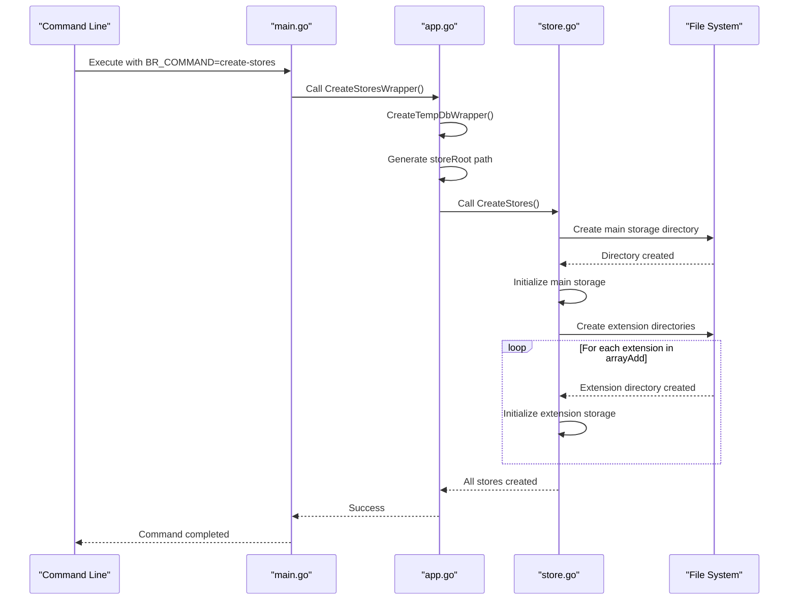
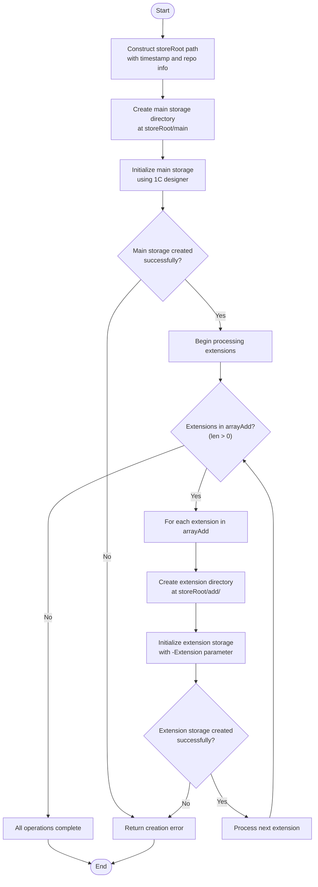
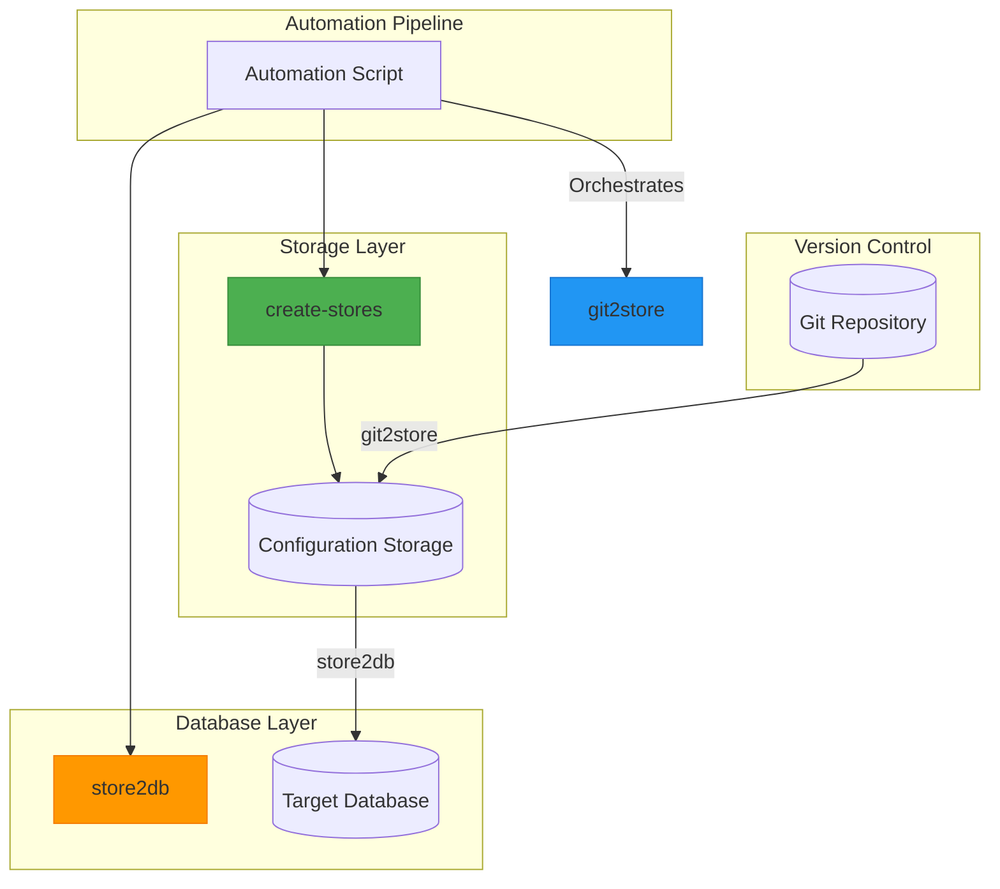

# create-stores Command

<cite>
**Referenced Files in This Document**   
- [main.go](file://cmd/benadis-runner/main.go)
- [app.go](file://internal/app/app.go)
- [store.go](file://internal/entity/one/store/store.go)
- [config.go](file://internal/config/config.go)
- [constants.go](file://internal/constants/constants.go)
- [action.yaml](file://config/action.yaml)
</cite>

## Table of Contents
1. [Introduction](#introduction)
2. [Command Workflow](#command-workflow)
3. [Input Parameters and Configuration](#input-parameters-and-configuration)
4. [Directory Creation and File Initialization](#directory-creation-and-file-initialization)
5. [Error Handling and Recovery](#error-handling-and-recovery)
6. [Integration with Other Commands](#integration-with-other-commands)
7. [Practical Usage Examples](#practical-usage-examples)
8. [Troubleshooting Guide](#troubleshooting-guide)

## Introduction
The `create-stores` command (ActCreateStores) in benadis-runner is responsible for initializing configuration storage directories for 1C:Enterprise projects. This command creates the necessary directory structure and initializes storage repositories that serve as the foundation for version control workflows in 1C development environments. The command orchestrates the creation of both main configuration storage and extension storages, establishing the infrastructure needed for subsequent operations like git2store and store2db.

The command plays a critical role in the automation pipeline by preparing the storage environment before configuration data is transferred from version control to the 1C system. It ensures that proper directory structures are in place with correct permissions and initialization, enabling seamless integration between Git-based version control systems and 1C:Enterprise's native configuration storage mechanism.

**Section sources**
- [main.go](file://cmd/benadis-runner/main.go#L0-L252)
- [constants.go](file://internal/constants/constants.go#L0-L219)

## Command Workflow
The `create-stores` command follows a well-defined workflow that begins with command invocation in main.go and proceeds through execution in app.go. When the command is triggered via the BR_COMMAND environment variable or input parameter, the main function in main.go routes execution to the CreateStoresWrapper function in app.go based on the ActCreateStores constant value.

The workflow begins with the creation of a temporary database through the CreateTempDbWrapper function, which provides the necessary 1C database environment for storage initialization. Once the temporary database is established, the command generates a root path for the storage structure using the current timestamp and repository information. This ensures unique storage locations for each execution and prevents conflicts between concurrent operations.



**Diagram sources **
- [main.go](file://cmd/benadis-runner/main.go#L0-L252)
- [app.go](file://internal/app/app.go#L899-L939)
- [store.go](file://internal/entity/one/store/store.go#L859-L1018)

**Section sources**
- [main.go](file://cmd/benadis-runner/main.go#L0-L252)
- [app.go](file://internal/app/app.go#L899-L939)

## Input Parameters and Configuration
The `create-stores` command relies on several input parameters and configuration settings to determine its behavior and target locations. These parameters are primarily sourced from environment variables, configuration files, and command-line inputs, following the application's hierarchical configuration system.

The primary input parameters include the base path for storage creation, which is derived from the TmpDir configuration setting in app.yaml, and the project structure definitions that specify the organization of main and extension configurations. The command uses the Owner and Repo values from the configuration to construct the storage path hierarchy, ensuring proper separation between different projects and repositories.

Configuration settings from app.yaml define critical parameters such as the work directory (WorkDir), temporary directory (TmpDir), and timeout values that govern the command's execution environment. The AppConfig structure in config.go contains these settings, including paths to 1C executable files like bin1cv8, which are essential for creating the storage repositories.

Additional parameters include user credentials for storage administration, specified in the Users.StoreAdmin field, and corresponding passwords from SecretConfig.Passwords.StoreAdminPassword. These credentials are used when initializing the storage repositories to ensure proper access control and security settings.

The command also processes the AddArray configuration parameter, which contains a list of extension names for which storage repositories should be created. This allows the command to automatically generate the appropriate directory structure for all defined extensions in addition to the main configuration storage.

**Section sources**
- [config.go](file://internal/config/config.go#L0-L199)
- [app.yaml](file://config/app.yaml#L0-L137)
- [action.yaml](file://config/action.yaml#L0-L120)

## Directory Creation and File Initialization
The directory creation and file initialization process in the `create-stores` command is orchestrated through internal utility functions in the internal/util package and direct filesystem operations. The process begins with the construction of the storeRoot path, which combines the temporary directory, timestamp, owner, and repository name to create a unique location for the storage repositories.

The core functionality resides in the CreateStores function in store.go, which handles the actual creation of both main and extension storage repositories. For the main configuration storage, the function creates a directory named "main" under the storeRoot path and initializes it using the 1C designer executable with specific command-line parameters.

The initialization process involves constructing a Runner object with the appropriate parameters for the 1C platform, including the connection string to the temporary database, storage path, administrator credentials, and various configuration flags. Key parameters include:

- `/ConfigurationRepositoryF`: Specifies the file path for the storage repository
- `/ConfigurationRepositoryN`: Specifies the administrator username
- `/ConfigurationRepositoryP`: Specifies the administrator password
- `/ConfigurationRepositoryCreate`: Instructs the 1C platform to create a new storage repository
- `-AllowConfigurationChanges`: Enables configuration modifications in the storage
- `-ChangesAllowedRule` and `-ChangesNotRecommendedRule`: Define change management policies

For extension storages, the process is similar but includes additional parameters specific to extensions, most notably the `-Extension` flag followed by the extension name. The command iterates through the arrayAdd parameter, creating a separate directory under the "add" subdirectory for each extension and initializing it with the appropriate extension-specific settings.

The utility functions in internal/util handle low-level operations such as path manipulation, temporary directory management, and process execution. These utilities ensure consistent behavior across different operating systems and provide error handling for filesystem operations.



**Diagram sources **
- [store.go](file://internal/entity/one/store/store.go#L859-L1018)
- [app.go](file://internal/app/app.go#L899-L939)

**Section sources**
- [store.go](file://internal/entity/one/store/store.go#L859-L1018)
- [app.go](file://internal/app/app.go#L899-L939)

## Error Handling and Recovery
The `create-stores` command implements comprehensive error handling mechanisms to manage various failure scenarios during storage creation. The error handling strategy follows a layered approach, with validation at multiple stages of execution and appropriate recovery procedures.

When creating the main storage repository, the command captures the output from the 1C designer process and validates it against the expected success message (SearchMsgStoreCreateOk) defined in constants.go. If the expected success message is not found in the process output, the command logs a detailed error message containing the storage path, connection string, and process output for diagnostic purposes.

For extension storages, the same validation process is applied individually to each extension. This granular approach allows the command to identify exactly which extension failed to create, facilitating targeted troubleshooting and recovery. The command returns an error immediately upon encountering a failure, preventing further operations that might depend on successfully created storage repositories.

Permission-related errors are handled by validating directory creation operations and ensuring the executing user has appropriate write permissions to the target directories. The command leverages Go's standard library functions for filesystem operations, which return descriptive error messages that are propagated up the call stack.

In cases where partial creation occurs (some storages created successfully while others fail), the command does not attempt automatic cleanup of successfully created repositories. This design choice allows administrators to inspect the partially created structure for diagnostic purposes. However, subsequent executions of the command will typically fail if directories already exist, preventing overwriting of potentially inconsistent states.

The logging system captures detailed debug information throughout the process, including the storeRoot path, database connection string, and array of extensions being processed. This information is invaluable for troubleshooting creation failures and understanding the command's behavior in different environments.

**Section sources**
- [store.go](file://internal/entity/one/store/store.go#L859-L1018)
- [constants.go](file://internal/constants/constants.go#L0-L219)

## Integration with Other Commands
The `create-stores` command serves as a foundational component in the benadis-runner ecosystem, integrating closely with other commands like store2db and git2store to support comprehensive version control workflows for 1C:Enterprise projects.

The command establishes the storage infrastructure required by the git2store command, which transfers configuration data from Git repositories into 1C storage repositories. Without properly initialized storage directories, the git2store operation cannot proceed, making create-stores a prerequisite step in the deployment pipeline.

Similarly, the store2db command depends on the storage repositories created by create-stores to extract configuration data and apply it to target databases. The directory structure and initialization performed by create-stores ensure that store2db can locate and access the necessary storage repositories for configuration extraction.

The integration between these commands follows a sequential workflow in automation scripts:
1. create-stores: Initialize storage repositories
2. git2store: Populate storage with configuration from Git
3. store2db: Apply configuration from storage to database

This workflow enables a complete CI/CD pipeline for 1C applications, where changes committed to Git repositories are automatically propagated through storage repositories to target databases. The create-stores command ensures that each pipeline execution starts with a clean, properly configured storage environment.

The commands share common configuration parameters through the Config structure, allowing consistent settings for paths, credentials, and connection strings across the entire workflow. This shared configuration model reduces duplication and ensures coherence between different stages of the deployment process.



**Diagram sources **
- [main.go](file://cmd/benadis-runner/main.go#L0-L252)
- [app.go](file://internal/app/app.go#L417-L616)

**Section sources**
- [main.go](file://cmd/benadis-runner/main.go#L0-L252)
- [app.go](file://internal/app/app.go#L417-L616)

## Practical Usage Examples
The `create-stores` command is commonly used in automation scripts that manage 1C:Enterprise development and deployment workflows. These practical examples demonstrate typical usage patterns in real-world scenarios.

In GitHub Actions workflows, the command is invoked through the action.yaml configuration, where it's specified as the COMMAND input parameter. The action passes necessary configuration through environment variables, including GITEA_URL, REPOSITORY, ACCESS_TOKEN, and various configuration file URLs. A typical workflow might look like:

```yaml
jobs:
  create-storage:
    runs-on: ubuntu-latest
    steps:
      - name: Create configuration storage
        uses: ./benadis-runner
        with:
          giteaURL: ${{ secrets.GITEA_URL }}
          repository: org/project
          accessToken: ${{ secrets.ACCESS_TOKEN }}
          command: create-stores
          actor: github-actions
```

In shell automation scripts, the command is typically executed with environment variables set for configuration:

```bash
export BR_COMMAND="create-stores"
export BR_CONFIG_SYSTEM="./config/app.yaml"
export BR_CONFIG_PROJECT="./config/project.yaml"
export BR_CONFIG_SECRET="./config/secret.yaml"
export BR_WORKDIR="/tmp/benadis"
export BR_TMPDIR="/tmp/benadis/temp"

./benadis-runner
```

The command is often combined with other benadis-runner commands in sequential scripts that automate the entire deployment pipeline:

```bash
#!/bin/bash
# Complete deployment script
set -e

# Initialize storage repositories
export BR_COMMAND="create-stores"
./benadis-runner || exit 1

# Transfer configuration from Git to storage
export BR_COMMAND="git2store"
./benadis-runner || exit 1

# Apply configuration from storage to database
export BR_COMMAND="store2db"
export BR_INFOBASE_NAME="ProductionDB"
./benadis-runner || exit 1

echo "Deployment completed successfully"
```

These usage patterns demonstrate how the create-stores command integrates into broader automation strategies, providing the foundational storage initialization needed for subsequent operations in the 1C:Enterprise deployment pipeline.

**Section sources**
- [action.yaml](file://config/action.yaml#L0-L120)
- [main.go](file://cmd/benadis-runner/main.go#L0-L252)

## Troubleshooting Guide
When encountering issues with the `create-stores` command, several common problems and their resolution strategies should be considered. Understanding these troubleshooting scenarios helps ensure reliable operation in production environments.

**Partial Creation Failures**: If the command fails after creating some storage repositories, check the log output to identify which specific storage failed. The logs will indicate whether the failure occurred during main storage creation or while processing a particular extension. To recover, manually verify the integrity of created repositories and remove any partially created directories before retrying the command.

**Permission Issues**: Insufficient permissions to create directories in the specified TmpDir can cause failures. Verify that the executing user has write permissions to the temporary directory configured in app.yaml. Check the WorkDir and TmpDir settings in the AppConfig structure and ensure the target directories exist and have appropriate permissions.

**Temporary Database Problems**: Since create-stores depends on CreateTempDbWrapper, failures in temporary database creation will prevent storage initialization. Check the database server connectivity, available disk space, and database service status. Review the logs for specific database error messages that can guide troubleshooting.

**Path Length Limitations**: On Windows systems, excessively long paths can cause creation failures. The dynamically generated storeRoot path combines multiple components that might exceed Windows path length limits. Consider configuring a shorter TmpDir path or using a dedicated drive with a short mount point.

**Concurrent Execution Conflicts**: Running multiple instances of create-stores simultaneously with the same configuration can lead to conflicts. The timestamp-based directory naming helps mitigate this, but ensure adequate separation between concurrent executions, especially in automated environments.

**Recovery Procedures**: For failed executions, follow these steps:
1. Examine the detailed logs to identify the specific failure point
2. Verify the health of the temporary database
3. Check disk space and permissions on the target filesystem
4. Clean up any partially created directories
5. Retry the command with corrected configuration if necessary

Monitoring the command's output for the SearchMsgStoreCreateOk success message provides confirmation of successful storage creation. Absence of this message indicates a failure that requires investigation of the process output and error logs.

**Section sources**
- [store.go](file://internal/entity/one/store/store.go#L859-L1018)
- [app.go](file://internal/app/app.go#L899-L939)
- [constants.go](file://internal/constants/constants.go#L0-L219)