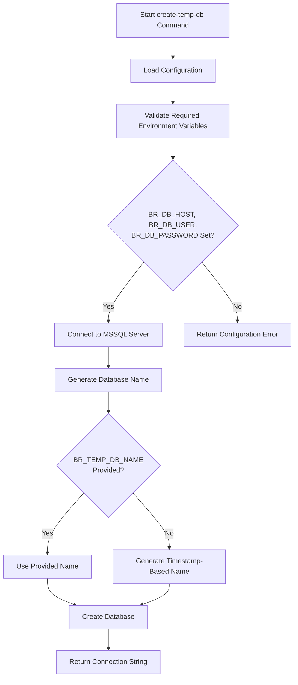
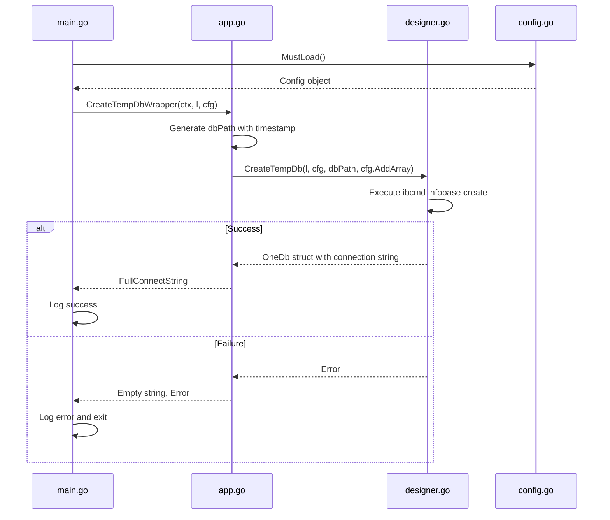
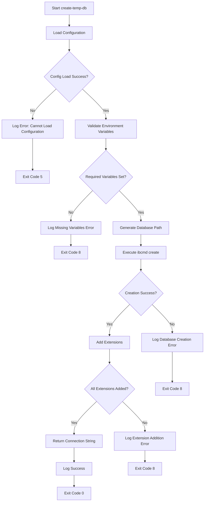

# create-temp-db Command

<cite>
**Referenced Files in This Document**   
- [main.go](file://cmd/benadis-runner/main.go)
- [app.go](file://internal/app/app.go)
- [config.go](file://internal/config/config.go)
- [constants.go](file://internal/constants/constants.go)
- [designer.go](file://internal/entity/one/designer/designer.go)
- [dbrestore.go](file://internal/entity/dbrestore/dbrestore.go)
</cite>

## Table of Contents
1. [Introduction](#introduction)
2. [Command Purpose and Use Cases](#command-purpose-and-use-cases)
3. [Environment Variables and Configuration](#environment-variables-and-configuration)
4. [Implementation Flow](#implementation-flow)
5. [Success and Error Paths](#success-and-error-paths)
6. [Integration with Internal Components](#integration-with-internal-components)
7. [Common Use Cases in CI/CD Pipelines](#common-use-cases-in-cicd-pipelines)
8. [Potential Issues and Best Practices](#potential-issues-and-best-practices)
9. [Conclusion](#conclusion)

## Introduction
The `create-temp-db` command (ActCreateTempDb) in benadis-runner is designed to facilitate testing and development workflows by creating temporary Microsoft SQL Server (MSSQL) databases. This functionality enables developers and automated systems to work with isolated database instances for various purposes such as integration testing, feature development, and quality assurance processes. The command integrates with the application's configuration system and leverages internal components to manage database creation and connection parameters.

**Section sources**
- [main.go](file://cmd/benadis-runner/main.go#L1-L252)
- [constants.go](file://internal/constants/constants.go#L1-L219)

## Command Purpose and Use Cases
The primary purpose of the `create-temp-db` command is to create temporary MSSQL databases for testing and development workflows. This functionality supports several key use cases:

- **Testing Environments**: Creating isolated database instances for running automated tests without affecting production or shared development databases.
- **Development Workflows**: Providing developers with temporary databases to experiment with schema changes, data migrations, or new features.
- **CI/CD Integration**: Supporting continuous integration and deployment pipelines by creating ephemeral databases for build verification and quality checks.
- **Database Restoration Testing**: Facilitating the testing of database restoration procedures from backup files in isolated environments.

The command operates by leveraging configuration parameters and environment variables to establish connections to the database server and create new database instances with specified characteristics.

**Section sources**
- [main.go](file://cmd/benadis-runner/main.go#L150-L154)
- [app.go](file://internal/app/app.go#L879-L897)

## Environment Variables and Configuration
The `create-temp-db` command relies on several environment variables and configuration parameters to function properly. These variables provide the necessary connection details and optional settings for database creation.

### Required Environment Variables
The following environment variables are required for the command to operate:

- **BR_DB_HOST**: Specifies the hostname or IP address of the MSSQL server where the temporary database will be created.
- **BR_DB_USER**: Provides the username for authenticating with the MSSQL server.
- **BR_DB_PASSWORD**: Contains the password for the specified database user account.

These variables ensure that the command can establish a secure connection to the database server with appropriate credentials.

### Optional Parameters
The command also supports optional parameters that modify its behavior:

- **BR_TEMP_DB_NAME**: Allows specifying a custom name for the temporary database. When not provided, the system generates a unique name based on timestamps to prevent naming conflicts.
- **MSSQL_PASSWORD**: Alternative environment variable for specifying the MSSQL password, which can be used when integrating with systems that standardize on this variable name.

Configuration is managed through the application's configuration system, which loads settings from YAML files and environment variables. The Config structure in `internal/config/config.go` defines the schema for these configurations, including default values and validation rules.

**Diagram sources**
- [config.go](file://internal/config/config.go#L1-L1445)
- [constants.go](file://internal/constants/constants.go#L1-L219)

**Section sources**
- [config.go](file://internal/config/config.go#L1-L1445)
- [constants.go](file://internal/constants/constants.go#L1-L219)

## Implementation Flow
The implementation flow of the `create-temp-db` command follows a structured sequence from command invocation in main.go to execution logic in app.go. This flow ensures proper configuration loading, error handling, and resource management.

### Command Routing in main.go
The command routing begins in the main.go file, where the application entry point processes the command-line arguments and environment variables. When the `BR_COMMAND` environment variable is set to "create-temp-db" (defined as `ActCreateTempDb` constant), the main function routes execution to the `CreateTempDbWrapper` function in the app package.

The routing mechanism uses a switch statement to handle different commands, with each case corresponding to a specific action. For the `create-temp-db` command, the code captures the result (connection string) and potential errors from the wrapper function, logging appropriate messages based on the outcome.

### Execution Logic in app.go
The execution logic is implemented in the `CreateTempDbWrapper` function within app.go. This wrapper function serves as an integration point between the command router and the underlying database creation functionality.

The wrapper performs the following steps:
1. Logs debug information about the start of database creation
2. Generates a unique path for the temporary database using the current timestamp
3. Calls the `designer.CreateTempDb` function with the logger, configuration, database path, and array of extensions
4. Handles any errors returned from the database creation process
5. Returns the full connection string for the created database

The actual database creation is delegated to the `CreateTempDb` function in the designer package, which uses the 1C:Enterprise command-line tools to create the database instance. This separation of concerns allows the wrapper to focus on integration aspects while the core creation logic remains encapsulated in the designer package.

**Diagram sources**
- [main.go](file://cmd/benadis-runner/main.go#L1-L252)
- [app.go](file://internal/app/app.go#L879-L897)
- [designer.go](file://internal/entity/one/designer/designer.go#L376-L409)

**Section sources**
- [main.go](file://cmd/benadis-runner/main.go#L1-L252)
- [app.go](file://internal/app/app.go#L879-L897)

## Success and Error Paths
The `create-temp-db` command implements comprehensive error handling to manage various failure scenarios while ensuring successful execution when conditions are met.

### Success Path
When the command executes successfully, the following sequence occurs:
1. Configuration is loaded from environment variables and configuration files
2. Required environment variables (BR_DB_HOST, BR_DB_USER, BR_DB_PASSWORD) are validated
3. A unique database path is generated using the current timestamp
4. The `ibcmd` utility is invoked to create the database with the specified path
5. Extensions specified in `cfg.AddArray` are added to the database
6. The connection string is constructed and returned to the caller
7. Success is logged at the INFO level with the connection string

The success path results in a fully functional temporary database that can be used for testing or development purposes.

### Error Paths
The command handles several potential error scenarios:

#### Configuration Loading Errors
If the configuration cannot be loaded (e.g., missing required environment variables), the application exits with code 5. The error message indicates the failure to load the application configuration.

#### Database Creation Failures
When the database creation fails, the error is captured and logged with detailed information:
- The specific error from the `ibcmd` execution
- The database path that was attempted
- Contextual information about the failure

The application exits with code 8, indicating a processing error during database creation.

#### Connection Issues
Connection problems to the MSSQL server are handled by the underlying database driver. These may include:
- Network connectivity issues to the database host
- Authentication failures due to incorrect credentials
- Timeout errors during connection establishment

These errors are propagated up through the call stack and result in appropriate error logging and application termination.

#### Permission Errors
Insufficient permissions to create databases on the MSSQL server result in specific error messages from the database engine. The command captures these errors and logs them with sufficient detail to diagnose the permission issue.

#### Disk Space Constraints
If the server runs out of disk space during database creation, the `ibcmd` utility returns an error that is captured and reported by the command. This scenario typically occurs when the temporary directory has insufficient space for the database files.

**Diagram sources**
- [app.go](file://internal/app/app.go#L879-L897)
- [designer.go](file://internal/entity/one/designer/designer.go#L376-L409)

**Section sources**
- [app.go](file://internal/app/app.go#L879-L897)
- [designer.go](file://internal/entity/one/designer/designer.go#L376-L409)

## Integration with Internal Components
The `create-temp-db` command integrates with several internal components of the benadis-runner application, leveraging their functionality to accomplish its purpose.

### Integration with internal/dbrestore
The command shares infrastructure with the `internal/dbrestore` package, which is responsible for database restoration operations. Both components use similar configuration patterns and authentication mechanisms for connecting to MSSQL servers.

The `DBRestoreConfig` structure in `internal/config/config.go` defines configuration parameters that are relevant to both database creation and restoration, including:
- Server connection details
- Authentication credentials
- Timeout settings
- Automatic timeout calculation

This shared