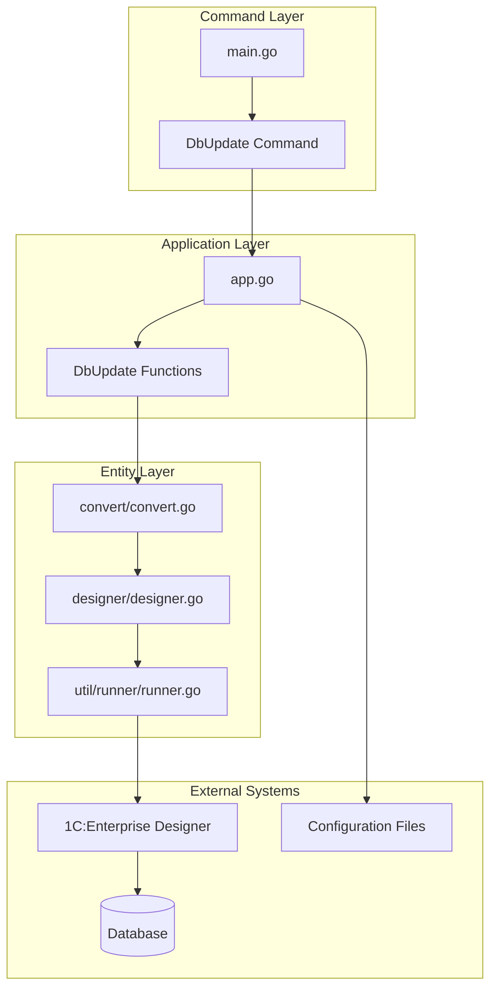
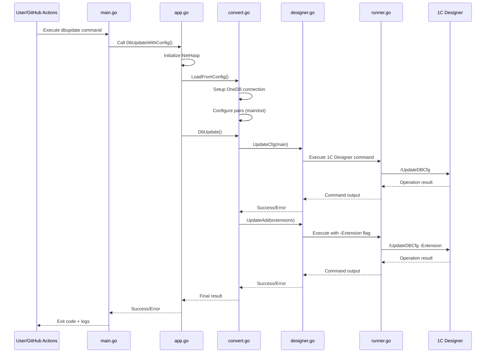
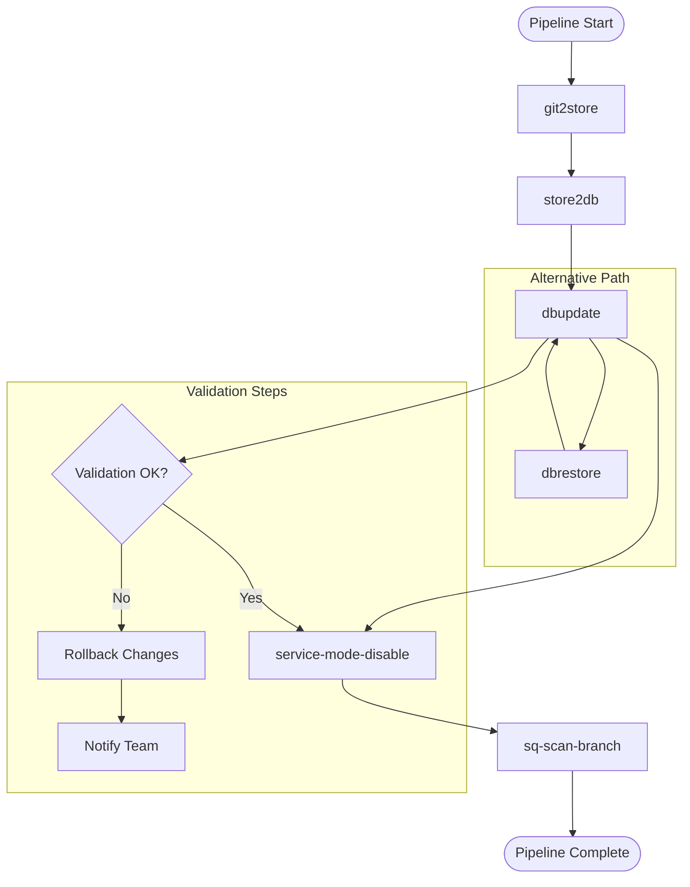
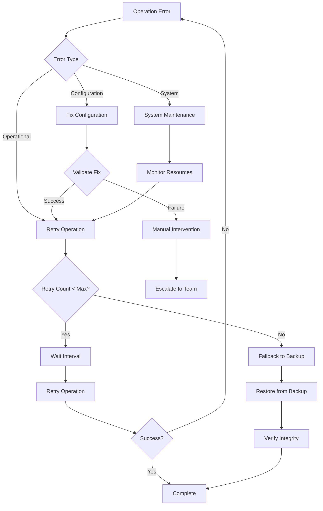

# dbupdate Command Documentation

<cite>
**Referenced Files in This Document**
- [cmd/apk-ci/main.go](file://cmd/apk-ci/main.go)
- [internal/app/app.go](file://internal/app/app.go)
- [internal/entity/one/convert/convert.go](file://internal/entity/one/convert/convert.go)
- [internal/entity/one/designer/designer.go](file://internal/entity/one/designer/designer.go)
- [internal/util/runner/runner.go](file://internal/util/runner/runner.go)
- [internal/entity/dbrestore/dbrestore.go](file://internal/entity/dbrestore/dbrestore.go)
- [internal/config/config.go](file://internal/config/config.go)
- [internal/constants/constants.go](file://internal/constants/constants.go)
- [config/action.yaml](file://config/action.yaml)
- [README.md](file://README.md)
</cite>

## Table of Contents
1. [Introduction](#introduction)
2. [Command Overview](#command-overview)
3. [Architecture and Components](#architecture-and-components)
4. [Execution Flow](#execution-flow)
5. [Configuration Requirements](#configuration-requirements)
6. [Integration with Other Commands](#integration-with-other-commands)
7. [Error Handling and Recovery](#error-handling-and-recovery)
8. [Performance Considerations](#performance-considerations)
9. [Troubleshooting Guide](#troubleshooting-guide)
10. [Best Practices](#best-practices)

## Introduction

The `dbupdate` command (ActDbupdate) is a critical component of the apk-ci suite designed specifically for updating database schemas in 1C:Enterprise applications after configuration changes. This command ensures that the database structure remains synchronized with the latest configuration changes, maintaining data integrity and application functionality.

The dbupdate command serves as a bridge between the configuration management system and the database infrastructure, automatically applying schema modifications required by new or updated configurations. It integrates seamlessly with the broader GitOps pipeline, enabling automated deployment workflows that maintain consistency across development, testing, and production environments.

## Command Overview

The dbupdate command performs the following primary functions:

- **Schema Synchronization**: Updates database schemas to match current configuration requirements
- **Extension Management**: Handles updates for both main configuration and extensions
- **Transaction Safety**: Ensures atomic operations with rollback capabilities
- **Backup Integration**: Supports automatic backup creation before updates
- **Multi-environment Support**: Works across development, testing, and production environments

### Command Syntax

```bash
# Basic usage
apk-ci dbupdate

# With specific configuration
apk-ci dbupdate --config config.yaml

# GitHub Actions integration
gha:
  command: dbupdate
  configSystem: app.yaml
  configProject: project.yaml
  configSecret: secret.yaml
  configDbData: dbconfig.yaml
```

**Section sources**
- [cmd/apk-ci/main.go](file://cmd/apk-ci/main.go#L121-L125)
- [config/action.yaml](file://config/action.yaml#L1-L50)

## Architecture and Components

The dbupdate command follows a layered architecture that separates concerns and enables maintainable, testable code. The system consists of several interconnected components working together to provide robust database update functionality.



**Diagram sources**
- [cmd/apk-ci/main.go](file://cmd/apk-ci/main.go#L121-L125)
- [internal/app/app.go](file://internal/app/app.go#L608-L646)
- [internal/entity/one/convert/convert.go](file://internal/entity/one/convert/convert.go#L1-L50)

### Core Components

#### 1. Command Dispatcher (main.go)
The main entry point handles command routing and error management. It validates configuration and delegates execution to appropriate handlers.

#### 2. Application Logic (app.go)
Contains the core business logic for database updates, including configuration loading and error handling.

#### 3. Conversion Engine (convert.go)
Manages the conversion process between configuration files and database schemas, handling both main configurations and extensions.

#### 4. Designer Interface (designer.go)
Provides the interface to 1C:Enterprise Designer for executing database update operations.

#### 5. Command Runner (runner.go)
Executes external commands with proper parameter handling and output capture.

**Section sources**
- [cmd/apk-ci/main.go](file://cmd/apk-ci/main.go#L121-L125)
- [internal/app/app.go](file://internal/app/app.go#L608-L678)
- [internal/entity/one/convert/convert.go](file://internal/entity/one/convert/convert.go#L1-L100)

## Execution Flow

The dbupdate command follows a structured execution flow that ensures reliability and consistency across all environments.



**Diagram sources**
- [cmd/apk-ci/main.go](file://cmd/apk-ci/main.go#L121-L125)
- [internal/app/app.go](file://internal/app/app.go#L648-L678)
- [internal/entity/one/convert/convert.go](file://internal/entity/one/convert/convert.go#L504-L535)
- [internal/entity/one/designer/designer.go](file://internal/entity/one/designer/designer.go#L212-L280)

### Step-by-Step Execution

1. **Command Initialization**
   - Parse command-line arguments and environment variables
   - Load configuration files (app.yaml, project.yaml, secret.yaml, dbconfig.yaml)
   - Initialize logging and error handling

2. **Configuration Loading**
   - Establish database connection parameters
   - Configure source-target pairs for main configuration and extensions
   - Validate connectivity and permissions

3. **First Update Pass**
   - Execute `/UpdateDBCfg` for main configuration
   - Apply schema changes to base database structure
   - Log operation results and handle errors

4. **Extension Update Pass**
   - Execute `/UpdateDBCfg -Extension` for each extension
   - Apply modifications to extension-specific tables and metadata
   - Maintain transaction integrity across all updates

5. **Finalization**
   - Clean up temporary resources
   - Generate completion reports
   - Return appropriate exit codes

**Section sources**
- [internal/app/app.go](file://internal/app/app.go#L648-L678)
- [internal/entity/one/convert/convert.go](file://internal/entity/one/convert/convert.go#L504-L535)

## Configuration Requirements

The dbupdate command requires comprehensive configuration to operate effectively across different environments and database systems.

### Required Configuration Elements

#### 1. Database Connection Configuration
```yaml
# dbconfig.yaml
databases:
  test-db:
    one-server: tcp://1c-server:1542
    prod: false
    dbserver: mssql-server
  prod-db:
    one-server: tcp://prod-1c-server:1542
    prod: true
    dbserver: prod-mssql
```

#### 2. Application Configuration
```yaml
# app.yaml
workDir: /tmp/benadis-work
tmpDir: /tmp/benadis-tmp
timeout: 300
paths:
  bin1cv8: /opt/1c/v8.3/x86_64/1cv8
  binIbcmd: /opt/1c/v8.3/x86_64/ibcmd
users:
  db: gitops_user
  storeAdmin: admin
dbrestore:
  database: master
  autotimeout: true
```

#### 3. Project Configuration
```yaml
# project.yaml
store-db: central-store
prod:
  test-db:
    dbName: test-infobase
    add-disable:
      - extension1
      - extension2
```

#### 4. Environment Variables
```bash
# Required environment variables
BR_COMMAND=dbupdate
BR_INFOBASE_NAME=test-infobase
BR_CONFIG_SYSTEM=config/app.yaml
BR_CONFIG_PROJECT=config/project.yaml
BR_CONFIG_SECRET=config/secret.yaml
BR_CONFIG_DBDATA=config/dbconfig.yaml
```

### Parameter Validation

The system performs comprehensive validation of all configuration parameters:

- **Database Connectivity**: Tests connection strings and credentials
- **File Paths**: Validates existence and accessibility of configuration files
- **Permissions**: Verifies user permissions for database operations
- **Resource Availability**: Checks disk space and temporary directory access

**Section sources**
- [internal/config/config.go](file://internal/config/config.go#L1-L100)
- [internal/entity/one/convert/convert.go](file://internal/entity/one/convert/convert.go#L60-L120)

## Integration with Other Commands

The dbupdate command is designed to integrate seamlessly with other apk-ci commands in typical deployment pipelines.



**Diagram sources**
- [cmd/apk-ci/main.go](file://cmd/apk-ci/main.go#L1-L100)

### Typical Deployment Pipeline

1. **Configuration Management**
   ```bash
   # Step 1: Sync configuration from Git to store
   apk-ci git2store
   
   # Step 2: Load configuration into database
   apk-ci store2db
   ```

2. **Database Schema Update**
   ```bash
   # Step 3: Update database schema
   apk-ci dbupdate
   ```

3. **Post-Update Operations**
   ```bash
   # Step 4: Disable service mode
   apk-ci service-mode-disable
   
   # Step 5: Perform quality checks
   apk-ci sq-scan-branch
   ```

### Command Dependencies

The dbupdate command has specific dependencies on other commands:

- **Pre-requisites**: store2db must be executed first to ensure configuration availability
- **Successor commands**: service-mode-disable and sq-scan-branch typically follow dbupdate
- **Alternative paths**: dbrestore can be used for emergency rollbacks

**Section sources**
- [cmd/apk-ci/main.go](file://cmd/apk-ci/main.go#L1-L100)

## Error Handling and Recovery

The dbupdate command implements comprehensive error handling and recovery mechanisms to ensure system stability and data integrity.

### Error Categories

#### 1. Configuration Errors
- Invalid database connection strings
- Missing or inaccessible configuration files
- Insufficient user permissions

#### 2. Operational Errors
- Timeout during database operations
- Constraint violations in schema updates
- Network connectivity issues

#### 3. System Errors
- Insufficient disk space
- Resource exhaustion
- External service unavailability

### Recovery Mechanisms



**Diagram sources**
- [internal/app/app.go](file://internal/app/app.go#L648-L678)
- [internal/entity/one/designer/designer.go](file://internal/entity/one/designer/designer.go#L212-L280)

### Transaction Safety

The dbupdate command ensures transaction safety through:

- **Atomic Operations**: All schema changes are performed atomically
- **Rollback Capability**: Automatic rollback on failure conditions
- **State Preservation**: Maintains database state consistency
- **Checkpoint Creation**: Creates checkpoints before major operations

### Logging and Monitoring

Comprehensive logging captures all operations:

- **Operation Details**: Full command parameters and execution context
- **Error Information**: Detailed error messages and stack traces
- **Performance Metrics**: Execution times and resource utilization
- **Audit Trail**: Complete audit trail for compliance and debugging

**Section sources**
- [internal/app/app.go](file://internal/app/app.go#L648-L678)
- [internal/entity/one/designer/designer.go](file://internal/entity/one/designer/designer.go#L212-L280)

## Performance Considerations

The dbupdate command is designed to handle various performance scenarios while maintaining system responsiveness and data integrity.

### Performance Factors

#### 1. Database Size Impact
- **Small Databases (< 1GB)**: Updates typically complete within minutes
- **Medium Databases (1-10GB)**: Updates may take 10-30 minutes
- **Large Databases (> 10GB)**: Updates require careful planning and monitoring

#### 2. Network Latency Effects
- **Local Networks**: Minimal impact on update duration
- **Remote Connections**: Significant impact on overall execution time
- **Bandwidth Constraints**: Can limit concurrent operations

#### 3. System Resource Utilization
- **CPU Usage**: Moderate during schema analysis and application
- **Memory Consumption**: Peak during large table modifications
- **Disk I/O**: Heaviest during index rebuilds and constraint validations

### Optimization Strategies

#### 1. Batch Processing
```go
// Process main configuration first, then extensions
for _, cp := range cc.Pair {
    if !cp.Source.Main {
        continue
    }
    err = cc.OneDB.UpdateCfg(ctx, l, cfg, cc.OneDB.FullConnectString)
    if err != nil {
        return err
    }
}

for _, cp := range cc.Pair {
    if cp.Source.Main {
        continue
    }
    err = cc.OneDB.UpdateAdd(ctx, l, cfg, cc.OneDB.FullConnectString, cp.Source.Name)
    if err != nil {
        return err
    }
}
```

#### 2. Parallel Execution
- **Independent Operations**: Extensions can be processed concurrently
- **Resource Pooling**: Shared connections for multiple small updates
- **Load Balancing**: Distribute operations across available resources

#### 3. Caching Strategies
- **Connection Pooling**: Reuse database connections
- **Configuration Caching**: Cache parsed configuration data
- **Metadata Caching**: Store schema information to avoid repeated queries

### Performance Monitoring

Key metrics to monitor:

- **Update Duration**: Total time for schema modifications
- **Resource Utilization**: CPU, memory, and disk usage during operations
- **Error Rates**: Frequency and types of failures encountered
- **Throughput**: Number of operations completed per time unit

**Section sources**
- [internal/entity/one/convert/convert.go](file://internal/entity/one/convert/convert.go#L504-L535)
- [internal/util/runner/runner.go](file://internal/util/runner/runner.go#L1-L100)

## Troubleshooting Guide

This section provides comprehensive guidance for diagnosing and resolving common issues encountered with the dbupdate command.

### Common Failure Scenarios

#### 1. Connection Issues

**Symptoms:**
- Authentication failures
- Network timeouts
- Connection refused errors

**Diagnosis Steps:**
```bash
# Test database connectivity
telnet 1c-server 1542

# Verify connection string format
echo $BR_INFOBASE_NAME

# Check network connectivity
ping 1c-server
```

**Resolution:**
- Verify database server availability
- Check firewall and network configurations
- Validate authentication credentials
- Review connection string syntax

#### 2. Permission Problems

**Symptoms:**
- Access denied errors
- Insufficient privileges messages
- Role-based access restrictions

**Diagnosis:**
```bash
# Check user permissions
SELECT * FROM sys.database_permissions WHERE grantee_principal_id = USER_ID('gitops_user');

# Verify role assignments
SELECT * FROM sys.database_role_members;
```

**Resolution:**
- Grant necessary database permissions
- Add user to appropriate database roles
- Verify schema ownership rights

#### 3. Constraint Violations

**Symptoms:**
- Foreign key constraint errors
- Unique constraint violations
- Data type mismatch errors

**Diagnosis:**
```sql
-- Check existing constraints
SELECT * FROM INFORMATION_SCHEMA.TABLE_CONSTRAINTS;

-- Examine constraint details
SELECT * FROM INFORMATION_SCHEMA.CONSTRAINT_COLUMN_USAGE;
```

**Resolution:**
- Identify conflicting data entries
- Modify data to satisfy constraints
- Temporarily disable problematic constraints (with caution)
- Update application logic to prevent future violations

#### 4. Timeout Errors

**Symptoms:**
- Operation timeout messages
- Hanging processes
- Resource exhaustion warnings

**Diagnosis:**
```bash
# Monitor system resources
top -p $(pgrep apk-ci)

# Check database locks
SELECT * FROM sys.dm_tran_locks;

# Review query execution plans
SET SHOWPLAN_ALL ON;
```

**Resolution:**
- Increase timeout values in configuration
- Optimize database queries
- Release blocking transactions
- Scale system resources

### Diagnostic Tools

#### 1. Log Analysis
```bash
# Enable debug logging
export LOG_LEVEL=debug

# Filter relevant log entries
grep -i "dbupdate\|update\|schema" /var/log/apk-ci.log
```

#### 2. Database Monitoring
```sql
-- Monitor long-running queries
SELECT 
    session_id,
    start_time,
    status,
    command,
    text
FROM sys.dm_exec_requests r
CROSS APPLY sys.dm_exec_sql_text(r.sql_handle);
```

#### 3. System Health Checks
```bash
# Check disk space
df -h /tmp

# Monitor memory usage
free -m

# Verify network connectivity
traceroute 1c-server
```

### Recovery Procedures

#### 1. Emergency Rollback
```bash
# Stop current operations
kill $(pgrep apk-ci)

# Restore from backup
apk-ci dbrestore --dbname $BR_INFOBASE_NAME

# Restart with minimal configuration
apk-ci dbupdate --minimal-config
```

#### 2. Incremental Recovery
```bash
# Identify failed operation
grep -A 5 -B 5 "ERROR" /var/log/apk-ci.log

# Apply partial updates
apk-ci dbupdate --skip-failed

# Resume normal operations
apk-ci service-mode-disable
```

**Section sources**
- [internal/app/app.go](file://internal/app/app.go#L648-L678)
- [internal/entity/one/designer/designer.go](file://internal/entity/one/designer/designer.go#L212-L280)

## Best Practices

Following these best practices ensures optimal performance, reliability, and maintainability when using the dbupdate command.

### Pre-Update Preparation

#### 1. Environment Validation
- **Production Readiness**: Verify all pre-production environments are updated
- **Backup Verification**: Ensure recent backups are available and accessible
- **Resource Assessment**: Confirm adequate system resources for update operations

#### 2. Configuration Management
- **Version Control**: Maintain configuration files in version control systems
- **Environment Separation**: Use separate configurations for different environments
- **Change Tracking**: Document all configuration changes and their impacts

#### 3. Testing Procedures
- **Staging Validation**: Test updates in staging environments first
- **Automated Testing**: Implement automated tests for schema changes
- **Performance Baselines**: Establish performance benchmarks before updates

### Operational Guidelines

#### 1. Update Scheduling
- **Maintenance Windows**: Schedule updates during planned maintenance periods
- **Resource Planning**: Allocate sufficient system resources for update operations
- **Monitoring Setup**: Implement comprehensive monitoring during updates

#### 2. Security Considerations
- **Access Control**: Restrict update permissions to authorized personnel
- **Audit Trails**: Maintain detailed audit logs for all operations
- **Encryption**: Ensure sensitive data is encrypted during transmission

#### 3. Monitoring and Alerting
- **Real-time Monitoring**: Implement real-time monitoring of update operations
- **Alert Configuration**: Set up alerts for critical failure conditions
- **Performance Tracking**: Monitor performance metrics and trends

### Post-Update Activities

#### 1. Verification Procedures
- **Functional Testing**: Verify application functionality after updates
- **Data Integrity Checks**: Validate data consistency and integrity
- **Performance Validation**: Confirm performance meets expectations

#### 2. Documentation Updates
- **Change Logs**: Document all changes made during updates
- **Configuration Records**: Update configuration documentation
- **Incident Reports**: Record and analyze any issues encountered

#### 3. Continuous Improvement
- **Feedback Loops**: Gather feedback from operations teams
- **Process Refinement**: Continuously improve update procedures
- **Knowledge Sharing**: Share lessons learned with team members

### Automation Recommendations

#### 1. CI/CD Integration
```yaml
# Example GitHub Actions workflow
name: Database Update Pipeline
on:
  push:
    branches: [main]
jobs:
  db-update:
    runs-on: ubuntu-latest
    steps:
      - name: Checkout code
        uses: actions/checkout@v3
        
      - name: Run dbupdate
        uses: ./
        with:
          command: dbupdate
          configSystem: config/app.yaml
          configProject: config/project.yaml
```

#### 2. Monitoring Automation
```bash
#!/bin/bash
# Automated health check script
apk-ci dbupdate --health-check
if [ $? -ne 0 ]; then
    echo "Health check failed, initiating rollback"
    apk-ci dbrestore --latest-backup
fi
```

#### 3. Notification Systems
```bash
# Email notification on update completion
apk-ci dbupdate
if [ $? -eq 0 ]; then
    echo "Update completed successfully" | mail -s "DB Update Success" team@example.com
else
    echo "Update failed" | mail -s "DB Update Failed" team@example.com
fi
```

These best practices help ensure successful database update operations while minimizing risks and maintaining system reliability.