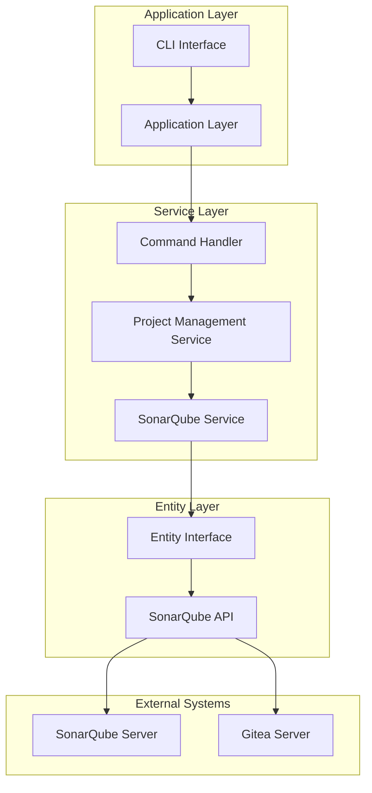
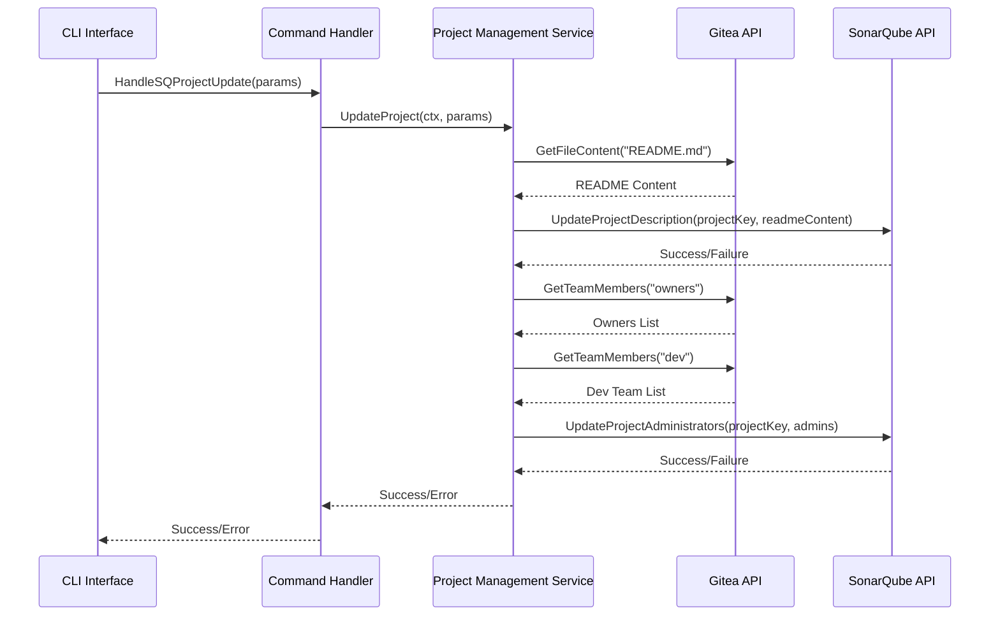
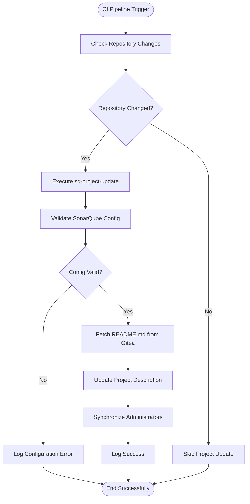
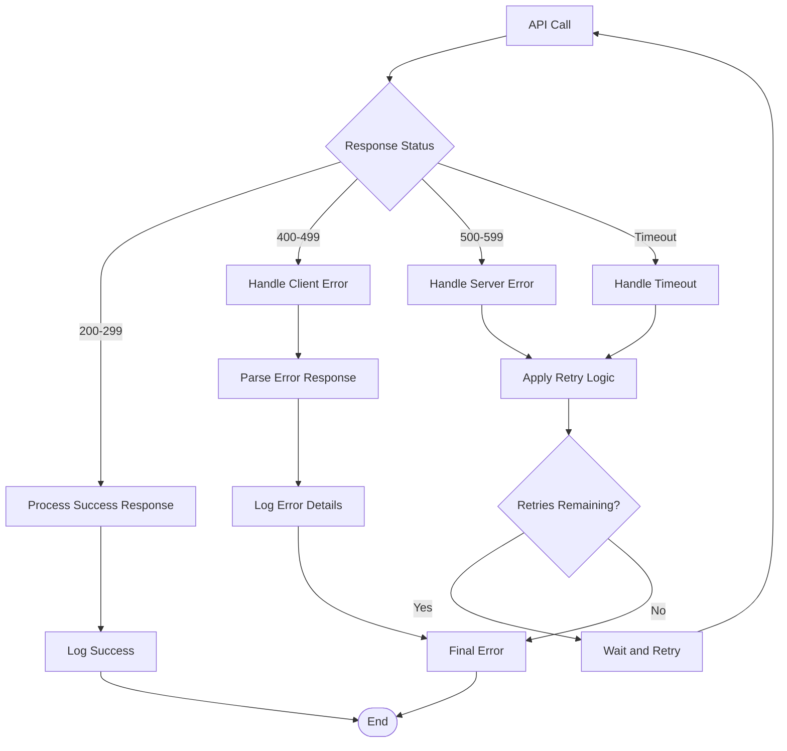

# sq-project-update Command Documentation

<cite>
**Referenced Files in This Document**
- [main.go](file://cmd/benadis-runner/main.go)
- [app.go](file://internal/app/app.go)
- [command_handler.go](file://internal/service/sonarqube/command_handler.go)
- [project.go](file://internal/service/sonarqube/project.go)
- [service.go](file://internal/service/sonarqube/service.go)
- [sonarqube.go](file://internal/entity/sonarqube/sonarqube.go)
- [interfaces.go](file://internal/entity/sonarqube/interfaces.go)
- [constants.go](file://internal/constants/constants.go)
- [sonarqube.go](file://internal/config/sonarqube.go)
- [action.yaml](file://config/action.yaml)
</cite>

## Table of Contents
1. [Introduction](#introduction)
2. [Command Overview](#command-overview)
3. [Required Configuration](#required-configuration)
4. [Implementation Architecture](#implementation-architecture)
5. [Core Components](#core-components)
6. [Integration Workflow](#integration-workflow)
7. [Error Handling](#error-handling)
8. [Rate Limiting and Authentication](#rate-limiting-and-authentication)
9. [Troubleshooting Guide](#troubleshooting-guide)
10. [Best Practices](#best-practices)

## Introduction

The `sq-project-update` command (ActSQProjectUpdate) is a critical component of the benadis-runner system that manages SonarQube project metadata synchronization. This command ensures that SonarQube project information remains aligned with the source repository by updating project descriptions and administrators based on the latest repository data from Gitea.

The command plays a vital role in maintaining consistency between development environments and code quality monitoring systems, particularly in CI/CD workflows where automated project maintenance is essential.

## Command Overview

The `sq-project-update` command performs the following key operations:

1. **Project Description Updates**: Retrieves README.md content from the Gitea repository and updates the SonarQube project description
2. **Administrator Synchronization**: Synchronizes project administrators with Gitea team memberships (owners and developers)
3. **Metadata Refresh**: Ensures all project metadata stays current with repository changes

### Command Syntax

```bash
./benadis-runner sq-project-update --owner <owner> --repo <repo>
```

Where:
- `--owner`: Repository owner (organization or user)
- `--repo`: Repository name

**Section sources**
- [main.go](file://cmd/benadis-runner/main.go#L218-L221)
- [constants.go](file://internal/constants/constants.go#L78-L79)

## Required Configuration

### Environment Variables

The command requires several environment variables to function properly:

```bash
# SonarQube Server Configuration
export SONARQUBE_URL="https://sonarqube.example.com"
export SONARQUBE_TOKEN="your-auth-token-here"
export SONARQUBE_TIMEOUT="30s"
export SONARQUBE_RETRY_ATTEMPTS="3"
export SONARQUBE_RETRY_DELAY="5s"
export SONARQUBE_PROJECT_PREFIX="benadis"
export SONARQUBE_DEFAULT_VISIBILITY="private"
export SONARQUBE_QUALITY_GATE_TIMEOUT="300s"
export SONARQUBE_DISABLE_BRANCH_ANALYSIS="true"

# Gitea Integration
export GITEA_URL="https://gitea.example.com"
export ACCESS_TOKEN="gitea-access-token"
```

### Configuration Parameters

The command uses the following configuration parameters:

| Parameter | Type | Description | Default |
|-----------|------|-------------|---------|
| `SONARQUBE_URL` | String | SonarQube server URL | `http://localhost:9000` |
| `SONARQUBE_TOKEN` | String | API authentication token | Required |
| `SONARQUBE_TIMEOUT` | Duration | Request timeout | `30s` |
| `PROJECT_PREFIX` | String | Project key prefix | `benadis` |
| `DEFAULT_VISIBILITY` | String | Project visibility | `private` |

**Section sources**
- [sonarqube.go](file://internal/config/sonarqube.go#L15-L40)

## Implementation Architecture

The `sq-project-update` command follows a layered architecture pattern with clear separation of concerns:



**Diagram sources**
- [command_handler.go](file://internal/service/sonarqube/command_handler.go#L176-L244)
- [project.go](file://internal/service/sonarqube/project.go#L20-L50)

### Component Responsibilities

1. **CLI Interface**: Handles command-line argument parsing and user input validation
2. **Application Layer**: Orchestrates the overall workflow and coordinates between components
3. **Command Handler**: Delegates specific operations to specialized services
4. **Project Management Service**: Implements business logic for project operations
5. **SonarQube Service**: Provides high-level API operations for SonarQube integration
6. **Entity Layer**: Manages low-level HTTP communications and API interactions

**Section sources**
- [command_handler.go](file://internal/service/sonarqube/command_handler.go#L176-L244)
- [project.go](file://internal/service/sonarqube/project.go#L20-L50)

## Core Components

### Command Handler Implementation

The command handler delegates the actual project update logic to the ProjectManagementService:

```go
func (h *SQCommandHandler) HandleSQProjectUpdate(ctx context.Context, params *sonarqube.ProjectUpdateParams) error {
    h.logger.Debug("Handling sq-project-update command", "owner", params.Owner, "repo", params.Repo)
    
    // Delegate to ProjectManagementService for actual project update logic
    if err := h.projectManagementService.UpdateProject(ctx, params); err != nil {
        h.logger.Error("Failed to update project", "owner", params.Owner, "repo", params.Repo, "error", err)
        return fmt.Errorf("failed to update project %s/%s: %w", params.Owner, params.Repo, err)
    }
    
    h.logger.Debug("sq-project-update command handled successfully")
    return nil
}
```

### Project Management Service

The ProjectManagementService implements the core business logic:



**Diagram sources**
- [project.go](file://internal/service/sonarqube/project.go#L60-L90)
- [command_handler.go](file://internal/service/sonarqube/command_handler.go#L213-L244)

### Service Layer Implementation

The SonarQube service provides high-level operations:

```go
func (s *Service) UpdateProjectDescription(_ context.Context, projectKey, description string) error {
    s.logger.Debug("Updating SonarQube project description", "projectKey", projectKey)
    
    // Validate input parameters
    if projectKey == "" {
        return &sonarqube.ValidationError{
            Field:   "projectKey",
            Message: "Project key must be provided",
        }
    }
    
    // Prepare project updates
    updates := &sonarqube.ProjectUpdate{
        Description: description,
    }
    
    // Update project using entity
    if err := s.entity.UpdateProject(projectKey, updates); err != nil {
        s.logger.Error("Failed to update SonarQube project description", "error", err)
        return fmt.Errorf("failed to update project description: %w", err)
    }
    
    s.logger.Debug("SonarQube project description updated successfully", "projectKey", projectKey)
    return nil
}
```

**Section sources**
- [service.go](file://internal/service/sonarqube/service.go#L30-L60)
- [project.go](file://internal/service/sonarqube/project.go#L60-L90)

## Integration Workflow

### CI/CD Integration

The `sq-project-update` command is designed to integrate seamlessly with CI/CD pipelines:



**Diagram sources**
- [project.go](file://internal/service/sonarqube/project.go#L60-L90)
- [app.go](file://internal/app/app.go#L123-L156)

### Example CI/CD Integration

```yaml
# GitHub Actions Example
name: SonarQube Project Update
on:
  push:
    branches: [main]
  pull_request:
    types: [opened, synchronize]

jobs:
  update-sonarqube:
    runs-on: ubuntu-latest
    steps:
      - name: Checkout Repository
        uses: actions/checkout@v3
        
      - name: Setup Environment
        env:
          SONARQUBE_URL: ${{ secrets.SONARQUBE_URL }}
          SONARQUBE_TOKEN: ${{ secrets.SONARQUBE_TOKEN }}
          GITEA_URL: ${{ secrets.GITEA_URL }}
          ACCESS_TOKEN: ${{ secrets.ACCESS_TOKEN }}
          
      - name: Update SonarQube Project
        run: |
          ./benadis-runner sq-project-update \
            --owner "${{ github.repository_owner }}" \
            --repo "${{ github.event.repository.name }}"
```

**Section sources**
- [action.yaml](file://config/action.yaml#L1-L120)

## Error Handling

### Common Error Scenarios

The command implements comprehensive error handling for various failure scenarios:

1. **Authentication Errors**: Invalid or expired SonarQube tokens
2. **Network Connectivity**: Unable to reach SonarQube or Gitea servers
3. **Resource Not Found**: Projects or repositories that don't exist
4. **Permission Denied**: Insufficient privileges to update projects
5. **Validation Errors**: Invalid input parameters or configurations

### Error Response Examples

```go
// Example error handling in UpdateProject method
func (p *ProjectManagementService) UpdateProject(ctx context.Context, params *sonarqube.ProjectUpdateParams) error {
    // Get README.md content from Gitea
    readmeContent, err := p.giteaAPI.GetFileContent("README.md")
    if err != nil {
        p.logger.Warn("Failed to retrieve README.md from Gitea", "error", err)
        // Continue with empty content if README.md is not found
        readmeContent = []byte{}
    }
    
    // Update project description in SonarQube
    projectKey := fmt.Sprintf("%s_%s", params.Owner, params.Repo)
    if err := p.sonarQubeService.UpdateProjectDescription(ctx, projectKey, string(readmeContent)); err != nil {
        p.logger.Error("Failed to update project description in SonarQube", "error", err)
        return fmt.Errorf("failed to update project description: %w", err)
    }
    
    // Synchronize administrators with Gitea teams
    if err := p.syncAdministrators(ctx, params.Owner, params.Repo, projectKey); err != nil {
        p.logger.Error("Failed to synchronize administrators with Gitea teams", "error", err)
        return fmt.Errorf("failed to synchronize administrators: %w", err)
    }
    
    return nil
}
```

### Error Recovery Strategies

1. **Retry Mechanism**: Automatic retry for transient network failures
2. **Graceful Degradation**: Continue with partial updates if some operations fail
3. **Logging**: Comprehensive logging for debugging and monitoring
4. **Validation**: Early validation of input parameters to prevent runtime errors

**Section sources**
- [project.go](file://internal/service/sonarqube/project.go#L60-L90)
- [service.go](file://internal/service/sonarqube/service.go#L30-L60)

## Rate Limiting and Authentication

### Authentication Methods

The command supports multiple authentication methods:

1. **Bearer Token Authentication**: Uses the SONARQUBE_TOKEN environment variable
2. **API Key Validation**: Validates tokens against SonarQube's authentication endpoint
3. **Token Rotation**: Supports dynamic token updates for long-running processes

### Rate Limiting Considerations

```go
// Example rate limiting configuration
type SonarQubeConfig struct {
    URL                   string        `yaml:"url" env:"SONARQUBE_URL"`
    Token                 string        `yaml:"token" env:"SONARQUBE_TOKEN"`
    Timeout               time.Duration `yaml:"timeout" env:"SONARQUBE_TIMEOUT"`
    RetryAttempts         int           `yaml:"retryAttempts" env:"SONARQUBE_RETRY_ATTEMPTS"`
    RetryDelay            time.Duration `yaml:"retryDelay" env:"SONARQUBE_RETRY_DELAY"`
    // ... other fields
}
```

### Response Handling

The command implements robust response handling:



**Diagram sources**
- [sonarqube.go](file://internal/entity/sonarqube/sonarqube.go#L20-L80)

**Section sources**
- [sonarqube.go](file://internal/config/sonarqube.go#L15-L40)
- [sonarqube.go](file://internal/entity/sonarqube/sonarqube.go#L20-L80)

## Troubleshooting Guide

### Connectivity Issues

**Problem**: Cannot connect to SonarQube server
**Solution**:
1. Verify SONARQUBE_URL is correct
2. Check network connectivity to the server
3. Validate firewall settings
4. Test with curl or similar tools

```bash
# Test SonarQube connectivity
curl -u "$SONARQUBE_TOKEN:" "$SONARQUBE_URL/api/authentication/validate"
```

**Problem**: Authentication failures
**Solution**:
1. Verify SONARQUBE_TOKEN is valid
2. Check token permissions
3. Regenerate token if necessary
4. Ensure token hasn't expired

### Configuration Problems

**Problem**: Invalid configuration parameters
**Solution**:
1. Review environment variables
2. Validate configuration file syntax
3. Check for typos in parameter names
4. Use configuration validation tools

### Debugging Strategies

Enable verbose logging for detailed troubleshooting:

```bash
# Enable debug logging
export LOG_LEVEL=DEBUG
./benadis-runner sq-project-update --owner myorg --repo myrepo

# Enable structured logging
./benadis-runner sq-project-update --owner myorg --repo myrepo --log-format=json
```

### Common Error Messages

| Error Message | Cause | Solution |
|---------------|-------|----------|
| "Failed to update project description" | Network or permission issues | Check connectivity and permissions |
| "Failed to synchronize administrators" | Gitea API access issues | Verify Gitea token and permissions |
| "Invalid project key format" | Incorrect repository naming | Check repository naming conventions |
| "Token validation failed" | Expired or invalid token | Regenerate and update token |

**Section sources**
- [project.go](file://internal/service/sonarqube/project.go#L60-L90)
- [sonarqube.go](file://internal/entity/sonarqube/sonarqube.go#L20-L80)

## Best Practices

### Configuration Management

1. **Environment Separation**: Use different tokens for different environments
2. **Secure Storage**: Store sensitive credentials in secure vaults
3. **Regular Rotation**: Implement token rotation policies
4. **Monitoring**: Monitor API usage and rate limits

### Operational Guidelines

1. **Scheduled Updates**: Run updates during off-peak hours
2. **Batch Processing**: Group multiple updates when possible
3. **Health Checks**: Implement health checks for SonarQube connectivity
4. **Backup Strategies**: Maintain backups of project configurations

### Security Considerations

1. **Least Privilege**: Grant minimal necessary permissions
2. **Audit Logging**: Enable comprehensive audit logging
3. **Access Control**: Implement proper access controls
4. **Encryption**: Use HTTPS for all communications

### Performance Optimization

1. **Connection Pooling**: Reuse HTTP connections when possible
2. **Async Processing**: Use asynchronous operations where appropriate
3. **Caching**: Implement intelligent caching strategies
4. **Resource Limits**: Set appropriate timeouts and limits

The `sq-project-update` command provides a robust foundation for maintaining SonarQube project metadata consistency while offering flexibility for various deployment scenarios and integration requirements.