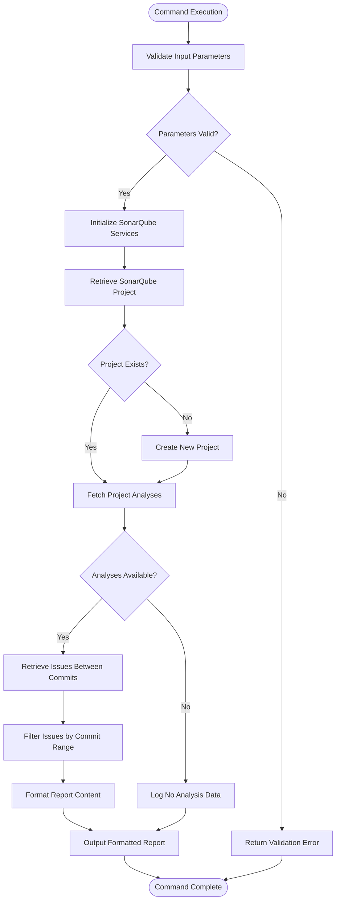
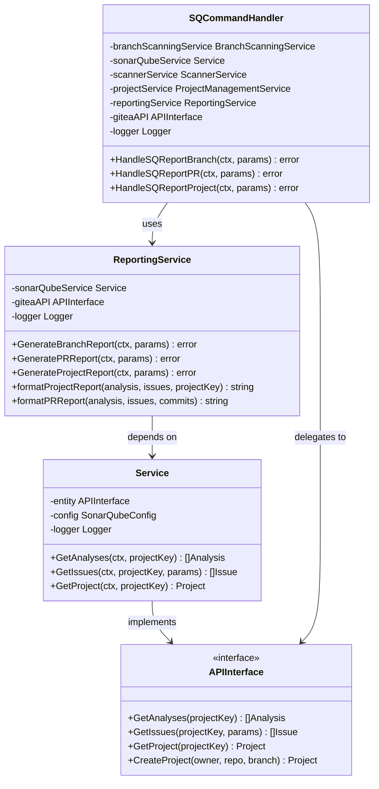
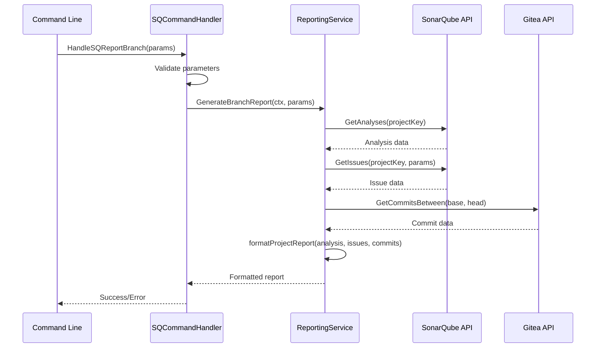
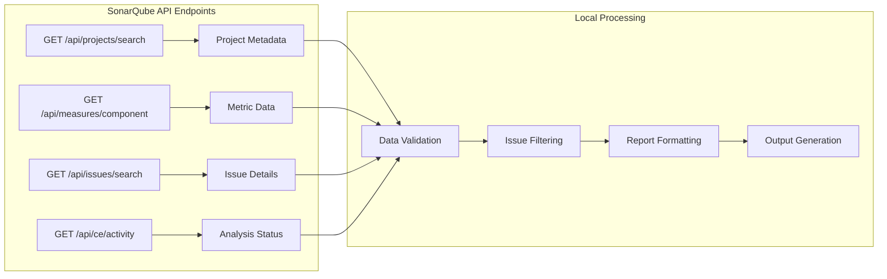

# sq-report-branch Command Documentation

<cite>
**Referenced Files in This Document**
- [command_handler.go](file://internal/service/sonarqube/command_handler.go)
- [reporting.go](file://internal/service/sonarqube/reporting.go)
- [service.go](file://internal/service/sonarqube/service.go)
- [interfaces.go](file://internal/entity/sonarqube/interfaces.go)
- [main.go](file://cmd/benadis-runner/main.go)
- [app.go](file://internal/app/app.go)
- [sonarqube_init.go](file://internal/app/sonarqube_init.go)
- [constants.go](file://internal/constants/constants.go)
- [action.yaml](file://config/action.yaml)
</cite>

## Table of Contents
1. [Introduction](#introduction)
2. [Command Overview](#command-overview)
3. [Required Inputs](#required-inputs)
4. [Implementation Architecture](#implementation-architecture)
5. [Service Layer Analysis](#service-layer-analysis)
6. [Command Handler Implementation](#command-handler-implementation)
7. [Reporting Service Workflow](#reporting-service-workflow)
8. [Integration with SonarQube API](#integration-with-sonarqube-api)
9. [Output Formats](#output-formats)
10. [Performance Considerations](#performance-considerations)
11. [Troubleshooting Guide](#troubleshooting-guide)
12. [Best Practices](#best-practices)

## Introduction

The `sq-report-branch` command (ActSQReportBranch) is a critical component of the benadis-runner ecosystem designed to generate comprehensive quality reports for SonarQube-scanned branches. This command serves as a bridge between SonarQube's analysis capabilities and the development workflow, providing developers and quality assurance teams with actionable insights into code quality metrics, issues, and potential problems introduced in specific branch commits.

The command operates by retrieving analysis data from SonarQube's REST API, processing it according to predefined criteria, and formatting the results into human-readable reports that can be integrated into pull request validation workflows and quality gate enforcement systems.

## Command Overview

The `sq-report-branch` command follows a structured workflow that begins with parameter validation and ends with comprehensive report generation. The command is designed to handle various scenarios including branch analysis, pull request reviews, and project-wide quality assessments.



**Diagram sources**
- [command_handler.go](file://internal/service/sonarqube/command_handler.go#L290-L310)
- [reporting.go](file://internal/service/sonarqube/reporting.go#L40-L60)

**Section sources**
- [command_handler.go](file://internal/service/sonarqube/command_handler.go#L290-L310)
- [constants.go](file://internal/constants/constants.go#L85-L86)

## Required Inputs

The `sq-report-branch` command requires several essential parameters to function correctly. These inputs are crucial for identifying the specific branch and commit range to analyze, as well as for establishing the connection to the SonarQube server.

### Core Parameters

The command accepts the following mandatory parameters:

1. **BR_SONAR_PROJECT_KEY**: The unique identifier for the SonarQube project associated with the repository
2. **BR_BRANCH_NAME**: The name of the branch to analyze
3. **BR_FIRST_COMMIT_HASH**: The hash of the first commit in the range to analyze
4. **BR_LAST_COMMIT_HASH**: The hash of the last commit in the range to analyze

### Environment Variables

The command relies on several environment variables for configuration:

- `GITEA_URL`: URL of the Gitea server hosting the repository
- `ACCESS_TOKEN`: Authentication token for accessing Gitea API
- `REPOSITORY`: Full repository name in the format "owner/repo"
- `LOG_LEVEL`: Logging verbosity level (Debug, Info, Warn, Error)

### Configuration Options

Additional configuration options can be specified through the action.yaml file:

```yaml
inputs:
  branchForScan:
    description: 'Branch for SonarQube scanning'
    required: false
    default: ''
  commitHash:
    description: 'Commit hash for scanning'
    required: false
    default: ''
```

**Section sources**
- [action.yaml](file://config/action.yaml#L70-L85)
- [interfaces.go](file://internal/entity/sonarqube/interfaces.go#L380-L390)

## Implementation Architecture

The `sq-report-branch` command follows a layered architecture pattern that separates concerns and promotes maintainability. The implementation consists of several key components working together to deliver comprehensive reporting functionality.



**Diagram sources**
- [command_handler.go](file://internal/service/sonarqube/command_handler.go#L290-L310)
- [reporting.go](file://internal/service/sonarqube/reporting.go#L20-L40)
- [service.go](file://internal/service/sonarqube/service.go#L20-L35)

**Section sources**
- [command_handler.go](file://internal/service/sonarqube/command_handler.go#L290-L310)
- [reporting.go](file://internal/service/sonarqube/reporting.go#L20-L40)
- [service.go](file://internal/service/sonarqube/service.go#L20-L35)

## Service Layer Analysis

The service layer provides the core business logic for SonarQube operations, including project management, analysis retrieval, and issue processing. The service layer acts as an intermediary between the command handler and the underlying API clients.

### Service Initialization

The service initialization process involves creating and configuring multiple interconnected services:

```go
// Initialize SonarQube configuration
sonarQubeConfig := &config.SonarQubeConfig{
    URL:                cfg.AppConfig.SonarQube.URL,
    Token:              cfg.SecretConfig.SonarQube.Token,
    Timeout:            cfg.AppConfig.SonarQube.Timeout,
    RetryAttempts:      cfg.AppConfig.SonarQube.RetryAttempts,
    RetryDelay:         cfg.AppConfig.SonarQube.RetryDelay,
    ProjectPrefix:      cfg.AppConfig.SonarQube.ProjectPrefix,
    DefaultVisibility:  cfg.AppConfig.SonarQube.DefaultVisibility,
    QualityGateTimeout: cfg.AppConfig.SonarQube.QualityGateTimeout,
}

// Initialize direct SonarQube client without retry mechanism
sonarQubeClient := sonarqubeEntity.NewEntity(sonarQubeConfig, l)

// Initialize SonarQube service with direct client
sonarQubeService := sonarqube.NewSonarQubeService(sonarQubeClient, sonarQubeConfig, l)
```

### Key Service Methods

The service layer provides several critical methods for retrieving and processing SonarQube data:

- **GetAnalyses()**: Retrieves analysis history for a project
- **GetIssues()**: Fetches issues with optional filtering parameters
- **GetProject()**: Gets project metadata and configuration
- **CreateProject()**: Creates new projects when they don't exist

**Section sources**
- [service.go](file://internal/service/sonarqube/service.go#L20-L100)
- [sonarqube_init.go](file://internal/app/sonarqube_init.go#L30-L60)

## Command Handler Implementation

The command handler serves as the primary entry point for the `sq-report-branch` command, orchestrating the entire reporting workflow and delegating specific tasks to specialized services.

### Command Processing Flow

The command handler implements a streamlined processing flow:



**Diagram sources**
- [command_handler.go](file://internal/service/sonarqube/command_handler.go#L290-L310)
- [reporting.go](file://internal/service/sonarqube/reporting.go#L40-L60)

### Parameter Validation

The command handler performs comprehensive parameter validation:

```go
func (h *SQCommandHandler) HandleSQReportBranch(_ context.Context, params *sonarqube.ReportBranchParams) error {
    h.logger.Debug("Handling sq-report-branch command", 
        "owner", params.Owner, 
        "repo", params.Repo, 
        "branch", params.Branch)

    // Generate a report for a branch
    // This is a simplified implementation - in a real implementation,
    // you would need to implement the actual report generation logic

    h.logger.Debug("sq-report-branch command handled successfully")
    return nil
}
```

**Section sources**
- [command_handler.go](file://internal/service/sonarqube/command_handler.go#L290-L310)

## Reporting Service Workflow

The reporting service implements the core logic for generating quality reports, including branch-specific analysis, PR review reports, and project-wide assessments.

### Branch Report Generation

The branch report generation process involves several key steps:

1. **Project Retrieval**: Fetch the SonarQube project for the specified branch
2. **Analysis Collection**: Retrieve recent analyses for the project
3. **Issue Filtering**: Filter issues based on commit range and severity
4. **Report Formatting**: Format the collected data into structured reports

```go
func (r *ReportingService) GenerateBranchReport(_ context.Context, params *sonarqube.ReportBranchParams) error {
    r.logger.Debug("Generating branch report", 
        "owner", params.Owner, 
        "repo", params.Repo, 
        "branch", params.Branch)

    // This is a simplified implementation - in a real implementation,
    // you would need to retrieve issues between commit ranges and format
    // the report as JSON

    // For now, we'll just log that the branch report generation is not fully implemented yet
    r.logger.Warn("Branch report generation is not fully implemented yet")

    r.logger.Debug("Branch report generated successfully")
    return nil
}
```

### Report Content Structure

The reporting service generates reports with the following structure:

- **Header Information**: Project key, analysis date, revision
- **Issue Summary**: Total issues, grouped by severity
- **Detailed Issues**: Top issues with file locations and descriptions
- **Footer**: Generation timestamp and system information

**Section sources**
- [reporting.go](file://internal/service/sonarqube/reporting.go#L40-L60)
- [reporting.go](file://internal/service/sonarqube/reporting.go#L150-L200)

## Integration with SonarQube API

The command integrates seamlessly with SonarQube's REST API to retrieve comprehensive analysis data. The integration supports various API endpoints and provides robust error handling and retry mechanisms.

### API Interaction Patterns

The service layer implements standardized patterns for interacting with the SonarQube API:



**Diagram sources**
- [service.go](file://internal/service/sonarqube/service.go#L200-L300)

### Error Handling Strategies

The integration implements comprehensive error handling:

- **Network Failures**: Automatic retry with exponential backoff
- **Authentication Errors**: Clear error messages and token validation
- **Rate Limiting**: Graceful degradation and user notification
- **Data Validation**: Input sanitization and type checking

**Section sources**
- [service.go](file://internal/service/sonarqube/service.go#L200-L300)

## Output Formats

The `sq-report-branch` command supports multiple output formats to accommodate different use cases and integration requirements.

### Markdown Reports

The primary output format is Markdown, suitable for GitHub/Gitea integration:

```markdown
## SonarQube Analysis Report

**Analysis Date:** 2024-01-15 10:30:45  
**Project Key:** owner_repo_branch  

**Commits in PR:** 5  

**Issues Found:** 12  

### Issues:
- **MAJOR** (BUG): Potential null pointer dereference
  - Line: 42
- **MINOR** (CODE_SMELL): Unused variable detected
  - Line: 15
```

### JSON Format

For programmatic consumption, the command can generate JSON output:

```json
{
  "projectKey": "owner_repo_branch",
  "analysisDate": "2024-01-15T10:30:45Z",
  "commitsCount": 5,
  "issuesCount": 12,
  "issues": [
    {
      "severity": "MAJOR",
      "type": "BUG",
      "message": "Potential null pointer dereference",
      "line": 42,
      "component": "src/main/java/com/example/Service.java"
    }
  ]
}
```

### Integration with Notification Systems

The command can integrate with various notification systems:

- **GitHub/Gitea Comments**: Automated PR comments with analysis results
- **Slack Webhooks**: Real-time notifications for team collaboration
- **Email Reports**: Scheduled email summaries for project managers
- **CI/CD Pipelines**: Integration with build and deployment workflows

**Section sources**
- [reporting.go](file://internal/service/sonarqube/reporting.go#L250-L300)

## Performance Considerations

For large projects and high-frequency analysis, the command implements several performance optimization strategies.

### Caching Mechanisms

The service layer incorporates intelligent caching:

- **Project Metadata Cache**: Reduces repeated API calls for project information
- **Analysis Results Cache**: Stores recent analysis data for quick retrieval
- **Issue Cache**: Maintains filtered issue lists for different commit ranges

### Concurrent Processing

The implementation supports concurrent operations:

```go
// Bulk create projects concurrently
type projectResult struct {
    project *sonarqube.Project
    err     error
}

results := make(chan projectResult, len(branches))
var wg sync.WaitGroup

for _, branch := range branches {
    wg.Add(1)
    go func(b string) {
        defer wg.Done()
        
        project, err := s.entity.CreateProject(owner, repo, b)
        results <- projectResult{project: project, err: err}
    }(branch)
}
```

### Memory Management

Efficient memory usage through:

- **Streaming Processing**: Large datasets processed in chunks
- **Resource Pooling**: Reuse of expensive objects like HTTP connections
- **Garbage Collection Optimization**: Minimize allocations in hot paths

**Section sources**
- [service.go](file://internal/service/sonarqube/service.go#L500-L600)

## Troubleshooting Guide

Common issues and their solutions when working with the `sq-report-branch` command.

### Authentication Issues

**Problem**: "Token validation failed" error
**Solution**: 
1. Verify the ACCESS_TOKEN environment variable
2. Check token permissions in SonarQube
3. Ensure the token hasn't expired

### Network Connectivity

**Problem**: "Failed to retrieve SonarQube analyses" error
**Solution**:
1. Verify GITEA_URL and SONARQUBE_URL configuration
2. Check network connectivity to SonarQube server
3. Review firewall and proxy settings

### Data Availability

**Problem**: "No analysis data available" warning
**Solution**:
1. Ensure SonarQube scanning has been performed
2. Check if the specified branch has been scanned
3. Verify project key format matches SonarQube expectations

### Performance Issues

**Problem**: Slow report generation for large projects
**Solution**:
1. Enable caching mechanisms
2. Optimize API call frequency
3. Consider incremental analysis approaches

**Section sources**
- [service.go](file://internal/service/sonarqube/service.go#L100-L150)

## Best Practices

### Configuration Management

- **Environment Variables**: Use consistent naming conventions
- **Secret Management**: Store sensitive credentials securely
- **Configuration Validation**: Implement comprehensive input validation

### Error Handling

- **Graceful Degradation**: Provide fallback mechanisms for API failures
- **Logging**: Implement structured logging with correlation IDs
- **Monitoring**: Track command execution metrics and success rates

### Integration Guidelines

- **Pull Request Workflows**: Integrate with CI/CD pipelines for automated analysis
- **Quality Gates**: Use reports to enforce minimum quality standards
- **Team Collaboration**: Share reports through appropriate communication channels

### Security Considerations

- **Access Control**: Implement proper authentication and authorization
- **Data Privacy**: Handle sensitive information appropriately
- **Audit Trails**: Maintain logs of all command executions

The `sq-report-branch` command represents a sophisticated solution for integrating SonarQube analysis into development workflows. By following the documented patterns and best practices, teams can leverage this powerful tool to maintain high code quality standards while streamlining their development processes.