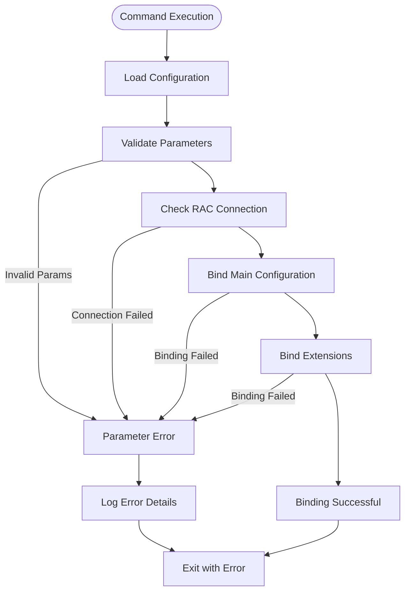
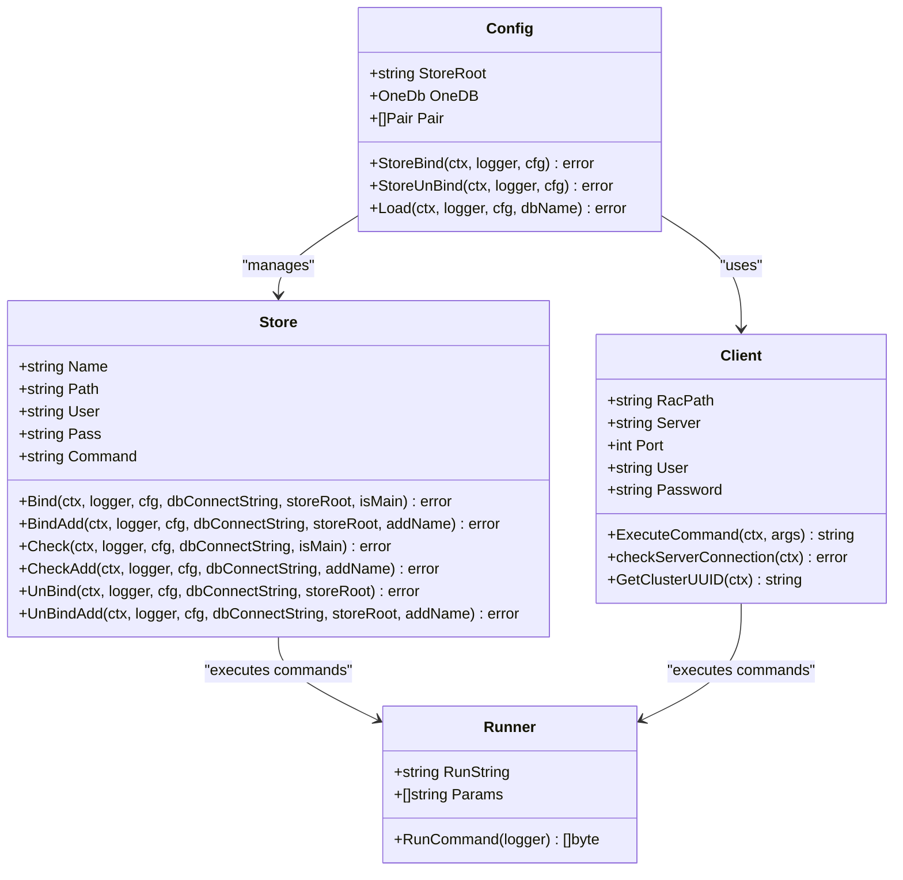
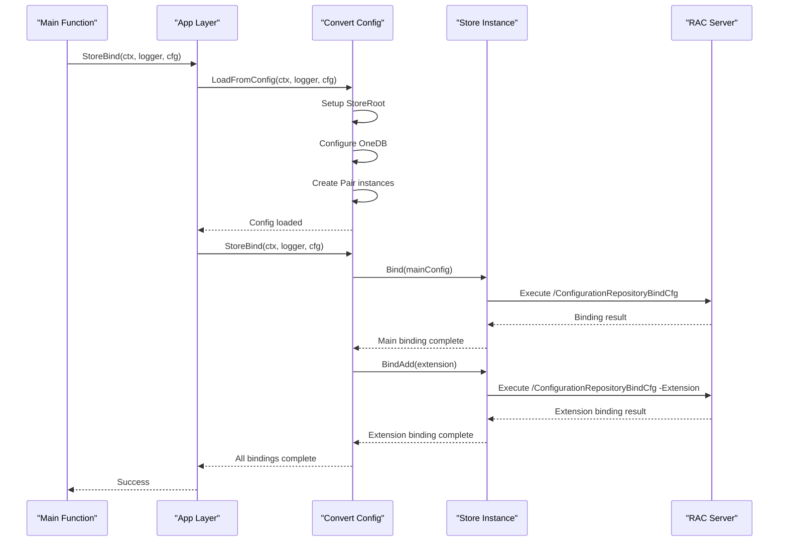

# Storebind Command Documentation

<cite>
**Referenced Files in This Document**
- [cmd/benadis-runner/main.go](file://cmd/benadis-runner/main.go)
- [internal/app/app.go](file://internal/app/app.go)
- [internal/constants/constants.go](file://internal/constants/constants.go)
- [internal/entity/one/store/store.go](file://internal/entity/one/store/store.go)
- [internal/entity/one/convert/convert.go](file://internal/entity/one/convert/convert.go)
- [internal/config/config.go](file://internal/config/config.go)
- [internal/rac/rac.go](file://internal/rac/rac.go)
- [config/action.yaml](file://config/action.yaml)
- [README.md](file://README.md)
</cite>

## Table of Contents
1. [Introduction](#introduction)
2. [Command Overview](#command-overview)
3. [Required Parameters](#required-parameters)
4. [Implementation Architecture](#implementation-architecture)
5. [Detailed Implementation Flow](#detailed-implementation-flow)
6. [Integration with Other Commands](#integration-with-other-commands)
7. [Security Considerations](#security-considerations)
8. [Error Handling and Common Issues](#error-handling-and-common-issues)
9. [Best Practices](#best-practices)
10. [Troubleshooting Guide](#troubleshooting-guide)

## Introduction

The `storebind` command (ActStoreBind) is a critical component of the benadis-runner system that enables the binding of 1C configuration storage to a target infobase. This command establishes the essential connection between file-based configuration repositories and database-based 1C systems, facilitating seamless synchronization workflows for development and deployment processes.

The storebind command serves as the foundation for the complete sync pipeline, working in conjunction with git2store and store2db commands to create a robust CI/CD workflow for 1C applications. By binding storage to an infobase, developers can synchronize configuration changes between Git repositories and 1C databases, ensuring consistency across development environments.

## Command Overview

The storebind command performs the following primary functions:

- **Storage Binding**: Establishes a connection between 1C configuration storage and the target infobase
- **Configuration Synchronization**: Enables bidirectional synchronization between file-based and database-based configurations
- **Workflow Integration**: Forms the bridge between git2store and store2db operations
- **Multi-Environment Support**: Supports binding for both main configurations and extensions

### Command Execution Flow



**Diagram sources**
- [internal/app/app.go](file://internal/app/app.go#L130-L140)
- [internal/entity/one/convert/convert.go](file://internal/entity/one/convert/convert.go#L466-L502)

## Required Parameters

The storebind command requires several key parameters to establish the binding connection:

### Environment Variables

| Parameter | Description | Required | Example |
|-----------|-------------|----------|---------|
| `BR_COMMAND` | Specifies the command to execute (`storebind`) | Yes | `storebind` |
| `BR_INFOBASE_NAME` | Name of the target infobase | Yes | `MyInfobase` |
| `BR_CONFIG_SYSTEM` | Path to system configuration file | No | `app.yaml` |
| `BR_CONFIG_PROJECT` | Path to project configuration file | No | `project.yaml` |
| `BR_CONFIG_SECRET` | Path to secret configuration file | No | `secret.yaml` |
| `BR_CONFIG_DBDATA` | Path to database configuration file | No | `dbconfig.yaml` |

### Configuration Files

#### System Configuration (app.yaml)
Contains global application settings including:
- Database connection paths
- RAC server configuration
- User credentials
- Timeout settings

#### Project Configuration (project.yaml)
Defines project-specific settings:
- Debug mode
- Storage database type
- Production environment settings
- Extension configurations

#### Secret Configuration (secret.yaml)
Holds sensitive information:
- Database passwords
- RAC credentials
- Access tokens
- Store administrator passwords

### Authentication Credentials

The storebind command handles multiple types of authentication:

1. **RAC Authentication**: Credentials for Remote Administration Console
2. **Database Authentication**: Credentials for target infobase
3. **Store Administrator Authentication**: Credentials for configuration storage

**Section sources**
- [internal/config/config.go](file://internal/config/config.go#L100-L150)
- [config/action.yaml](file://config/action.yaml#L1-L50)

## Implementation Architecture

The storebind command follows a layered architecture that separates concerns and ensures maintainability:



**Diagram sources**
- [internal/entity/one/store/store.go](file://internal/entity/one/store/store.go#L30-L50)
- [internal/entity/one/convert/convert.go](file://internal/entity/one/convert/convert.go#L30-L60)
- [internal/rac/rac.go](file://internal/rac/rac.go#L20-L50)

### Core Components

#### Store Structure
The Store struct encapsulates all necessary information for storage operations:

```go
type Store struct {
    Name    string `json:"Имя хранилища,omitempty"`
    Path    string `json:"Относительный путь"`
    User    string `json:"Пользователь"`
    Pass    string `json:"Пароль"`
    Command string `json:"-"`
}
```

#### Configuration Management
The Config struct manages the overall conversion process:

```go
type Config struct {
    StoreRoot string         `json:"Корень хранилища"`
    OneDB     designer.OneDb `json:"Параметры подключения"`
    Pair      []Pair         `json:"Сопоставления"`
}
```

**Section sources**
- [internal/entity/one/store/store.go](file://internal/entity/one/store/store.go#L30-L50)
- [internal/entity/one/convert/convert.go](file://internal/entity/one/convert/convert.go#L30-L60)

## Detailed Implementation Flow

The storebind command execution follows a precise sequence of operations:

### Step 1: Command Initialization

The main function routes the execution to the appropriate handler:

```go
case constants.ActStoreBind:
    err = app.StoreBind(&ctx, l, cfg)
    if err != nil {
        l.Error("Ошибка выполнения StoreBind",
            slog.String("error", err.Error()),
            slog.String(constants.MsgErrProcessing, constants.MsgAppExit),
        )
        os.Exit(8)
    }
    l.Info("StoreBind успешно выполнен")
```

### Step 2: Configuration Loading

The StoreBind function loads the configuration from various sources:

```go
func StoreBind(ctx *context.Context, l *slog.Logger, cfg *config.Config) error {
    var err error
    NetHaspInit(ctx, l)
    
    // Загружаем конфигурацию из переданных данных
    cc, err := convert.LoadFromConfig(ctx, l, cfg)
    if err != nil {
        return err
    }
    
    err = cc.StoreBind(ctx, l, cfg)
    if err != nil {
        return err
    }
    return err
}
```

### Step 3: Storage Binding Process

The core binding logic is implemented in the StoreBind method:



**Diagram sources**
- [internal/app/app.go](file://internal/app/app.go#L130-L140)
- [internal/entity/one/convert/convert.go](file://internal/entity/one/convert/convert.go#L466-L502)
- [internal/entity/one/store/store.go](file://internal/entity/one/store/store.go#L295-L375)

### Step 4: RAC Communication

The binding operations communicate with the RAC server using the Client structure:

```go
func (s *Store) Bind(ctx *context.Context, l *slog.Logger, cfg *config.Config, dbConnectString string, storeRoot string, isMain bool) error {
    // Prepare connection parameters
    r := s.GetStoreParam(dbConnectString, cfg)
    r.Params = append(r.Params, "/ConfigurationRepositoryBindCfg")
    r.Params = append(r.Params, "-forceBindAlreadyBindedUser")
    r.Params = append(r.Params, "-forceReplaceCfg")
    r.Params = append(r.Params, "/Out")
    r.Params = append(r.Params, "/c Подключение основной конфигурации к хранилищу")
    
    // Execute command
    _, err = r.RunCommand(l)
    if err != nil {
        l.Error("Ошибка подключения основной конфигурации к хранилищу",
            slog.String("Путь", s.Path),
            slog.String("Error", err.Error()),
        )
        return err
    }
    
    return err
}
```

**Section sources**
- [internal/app/app.go](file://internal/app/app.go#L130-L140)
- [internal/entity/one/store/store.go](file://internal/entity/one/store/store.go#L295-L375)

## Integration with Other Commands

The storebind command works seamlessly with other benadis-runner commands to form a complete synchronization pipeline:

### Git2Store Integration


**Diagram sources**
- [internal/app/app.go](file://internal/app/app.go#L200-L300)

### Complete Workflow

1. **Git2Store**: Clones repository and prepares configuration
2. **StoreBind**: Binds storage to infobase
3. **Store2Db**: Exports configuration from storage to database
4. **DbUpdate**: Updates database structure
5. **StoreLock**: Locks configuration objects
6. **Merge**: Merges changes from working directory
7. **StoreCommit**: Commits changes to storage

### Command Dependencies

| Command | Predecessor | Successor | Purpose |
|---------|-------------|-----------|---------|
| storebind | git2store | store2db | Establish binding connection |
| store2db | storebind | dbupdate | Export configuration to database |
| dbupdate | store2db | storelock | Update database structure |
| storelock | dbupdate | merge | Lock configuration objects |
| merge | storelock | storecommit | Merge changes from working directory |
| storecommit | merge | None | Commit changes to storage |

**Section sources**
- [internal/app/app.go](file://internal/app/app.go#L200-L300)

## Security Considerations

The storebind command implements several security measures to protect sensitive information and ensure secure operations:

### Credential Protection

1. **Environment Variable Encryption**: All sensitive credentials are stored in encrypted environment variables
2. **Secure Storage**: Passwords are not logged or stored in plain text
3. **Access Control**: Only authorized users can execute storebind operations

### Network Security

1. **RAC Connection Validation**: Verifies RAC server accessibility before operations
2. **Timeout Controls**: Implements strict timeouts to prevent hanging connections
3. **Retry Mechanisms**: Uses exponential backoff for failed connections

### Data Integrity

1. **Command Validation**: Validates all arguments to prevent injection attacks
2. **Output Sanitization**: Converts all output to UTF-8 to prevent encoding issues
3. **Error Handling**: Comprehensive error logging without exposing sensitive information

### Best Security Practices

```go
// Safe argument validation
for _, arg := range fullArgs {
    if strings.Contains(arg, ";") || strings.Contains(arg, "&") || strings.Contains(arg, "|") {
        return "", fmt.Errorf("potentially unsafe argument detected: %s", arg)
    }
}
```

**Section sources**
- [internal/rac/rac.go](file://internal/rac/rac.go#L100-L150)
- [internal/entity/one/store/store.go](file://internal/entity/one/store/store.go#L295-L375)

## Error Handling and Common Issues

The storebind command implements comprehensive error handling to manage various failure scenarios:

### Common Error Scenarios

#### Invalid Storage Paths
```go
// Error: Storage path does not exist or is inaccessible
err = s.Check(ctx, l, cfg, dbConnectString, isMain)
if err != nil {
    l.Error("Невозможно подключиться к хранилищу конфигурации",
        slog.String("Путь", s.Path),
        slog.String("Строка подключения", dbConnectString),
        slog.String("Error", err.Error()),
    )
    return fmt.Errorf("не удалось подключиться к хранилищу конфигурации")
}
```

#### Connection Timeouts
```go
select {
case <-done:
    // Command completed successfully
case <-cmdCtx.Done():
    // Timeout or cancellation
    return "", fmt.Errorf("RAC command timeout or cancelled: %w", cmdCtx.Err())
}
```

#### Authentication Failures
```go
if !strings.Contains(string(r.FileOut), constants.SearchMsgStoreBindOk) {
    l.Error("Неопознанная ошибка подключения основной конфигурации к хранилищу",
        slog.String("Путь", s.Path),
        slog.String("Вывод в файл", runner.TrimOut(r.FileOut)),
    )
    return err
}
```

### Error Recovery Strategies

1. **Automatic Retry**: Implements retry logic with exponential backoff
2. **Graceful Degradation**: Continues with remaining operations if individual bindings fail
3. **Detailed Logging**: Provides comprehensive error logs for troubleshooting

### Idempotent Operations

The storebind command is designed to be idempotent, meaning it can be safely executed multiple times without causing unintended effects:

```go
// Force replace existing configuration
r.Params = append(r.Params, "-forceReplaceCfg")
r.Params = append(r.Params, "-forceBindAlreadyBindedUser")
```

**Section sources**
- [internal/entity/one/store/store.go](file://internal/entity/one/store/store.go#L295-L375)
- [internal/rac/rac.go](file://internal/rac/rac.go#L100-L200)

## Best Practices

### Configuration Management

1. **Separate Environments**: Use different configurations for development, testing, and production
2. **Version Control**: Store configuration files in version control with proper access controls
3. **Environment-Specific Settings**: Use environment variables for environment-specific overrides

### Operational Guidelines

1. **Regular Testing**: Test storebind operations regularly to ensure reliability
2. **Monitoring**: Implement monitoring for storebind operations to detect failures quickly
3. **Documentation**: Maintain up-to-date documentation for all configuration parameters

### Development Workflow

1. **Staging Environment**: Use staging environments for testing before production deployment
2. **Rollback Procedures**: Have rollback procedures in place for failed deployments
3. **Automated Testing**: Implement automated tests for storebind operations

### Performance Optimization

1. **Connection Pooling**: Reuse RAC connections when possible
2. **Batch Operations**: Combine multiple operations into single transactions where feasible
3. **Resource Cleanup**: Properly clean up temporary resources after operations

## Troubleshooting Guide

### Diagnostic Steps

1. **Verify Configuration**: Check all configuration files and environment variables
2. **Test Connectivity**: Verify network connectivity to RAC server and database
3. **Check Permissions**: Ensure proper permissions for all required resources
4. **Review Logs**: Examine detailed logs for specific error messages

### Common Solutions

#### Stale Lock Issues
```bash
# Clear stale locks manually
rac server address cluster infobase lock clear --infobase=uuid
```

#### Version Mismatch Problems
```bash
# Check version compatibility
rac server address cluster infobase summary list --cluster=uuid
```

#### Connection Refused Errors
```bash
# Verify RAC server status
netstat -tlnp | grep :1545
# Check firewall rules
iptables -L | grep 1545
```

### Monitoring and Alerting

Implement monitoring for:
- RAC server availability
- Database connectivity
- Storage path accessibility
- Command execution times

### Recovery Procedures

1. **Manual Intervention**: Have procedures for manual intervention when automated recovery fails
2. **Backup Verification**: Regularly verify backup integrity and restoration procedures
3. **Communication Plan**: Establish communication plans for major incidents

**Section sources**
- [internal/rac/rac.go](file://internal/rac/rac.go#L200-L300)
- [internal/entity/one/store/store.go](file://internal/entity/one/store/store.go#L400-L500)