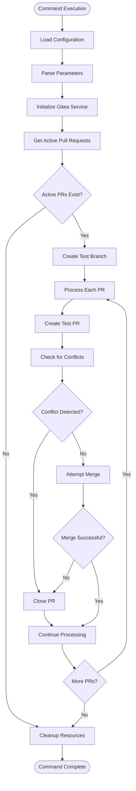
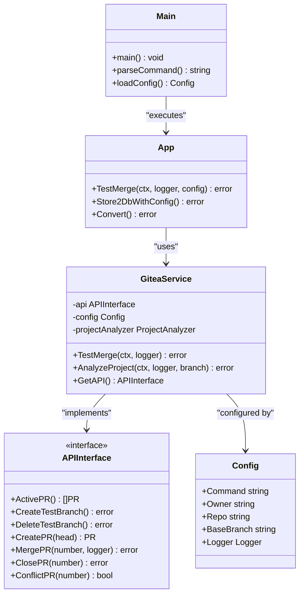
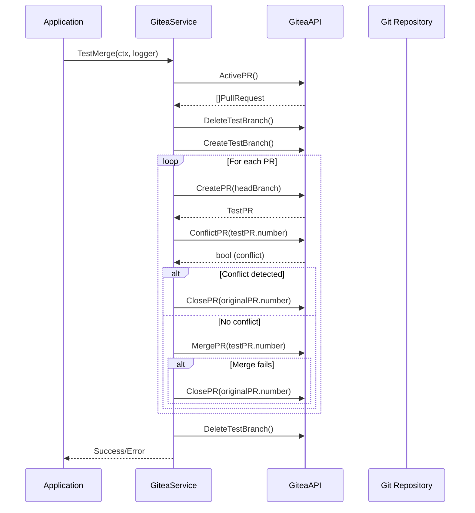
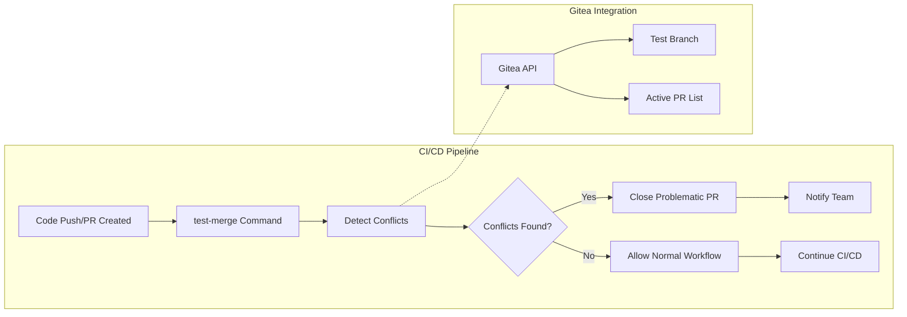

# Test-Merge Command Documentation

<cite>
**Referenced Files in This Document**
- [main.go](file://cmd/benadis-runner/main.go)
- [app.go](file://internal/app/app.go)
- [gitea_service.go](file://internal/service/gitea_service.go)
- [constants.go](file://internal/constants/constants.go)
- [action.yaml](file://config/action.yaml)
- [app.yaml](file://config/app.yaml)
- [interfaces.go](file://internal/entity/gitea/interfaces.go)
- [config.go](file://internal/config/config.go)
- [README.md](file://README.md)
- [Makefile](file://Makefile)
</cite>

## Table of Contents
1. [Introduction](#introduction)
2. [Command Overview](#command-overview)
3. [Architecture](#architecture)
4. [Implementation Details](#implementation-details)
5. [Configuration](#configuration)
6. [Usage Examples](#usage-examples)
7. [Integration with CI/CD](#integration-with-cicd)
8. [Limitations and Best Practices](#limitations-and-best-practices)
9. [Troubleshooting](#troubleshooting)
10. [Conclusion](#conclusion)

## Introduction

The `test-merge` command in benadis-runner is a sophisticated tool designed to simulate merge operations between 1C configuration branches to detect conflicts before actual merging occurs. This command plays a crucial role in maintaining code quality and preventing integration issues in 1C Enterprise development environments.

The test-merge functionality creates a test branch and attempts to merge all active pull requests into this branch, automatically closing any PRs that would cause conflicts during the merge process. This approach allows teams to identify potential integration problems early in the development cycle.

## Command Overview

The test-merge command is identified by the constant `ActTestMerge` and is executed through the main application entry point. It serves as a preventive measure to ensure smooth integration of multiple concurrent development efforts in 1C configurations.



**Section sources**
- [main.go](file://cmd/benadis-runner/main.go#L230-L235)
- [constants.go](file://internal/constants/constants.go#L118-L118)

## Architecture

The test-merge command follows a layered architecture pattern with clear separation of concerns:



**Diagram sources**
- [main.go](file://cmd/benadis-runner/main.go#L230-L235)
- [app.go](file://internal/app/app.go#L1260-L1299)
- [gitea_service.go](file://internal/service/gitea_service.go#L15-L25)
- [interfaces.go](file://internal/entity/gitea/interfaces.go#L15-L45)

**Section sources**
- [main.go](file://cmd/benadis-runner/main.go#L1-L252)
- [app.go](file://internal/app/app.go#L1260-L1299)
- [gitea_service.go](file://internal/service/gitea_service.go#L1-L201)

## Implementation Details

### Command Entry Point

The test-merge command is initiated through the main application switch statement in `main.go`. When the `ActTestMerge` constant is detected, the application delegates control to the `app.TestMerge()` function.

```go
case constants.ActTestMerge:
    err = app.TestMerge(&ctx, l, cfg)
    if err != nil {
        l.Error("Ошибка проверки конфликтов слияния",
            slog.String("error", err.Error()),
            slog.String(constants.MsgErrProcessing, constants.MsgAppExit),
        )
        os.Exit(8)
    }
    l.Info("Проверка конфликтов слияния успешно завершена")
```

### Core TestMerge Function

The `TestMerge` function in the app package orchestrates the entire conflict detection process:

```go
func TestMerge(ctx *context.Context, l *slog.Logger, cfg *config.Config) error {
    l.Debug("Начинаем проверку конфликтов слияния",
        slog.String("owner", cfg.Owner),
        slog.String("repo", cfg.Repo),
    )

    // Создание фабрики и сервиса Gitea
    factory := service.NewGiteaFactory()
    giteaService, err := factory.CreateGiteaService(cfg)
    if err != nil {
        l.Error("Ошибка создания Gitea сервиса",
            slog.String("error", err.Error()),
        )
        return err
    }

    // Выполнение проверки конфликтов слияния
    err = giteaService.TestMerge(*ctx, l)
    if err != nil {
        l.Error("Ошибка проверки конфликтов слияния",
            slog.String("error", err.Error()),
        )
        return err
    }

    l.Info("Проверка конфликтов слияния успешно завершена")
    return nil
}
```

### Gitea Service Implementation

The core logic resides in the `GiteaService.TestMerge()` method, which implements the complete conflict detection workflow:



**Diagram sources**
- [gitea_service.go](file://internal/service/gitea_service.go#L36-L166)

**Section sources**
- [app.go](file://internal/app/app.go#L1260-L1299)
- [gitea_service.go](file://internal/service/gitea_service.go#L36-L166)

## Configuration

### Environment Variables

The test-merge command relies on several environment variables for proper operation:

```yaml
# Required environment variables
GITEA_URL: "https://your-gitea-server.com"
REPOSITORY: "owner/repo-name"
ACCESS_TOKEN: "your-access-token"
COMMAND: "test-merge"
LOG_LEVEL: "Debug"  # Optional
ISSUE_NUMBER: "123" # Optional
```

### Configuration Parameters

The command requires the following configuration parameters:

| Parameter | Description | Required | Default |
|-----------|-------------|----------|---------|
| `GITEA_URL` | URL of the Gitea server | Yes | - |
| `REPOSITORY` | Full repository name (owner/repo) | Yes | - |
| `ACCESS_TOKEN` | Authentication token | Yes | - |
| `COMMAND` | Must be set to "test-merge" | Yes | - |
| `LOG_LEVEL` | Logging verbosity | No | Info |
| `BASE_BRANCH` | Target branch for merges | No | main |

### Configuration Loading

The configuration is loaded through the centralized configuration system:

```go
cfg, err := config.MustLoad()
if err != nil || cfg == nil {
    fmt.Fprintf(os.Stderr, "Не удалось загрузить конфигурацию приложения: %v\n", err)
    os.Exit(5)
}
```

**Section sources**
- [action.yaml](file://config/action.yaml#L1-L121)
- [config.go](file://internal/config/config.go#L1-L200)

## Usage Examples

### Basic Usage

```bash
# Using environment variables
export GITEA_URL="https://git.example.com"
export REPOSITORY="myorg/myproject"
export ACCESS_TOKEN="ghp_xxxxxxxxxxxxxxxxxxxxxxxx"
export COMMAND="test-merge"
export LOG_LEVEL="Debug"

./benadis-runner
```

### GitHub Actions Integration

```yaml
name: Test Merge Validation
on:
  schedule:
    - cron: '0 2 * * *'  # Run daily at 2 AM
  workflow_dispatch:    # Allow manual trigger

jobs:
  test-merge:
    runs-on: ubuntu-latest
    steps:
      - name: Checkout repository
        uses: actions/checkout@v3
        
      - name: Setup benadis-runner
        uses: gitops-tools/benadis-runner@latest
        with:
          giteaURL: ${{ github.server_url }}
          repository: ${{ github.repository }}
          accessToken: ${{ secrets.GITEA_TOKEN }}
          command: test-merge
          logLevel: Debug
```

### Docker Container Usage

```bash
docker run --rm \
  -e GITEA_URL=https://git.example.com \
  -e REPOSITORY=myorg/myproject \
  -e ACCESS_TOKEN=ghp_xxxxxxxxxxxxxxxxxxxxxxxx \
  -e COMMAND=test-merge \
  -v /tmp/benadis:/tmp/benadis \
  benadis-runner:test-merge
```

### Programmatic Usage

```go
package main

import (
    "context"
    "log/slog"
    "github.com/Kargones/apk-ci/internal/app"
    "github.com/Kargones/apk-ci/internal/config"
)

func main() {
    ctx := context.Background()
    logger := slog.New(slog.NewTextHandler(os.Stdout, nil))
    
    // Load configuration
    cfg, err := config.MustLoad()
    if err != nil {
        logger.Error("Failed to load configuration", "error", err)
        return
    }
    
    // Execute test-merge
    err = app.TestMerge(&ctx, logger, cfg)
    if err != nil {
        logger.Error("Test merge failed", "error", err)
        return
    }
    
    logger.Info("Test merge completed successfully")
}
```

## Integration with CI/CD

### Automated Pipeline Integration

The test-merge command integrates seamlessly with CI/CD pipelines to provide continuous validation of merge operations:



### GitHub Actions Workflow Example

```yaml
name: Merge Conflict Detection

on:
  pull_request:
    types: [opened, synchronize, reopened]
  schedule:
    - cron: '0 3 * * *'  # Daily at 3 AM

jobs:
  merge-validation:
    runs-on: ubuntu-latest
    permissions:
      contents: read
      pull-requests: write
      
    steps:
      - name: Checkout code
        uses: actions/checkout@v3
        
      - name: Setup benadis-runner
        uses: gitops-tools/benadis-runner@latest
        with:
          giteaURL: ${{ github.server_url }}
          repository: ${{ github.repository }}
          accessToken: ${{ secrets.GITHUB_TOKEN }}
          command: test-merge
          logLevel: Debug
          
      - name: Report conflicts
        if: failure()
        uses: actions/github-script@v6
        with:
          script: |
            const fs = require('fs');
            const logs = fs.readFileSync('/tmp/benadis-runner.log', 'utf8');
            // Process logs to identify conflicts
            // Create issue or comment on PR with conflict details
```

### Jenkins Pipeline Integration

```groovy
pipeline {
    agent any
    
    stages {
        stage('Test Merge') {
            steps {
                script {
                    def envVars = [
                        'GITEA_URL': 'https://git.example.com',
                        'REPOSITORY': "${env.JOB_NAME}/${env.BUILD_NUMBER}",
                        'ACCESS_TOKEN': credentials('gitea-token'),
                        'COMMAND': 'test-merge'
                    ]
                    
                    sh '''
                        export ${envVars.collect { "${it.key}=${it.value}" }.join(' ')}
                        ./benadis-runner
                    '''
                }
            }
            post {
                failure {
                    emailext (
                        subject: "Merge Conflict Detected in ${env.JOB_NAME}",
                        body: "Test merge failed. Check logs for conflict details.",
                        to: "${env.CHANGE_AUTHOR_EMAIL}"
                    )
                }
            }
        }
    }
}
```

**Section sources**
- [README.md](file://README.md#L200-L220)

## Limitations and Best Practices

### Known Limitations

1. **Tool Version Compatibility**: Requires compatible versions of 1C:Enterprise platform tools
2. **Network Dependencies**: Relies on stable network connectivity to Gitea server
3. **Resource Constraints**: May encounter memory or storage limitations with large repositories
4. **Concurrent Operations**: Cannot handle simultaneous test-merge operations on the same repository

### Best Practices

#### 1. Regular Execution Schedule

Configure automatic execution to catch conflicts early:

```yaml
schedule:
  - cron: '0 2 * * *'  # Daily at 2 AM
  - cron: '0 14 * * *' # Daily at 2 PM
```

#### 2. Proper Logging Configuration

Set appropriate log levels for production environments:

```yaml
logLevel: "Info"  # Reduce verbosity in production
```

#### 3. Resource Management

Ensure adequate system resources:

```yaml
# Increase timeouts for large repositories
timeout: 60
tmpDir: "/tmp/benadis/temp"
workDir: "/tmp/benadis"
```

#### 4. Error Handling

Implement robust error handling in CI/CD pipelines:

```yaml
steps:
  - name: Test Merge
    continue-on-error: false
    uses: gitops-tools/benadis-runner@latest
    with:
      command: test-merge
      logLevel: Debug
```

### Interpretation Guidelines

When interpreting test-merge results:

- **Successful Execution**: All active PRs can be merged without conflicts
- **Failed Execution**: At least one PR causes conflicts that need resolution
- **Partial Success**: Some PRs can be merged, others require attention

**Section sources**
- [gitea_service.go](file://internal/service/gitea_service.go#L125-L166)

## Troubleshooting

### Common Issues and Solutions

#### 1. Tool Version Compatibility

**Problem**: Test-merge fails with version mismatch errors

**Solution**: Ensure compatible tool versions in configuration:

```yaml
paths:
  bin1cv8: "/opt/1cv8/x86_64/8.3.27.1606/1cv8"
  binIbcmd: "/opt/1cv8/x86_64/8.3.27.1606/ibcmd"
  edtCli: "/opt/1C/1CE/components/1c-edt-2024.2.6+7-x86_64/1cedtcli"
```

#### 2. Workspace Cleanup Failures

**Problem**: Temporary files not cleaned up properly

**Solution**: Check disk space and permissions:

```bash
# Manual cleanup
rm -rf /tmp/benadis
mkdir -p /tmp/benadis
chmod 777 /tmp/benadis
```

#### 3. Network Connectivity Issues

**Problem**: Unable to connect to Gitea server

**Solution**: Verify network connectivity and credentials:

```bash
# Test connection
curl -H "Authorization: token $ACCESS_TOKEN" \
     "$GITEA_URL/api/v1/repos/$REPOSITORY/pulls"
```

#### 4. Permission Denied Errors

**Problem**: Insufficient permissions for repository operations

**Solution**: Verify access token permissions:

```yaml
# Token should have:
# - repo:full_access
# - admin:org:write (for organization repositories)
```

### Debug Mode

Enable debug mode for detailed troubleshooting:

```bash
export LOG_LEVEL="Debug"
./benadis-runner
```

### Log Analysis

Key log patterns to monitor:

```bash
# Successful execution
grep "Проверка конфликтов слияния успешно завершена" /var/log/benadis-runner.log

# Errors
grep "Ошибка" /var/log/benadis-runner.log

# Debug information
grep "DEBUG" /var/log/benadis-runner.log
```

**Section sources**
- [gitea_service.go](file://internal/service/gitea_service.go#L125-L166)
- [app.yaml](file://config/app.yaml#L1-L138)

## Conclusion

The test-merge command in benadis-runner provides a powerful solution for detecting merge conflicts in 1C configuration repositories before they become problematic. By simulating merge operations in a controlled test environment, teams can identify and resolve integration issues early in the development cycle.

Key benefits include:

- **Early Conflict Detection**: Identifies potential integration problems before they impact the main branch
- **Automated Validation**: Integrates seamlessly with CI/CD pipelines for continuous validation
- **Preventive Maintenance**: Helps maintain code quality and prevent merge-related regressions
- **Team Collaboration**: Provides visibility into merge conflicts for better team coordination

The command's architecture ensures reliability and scalability while maintaining backward compatibility with existing workflows. Proper configuration and integration with CI/CD systems can significantly improve development productivity and code quality in 1C Enterprise projects.

Future enhancements could include support for additional VCS platforms, enhanced conflict resolution capabilities, and improved reporting mechanisms for complex merge scenarios.