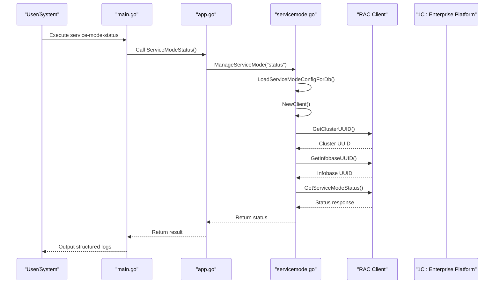
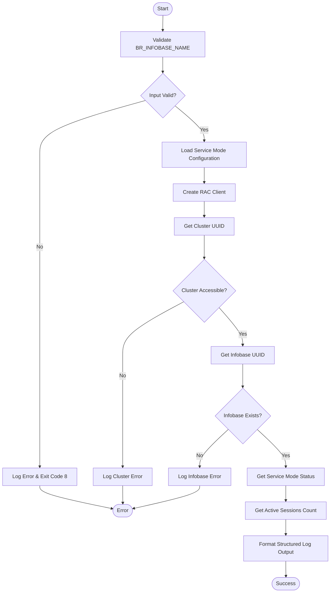
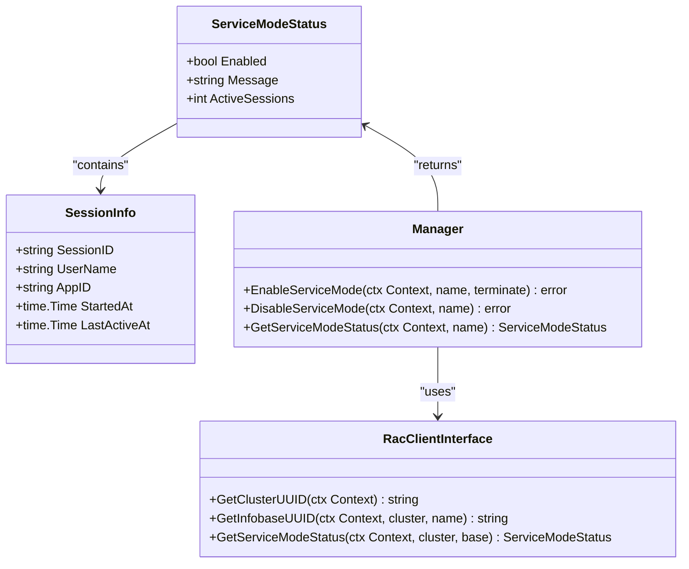

# Check Service Mode Status

<cite>
**Referenced Files in This Document**   
- [main.go](file://cmd/benadis-runner/main.go)
- [servicemode.go](file://internal/servicemode/servicemode.go)
- [service_mode.go](file://internal/rac/service_mode.go)
- [app.go](file://internal/app/app.go)
- [constants.go](file://internal/constants/constants.go)
- [config.go](file://internal/config/config.go)
</cite>

## Table of Contents
1. [Introduction](#introduction)
2. [Command Functionality](#command-functionality)
3. [Parameter Requirements](#parameter-requirements)
4. [Internal Processing Flow](#internal-processing-flow)
5. [Status Response Structure](#status-response-structure)
6. [Automation Pipeline Integration](#automation-pipeline-integration)
7. [Error Handling and Diagnostics](#error-handling-and-diagnostics)
8. [Usage Examples](#usage-examples)
9. [Configuration Management](#configuration-management)

## Introduction

The service-mode-status command in benadis-runner provides a critical monitoring capability for 1C:Enterprise information bases by retrieving the current service mode state. This functionality enables automation systems to make informed decisions about deployment operations based on the operational status of information bases. The command is designed to be integrated into continuous integration/continuous deployment (CI/CD) pipelines, allowing teams to verify system availability before executing maintenance operations or deployments.

By checking whether service mode is active and counting active user sessions, this command helps prevent conflicts between automated processes and user activities. It serves as a safety mechanism that ensures deployments and maintenance tasks only proceed when appropriate, reducing the risk of data corruption or service disruption. The structured logging output provides clear visibility into the system state, making it easier to troubleshoot issues and maintain audit trails.

**Section sources**
- [main.go](file://cmd/benadis-runner/main.go#L101-L115)

## Command Functionality

The service-mode-status command retrieves the current service mode state of a 1C:Enterprise infobase through a series of coordinated operations. When executed, the command initiates a process that validates the requested action, loads necessary configuration parameters, creates a client connection to the 1C:Enterprise platform via RAC (Remote Administration Console), and invokes the GetServiceModeStatus function to obtain detailed status information.

The primary purpose of this command is to determine whether service mode is currently active on the specified infobase and to count the number of active user sessions. This information is crucial for automation workflows that need to assess whether it's safe to proceed with deployments, updates, or other maintenance operations that require exclusive access to the database. The command returns structured information about the service mode status, enabling downstream processes to make conditional decisions based on the current system state.

Unlike commands that modify system state, service-mode-status performs a read-only operation that has no impact on the running system. This makes it safe to execute frequently for monitoring purposes without risking unintended side effects. The command's output provides a reliable indicator of the infobase's availability for maintenance operations.



**Diagram sources **
- [main.go](file://cmd/benadis-runner/main.go#L101-L115)
- [app.go](file://internal/app/app.go#L380-L395)
- [servicemode.go](file://internal/servicemode/servicemode.go#L170-L220)

## Parameter Requirements

The service-mode-status command requires exactly one parameter to function correctly: BR_INFOBASE_NAME, which specifies the name of the 1C:Enterprise infobase to check. This environment variable is mandatory and must be set before executing the command. Without this parameter, the command will fail with an error indicating that the infobase name was not specified.

The BR_INFOBASE_NAME parameter must match the exact name of an existing infobase within the 1C:Enterprise cluster. The name is case-sensitive and must correspond to the infobase as registered in the cluster configuration. If the specified infobase does not exist or cannot be found, the command will return an error during the UUID lookup phase.

No additional parameters are required for the basic functionality of retrieving service mode status. However, the command relies on several configuration parameters that are typically set in configuration files or environment variables, including the RAC path, server address, port, and authentication credentials. These parameters are automatically loaded from the application's configuration system and do not need to be specified directly when calling the service-mode-status command.

**Section sources**
- [main.go](file://cmd/benadis-runner/main.go#L101-L115)
- [constants.go](file://internal/constants/constants.go#L120-L125)

## Internal Processing Flow

The internal processing flow of the service-mode-status command follows a well-defined sequence of operations that ensures reliable status retrieval. The process begins with action validation in the main.go file, where the command checks if BR_INFOBASE_NAME is provided and exits with an error code if this required parameter is missing.

Once validated, control passes to the ServiceModeStatus function in app.go, which creates a logger adapter and calls ManageServiceMode from the servicemode package with the "status" action parameter. This function then loads the service mode configuration for the specified database by calling LoadServiceModeConfigForDb, which extracts RAC connection parameters from the application configuration.

With the configuration loaded, the system creates a new RAC client instance that encapsulates the connection details and logging interface. The client then executes a three-step process: first retrieving the cluster UUID through GetClusterUUID, then obtaining the infobase-specific UUID via GetInfobaseUUID using both the cluster UUID and the infobase name, and finally calling GetServiceModeStatus with these identifiers to retrieve the current status.

Throughout this process, comprehensive logging captures each step at the debug level, while any errors trigger detailed error messages that include context about the failed operation. Successful execution results in structured log output containing the service mode status and active session count, which can be parsed by automation systems for decision-making purposes.



**Diagram sources **
- [main.go](file://cmd/benadis-runner/main.go#L101-L115)
- [app.go](file://internal/app/app.go#L380-L395)
- [servicemode.go](file://internal/servicemode/servicemode.go#L170-L220)
- [service_mode.go](file://internal/rac/service_mode.go#L150-L250)

## Status Response Structure

The service-mode-status command returns its findings through structured logs that contain two key pieces of information: the Enabled status and the ActiveSessions count. These values are part of the ServiceModeStatus struct defined in the RAC package, which represents the response from the 1C:Enterprise platform.

The Enabled field is a boolean value that indicates whether service mode is currently active on the infobase. When true, it means the infobase is in service mode, restricting normal user access according to the configured policies. When false, the infobase is operating in normal mode, allowing unrestricted user access.

The ActiveSessions field contains an integer representing the number of currently active user sessions connected to the infobase. This count is obtained by calling the GetSessions function and measuring the length of the returned sessions array. Even when service mode is not enabled, this information is valuable for understanding the current load on the system.

These values are logged at the Info level with descriptive keys, making them easy to parse programmatically. The structured format includes the infobase name, enabled status, and active sessions count in a single log entry, providing a complete snapshot of the service mode state that can be used by monitoring systems or pipeline decision logic.



**Diagram sources **
- [service_mode.go](file://internal/rac/service_mode.go#L15-L25)
- [servicemode.go](file://internal/servicemode/servicemode.go#L15-L45)

## Automation Pipeline Integration

The service-mode-status command plays a vital role in automation pipelines by providing decision-making data for deployment workflows. Teams can use the command's output to determine whether it's safe to proceed with deployments, updates, or maintenance operations that require exclusive access to the 1C:Enterprise infobase.

In practice, pipelines typically execute the service-mode-status command as a pre-flight check before attempting to enable service mode for a deployment. By examining the Enabled status, automation scripts can avoid redundant operations - if service mode is already active, they might skip the enable step or investigate why it was previously activated. More importantly, the ActiveSessions count allows pipelines to make informed decisions about proceeding with disruptive operations.

For example, a deployment script might check if ActiveSessions is zero before proceeding, ensuring no users are actively working in the system. Alternatively, some workflows might tolerate a small number of sessions (such as automated processes) while blocking deployments if there are multiple active user sessions. This granular control helps balance system availability with maintenance requirements.

The structured log output format makes it easy to integrate with various CI/CD platforms, as the JSON-formatted logs can be parsed to extract the specific status values needed for conditional logic. This enables sophisticated deployment strategies that consider both the service mode state and user activity levels when determining whether to proceed with potentially disruptive operations.

**Section sources**
- [main.go](file://cmd/benadis-runner/main.go#L101-L115)
- [servicemode.go](file://internal/servicemode/servicemode.go#L170-L220)

## Error Handling and Diagnostics

The service-mode-status command implements comprehensive error handling to address various failure scenarios that may occur during execution. When the required BR_INFOBASE_NAME parameter is missing, the command immediately fails with a descriptive error message and exit code 8, preventing further processing with incomplete configuration.

Connection failures are handled at multiple levels of the processing chain. If the RAC client cannot connect to the 1C:Enterprise cluster, the GetClusterUUID call fails with a specific error that is propagated up the call stack. Similarly, if the specified infobase cannot be found within the cluster, the GetInfobaseUUID operation returns an error indicating that the infobase UUID could not be retrieved.

Misconfigured RAC paths represent another common failure point. If the RAC executable path specified in the configuration is incorrect or the file is not executable, the underlying command execution fails with a "command not found" or "permission denied" error. The system captures these errors and includes them in the structured log output, making diagnosis straightforward.

Diagnostic tips for troubleshooting include verifying the RAC path configuration, confirming network connectivity to the 1C:Enterprise server, checking authentication credentials, and validating that the infobase name matches exactly with the name registered in the cluster. The debug-level logging provides a complete trace of the execution flow, showing exactly which step failed and with what error message, significantly reducing mean time to resolution for operational issues.

**Section sources**
- [main.go](file://cmd/benadis-runner/main.go#L101-L115)
- [service_mode.go](file://internal/rac/service_mode.go#L150-L250)
- [servicemode.go](file://internal/servicemode/servicemode.go#L170-L220)

## Usage Examples

The service-mode-status command can be integrated into various monitoring and automation scenarios. For monitoring scripts, it can be executed periodically to track the service mode state of critical infobases, with the output fed into monitoring systems to generate alerts when unexpected changes occur.

A typical monitoring script might look like:
```bash
export BR_COMMAND="service-mode-status"
export BR_INFOBASE_NAME="ProductionERP"
./benadis-runner
```

For pre-flight checks before enabling service mode, the command can be used to assess the current state and make conditional decisions:
```bash
# Check current status before deployment
export BR_COMMAND="service-mode-status"
export BR_INFOBASE_NAME="CustomerPortal"
STATUS_OUTPUT=$(./benadis-runner 2>&1)

# Parse output to determine next steps
if echo "$STATUS_OUTPUT" | grep -q "enabled\":true"; then
    echo "Service mode already active, proceeding with deployment"
else
    ACTIVE_SESSIONS=$(echo "$STATUS_OUTPUT" | grep -o '"active_sessions":[0-9]*' | cut -d: -f2)
    if [ "$ACTIVE_SESSIONS" -eq 0 ]; then
        echo "No active sessions, safely enabling service mode"
        # Proceed with enabling service mode
    else
        echo "Warning: $ACTIVE_SESSIONS active sessions detected"
        # Alert administrators or delay deployment
    fi
fi
```

These usage patterns demonstrate how the command supports safe automation practices by providing the information needed to make intelligent decisions about when and how to proceed with system maintenance operations.

**Section sources**
- [main.go](file://cmd/benadis-runner/main.go#L101-L115)
- [app.go](file://internal/app/app.go#L380-L395)

## Configuration Management

The service-mode-status command relies on a hierarchical configuration management system that combines multiple sources of configuration data. The primary configuration is loaded from YAML files stored in the config directory, including app.yaml, dbconfig.yaml, and secret.yaml, which provide default values for RAC connection parameters and other settings.

Environment variables serve as the highest priority configuration source, allowing specific parameters to be overridden at runtime. Key configuration variables include RAC_PATH, RAC_SERVER, RAC_PORT, RAC_USER, RAC_PASSWORD, and SERVICE_RAC_* variants for service mode-specific settings. These variables enable flexible configuration across different environments without modifying configuration files.

The configuration loading process follows a specific order: first loading defaults from YAML files, then augmenting with secrets from secure storage, and finally applying environment variable overrides. This layered approach ensures that sensitive credentials are kept separate from code while still allowing for environment-specific customization.

For the service-mode-status command, the most critical configuration elements are the RAC path and server address, which determine how the system connects to the 1C:Enterprise platform. The configuration system automatically resolves the appropriate RAC server for a given infobase by consulting the dbconfig.yaml file, ensuring that commands target the correct infrastructure component.

**Section sources**
- [config.go](file://internal/config/config.go#L800-L850)
- [app.yaml](file://config/app.yaml#L1-L50)
- [constants.go](file://internal/constants/constants.go#L120-L125)