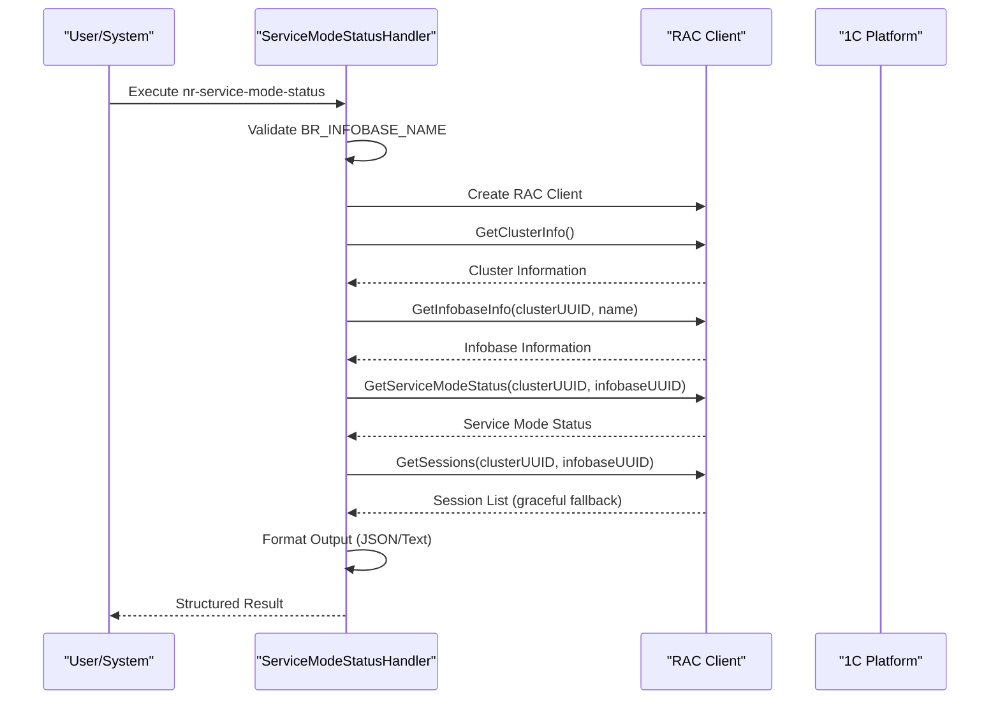
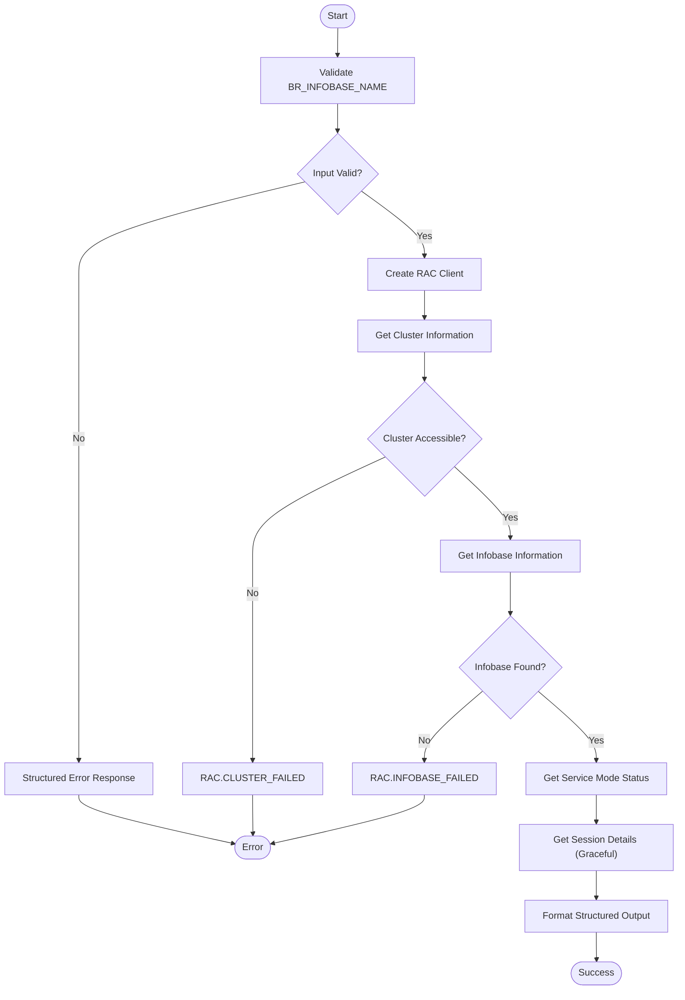

# Check Service Mode Status

<cite>
**Referenced Files in This Document**
- [handler.go](file://internal/command/handlers/servicemodestatushandler/handler.go)
- [handler_test.go](file://internal/command/handlers/servicemodestatushandler/handler_test.go)
- [interfaces.go](file://internal/adapter/onec/rac/interfaces.go)
- [service_mode.go](file://internal/rac/service_mode.go)
- [result.go](file://internal/pkg/output/result.go)
- [json.go](file://internal/pkg/output/json.go)
- [constants.go](file://internal/constants/constants.go)
- [main.go](file://cmd/apk-ci/main.go)
- [config.go](file://internal/config/config.go)
</cite>

## Update Summary
**Changes Made**
- Updated command name from "service-mode-status" to "nr-service-mode-status" with deprecated alias support
- Added comprehensive session information display with detailed user session data
- Enhanced structured output formats with JSON validation and standardized result structure
- Implemented graceful degradation for session retrieval errors
- Added support for both text and JSON output formats with proper formatting
- Updated error handling with machine-readable error codes and structured error responses

## Table of Contents
1. [Introduction](#introduction)
2. [Command Functionality](#command-functionality)
3. [Parameter Requirements](#parameter-requirements)
4. [Internal Processing Flow](#internal-processing-flow)
5. [Status Response Structure](#status-response-structure)
6. [Structured Output Formats](#structured-output-formats)
7. [Session Information Display](#session-information-display)
8. [Automation Pipeline Integration](#automation-pipeline-integration)
9. [Error Handling and Diagnostics](#error-handling-and-diagnostics)
10. [Usage Examples](#usage-examples)
11. [Configuration Management](#configuration-management)

## Introduction

The nr-service-mode-status command in apk-ci provides a comprehensive monitoring capability for 1C:Enterprise information bases by retrieving detailed service mode status information. This NR (New Runner) command represents a significant enhancement over the legacy service-mode-status, offering structured output formats, detailed session information display, and robust error handling mechanisms.

The command retrieves not only the current service mode state but also provides comprehensive details about active user sessions, including user names, host information, application IDs, and session timing data. This enhanced functionality enables automation systems to make informed decisions about deployment operations based on both service mode status and user activity levels.

By supporting both text and JSON output formats with standardized result structures, the command facilitates seamless integration with modern CI/CD pipelines, monitoring systems, and automation frameworks. The structured output includes machine-readable error codes, trace IDs, and metadata that enhance observability and troubleshooting capabilities.

**Section sources**
- [handler.go](file://internal/command/handlers/servicemodestatushandler/handler.go#L102-L116)
- [constants.go](file://internal/constants/constants.go#L104-L111)

## Command Functionality

The nr-service-mode-status command performs a comprehensive status check of a 1C:Enterprise information base through a multi-stage process. The command begins by validating the required BR_INFOBASE_NAME parameter, then establishes a connection to the RAC (Remote Administration Console) client to gather detailed system information.

The enhanced functionality includes retrieving service mode status, counting active user sessions, and fetching detailed session information for each connected user. This information encompasses user identification, host details, application context, and temporal data about session establishment and last activity timestamps.

The command implements graceful degradation - if session retrieval fails, the service mode status is still returned with an empty sessions array rather than failing the entire operation. This design ensures that critical service mode information remains accessible even when session data cannot be retrieved.



**Diagram sources**
- [handler.go](file://internal/command/handlers/servicemodestatushandler/handler.go#L118-L229)
- [interfaces.go](file://internal/adapter/onec/rac/interfaces.go#L35-L61)

## Parameter Requirements

The nr-service-mode-status command requires exactly one mandatory parameter: BR_INFOBASE_NAME, which specifies the name of the 1C:Enterprise information base to check. This environment variable is essential for the command's operation and must be set before execution.

The BR_INFOBASE_NAME parameter must match the exact name of an existing information base within the 1C:Enterprise cluster. The name is case-sensitive and corresponds to the information base registration in the cluster configuration. If the specified information base does not exist or cannot be located, the command will return an error during the UUID lookup phase.

Additional configuration parameters are automatically loaded from the application's configuration system, including RAC path, server address, port, authentication credentials, and timeout settings. These parameters are resolved from environment variables, configuration files, and secret stores without requiring manual specification.

**Section sources**
- [handler.go](file://internal/command/handlers/servicemodestatushandler/handler.go#L130-L136)
- [config.go](file://internal/config/config.go#L184-L192)

## Internal Processing Flow

The internal processing flow of the nr-service-mode-status command follows a robust sequence designed for reliability and comprehensive information gathering. The process begins with input validation in the handler, where the command checks for the presence of BR_INFOBASE_NAME and exits with a structured error if this required parameter is missing.

The command then creates a RAC client instance using the application's configuration settings. The client initialization process resolves server information from the database configuration, applies timeout and retry settings, and establishes authentication credentials from environment variables and secret stores.

The processing continues with cluster and information base discovery through UUID resolution. The command obtains the cluster UUID, validates cluster accessibility, then retrieves the information base UUID using the cluster UUID and information base name. Finally, it queries the service mode status and attempts to fetch detailed session information.

Throughout this process, the command implements structured logging with trace IDs, comprehensive error handling with machine-readable error codes, and graceful degradation for session retrieval failures. The execution time is tracked and included in the metadata for performance monitoring.



**Diagram sources**
- [handler.go](file://internal/command/handlers/servicemodestatushandler/handler.go#L118-L229)
- [result.go](file://internal/pkg/output/result.go#L11-L30)

## Status Response Structure

The nr-service-mode-status command returns comprehensive status information through a structured data model that extends beyond simple boolean flags. The response includes the ServiceModeStatusData structure with the following key components:

**Core Status Information:**
- `enabled`: Boolean flag indicating whether service mode is active
- `message`: Human-readable message describing the service mode state
- `scheduled_jobs_blocked`: Boolean indicating if scheduled jobs are blocked
- `active_sessions`: Integer count of currently active user sessions
- `infobase_name`: The name of the information base being queried

**Enhanced Session Information:**
- `sessions`: Array of SessionInfoData objects containing detailed session metadata
  - `user_name`: Name of the authenticated user
  - `host`: Network host from which the session was established
  - `started_at`: ISO 8601 timestamp of session initiation
  - `last_active_at`: ISO 8601 timestamp of last user activity
  - `app_id`: Application identifier (typically "1CV8C" for 1C:Enterprise clients)

The structured output format ensures compatibility with both human consumption and automated processing, providing a complete picture of the information base's operational state including user activity levels that are crucial for deployment planning.

**Section sources**
- [handler.go](file://internal/command/handlers/servicemodestatushandler/handler.go#L40-L54)
- [interfaces.go](file://internal/adapter/onec/rac/interfaces.go#L35-L61)

## Structured Output Formats

The nr-service-mode-status command supports dual output formats through the BR_OUTPUT_FORMAT environment variable, providing flexibility for different consumption scenarios.

**JSON Format (BR_OUTPUT_FORMAT=json):**
The JSON output follows the standardized Result structure with the following components:
- `status`: "success" or "error" indicator
- `command`: "nr-service-mode-status" identifier
- `data`: ServiceModeStatusData object containing all status information
- `error`: ErrorInfo object (present only on failures)
- `metadata`: Execution metadata including duration, trace ID, and API version

**Text Format (BR_OUTPUT_FORMAT=text):**
The text output provides human-readable status information with formatted session details:
- Service mode state (ВКЛЮЧЁН/ВЫКЛЮЧЕН)
- Information base name
- Service mode message
- Scheduled job blocking status
- Active session count
- Detailed session information with user names, hosts, and application IDs

Both formats maintain consistency in error reporting, with structured error responses that include machine-readable error codes and human-readable messages. The JSON format is optimized for automation and monitoring system integration, while the text format provides immediate readability for manual inspection.

**Section sources**
- [handler.go](file://internal/command/handlers/servicemodestatushandler/handler.go#L210-L229)
- [result.go](file://internal/pkg/output/result.go#L11-L30)
- [json.go](file://internal/pkg/output/json.go#L8-L22)

## Session Information Display

The nr-service-mode-status command provides comprehensive session information display that goes beyond simple session counts. The enhanced session display includes detailed metadata for each active session, enabling administrators and automation systems to make informed decisions about system usage.

**Session Details Display:**
- User identification with usernames
- Host information showing client connection sources
- Application context with application IDs
- Temporal information including session start times and last activity timestamps
- Truncated display for large session counts (top 5 sessions with remaining count indication)

**Display Logic:**
- Zero sessions: "Нет активных сессий" (No active sessions)
- Up to 5 sessions: Full display of all sessions with detailed information
- More than 5 sessions: Top 5 sessions plus "и ещё N сессий" (and N more sessions) indication
- Session retrieval errors: Graceful degradation with empty sessions array

The session information is particularly valuable for deployment planning, as it reveals not just the number of active users but also their locations and applications, enabling more nuanced decision-making about system maintenance scheduling.

**Section sources**
- [handler.go](file://internal/command/handlers/servicemodestatushandler/handler.go#L56-L100)
- [handler_test.go](file://internal/command/handlers/servicemodestatushandler/handler_test.go#L413-L453)

## Automation Pipeline Integration

The nr-service-mode-status command is specifically designed for integration into modern CI/CD pipelines and automation workflows. The structured output format and comprehensive session information enable sophisticated deployment strategies that consider both system availability and user activity levels.

**Pipeline Decision Logic:**
- Service mode status: Determines if the system is in maintenance mode
- Active session count: Influences deployment timing decisions
- Session details: Enables targeted communication with specific user groups
- Graceful degradation: Ensures pipeline reliability even with partial information

**Integration Scenarios:**
- Pre-flight checks before enabling service mode
- Deployment scheduling based on user activity patterns
- Automated session management for maintenance operations
- Monitoring dashboard integration for system health visualization

The standardized Result structure with trace IDs and metadata enables correlation of command executions with system logs, facilitating comprehensive troubleshooting and audit capabilities. The machine-readable error codes allow for precise error handling and recovery strategies in automated environments.

**Section sources**
- [handler.go](file://internal/command/handlers/servicemodestatushandler/handler.go#L210-L229)
- [result.go](file://internal/pkg/output/result.go#L41-L53)

## Error Handling and Diagnostics

The nr-service-mode-status command implements comprehensive error handling with structured error responses and detailed diagnostic information. The error handling system provides both machine-readable error codes and human-readable messages, enabling effective automation and manual troubleshooting.

**Error Categories:**
- `CONFIG.INFOBASE_MISSING`: Missing BR_INFOBASE_NAME parameter
- `RAC.CLIENT_CREATE_FAILED`: RAC client initialization failures
- `RAC.CLUSTER_FAILED`: Cluster connectivity and authentication issues
- `RAC.INFOBASE_FAILED`: Information base not found or inaccessible
- `RAC.STATUS_FAILED`: Service mode status retrieval failures

**Graceful Degradation:**
The command implements graceful degradation for session retrieval failures. When session information cannot be obtained, the service mode status is still returned with an empty sessions array rather than failing the entire operation. This design ensures that critical system state information remains available even under partial failure conditions.

**Diagnostic Features:**
- Structured error responses with machine-readable codes
- Trace ID generation for correlation across system logs
- Comprehensive logging with contextual information
- Metadata inclusion for performance monitoring
- Environment-specific error messages for troubleshooting

**Section sources**
- [handler.go](file://internal/command/handlers/servicemodestatushandler/handler.go#L231-L262)
- [handler_test.go](file://internal/command/handlers/servicemodestatushandler/handler_test.go#L180-L207)

## Usage Examples

The nr-service-mode-status command supports flexible usage patterns for both manual inspection and automated integration. The command can be executed with different output formats and environment configurations to suit various operational needs.

**Manual Inspection:**
```bash
# Text format for human-readable output
export BR_OUTPUT_FORMAT=text
export BR_INFOBASE_NAME="ProductionERP"
./apk-ci

# JSON format for automation integration
export BR_OUTPUT_FORMAT=json
export BR_INFOBASE_NAME="CustomerPortal"
./apk-ci
```

**Automation Integration:**
```bash
#!/bin/bash
# Deployment pre-flight check
export BR_OUTPUT_FORMAT=json
export BR_INFOBASE_NAME="${INFODB}"

STATUS_OUTPUT=$(./apk-ci 2>&1)
EXIT_CODE=$?

if [ $EXIT_CODE -ne 0 ]; then
    echo "Service mode check failed: $(echo "$STATUS_OUTPUT" | jq -r '.error.message')"
    exit 1
fi

ENABLED=$(echo "$STATUS_OUTPUT" | jq -r '.data.enabled')
ACTIVE_SESSIONS=$(echo "$STATUS_OUTPUT" | jq -r '.data.active_sessions')

if [ "$ENABLED" = "true" ]; then
    echo "System already in service mode"
elif [ "$ACTIVE_SESSIONS" -gt 0 ]; then
    echo "Warning: $ACTIVE_SESSIONS active sessions detected"
    # Implement user notification logic
fi
```

**Monitoring Integration:**
The JSON output format enables easy integration with monitoring systems and alerting mechanisms. The structured data can be parsed by log aggregation systems, monitoring dashboards, and automated response systems.

**Section sources**
- [handler.go](file://internal/command/handlers/servicemodestatushandler/handler.go#L210-L229)
- [handler_test.go](file://internal/command/handlers/servicemodestatushandler/handler_test.go#L53-L82)

## Configuration Management

The nr-service-mode-status command leverages a comprehensive configuration management system that combines multiple configuration sources for maximum flexibility. The configuration hierarchy ensures that sensitive credentials are properly secured while allowing for environment-specific customization.

**Configuration Sources:**
- Application configuration (app.yaml): Core application settings and defaults
- Database configuration (dbconfig.yaml): Information base and server mappings
- Secret configuration (secret.yaml): Sensitive credentials and tokens
- Environment variables: Runtime overrides and deployment-specific settings

**RAC Client Configuration:**
The command automatically resolves RAC client settings including server addresses, ports, timeouts, and authentication credentials. The configuration system prioritizes environment variables for runtime flexibility while maintaining security through secret storage.

**Legacy Compatibility:**
The command maintains compatibility with legacy configuration patterns while introducing enhanced NR command naming conventions. The deprecated "service-mode-status" alias continues to work for backward compatibility, with automatic redirection to the new "nr-service-mode-status" implementation.

**Section sources**
- [handler.go](file://internal/command/handlers/servicemodestatushandler/handler.go#L264-L309)
- [config.go](file://internal/config/config.go#L148-L200)
- [constants.go](file://internal/constants/constants.go#L104-L111)