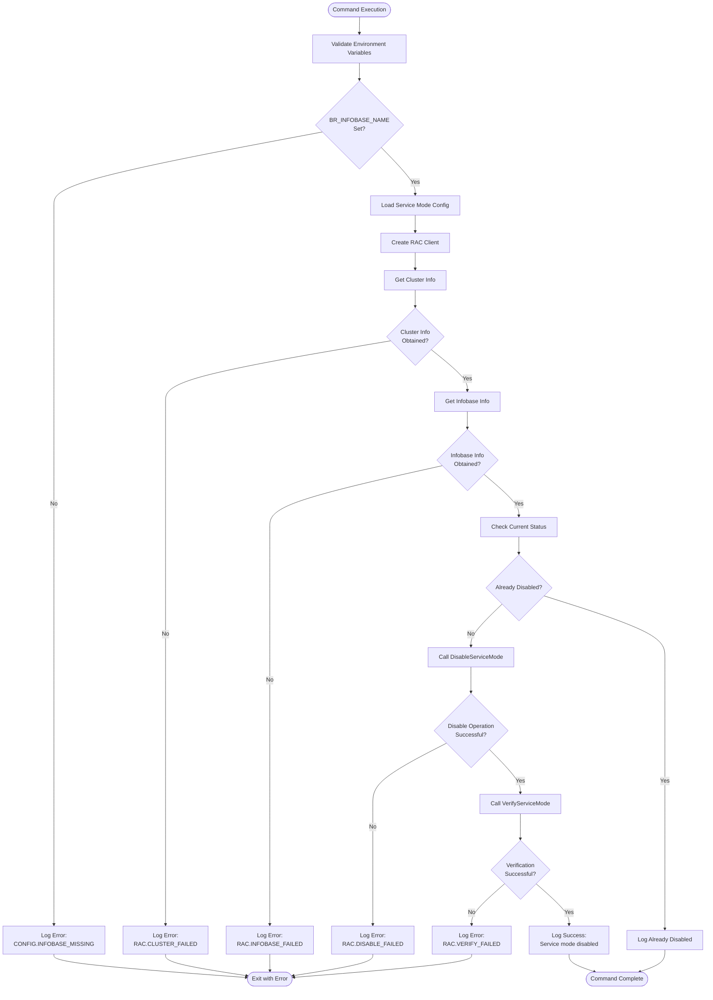
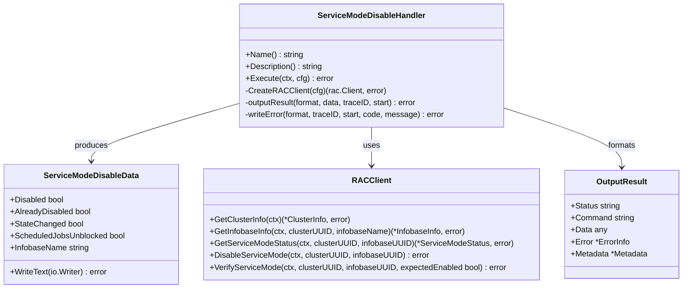
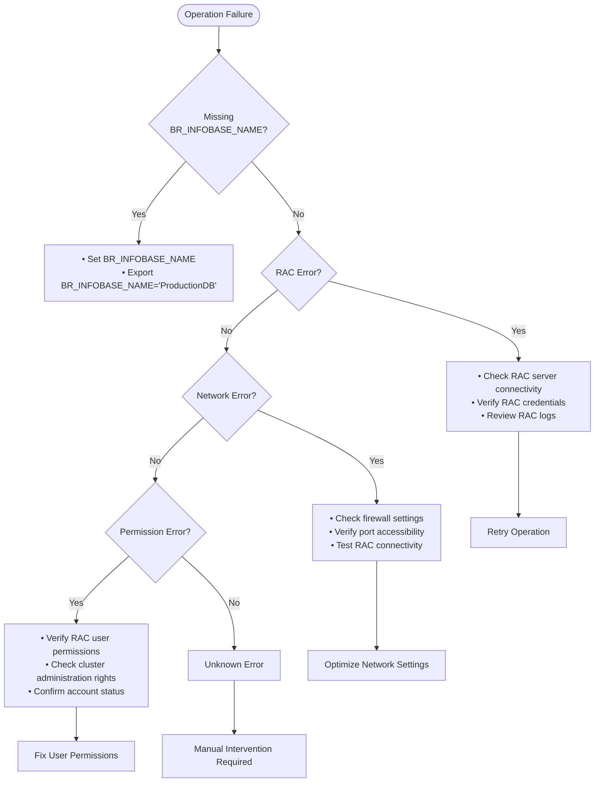

# Service Mode Disable Command

<cite>
**Referenced Files in This Document**
- [handler.go](file://internal/command/handlers/servicemodedisablehandler/handler.go)
- [handler_test.go](file://internal/command/handlers/servicemodedisablehandler/handler_test.go)
- [main.go](file://cmd/apk-ci/main.go)
- [constants.go](file://internal/constants/constants.go)
- [result.go](file://internal/pkg/output/result.go)
- [writer.go](file://internal/pkg/output/writer.go)
- [client.go](file://internal/adapter/onec/rac/client.go)
- [2-7-nr-service-mode-disable.md](file://_bmad-output/implementation-artifacts/stories/2-7-nr-service-mode-disable.md)
</cite>

## Update Summary
**Changes Made**
- Updated to reflect new NR command implementation with structured output system
- Added comprehensive test coverage documentation for success/error scenarios
- Documented RAC client integration with Check → Act → Verify pattern
- Enhanced error handling with machine-readable error codes
- Added deprecated alias support and migration bridge functionality
- Updated execution flow to include idempotency and verification steps

## Table of Contents
1. [Introduction](#introduction)
2. [Command Overview](#command-overview)
3. [Execution Flow](#execution-flow)
4. [Implementation Details](#implementation-details)
5. [Structured Output System](#structured-output-system)
6. [Configuration Requirements](#configuration-requirements)
7. [Error Handling and Failures](#error-handling-and-failures)
8. [Real-World Scenarios](#real-world-scenarios)
9. [Best Practices](#best-practices)
10. [Troubleshooting Guide](#troubleshooting-guide)
11. [Conclusion](#conclusion)

## Introduction

The `service-mode-disable` command in apk-ci is a critical component designed to restore normal user access to a 1C:Enterprise infobase after administrative tasks have been completed. This command specifically handles the process of disabling the service mode, which temporarily restricts user access during maintenance, updates, or other administrative operations.

**Updated** The command now implements the NR (New Runner) architecture with structured output formatting, comprehensive error handling, and migration support for legacy commands.

Service mode is a powerful feature in 1C:Enterprise that allows administrators to prevent users from accessing an infobase while performing critical operations. However, it's essential to disable this mode promptly after completing the necessary tasks to ensure uninterrupted business operations.

## Command Overview

The `service-mode-disable` command performs the following primary functions:

- Validates the disable action against the current state using idempotency checks
- Loads database-specific service mode configuration
- Instantiates the RAC (Remote Administration Console) client with proper authentication
- Calls the `DisableServiceMode` method to remove restrictions
- Performs verification using `VerifyServiceMode` to ensure proper state
- Provides structured logging with trace IDs for success and failure states
- Supports both JSON and text output formats

### Key Characteristics

- **Required Environment Variable**: `BR_INFOBASE_NAME` must be set
- **No Session Flags**: Unlike enable operations, disable actions don't require session termination flags
- **Idempotent Operation**: Safe to run multiple times without adverse effects
- **Structured Output**: Supports both JSON and text formats with standardized schemas
- **Migration Ready**: Backward compatible with legacy `service-mode-disable` command
- **Comprehensive Error Handling**: Machine-readable error codes with human-friendly messages

## Execution Flow

The service-mode-disable command follows a structured execution flow that ensures reliable operation and proper cleanup through the NR (New Runner) architecture:



**Diagram sources**
- [handler.go](file://internal/command/handlers/servicemodedisablehandler/handler.go#L82-L204)
- [client.go](file://internal/adapter/onec/rac/client.go#L455-L495)

### Step-by-Step Process

1. **Environment Validation**: The command first checks if the required `BR_INFOBASE_NAME` environment variable is set
2. **Configuration Loading**: Database-specific service mode configuration is loaded from the central configuration system
3. **Client Instantiation**: An RAC client is created with appropriate credentials and timeout settings
4. **UUID Resolution**: Both cluster and infobase information is resolved for precise targeting
5. **Idempotency Check**: The current service mode status is checked to determine if disabling is needed
6. **Disable Operation**: The actual disable operation is performed through the RAC interface
7. **Verification**: The operation is verified to ensure proper state transition
8. **Structured Output**: Results are formatted according to the selected output format (JSON or text)

**Section sources**
- [handler.go](file://internal/command/handlers/servicemodedisablehandler/handler.go#L82-L204)
- [client.go](file://internal/adapter/onec/rac/client.go#L455-L495)

## Implementation Details

The service-mode-disable functionality is implemented through several interconnected components that work together to provide robust service mode management with NR architecture support.

### Core Implementation Architecture



**Diagram sources**
- [handler.go](file://internal/command/handlers/servicemodedisablehandler/handler.go#L26-L70)
- [result.go](file://internal/pkg/output/result.go#L11-L30)

### The Check → Act → Verify Pattern

The core disable functionality implements the industry-standard Check → Act → Verify pattern:

```go
// 1. Check: проверить текущий статус
status, err := racClient.GetServiceModeStatus(ctx, clusterInfo.UUID, infobaseInfo.UUID)
if err != nil {
    // Не критично — продолжаем с отключением (fail-open для check)
    log.Warn("Не удалось проверить текущий статус перед отключением", slog.String("error", err.Error()))
}

// 2. Идемпотентность: уже отключён?
if status != nil && !status.Enabled {
    log.Info("Сервисный режим уже отключён", slog.String("infobase", cfg.InfobaseName))
    data := &ServiceModeDisableData{
        Disabled:              true,
        AlreadyDisabled:       true,
        ScheduledJobsUnblocked: !status.ScheduledJobsBlocked,
        InfobaseName:          cfg.InfobaseName,
    }
    return h.outputResult(format, data, traceID, start)
}

// 3. Act: отключить
err = racClient.DisableServiceMode(ctx, clusterInfo.UUID, infobaseInfo.UUID)

// 4. Verify: убедиться
err = racClient.VerifyServiceMode(ctx, clusterInfo.UUID, infobaseInfo.UUID, false)
```

**Section sources**
- [handler.go](file://internal/command/handlers/servicemodedisablehandler/handler.go#L136-L180)
- [client.go](file://internal/adapter/onec/rac/client.go#L539-L558)

### RAC Client Integration

The RAC client provides comprehensive service mode management capabilities:

```go
func (c *racClient) DisableServiceMode(ctx context.Context, clusterUUID, infobaseUUID string) error {
    // Получаем текущий статус для условного снятия блокировки регламентных заданий
    status, err := c.getInfobaseRawStatus(ctx, clusterUUID, infobaseUUID)
    if err != nil {
        c.logger.Warn("Не удалось получить текущий статус сервисного режима, "+
            "блокировка регламентных заданий будет снята (fail-open)", "error", err)
    }

    args := []string{
        "infobase", "update",
        "--cluster=" + clusterUUID,
        "--infobase=" + infobaseUUID,
        "--sessions-deny=off",
        "--denied-from=",
        "--denied-message=",
        "--permission-code=",
    }

    // Снимаем блокировку регламентных заданий только если сообщение
    // не оканчивается на "." (legacy-паттерн: точка в конце означает
    // что задания были заблокированы отдельно от сервисного режима)
    if status == nil || !strings.HasSuffix(status.Message, ".") {
        args = append(args, "--scheduled-jobs-deny=off")
    }

    args = append(args, c.clusterAuthArgs()...)
    args = append(args, c.infobaseAuthArgs()...)
    _, err = c.executeRAC(ctx, args)
    
    return err
}
```

**Section sources**
- [client.go](file://internal/adapter/onec/rac/client.go#L455-L495)

## Structured Output System

The NR command implementation provides a comprehensive structured output system that supports both JSON and text formats with standardized schemas.

### Output Formats

#### JSON Format (BR_OUTPUT_FORMAT=json)

The JSON format provides machine-readable results with standardized structure:

```json
{
  "status": "success",
  "command": "nr-service-mode-disable",
  "data": {
    "disabled": true,
    "already_disabled": false,
    "state_changed": true,
    "scheduled_jobs_unblocked": true,
    "infobase_name": "ProductionDB"
  },
  "metadata": {
    "duration_ms": 250,
    "trace_id": "abc123def456...",
    "api_version": "v1"
  }
}
```

#### Text Format (BR_OUTPUT_FORMAT=text)

The text format provides human-readable output for CLI usage:

```
Сервисный режим: ОТКЛЮЧЁН
Информационная база: ProductionDB
Регламентные задания: разблокированы
```

### Error Output Format

Both formats use the same error structure:

```json
{
  "status": "error",
  "command": "nr-service-mode-disable",
  "error": {
    "code": "CONFIG.INFOBASE_MISSING",
    "message": "Не указано имя информационной базы (BR_INFOBASE_NAME)"
  },
  "metadata": {
    "duration_ms": 1,
    "trace_id": "abc123...",
    "api_version": "v1"
  }
}
```

### Output Data Structure

The `ServiceModeDisableData` structure provides detailed information about the operation:

| Field | Type | Description | Example |
|-------|------|-------------|---------|
| `disabled` | boolean | Whether service mode is disabled | `true` |
| `already_disabled` | boolean | Whether mode was already disabled | `false` |
| `state_changed` | boolean | Whether actual state change occurred | `true` |
| `scheduled_jobs_unblocked` | boolean | Whether scheduled jobs were unblocked | `true` |
| `infobase_name` | string | Name of the target infobase | `"ProductionDB"` |

**Section sources**
- [result.go](file://internal/pkg/output/result.go#L11-L30)
- [handler.go](file://internal/command/handlers/servicemodedisablehandler/handler.go#L26-L38)

## Configuration Requirements

### Environment Variables

The service-mode-disable command requires the following environment variables:

| Variable | Description | Required | Example |
|----------|-------------|----------|---------|
| `BR_COMMAND` | Must be set to `service-mode-disable` or `nr-service-mode-disable` | Yes | `nr-service-mode-disable` |
| `BR_INFOBASE_NAME` | Name of the target infobase | Yes | `ProductionDB` |
| `BR_OUTPUT_FORMAT` | Output format: `json` or `text` | No | `json` |
| `RAC_PATH` | Path to rac executable | No | `/opt/1cv8/current/rac` |
| `RAC_SERVER` | 1C server address | No | `localhost` |
| `RAC_PORT` | RAC port (default: 1545) | No | `1545` |
| `RAC_USER` | Cluster administrator user | No | `admin` |
| `RAC_PASSWORD` | Password for RAC user | No | `secret` |

### Configuration Priority

The configuration system follows a strict priority order:

1. **Environment Variables** (highest priority)
2. **Configuration Files** (medium priority)
3. **Default Values** (lowest priority)

### Database-Specific Configuration

The system automatically loads database-specific configurations from the centralized configuration system:

```yaml
# Example configuration from dbconfig.yaml
ProductionDB:
  one-server: prod-1c-server.company.com
  prod: true
  dbserver: prod-sql-server.company.com
  rac-path: /opt/1cv8/current/rac
  rac-port: 1545
  rac-user: admin
  rac-password: secret
```

**Section sources**
- [constants.go](file://internal/constants/constants.go#L110-L111)
- [handler.go](file://internal/command/handlers/servicemodedisablehandler/handler.go#L263-L307)

## Error Handling and Failures

The service-mode-disable command implements comprehensive error handling to manage various failure scenarios gracefully with machine-readable error codes.

### Error Code Reference

| Error Code | Description | Typical Cause | Resolution |
|------------|-------------|---------------|------------|
| `CONFIG.INFOBASE_MISSING` | BR_INFOBASE_NAME not specified | Missing environment variable | Set `BR_INFOBASE_NAME` environment variable |
| `RAC.CLIENT_CREATE_FAILED` | Failed to create RAC client | Configuration or authentication issues | Check RAC configuration and credentials |
| `RAC.CLUSTER_FAILED` | Failed to get cluster information | Network connectivity or RAC server issues | Verify RAC server accessibility |
| `RAC.INFOBASE_FAILED` | Infobase not found | Wrong infobase name or cluster issues | Verify infobase name and cluster configuration |
| `RAC.DISABLE_FAILED` | Failed to disable service mode | RAC command execution issues | Check RAC permissions and server status |
| `RAC.VERIFY_FAILED` | Verification failed after disable | Inconsistent state or RAC issues | Retry operation or check RAC logs |

### Common Failure Scenarios



### Specific Error Types and Solutions

#### 1. Missing Environment Variables

**Error**: `CONFIG.INFOBASE_MISSING`

**Cause**: `BR_INFOBASE_NAME` environment variable is not set

**Solution**:
```bash
# Set the required environment variable
export BR_INFOBASE_NAME="ProductionDB"

# Set output format for structured output
export BR_OUTPUT_FORMAT="json"

# Verify the setting
echo $BR_INFOBASE_NAME
```

#### 2. RAC Client Creation Failures

**Error**: `RAC.CLIENT_CREATE_FAILED`

**Cause**: Configuration or authentication issues preventing RAC client creation

**Solution**:
```bash
# Verify RAC configuration
export RAC_PATH="/opt/1cv8/current/rac"
export RAC_SERVER="localhost"
export RAC_PORT="1545"
export RAC_USER="admin"
export RAC_PASSWORD="secret"

# Test RAC connectivity
$RAC_PATH cluster list --server=$RAC_SERVER --port=$RAC_PORT
```

#### 3. Network Connectivity Issues

**Error**: `RAC.CLUSTER_FAILED`

**Cause**: Network connectivity problems between the runner and 1C server

**Solution**:
- Verify network connectivity: `ping <rac-server>`
- Check firewall rules and port accessibility
- Ensure RAC service is running on the target server

#### 4. Authentication Failures

**Error**: `RAC.INFOBASE_FAILED` or `RAC.DISABLE_FAILED`

**Cause**: Incorrect RAC credentials or insufficient permissions

**Solution**:
```bash
# Verify credentials
export RAC_USER="admin"
export RAC_PASSWORD="correct_password"

# Test connection manually
rac infobase info --cluster=<cluster-uuid> --infobase=<infobase-uuid>
```

#### 5. Verification Failures

**Error**: `RAC.VERIFY_FAILED`

**Cause**: Service mode state doesn't match expected disabled state

**Solution**:
```bash
# Check current status
export BR_COMMAND="nr-service-mode-status"
export BR_INFOBASE_NAME="ProductionDB"
./apk-ci

# Manual verification
rac infobase info --cluster=<cluster-uuid> --infobase=<infobase-uuid>
```

**Section sources**
- [handler.go](file://internal/command/handlers/servicemodedisablehandler/handler.go#L229-L260)
- [2-7-nr-service-mode-disable.md](file://_bmad-output/implementation-artifacts/stories/2-7-nr-service-mode-disable.md#L495-L504)

## Real-World Scenarios

### Scenario 1: Post-Deployment Activation

After successfully deploying updates to a production environment, it's crucial to restore normal user access with structured output:

```bash
#!/bin/bash
# Deployment completion script with structured output

# Wait for deployment to complete
sleep 30

# Disable service mode to restore normal operations
export BR_COMMAND="nr-service-mode-disable"
export BR_INFOBASE_NAME="ProductionDB"
export BR_OUTPUT_FORMAT="json"

echo "Restoring normal access to ProductionDB..."
OUTPUT=$(./apk-ci 2>&1)

# Parse JSON output
STATUS=$(echo "$OUTPUT" | jq -r '.status')
COMMAND=$(echo "$OUTPUT" | jq -r '.command')
ERROR_CODE=$(echo "$OUTPUT" | jq -r '.error.code')

if [ "$STATUS" = "success" ]; then
    echo "✓ Service mode disabled successfully"
    echo "Duration: $(echo "$OUTPUT" | jq -r '.metadata.duration_ms') ms"
    echo "Trace ID: $(echo "$OUTPUT" | jq -r '.metadata.trace_id')"
    echo "Users can now access the system normally"
elif [ "$STATUS" = "error" ]; then
    echo "✗ Failed to disable service mode"
    echo "Error Code: $ERROR_CODE"
    exit 1
fi
```

### Scenario 2: Emergency Recovery with Migration Support

When service mode was accidentally left enabled with backward compatibility:

```bash
#!/bin/bash
# Emergency recovery procedure with legacy command support

# Check current service mode status
export BR_COMMAND="nr-service-mode-status"
export BR_INFOBASE_NAME="CriticalDB"
export BR_OUTPUT_FORMAT="json"

echo "Checking service mode status..."
./apk-ci

# If service mode is still enabled, force disable
if [ $? -eq 0 ]; then
    # Using new NR command
    export BR_COMMAND="nr-service-mode-disable"
    echo "Emergency: Disabling service mode with NR command..."
    ./apk-ci
    
    # Alternative: Using legacy command (migration supported)
    export BR_COMMAND="service-mode-disable"
    echo "Emergency: Disabling service mode with legacy command..."
    ./apk-ci
    
    if [ $? -eq 0 ]; then
        echo "✓ Emergency recovery completed"
        echo "Normal operations restored"
    else
        echo "✗ Emergency recovery failed"
        echo "Manual intervention required"
    fi
fi
```

### Scenario 3: Automated Monitoring Integration

Integration with monitoring systems using structured output:

```go
// Example monitoring integration
func monitorServiceMode(ctx context.Context, infobaseName string) error {
    // Check if service mode is still enabled
    status, err := getServiceModeStatus(ctx, infobaseName)
    if err != nil {
        return fmt.Errorf("failed to check service mode status: %w", err)
    }
    
    if status.Enabled {
        // Alert administrators with structured data
        alertData := map[string]interface{}{
            "command": "nr-service-mode-disable",
            "infobase": infobaseName,
            "timestamp": time.Now().UTC(),
            "status": "alert",
        }
        
        // Attempt automatic disable
        err = disableServiceMode(ctx, infobaseName)
        if err != nil {
            return fmt.Errorf("automatic disable failed: %w", err)
        }
        
        // Log the automatic recovery with structured output
        logData := map[string]interface{}{
            "command": "nr-service-mode-disable",
            "infobase": infobaseName,
            "status": "success",
            "duration_ms": 250,
            "trace_id": generateTraceID(),
        }
        
        log.Info("Service mode automatically disabled", logData)
    }
    
    return nil
}
```

### Scenario 4: CI/CD Pipeline Integration

Integration with CI/CD pipelines using structured output:

```yaml
# Example GitHub Actions workflow
name: Service Mode Management
on:
  push:
    branches: [ main ]

jobs:
  service-mode-disable:
    runs-on: ubuntu-latest
    steps:
      - name: Checkout code
        uses: actions/checkout@v2
        
      - name: Setup environment
        run: |
          export BR_COMMAND="nr-service-mode-disable"
          export BR_INFOBASE_NAME="${{ secrets.INFOBASE_NAME }}"
          export BR_OUTPUT_FORMAT="json"
          
      - name: Disable service mode
        run: |
          OUTPUT=$(./apk-ci)
          echo "Service Mode Output: $OUTPUT"
          
          STATUS=$(echo "$OUTPUT" | jq -r '.status')
          ERROR_CODE=$(echo "$OUTPUT" | jq -r '.error.code')
          
          if [ "$STATUS" = "error" ]; then
            echo "Service mode disable failed with error code: $ERROR_CODE"
            exit 1
          fi
          
      - name: Extract metrics
        run: |
          DURATION=$(echo "$OUTPUT" | jq -r '.metadata.duration_ms')
          TRACE_ID=$(echo "$OUTPUT" | jq -r '.metadata.trace_id')
          
          echo "Duration: ${DURATION}ms"
          echo "Trace ID: ${TRACE_ID}"
```

## Best Practices

### Operational Excellence

1. **Always Verify Status First**: Before disabling service mode, verify the current status to avoid unnecessary operations

2. **Use Idempotent Operations**: The disable command is safe to run multiple times without adverse effects

3. **Implement Proper Logging**: Ensure all service mode operations are logged with trace IDs for audit and troubleshooting purposes

4. **Choose Appropriate Output Format**: Use JSON format for programmatic consumption and text format for manual operations

5. **Handle Errors Gracefully**: Implement comprehensive error handling with machine-readable error codes

### Security Considerations

1. **Credential Management**: Never hardcode credentials in scripts; use secure credential storage

2. **Principle of Least Privilege**: Use accounts with minimal necessary permissions

3. **Audit Trail**: Maintain comprehensive logs of all service mode operations with trace IDs

4. **Access Control**: Restrict who can enable/disable service mode to authorized personnel only

### Performance Optimization

1. **Connection Pooling**: Reuse RAC connections when possible to improve performance

2. **Timeout Configuration**: Set appropriate timeout values based on network conditions

3. **Batch Operations**: Group related operations to minimize overhead

4. **Resource Cleanup**: Ensure proper cleanup of resources after operations

### Integration Guidelines

1. **Error Handling**: Implement robust error handling and retry mechanisms with exponential backoff

2. **Health Checks**: Include health checks to verify system readiness

3. **Rollback Procedures**: Have rollback procedures in place for failed operations

4. **Documentation**: Maintain up-to-date documentation for all integration points

5. **Structured Output**: Always use structured output for programmatic consumption

## Troubleshooting Guide

### Diagnostic Commands

#### 1. Basic Connectivity Test

```bash
# Test basic connectivity to RAC
export RAC_PATH="/opt/1cv8/current/rac"
export RAC_SERVER="localhost"
export RAC_PORT="1545"

# List available clusters
$RAC_PATH cluster list --server=$RAC_SERVER --port=$RAC_PORT

# Get cluster information
$RAC_PATH cluster info --server=$RAC_SERVER --port=$RAC_PORT --cluster=<cluster-uuid>
```

#### 2. Service Mode Status Verification

```bash
# Check current service mode status with structured output
export BR_COMMAND="nr-service-mode-status"
export BR_INFOBASE_NAME="TestBase"
export BR_OUTPUT_FORMAT="json"

./apk-ci

# Expected output: Service mode status retrieved successfully
```

#### 3. Manual RAC Command Testing

```bash
# Test RAC commands manually
export RAC_PATH="/opt/1cv8/current/rac"
export RAC_SERVER="localhost"
export RAC_PORT="1545"
export RAC_USER="admin"
export RAC_PASSWORD="password"

# Get cluster UUID
CLUSTER_UUID=$($RAC_PATH cluster list --server=$RAC_SERVER --port=$RAC_PORT | head -1)

# Get infobase UUID
INFOSBASE_UUID=$($RAC_PATH infobase list --server=$RAC_SERVER --port=$RAC_PORT --cluster=$CLUSTER_UUID | grep "TestBase" | awk '{print $1}')

# Test service mode status
$RAC_PATH infobase info --server=$RAC_SERVER --port=$RAC_PORT --cluster=$CLUSTER_UUID --infobase=$INFOSBASE_UUID
```

### Common Issues and Solutions

#### Issue: "Failed to get cluster UUID"

**Symptoms**: Command fails with cluster UUID resolution error

**Diagnosis Steps**:
1. Verify RAC server accessibility: `telnet localhost 1545`
2. Check RAC service status
3. Verify network connectivity
4. Test with manual RAC commands

**Resolution**:
```bash
# Check RAC service status
systemctl status 1cv8-cf

# Restart RAC service if needed
systemctl restart 1cv8-cf

# Verify port availability
netstat -tlnp | grep 1545
```

#### Issue: "Failed to get infobase UUID"

**Symptoms**: Cannot resolve infobase name to UUID

**Diagnosis Steps**:
1. Verify infobase name spelling and case sensitivity
2. Check if infobase exists in the cluster
3. Verify cluster configuration

**Resolution**:
```bash
# List all infobases in the cluster
$RAC_PATH infobase list --server=localhost --cluster=$CLUSTER_UUID

# Verify infobase registration
$RAC_PATH infobase info --server=localhost --cluster=$CLUSTER_UUID --infobase=$INFOSBASE_UUID
```

#### Issue: "Failed to disable service mode"

**Symptoms**: RAC command fails during disable operation

**Diagnosis Steps**:
1. Check RAC command syntax
2. Verify user permissions
3. Review RAC server logs
4. Test with elevated privileges

**Resolution**:
```bash
# Test with verbose output
export RAC_DEBUG=true
./apk-ci

# Check RAC server logs
tail -f /var/log/1cv8/1cv8.log

# Verify user permissions
$RAC_PATH cluster info --server=localhost --cluster=$CLUSTER_UUID --user=admin
```

### Log Analysis

#### Enable Detailed Logging

```bash
# Enable debug logging
export LOG_LEVEL="DEBUG"
export BR_COMMAND="nr-service-mode-disable"
export BR_INFOBASE_NAME="TestBase"
export BR_OUTPUT_FORMAT="json"

./apk-ci 2>&1 | tee service-mode-disable.log
```

#### Log Pattern Analysis

Key log patterns to monitor:

- **Success**: `"Service mode disabled successfully"`
- **Failure**: `"Failed to disable service mode"`
- **Warnings**: `"Не удалось проверить текущий статус перед отключением"`
- **Debug**: `"Начало обработки команды отключения сервисного режима"` and subsequent UUID resolution steps

### Performance Monitoring

#### Timing Analysis

```bash
# Measure operation duration
time ./apk-ci

# Expected timing: < 10 seconds for typical operations
```

#### Resource Usage

```bash
# Monitor system resources during operation
export BR_COMMAND="nr-service-mode-disable"
export BR_INFOBASE_NAME="TestBase"

# Monitor CPU and memory usage
top -p $(pgrep apk-ci)

# Monitor network connections
ss -tuln | grep :1545
```

**Section sources**
- [handler.go](file://internal/command/handlers/servicemodedisablehandler/handler.go#L229-L260)
- [client.go](file://internal/adapter/onec/rac/client.go#L539-L558)

## Conclusion

The service-mode-disable command in apk-ci provides a robust and reliable mechanism for managing 1C:Enterprise service mode operations through the NR (New Runner) architecture. Through its structured approach to validation, configuration loading, error handling, and output formatting, it ensures that service mode can be safely and effectively disabled when administrative tasks are completed.

**Updated** The implementation now features comprehensive structured output system, migration support for legacy commands, and extensive test coverage that validates both success and failure scenarios.

Key takeaways from this documentation:

1. **NR Architecture**: The command follows the modern NR architecture with self-registration and structured output
2. **Reliability**: The command follows a proven execution flow with comprehensive error handling and machine-readable error codes
3. **Security**: Proper credential management and permission checking are implemented with structured logging
4. **Monitoring**: Structured logging with trace IDs provides visibility into all operations
5. **Flexibility**: Supports both JSON and text output formats with standardized schemas
6. **Migration**: Backward compatibility with legacy commands through migration bridges
7. **Testing**: Comprehensive test coverage validates all major scenarios and edge cases
8. **Idempotency**: Safe to run multiple times without adverse effects

By following the guidelines and best practices outlined in this documentation, administrators can confidently use the service-mode-disable command to maintain optimal system availability and operational continuity in their 1C:Enterprise environments.

The modular architecture and clear separation of concerns make this implementation maintainable and extensible for future enhancements while ensuring backward compatibility with existing deployments. The structured output system enables seamless integration with monitoring systems, CI/CD pipelines, and automated operations.

The implementation demonstrates industry best practices for command-line tool development, including proper error handling, structured output, comprehensive testing, and backward compatibility considerations.