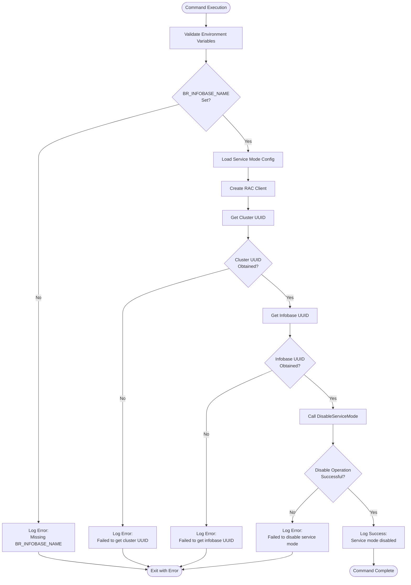
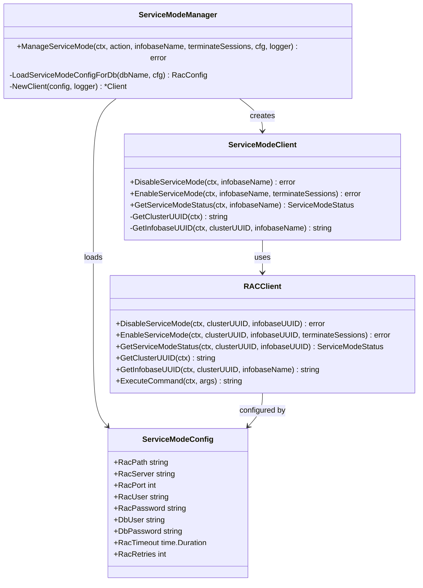
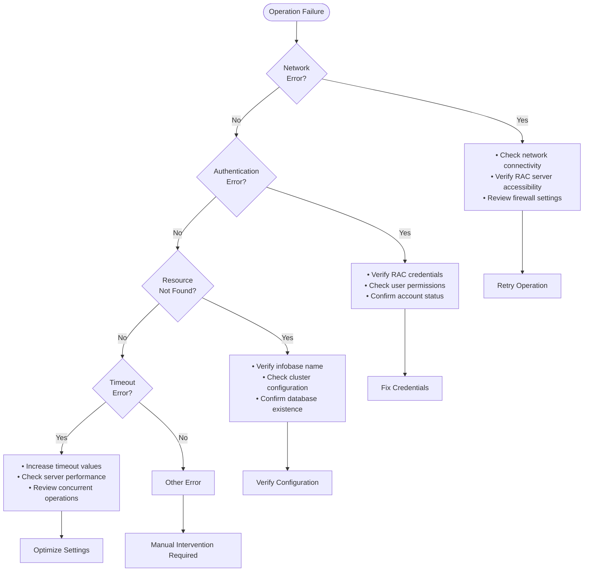

# Service Mode Disable Command

<cite>
**Referenced Files in This Document**
- [cmd/benadis-runner/main.go](file://cmd/benadis-runner/main.go)
- [internal/app/app.go](file://internal/app/app.go)
- [internal/servicemode/servicemode.go](file://internal/servicemode/servicemode.go)
- [internal/rac/service_mode.go](file://internal/rac/service_mode.go)
- [internal/constants/constants.go](file://internal/constants/constants.go)
- [config/dbconfig.yaml](file://config/dbconfig.yaml)
- [README.md](file://README.md)
- [old/service-mode-usage.md](file://old/service-mode-usage.md)
</cite>

## Table of Contents
1. [Introduction](#introduction)
2. [Command Overview](#command-overview)
3. [Execution Flow](#execution-flow)
4. [Implementation Details](#implementation-details)
5. [Configuration Requirements](#configuration-requirements)
6. [Error Handling and Failures](#error-handling-and-failures)
7. [Real-World Scenarios](#real-world-scenarios)
8. [Best Practices](#best-practices)
9. [Troubleshooting Guide](#troubleshooting-guide)
10. [Conclusion](#conclusion)

## Introduction

The `service-mode-disable` command in benadis-runner is a critical component designed to restore normal user access to a 1C:Enterprise infobase after administrative tasks have been completed. This command specifically handles the process of disabling the service mode, which temporarily restricts user access during maintenance, updates, or other administrative operations.

Service mode is a powerful feature in 1C:Enterprise that allows administrators to prevent users from accessing an infobase while performing critical operations. However, it's essential to disable this mode promptly after completing the necessary tasks to ensure uninterrupted business operations.

## Command Overview

The `service-mode-disable` command performs the following primary functions:

- Validates the disable action against the current state
- Loads database-specific service mode configuration
- Instantiates the RAC (Remote Administration Console) client
- Calls the `DisableServiceMode` method to remove restrictions
- Provides structured logging for success and failure states

### Key Characteristics

- **Required Environment Variable**: `BR_INFOBASE_NAME` must be set
- **No Session Flags**: Unlike enable operations, disable actions don't require session termination flags
- **Immediate Effect**: Service mode is disabled immediately upon successful completion
- **Idempotent Operation**: Safe to run multiple times without adverse effects

## Execution Flow

The service-mode-disable command follows a structured execution flow that ensures reliable operation and proper cleanup:



**Diagram sources**
- [internal/servicemode/servicemode.go](file://internal/servicemode/servicemode.go#L150-L247)
- [cmd/benadis-runner/main.go](file://cmd/benadis-runner/main.go#L81-L91)

### Step-by-Step Process

1. **Environment Validation**: The command first checks if the required `BR_INFOBASE_NAME` environment variable is set
2. **Configuration Loading**: Database-specific service mode configuration is loaded from the central configuration system
3. **Client Instantiation**: An RAC client is created with appropriate credentials and timeout settings
4. **UUID Resolution**: Both cluster and infobase UUIDs are resolved for precise targeting
5. **Disable Operation**: The actual disable operation is performed through the RAC interface
6. **Logging**: Structured logging captures the operation's success or failure

**Section sources**
- [cmd/benadis-runner/main.go](file://cmd/benadis-runner/main.go#L81-L91)
- [internal/app/app.go](file://internal/app/app.go#L273-L296)

## Implementation Details

The service-mode-disable functionality is implemented through several interconnected components that work together to provide robust service mode management.

### Core Implementation Architecture



**Diagram sources**
- [internal/servicemode/servicemode.go](file://internal/servicemode/servicemode.go#L15-L50)
- [internal/rac/service_mode.go](file://internal/rac/service_mode.go#L15-L50)

### The DisableServiceMode Method

The core disable functionality is implemented in the `DisableServiceMode` method of the ServiceModeClient:

```go
func (c *Client) DisableServiceMode(ctx context.Context, infobaseName string) error {
    if infobaseName == "" {
        return fmt.Errorf("infobase name cannot be empty")
    }

    c.logger.Debug("Disabling service mode", "infobase", infobaseName)

    // Get cluster UUID
    clusterUUID, err := c.racClient.GetClusterUUID(ctx)
    if err != nil {
        c.logger.Error("Failed to get cluster UUID for service mode disable", "error", err, "infobase", infobaseName)
        return fmt.Errorf("failed to get cluster UUID: %w", err)
    }

    // Get infobase UUID
    infobaseUUID, err := c.racClient.GetInfobaseUUID(ctx, clusterUUID, infobaseName)
    if err != nil {
        c.logger.Error("Failed to get infobase UUID for service mode disable", "error", err, "infobase", infobaseName, "clusterUUID", clusterUUID)
        return fmt.Errorf("failed to get infobase UUID: %w", err)
    }

    // Disable service mode
    err = c.racClient.DisableServiceMode(ctx, clusterUUID, infobaseUUID)
    if err != nil {
        c.logger.Error("Failed to disable service mode with RAC client", "error", err, "clusterUUID", clusterUUID, "infobaseUUID", infobaseUUID)
        return err
    }
    
    c.logger.Debug("Service mode disabled successfully with RAC client")
    return nil
}
```

**Section sources**
- [internal/servicemode/servicemode.go](file://internal/servicemode/servicemode.go#L325-L370)
- [internal/rac/service_mode.go](file://internal/rac/service_mode.go#L130-L170)

### RAC Command Generation

The RAC client generates specific commands for disabling service mode:

```go
func (c *Client) DisableServiceMode(ctx context.Context, clusterUUID, infobaseUUID string) error {
    // Get current status for comparison
    status, err := c.GetServiceModeStatus(ctx, clusterUUID, infobaseUUID)
    if err != nil {
        c.Logger.Warn("Failed to get current service mode status", "error", err)
    }

    args := []string{
        "infobase", "update",
        "--cluster=" + clusterUUID,
        "--infobase=" + infobaseUUID,
        "--denied-from=",
        "--denied-message=",
        "--permission-code=",
        "--sessions-deny=off",
    }

    // Add scheduled-jobs-deny=off only if current denied-message doesn't match expected pattern
    if status == nil || status.Message != fmt.Sprintf("\"%s.\"", constants.DefaultServiceModeMessage) {
        args = append(args, "--scheduled-jobs-deny=off")
    }

    _, err = c.ExecuteCommand(ctx, args...)
    if err != nil {
        return fmt.Errorf("failed to disable service mode: %w", err)
    }

    c.Logger.Debug("Service mode disabled successfully")
    return nil
}
```

**Section sources**
- [internal/rac/service_mode.go](file://internal/rac/service_mode.go#L130-L170)

## Configuration Requirements

### Environment Variables

The service-mode-disable command requires the following environment variables:

| Variable | Description | Required | Example |
|----------|-------------|----------|---------|
| `BR_COMMAND` | Must be set to `service-mode-disable` | Yes | `service-mode-disable` |
| `BR_INFOBASE_NAME` | Name of the target infobase | Yes | `ProductionDB` |
| `RAC_PATH` | Path to rac executable | No | `/opt/1cv8/current/rac` |
| `RAC_SERVER` | 1C server address | No | `localhost` |
| `RAC_PORT` | RAC port (default: 1545) | No | `1545` |
| `RAC_USER` | Cluster administrator user | No | `admin` |
| `RAC_PASSWORD` | Password for RAC user | No | `secret` |

### Configuration Priority

The configuration system follows a strict priority order:

1. **Environment Variables** (highest priority)
2. **Configuration Files** (medium priority)
3. **Default Values** (lowest priority)

### Database-Specific Configuration

The system automatically loads database-specific configurations from the centralized configuration system:

```yaml
# Example configuration from dbconfig.yaml
ProductionDB:
  one-server: prod-1c-server.company.com
  prod: true
  dbserver: prod-sql-server.company.com
  rac-path: /opt/1cv8/current/rac
  rac-port: 1545
  rac-user: admin
  rac-password: secret
```

**Section sources**
- [config/dbconfig.yaml](file://config/dbconfig.yaml#L1-L100)
- [internal/servicemode/servicemode.go](file://internal/servicemode/servicemode.go#L200-L220)

## Error Handling and Failures

The service-mode-disable command implements comprehensive error handling to manage various failure scenarios gracefully.

### Common Failure Scenarios



### Specific Error Types and Solutions

#### 1. Missing Environment Variables

**Error**: `Не указано имя информационной базы`

**Cause**: `BR_INFOBASE_NAME` environment variable is not set

**Solution**:
```bash
# Set the required environment variable
export BR_INFOBASE_NAME="ProductionDB"

# Verify the setting
echo $BR_INFOBASE_NAME
```

#### 2. Network Connectivity Issues

**Error**: RAC command failed with network timeout

**Cause**: Network connectivity problems between the runner and 1C server

**Solution**:
- Verify network connectivity: `ping <rac-server>`
- Check firewall rules and port accessibility
- Ensure RAC service is running on the target server

#### 3. Authentication Failures

**Error**: Access denied or invalid credentials

**Cause**: Incorrect RAC credentials or insufficient permissions

**Solution**:
```bash
# Verify credentials
export RAC_USER="admin"
export RAC_PASSWORD="correct_password"

# Test connection manually
rac infobase info --cluster=<cluster-uuid> --infobase=<infobase-uuid>
```

#### 4. Resource Not Found

**Error**: Infobase UUID not found or cluster UUID not found

**Cause**: Specified infobase doesn't exist or cluster is not accessible

**Solution**:
- Verify infobase name spelling and case sensitivity
- Check if the infobase is properly registered in the cluster
- Ensure the cluster is running and accessible

#### 5. Permission Issues

**Error**: Insufficient privileges to modify service mode

**Cause**: RAC user lacks necessary permissions

**Solution**:
- Grant cluster administration permissions to the RAC user
- Verify the user has rights to modify infobase settings
- Check for any restrictive policies or groups

**Section sources**
- [cmd/benadis-runner/main.go](file://cmd/benadis-runner/main.go#L81-L91)
- [internal/servicemode/servicemode.go](file://internal/servicemode/servicemode.go#L325-L370)

## Real-World Scenarios

### Scenario 1: Post-Deployment Activation

After successfully deploying updates to a production environment, it's crucial to restore normal user access:

```bash
#!/bin/bash
# Deployment completion script

# Wait for deployment to complete
sleep 30

# Disable service mode to restore normal operations
export BR_COMMAND="service-mode-disable"
export BR_INFOBASE_NAME="ProductionDB"

echo "Restoring normal access to ProductionDB..."
./benadis-runner

if [ $? -eq 0 ]; then
    echo "✓ Service mode disabled successfully"
    echo "Users can now access the system normally"
else
    echo "✗ Failed to disable service mode"
    exit 1
fi
```

### Scenario 2: Emergency Recovery

When service mode was accidentally left enabled:

```bash
#!/bin/bash
# Emergency recovery procedure

# Check current service mode status
export BR_COMMAND="service-mode-status"
export BR_INFOBASE_NAME="CriticalDB"

echo "Checking service mode status..."
./benadis-runner

# If service mode is still enabled, force disable
if [ $? -eq 0 ]; then
    export BR_COMMAND="service-mode-disable"
    echo "Emergency: Disabling service mode..."
    ./benadis-runner
    
    if [ $? -eq 0 ]; then
        echo "✓ Emergency recovery completed"
        echo "Normal operations restored"
    else
        echo "✗ Emergency recovery failed"
        echo "Manual intervention required"
    fi
fi
```

### Scenario 3: Scheduled Maintenance Window

During planned maintenance windows:

```bash
#!/bin/bash
# Maintenance window automation

# Define maintenance parameters
INFOBASE_NAME="MaintenanceDB"
MAINTENANCE_MESSAGE="Scheduled maintenance window"

# Enable service mode (from previous command)
export BR_COMMAND="service-mode-enable"
export BR_INFOBASE_NAME="$INFOBASE_NAME"
export BR_SERVICE_MODE_MESSAGE="$MAINTENANCE_MESSAGE"
export BR_TERMINATE_SESSIONS="true"

echo "Entering maintenance window..."
./benadis-runner

# Perform maintenance tasks
./perform-maintenance-tasks.sh

# Disable service mode
export BR_COMMAND="service-mode-disable"
echo "Exiting maintenance window..."
./benadis-runner

echo "Maintenance completed successfully"
```

### Scenario 4: Automated Monitoring Integration

Integration with monitoring systems:

```go
// Example monitoring integration
func monitorServiceMode(ctx context.Context, infobaseName string) error {
    // Check if service mode is still enabled
    status, err := getServiceModeStatus(ctx, infobaseName)
    if err != nil {
        return fmt.Errorf("failed to check service mode status: %w", err)
    }
    
    if status.Enabled {
        // Alert administrators
        sendAlert(fmt.Sprintf("Service mode still enabled for %s", infobaseName))
        
        // Attempt automatic disable
        err = disableServiceMode(ctx, infobaseName)
        if err != nil {
            return fmt.Errorf("automatic disable failed: %w", err)
        }
        
        // Log the automatic recovery
        log.Info("Service mode automatically disabled", "infobase", infobaseName)
    }
    
    return nil
}
```

## Best Practices

### Operational Excellence

1. **Always Verify Status First**: Before disabling service mode, verify the current status to avoid unnecessary operations

2. **Use Idempotent Operations**: The disable command is safe to run multiple times without adverse effects

3. **Monitor Service Mode Duration**: Track how long service mode remains enabled to identify potential issues

4. **Implement Proper Logging**: Ensure all service mode operations are logged for audit and troubleshooting purposes

### Security Considerations

1. **Credential Management**: Never hardcode credentials in scripts; use secure credential storage

2. **Principle of Least Privilege**: Use accounts with minimal necessary permissions

3. **Audit Trail**: Maintain comprehensive logs of all service mode operations

4. **Access Control**: Restrict who can enable/disable service mode to authorized personnel only

### Performance Optimization

1. **Connection Pooling**: Reuse RAC connections when possible to improve performance

2. **Timeout Configuration**: Set appropriate timeout values based on network conditions

3. **Batch Operations**: Group related operations to minimize overhead

4. **Resource Cleanup**: Ensure proper cleanup of resources after operations

### Integration Guidelines

1. **Error Handling**: Implement robust error handling and retry mechanisms

2. **Health Checks**: Include health checks to verify system readiness

3. **Rollback Procedures**: Have rollback procedures in place for failed operations

4. **Documentation**: Maintain up-to-date documentation for all integration points

## Troubleshooting Guide

### Diagnostic Commands

#### 1. Basic Connectivity Test

```bash
# Test basic connectivity to RAC
export RAC_PATH="/opt/1cv8/current/rac"
export RAC_SERVER="localhost"
export RAC_PORT="1545"

# List available clusters
$RAC_PATH cluster list --server=$RAC_SERVER --port=$RAC_PORT

# Get cluster information
$RAC_PATH cluster info --server=$RAC_SERVER --port=$RAC_PORT --cluster=<cluster-uuid>
```

#### 2. Service Mode Status Verification

```bash
# Check current service mode status
export BR_COMMAND="service-mode-status"
export BR_INFOBASE_NAME="TestBase"

./benadis-runner

# Expected output: Service mode status retrieved successfully
```

#### 3. Manual RAC Command Testing

```bash
# Test RAC commands manually
export RAC_PATH="/opt/1cv8/current/rac"
export RAC_SERVER="localhost"
export RAC_PORT="1545"
export RAC_USER="admin"
export RAC_PASSWORD="password"

# Get cluster UUID
CLUSTER_UUID=$($RAC_PATH cluster list --server=$RAC_SERVER --port=$RAC_PORT | head -1)

# Get infobase UUID
INFOSBASE_UUID=$($RAC_PATH infobase list --server=$RAC_SERVER --port=$RAC_PORT --cluster=$CLUSTER_UUID | grep "TestBase" | awk '{print $1}')

# Test service mode status
$RAC_PATH infobase info --server=$RAC_SERVER --port=$RAC_PORT --cluster=$CLUSTER_UUID --infobase=$INFOSBASE_UUID
```

### Common Issues and Solutions

#### Issue: "Failed to get cluster UUID"

**Symptoms**: Command fails with cluster UUID resolution error

**Diagnosis Steps**:
1. Verify RAC server accessibility: `telnet localhost 1545`
2. Check RAC service status
3. Verify network connectivity
4. Test with manual RAC commands

**Resolution**:
```bash
# Check RAC service status
systemctl status 1cv8-cf

# Restart RAC service if needed
systemctl restart 1cv8-cf

# Verify port availability
netstat -tlnp | grep 1545
```

#### Issue: "Failed to get infobase UUID"

**Symptoms**: Cannot resolve infobase name to UUID

**Diagnosis Steps**:
1. Verify infobase name spelling and case sensitivity
2. Check if infobase exists in the cluster
3. Verify cluster configuration

**Resolution**:
```bash
# List all infobases in the cluster
$RAC_PATH infobase list --server=localhost --cluster=$CLUSTER_UUID

# Verify infobase registration
$RAC_PATH infobase info --server=localhost --cluster=$CLUSTER_UUID --infobase=$INFOSBASE_UUID
```

#### Issue: "Failed to disable service mode"

**Symptoms**: RAC command fails during disable operation

**Diagnosis Steps**:
1. Check RAC command syntax
2. Verify user permissions
3. Review RAC server logs
4. Test with elevated privileges

**Resolution**:
```bash
# Test with verbose output
export RAC_DEBUG=true
./benadis-runner

# Check RAC server logs
tail -f /var/log/1cv8/1cv8.log

# Verify user permissions
$RAC_PATH cluster info --server=localhost --cluster=$CLUSTER_UUID --user=admin
```

### Log Analysis

#### Enable Detailed Logging

```bash
# Enable debug logging
export LOG_LEVEL="DEBUG"
export BR_COMMAND="service-mode-disable"
export BR_INFOBASE_NAME="TestBase"

./benadis-runner 2>&1 | tee service-mode-disable.log
```

#### Log Pattern Analysis

Key log patterns to monitor:

- **Success**: `"Service mode disabled successfully"`
- **Failure**: `"Failed to disable service mode"`
- **Warnings**: `"Failed to get current service mode status"`
- **Debug**: `"Disabling service mode"` and subsequent UUID resolution steps

### Performance Monitoring

#### Timing Analysis

```bash
# Measure operation duration
time ./benadis-runner

# Expected timing: < 10 seconds for typical operations
```

#### Resource Usage

```bash
# Monitor system resources during operation
export BR_COMMAND="service-mode-disable"
export BR_INFOBASE_NAME="TestBase"

# Monitor CPU and memory usage
top -p $(pgrep benadis-runner)

# Monitor network connections
ss -tuln | grep :1545
```

**Section sources**
- [internal/servicemode/servicemode.go](file://internal/servicemode/servicemode.go#L325-L370)
- [internal/rac/service_mode.go](file://internal/rac/service_mode.go#L130-L170)

## Conclusion

The service-mode-disable command in benadis-runner provides a robust and reliable mechanism for managing 1C:Enterprise service mode operations. Through its structured approach to validation, configuration loading, and error handling, it ensures that service mode can be safely and effectively disabled when administrative tasks are completed.

Key takeaways from this documentation:

1. **Reliability**: The command follows a proven execution flow with comprehensive error handling
2. **Security**: Proper credential management and permission checking are implemented
3. **Monitoring**: Structured logging provides visibility into all operations
4. **Flexibility**: Supports various deployment scenarios and integration patterns
5. **Safety**: Idempotent operations and validation prevent accidental disruptions

By following the guidelines and best practices outlined in this documentation, administrators can confidently use the service-mode-disable command to maintain optimal system availability and operational continuity in their 1C:Enterprise environments.

The modular architecture and clear separation of concerns make this implementation maintainable and extensible for future enhancements while ensuring backward compatibility with existing deployments.