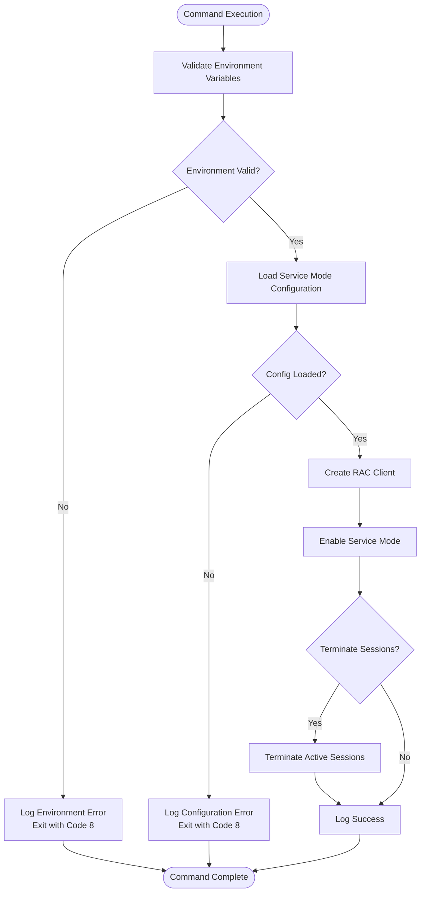
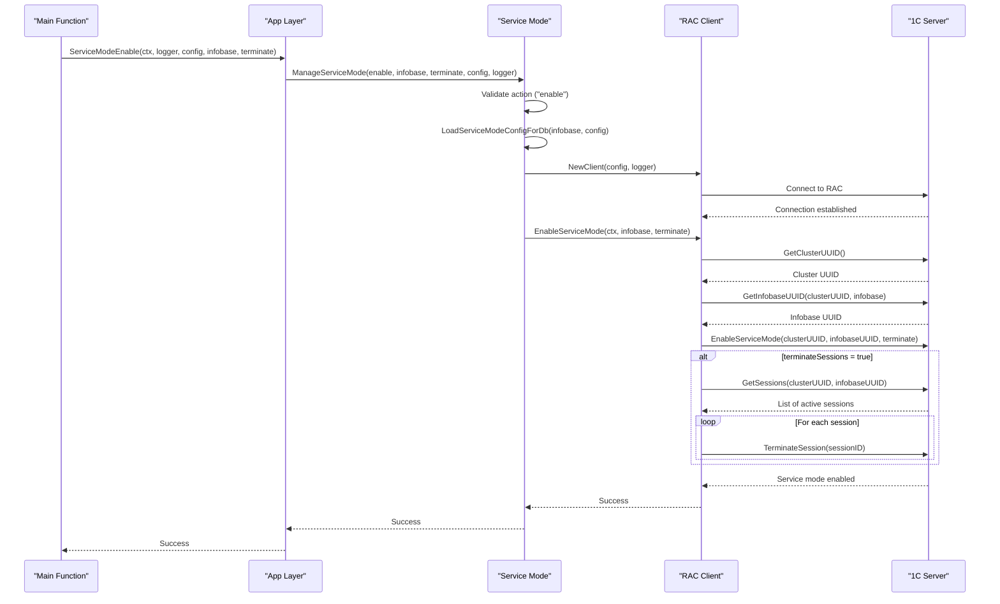
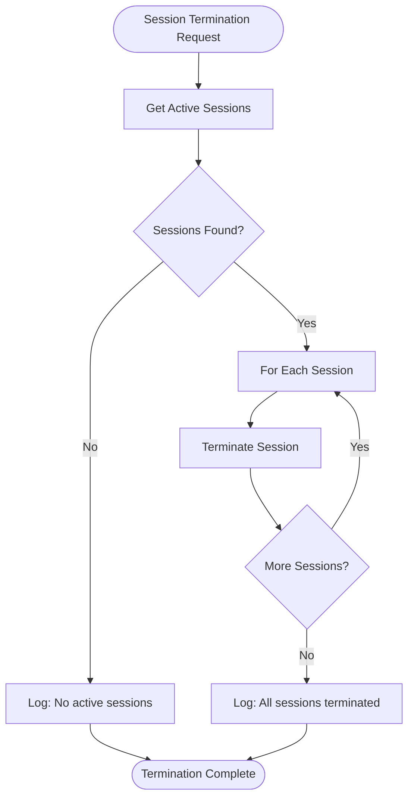

Now I have gathered sufficient information to create comprehensive documentation for the service-mode-enable command. Let me create the documentation:

<docs>
# Enable Service Mode

<cite>
**Referenced Files in This Document**
- [cmd/benadis-runner/main.go](file://cmd/benadis-runner/main.go)
- [internal/app/app.go](file://internal/app/app.go)
- [internal/servicemode/servicemode.go](file://internal/servicemode/servicemode.go)
- [internal/rac/service_mode.go](file://internal/rac/service_mode.go)
- [internal/config/config.go](file://internal/config/config.go)
- [internal/constants/constants.go](file://internal/constants/constants.go)
- [internal/servicemode/servicemode_test.go](file://internal/servicemode/servicemode_test.go)
- [old/service-mode-usage.md](file://old/service-mode-usage.md)
- [README.md](file://README.md)
</cite>

## Table of Contents
1. [Introduction](#introduction)
2. [Command Overview](#command-overview)
3. [Environment Variables](#environment-variables)
4. [Internal Workflow](#internal-workflow)
5. [Code Implementation](#code-implementation)
6. [Integration with 1C Server](#integration-with-1c-server)
7. [Session Management](#session-management)
8. [Error Handling](#error-handling)
9. [Use Cases](#use-cases)
10. [Troubleshooting](#troubleshooting)
11. [Best Practices](#best-practices)

## Introduction

The `service-mode-enable` command in benadis-runner is a critical component designed to manage service mode operations on 1C:Enterprise infobases. Service mode restricts user access to prevent conflicts during administrative operations such as configuration updates, database migrations, or maintenance procedures. This command provides a robust, automated solution for controlling access to production systems while ensuring data integrity and operational continuity.

Service mode acts as a protective barrier that prevents users from accessing the system during critical maintenance windows, allowing administrators to perform updates without risking data corruption or concurrent modifications. The implementation follows industry best practices for secure system administration and provides comprehensive logging and error handling capabilities.

## Command Overview

The `service-mode-enable` command enables service mode on a specified 1C:Enterprise infobase by blocking user access and optionally terminating active sessions. This operation is essential for maintaining system stability during configuration changes, database updates, or other maintenance activities.

### Key Features

- **Access Restriction**: Blocks user connections to prevent concurrent modifications
- **Session Management**: Optionally terminates active user sessions
- **Message Customization**: Allows setting custom maintenance messages
- **Structured Logging**: Comprehensive logging with debug, info, and error levels
- **Error Recovery**: Robust error handling with detailed diagnostic information

### Command Execution Flow



**Diagram sources**
- [cmd/benadis-runner/main.go](file://cmd/benadis-runner/main.go#L50-L65)
- [internal/app/app.go](file://internal/app/app.go#L140-L155)

**Section sources**
- [cmd/benadis-runner/main.go](file://cmd/benadis-runner/main.go#L50-L65)
- [internal/constants/constants.go](file://internal/constants/constants.go#L65-L67)

## Environment Variables

The service-mode-enable command relies on several environment variables to configure its operation. These variables provide flexibility in deployment scenarios while maintaining security through controlled configuration.

### Required Variables

**BR_INFOBASE_NAME**
- **Purpose**: Specifies the target 1C:Enterprise infobase name
- **Type**: String
- **Required**: Yes
- **Example**: `export BR_INFOBASE_NAME="ProductionDB"`
- **Validation**: Must not be empty; triggers exit code 8 if missing

### Optional Variables

**BR_TERMINATE_SESSIONS**
- **Purpose**: Controls whether active user sessions should be terminated
- **Type**: Boolean string (`true`/`false`)
- **Default**: `false`
- **Example**: `export BR_TERMINATE_SESSIONS="true"`
- **Behavior**: When set to `true`, all active sessions are terminated before enabling service mode

**BR_COMMAND**
- **Purpose**: Specifies the operation type
- **Type**: String
- **Value**: `service-mode-enable`
- **Example**: `export BR_COMMAND="service-mode-enable"`

### RAC Configuration Variables

The command integrates with Remote Administration Console (RAC) for 1C:Enterprise server management. These variables configure the RAC connection:

- **RAC_PATH**: Path to rac executable
- **RAC_SERVER**: 1C:Enterprise server address
- **RAC_PORT**: RAC port (default: 1545)
- **RAC_USER**: RAC administrator username
- **RAC_PASSWORD**: RAC administrator password
- **RAC_TIMEOUT**: Connection timeout in seconds
- **RAC_RETRIES**: Number of retry attempts

**Section sources**
- [cmd/benadis-runner/main.go](file://cmd/benadis-runner/main.go#L50-L65)
- [internal/config/config.go](file://internal/config/config.go#L150-L160)

## Internal Workflow

The service-mode-enable command follows a structured workflow that ensures reliable operation and comprehensive error handling. The process involves multiple layers of validation, configuration loading, and RAC communication.

### Step-by-Step Process



**Diagram sources**
- [internal/servicemode/servicemode.go](file://internal/servicemode/servicemode.go#L170-L220)
- [internal/servicemode/servicemode.go](file://internal/servicemode/servicemode.go#L320-L380)

### Configuration Loading Process

The configuration loading process extracts RAC settings from the application configuration:

1. **Database Lookup**: Searches `dbconfig.yaml` for the specified infobase
2. **App Configuration**: Retrieves RAC settings from `app.yaml`
3. **Secret Configuration**: Loads credentials from `secret.yaml`
4. **Validation**: Ensures all required configuration values are present

### Client Initialization

The RAC client initialization creates a connection wrapper with the following characteristics:

- **Connection Parameters**: Host, port, credentials, timeouts
- **Logging Integration**: Structured logging through SlogLogger
- **Error Handling**: Built-in retry mechanisms
- **Resource Management**: Proper cleanup and connection pooling

**Section sources**
- [internal/servicemode/servicemode.go](file://internal/servicemode/servicemode.go#L170-L220)
- [internal/servicemode/servicemode.go](file://internal/servicemode/servicemode.go#L280-L320)

## Code Implementation

The service-mode-enable functionality is implemented through a layered architecture that separates concerns and promotes maintainability. The implementation follows Go best practices for error handling, logging, and modular design.

### Core Implementation Details

#### Main Entry Point

The main entry point in `cmd/benadis-runner/main.go` handles command-line argument processing and environment validation:

```go
case constants.ActServiceModeEnable:
    // Получаем имя информационной базы из переменной окружения
    infobaseName := cfg.InfobaseName
    if infobaseName == "" {
        l.Error("Не указано имя информационной базы",
            slog.String("env_var", "BR_INFOBASE_NAME"),
            slog.String(constants.MsgErrProcessing, constants.MsgAppExit),
        )
        os.Exit(8)
    }
    terminateSessions := cfg.TerminateSessions
    err = app.ServiceModeEnable(&ctx, l, cfg, infobaseName, terminateSessions)
    if err != nil {
        l.Error("Ошибка включения сервисного режима",
            slog.String("infobase", infobaseName),
            slog.String("error", err.Error()),
            slog.String(constants.MsgErrProcessing, constants.MsgAppExit),
        )
        os.Exit(8)
    }
    l.Info("Сервисный режим успешно включен", "infobase", infobaseName)
```

#### Application Layer

The application layer provides the primary interface for service mode operations:

```go
func ServiceModeEnable(ctx *context.Context, l *slog.Logger, cfg *config.Config, infobaseName string, terminateSessions bool) error {
    // Создаем логгер для servicemode
    logger := &servicemode.SlogLogger{Logger: l}

    // Выполняем операцию включения сервисного режима
    err := servicemode.ManageServiceMode(*ctx, "enable", infobaseName, terminateSessions, cfg, logger)
    if err != nil {
        l.Error("Failed to enable service mode", "error", err, "infobase", infobaseName)
        return err
    }

    l.Info("Service mode enabled successfully", "infobase", infobaseName)
    return nil
}
```

#### Service Mode Management

The core service mode management logic resides in the `ManageServiceMode` function:

```go
func ManageServiceMode(ctx context.Context, action, infobaseName string, terminateSessions bool, cfg *config.Config, logger Logger) error {
    // Сначала проверяем валидность action
    switch action {
    case "enable", "disable", "status":
        // Валидные действия, продолжаем
    default:
        logger.Error("Unknown service mode action", "action", action)
        return fmt.Errorf("unknown action: %s", action)
    }

    config, err := LoadServiceModeConfigForDb(infobaseName, cfg)
    if err != nil {
        return err
    }

    client := NewClient(config, logger)

    switch action {
    case "enable":
        logger.Debug("Executing enable service mode action")
        err := client.EnableServiceMode(ctx, infobaseName, terminateSessions)
        if err != nil {
            logger.Error("Failed to enable service mode",
                "error", err,
                "infobaseName", infobaseName,
                "terminateSessions", terminateSessions)
            return err
        }
        logger.Info("Service mode enabled successfully",
            "infobaseName", infobaseName,
            "terminateSessions", terminateSessions)
        return nil
    // ... other cases
    }
}
```

### Logging Patterns

The implementation uses structured logging with different severity levels:

#### Debug Logging
```go
logger.Debug("Executing enable service mode action")
logger.Debug("Getting cluster UUID for service mode operation")
logger.Debug("Enabling service mode with RAC client",
    "clusterUUID", clusterUUID,
    "infobaseUUID", infobaseUUID,
    "terminateSessions", terminateSessions)
```

#### Information Logging
```go
logger.Info("Service mode enabled successfully",
    "infobaseName", infobaseName,
    "terminateSessions", terminateSessions)
logger.Info("Service mode disabled successfully", "infobaseName", infobaseName)
```

#### Error Logging
```go
logger.Error("Failed to enable service mode",
    "error", err,
    "infobaseName", infobaseName,
    "terminateSessions", terminateSessions)
logger.Error("Failed to get cluster UUID for service mode",
    "error", err,
    "infobase", infobaseName)
```

**Section sources**
- [cmd/benadis-runner/main.go](file://cmd/benadis-runner/main.go#L50-L65)
- [internal/app/app.go](file://internal/app/app.go#L140-L155)
- [internal/servicemode/servicemode.go](file://internal/servicemode/servicemode.go#L170-L220)

## Integration with 1C Server

The service-mode-enable command integrates with 1C:Enterprise servers through the Remote Administration Console (RAC) protocol. This integration provides secure, programmatic access to server management functions while maintaining compatibility with various 1C:Enterprise versions.

### RAC Protocol Implementation

The RAC integration is implemented through the `rac.Client` structure, which provides methods for:

- **Cluster Management**: Getting cluster UUID and managing cluster-wide settings
- **Infobase Operations**: Managing individual infobase configurations and states
- **Session Control**: Monitoring and controlling user sessions
- **Command Execution**: Running RAC commands with proper error handling

### Command Construction

The service mode enable operation constructs RAC commands with specific parameters:

```go
args := []string{
    "infobase", "update",
    "--cluster=" + clusterUUID,
    "--infobase=" + infobaseUUID,
    "--denied-from=" + time.Now().Format("2006-01-02T15:04:05"),
    "--denied-message=" + message,
    "--permission-code=" + "ServiceMode",
    "--sessions-deny=on",
    "--scheduled-jobs-deny=on",
}
```

### Authentication and Security

The RAC client supports multiple authentication methods:

- **Basic Authentication**: Username/password for cluster and infobase access
- **Credential Injection**: Secure credential passing through command-line arguments
- **Connection Security**: Support for encrypted connections where available

### Error Handling Integration

The RAC integration includes comprehensive error handling:

```go
_, err = c.ExecuteCommand(ctx, args...)
if err != nil {
    return fmt.Errorf("failed to enable service mode: %w", err)
}
```

**Section sources**
- [internal/rac/service_mode.go](file://internal/rac/service_mode.go#L30-L80)
- [internal/servicemode/servicemode.go](file://internal/servicemode/servicemode.go#L320-L380)

## Session Management

The service-mode-enable command provides sophisticated session management capabilities that allow administrators to control user access during maintenance operations. The session management system operates at multiple levels to ensure comprehensive access control.

### Session Termination Process

When the `BR_TERMINATE_SESSIONS` flag is set to `true`, the system performs the following sequence:



**Diagram sources**
- [internal/rac/service_mode.go](file://internal/rac/service_mode.go#L380-L420)

### Session Information Structure

Each active session is represented by a `SessionInfo` structure containing:

- **SessionID**: Unique identifier for the session
- **UserName**: User account name
- **AppID**: Application identifier
- **StartedAt**: Session creation timestamp
- **LastActiveAt**: Last activity timestamp

### Session Termination Logic

The session termination process includes several safety checks:

1. **Session Validation**: Verifies session existence and accessibility
2. **Grace Period**: Respects session lifecycle and completion
3. **Error Handling**: Manages partial failures gracefully
4. **Logging**: Records all termination attempts and outcomes

### Impact on Connected Users

When service mode is enabled with session termination:

- **Immediate Disconnection**: Users receive immediate disconnection notifications
- **Data Loss Prevention**: Graceful session closure prevents data corruption
- **Reconnection Blocking**: New connections are blocked until service mode is disabled
- **Maintenance Messages**: Users see configured maintenance messages

### Session Status Monitoring

The system continuously monitors session status during service mode operations:

```go
// Получаем количество активных сессий
sessions, err := c.GetSessions(ctx, clusterUUID, infobaseUUID)
if err != nil {
    c.Logger.Warn("Failed to get active sessions count", "error", err)
} else {
    status.ActiveSessions = len(sessions)
}
```

**Section sources**
- [internal/rac/service_mode.go](file://internal/rac/service_mode.go#L380-L458)
- [internal/servicemode/servicemode.go](file://internal/servicemode/servicemode.go#L380-L440)

## Error Handling

The service-mode-enable command implements comprehensive error handling to ensure reliable operation and meaningful diagnostics. The error handling strategy covers configuration validation, network connectivity, authentication, and operational failures.

### Error Categories

#### Configuration Errors
- **Missing Environment Variables**: Empty `BR_INFOBASE_NAME`
- **Invalid Configuration**: Malformed database configuration
- **Missing Credentials**: Incomplete RAC authentication setup

#### Network and Connectivity Errors
- **RAC Connection Failures**: Server unavailability or network issues
- **Timeout Errors**: Exceeded connection or operation timeouts
- **Authentication Failures**: Invalid credentials or permissions

#### Operational Errors
- **UUID Resolution**: Unable to resolve cluster or infobase UUIDs
- **Command Execution**: RAC command failures
- **Session Management**: Issues with session termination

### Error Handling Implementation

```go
// Example error handling in EnableServiceMode
func (c *Client) EnableServiceMode(ctx context.Context, infobaseName string, terminateSessions bool) error {
    if infobaseName == "" {
        return fmt.Errorf("infobase name cannot be empty")
    }

    c.logger.Debug("Enabling service mode",
        "infobase", infobaseName,
        "terminateSessions", terminateSessions)

    // Получаем UUID кластера
    c.logger.Debug("Getting cluster UUID for service mode operation")
    clusterUUID, err := c.racClient.GetClusterUUID(ctx)
    if err != nil {
        c.logger.Error("Failed to get cluster UUID for service mode",
            "error", err,
            "infobase", infobaseName)
        return fmt.Errorf("failed to get cluster UUID: %w", err)
    }
    c.logger.Debug("Successfully obtained cluster UUID", "clusterUUID", clusterUUID)

    // ... subsequent operations with error handling
}
```

### Exit Codes and Error Reporting

The command uses standardized exit codes for different error conditions:

- **Exit Code 8**: General service mode operation failure
- **Exit Code 5**: Configuration loading failure
- **Exit Code 7**: Store-related operation failure

### Diagnostic Information

The error handling system provides comprehensive diagnostic information:

```go
logger.Error("Failed to enable service mode",
    "error", err,
    "infobaseName", infobaseName,
    "terminateSessions", terminateSessions,
    "clusterUUID", clusterUUID,
    "infobaseUUID", infobaseUUID)
```

### Retry Mechanisms

The implementation includes built-in retry mechanisms for transient failures:

- **Connection Retries**: Automatic retry for temporary network issues
- **Command Retries**: Retry failed RAC commands with exponential backoff
- **Fallback Strategies**: Alternative approaches for critical operations

**Section sources**
- [internal/servicemode/servicemode.go](file://internal/servicemode/servicemode.go#L320-L380)
- [cmd/benadis-runner/main.go](file://cmd/benadis-runner/main.go#L50-L65)

## Use Cases

The service-mode-enable command serves multiple critical use cases in enterprise environments where 1C:Enterprise systems require maintenance, updates, or administrative operations. Understanding these use cases helps organizations implement service mode effectively.

### CI/CD Pipeline Integration

Service mode is essential for continuous integration and deployment pipelines:

```bash
# Automated deployment script
export BR_COMMAND="service-mode-enable"
export BR_INFOBASE_NAME="ProductionDB"
export BR_TERMINATE_SESSIONS="true"
export BR_SERVICE_MODE_MESSAGE="Deployment in progress"

# Enable service mode before deployment
./benadis-runner

# Perform deployment operations
deploy_application.sh

# Disable service mode after deployment
export BR_COMMAND="service-mode-disable"
./benadis-runner
```

### Database Maintenance Operations

During routine database maintenance, service mode prevents user interference:

- **Schema Updates**: Applying database schema changes
- **Index Rebuilds**: Optimizing database performance
- **Data Migration**: Moving data between systems
- **Backup Operations**: Creating consistent backup snapshots

### Configuration Updates

Service mode protects against configuration conflicts:

- **Module Updates**: Installing new system modules
- **Customization Changes**: Updating business logic
- **Security Patches**: Applying security fixes
- **Performance Tuning**: Adjusting system parameters

### Emergency Maintenance

In emergency situations, service mode provides rapid response:

- **Critical Bug Fixes**: Immediate system corrections
- **Security Incidents**: Rapid response to security threats
- **Performance Issues**: Quick resolution of performance problems
- **Data Corruption**: Emergency data recovery operations

### Scheduled Maintenance Windows

Organizations use service mode for planned maintenance:

```mermaid
gantt
title Service Mode Maintenance Schedule
dateFormat HH:mm
axisFormat %H:%M
section Monday
Normal Operations :done, mon, 08:00, 17:00
Maintenance Window :active, mon, 17:00, 19:00
Service Mode :mon, 17:00, 19:00
section Wednesday
Normal Operations :done, wed, 08:00, 17:00
Maintenance Window :wed, 17:00, 19:00
Service Mode :wed, 17:00, 19:00
section Friday
Normal Operations :done, fri, 08:00, 17:00
Maintenance Window :fri, 17:00, 19:00
Service Mode :fri, 17:00, 19:00
```



### Multi-Environment Coordination

Service mode coordinates maintenance across multiple environments:

- **Development**: Testing configuration changes
- **Testing**: Validating updates in isolation
- **Staging**: Pre-production validation
- **Production**: Live system maintenance

**Section sources**
- [old/service-mode-usage.md](file://old/service-mode-usage.md#L50-L100)

## Troubleshooting

This section provides comprehensive troubleshooting guidance for common issues encountered when using the service-mode-enable command. The troubleshooting approach combines diagnostic techniques, error interpretation, and resolution strategies.

### Common Issues and Solutions

#### Issue: "Не указано имя информационной базы" (BR_INFOBASE_NAME not set)

**Symptoms:**
- Command exits with code 8
- Error message: "Не указано имя информационной базы"
- No service mode operation performed

**Causes:**
- Missing environment variable configuration
- Incorrect variable name specification
- Shell environment not properly loaded

**Solutions:**
```bash
# Verify environment variable
echo $BR_INFOBASE_NAME

# Set the variable
export BR_INFOBASE_NAME="ProductionDB"

# Or use inline assignment
BR_INFOBASE_NAME="ProductionDB" ./benadis-runner

# Check variable precedence
env | grep BR_INFOBASE_NAME
```

#### Issue: RAC Connection Failures

**Symptoms:**
- Timeout errors during RAC operations
- Connection refused messages
- Authentication failures

**Diagnostic Steps:**
```bash
# Test RAC connectivity manually
rac infobase info --cluster=<cluster_uuid> --infobase=<infobase_uuid>

# Verify RAC server accessibility
telnet localhost 1545

# Check RAC configuration
rac --help
rac version
```

**Common Causes:**
- RAC server not running
- Firewall blocking port 1545
- Incorrect RAC server address
- Network connectivity issues

#### Issue: UUID Resolution Failures

**Symptoms:**
- "Failed to get cluster UUID" errors
- "Failed to get infobase UUID" errors
- Operation timeout during UUID resolution

**Solutions:**
```bash
# Manual UUID lookup
rac cluster list
rac infobase list --cluster=<cluster_uuid>

# Verify database configuration
cat dbconfig.yaml | grep -A 5 ProductionDB

# Check 1C server status
systemctl status 1cv8
```

#### Issue: Permission Denied Errors

**Symptoms:**
- Authentication failures
- Access denied messages
- Insufficient privileges

**Solutions:**
```bash
# Verify RAC user permissions
rac cluster info --cluster=<cluster_uuid> --cluster-user=admin

# Test with different credentials
export RAC_USER="administrator"
export RAC_PASSWORD="correct_password"

# Check user roles in 1C Enterprise
# Navigate to 1C:Enterprise server management console
```

### Diagnostic Commands

#### Environment Verification
```bash
# Check all relevant environment variables
env | grep -E "(BR_|RAC_|INFOBASE)"

# Verify configuration files
ls -la config/
cat config/app.yaml | grep -i rac
cat config/dbconfig.yaml | grep -i ProductionDB
```

#### Network Diagnostics
```bash
# Test network connectivity
ping <rac_server>
telnet <rac_server> 1545

# Check firewall rules
iptables -L | grep 1545
firewall-cmd --list-ports | grep 1545
```

#### RAC Command Testing
```bash
# Test basic RAC functionality
rac --version
rac cluster list

# Test infobase operations
rac infobase info --cluster=<cluster_uuid> --infobase=<infobase_uuid>
```

### Log Analysis

#### Enable Debug Logging
```bash
export BR_LOGLEVEL="Debug"
./benadis-runner service-mode-enable
```

#### Log File Analysis
```bash
# Check recent logs
tail -f /var/log/benadis-runner.log

# Filter service mode operations
grep "service mode" /var/log/benadis-runner.log

# Analyze error patterns
grep "ERROR" /var/log/benadis-runner.log | tail -20
```

### Recovery Procedures

#### Partial Failure Recovery
When service mode partially fails to enable:

```bash
# Attempt manual recovery
rac infobase update \
    --cluster=<cluster_uuid> \
    --infobase=<infobase_uuid> \
    --sessions-deny=off \
    --scheduled-jobs-deny=off
```

#### Emergency Service Mode Disable
```bash
# Force disable service mode
export BR_COMMAND="service-mode-disable"
export BR_INFOBASE_NAME="ProductionDB"
./benadis-runner
```

### Performance Troubleshooting

#### Slow Service Mode Operations
- **Network Latency**: Check network connectivity to 1C server
- **Large Session Counts**: Consider disabling session termination
- **Server Load**: Monitor 1C server performance metrics
- **Configuration Issues**: Verify RAC server configuration

#### Memory and Resource Usage
```bash
# Monitor system resources
top -p $(pgrep benadis-runner)
free -h

# Check RAC server resources
rac server info --cluster=<cluster_uuid>
```

**Section sources**
- [internal/servicemode/servicemode.go](file://internal/servicemode/servicemode.go#L320-L380)
- [cmd/benadis-runner/main.go](file://cmd/benadis-runner/main.go#L50-L65)

## Best Practices

Implementing service mode effectively requires adherence to established best practices that ensure reliability, security, and operational efficiency. These practices have evolved from real-world deployments and provide guidance for optimal service mode usage.

### Configuration Management

#### Environment Variable Organization
```bash
# Production environment
export BR_ENV="production"
export BR_INFOBASE_NAME="ProductionDB"
export BR_TERMINATE_SESSIONS="true"
export BR_SERVICE_MODE_MESSAGE="Scheduled maintenance window"

# Development environment
export BR_ENV="development"
export BR_INFOBASE_NAME="DevDB"
export BR_TERMINATE_SESSIONS="false"
export BR_SERVICE_MODE_MESSAGE="Development update"
```

#### Configuration Validation
```bash
# Pre-deployment validation script
#!/bin/bash
set -euo pipefail

# Validate required environment variables
required_vars=(
    "BR_INFOBASE_NAME"
    "RAC_SERVER"
    "RAC_USER"
    "RAC_PASSWORD"
)

for var in "${required_vars[@]}"; do
    if [[ -z "${!var:-}" ]]; then
        echo "Error: Required environment variable $var is not set"
        exit 1
    fi
done

# Test RAC connectivity
rac infobase list --cluster=$(rac cluster list | head -1) >/dev/null 2>&1
echo "RAC connectivity test passed"
```

### Operational Procedures

#### Service Mode Lifecycle Management
```bash
#!/bin/bash
# service-mode-maintenance.sh

INFODBASE="${BR_INFOBASE_NAME}"
MESSAGE="Scheduled maintenance window"

# Enable service mode
echo "Enabling service mode for $INFODBASE..."
export BR_COMMAND="service-mode-enable"
export BR_SERVICE_MODE_MESSAGE="$MESSAGE"
export BR_TERMINATE_SESSIONS="true"
./benadis-runner

if [[ $? -eq 0 ]]; then
    echo "Service mode enabled successfully"
else
    echo "Failed to enable service mode"
    exit 1
fi

# Perform maintenance operations
echo "Performing maintenance operations..."
# ... maintenance tasks ...

# Disable service mode
echo "Disabling service mode for $INFODBASE..."
export BR_COMMAND="service-mode-disable"
./benadis-runner

if [[ $? -eq 0 ]]; then
    echo "Service mode disabled successfully"
else
    echo "Failed to disable service mode"
    exit 1
fi
```

#### Monitoring and Alerting
```bash
# Health check script
#!/bin/bash
INFODBASE="${BR_INFOBASE_NAME}"

# Check service mode status
export BR_COMMAND="service-mode-status"
export BR_INFOBASE_NAME="$INFODBASE"
STATUS_OUTPUT=$(./benadis-runner 2>&1)

if [[ $? -ne 0 ]]; then
    echo "ERROR: Service mode status check failed"
    echo "$STATUS_OUTPUT"
    # Send alert to monitoring system
    curl -X POST "$WEBHOOK_URL" \
         -H "Content-Type: application/json" \
         -d '{"text":"Service mode status check failed for '$