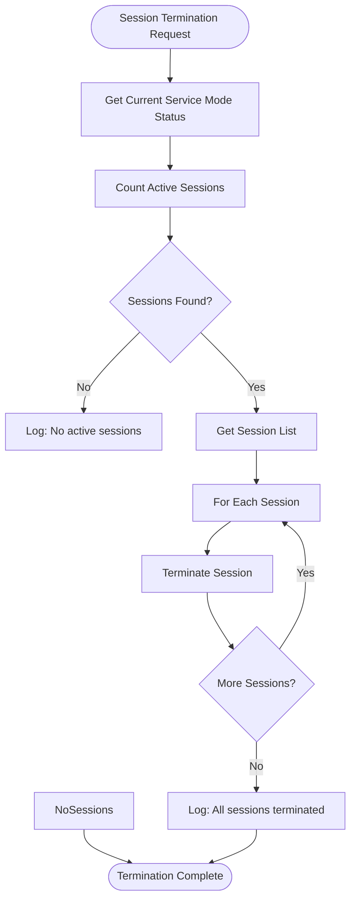

# Enable Service Mode

<cite>
**Referenced Files in This Document**
- [handler.go](file://internal/command/handlers/servicemodeenablehandler/handler.go)
- [handler_test.go](file://internal/command/handlers/servicemodeenablehandler/handler_test.go)
- [interfaces.go](file://internal/adapter/onec/rac/interfaces.go)
- [client.go](file://internal/adapter/onec/rac/client.go)
- [registry.go](file://internal/command/registry.go)
- [result.go](file://internal/pkg/output/result.go)
- [factory.go](file://internal/pkg/output/factory.go)
- [json.go](file://internal/pkg/output/json.go)
- [text.go](file://internal/pkg/output/text.go)
- [constants.go](file://internal/constants/constants.go)
- [config.go](file://internal/config/config.go)
</cite>

## Update Summary
**Changes Made**
- Updated to reflect new NR (Named Reference) command implementation with structured JSON/text output
- Added comprehensive error handling with machine-readable error codes
- Integrated RAC client with idempotent operations and session termination
- Implemented Command Registry pattern with deprecation support
- Enhanced output formatting with metadata and trace ID tracking

## Table of Contents
1. [Introduction](#introduction)
2. [Command Overview](#command-overview)
3. [Environment Variables](#environment-variables)
4. [Internal Workflow](#internal-workflow)
5. [Code Implementation](#code-implementation)
6. [Integration with 1C Server](#integration-with-1c-server)
7. [Structured Output Format](#structured-output-format)
8. [Idempotent Operations](#idempotent-operations)
9. [Session Management](#session-management)
10. [Error Handling](#error-handling)
11. [Use Cases](#use-cases)
12. [Troubleshooting](#troubleshooting)
13. [Best Practices](#best-practices)

## Introduction

The `nr-service-mode-enable` command represents a modernized approach to managing service mode operations on 1C:Enterprise infobases within the benadis-runner framework. This NR (Named Reference) command provides a comprehensive, idempotent solution for controlling access to production systems during administrative operations, featuring structured output formats, robust error handling, and seamless integration with the Command Registry architecture.

The implementation follows modern Go practices with dependency injection, interface segregation, and comprehensive testing patterns. It maintains backward compatibility through deprecated alias support while introducing enhanced functionality for CI/CD automation and operational excellence.

## Command Overview

The `nr-service-mode-enable` command enables service mode on a specified 1C:Enterprise infobase through a structured, idempotent process that ensures operational safety and provides detailed feedback through both human-readable and machine-consumable formats.

### Key Features

- **Idempotent Operations**: Automatically detects existing service mode state and avoids redundant operations
- **Structured Output**: Supports both JSON and text output formats with standardized metadata
- **Session Termination**: Optional termination of active user sessions with configurable behavior
- **Command Registry Integration**: Part of the modern NR command architecture with deprecation support
- **Enhanced Error Handling**: Machine-readable error codes with detailed diagnostic information
- **Trace ID Tracking**: Comprehensive logging correlation across distributed operations

### Command Execution Flow


**Diagram sources**
- [handler.go](file://internal/command/handlers/servicemodeenablehandler/handler.go#L87-L231)

**Section sources**
- [handler.go](file://internal/command/handlers/servicemodeenablehandler/handler.go#L76-L84)
- [constants.go](file://internal/constants/constants.go#L107-L107)

## Environment Variables

The `nr-service-mode-enable` command utilizes a comprehensive set of environment variables that provide flexible configuration while maintaining security through controlled parameter injection.

### Required Variables

**BR_INFOBASE_NAME**
- **Purpose**: Specifies the target 1C:Enterprise infobase name
- **Type**: String
- **Required**: Yes
- **Example**: `export BR_INFOBASE_NAME="ProductionDB"`
- **Validation**: Triggers structured error response with code "CONFIG.INFOBASE_MISSING" if empty

### Optional Variables

**BR_OUTPUT_FORMAT**
- **Purpose**: Controls output format (json or text)
- **Type**: String
- **Default**: "text"
- **Example**: `export BR_OUTPUT_FORMAT="json"`
- **Behavior**: Determines structured JSON output vs human-readable text

**BR_SERVICE_MODE_MESSAGE**
- **Purpose**: Custom maintenance message for service mode
- **Type**: String
- **Default**: "Система находится в режиме обслуживания" (from constants)
- **Example**: `export BR_SERVICE_MODE_MESSAGE="Scheduled maintenance window"`
- **Usage**: Affects response data but RAC client uses hardcoded "ServiceMode" permission code

**BR_SERVICE_MODE_PERMISSION_CODE**
- **Purpose**: Permission code for service mode access
- **Type**: String
- **Default**: "ServiceMode"
- **Example**: `export BR_SERVICE_MODE_PERMISSION_CODE="CustomCode"`
- **Usage**: Included in response data for informational purposes

**BR_TERMINATE_SESSIONS**
- **Purpose**: Controls whether active user sessions should be terminated
- **Type**: Boolean string (`true`/`false`)
- **Default**: `false`
- **Example**: `export BR_TERMINATE_SESSIONS="true"`
- **Behavior**: When set to `true`, all active sessions are terminated before enabling service mode

### RAC Configuration Variables

The command integrates with Remote Administration Console (RAC) for 1C:Enterprise server management:

- **RAC_PATH**: Path to rac executable (from AppConfig.Paths.Rac)
- **RAC_SERVER**: 1C:Enterprise server address (from AppConfig.Rac.Server)
- **RAC_PORT**: RAC port (default: 1545, from AppConfig.Rac.Port)
- **RAC_USER**: RAC administrator username (from AppConfig.Users.Rac)
- **RAC_PASSWORD**: RAC administrator password (from SecretConfig.Passwords.Rac)
- **RAC_TIMEOUT**: Connection timeout in seconds (from AppConfig.Rac.Timeout)
- **RAC_RETRIES**: Number of retry attempts (from AppConfig.Rac.Retries)

**Section sources**
- [handler.go](file://internal/command/handlers/servicemodeenablehandler/handler.go#L95-L123)
- [config.go](file://internal/config/config.go#L355-L383)

## Internal Workflow

The `nr-service-mode-enable` command follows a sophisticated workflow that ensures reliable operation, comprehensive error handling, and idempotent behavior through state checking and verification mechanisms.

### Step-by-Step Process


**Diagram sources**
- [handler.go](file://internal/command/handlers/servicemodeenablehandler/handler.go#L125-L231)
- [registry.go](file://internal/command/registry.go#L112-L144)

### Idempotent State Checking

The implementation includes sophisticated idempotent behavior that prevents unnecessary operations:

1. **Pre-operation State Check**: Queries current service mode status before attempting changes
2. **Already Enabled Detection**: Returns success immediately if service mode is already active
3. **State Change Tracking**: Distinguishes between already-enabled and newly-enabled states
4. **Fail-Open Strategy**: Continues with operations even if status check fails

### Configuration Loading Process

The configuration loading process follows a hierarchical approach:

1. **Application Configuration**: Loads from AppConfig (paths, ports, timeouts)
2. **Secret Configuration**: Injects credentials from SecretConfig
3. **Database Configuration**: Resolves 1C server from DbConfig if not in AppConfig
4. **Fallback Resolution**: Provides sensible defaults when configuration is incomplete

**Section sources**
- [handler.go](file://internal/command/handlers/servicemodeenablehandler/handler.go#L156-L183)
- [handler.go](file://internal/command/handlers/servicemodeenablehandler/handler.go#L289-L334)

## Code Implementation

The `nr-service-mode-enable` implementation represents a modern Go architecture with clear separation of concerns, dependency injection, and comprehensive testing patterns.

### Core Handler Architecture

#### ServiceModeEnableHandler Structure

```go
type ServiceModeEnableHandler struct {
    // racClient — опциональный RAC клиент (nil в production, mock в тестах)
    racClient rac.Client
}
```

The handler implements the `command.Handler` interface with automatic registration through package initialization.

#### Command Registration

```go
func init() {
    command.RegisterWithAlias(&ServiceModeEnableHandler{}, constants.ActServiceModeEnable)
}
```

This registration pattern supports both new "nr-service-mode-enable" and deprecated "service-mode-enable" aliases with automatic bridging.

### ServiceModeEnableData Structure

The response data structure provides comprehensive information about the operation:

```go
type ServiceModeEnableData struct {
    Enabled bool `json:"enabled"`
    AlreadyEnabled bool `json:"already_enabled"`
    StateChanged bool `json:"state_changed"`
    Message string `json:"message"`
    PermissionCode string `json:"permission_code"`
    ScheduledJobsBlocked bool `json:"scheduled_jobs_blocked"`
    TerminatedSessionsCount int `json:"terminated_sessions_count"`
    InfobaseName string `json:"infobase_name"`
}
```

### Output Formatting System

The implementation supports dual output formats through a pluggable writer system:

#### JSON Output Structure

```json
{
  "status": "success",
  "command": "nr-service-mode-enable",
  "data": {
    "enabled": true,
    "already_enabled": false,
    "state_changed": true,
    "message": "Система находится в режиме обслуживания",
    "permission_code": "ServiceMode",
    "scheduled_jobs_blocked": true,
    "terminated_sessions_count": 0,
    "infobase_name": "ProductionDB"
  },
  "metadata": {
    "duration_ms": 1234,
    "trace_id": "abc123def456",
    "api_version": "v1"
  }
}
```

#### Text Output Format

```
nr-service-mode-enable: success
Data: {
  "enabled": true,
  "already_enabled": false,
  "state_changed": true,
  "message": "Система находится в режиме обслуживания",
  "permission_code": "ServiceMode",
  "scheduled_jobs_blocked": true,
  "terminated_sessions_count": 0,
  "infobase_name": "ProductionDB"
}
Duration: 1234ms
```

**Section sources**
- [handler.go](file://internal/command/handlers/servicemodeenablehandler/handler.go#L26-L68)
- [handler.go](file://internal/command/handlers/servicemodeenablehandler/handler.go#L233-L254)
- [result.go](file://internal/pkg/output/result.go#L11-L30)

## Integration with 1C Server

The `nr-service-mode-enable` command integrates seamlessly with 1C:Enterprise servers through the RAC (Remote Administration Console) protocol, utilizing a modern client architecture with comprehensive error handling and state verification.

### RAC Client Architecture

The RAC client implements a composite interface pattern that separates concerns through interface segregation:

```go
type Client interface {
    ClusterProvider
    InfobaseProvider
    SessionProvider
    ServiceModeManager
}
```

This design allows for focused testing and mocking while maintaining clean abstractions.

### Command Construction and Execution

The RAC client constructs precise RAC commands for service mode operations:

```go
args := []string{
    "infobase", "update",
    "--cluster=" + clusterUUID,
    "--infobase=" + infobaseUUID,
    "--sessions-deny=on",
    "--scheduled-jobs-deny=on",
    "--denied-from=" + time.Now().Format("2006-01-02T15:04:05"),
    "--denied-message=" + deniedMessage,
    "--permission-code=ServiceMode",
}
```

### State Verification Mechanism

The implementation includes robust verification to ensure operations completed successfully:

```go
func (c *racClient) VerifyServiceMode(ctx context.Context, clusterUUID, infobaseUUID string, expectedEnabled bool) error {
    status, err := c.GetServiceModeStatus(ctx, clusterUUID, infobaseUUID)
    if err != nil {
        return err
    }

    if status.Enabled != expectedEnabled {
        return apperrors.NewAppError(ErrRACVerify,
            fmt.Sprintf("несоответствие статуса сервисного режима: ожидалось %v, получено %v",
                expectedEnabled, status.Enabled), nil)
    }

    return nil
}
```

### Error Handling Integration

The RAC integration provides comprehensive error handling with specific error codes:

- **ErrRACExec**: "RAC.EXEC_FAILED" - RAC process execution errors
- **ErrRACTimeout**: "RAC.TIMEOUT" - Operation timeout errors  
- **ErrRACParse**: "RAC.PARSE_FAILED" - Output parsing errors
- **ErrRACNotFound**: "RAC.NOT_FOUND" - Object not found errors
- **ErrRACSession**: "RAC.SESSION_FAILED" - Session operation errors
- **ErrRACVerify**: "RAC.VERIFY_FAILED" - State verification failures

**Section sources**
- [interfaces.go](file://internal/adapter/onec/rac/interfaces.go#L102-L109)
- [client.go](file://internal/adapter/onec/rac/client.go#L404-L449)
- [client.go](file://internal/adapter/onec/rac/client.go#L539-L558)

## Structured Output Format

The `nr-service-mode-enable` command provides two distinct output formats through a unified interface, supporting both human readability and machine consumption for automation scenarios.

### JSON Output Format

The JSON output follows a standardized structure defined by the `output.Result` type:

```json
{
  "status": "success",
  "command": "nr-service-mode-enable",
  "data": {
    "enabled": true,
    "already_enabled": false,
    "state_changed": true,
    "message": "Система находится в режиме обслуживания",
    "permission_code": "ServiceMode",
    "scheduled_jobs_blocked": true,
    "terminated_sessions_count": 0,
    "infobase_name": "ProductionDB"
  },
  "metadata": {
    "duration_ms": 1234,
    "trace_id": "abc123def456",
    "api_version": "v1"
  }
}
```

### Text Output Format

The text format provides human-readable information with clear field organization:

```
nr-service-mode-enable: success
Data: {
  "enabled": true,
  "already_enabled": false,
  "state_changed": true,
  "message": "Система находится в режиме обслуживания",
  "permission_code": "ServiceMode",
  "scheduled_jobs_blocked": true,
  "terminated_sessions_count": 0,
  "infobase_name": "ProductionDB"
}
Duration: 1234ms
```

### Output Writer Factory

The output system uses a factory pattern to select appropriate writers:

```go
func NewWriter(format string) Writer {
    switch format {
    case FormatJSON:
        return NewJSONWriter()
    case FormatText:
        return NewTextWriter()
    default:
        return NewTextWriter()
    }
}
```

### Metadata Tracking

Both output formats include comprehensive metadata for operational insights:

- **DurationMs**: Operation execution time in milliseconds
- **TraceID**: Correlation identifier for log aggregation
- **APIVersion**: Version identifier for backward compatibility

**Section sources**
- [result.go](file://internal/pkg/output/result.go#L11-L54)
- [factory.go](file://internal/pkg/output/factory.go#L9-L23)
- [json.go](file://internal/pkg/output/json.go#L8-L23)
- [text.go](file://internal/pkg/output/text.go#L9-L55)

## Idempotent Operations

The `nr-service-mode-enable` command implements sophisticated idempotent behavior that prevents redundant operations and ensures predictable results even in failure scenarios.

### State Detection Mechanism

The handler performs pre-operation state checking to determine if service mode is already enabled:

```go
// Check idempotent state: already enabled?
status, err := racClient.GetServiceModeStatus(ctx, clusterInfo.UUID, infobaseInfo.UUID)
if err != nil {
    // Not critical - continue with enable (fail-open for check)
    log.Warn("Не удалось проверить текущий статус перед включением", slog.String("error", err.Error()))
}

// Log current state before potential change
if status != nil {
    log.Info("Текущее состояние перед операцией",
        slog.Bool("enabled", status.Enabled),
        slog.Bool("scheduled_jobs_blocked", status.ScheduledJobsBlocked),
        slog.Int("active_sessions", status.ActiveSessions))
}

if status != nil && status.Enabled {
    log.Info("Сервисный режим уже включён", slog.String("infobase", cfg.InfobaseName))
    // Return success without making changes
    data := &ServiceModeEnableData{
        Enabled: true,
        AlreadyEnabled: true,
        StateChanged: false,
        Message: status.Message,
        PermissionCode: permissionCode,
        ScheduledJobsBlocked: status.ScheduledJobsBlocked,
        InfobaseName: cfg.InfobaseName,
    }
    return h.outputResult(format, data, traceID, start)
}
```

### Fail-Open Strategy

The implementation uses a fail-open approach for state detection:

- **Non-critical failures**: Status check errors don't prevent operation
- **Conservative behavior**: When uncertain, proceeds with enabling to ensure desired state
- **Logging transparency**: All fallback decisions are logged for auditability

### Response Differentiation

The handler distinguishes between different operational outcomes:

- **Already Enabled**: Returns `already_enabled: true` with `state_changed: false`
- **Newly Enabled**: Returns `already_enabled: false` with `state_changed: true`
- **Verification Failed**: Returns structured error with machine-readable code

**Section sources**
- [handler.go](file://internal/command/handlers/servicemodeenablehandler/handler.go#L156-L183)
- [handler.go](file://internal/command/handlers/servicemodeenablehandler/handler.go#L164-L169)

## Session Management

The `nr-service-mode-enable` command provides sophisticated session management capabilities that allow administrators to control user access during maintenance operations through the RAC client integration.

### Session Termination Process

When the `BR_TERMINATE_SESSIONS` flag is set to `true`, the system performs controlled session termination:



**Diagram sources**
- [client.go](file://internal/adapter/onec/rac/client.go#L374-L402)

### Session Information Structure

The RAC client provides comprehensive session information through the `SessionInfo` structure:

```go
type SessionInfo struct {
    SessionID string
    UserName string
    AppID string
    Host string
    StartedAt time.Time
    LastActiveAt time.Time
}
```

### Session Termination Logic

The session termination process includes multiple safety mechanisms:

1. **Session Validation**: Verifies session existence and accessibility
2. **Batch Processing**: Handles multiple sessions efficiently
3. **Error Aggregation**: Collects and reports multiple termination failures
4. **Logging Integration**: Provides detailed audit trail of all operations

### Impact on Connected Users

When service mode is enabled with session termination:

- **Immediate Disconnection**: Users receive immediate disconnection notifications
- **Data Loss Prevention**: Graceful session closure prevents data corruption
- **Reconnection Blocking**: New connections are blocked until service mode is disabled
- **Maintenance Messages**: Users see configured maintenance messages

### Session Status Monitoring

The system provides real-time session status monitoring:

```go
// Get active session count for reporting
sessions, err := c.GetSessions(ctx, clusterUUID, infobaseUUID)
if err != nil {
    c.Logger.Warn("Failed to get active sessions count", "error", err)
} else {
    status.ActiveSessions = len(sessions)
}
```

**Section sources**
- [client.go](file://internal/adapter/onec/rac/client.go#L330-L402)
- [interfaces.go](file://internal/adapter/onec/rac/interfaces.go#L47-L61)

## Error Handling

The `nr-service-mode-enable` command implements comprehensive error handling with machine-readable error codes, structured responses, and detailed diagnostic information for effective troubleshooting.

### Error Classification System

The implementation uses a systematic approach to error classification:

#### Configuration Errors
- **CONFIG.INFOBASE_MISSING**: "Не указано имя информационной базы" - Missing BR_INFOBASE_NAME
- **CONFIG.LOAD_FAILED**: Configuration loading failures
- **RAC.CLIENT_CREATE_FAILED**: RAC client instantiation errors

#### RAC Communication Errors  
- **RAC.CLUSTER_FAILED**: "Не удалось получить информацию о кластере" - Cluster retrieval failures
- **RAC.INFOBASE_FAILED**: "Не удалось получить информацию об информационной базе" - Infobase retrieval failures
- **RAC.ENABLE_FAILED**: "Не удалось включить сервисный режим" - Service mode enable failures
- **RAC.VERIFY_FAILED**: "Верификация сервисного режима не прошла" - State verification failures

#### Operational Errors
- **RAC.EXEC_FAILED**: RAC process execution errors
- **RAC.TIMEOUT**: Operation timeout errors
- **RAC.SESSION_FAILED**: Session termination failures

### Structured Error Response

The error handling system provides consistent structured responses:

```json
{
  "status": "error",
  "command": "nr-service-mode-enable", 
  "error": {
    "code": "RAC.ENABLE_FAILED",
    "message": "Не удалось включить сервисный режим: connection refused"
  },
  "metadata": {
    "duration_ms": 1234,
    "trace_id": "abc123def456",
    "api_version": "v1"
  }
}
```

### Error Propagation and Logging

The implementation ensures comprehensive error tracking:

1. **Structured Logging**: All errors are logged with context and trace IDs
2. **Machine-Readable Codes**: Consistent error codes for automation
3. **Human-Readable Messages**: Descriptive messages for manual troubleshooting
4. **Metadata Preservation**: Error responses include timing and correlation data

### Recovery Strategies

The error handling system supports multiple recovery approaches:

- **Retry Logic**: Built-in retry mechanisms for transient failures
- **Fail-Open Behavior**: Conservative operation when status checks fail
- **Graceful Degradation**: Partial success reporting when operations partially complete
- **Audit Trail**: Complete logging for forensic analysis

**Section sources**
- [handler.go](file://internal/command/handlers/servicemodeenablehandler/handler.go#L256-L287)
- [client.go](file://internal/adapter/onec/rac/client.go#L17-L25)

## Use Cases

The `nr-service-mode-enable` command serves multiple critical use cases in enterprise environments where 1C:Enterprise systems require maintenance, updates, or administrative operations with automated orchestration and monitoring.

### CI/CD Pipeline Integration

The command is optimized for automated deployment scenarios with structured output and idempotent operations:

```bash
# Automated deployment script with structured output
export BR_COMMAND="nr-service-mode-enable"
export BR_INFOBASE_NAME="ProductionDB"
export BR_TERMINATE_SESSIONS="true"
export BR_OUTPUT_FORMAT="json"

# Enable service mode with JSON output for automation
benadis-runner > service_mode_enable.json

# Parse JSON output for CI/CD decision making
if jq -e '.status == "success"' service_mode_enable.json; then
    echo "Service mode enabled successfully"
    # Proceed with deployment operations
    deploy_application.sh
else
    echo "Service mode enable failed"
    exit 1
fi
```

### Database Maintenance Automation

During routine database maintenance operations, the command provides reliable access control:

- **Schema Updates**: Applying database schema changes with controlled user access
- **Index Rebuilds**: Optimizing database performance with minimal user disruption  
- **Data Migration**: Moving data between systems with session termination
- **Backup Operations**: Creating consistent backup snapshots with service mode

### Configuration Update Orchestration

The command supports complex configuration update scenarios:

- **Module Updates**: Installing new system modules with access restrictions
- **Customization Changes**: Updating business logic during maintenance windows
- **Security Patches**: Applying security fixes with controlled user access
- **Performance Tuning**: Adjusting system parameters with operational safety

### Emergency Response Systems

In emergency situations, the command provides rapid response capabilities:

- **Critical Bug Fixes**: Immediate system corrections with user access control
- **Security Incidents**: Rapid response to security threats with session termination
- **Performance Issues**: Quick resolution of performance problems with maintenance mode
- **Data Corruption**: Emergency data recovery operations with controlled access

### Multi-Environment Coordination

The command supports coordinated maintenance across multiple environments:

- **Development**: Testing configuration changes with minimal user impact
- **Testing**: Validating updates in isolation with controlled access
- **Staging**: Pre-production validation with service mode
- **Production**: Live system maintenance with comprehensive access control

**Section sources**
- [handler_test.go](file://internal/command/handlers/servicemodeenablehandler/handler_test.go#L52-L74)
- [handler_test.go](file://internal/command/handlers/servicemodeenablehandler/handler_test.go#L166-L194)

## Troubleshooting

This section provides comprehensive troubleshooting guidance for common issues encountered when using the `nr-service-mode-enable` command, focusing on the modern NR command implementation with structured error handling and debugging capabilities.

### Common Issues and Solutions

#### Issue: "CONFIG.INFOBASE_MISSING" Error

**Symptoms:**
- Command exits with structured error response
- Error code: "CONFIG.INFOBASE_MISSING"
- Message: "Не указано имя информационной базы (BR_INFOBASE_NAME)"

**Causes:**
- Missing BR_INFOBASE_NAME environment variable
- Incorrect variable name specification
- Shell environment not properly loaded

**Solutions:**
```bash
# Verify environment variable
echo $BR_INFOBASE_NAME

# Set the variable
export BR_INFOBASE_NAME="ProductionDB"

# Or use inline assignment
BR_INFOBASE_NAME="ProductionDB" benadis-runner

# Check variable precedence
env | grep BR_INFOBASE_NAME
```

#### Issue: RAC Connection Failures

**Symptoms:**
- RAC.ENABLE_FAILED or RAC.CLUSTER_FAILED errors
- Connection refused messages
- Authentication failures

**Diagnostic Steps:**
```bash
# Test RAC connectivity manually
rac infobase info --cluster=<cluster_uuid> --infobase=<infobase_uuid>

# Verify RAC server accessibility
telnet localhost 1545

# Check RAC configuration
rac --help
rac version
```

**Common Causes:**
- RAC server not running
- Firewall blocking port 1545
- Incorrect RAC server address
- Network connectivity issues

#### Issue: UUID Resolution Failures

**Symptoms:**
- "RAC.NOT_FOUND" errors for cluster or infobase
- Operation timeout during UUID resolution

**Solutions:**
```bash
# Manual UUID lookup
rac cluster list
rac infobase list --cluster=<cluster_uuid>

# Verify database configuration
cat config/dbconfig.yaml | grep -A 5 ProductionDB

# Check 1C server status
systemctl status 1cv8
```

#### Issue: Permission Denied Errors

**Symptoms:**
- Authentication failures
- Access denied messages
- RAC.ENABLE_FAILED with permission errors

**Solutions:**
```bash
# Verify RAC user permissions
rac cluster info --cluster=<cluster_uuid> --cluster-user=admin

# Test with different credentials
export RAC_USER="administrator"
export RAC_PASSWORD="correct_password"

# Check user roles in 1C Enterprise
# Navigate to 1C:Enterprise server management console
```

### Advanced Debugging Techniques

#### Enabling Detailed Logging

```bash
# Set debug level for comprehensive logging
export BR_LOG_LEVEL="debug"
export BR_OUTPUT_FORMAT="json"

# Capture detailed execution trace
benadis-runner service-mode-enable 2>&1 | tee service_mode_debug.log
```

#### Trace ID Analysis

The command generates unique trace IDs for correlation:

```bash
# Extract trace ID from JSON output
TRACE_ID=$(jq -r '.metadata.trace_id' service_mode_response.json)

# Search logs for trace correlation
grep "$TRACE_ID" /var/log/benadis-runner.log

# Analyze operation duration
DURATION=$(jq -r '.metadata.duration_ms' service_mode_response.json)
echo "Operation took ${DURATION}ms"
```

#### Session Termination Verification

```bash
# Verify session termination effectiveness
export BR_OUTPUT_FORMAT="json"
benadis-runner service-mode-enable

# Check session count in subsequent status queries
rac session list --cluster=<cluster_uuid> --infobase=<infobase_uuid>
```

### Recovery Procedures

#### Partial Failure Recovery

When service mode partially fails to enable:

```bash
# Attempt manual recovery using RAC directly
rac infobase update \
    --cluster=<cluster_uuid> \
    --infobase=<infobase_uuid> \
    --sessions-deny=off \
    --scheduled-jobs-deny=off

# Verify recovery
rac infobase info --cluster=<cluster_uuid> --infobase=<infobase_uuid>
```

#### Emergency Service Mode Disable

```bash
# Force disable service mode using NR command
export BR_COMMAND="nr-service-mode-disable"
export BR_INFOBASE_NAME="ProductionDB"
benadis-runner
```

### Performance Troubleshooting

#### Slow Operation Diagnostics

- **Network Latency**: Check network connectivity to 1C server
- **Large Session Counts**: Consider disabling session termination for large user bases
- **Server Load**: Monitor 1C server performance metrics
- **Configuration Issues**: Verify RAC server configuration

#### Memory and Resource Usage

```bash
# Monitor system resources during operation
top -p $(pgrep benadis-runner)
free -h

# Check RAC server resources
rac server info --cluster=<cluster_uuid>
```

**Section sources**
- [handler.go](file://internal/command/handlers/servicemodeenablehandler/handler.go#L256-L287)
- [handler_test.go](file://internal/command/handlers/servicemodeenablehandler/handler_test.go#L284-L350)

## Best Practices

Implementing the `nr-service-mode-enable` command effectively requires adherence to established best practices that ensure reliability, security, and operational efficiency in modern CI/CD and enterprise environments.

### Configuration Management

#### Environment Variable Organization

```bash
# Production environment
export BR_ENV="production"
export BR_INFOBASE_NAME="ProductionDB"
export BR_TERMINATE_SESSIONS="true"
export BR_SERVICE_MODE_MESSAGE="Scheduled maintenance window"
export BR_OUTPUT_FORMAT="json"

# Development environment  
export BR_ENV="development"
export BR_INFOBASE_NAME="DevDB"
export BR_TERMINATE_SESSIONS="false"
export BR_OUTPUT_FORMAT="text"
```

#### Configuration Validation

```bash
# Pre-deployment validation script
#!/bin/bash
set -euo pipefail

# Validate required environment variables
required_vars=(
    "BR_INFOBASE_NAME"
    "RAC_SERVER"
    "RAC_USER"
    "RAC_PASSWORD"
)

for var in "${required_vars[@]}"; do
    if [[ -z "${!var:-}" ]]; then
        echo "Error: Required environment variable $var is not set"
        exit 1
    fi
done

# Test RAC connectivity
rac infobase list --cluster=$(rac cluster list | head -1) >/dev/null 2>&1
echo "RAC connectivity test passed"
```

### Operational Procedures

#### Service Mode Lifecycle Management

```bash
#!/bin/bash
# service-mode-maintenance.sh

INFODBASE="${BR_INFOBASE_NAME}"
MESSAGE="Scheduled maintenance window"

# Enable service mode with structured output
echo "Enabling service mode for $INFODBASE..."
export BR_COMMAND="nr-service-mode-enable"
export BR_SERVICE_MODE_MESSAGE="$MESSAGE"
export BR_TERMINATE_SESSIONS="true"
export BR_OUTPUT_FORMAT="json"
benadis-runner > enable_output.json

if jq -e '.status == "success"' enable_output.json; then
    echo "Service mode enabled successfully"
    echo "Sessions terminated: $(jq -r '.data.terminated_sessions_count' enable_output.json)"
else
    echo "Failed to enable service mode"
    cat enable_output.json
    exit 1
fi

# Perform maintenance operations
echo "Performing maintenance operations..."
# ... maintenance tasks ...

# Disable service mode
echo "Disabling service mode for $INFODBASE..."
export BR_COMMAND="nr-service-mode-disable"
benadis-runner > disable_output.json

if jq -e '.status == "success"' disable_output.json; then
    echo "Service mode disabled successfully"
else
    echo "Failed to disable service mode"
    exit 1
fi
```

#### Monitoring and Alerting Integration

```bash
# Health check script with structured output
#!/bin/bash
INFODBASE="${BR_INFOBASE_NAME}"

# Check service mode status with JSON output
export BR_COMMAND="nr-service-mode-status"
export BR_INFOBASE_NAME="$INFODBASE"
export BR_OUTPUT_FORMAT="json"
STATUS_OUTPUT=$(benadis-runner 2>&1)

if jq -e '.status == "success"' <<< "$STATUS_OUTPUT"; then
    ENABLED=$(jq -r '.data.enabled' <<< "$STATUS_OUTPUT")
    ACTIVE_SESSIONS=$(jq -r '.data.active_sessions' <<< "$STATUS_OUTPUT")
    
    echo "Service mode: $ENABLED (Active sessions: $ACTIVE_SESSIONS)"
    
    # Alert on unexpected states
    if [[ "$ENABLED" == "true" && "$ACTIVE_SESSIONS" -gt 0 ]]; then
        echo "WARNING: Service mode enabled with active sessions"
        # Send alert to monitoring system
    fi
else
    echo "ERROR: Service mode status check failed"
    echo "$STATUS_OUTPUT"
    # Send alert to monitoring system
fi
```

### Security and Compliance

#### Credential Management

```bash
# Secure credential injection using SecretConfig
export RAC_PASSWORD=$(cat /vault/secrets/rac_password)
export DB_PASSWORD=$(cat /vault/secrets/db_password)

# Validate credentials before operation
if rac cluster list --cluster-user="$RAC_USER" --cluster-pwd="$RAC_PASSWORD" >/dev/null 2>&1; then
    echo "Credentials validated successfully"
else
    echo "Credential validation failed"
    exit 1
fi
```

#### Audit Trail and Compliance

```bash
# Comprehensive logging for compliance
LOG_FILE="/var/log/service-mode-operations.log"

echo "$(date): Service mode enable requested for $BR_INFOBASE_NAME" >> $LOG_FILE
echo "Trace ID: $(uuidgen)" >> $LOG_FILE
echo "Requestor: $(whoami)" >> $LOG_FILE
echo "Environment: $BR_ENV" >> $LOG_FILE
echo "Termination flag: $BR_TERMINATE_SESSIONS" >> $LOG_FILE

# Include structured output in audit log
benadis-runner > operation_output.json
jq -r '.metadata.trace_id' operation_output.json >> $LOG_FILE
jq -r '.metadata.duration_ms' operation_output.json >> $LOG_FILE
jq -r '.data.message' operation_output.json >> $LOG_FILE
```

### Performance Optimization

#### Batch Operation Efficiency

```bash
# Optimize for multiple infobases
INFODBASES=("ProductionDB" "StagingDB" "TestDB")

for DB in "${INFODBASES[@]}"; do
    export BR_INFOBASE_NAME=$DB
    export BR_OUTPUT_FORMAT="json"
    
    # Use background processing for independent operations
    benadis-runner service-mode-enable &
done

# Wait for all operations to complete
wait

# Aggregate results
for job in $(jobs -p); do
    wait $job
done
```

#### Resource Management

```bash
# Monitor resource usage during operations
while benadis-runner service-mode-enable; do
    # Check system resources
    MEM_USAGE=$(free | awk 'NR==2{printf "%.1f%%", $3*100/$2}') 
    CPU_USAGE=$(top -bn1 | grep "Cpu(s)" | awk "{print \$2}" | cut -d'%' -f1)
    
    echo "Memory: $MEM_USAGE, CPU: $CPU_USAGE"
    
    # Implement backoff for resource-constrained environments
    if (( $(echo "$MEM_USAGE > 80" | bc -l) )) || (( $(echo "$CPU_USAGE > 80" | bc -l) )); then
        sleep 30
    else
        break
    fi
done
```

**Section sources**
- [handler.go](file://internal/command/handlers/servicemodeenablehandler/handler.go#L233-L254)
- [registry.go](file://internal/command/registry.go#L112-L144)
- [config.go](file://internal/config/config.go#L626-L793)