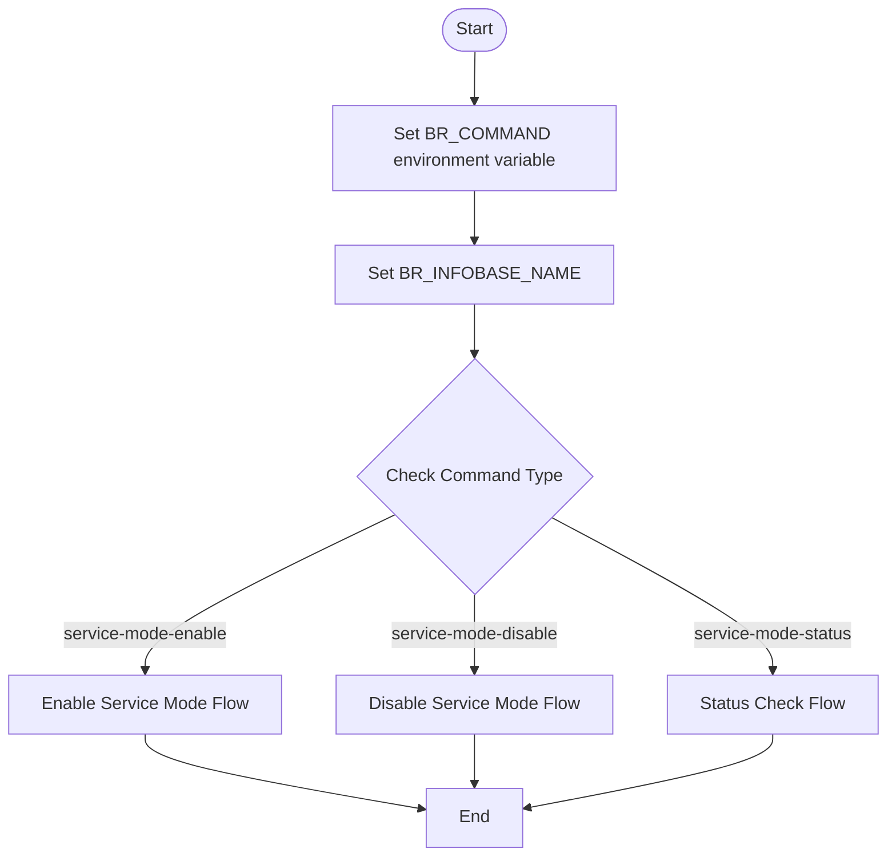
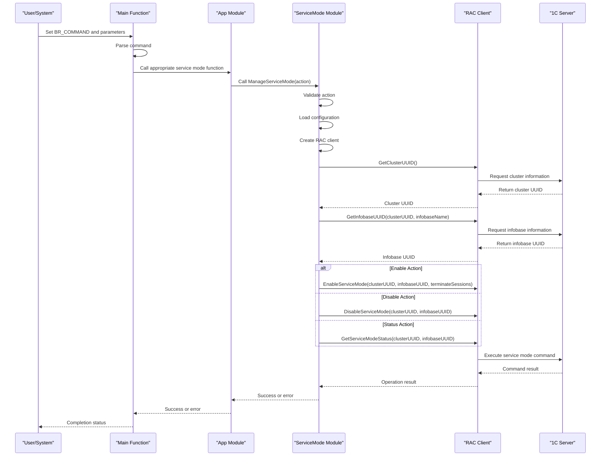
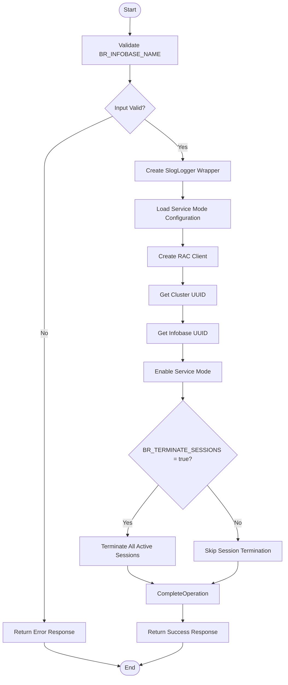
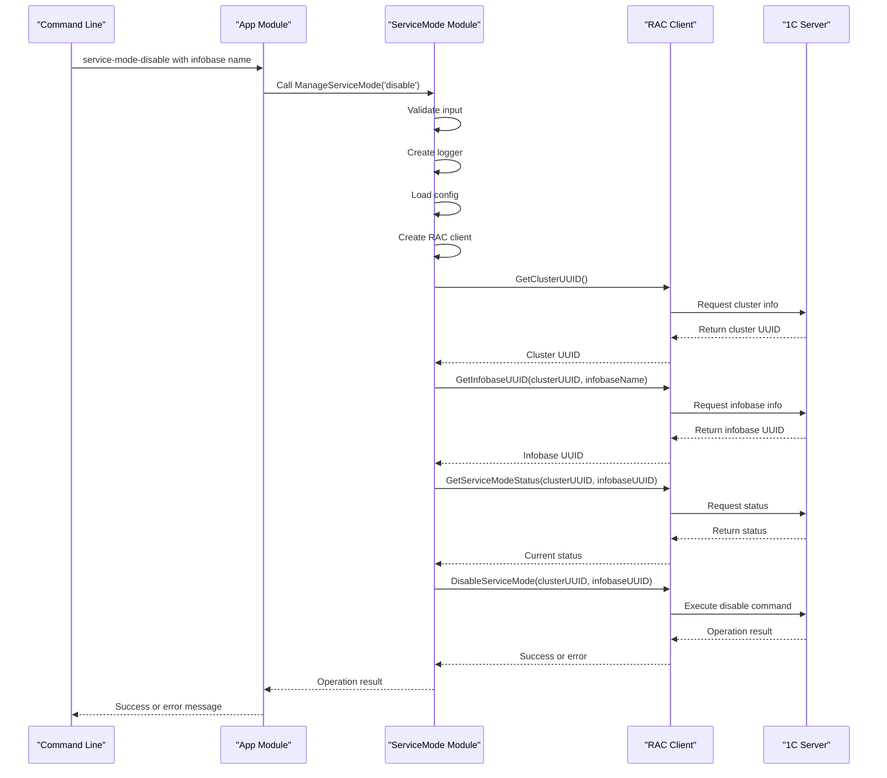

# Service Mode Commands

<cite>
**Referenced Files in This Document**   
- [main.go](file://cmd/benadis-runner/main.go)
- [app.go](file://internal/app/app.go)
- [servicemode.go](file://internal/servicemode/servicemode.go)
- [service_mode.go](file://internal/rac/service_mode.go)
- [constants.go](file://internal/constants/constants.go)
- [config.go](file://internal/config/config.go)
- [service-mode-usage.md](file://old/service-mode-usage.md)
</cite>

## Table of Contents
1. [Introduction](#introduction)
2. [Command Syntax and Parameters](#command-syntax-and-parameters)
3. [Workflow Overview](#workflow-overview)
4. [Service Mode Enable Command](#service-mode-enable-command)
5. [Service Mode Disable Command](#service-mode-disable-command)
6. [Service Mode Status Command](#service-mode-status-command)
7. [Error Handling](#error-handling)
8. [Integration with 1C Server Processes](#integration-with-1c-server-processes)
9. [Common Issues and Troubleshooting](#common-issues-and-troubleshooting)
10. [Use Cases](#use-cases)

## Introduction

The service mode commands in benadis-runner provide administrative control over the 1C:Enterprise service mode, allowing for maintenance operations on information bases. These commands enable administrators to temporarily block user access to databases while performing critical operations such as configuration updates, data migrations, or system maintenance. The three primary commands—`service-mode-enable`, `service-mode-disable`, and `service-mode-status`—offer comprehensive management capabilities for the service mode functionality.

These commands interact with the 1C:Enterprise server through the Remote Administration Console (RAC), providing a programmatic interface for service mode operations. The implementation follows a layered architecture where high-level commands are processed through multiple components, from the main application entry point down to the RAC client that communicates directly with the 1C server.

The service mode functionality is essential for ensuring data consistency during administrative operations, preventing conflicts between user activities and system maintenance tasks. By enabling service mode, administrators can guarantee that no users are actively modifying data while critical operations are being performed, reducing the risk of data corruption or operational failures.

**Section sources**
- [main.go](file://cmd/benadis-runner/main.go#L60-L92)
- [app.go](file://internal/app/app.go#L100-L150)
- [service-mode-usage.md](file://old/service-mode-usage.md#L1-L20)

## Command Syntax and Parameters

The service mode commands in benadis-runner follow a consistent syntax pattern using environment variables to configure their behavior. Each command is invoked by setting the `BR_COMMAND` environment variable to the appropriate action value, along with required parameters for the operation.

The primary commands and their corresponding BR_COMMAND values are:
- `service-mode-enable`: Enables service mode for an information base
- `service-mode-disable`: Disables service mode for an information base  
- `service-mode-status`: Retrieves the current status of service mode

The most critical parameter across all commands is `BR_INFOBASE_NAME`, which specifies the name of the information base to operate on. This parameter is mandatory for all service mode operations and must correspond to an existing information base in the 1C cluster.

Additional parameters include:
- `BR_TERMINATE_SESSIONS`: A boolean flag (true/false) used with `service-mode-enable` to force termination of active user sessions
- Configuration parameters for RAC connectivity including `RAC_PATH`, `RAC_SERVER`, `RAC_PORT`, `RAC_USER`, and `RAC_PASSWORD`
- Timeout and retry settings (`RAC_TIMEOUT`, `RAC_RETRIES`) for connection resilience

The commands are designed to be used in automated workflows, particularly in CI/CD pipelines where database maintenance operations need to be performed reliably and consistently. The use of environment variables makes these commands easily integrable with various automation platforms and containerized environments.

**Diagram sources**
- [constants.go](file://internal/constants/constants.go#L150-L160)
- [config.go](file://internal/config/config.go#L700-L800)

**Section sources**
- [constants.go](file://internal/constants/constants.go#L150-L160)
- [config.go](file://internal/config/config.go#L700-L800)
- [service-mode-usage.md](file://old/service-mode-usage.md#L43-L82)

## Workflow Overview

The workflow for service mode commands follows a consistent pattern across all operations, beginning with command validation and ending with the execution of the requested action through the RAC interface. The process starts in the main function of the application, where the command type is evaluated and routed to the appropriate handler function.

When a service mode command is invoked, the first step is validating the information base name provided in the `BR_INFOBASE_NAME` environment variable. If this parameter is missing or empty, the operation fails immediately with an appropriate error message. This validation ensures that all subsequent operations have a valid target information base.

Following successful validation, the system creates a SlogLogger wrapper to handle logging throughout the operation. This logger provides structured logging with contextual information, making it easier to troubleshoot issues and monitor command execution. The logger captures debug, info, warning, and error messages at various stages of the workflow.

The core of the workflow involves calling the `servicemode.ManageServiceMode` function with the appropriate action parameter ('enable', 'disable', or 'status'). This function serves as the central coordinator for service mode operations, handling the creation of the RAC client, retrieval of cluster and information base UUIDs, and execution of the specific RAC command.

For each action, the workflow follows these general steps:
1. Validate input parameters
2. Create logging wrapper
3. Load service mode configuration
4. Create RAC client with appropriate credentials
5. Retrieve cluster UUID
6. Retrieve information base UUID
7. Execute the specific service mode command
8. Return result or handle errors

This standardized workflow ensures consistency across different service mode operations while allowing for specific behaviors based on the requested action.

**Diagram sources**
- [main.go](file://cmd/benadis-runner/main.go#L60-L92)
- [app.go](file://internal/app/app.go#L100-L150)
- [servicemode.go](file://internal/servicemode/servicemode.go#L200-L250)

**Section sources**
- [main.go](file://cmd/benadis-runner/main.go#L60-L92)
- [app.go](file://internal/app/app.go#L100-L150)
- [servicemode.go](file://internal/servicemode/servicemode.go#L200-L250)

## Service Mode Enable Command

The `service-mode-enable` command activates service mode for a specified information base, blocking user access and preventing new connections. This command is essential for performing administrative operations that require exclusive access to the database, such as configuration updates, data migrations, or structural changes.

When executed, the command performs several key operations in sequence. First, it validates the presence of the required `BR_INFOBASE_NAME` parameter. If this parameter is missing, the command fails with an appropriate error message. Once validated, the system proceeds to create a RAC client configured with the necessary connection parameters and credentials.

A distinctive feature of the `service-mode-enable` command is the `terminateSessions` parameter, which controls whether active user sessions should be forcibly terminated. When `BR_TERMINATE_SESSIONS` is set to "true", the command will attempt to terminate all active sessions after enabling service mode. This parameter is particularly useful in maintenance scenarios where immediate access restriction is required, regardless of ongoing user activities.

The implementation uses a default service mode message defined in constants ("Система находится в режиме обслуживания") which is displayed to users attempting to connect during the service mode period. This message helps communicate the reason for the temporary unavailability of the system.

The command follows a careful sequence to minimize disruption:
1. Enable service mode blocking new connections
2. Allow existing transactions to complete naturally
3. Optionally terminate remaining active sessions
4. Confirm successful activation

This approach balances the need for immediate protection of the database with consideration for users who may be in the middle of important work. The optional session termination provides administrators with control over the aggressiveness of the access restriction.

**Diagram sources**
- [servicemode.go](file://internal/servicemode/servicemode.go#L203-L220)
- [service_mode.go](file://internal/rac/service_mode.go#L20-L50)
- [app.go](file://internal/app/app.go#L100-L120)

**Section sources**
- [servicemode.go](file://internal/servicemode/servicemode.go#L203-L220)
- [service_mode.go](file://internal/rac/service_mode.go#L20-L50)
- [app.go](file://internal/app/app.go#L100-L120)

## Service Mode Disable Command

The `service-mode-disable` command deactivates service mode for a specified information base, restoring normal user access and connection capabilities. This command is typically used after completing maintenance operations to return the system to regular production status.

Unlike the enable command, the disable operation does not require any additional parameters beyond the mandatory `BR_INFOBASE_NAME`. The command follows a straightforward workflow: validate the information base name, create the necessary logging and client components, retrieve the cluster and information base UUIDs, and execute the disable command through the RAC interface.

The implementation includes special handling for the `denied-message` field when disabling service mode. If the current denied message matches the default service mode message followed by a period (indicating scheduled jobs were also disabled), the command preserves the `--scheduled-jobs-deny=off` parameter. Otherwise, it omits this parameter to avoid unintended changes to scheduled job configurations.

Before executing the disable command, the system retrieves the current service mode status to verify the expected state. This verification step helps prevent accidental operations on information bases that may already be in normal mode or in an unexpected state.

The command's success indicates that:
1. Service mode has been successfully deactivated
2. New user connections are permitted
3. Existing restrictions on database access have been removed
4. The information base is ready for normal operations

Error handling for the disable command focuses on common failure scenarios such as network connectivity issues, authentication failures, or the information base being in an inconsistent state. In case of failure, the command provides detailed error information to assist with troubleshooting.

**Diagram sources**
- [servicemode.go](file://internal/servicemode/servicemode.go#L220-L235)
- [service_mode.go](file://internal/rac/service_mode.go#L80-L100)
- [app.go](file://internal/app/app.go#L120-L140)

**Section sources**
- [servicemode.go](file://internal/servicemode/servicemode.go#L220-L235)
- [service