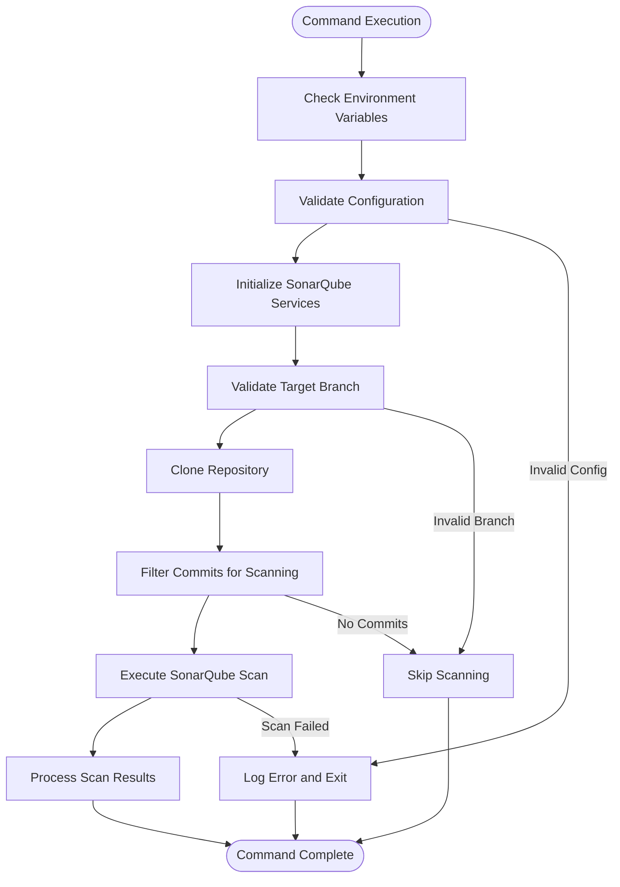
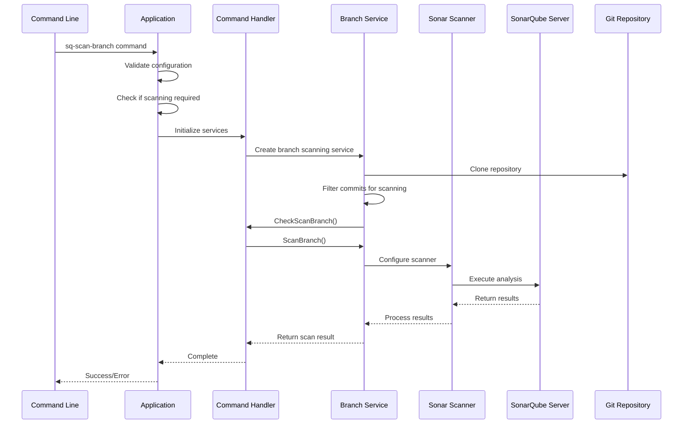
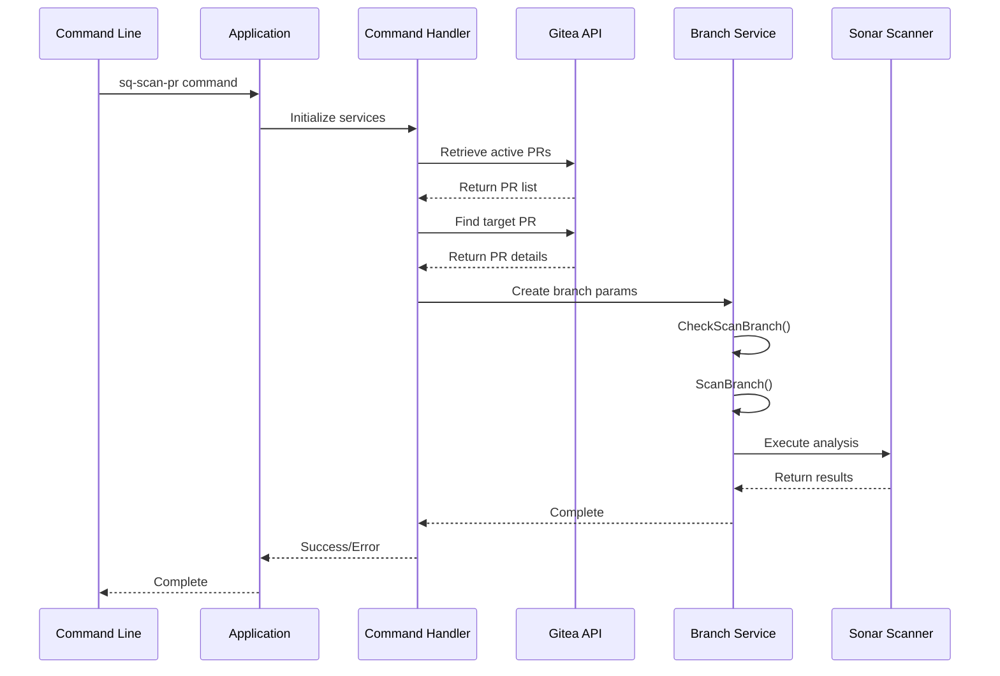
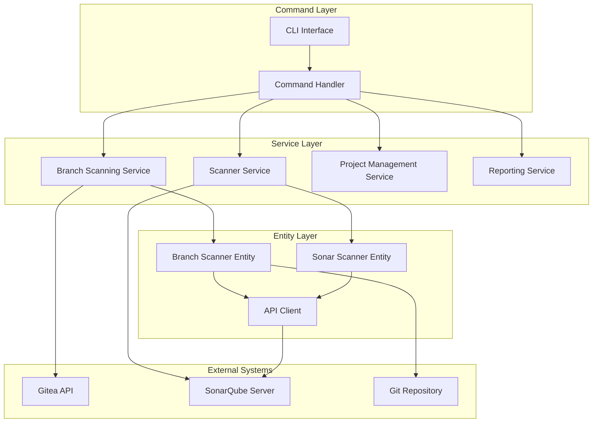

# SonarQube Scan Commands

<cite>
**Referenced Files in This Document**
- [command_handler.go](file://internal/service/sonarqube/command_handler.go)
- [branch_scanner.go](file://internal/entity/sonarqube/branch_scanner.go)
- [sonarqube.go](file://internal/config/sonarqube.go)
- [main.go](file://cmd/benadis-runner/main.go)
- [app.go](file://internal/app/app.go)
- [sonarqube_init.go](file://internal/app/sonarqube_init.go)
- [constants.go](file://internal/constants/constants.go)
- [sq-scan-benadis-runner.sh](file://scripts/sq-scan-benadis-runner.sh)
- [sq-scan-test-01.sh](file://scripts/sq-scan-test-01.sh)
</cite>

## Table of Contents
1. [Introduction](#introduction)
2. [Command Overview](#command-overview)
3. [Environment Variables](#environment-variables)
4. [Command Implementation](#command-implementation)
5. [Workflow Analysis](#workflow-analysis)
6. [Configuration Management](#configuration-management)
7. [Error Handling](#error-handling)
8. [Integration Architecture](#integration-architecture)
9. [Performance Considerations](#performance-considerations)
10. [Troubleshooting Guide](#troubleshooting-guide)
11. [Best Practices](#best-practices)
12. [Conclusion](#conclusion)

## Introduction

The SonarQube scanning commands in benadis-runner provide automated code quality analysis for 1C:Enterprise projects. These commands enable developers to perform comprehensive static code analysis on Git branches and pull requests, ensuring code quality standards are maintained throughout the development lifecycle.

The system supports two primary scanning modes:
- **Branch Scanning (`sq-scan-branch`)**: Analyzes specific Git branches, including main branches and feature branches with commit hash filtering
- **Pull Request Scanning (`sq-scan-pr`)**: Performs specialized analysis on pull requests with integrated Gitea API for context-aware scanning

## Command Overview

### Available Commands

The benadis-runner implements two main SonarQube scanning commands:

1. **`sq-scan-branch`**: Performs code quality analysis on Git branches
2. **`sq-scan-pr`**: Conducts pull request-specific code analysis

Both commands leverage the centralized configuration system and integrate seamlessly with the Gitea repository management platform.



**Diagram sources**
- [command_handler.go](file://internal/service/sonarqube/command_handler.go#L73-L130)
- [app.go](file://internal/app/app.go#L1000-L1150)

**Section sources**
- [constants.go](file://internal/constants/constants.go#L85-L90)
- [main.go](file://cmd/benadis-runner/main.go#L130-L145)

## Environment Variables

### Required Environment Variables

The SonarQube scanning commands rely on several environment variables for proper operation:

```bash
# Command Selection
export BR_COMMAND=sq-scan-branch  # or sq-scan-pr

# SonarQube Configuration
export SONARQUBE_URL=http://localhost:9000
export SONARQUBE_TOKEN=your-auth-token-here
export SONARQUBE_TIMEOUT=30s
export SONARQUBE_RETRY_ATTEMPTS=3
export SONARQUBE_RETRY_DELAY=5s

# Scanner Configuration
export SONARQUBE_SCANNER_URL=https://binaries.sonarsource.com/Distribution/sonar-scanner-cli/sonar-scanner-cli-4.8.0.2856-linux.zip
export SONARQUBE_SCANNER_VERSION=4.8.0.2856
export SONARQUBE_JAVA_OPTS=-Xmx2g
export SONARQUBE_SCANNER_TIMEOUT=600s
export SONARQUBE_SCANNER_WORK_DIR=/tmp/benadis
export SONARQUBE_SCANNER_TEMP_DIR=/tmp/benadis/scanner/temp

# Repository Information
export BR_OWNER=your-organization
export BR_REPO=your-repository
export BR_BRANCH_FOR_SCAN=main  # For sq-scan-branch
export BR_COMMIT_HASH=abc123   # Optional for specific commit
```

### Variable Priority Order

The configuration system follows a specific priority order:

1. **Environment Variables** (highest priority)
2. **Application Configuration** (AppConfig)
3. **Secret Configuration** (SecretConfig)
4. **Default Values** (lowest priority)

**Section sources**
- [sonarqube.go](file://internal/config/sonarqube.go#L15-L100)

## Command Implementation

### SQScanBranch Function

The `SQScanBranch` function serves as the primary entry point for branch scanning operations:

```go
func SQScanBranch(ctx *context.Context, l *slog.Logger, cfg *config.Config, commitHash string) error {
    // Log scanning initiation
    l.Info("Starting SonarQube branch scanning",
        slog.String("owner", cfg.Owner),
        slog.String("repo", cfg.Repo),
        slog.String("branch", cfg.BranchForScan),
    )
    
    // Check if scanning is required
    shouldScan, err := shouldRunScanBranch(l, cfg, cfg.BranchForScan, commitHash)
    if err != nil {
        return err
    }
    
    if !shouldScan {
        return nil
    }
    
    // Initialize services and execute scan
    giteaAPI := config.CreateGiteaAPI(cfg)
    handler, err := InitSonarQubeServices(l, cfg, giteaAPI)
    if err != nil {
        return err
    }
    
    // Create scan parameters
    params := &sqEntity.ScanBranchParams{
        Owner:      cfg.Owner,
        Repo:       cfg.Repo,
        Branch:     cfg.BranchForScan,
        CommitHash: commitHash,
        SourceDir:  "",
    }
    
    // Execute the scan
    return handler.HandleSQScanBranch(*ctx, params)
}
```

### SQScanPR Function

The `SQScanPR` function handles pull request scanning with Gitea integration:

```go
func SQScanPR(ctx *context.Context, l *slog.Logger, cfg *config.Config) error {
    l.Info("Starting SonarQube pull request scanning",
        slog.String("owner", cfg.Owner),
        slog.String("repo", cfg.Repo),
        slog.String("branch", cfg.BaseBranch),
    )
    
    // Initialize services
    giteaAPI := config.CreateGiteaAPI(cfg)
    handler, err := InitSonarQubeServices(l, cfg, giteaAPI)
    if err != nil {
        return err
    }
    
    // Create PR scan parameters
    params := &sqEntity.ScanPRParams{
        Owner: cfg.Owner,
        Repo:  cfg.Repo,
        PR:    0, // TODO: Get PR number from config
    }
    
    // Execute PR scan
    return handler.HandleSQScanPR(*ctx, params)
}
```

**Section sources**
- [app.go](file://internal/app/app.go#L1000-L1150)
- [app.go](file://internal/app/app.go#L1152-L1200)

## Workflow Analysis

### Branch Scanning Workflow

The branch scanning workflow consists of several orchestrated steps:



**Diagram sources**
- [command_handler.go](file://internal/service/sonarqube/command_handler.go#L73-L130)
- [branch_scanner.go](file://internal/entity/sonarqube/branch_scanner.go#L150-L250)

### Pull Request Scanning Workflow

Pull request scanning involves additional Gitea API integration:



**Diagram sources**
- [command_handler.go](file://internal/service/sonarqube/command_handler.go#L140-L180)

**Section sources**
- [command_handler.go](file://internal/service/sonarqube/command_handler.go#L73-L210)

## Configuration Management

### SonarQube Configuration Structure

The SonarQube configuration is managed through a hierarchical structure:

```go
type SonarQubeConfig struct {
    URL                   string        `yaml:"url" env:"SONARQUBE_URL"`
    Token                 string        `yaml:"token" env:"SONARQUBE_TOKEN"`
    Timeout               time.Duration `yaml:"timeout" env:"SONARQUBE_TIMEOUT"`
    RetryAttempts         int           `yaml:"retryAttempts" env:"SONARQUBE_RETRY_ATTEMPTS"`
    RetryDelay            time.Duration `yaml:"retryDelay" env:"SONARQUBE_RETRY_DELAY"`
    ProjectPrefix         string        `yaml:"projectPrefix" env:"SONARQUBE_PROJECT_PREFIX"`
    DefaultVisibility     string        `yaml:"defaultVisibility" env:"SONARQUBE_DEFAULT_VISIBILITY"`
    QualityGateTimeout    time.Duration `yaml:"qualityGateTimeout" env:"SONARQUBE_QUALITY_GATE_TIMEOUT"`
    DisableBranchAnalysis bool          `yaml:"disableBranchAnalysis" env:"SONARQUBE_DISABLE_BRANCH_ANALYSIS"`
}
```

### Scanner Configuration

The scanner configuration manages the SonarScanner executable:

```go
type ScannerConfig struct {
    ScannerURL     string            `yaml:"scannerUrl" env:"SONARQUBE_SCANNER_URL"`
    ScannerVersion string            `yaml:"scannerVersion" env:"SONARQUBE_SCANNER_VERSION"`
    JavaOpts       string            `yaml:"javaOpts" env:"SONARQUBE_JAVA_OPTS"`
    Properties     map[string]string `yaml:"properties"`
    Timeout        time.Duration     `yaml:"timeout" env:"SONARQUBE_SCANNER_TIMEOUT"`
    WorkDir        string            `yaml:"workDir" env:"SONARQUBE_SCANNER_WORK_DIR"`
    TempDir        string            `yaml:"tempDir" env:"SONARQUBE_SCANNER_TEMP_DIR"`
}
```

### Configuration Validation

Both configurations include validation mechanisms:

```go
func (s *SonarQubeConfig) Validate() error {
    if s.URL == "" {
        return fmt.Errorf("SonarQube URL is required")
    }
    if s.Token == "" {
        return fmt.Errorf("SonarQube token is required")
    }
    if s.Timeout <= 0 {
        return fmt.Errorf("SonarQube timeout must be positive")
    }
    // Additional validations...
    return nil
}
```

**Section sources**
- [sonarqube.go](file://internal/config/sonarqube.go#L15-L100)
- [sonarqube.go](file://internal/config/sonarqube.go#L102-L150)

## Error Handling

### Error Categories

The SonarQube scanning system implements comprehensive error handling across multiple categories:

1. **Configuration Errors**: Invalid or missing configuration parameters
2. **Network Errors**: Connection failures to SonarQube server
3. **Authentication Errors**: Invalid or expired tokens
4. **Repository Errors**: Git operations failures
5. **Scanner Errors**: SonarScanner execution problems

### Error Handling Implementation

```go
func (h *SQCommandHandler) HandleSQScanBranch(ctx context.Context, params *sonarqube.ScanBranchParams) error {
    h.logger.Debug("Handling sq-scan-branch command", 
        "owner", params.Owner, 
        "repo", params.Repo, 
        "branch", params.Branch)

    // Get list of commits for scanning
    commitsToScan, err := h.branchScanningService.CheckScanBranch(ctx, params)
    if err != nil {
        h.logger.Error("Failed to check commits for scanning", "error", err)
        return fmt.Errorf("failed to check commits for scanning: %w", err)
    }

    // Delegate to branch scanning service
    if err := h.branchScanningService.ScanBranch(ctx, params, commitsToScan); err != nil {
        h.logger.Error("Failed to scan branch", "error", err)
        return fmt.Errorf("failed to scan branch: %w", err)
    }

    h.logger.Debug("sq-scan-branch command handled successfully")
    return nil
}
```

### Logging Strategy

The system employs structured logging with correlation IDs for comprehensive error tracking:

```go
logger := &slog.Logger{
    Handler: slog.NewJSONHandler(os.Stdout, &slog.HandlerOptions{
        Level: slog.LevelDebug,
    }),
    Attrs: []slog.Attr{
        slog.String("correlation_id", generateCorrelationID()),
    },
}
```

**Section sources**
- [command_handler.go](file://internal/service/sonarqube/command_handler.go#L85-L105)

## Integration Architecture

### Service Layer Architecture

The SonarQube integration follows a layered architecture:



**Diagram sources**
- [sonarqube_init.go](file://internal/app/sonarqube_init.go#L25-L100)
- [command_handler.go](file://internal/service/sonarqube/command_handler.go#L15-L35)

### Dependency Injection

The service initialization uses dependency injection for loose coupling:

```go
func InitSonarQubeServices(l *slog.Logger, cfg *config.Config, giteaAPI gitea.APIInterface) (*sonarqube.SQCommandHandler, error) {
    // Initialize SonarQube client
    sonarQubeClient := sonarqubeEntity.NewEntity(sonarQubeConfig, l)
    sonarQubeService := sonarqube.NewSonarQubeService(sonarQubeClient, sonarQubeConfig, l)
    
    // Initialize scanner client
    scannerClient := sonarqubeEntity.NewSonarScannerEntity(scannerConfig, l)
    scannerService := sonarqube.NewSonarScannerService(scannerClient, scannerConfig, l)
    
    // Initialize branch scanning service
    branchScanningService := sonarqube.NewBranchScanningService(
        sonarQubeService,
        scannerService,
        giteaAPI,
        l,
        cfg,
    )
    
    // Create command handler with all services
    commandHandler := sonarqube.NewSQCommandHandler(
        branchScanningService,
        sonarQubeService,
        scannerService,
        projectService,
        reportingService,
        giteaAPI,
        l,
    )
    
    return commandHandler, nil
}
```

**Section sources**
- [sonarqube_init.go](file://internal/app/sonarqube_init.go#L25-L100)

## Performance Considerations

### Resource Allocation Guidelines

For optimal performance with large codebases:

1. **Memory Allocation**: Set `SONARQUBE_JAVA_OPTS=-Xmx4g` for large projects
2. **Timeout Configuration**: Use `SONARQUBE_SCANNER_TIMEOUT=1200s` for extensive codebases
3. **Temporary Directory**: Allocate sufficient space in `SONARQUBE_SCANNER_TEMP_DIR`
4. **Concurrent Scans**: Limit concurrent scans to avoid resource contention

### Optimization Strategies

```go
// Incremental scanning for performance
func (b *BranchScannerEntity) configureScannerForBranch(branchName, projectKey string, metadata *BranchMetadata) error {
    // Set basic SonarQube properties
    b.scanner.SetProperty("sonar.projectKey", projectKey)
    b.scanner.SetProperty("sonar.projectName", projectKey)
    b.scanner.SetProperty("sonar.projectVersion", metadata.CommitHash[:8])
    
    // Set branch-specific properties
    if !metadata.IsMainBranch {
        b.scanner.SetProperty("sonar.branch.name", branchName)
    }
    
    // Set Git-related properties
    b.scanner.SetProperty("sonar.scm.revision", metadata.CommitHash)
    
    // Set working directory
    b.scanner.SetProperty("sonar.projectBaseDir", b.workDir)
    
    return nil
}
```

### Caching and Filtering

The system implements intelligent caching and filtering:

```go
func shouldRunScanBranch(l *slog.Logger, cfg *config.Config, branch, commitHash string) (bool, error) {
    // Check branch validity
    if !isValidBranchForScanning(branch) {
        return false, nil
    }
    
    // Check for relevant changes
    hasRelevantChanges, err := hasRelevantChangesInCommit(l, cfg, branch, commitHash)
    if err != nil {
        return false, err
    }
    
    return hasRelevantChanges, nil
}
```

**Section sources**
- [branch_scanner.go](file://internal/entity/sonarqube/branch_scanner.go#L380-L420)
- [app.go](file://internal/app/app.go#L900-L950)

## Troubleshooting Guide

### Common Issues and Solutions

#### Authentication Failures

**Problem**: `Failed to authenticate with SonarQube server`

**Solution**:
```bash
# Verify token validity
curl -u ${SONARQUBE_TOKEN}: http://localhost:9000/api/system/status

# Regenerate token if expired
export SONARQUBE_TOKEN=new-valid-token
```

#### Network Connectivity Issues

**Problem**: `Connection timeout to SonarQube server`

**Solution**:
```bash
# Test connectivity
telnet localhost 9000

# Increase timeout
export SONARQUBE_TIMEOUT=60s
```

#### Repository Access Problems

**Problem**: `Failed to clone repository`

**Solution**:
```bash
# Verify Gitea credentials
export BR_ACCESS_TOKEN=valid-access-token

# Check repository permissions
git ls-remote https://gitea.example.com/user/repo.git
```

#### Scanner Execution Errors

**Problem**: `SonarScanner execution failed`

**Solution**:
```bash
# Check Java installation
java -version

# Verify scanner configuration
export SONARQUBE_JAVA_OPTS="-Xmx2g -XX:+HeapDumpOnOutOfMemoryError"
export SONARQUBE_SCANNER_TIMEOUT=1800s
```

### Diagnostic Commands

```bash
# Enable debug logging
export LOG_LEVEL=DEBUG

# Test SonarQube connectivity
curl -u ${SONARQUBE_TOKEN}: ${SONARQUBE_URL}/api/system/status

# Verify scanner installation
ls -la ${SONARQUBE_SCANNER_TEMP_DIR}/sonar-scanner-*/bin/sonar-scanner

# Check repository access
git -C /tmp/test-repo remote -v
```

### Log Analysis

Monitor key log patterns for troubleshooting:

```bash
# Successful scan completion
grep "Branch scan completed" /var/log/benadis-runner.log

# Authentication failures
grep "Failed to authenticate" /var/log/benadis-runner.log

# Network timeouts
grep "timeout" /var/log/benadis-runner.log | grep -i sonarqube
```

**Section sources**
- [command_handler.go](file://internal/service/sonarqube/command_handler.go#L85-L105)
- [app.go](file://internal/app/app.go#L1000-L1050)

## Best Practices

### Configuration Management

1. **Secure Token Storage**: Store SonarQube tokens in secure secret management systems
2. **Environment Separation**: Use different SonarQube instances for development and production
3. **Regular Updates**: Keep scanner versions updated for latest features and fixes

### Branch Scanning Strategy

1. **Selective Scanning**: Use commit hash filtering to avoid unnecessary scans
2. **Main Branch Protection**: Always scan main branches for quality gates
3. **Feature Branch Analysis**: Analyze feature branches for early defect detection

### Pull Request Integration

1. **Automated Triggers**: Integrate with CI/CD pipelines for automatic PR scanning
2. **Quality Gates**: Implement strict quality gates for merge approval
3. **Feedback Loops**: Provide immediate feedback to developers on PR quality

### Monitoring and Alerting

```go
// Example monitoring implementation
func monitorScanPerformance(result *BranchScanResult) {
    if result.ScanDuration > time.Hour {
        logger.Warn("Slow scan detected",
            "duration", result.ScanDuration,
            "branch", result.BranchMetadata.Name,
        )
    }
    
    if len(result.Errors) > 0 {
        logger.Error("Scan completed with errors",
            "errors", result.Errors,
            "branch", result.BranchMetadata.Name,
        )
    }
}
```

### Security Considerations

1. **Access Control**: Implement role-based access for SonarQube projects
2. **Audit Logging**: Enable comprehensive audit trails for all operations
3. **Network Security**: Use HTTPS and VPNs for SonarQube server communication

## Conclusion

The SonarQube scanning commands in benadis-runner provide a robust and scalable solution for automated code quality analysis in 1C:Enterprise projects. The system's modular architecture, comprehensive error handling, and integration capabilities make it suitable for enterprise environments requiring continuous code quality monitoring.

Key benefits include:

- **Automated Quality Gates**: Seamless integration with development workflows
- **Flexible Configuration**: Support for various deployment scenarios
- **Performance Optimization**: Intelligent caching and filtering mechanisms
- **Comprehensive Monitoring**: Detailed logging and error tracking
- **Security Compliance**: Secure token management and access controls

The implementation demonstrates best practices in Go application development, including dependency injection, structured logging, and comprehensive error handling. Organizations adopting this solution can expect improved code quality, reduced technical debt, and enhanced developer productivity through automated quality assurance processes.

Future enhancements may include support for additional quality metrics, integration with external code review systems, and advanced analytics capabilities for trend analysis and predictive maintenance.