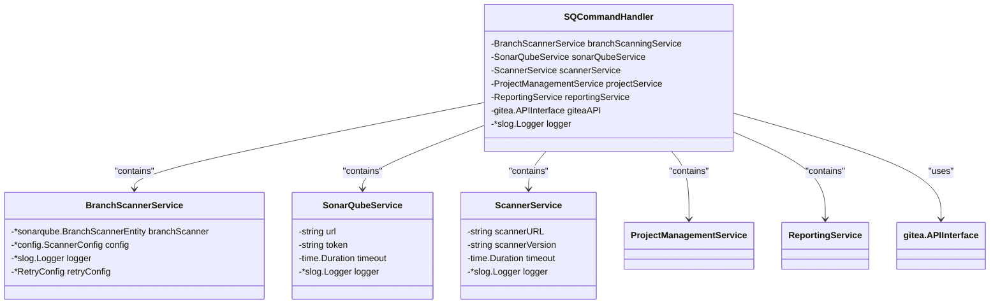

# sq-scan-branch Command

<cite>
**Referenced Files in This Document**   
- [main.go](file://cmd/benadis-runner/main.go)
- [app.go](file://internal/app/app.go)
- [sonarqube_init.go](file://internal/app/sonarqube_init.go)
- [git.go](file://internal/git/git.go)
- [constants.go](file://internal/constants/constants.go)
- [config.go](file://internal/config/config.go)
- [branch_scanner_service.go](file://internal/service/sonarqube/branch_scanner_service.go)
- [command_handler.go](file://internal/service/sonarqube/command_handler.go)
</cite>

## Table of Contents
1. [Introduction](#introduction)
2. [Command Configuration and Environment Variables](#command-configuration-and-environment-variables)
3. [Execution Workflow](#execution-workflow)
4. [Configuration Validation and Branch Eligibility](#configuration-validation-and-branch-eligibility)
5. [Gitea API Integration](#gitea-api-integration)
6. [Repository Cloning Process](#repository-cloning-process)
7. [SonarQube Service Initialization](#sonarqube-service-initialization)
8. [Error Handling Patterns](#error-handling-patterns)
9. [Temporary Directory Management](#temporary-directory-management)
10. [Integration with SonarQube Services](#integration-with-sonarqube-services)
11. [Common Issues and Troubleshooting](#common-issues-and-troubleshooting)
12. [Performance Considerations](#performance-considerations)

## Introduction
The `sq-scan-branch` command in benadis-runner initiates SonarQube code quality analysis on a specific 1C:Enterprise project branch. This command provides automated static code analysis capabilities, enabling continuous code quality monitoring for development branches. The implementation follows a structured workflow that validates configuration, initializes services, clones repositories, and executes SonarQube scans with comprehensive error handling and logging.

**Section sources**
- [main.go](file://cmd/benadis-runner/main.go#L0-L252)
- [app.go](file://internal/app/app.go#L1091-L1289)

## Command Configuration and Environment Variables
The `sq-scan-branch` command is triggered by setting the environment variable `BR_COMMAND=sq-scan-branch`. This command requires several mandatory parameters including `cfg.BranchForScan` which specifies the target branch for scanning, and an optional `commitHash` parameter that identifies a specific commit to analyze. When no commit hash is provided, the command analyzes the latest commit on the specified branch.

The command configuration is defined in the constants package with the constant `ActSQScanBranch = "sq-scan-branch"`, which maps the environment variable to the corresponding execution function. The configuration system supports both environment variables and YAML configuration files, allowing flexible deployment across different environments.


**Diagram sources**
- [constants.go](file://internal/constants/constants.go#L150-L151)
- [config.go](file://internal/config/config.go#L200-L350)

**Section sources**
- [constants.go](file://internal/constants/constants.go#L150-L151)
- [config.go](file://internal/config/config.go#L200-L350)

## Execution Workflow
The execution workflow of the `sq-scan-branch` command follows a sequential process designed for reliability and observability. The process begins with configuration validation, followed by branch eligibility checks, repository cloning, and finally SonarQube scan execution. Each step includes comprehensive error handling and structured logging using Go's `slog` package.

The workflow starts in the main function where the command is dispatched based on the `BR_COMMAND` environment variable. When `sq-scan-branch` is detected, the `SQScanBranch` function is invoked with the appropriate context, logger, configuration, and optional commit hash. The function orchestrates the entire scanning process, coordinating between various services and components.


**Diagram sources**
- [main.go](file://cmd/benadis-runner/main.go#L0-L252)
- [app.go](file://internal/app/app.go#L1091-L1289)

**Section sources**
- [main.go](file://cmd/benadis-runner/main.go#L0-L252)
- [app.go](file://internal/app/app.go#L1091-L1289)

## Configuration Validation and Branch Eligibility
The `sq-scan-branch` command implements rigorous configuration validation through the `shouldRunScanBranch` function. This function performs multiple checks to determine if scanning should proceed. First, it validates the branch name using `isValidBranchForScanning`, which accepts only the "main" branch or branches following the pattern "t" followed by 6-7 digits (e.g., "t123456").

The validation process also checks for relevant changes in the specified commit by analyzing the project structure and comparing changed files against configuration directories. If no commit hash is provided, the function assumes scanning is necessary. The validation returns early with `false` if the branch doesn't meet criteria, preventing unnecessary processing and resource consumption.


**Diagram sources**
- [app.go](file://internal/app/app.go#L955-L1000)
- [app.go](file://internal/app/app.go#L1002-L1049)

**Section sources**
- [app.go](file://internal/app/app.go#L955-L1049)

## Gitea API Integration
The `sq-scan-branch` command integrates with Gitea through the `CreateGiteaAPI` function, which initializes a Gitea API client using configuration parameters. This integration enables the command to retrieve repository information, analyze project structure, and obtain commit details necessary for the scanning process.

The Gitea API client is created with authentication credentials from the configuration, allowing secure access to repository data. The integration supports operations such as retrieving commit files and analyzing project structure, which are essential for determining scan eligibility and configuring the SonarQube analysis. The API client is passed through the service dependency chain, ensuring consistent access to Gitea functionality across components.


**Diagram sources**
- [config.go](file://internal/config/config.go#L351-L400)
- [app.go](file://internal/app/app.go#L1091-L1289)

**Section sources**
- [config.go](file://internal/config/config.go#L351-L400)
- [app.go](file://internal/app/app.go#L1091-L1289)

## Repository Cloning Process
The repository cloning process is implemented through the `git.CloneToTempDir` function, which creates a temporary directory and clones the specified repository into it. This approach isolates the scanning process from the main workspace, preventing interference with other operations and ensuring a clean environment for analysis.

The cloning function accepts parameters including the context, logger, temporary directory path, repository URL, branch name, and access token. It constructs an authenticated URL by embedding the access token, then executes the git clone command with appropriate arguments. The function includes timeout handling and output validation to detect successful cloning across different locales and environments.


**Diagram sources**
- [git.go](file://internal/git/git.go#L1031-L1100)
- [app.go](file://internal/app/app.go#L1091-L1289)

**Section sources**
- [git.go](file://internal/git/git.go#L1031-L1100)
- [app.go](file://internal/app/app.go#L1091-L1289)

## SonarQube Service Initialization
The SonarQube service initialization is handled by the `InitSonarQubeServices` function, which creates and configures all necessary services for SonarQube integration. This function implements dependency injection, creating a command handler with properly configured services for branch scanning, project management, reporting, and direct SonarQube operations.

The initialization process extracts SonarQube-specific configuration from the main application configuration, including the SonarQube URL, authentication token, timeout settings, retry attempts, and delay intervals. The function validates that required configuration components are present before proceeding, returning descriptive errors if any dependencies are missing.



**Diagram sources**
- [sonarqube_init.go](file://internal/app/sonarqube_init.go#L15-L127)
- [branch_scanner_service.go](file://internal/service/sonarqube/branch_scanner_service.go#L0-L199)

**Section sources**
- [sonarqube_init.go](file://internal/app/sonarqube_init.go#L15-L127)
- [branch_scanner_service.go](file://internal/service/sonarqube/branch_scanner_service.go#L0-L199)

## Error Handling Patterns
The `sq-scan-branch` command implements comprehensive error handling patterns throughout its execution flow. Each critical operation includes try-catch style error checking with descriptive error messages and appropriate logging levels. The implementation uses Go's error wrapping with `%w` to preserve the error chain while adding contextual information.

Key error handling patterns include:
- Configuration validation with early returns for missing or invalid parameters
- Deferred cleanup functions that execute even when errors occur
- Context-based timeout handling for external operations
- Specific error types for different failure modes
- Structured logging with key-value pairs for better debugging

The error handling strategy ensures that failures are gracefully managed, resources are properly cleaned up, and sufficient information is logged for troubleshooting without exposing sensitive data.


**Section sources**
- [app.go](file://internal/app/app.go#L1091-L1289)
- [git.go](file://internal/git/git.go#L1031-L1100)

## Temporary Directory Management
Temporary directory management is a critical aspect of the `sq-scan-branch` command's execution. The command creates temporary directories using `os.MkdirTemp` with a specific prefix ("sonar-scan-*") to facilitate identification and cleanup. These directories are used to store cloned repositories during the scanning process.

The implementation includes a deferred `os.RemoveAll` call that ensures temporary directories are cleaned up even if the scanning process fails. This prevents disk space accumulation over time. The cleanup function includes error handling to log warnings if removal fails, but does not interrupt the main execution flow, ensuring that scan results are still processed regardless of cleanup success.


**Diagram sources**
- [app.go](file://internal/app/app.go#L1091-L1289)

**Section sources**
- [app.go](file://internal/app/app.go#L1091-L1289)

## Integration with SonarQube Services
The `sq-scan-branch` command integrates with internal SonarQube services through the `ScanBranchParams` structure and associated service interfaces. The `ScanBranchParams` struct contains essential information for the scan, including owner, repository, branch, commit hash, and source directory path.

The integration follows a two-step process: first checking which commits need scanning through `CheckScanBranch`, then executing the actual scan with `HandleSQScanBranchWithCommits`. This separation allows for efficient processing by avoiding unnecessary scans of already-analyzed commits. The services are initialized with the Gitea API client, enabling coordination between repository operations and SonarQube analysis.

```mermaid
classDiagram
    class ScanBranchParams {
        +string Owner
        +string Repo
        +string Branch
