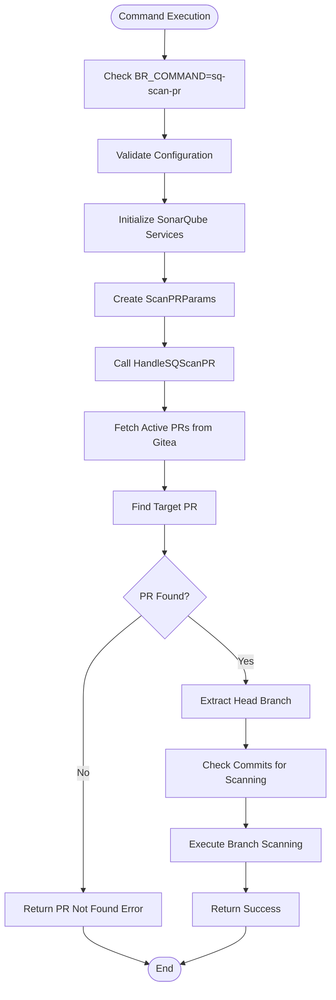
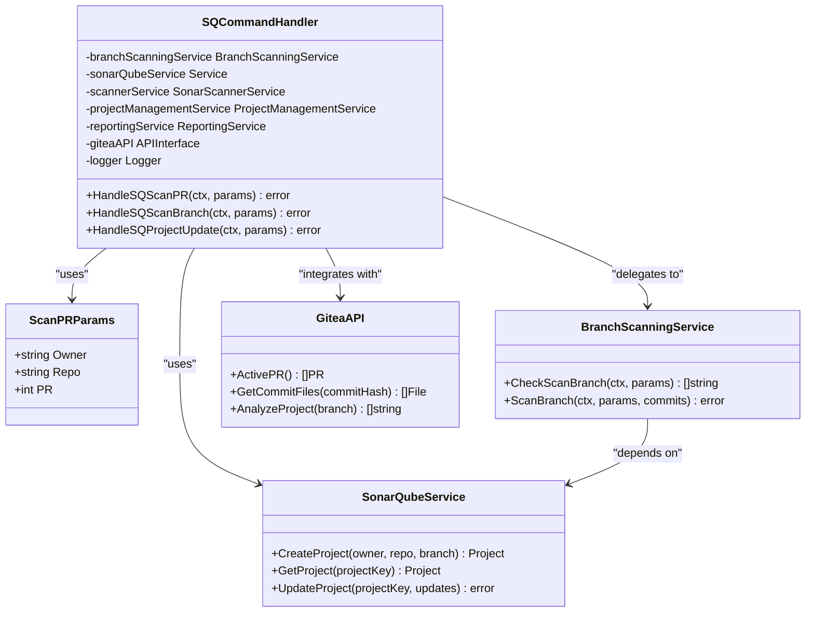
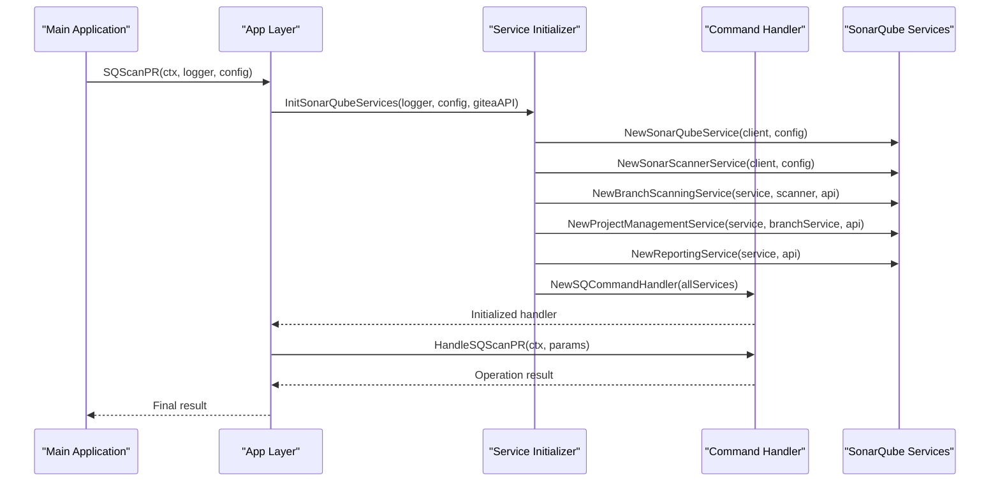
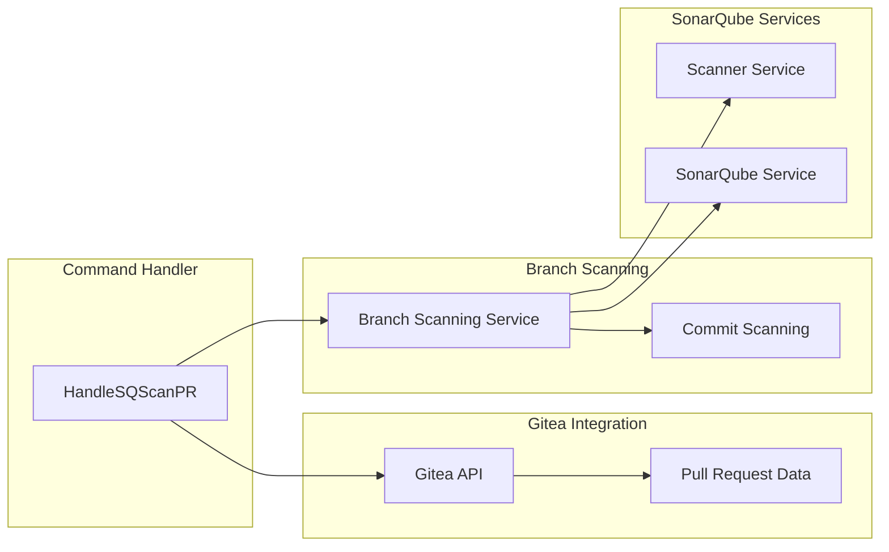
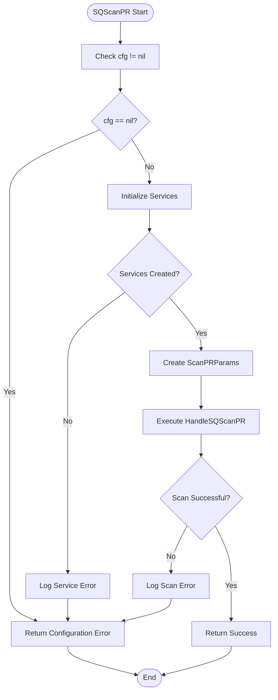

# sq-scan-pr Command

<cite>
**Referenced Files in This Document**
- [command_handler.go](file://internal/service/sonarqube/command_handler.go)
- [app.go](file://internal/app/app.go)
- [sonarqube_init.go](file://internal/app/sonarqube_init.go)
- [interfaces.go](file://internal/entity/sonarqube/interfaces.go)
- [main.go](file://cmd/benadis-runner/main.go)
- [config.go](file://internal/config/config.go)
- [sonarqube.go](file://internal/config/sonarqube.go)
- [constants.go](file://internal/constants/constants.go)
</cite>

## Table of Contents
1. [Introduction](#introduction)
2. [Command Overview](#command-overview)
3. [Architecture and Components](#architecture-and-components)
4. [Operational Flow](#operational-flow)
5. [Configuration Requirements](#configuration-requirements)
6. [Implementation Details](#implementation-details)
7. [Error Handling](#error-handling)
8. [Integration Points](#integration-points)
9. [Common Issues and Solutions](#common-issues-and-solutions)
10. [Best Practices](#best-practices)
11. [Future Enhancements](#future-enhancements)

## Introduction

The `sq-scan-pr` command is a specialized SonarQube integration feature within the benadis-runner ecosystem designed to trigger pull request analysis for 1C:Enterprise development workflows. This command enables automated code quality assessment specifically for pull requests, providing developers with immediate feedback on code quality metrics and potential issues before merging changes into the main branch.

The command operates as part of a broader SonarQube integration strategy that includes branch scanning, project management, and reporting capabilities. It leverages the Gitea API for PR context retrieval and integrates seamlessly with the existing command-line interface architecture.

## Command Overview

The `sq-scan-pr` command is activated through the environment variable `BR_COMMAND=sq-scan-pr` and requires specific configuration fields including `cfg.BaseBranch` and `cfg.Owner`. The command performs pull request-specific code analysis by:

- Initializing SonarQube services with proper dependency injection
- Constructing `ScanPRParams` with repository and PR information
- Executing the analysis through the `HandleSQScanPR` method
- Providing structured logging and error handling throughout the process



**Diagram sources**
- [command_handler.go](file://internal/service/sonarqube/command_handler.go#L140-L180)
- [app.go](file://internal/app/app.go#L1150-L1200)

**Section sources**
- [main.go](file://cmd/benadis-runner/main.go#L115-L120)
- [constants.go](file://internal/constants/constants.go#L85-L86)

## Architecture and Components

### Core Components

The `sq-scan-pr` command relies on several interconnected components that work together to provide comprehensive pull request analysis:



**Diagram sources**
- [command_handler.go](file://internal/service/sonarqube/command_handler.go#L15-L35)
- [interfaces.go](file://internal/entity/sonarqube/interfaces.go#L362-L368)

### Service Initialization

The command utilizes the `InitSonarQubeServices` function to establish all necessary service dependencies:



**Diagram sources**
- [sonarqube_init.go](file://internal/app/sonarqube_init.go#L20-L80)
- [app.go](file://internal/app/app.go#L1150-L1200)

**Section sources**
- [sonarqube_init.go](file://internal/app/sonarqube_init.go#L20-L152)
- [command_handler.go](file://internal/service/sonarqube/command_handler.go#L15-L35)

## Operational Flow

### Step-by-Step Execution

The `sq-scan-pr` command follows a well-defined operational flow that ensures reliable and consistent pull request analysis:

1. **Configuration Validation**: The system validates that the configuration is not nil and contains all required fields
2. **Service Initialization**: All SonarQube services are initialized with proper dependency injection
3. **Parameter Construction**: `ScanPRParams` is constructed with repository owner, repository name, and PR number
4. **PR Retrieval**: The command fetches active pull requests from the Gitea API
5. **PR Matching**: The target PR is located by number and validated
6. **Branch Extraction**: The head branch of the PR is extracted for analysis
7. **Commit Analysis**: The system determines which commits need scanning
8. **Branch Scanning**: The identified commits are processed through the branch scanning service
9. **Result Reporting**: Success or failure is reported with appropriate logging

### Current Implementation Limitation

A notable limitation in the current implementation is that the PR number is hardcoded to 0 in the `SQScanPR` function:

```go
params := &sqEntity.ScanPRParams{
    Owner: cfg.Owner,
    Repo:  cfg.Repo,
    PR:    0, // TODO: Получить номер PR из конфигурации
}
```

This hardcoded value prevents the command from functioning correctly in production environments and requires enhancement to automatically detect PR numbers from CI/CD environments.

**Section sources**
- [app.go](file://internal/app/app.go#L1150-L1200)
- [command_handler.go](file://internal/service/sonarqube/command_handler.go#L140-L180)

## Configuration Requirements

### Environment Variables

The `sq-scan-pr` command requires specific environment variables to operate correctly:

- `BR_COMMAND`: Must be set to `sq-scan-pr`
- `BR_OWNER`: Repository owner name
- `BR_REPO`: Repository name
- `BR_BASE_BRANCH`: Base branch for comparison
- `BR_ACCESS_TOKEN`: Gitea access token for API authentication
- `BR_GITEA_URL`: URL of the Gitea instance

### SonarQube Configuration

The command depends on comprehensive SonarQube configuration:

```yaml
sonarqube:
  url: "http://localhost:9000"
  token: "${SONARQUBE_TOKEN}"
  timeout: 30s
  retryAttempts: 3
  retryDelay: 5s
  projectPrefix: "benadis"
  defaultVisibility: "private"
  qualityGateTimeout: 300s
  disableBranchAnalysis: true
```

### Scanner Configuration

The sonar-scanner configuration must be properly set up:

```yaml
scanner:
  scannerUrl: "https://binaries.sonarsource.com/Distribution/sonar-scanner-cli/sonar-scanner-cli-4.8.0.2856-linux.zip"
  scannerVersion: "4.8.0.2856"
  javaOpts: "-Xmx2g"
  timeout: 600s
  workDir: "/tmp/benadis"
  tempDir: "/tmp/benadis/scanner/temp"
```

**Section sources**
- [config.go](file://internal/config/config.go#L100-L150)
- [sonarqube.go](file://internal/config/sonarqube.go#L15-L80)

## Implementation Details

### Parameter Structure

The `ScanPRParams` structure encapsulates all necessary information for pull request analysis:

```go
type ScanPRParams struct {
    Owner string
    Repo  string
    PR    int
}
```

This simple yet effective structure allows the command to:
- Identify the repository owner and name
- Locate the specific pull request by number
- Route the analysis to the appropriate branch

### Service Integration

The `HandleSQScanPR` method demonstrates the integration between different services:



**Diagram sources**
- [command_handler.go](file://internal/service/sonarqube/command_handler.go#L140-L180)

### Error Handling Implementation

The command implements robust error handling through the `SQScanPR` function:

```go
func SQScanPR(ctx *context.Context, l *slog.Logger, cfg *config.Config) error {
    // Проверяем конфигурацию на nil
    if cfg == nil {
        return errors.New("configuration cannot be nil")
    }
    
    // Initialize SonarQube services with structured logging
    giteaAPI := config.CreateGiteaAPI(cfg)
    handler, err := InitSonarQubeServices(l, cfg, giteaAPI)
    if err != nil {
        l.Error("Failed to initialize SonarQube services", slog.String("error", err.Error()))
        return err
    }
    
    // Create parameters for pull request scanning
    params := &sqEntity.ScanPRParams{
        Owner: cfg.Owner,
        Repo:  cfg.Repo,
        PR:    0, // TODO: Получить номер PR из конфигурации
    }
    
    // Execute the scan
    err = handler.HandleSQScanPR(*ctx, params)
    if err != nil {
        l.Error("Failed to scan pull request with SonarQube", 
                slog.String("branch", cfg.BaseBranch), 
                slog.String("error", err.Error()))
        return err
    }
    
    return nil
}
```

**Section sources**
- [app.go](file://internal/app/app.go#L1150-L1200)
- [interfaces.go](file://internal/entity/sonarqube/interfaces.go#L362-L368)

## Error Handling

### Configuration Validation

The command performs comprehensive configuration validation:



**Diagram sources**
- [app.go](file://internal/app/app.go#L1150-L1200)

### Common Error Scenarios

1. **Nil Configuration**: The command immediately returns an error if the configuration is nil
2. **Service Initialization Failure**: Any failure during service initialization is logged and returned
3. **PR Not Found**: When the target PR cannot be located in the active PR list
4. **Branch Extraction Issues**: Problems extracting the head branch from the PR metadata
5. **Commit Analysis Failures**: Errors during the determination of commits requiring scanning

### Logging Strategy

The command employs structured logging throughout the execution process:

- **Debug Level**: Detailed information about each step
- **Info Level**: High-level operation status
- **Error Level**: Comprehensive error reporting with context

**Section sources**
- [app.go](file://internal/app/app.go#L1150-L1200)
- [command_handler.go](file://internal/service/sonarqube/command_handler.go#L140-L180)

## Integration Points

### Gitea API Integration

The `sq-scan-pr` command integrates deeply with the Gitea API for pull request context:

```go
// Retrieve active PRs from Gitea
prs, err := h.giteaAPI.ActivePR()
if err != nil {
    h.logger.Error("Failed to retrieve active PRs from Gitea", "error", err)
    return fmt.Errorf("failed to retrieve active PRs: %w", err)
}

// Find the requested PR
var targetPR *gitea.PR
for _, pr := range prs {
    if pr.Number == int64(params.PR) {
        targetPR = &pr
        break
    }
}
```

This integration enables:
- **PR Discovery**: Automatic discovery of active pull requests
- **Context Extraction**: Retrieval of PR metadata including head branch
- **Validation**: Verification that the target PR exists and is active

### Branch Scanning Integration

The command delegates to the branch scanning service for actual analysis:

```go
// Delegate to branch scanning service
if err := h.branchScanningService.ScanBranch(ctx, branchParams, commitsToScan); err != nil {
    h.logger.Error("Failed to scan PR branch", "error", err)
    return fmt.Errorf("failed to scan PR branch: %w", err)
}
```

This approach provides:
- **Code Reuse**: Leverages existing branch scanning functionality
- **Consistency**: Ensures PR analysis follows the same patterns as branch analysis
- **Extensibility**: Easy to modify analysis behavior for PRs vs branches

**Section sources**
- [command_handler.go](file://internal/service/sonarqube/command_handler.go#L140-L180)

## Common Issues and Solutions

### Authentication Issues

**Problem**: SonarQube token authentication failures
**Solution**: Verify that the `SONARQUBE_TOKEN` environment variable is correctly set and has appropriate permissions

**Problem**: Gitea access token invalid or expired
**Solution**: Regenerate the access token and update the `BR_ACCESS_TOKEN` environment variable

### Configuration Issues

**Problem**: Missing PR identifier
**Solution**: The current implementation hardcodes PR number to 0. Future versions should automatically detect PR numbers from CI/CD environment variables.

**Problem**: Base branch mismatch
**Solution**: Ensure `cfg.BaseBranch` matches the target branch for comparison in the pull request

### Service Initialization Failures

**Problem**: SonarQube services fail to initialize
**Solution**: 
1. Verify SonarQube server accessibility
2. Check network connectivity and firewall settings
3. Validate configuration parameters in `app.yaml`

### PR Context Retrieval Issues

**Problem**: PR not found in active PR list
**Solution**:
1. Verify the PR number is correct
2. Check if the PR is still open and hasn't been merged
3. Ensure the Gitea API endpoint is accessible

**Section sources**
- [app.go](file://internal/app/app.go#L1150-L1200)
- [sonarqube_init.go](file://internal/app/sonarqube_init.go#L20-L80)

## Best Practices

### Configuration Management

1. **Environment Separation**: Use different configuration files for development, staging, and production environments
2. **Secret Management**: Store sensitive information like tokens in secure secret management systems
3. **Validation**: Implement configuration validation before deployment

### Error Handling

1. **Graceful Degradation**: Allow the system to continue operating even if individual PR analysis fails
2. **Comprehensive Logging**: Log all errors with sufficient context for debugging
3. **Retry Logic**: Implement exponential backoff for transient failures

### Security Considerations

1. **Token Rotation**: Regularly rotate access tokens and API keys
2. **Scope Limitation**: Use minimal required permissions for API access
3. **Network Security**: Ensure secure communication channels for all external API calls

### Monitoring and Observability

1. **Health Checks**: Implement health checks for all integrated services
2. **Metrics Collection**: Track key performance indicators for analysis operations
3. **Alerting**: Set up alerts for critical failures and performance degradation

## Future Enhancements

### Automatic PR Number Detection

The current implementation requires manual specification of PR numbers. Future enhancements should include:

```go
// TODO: Получить номер PR из конфигурации
params := &sqEntity.ScanPRParams{
    Owner: cfg.Owner,
    Repo:  cfg.Repo,
    PR:    getPRNumberFromEnv(), // New function to extract PR number
}
```

Potential sources for PR number detection:
- GitHub Actions environment variables (`GITHUB_PR_NUMBER`)
- GitLab CI environment variables (`CI_MERGE_REQUEST_IID`)
- Bitbucket Pipelines environment variables
- Custom CI/CD pipeline variables

### Enhanced Error Recovery

Implement more sophisticated error recovery mechanisms:
- Automatic retry with exponential backoff
- Fallback to alternative analysis methods
- Graceful degradation to basic analysis when full functionality is unavailable

### Performance Optimizations

- **Parallel Processing**: Enable concurrent analysis of multiple PRs
- **Caching**: Implement intelligent caching of analysis results
- **Resource Management**: Optimize memory and CPU usage during analysis

### Extended Integration Capabilities

- **Multiple PR Support**: Ability to analyze multiple pull requests simultaneously
- **Custom Analysis Rules**: Support for organization-specific quality gates and rules
- **Integration Hooks**: Webhook support for real-time analysis triggers

### Enhanced Reporting Features

- **Detailed Reports**: More comprehensive analysis reports with actionable insights
- **Historical Tracking**: Long-term trend analysis and improvement tracking
- **Integration with Development Tools**: Direct integration with IDEs and development workflows

**Section sources**
- [app.go](file://internal/app/app.go#L1150-L1200)
- [command_handler.go](file://internal/service/sonarqube/command_handler.go#L140-L180)