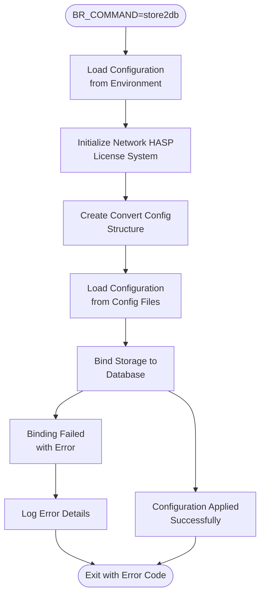
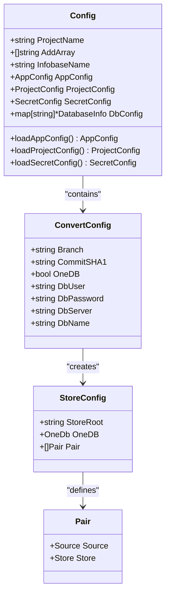
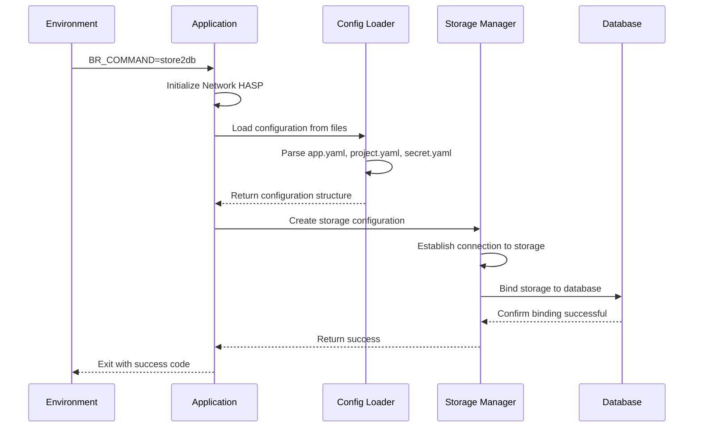
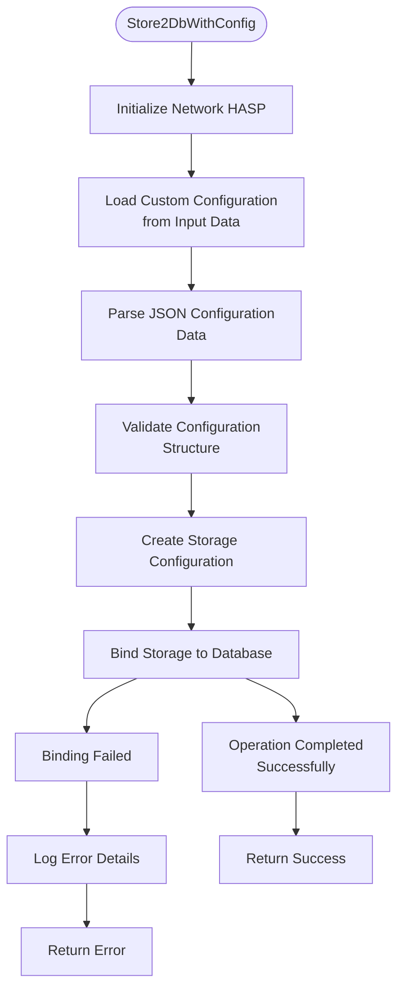
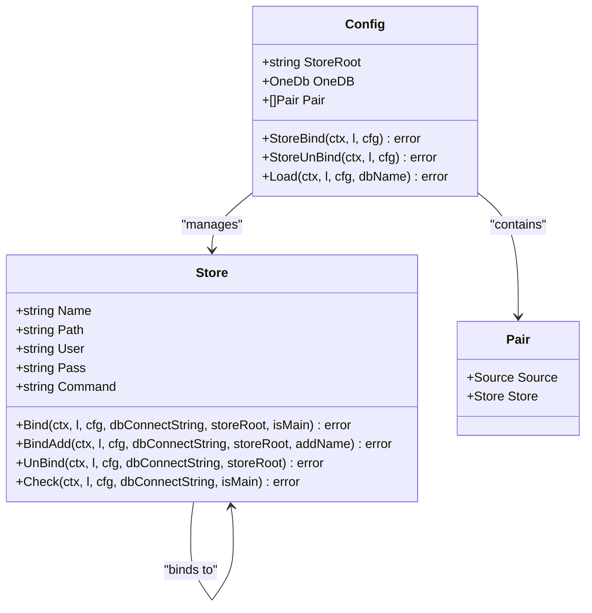
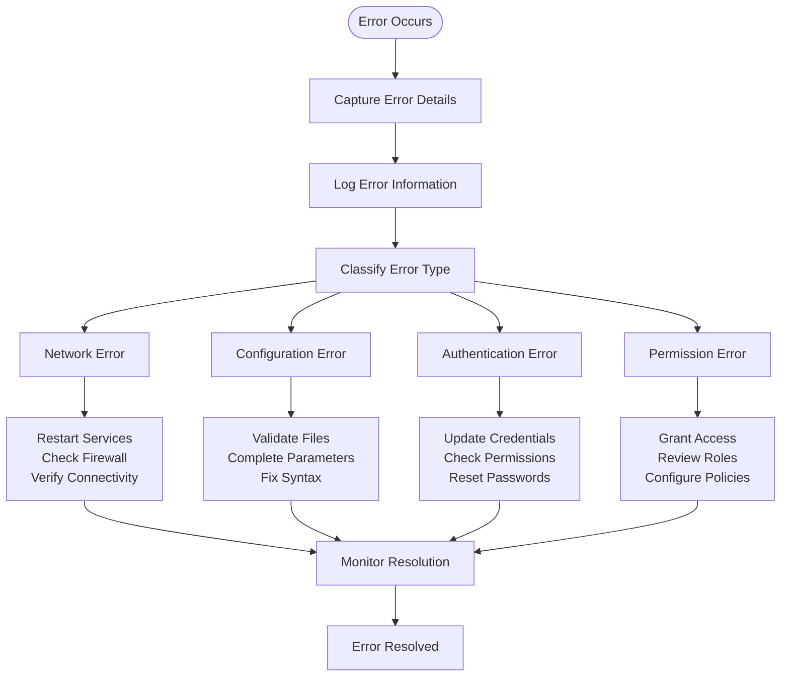

# Store2db Command

<cite>
**Referenced Files in This Document**
- [constants.go](file://internal/constants/constants.go)
- [app.go](file://internal/app/app.go)
- [convert.go](file://internal/entity/one/convert/convert.go)
- [store.go](file://internal/entity/one/store/store.go)
- [main.go](file://cmd/benadis-runner/main.go)
- [config.go](file://internal/config/config.go)
- [action.yaml](file://config/action.yaml)
- [app.yaml](file://config/app.yaml)
</cite>

## Table of Contents
1. [Introduction](#introduction)
2. [Command Overview](#command-overview)
3. [Environment Variables](#environment-variables)
4. [Configuration Requirements](#configuration-requirements)
5. [Workflow Analysis](#workflow-analysis)
6. [Implementation Details](#implementation-details)
7. [Storage Operations](#storage-operations)
8. [Use Cases](#use-cases)
9. [Troubleshooting](#troubleshooting)
10. [Best Practices](#best-practices)

## Introduction

The `store2db` command in benadis-runner is a critical component designed to synchronize configuration data from 1C configuration storage to database systems. This command serves as the primary mechanism for deploying configuration changes to test and production environments, ensuring consistency between development configurations and operational databases.

The command operates by loading configuration data from 1C storage repositories, binding them to target databases, and applying the configuration changes through a series of orchestrated operations. It supports both standard configuration loading and custom configuration file scenarios through two distinct implementation variants.

## Command Overview

The `store2db` command is identified by the environment variable `BR_COMMAND=store2db` and represents one of the core actions in the benadis-runner ecosystem. It facilitates the transfer of configuration artifacts from version-controlled storage to operational databases, enabling seamless deployment of configuration updates across different environments.



**Diagram sources**
- [app.go](file://internal/app/app.go#L543-L570)
- [main.go](file://cmd/benadis-runner/main.go#L30-L35)

**Section sources**
- [constants.go](file://internal/constants/constants.go#L67-L67)
- [main.go](file://cmd/benadis-runner/main.go#L30-L35)

## Environment Variables

The store2db command relies on several environment variables to configure its execution context and operational parameters:

### Required Environment Variables

| Variable | Description | Example |
|----------|-------------|---------|
| `BR_COMMAND` | Specifies the command to execute (`store2db`) | `store2db` |
| `BR_INFOBASE_NAME` | Name of the target database instance | `TestDB` |
| `BR_ACCESS_TOKEN` | Authentication token for Gitea integration | `abc123def456` |
| `BR_GITEA_URL` | URL of the Gitea server | `https://gitea.example.com` |
| `BR_REPOSITORY` | Full repository name | `organization/project` |

### Optional Environment Variables

| Variable | Description | Default Value |
|----------|-------------|---------------|
| `BR_LOGLEVEL` | Logging verbosity level | `Info` |
| `BR_TERMINATE_SESSIONS` | Whether to terminate active sessions | `false` |
| `BR_FORCE_UPDATE` | Force configuration update | `false` |

**Section sources**
- [config.go](file://internal/config/config.go#L100-L120)
- [action.yaml](file://config/action.yaml#L1-L50)

## Configuration Requirements

### Basic Configuration Loading

The store2db command requires a comprehensive configuration structure that defines the relationship between storage repositories and target databases. The configuration system supports multiple configuration files and environment-based overrides.



**Diagram sources**
- [config.go](file://internal/config/config.go#L150-L200)
- [convert.go](file://internal/entity/one/convert/convert.go#L30-L50)

### Storage Connection Details

The command establishes connections to 1C storage repositories using the following parameters:

- **Store Root**: TCP protocol endpoint for remote storage access
- **Database Connection String**: Full connection specification including server, database, and authentication
- **User Credentials**: Administrative credentials for storage operations
- **Path Specifications**: Relative paths within the storage repository

**Section sources**
- [convert.go](file://internal/entity/one/convert/convert.go#L80-L120)
- [app.yaml](file://config/app.yaml#L1-L30)

## Workflow Analysis

### Standard Store2Db Workflow

The standard Store2Db function follows a streamlined execution path optimized for typical configuration deployment scenarios:



**Diagram sources**
- [app.go](file://internal/app/app.go#L543-L555)
- [convert.go](file://internal/entity/one/convert/convert.go#L120-L150)

### Store2DbWithConfig Workflow

The advanced Store2DbWithConfig variant provides enhanced flexibility by accepting custom configuration data:



**Diagram sources**
- [app.go](file://internal/app/app.go#L571-L583)
- [convert.go](file://internal/entity/one/convert/convert.go#L150-L180)

**Section sources**
- [app.go](file://internal/app/app.go#L543-L583)
- [convert.go](file://internal/entity/one/convert/convert.go#L80-L180)

## Implementation Details

### Store2Db Function

The Store2Db function serves as the primary entry point for standard configuration deployment scenarios. It initializes the network HASP license system and orchestrates the configuration loading process:

```go
func Store2Db(ctx *context.Context, l *slog.Logger, cfg *config.Config) error {
    var err error
    NetHaspInit(ctx, l)
    cc := convert.Config{}
    err = cc.Load(ctx, l, cfg, cfg.InfobaseName)
    if err != nil {
        return err
    }
    err = cc.StoreBind(ctx, l, cfg)
    if err != nil {
        return err
    }
    return err
}
```

### Store2DbWithConfig Function

The Store2DbWithConfig function provides enhanced configurability by accepting custom configuration data:

```go
func Store2DbWithConfig(ctx *context.Context, l *slog.Logger, cfg *config.Config) error {
    var err error
    NetHaspInit(ctx, l)
    
    // Load configuration from provided data
    cc, err := convert.LoadFromConfig(ctx, l, cfg)
    if err != nil {
        return err
    }
    
    err = cc.StoreBind(ctx, l, cfg)
    if err != nil {
        return err
    }
    return err
}
```

### Configuration Loading Mechanisms

The system supports multiple configuration loading approaches:

1. **Standard Loading**: Uses predefined configuration files from the filesystem
2. **Custom Loading**: Accepts JSON configuration data from external sources
3. **Environment-Based Loading**: Applies environment variable overrides

**Section sources**
- [app.go](file://internal/app/app.go#L543-L583)
- [convert.go](file://internal/entity/one/convert/convert.go#L80-L180)

## Storage Operations

### Storage Binding Process

The storage binding operation is the core functionality of the store2db command, establishing the connection between 1C storage repositories and target databases:



**Diagram sources**
- [store.go](file://internal/entity/one/store/store.go#L25-L50)
- [convert.go](file://internal/entity/one/convert/convert.go#L30-L50)

### Storage Operations Implementation

The storage operations encompass several critical functions:

#### Binding Operations
- **Primary Configuration Binding**: Connects main configuration to database
- **Extension Binding**: Attaches configuration extensions to the main database
- **Force Binding**: Ensures existing user bindings are preserved during reconnection

#### Validation Operations
- **Connection Verification**: Validates storage accessibility and connectivity
- **Configuration Consistency**: Ensures configuration integrity before binding
- **Permission Validation**: Verifies administrative privileges for storage operations

#### Error Handling
- **Graceful Degradation**: Attempts alternative binding strategies on failure
- **Detailed Logging**: Provides comprehensive error information for troubleshooting
- **Rollback Capability**: Supports cleanup operations in case of binding failures

**Section sources**
- [store.go](file://internal/entity/one/store/store.go#L300-L400)
- [convert.go](file://internal/entity/one/convert/convert.go#L400-L500)

## Use Cases

### Test Environment Deployment

The store2db command excels in test environment scenarios, particularly for the TaskStore2DbTest constant:

```go
// TaskStore2DbTest represents the task header for loading configuration to test database
TaskStore2DbTest = "Загрузка конфигурации из хранилища [TEST]"
```

This use case involves:
- Loading latest configuration from development storage
- Applying changes to test database instances
- Validating configuration compatibility
- Preparing test environments for automated testing

### Production Environment Deployment

For production deployments, the command utilizes the TaskStore2DbProd constant:

```go
// TaskStore2DbProd represents the task header for loading configuration to production database
TaskStore2DbProd = "Загрузка конфигурации из хранилища [PROD]"
```

Production use cases include:
- Scheduled configuration updates
- Emergency configuration rollbacks
- Multi-environment synchronization
- Disaster recovery procedures

### Configuration Migration Scenarios

The command supports various migration scenarios:

1. **Incremental Updates**: Apply only changed configuration elements
2. **Full Replacements**: Replace entire configuration sets
3. **Selective Deployments**: Target specific configuration components
4. **Batch Operations**: Process multiple configurations simultaneously

**Section sources**
- [constants.go](file://internal/constants/constants.go#L100-L110)
- [app.go](file://internal/app/app.go#L543-L583)

## Troubleshooting

### Common Issues and Solutions

#### Storage Binding Failures

**Symptoms**: Binding operations fail with connection errors or permission denied messages.

**Diagnosis Steps**:
1. Verify storage server accessibility
2. Check network connectivity and firewall settings
3. Validate authentication credentials
4. Review storage permissions and quotas

**Resolution Strategies**:
- Restart storage services if necessary
- Update authentication credentials
- Configure appropriate firewall rules
- Contact storage administrators for permission adjustments

#### Configuration Loading Errors

**Symptoms**: Configuration parsing fails or missing required parameters.

**Diagnosis Steps**:
1. Validate configuration file syntax
2. Check required field completeness
3. Verify file path accessibility
4. Review environment variable settings

**Resolution Strategies**:
- Correct configuration file syntax errors
- Complete missing configuration parameters
- Fix file path issues
- Set appropriate environment variables

#### Database Connection Problems

**Symptoms**: Unable to establish connection to target database.

**Diagnosis Steps**:
1. Verify database server availability
2. Check connection string format
3. Validate user credentials
4. Review database permissions

**Resolution Strategies**:
- Restart database services
- Correct connection string parameters
- Update user credentials
- Grant necessary database permissions

### Error Monitoring and Logging

The system provides comprehensive logging capabilities for troubleshooting:



**Section sources**
- [store.go](file://internal/entity/one/store/store.go#L300-L400)
- [convert.go](file://internal/entity/one/convert/convert.go#L400-L500)

## Best Practices

### Configuration Management

1. **Version Control**: Maintain configuration files in version control systems
2. **Environment Separation**: Use separate configurations for different environments
3. **Validation**: Implement configuration validation before deployment
4. **Documentation**: Document configuration parameters and their purposes

### Security Considerations

1. **Credential Management**: Use secure credential storage solutions
2. **Access Control**: Implement least-privilege access principles
3. **Audit Logging**: Enable comprehensive audit logging for all operations
4. **Encryption**: Encrypt sensitive configuration data in transit and at rest

### Operational Excellence

1. **Monitoring**: Implement comprehensive monitoring and alerting
2. **Automation**: Automate routine configuration deployment tasks
3. **Testing**: Test configuration changes in isolated environments
4. **Rollback Procedures**: Maintain documented rollback procedures

### Performance Optimization

1. **Connection Pooling**: Utilize connection pooling for database operations
2. **Batch Processing**: Process multiple configurations efficiently
3. **Resource Management**: Monitor and optimize resource utilization
4. **Caching**: Implement appropriate caching strategies for frequently accessed data

**Section sources**
- [app.yaml](file://config/app.yaml#L1-L50)
- [config.go](file://internal/config/config.go#L100-L200)