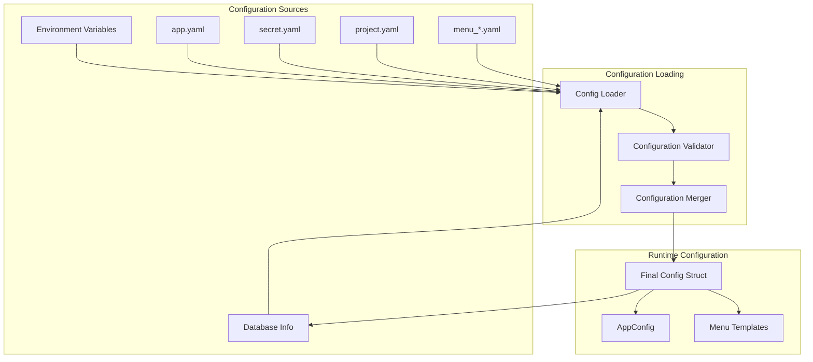
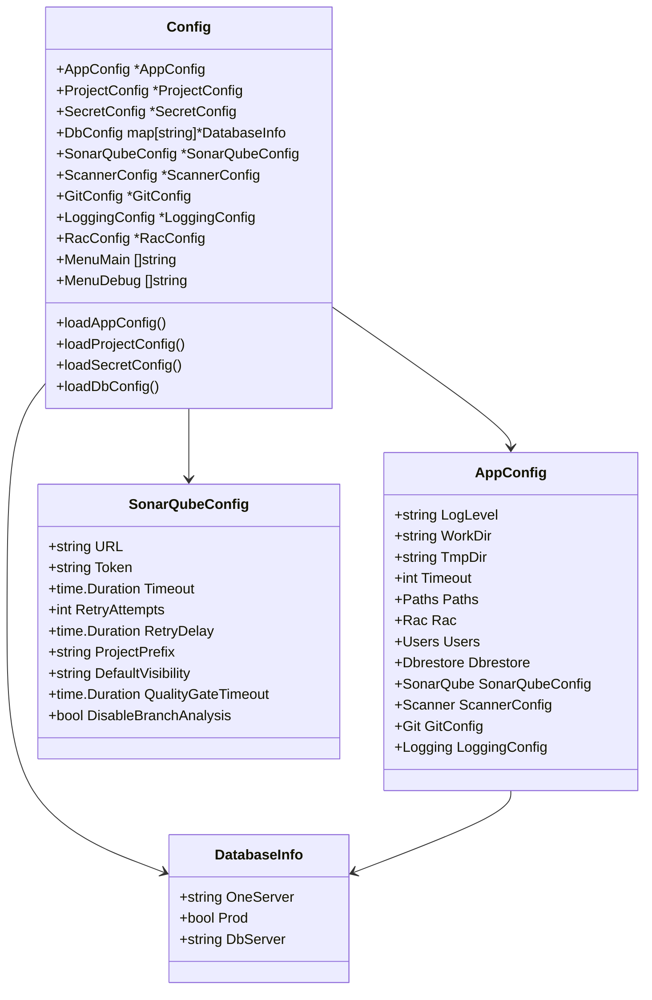
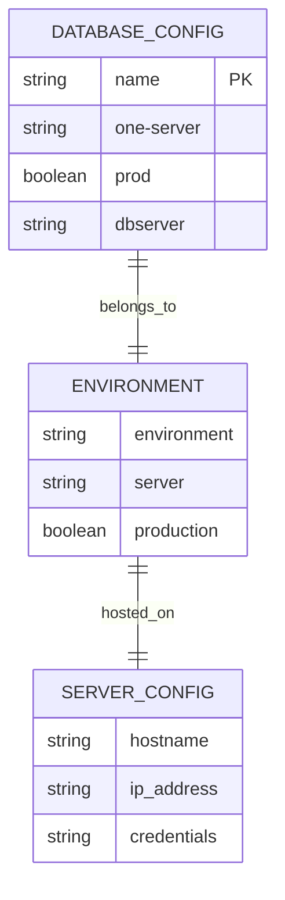
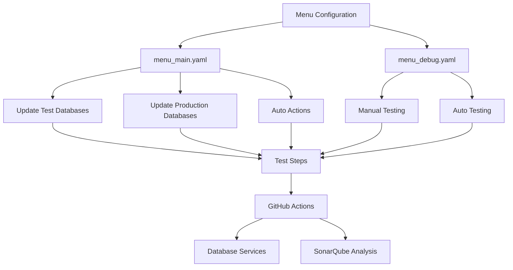
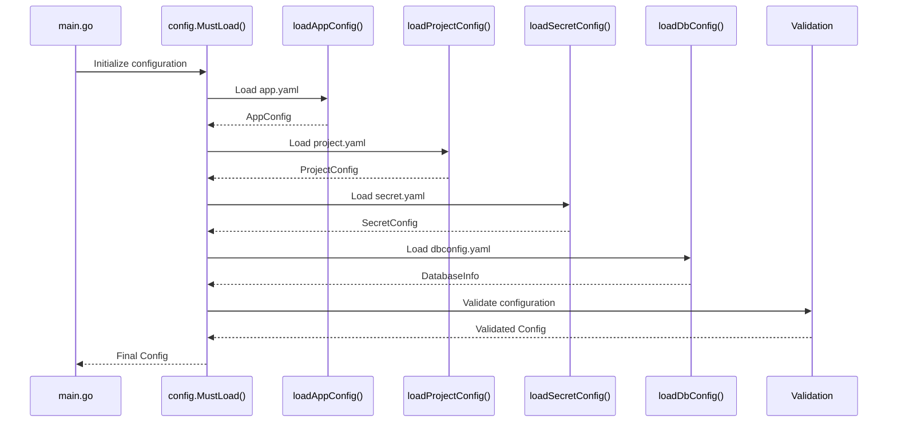
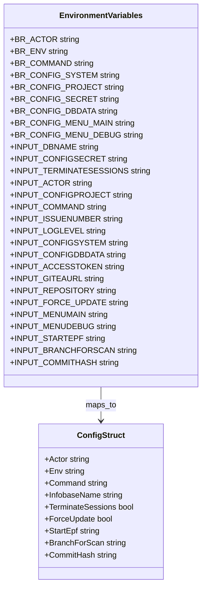
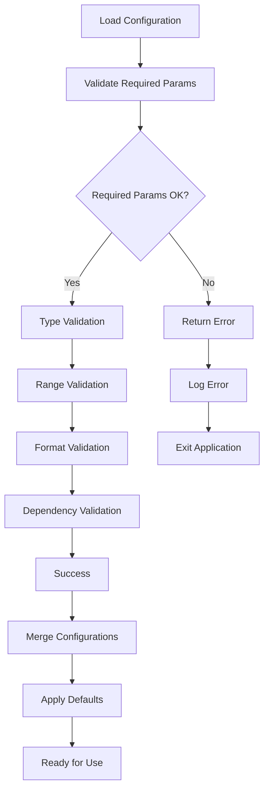

# Configuration Details

<cite>
**Referenced Files in This Document**
- [app.yaml](file://config/app.yaml)
- [dbconfig.yaml](file://config/dbconfig.yaml)
- [menu_main.yaml](file://config/menu_main.yaml)
- [menu_debug.yaml](file://config/menu_debug.yaml)
- [config.go](file://internal/config/config.go)
- [sonarqube.go](file://internal/config/sonarqube.go)
- [main.go](file://cmd/benadis-runner/main.go)
- [constants.go](file://internal/constants/constants.go)
- [config_test.go](file://internal/config/config_test.go)
</cite>

## Table of Contents
1. [Introduction](#introduction)
2. [Configuration Architecture](#configuration-architecture)
3. [Core Configuration Files](#core-configuration-files)
4. [Application Configuration (app.yaml)](#application-configuration-appyaml)
5. [Database Configuration (dbconfig.yaml)](#database-configuration-dbconfigyaml)
6. [Menu Configuration Files](#menu-configuration-files)
7. [Configuration Loading Mechanism](#configuration-loading-mechanism)
8. [Environment Variables and Overrides](#environment-variables-and-overrides)
9. [Validation and Error Handling](#validation-and-error-handling)
10. [Deployment Scenarios](#deployment-scenarios)
11. [Best Practices](#best-practices)

## Introduction

The benadis-runner application uses a sophisticated configuration system built around YAML files and environment variables. This system provides flexible configuration management for different deployment scenarios while maintaining security and operational reliability. The configuration architecture separates concerns into distinct files for application settings, database connections, menus, and secrets, enabling modular and maintainable configuration management.

## Configuration Architecture

The configuration system follows a layered approach with multiple configuration sources that provide fallback mechanisms and environment-specific overrides:



**Diagram sources**
- [config.go](file://internal/config/config.go#L1-L100)
- [main.go](file://cmd/benadis-runner/main.go#L1-L50)

## Core Configuration Files

The configuration system consists of several key files, each serving a specific purpose:

### Configuration File Hierarchy



**Diagram sources**
- [config.go](file://internal/config/config.go#L30-L150)
- [sonarqube.go](file://internal/config/sonarqube.go#L15-L80)

**Section sources**
- [config.go](file://internal/config/config.go#L30-L200)
- [sonarqube.go](file://internal/config/sonarqube.go#L1-L100)

## Application Configuration (app.yaml)

The `app.yaml` file serves as the primary configuration file containing system-wide settings for the benadis-runner application. It defines logging, timeouts, executable paths, and service-specific configurations.

### Logging Configuration

```yaml
logging:
  level: "info"
  format: "json"
  output: "stdout"
  filePath: "/var/log/benadis-runner.log"
  maxSize: 100
  maxBackups: 3
  maxAge: 28
  compress: true
```

**Configuration Details:**
- **Level**: Log verbosity (debug, info, warn, error)
- **Format**: Output format (json, text)
- **Output**: Destination (stdout, stderr, file)
- **FilePath**: Log file location (when output=file)
- **MaxSize**: Maximum log file size in MB
- **MaxBackups**: Number of backup files to keep
- **MaxAge**: Backup file retention period in days
- **Compress**: Whether to compress old log files

### Timeout and Path Configuration

```yaml
app:
  logLevel: "Debug"
  workDir: "/tmp/benadis"
  tmpDir: "/tmp/benadis/temp"
  timeout: 30

paths:
  bin1cv8: "/opt/1cv8/x86_64/8.3.27.1606/1cv8"
  binIbcmd: "/opt/1cv8/x86_64/8.3.27.1606/ibcmd"
  edtCli: "/opt/1C/1CE/components/1c-edt-2024.2.6+7-x86_64/1cedtcli"
  rac: "/opt/1cv8/x86_64/8.3.27.1606/rac"
```

**Configuration Details:**
- **logLevel**: Application logging verbosity
- **workDir**: Primary working directory
- **tmpDir**: Temporary file storage directory
- **timeout**: Default timeout in seconds
- **bin1cv8**: Path to 1C:Enterprise runtime
- **binIbcmd**: Path to 1C:Enterprise command-line tool
- **edtCli**: Path to Enterprise Development Tools CLI
- **rac**: Path to Remote Administration Console

### SonarQube Integration

```yaml
sonarqube:
  url: "http://sq.apkholding.ru:9000"
  timeout: "30s"
  retryAttempts: 3
  retryDelay: "1s"
  projectPrefix: ""
  defaultVisibility: "private"
  qualityGateTimeout: "5m"
```

**Configuration Details:**
- **url**: SonarQube server endpoint
- **timeout**: API request timeout
- **retryAttempts**: Number of retry attempts
- **retryDelay**: Delay between retries
- **projectPrefix**: Prefix for project keys
- **defaultVisibility**: New project visibility (private/public)
- **qualityGateTimeout**: Quality gate evaluation timeout

### Scanner Configuration

```yaml
scanner:
  scannerUrl: "https://regdv.apkholding.ru/gitops-tools/sonar-scanner-cli.git"
  scannerVersion: "7.2.0.5079"
  javaOpts: "-Xmx8192m"
  timeout: "240m"
  workDir: "/tmp/4del/scanner"
  tempDir: "/tmp/4del/scanner/temp"
  properties:
    sonar.sourceEncoding: "UTF-8"
    sonar.sources: "."
    sonar.inclusions: "**/*.bsl,**/*.os,**/*.epf,**/*.erf,**/*.cf,**/*.cfe,**/*.xml,**/*.mdo,**/*.mxl,**/*.dcr,**/*.dcs,**/*.xsd,**/*.go"
    sonar.language: "bsl"
    sonar.bsl.file.suffixes: ".bsl,.os"
    sonar.bsl.languageserver.enabled: "true"
    sonar.bsl.languageserver.diagnosticLanguage: "ru"
    sonar.exclusions: "**/*_test.go,**/vendor/**,**/node_modules/**,**/Ext/**,**/bin/**,**/obj/**,**/*.dt,**/*.1cd,**/*.cf.bak,**/Backup/**,**/logs/**"
    sonar.test.exclusions: "**/Forms/**,**/Templates/**,**/Pictures/**"
    sonar.profile: "1C (BSL) Community"
    sonar.bsl.sqale.duplicationExclusions: "**/*.xml,**/*.mdo"
```

**Configuration Details:**
- **scannerUrl**: Download URL for sonar-scanner
- **scannerVersion**: Specific version to use
- **javaOpts**: JVM options for scanner execution
- **timeout**: Scanner execution timeout
- **workDir**: Working directory for scanner
- **tempDir**: Temporary directory for scanner files
- **properties**: Additional scanner properties for 1C:Enterprise analysis

**Section sources**
- [app.yaml](file://config/app.yaml#L1-L138)
- [config.go](file://internal/config/config.go#L30-L100)

## Database Configuration (dbconfig.yaml)

The `dbconfig.yaml` file contains comprehensive database connection information for multiple environments and database instances. This file supports hundreds of database configurations organized by environment and purpose.

### Database Configuration Structure

```yaml
V8_ARCH_APK_CENTER_UT:
  one-server: MSK-AS-ARCH-001
  prod: false
  dbserver: MSK-SQL-ARCH-01
  
V8_ARCH_APK_FINANCE:
  one-server: MSK-AS-ARCH-001
  prod: false
  dbserver: MSK-SQL-ARCH-01
```

### Configuration Schema

Each database entry contains three essential fields:



**Diagram sources**
- [dbconfig.yaml](file://config/dbconfig.yaml#L1-L50)

### Environment Categories

The database configuration organizes databases into logical categories:

1. **Development Environments**: Test databases for development
2. **Production Environments**: Live production databases
3. **Demo Environments**: Public demonstration databases
4. **CI/CD Environments**: Automated testing databases

### Database Types

Different database types require specific configuration:

- **V8_**: Standard 1C:Enterprise databases
- **TEST_**: Test environment databases
- **DEV_**: Development environment databases
- **CICD_**: Continuous Integration databases

**Section sources**
- [dbconfig.yaml](file://config/dbconfig.yaml#L1-L800)
- [config.go](file://internal/config/config.go#L70-L85)

## Menu Configuration Files

The menu configuration system uses YAML files to define GitHub Actions workflows and job templates for different operational modes.

### Main Menu Configuration (menu_main.yaml)

The main menu defines workflows for production and test database updates:

```yaml
1. Обновление тестовых баз.yaml
run-name: ${{ gitea.event_name }} - ${{ gitea.workflow }} - ${{ gitea.actor }}
on:
  workflow_dispatch:
    inputs:
      restore_DB:
        description: 'Восстановить базу перед загрузкой конфигурации'
        required: true
        type: boolean
        default: false 
      service_mode_enable:
        description: 'Включить сервисный режим'
        required: true
        type: boolean
        default: true 
```

### Menu Structure



**Diagram sources**
- [menu_main.yaml](file://config/menu_main.yaml#L1-L50)
- [menu_debug.yaml](file://config/menu_debug.yaml#L1-L50)

### Debug Menu Configuration (menu_debug.yaml)

The debug menu provides comprehensive testing capabilities:

```yaml
Отладка.yaml
name: Test All Actions
on:
  workflow_dispatch:
    inputs:
      version:
        description: 'Version of benadis-runner'
        required: true
        default: 'v1.2.4'
        type: string
      action_1:
        description: 'Enable service mode for database'
        required: false
        default: true
        type: boolean
```

### Available Actions

The debug menu supports various actions:

1. **Service Mode Operations**: Enable/disable service mode
2. **Database Operations**: Store2db, DB update, DB restore
3. **Code Analysis**: Project analysis, conversion testing
4. **Integration Testing**: Git synchronization, menu building

**Section sources**
- [menu_main.yaml](file://config/menu_main.yaml#L1-L324)
- [menu_debug.yaml](file://config/menu_debug.yaml#L1-L257)

## Configuration Loading Mechanism

The configuration loading system uses a hierarchical approach with multiple fallback sources and validation layers.

### Loading Process



**Diagram sources**
- [config.go](file://internal/config/config.go#L600-L700)
- [main.go](file://cmd/benadis-runner/main.go#L15-L30)

### Configuration Priority Order

The system follows a specific priority order for configuration sources:

1. **Environment Variables** (Highest Priority)
2. **AppConfig** (From app.yaml)
3. **SecretConfig** (From secret.yaml)
4. **Default Values** (Lowest Priority)

### Loading Functions

Each configuration type has dedicated loading functions:

```go
// Configuration loading functions
func loadAppConfig(l *slog.Logger, cfg *Config) (*AppConfig, error)
func loadProjectConfig(l *slog.Logger, cfg *Config) (*ProjectConfig, error)
func loadSecretConfig(l *slog.Logger, cfg *Config) (*SecretConfig, error)
func loadDbConfig(l *slog.Logger, cfg *Config) (map[string]*DatabaseInfo, error)
```

**Section sources**
- [config.go](file://internal/config/config.go#L600-L800)
- [config_test.go](file://internal/config/config_test.go#L1-L100)

## Environment Variables and Overrides

The configuration system supports extensive environment variable overrides for dynamic configuration management.

### Environment Variable Schema



**Diagram sources**
- [config.go](file://internal/config/config.go#L100-L150)

### Variable Categories

#### System Configuration Variables
- `BR_ACTOR`: Current user executing the process
- `BR_ENV`: Deployment environment (dev, test, prod)
- `BR_COMMAND`: Operation to perform
- `BR_CONFIG_*`: Configuration file paths

#### Input Parameters
- `INPUT_*`: GitHub Actions workflow inputs
- `GHA*`: GitHub Actions parameter aliases
- `BR_*`: Internal runner parameters

#### Database Configuration
- `BR_INFOBASE_NAME`: Target database name
- `BR_TERMINATE_SESSIONS`: Session termination flag
- `BR_FORCE_UPDATE`: Force update flag

### Variable Processing

The system uses the `cleanenv` library for environment variable processing:

```go
// Environment variable loading
if err := cleanenv.ReadEnv(inputParams); err != nil {
    return nil
}
```

**Section sources**
- [config.go](file://internal/config/config.go#L100-L200)
- [config_test.go](file://internal/config/config_test.go#L700-L800)

## Validation and Error Handling

The configuration system implements comprehensive validation and error handling mechanisms.

### Validation Pipeline



**Diagram sources**
- [config.go](file://internal/config/config.go#L500-L600)

### Required Parameter Validation

The system validates essential parameters:

```go
func validateRequiredParams(inputParams *InputParams, l *slog.Logger) error {
    var missingParams []string
    
    if inputParams.GHAActor == "" {
        missingParams = append(missingParams, "ACTOR")
    }
    if inputParams.GHAGiteaURL == "" {
        missingParams = append(missingParams, "GITEAURL")
    }
    if inputParams.GHARepository == "" {
        missingParams = append(missingParams, "REPOSITORY")
    }
    if inputParams.GHAAccessToken == "" {
        missingParams = append(missingParams, "ACCESSTOKEN")
    }
    if inputParams.GHACommand == "" {
        missingParams = append(missingParams, "COMMAND")
    }
    
    if len(missingParams) > 0 {
        return fmt.Errorf("Отсутствуют обязательные параметры: %s", 
            strings.Join(missingParams, ", "))
    }
    return nil
}
```

### Type and Range Validation

Each configuration type implements specific validation:

#### SonarQube Configuration Validation
```go
func (s *SonarQubeConfig) Validate() error {
    if s.URL == "" {
        return fmt.Errorf("SonarQube URL is required")
    }
    if s.Token == "" {
        return fmt.Errorf("SonarQube token is required")
    }
    if s.Timeout <= 0 {
        return fmt.Errorf("SonarQube timeout must be positive")
    }
    // Additional validations...
}
```

#### Scanner Configuration Validation
```go
func (s *ScannerConfig) Validate() error {
    if s.ScannerURL == "" {
        return fmt.Errorf("scanner URL is required")
    }
    if s.ScannerVersion == "" {
        return fmt.Errorf("scanner version is required")
    }
    if s.Timeout <= 0 {
        return fmt.Errorf("scanner timeout must be positive")
    }
    return nil
}
```

### Error Handling Strategies

1. **Graceful Degradation**: Use defaults when configuration fails
2. **Logging**: Comprehensive error logging with context
3. **Early Validation**: Fail fast on critical configuration errors
4. **Fallback Mechanisms**: Multiple layers of configuration sources

**Section sources**
- [config.go](file://internal/config/config.go#L500-L600)
- [sonarqube.go](file://internal/config/sonarqube.go#L80-L150)
- [config_test.go](file://internal/config/config_test.go#L200-L400)

## Deployment Scenarios

The configuration system supports various deployment scenarios with appropriate defaults and overrides.

### Development Environment

```yaml
# Development configuration
app:
  logLevel: "Debug"
  workDir: "/tmp/benadis"
  tmpDir: "/tmp/benadis/temp"
  timeout: 60

sonarqube:
  url: "http://localhost:9000"
  timeout: "60s"
  retryAttempts: 3
  retryDelay: "1s"
```

### Production Environment

```yaml
# Production configuration
app:
  logLevel: "Info"
  workDir: "/var/lib/benadis"
  tmpDir: "/var/tmp/benadis"
  timeout: 300

sonarqube:
  url: "https://sonar.company.com"
  timeout: "120s"
  retryAttempts: 5
  retryDelay: "5s"
```

### CI/CD Environment

```yaml
# CI/CD configuration
app:
  logLevel: "Debug"
  workDir: "/tmp/ci"
  tmpDir: "/tmp/ci/temp"
  timeout: 1800

sonarqube:
  url: "http://sonar-ci:9000"
  timeout: "300s"
  retryAttempts: 3
  retryDelay: "10s"
```

### Environment-Specific Overrides

Environment variables can override configuration values:

```bash
# Production overrides
export BR_ENV=production
export SONARQUBE_URL=https://sonar.prod.company.com
export SONARQUBE_TOKEN=prod-token-here
export BR_CONFIG_SYSTEM=/etc/benadis/prod.yaml
```

### Sample Configuration Files

#### Basic Development Setup
```yaml
# app.yaml - Development
app:
  logLevel: "Debug"
  workDir: "/tmp/benadis-dev"
  tmpDir: "/tmp/benadis-dev/temp"
  timeout: 30

paths:
  bin1cv8: "/usr/local/bin/1cv8"
  binIbcmd: "/usr/local/bin/ibcmd"
  edtCli: "/opt/edt/edt-cli"
  rac: "/usr/local/bin/rac"

sonarqube:
  url: "http://localhost:9000"
  timeout: "30s"
  retryAttempts: 3
  retryDelay: "1s"
```

#### Production Database Configuration
```yaml
# dbconfig.yaml - Production
PROD_APK_CENTER:
  one-server: prod-1c-server.company.com
  prod: true
  dbserver: prod-sql-server.company.com

PROD_APK_FINANCE:
  one-server: prod-1c-server.company.com
  prod: true
  dbserver: prod-sql-server.company.com

TEST_APK_CENTER:
  one-server: test-1c-server.company.com
  prod: false
  dbserver: test-sql-server.company.com
```

**Section sources**
- [app.yaml](file://config/app.yaml#L1-L138)
- [dbconfig.yaml](file://config/dbconfig.yaml#L1-L100)

## Best Practices

### Configuration Management

1. **Separation of Concerns**: Use separate files for different configuration aspects
2. **Environment-Specific Settings**: Leverage environment variables for overrides
3. **Security**: Store sensitive data in secret.yaml and use environment variables
4. **Validation**: Implement comprehensive validation for all configuration values
5. **Documentation**: Maintain clear comments and examples in configuration files

### Security Considerations

```yaml
# Example secure configuration practices
secret.yaml:
  passwords:
    rac: "${RAC_PASSWORD}"
    db: "${DB_PASSWORD}"
    mssql: "${MSSQL_PASSWORD}"
    storeAdminPassword: "${STORE_ADMIN_PASSWORD}"
  gitea:
    accessToken: "${GITEA_ACCESS_TOKEN}"
  sonarqube:
    token: "${SONARQUBE_TOKEN}"
```

### Performance Optimization

1. **Timeout Configuration**: Set appropriate timeouts for different operations
2. **Connection Pooling**: Configure database connection pools appropriately
3. **Resource Limits**: Set memory and CPU limits for scanner operations
4. **Caching**: Implement caching for frequently accessed configuration data

### Monitoring and Logging

```yaml
# Comprehensive logging configuration
logging:
  level: "info"
  format: "json"
  output: "file"
  filePath: "/var/log/benadis-runner.log"
  maxSize: 100
  maxBackups: 7
  maxAge: 30
  compress: true
```

### Troubleshooting Guidelines

1. **Enable Debug Logging**: Use debug level for troubleshooting
2. **Validate Configuration**: Check all required parameters are present
3. **Test Connectivity**: Verify network connectivity to external services
4. **Check Permissions**: Ensure proper file and directory permissions
5. **Monitor Resources**: Track memory and disk usage during operations

### Configuration Validation Checklist

- [ ] All required parameters are present
- [ ] Environment variables are properly set
- [ ] File paths are accessible and writable
- [ ] Network connectivity to external services is verified
- [ ] Sensitive data is properly secured
- [ ] Configuration syntax is valid YAML
- [ ] Default values are reasonable
- [ ] Validation rules are properly implemented

**Section sources**
- [config.go](file://internal/config/config.go#L500-L700)
- [sonarqube.go](file://internal/config/sonarqube.go#L80-L150)