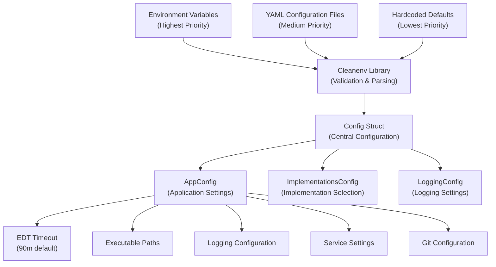
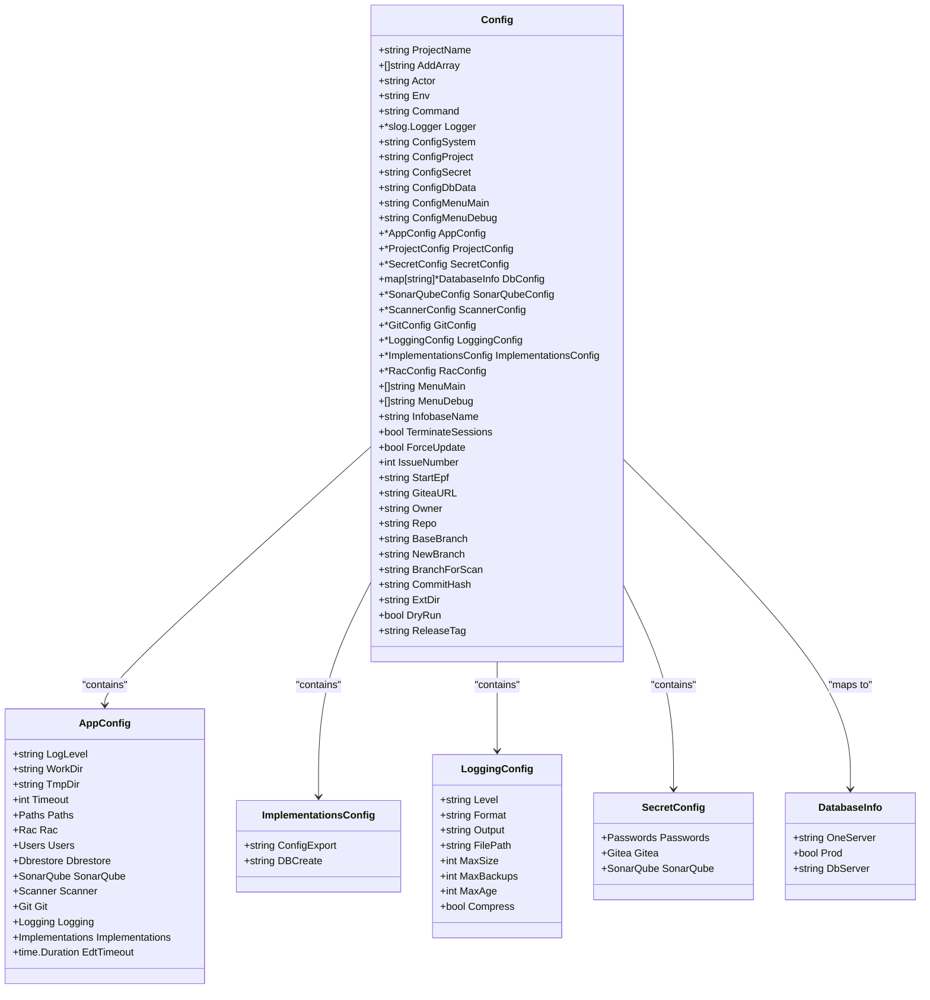
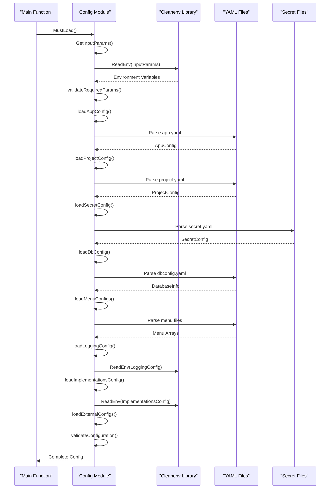
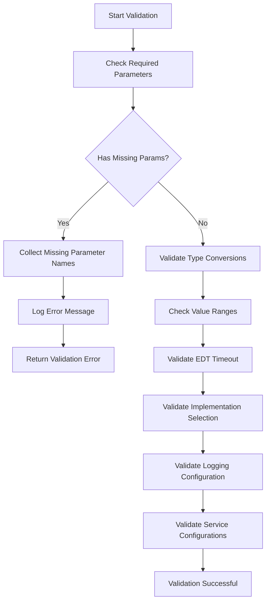
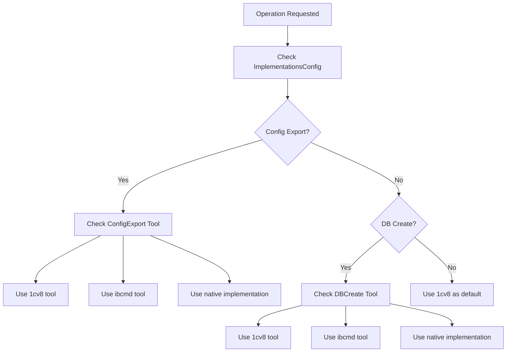

# Configuration Management

<cite>
**Referenced Files in This Document**
- [internal/config/config.go](file://internal/config/config.go)
- [config/app.yaml](file://config/app.yaml)
- [config/app.yaml.example](file://config/app.yaml.example)
- [config/dbconfig.yaml](file://config/dbconfig.yaml)
- [config/action.yaml](file://config/action.yaml)
- [config/menu_main.yaml](file://config/menu_main.yaml)
- [config/menu_debug.yaml](file://config/menu_debug.yaml)
- [cmd/apk-ci/main.go](file://cmd/apk-ci/main.go)
- [internal/constants/constants.go](file://internal/constants/constants.go)
- [internal/config/config_test.go](file://internal/config/config_test.go)
- [internal/config/implementations_test.go](file://internal/config/implementations_test.go)
- [internal/app/extension_publish.go](file://internal/app/extension_publish.go)
- [docs/epics/extension-publish.md](file://docs/epics/extension-publish.md)
- [docs/diagrams/external-extension-workflow.md](file://docs/diagrams/external-extension-workflow.md)
</cite>

## Update Summary
**Changes Made**
- Added new ImplementationsConfig for switching between 1cv8/ibcmd/native implementations
- Updated logging defaults with BR_LOG_* environment variables and improved configuration precedence
- Enhanced configuration loading with better environment variable override handling
- Added comprehensive validation for implementation selection values
- Updated logging configuration with new default values and environment variable support

## Table of Contents
1. [Introduction](#introduction)
2. [Configuration Architecture](#configuration-architecture)
3. [Configuration Files](#configuration-files)
4. [Config Struct Overview](#config-struct-overview)
5. [Hierarchical Configuration Loading](#hierarchical-configuration-loading)
6. [Environment Variables and Precedence](#environment-variables-and-precedence)
7. [Configuration Validation](#configuration-validation)
8. [Security Considerations](#security-considerations)
9. [Configuration Examples](#configuration-examples)
10. [Implementation Selection](#implementation-selection)
11. [Logging Configuration](#logging-configuration)
12. [Extension Publishing Workflow](#extension-publishing-workflow)
13. [Troubleshooting](#troubleshooting)

## Introduction

apk-ci implements a sophisticated hierarchical configuration system that combines YAML files, environment variables, and default values using the cleanenv library. This system provides flexibility for different deployment scenarios while maintaining security and ease of maintenance.

The configuration management system supports multiple configuration files for different aspects of the application:
- **app.yaml**: Application-wide settings and defaults
- **dbconfig.yaml**: Database connection configurations
- **action.yaml**: GitHub Actions integration parameters
- **menu_main.yaml/menu_debug.yaml**: Workflow templates

**Updated** Added support for implementation selection configuration and enhanced logging defaults with BR_LOG_* environment variables.

## Configuration Architecture

The configuration system follows a layered approach where environment variables take precedence over YAML file values, which in turn override hardcoded defaults.



**Diagram sources**
- [internal/config/config.go](file://internal/config/config.go#L180-L189)
- [config/app.yaml](file://config/app.yaml#L1-L138)

## Configuration Files

### app.yaml - Application Configuration

The primary configuration file containing system-wide settings, executable paths, and service configurations.

**Key Sections:**
- **System Settings**: Work directories, timeouts, logging levels
- **Executable Paths**: Paths to 1C binaries, EDT CLI, RAC
- **Service Configurations**: RAC settings, database users, timeouts
- **Integration Settings**: SonarQube, Git, logging configurations
- **EDT Timeout**: Timeout for Enterprise Development Tools operations with default value of 90 minutes
- **Logging Configuration**: New logging settings with BR_LOG_* environment variable support
- **Implementations Configuration**: New section for selecting implementation tools

**Example Structure:**
```yaml
app:
  logLevel: "Debug"
  workDir: "/tmp/benadis"
  tmpDir: "/tmp/benadis/temp"
  timeout: 30

paths:
  bin1cv8: "/opt/1cv8/x86_64/8.3.27.1606/1cv8"
  binIbcmd: "/opt/1cv8/x86_64/8.3.27.1606/ibcmd"
  edtCli: "/opt/1C/1CE/components/1c-edt-2024.2.6+7-x86_64/1cedtcli"
  rac: "/opt/1cv8/x86_64/8.3.27.1606/rac"

# Timeout for EDT operations (export/import configuration)
edt_timeout: 90m

# New logging configuration section
logging:
  level: "info"
  format: "json"
  output: "stdout"
  filePath: "/var/log/apk-ci.log"
  maxSize: 100
  maxBackups: 3
  maxAge: 28
  compress: true

# New implementations configuration section
implementations:
  config_export: "1cv8"
  db_create: "1cv8"
```

**Section sources**
- [config/app.yaml](file://config/app.yaml#L1-L138)

### dbconfig.yaml - Database Configuration

Contains database connection information for multiple environments and databases.

**Structure:**
Each database entry defines:
- **one-server**: 1C server hostname
- **prod**: Production flag
- **dbserver**: Database server hostname

**Example:**
```yaml
TEST_DNAVOLOTSKY_SURV:
    one-server: MSK-TS-AS-001
    prod: false
    dbserver: DEV-RZHAVKI-DB1
V8_ARCH_APK_ZUP:
    one-server: MSK-AS-ARCH-001
    prod: false
    dbserver: MSK-SQL-ARCH-01
```

**Section sources**
- [config/dbconfig.yaml](file://config/dbconfig.yaml#L1-L199)

### action.yaml - GitHub Actions Integration

Defines the GitHub Actions interface with all configurable parameters.

**Input Parameters:**
- **Required**: giteaURL, repository, accessToken, command, actor
- **Optional**: logLevel, issueNumber, config files, database settings
- **Advanced**: force_update, terminate_sessions, debug_port, wait

**Environment Variables:**
Actions automatically set environment variables for each input parameter, prefixed with `INPUT_`.

**Section sources**
- [config/action.yaml](file://config/action.yaml#L1-L120)

### menu_main.yaml/menu_debug.yaml - Workflow Templates

Provide pre-configured workflow templates for different operational scenarios.

**menu_main.yaml**: Production and testing workflows
**menu_debug.yaml**: Debug and development workflows

**Section sources**
- [config/menu_main.yaml](file://config/menu_main.yaml#L1-L199)
- [config/menu_debug.yaml](file://config/menu_debug.yaml#L1-L199)

## Config Struct Overview

The central `Config` struct serves as the main configuration container, organizing settings into logical groups.



**Diagram sources**
- [internal/config/config.go](file://internal/config/config.go#L128-L209)

**Section sources**
- [internal/config/config.go](file://internal/config/config.go#L128-L209)

## Hierarchical Configuration Loading

The configuration loading process follows a specific order to ensure proper precedence and validation.



**Diagram sources**
- [internal/config/config.go](file://internal/config/config.go#L542-L702)
- [cmd/apk-ci/main.go](file://cmd/apk-ci/main.go#L16-L262)

**Section sources**
- [internal/config/config.go](file://internal/config/config.go#L542-L702)

## Environment Variables and Precedence

The configuration system uses cleanenv to handle environment variables with strict validation and type conversion.

### Variable Naming Convention

Variables follow a structured naming pattern:
- **Input Parameters**: `INPUT_*` (from GitHub Actions)
- **Application Settings**: `BR_*` (application-specific)
- **Service Settings**: `*_PASSWORD`, `*_TOKEN` (service credentials)
- **Logging Settings**: `BR_LOG_*` (logging configuration)
- **Implementation Settings**: `BR_IMPL_*` (implementation selection)

### Precedence Order (Highest to Lowest)

1. **Environment Variables** (`INPUT_*`, `BR_*`, `BR_LOG_*`, `BR_IMPL_*`)
2. **YAML Configuration Files**
3. **Hardcoded Defaults**

### Enhanced Configuration Precedence

**Updated** The system now provides better environment variable override handling:

| Configuration Type | Environment Variable | YAML Path | Default Value |
|-------------------|---------------------|-----------|---------------|
| Logging Level | `BR_LOG_LEVEL` | `logging.level` | "info" |
| Logging Format | `BR_LOG_FORMAT` | `logging.format` | "text" |
| Logging Output | `BR_LOG_OUTPUT` | `logging.output` | "stderr" |
| Config Export Tool | `BR_IMPL_CONFIG_EXPORT` | `implementations.config_export` | "1cv8" |
| DB Create Tool | `BR_IMPL_DB_CREATE` | `implementations.db_create` | "1cv8" |
| Actor | `BR_ACTOR` | `actor` | "" |
| Environment | `BR_ENV` | `env` | "dev" |
| Command | `BR_COMMAND` | `command` | "" |

**Section sources**
- [internal/config/config.go](file://internal/config/config.go#L180-L189)

## Configuration Validation

The system implements comprehensive validation to ensure configuration integrity and prevent runtime errors.

### Required Parameter Validation

Critical parameters must be present:
- **Actor**: GitHub Actions user
- **GiteaURL**: Gitea server address
- **Repository**: Full repository name
- **AccessToken**: Authentication token
- **Command**: Operation to perform

### Implementation Validation

**New** Implementation selection validation ensures only supported values are used:

```go
// Validate проверяет корректность значений ImplementationsConfig.
// Возвращает ошибку если значения не соответствуют допустимым.
func (c *ImplementationsConfig) Validate() error {
    // Применяем defaults для пустых значений
    if c.ConfigExport == "" {
        c.ConfigExport = "1cv8"
    }
    if c.DBCreate == "" {
        c.DBCreate = "1cv8"
    }

    validConfigExport := map[string]bool{"1cv8": true, "ibcmd": true, "native": true}
    validDBCreate := map[string]bool{"1cv8": true, "ibcmd": true}

    if !validConfigExport[c.ConfigExport] {
        return fmt.Errorf("недопустимое значение ConfigExport: %q, допустимые: 1cv8, ibcmd, native", c.ConfigExport)
    }
    if !validDBCreate[c.DBCreate] {
        return fmt.Errorf("недопустимое значение DBCreate: %q, допустимые: 1cv8, ibcmd", c.DBCreate)
    }
    return nil
}
```

### EDT Timeout Validation

The EDT timeout configuration is validated to ensure it has a valid positive value:

```go
// In loadAppConfig function
if appConfig.EdtTimeout <= 0 {
    appConfig.EdtTimeout = 90 * time.Minute
    l.Debug("Using default EDT timeout",
        slog.Duration("timeout", appConfig.EdtTimeout))
}
```

This validation ensures that if the `edt_timeout` parameter is missing from the configuration file or has a zero/negative value, it will be set to the default value of 90 minutes.

### Validation Process



**Diagram sources**
- [internal/config/config.go](file://internal/config/config.go#L384-L415)

### Error Handling

Validation failures result in immediate application termination with detailed error messages. The system logs missing parameters and continues with default values for optional configurations.

**Section sources**
- [internal/config/config.go](file://internal/config/config.go#L384-L415)

## Security Considerations

### Sensitive Data Protection

The configuration system separates sensitive data into dedicated files and uses secure storage mechanisms.

**Protected Information:**
- Database passwords
- API tokens
- Access credentials
- Private keys

### Secure Storage Practices

1. **Separate Secret Files**: Sensitive data isolated in `secret.yaml`
2. **Environment Variable Priority**: Secrets can override file values
3. **Default Values**: No hardcoded credentials in configuration files
4. **Access Control**: File permissions restrict access to configuration files

### Recommended Security Measures

- Use encrypted secret storage for production deployments
- Implement CI/CD pipeline secrets management
- Regular rotation of access tokens and passwords
- Network isolation for database connections

**Section sources**
- [internal/config/config.go](file://internal/config/config.go#L75-L91)

## Configuration Examples

### Development Environment

```yaml
# app.yaml
app:
  logLevel: "Debug"
  workDir: "/tmp/benadis/dev"
  tmpDir: "/tmp/benadis/dev/temp"
  timeout: 60
  # Timeout for EDT operations
  edt_timeout: 90m

paths:
  bin1cv8: "/opt/1cv8/dev/8.3.27.1606/1cv8"
  binIbcmd: "/opt/1cv8/dev/8.3.27.1606/ibcmd"
  edtCli: "/opt/1C/1CE/dev/1c-edt-2024.2.6+7-x86_64/1cedtcli"
  rac: "/opt/1cv8/dev/8.3.27.1606/rac"

# New logging configuration
logging:
  level: "debug"
  format: "text"
  output: "stderr"

# New implementations configuration
implementations:
  config_export: "ibcmd"
  db_create: "1cv8"

# secret.yaml
passwords:
  rac: "dev_rac_password"
  db: "dev_db_password"
  mssql: "dev_mssql_password"
  storeAdminPassword: "dev_store_admin_password"
```

### Production Environment

```yaml
# app.yaml
app:
  logLevel: "Info"
  workDir: "/var/lib/benadis/prod"
  tmpDir: "/var/tmp/benadis/prod"
  timeout: 300
  # Timeout for EDT operations
  edt_timeout: 120m

# Environment Variables
export BR_ENV="prod"
export BR_CONFIG_SYSTEM="/etc/benadis/prod/app.yaml"
export BR_CONFIG_SECRET="/etc/benadis/prod/secret.yaml"
export BR_CONFIG_DB_DATA="/etc/benadis/prod/dbconfig.yaml"
export BR_CONFIG_PROJECT="project.yaml"
export BR_CONFIG_MENU_MAIN="menu_main.yaml"
export BR_CONFIG_MENU_DEBUG="menu_debug.yaml"
export BR_LOG_LEVEL="info"
export BR_LOG_FORMAT="json"
export BR_LOG_OUTPUT="stderr"
export BR_IMPL_CONFIG_EXPORT="1cv8"
export BR_IMPL_DB_CREATE="ibcmd"
export EDT_TIMEOUT="120m"
```

### Implementation Selection Configuration

**New** Example of implementation selection configuration:

```yaml
# app.yaml
app:
  logLevel: "Debug"
  workDir: "/tmp/benadis"
  tmpDir: "/tmp/benadis/temp"
  timeout: 30
  edt_timeout: 90m

# Implementation selection
implementations:
  config_export: "native"  # Use native implementation for config export
  db_create: "ibcmd"       # Use ibcmd for database creation

# Environment Variables for implementation selection
export BR_IMPL_CONFIG_EXPORT="native"
export BR_IMPL_DB_CREATE="ibcmd"
```

### Enhanced Logging Configuration

**Updated** Example of enhanced logging configuration:

```yaml
# app.yaml
app:
  logLevel: "Debug"
  workDir: "/tmp/benadis"
  tmpDir: "/tmp/benadis/temp"
  timeout: 30
  edt_timeout: 90m

# Enhanced logging configuration
logging:
  level: "debug"        # BR_LOG_LEVEL
  format: "text"        # BR_LOG_FORMAT  
  output: "stderr"      # BR_LOG_OUTPUT
  filePath: "/var/log/apk-ci.log"
  maxSize: 100
  maxBackups: 3
  maxAge: 7
  compress: true

# Environment Variables for logging
export BR_LOG_LEVEL="debug"
export BR_LOG_FORMAT="json"
export BR_LOG_OUTPUT="file"
export BR_LOG_FILE_PATH="/var/log/apk-ci.log"
export BR_LOG_MAX_SIZE="50"
export BR_LOG_MAX_BACKUPS="5"
export BR_LOG_MAX_AGE="14"
export BR_LOG_COMPRESS="false"
```

### Docker Deployment

```dockerfile
# Multi-stage build with configuration
FROM alpine:latest AS config
COPY config/ /app/config/
RUN chmod 644 /app/config/*.yaml

FROM golang:1.21-alpine AS builder
WORKDIR /app
COPY --from=config /app/config/ ./config/
COPY . .
RUN go build -o apk-ci cmd/apk-ci/main.go

FROM alpine:latest
COPY --from=builder /app/apk-ci /usr/local/bin/
COPY --from=config /app/config/ /app/config/
ENV BR_CONFIG_SYSTEM=/app/config/app.yaml
ENV BR_CONFIG_SECRET=/app/config/secret.yaml
ENV BR_CONFIG_DB_DATA=/app/config/dbconfig.yaml
ENV BR_LOG_LEVEL="info"
ENV BR_LOG_FORMAT="json"
ENV BR_LOG_OUTPUT="stderr"
ENV BR_IMPL_CONFIG_EXPORT="1cv8"
ENV BR_IMPL_DB_CREATE="1cv8"
ENV EDT_TIMEOUT=90m
```

## Implementation Selection

**New** The implementation selection system allows switching between different tools for specific operations without changing application code.

### ImplementationsConfig Structure

The `ImplementationsConfig` struct provides fine-grained control over tool selection:

```go
// ImplementationsConfig содержит настройки выбора реализаций операций.
// Позволяет переключаться между различными инструментами (1cv8/ibcmd/native)
// без изменения кода приложения.
type ImplementationsConfig struct {
    // ConfigExport определяет инструмент для выгрузки конфигурации.
    // Допустимые значения: "1cv8" (default), "ibcmd", "native"
    ConfigExport string `yaml:"config_export" env:"BR_IMPL_CONFIG_EXPORT" env-default:"1cv8"`

    // DBCreate определяет инструмент для создания базы данных.
    // Допустимые значения: "1cv8" (default), "ibcmd"
    DBCreate string `yaml:"db_create" env:"BR_IMPL_DB_CREATE" env-default:"1cv8"`
}
```

### Available Implementation Tools

| Tool | Purpose | Valid For |
|------|---------|-----------|
| `1cv8` | 1C:Enterprise command-line tool | Config export, DB create |
| `ibcmd` | 1C:Enterprise ibcmd utility | DB create |
| `native` | Native Go implementation | Config export |

### Implementation Selection Process



### Implementation Configuration Options

| Field | Environment Variable | Default Value | Description |
|-------|---------------------|---------------|-------------|
| `ConfigExport` | `BR_IMPL_CONFIG_EXPORT` | "1cv8" | Tool for configuration export operations |
| `DBCreate` | `BR_IMPL_DB_CREATE` | "1cv8" | Tool for database creation operations |

### Implementation Configuration Examples

```yaml
# app.yaml
implementations:
  config_export: "native"  # Use native implementation for config export
  db_create: "ibcmd"       # Use ibcmd for database creation
```

```bash
# Environment variables
export BR_IMPL_CONFIG_EXPORT="native"
export BR_IMPL_DB_CREATE="ibcmd"
```

**Section sources**
- [internal/config/config.go](file://internal/config/config.go#L292-L326)
- [internal/config/implementations_test.go](file://internal/config/implementations_test.go#L15-L45)

## Logging Configuration

**Updated** The logging system now provides enhanced configuration with BR_LOG_* environment variables and improved defaults.

### LoggingConfig Structure

The `LoggingConfig` struct controls all aspects of application logging:

```go
// LoggingConfig содержит настройки для логирования.
type LoggingConfig struct {
    // Level - уровень логирования (debug, info, warn, error)
    Level string `yaml:"level" env:"BR_LOG_LEVEL" env-default:"info"`

    // Format - формат логов (json, text)
    Format string `yaml:"format" env:"BR_LOG_FORMAT" env-default:"text"`

    // Output - вывод логов (stdout, stderr, file)
    Output string `yaml:"output" env:"BR_LOG_OUTPUT" env-default:"stderr"`

    // FilePath - путь к файлу логов (если output=file)
    FilePath string `yaml:"filePath" env:"BR_LOG_FILE_PATH"`

    // MaxSize - максимальный размер файла лога в MB
    MaxSize int `yaml:"maxSize" env:"BR_LOG_MAX_SIZE"`

    // MaxBackups - максимальное количество backup файлов
    MaxBackups int `yaml:"maxBackups" env:"BR_LOG_MAX_BACKUPS"`

    // MaxAge - максимальный возраст backup файлов в днях
    MaxAge int `yaml:"maxAge" env:"BR_LOG_MAX_AGE"`

    // Compress - сжимать ли backup файлы
    Compress bool `yaml:"compress" env:"BR_LOG_COMPRESS"`
}
```

### Enhanced Logging Defaults

**Updated** The logging system now uses more sensible defaults:

| Setting | Default Value | Reason |
|---------|---------------|---------|
| `Level` | "info" | Balanced verbosity for production |
| `Format` | "text" | Human-readable output by default |
| `Output` | "stderr" | Separates logs from application output |
| `MaxSize` | 100 MB | Reasonable size for most environments |
| `MaxBackups` | 3 | Maintains recent log history |
| `MaxAge` | 7 days | Balances storage with retention needs |
| `Compress` | true | Saves disk space |

### Logging Environment Variables

**New** Comprehensive environment variable support:

| Environment Variable | YAML Path | Description |
|---------------------|-----------|-------------|
| `BR_LOG_LEVEL` | `logging.level` | Logging level (debug, info, warn, error) |
| `BR_LOG_FORMAT` | `logging.format` | Output format (json, text) |
| `BR_LOG_OUTPUT` | `logging.output` | Output destination (stdout, stderr, file) |
| `BR_LOG_FILE_PATH` | `logging.filePath` | File path when output=file |
| `BR_LOG_MAX_SIZE` | `logging.maxSize` | Maximum log file size in MB |
| `BR_LOG_MAX_BACKUPS` | `logging.maxBackups` | Number of backup files to keep |
| `BR_LOG_MAX_AGE` | `logging.maxAge` | Maximum age of backup files in days |
| `BR_LOG_COMPRESS` | `logging.compress` | Whether to compress backup files |

### Logging Configuration Examples

```yaml
# app.yaml
logging:
  level: "debug"
  format: "text"
  output: "stderr"
  filePath: "/var/log/apk-ci.log"
  maxSize: 100
  maxBackups: 3
  maxAge: 7
  compress: true
```

```bash
# Environment variables for logging
export BR_LOG_LEVEL="debug"
export BR_LOG_FORMAT="json"
export BR_LOG_OUTPUT="file"
export BR_LOG_FILE_PATH="/var/log/apk-ci.log"
export BR_LOG_MAX_SIZE="50"
export BR_LOG_MAX_BACKUPS="5"
export BR_LOG_MAX_AGE="14"
export BR_LOG_COMPRESS="false"
```

### Logging Implementation Details

**Updated** The logging system initializes with these characteristics:

1. **Default Handler**: Uses JSON handler with source attribution
2. **Level Control**: Dynamic level setting based on configuration
3. **Structured Output**: Includes application version information
4. **Environment Override**: BR_LOG_* variables override YAML settings
5. **File Rotation**: Automatic log rotation with configurable parameters

**Section sources**
- [internal/config/config.go](file://internal/config/config.go#L328-L353)
- [internal/config/implementations_test.go](file://internal/config/implementations_test.go#L66-L94)

## Extension Publishing Workflow

**Updated** The extension publishing workflow extends the configuration system with specialized fields for managing external extension distribution.

### Configuration Fields for Extension Publishing

The Config struct now includes three new fields specifically for extension publishing:

```go
// ExtDir specifies the directory path for the extension within the repository
ExtDir string `env:"BR_EXT_DIR" env-default:""`

// DryRun enables dry-run mode for testing extension publishing without making changes
DryRun bool `env:"BR_DRY_RUN" env-default:"false"`

// ReleaseTag contains the release tag information for the extension version
ReleaseTag string `env:"GITHUB_REF_NAME" env-default:"main"`
```

### Extension Publishing Process

The extension publishing workflow follows these steps:

1. **Project Analysis**: Uses `AnalyzeProject()` to determine the extension name and directory
2. **Release Detection**: Retrieves release information from Gitea API
3. **Subscriber Discovery**: Searches for subscribed repositories using branch pattern matching
4. **File Synchronization**: Synchronizes extension files between source and target repositories
5. **Pull Request Creation**: Creates automated pull requests with release information

### Extension Publishing Configuration Options

| Field | Environment Variable | Default Value | Description |
|-------|---------------------|---------------|-------------|
| `ExtDir` | `BR_EXT_DIR` | "" | Directory path for the extension within the repository |
| `DryRun` | `BR_DRY_RUN` | false | Enables dry-run mode for testing without making changes |
| `ReleaseTag` | `GITHUB_REF_NAME` | "main" | Release tag used for version identification |

### Extension Publishing Environment Setup

```bash
# Basic extension publishing setup
export BR_COMMAND="extension-publish"
export GITEA_TOKEN="your_gitea_token_here"
export GITHUB_REPOSITORY="your-org/your-repo"

# Optional extension publishing configuration
export BR_EXT_DIR="extensions/CommonExt"
export BR_DRY_RUN="true"
export GITHUB_REF_NAME="v1.2.3"
```

### Extension Publishing Workflow Integration

The extension publishing command is integrated into the main application flow:

```go
case constants.ActExtensionPublish:
    err = app.ExtensionPublish(&ctx, l, cfg)
    if err != nil {
        l.Error("Ошибка публикации расширения",
            slog.String("error", err.Error()),
            slog.String(constants.MsgErrProcessing, constants.MsgAppExit),
        )
        os.Exit(8)
    }
    l.Info("Публикация расширения успешно завершена")
```

**Section sources**
- [internal/config/config.go](file://internal/config/config.go#L180-L189)
- [cmd/apk-ci/main.go](file://cmd/apk-ci/main.go#L213-L222)
- [internal/constants/constants.go](file://internal/constants/constants.go#L100-L101)
- [docs/epics/extension-publish.md](file://docs/epics/extension-publish.md#L1-L326)

## Troubleshooting

### Common Configuration Issues

**Missing Required Parameters**
```
Error: Missing required configuration parameters: ACTOR, GITEAURL, REPOSITORY, ACCESSTOKEN, COMMAND
Solution: Check all GitHub Actions input parameters
```

**Invalid Configuration File Format**
```
Error: Failed to load application configuration
Solution: Check YAML syntax, use a YAML validator
```

**Database Connection Issues**
```
Error: Failed to connect to database
Solution: Check dbconfig.yaml and network connectivity
```

**EDT Timeout Issues**
```
Error: EDT operation context deadline exceeded
Solution: Check edt_timeout configuration in app.yaml or EDT_TIMEOUT environment variable
```

**Implementation Selection Errors**
```
Error: недопустимое значение ConfigExport: "invalid", допустимые: 1cv8, ibcmd, native
Solution: Set BR_IMPL_CONFIG_EXPORT to 1cv8, ibcmd, or native
```

**Logging Configuration Issues**
```
Error: Failed to initialize logging
Solution: Check BR_LOG_* environment variables and logging configuration
```

**Extension Publishing Issues**
```
Error: Extension directory not specified
Solution: Set BR_EXT_DIR environment variable or extDir in app.yaml
```

### Debug Configuration Loading

Enable debug logging to troubleshoot configuration issues:

```bash
export BR_LOG_LEVEL="Debug"
export BR_ENV="dev"
./apk-ci
```

### Configuration Validation Commands

```bash
# Validate YAML syntax
yamllint config/app.yaml

# Check environment variables
env | grep -E "(INPUT_|BR_|MSSQL_|SONARQUBE_|EDT_TIMEOUT|EXT_DIR|DRY_RUN|RELEASE_TAG|IMPL|LOG_)"

# Verify file permissions
ls -la config/
```

### Recovery Procedures

1. **Reset to Defaults**: Remove custom configuration files
2. **Validate Environment**: Check all required environment variables
3. **Test Connectivity**: Verify network access to external services
4. **Review Logs**: Check application logs for detailed error messages

**Section sources**
- [internal/config/config.go](file://internal/config/config.go#L384-L415)
- [cmd/apk-ci/main.go](file://cmd/apk-ci/main.go#L16-L262)