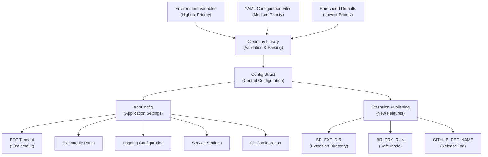
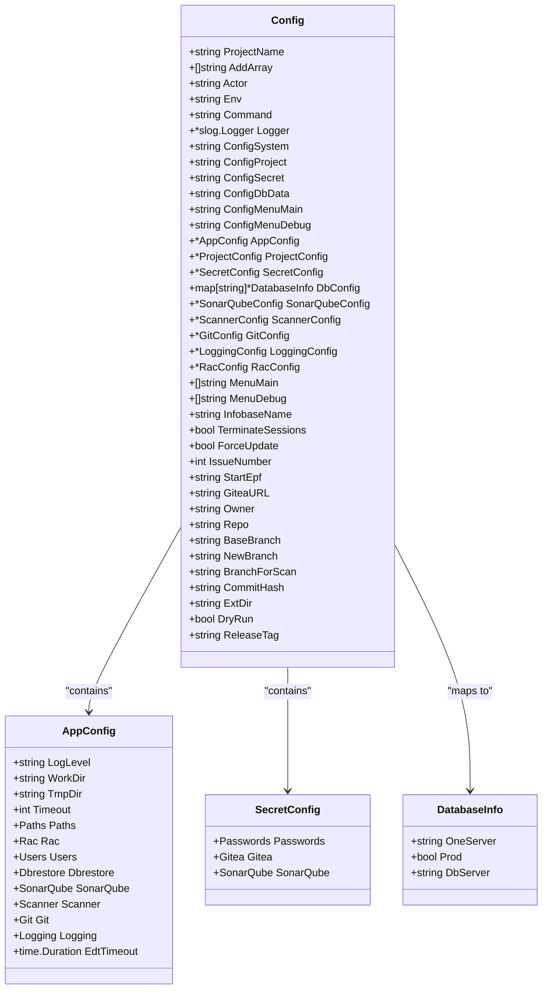
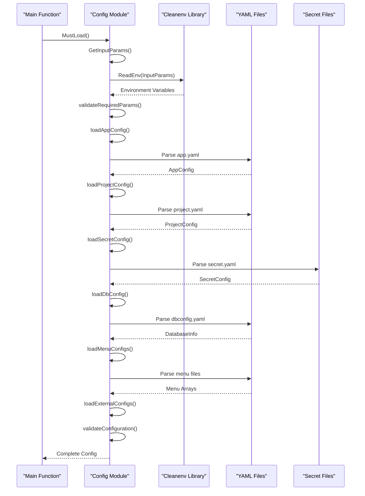
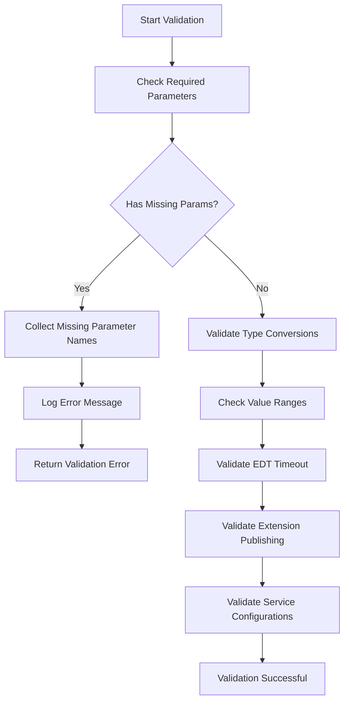
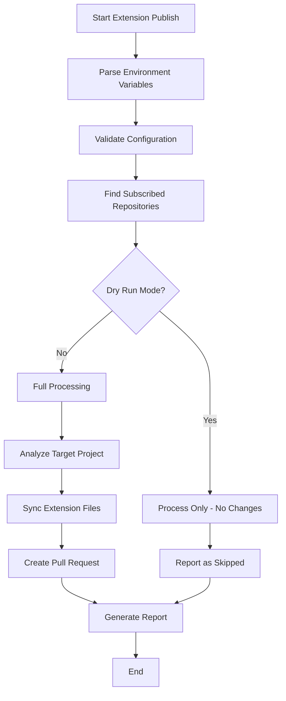

# Configuration Management

<cite>
**Referenced Files in This Document**
- [internal/config/config.go](file://internal/config/config.go) - *Updated with BR_EXT_DIR, BR_DRY_RUN, and GITHUB_REF_NAME configuration variables*
- [config/app.yaml](file://config/app.yaml) - *Configuration file for application settings*
- [config/dbconfig.yaml](file://config/dbconfig.yaml) - *Configuration file for database connections*
- [config/action.yaml](file://config/action.yaml) - *Configuration file for GitHub Actions integration*
- [config/menu_main.yaml](file://config/menu_main.yaml) - *Workflow template for main operations*
- [config/menu_debug.yaml](file://config/menu_debug.yaml) - *Workflow template for debugging operations*
- [cmd/benadis-runner/main.go](file://cmd/benadis-runner/main.go) - *Main application entry point*
- [internal/constants/constants.go](file://internal/constants/constants.go) - *Application constants*
- [internal/config/config_test.go](file://internal/config/config_test.go) - *Configuration tests*
- [internal/app/extension_publish.go](file://internal/app/extension_publish.go) - *Extension publishing system implementation*
</cite>

## Update Summary
**Changes Made**
- Added new BR_EXT_DIR configuration variable for specifying extension directories in the Extension Publishing System
- Added new BR_DRY_RUN configuration variable for safe testing mode in extension publishing
- Added new GITHUB_REF_NAME configuration variable for GitHub Actions integration
- Updated configuration loading process to handle new extension publishing variables
- Enhanced configuration validation to support extension publishing workflow
- Added documentation for extension publishing system configuration

## Table of Contents
1. [Introduction](#introduction)
2. [Configuration Architecture](#configuration-architecture)
3. [Configuration Files](#configuration-files)
4. [Config Struct Overview](#config-struct-overview)
5. [Hierarchical Configuration Loading](#hierarchical-configuration-loading)
6. [Environment Variables and Precedence](#environment-variables-and-precedence)
7. [Configuration Validation](#configuration-validation)
8. [Security Considerations](#security-considerations)
9. [Configuration Examples](#configuration-examples)
10. [Extension Publishing System](#extension-publishing-system)
11. [Troubleshooting](#troubleshooting)

## Introduction

Benadis-runner implements a sophisticated hierarchical configuration system that combines YAML files, environment variables, and default values using the cleanenv library. This system provides flexibility for different deployment scenarios while maintaining security and ease of maintenance.

The configuration management system supports multiple configuration files for different aspects of the application:
- **app.yaml**: Application-wide settings and defaults
- **dbconfig.yaml**: Database connection configurations
- **action.yaml**: GitHub Actions integration parameters
- **menu_main.yaml/menu_debug.yaml**: Workflow templates

**Updated** Added support for the Extension Publishing System with new configuration variables for managing external extension distribution across subscribed repositories.

## Configuration Architecture

The configuration system follows a layered approach where environment variables take precedence over YAML file values, which in turn override hardcoded defaults.



**Diagram sources**
- [internal/config/config.go](file://internal/config/config.go#L186-L188)
- [config/app.yaml](file://config/app.yaml#L1-L50)

## Configuration Files

### app.yaml - Application Configuration

The primary configuration file containing system-wide settings, executable paths, and service configurations.

**Key Sections:**
- **System Settings**: Work directories, timeouts, logging levels
- **Executable Paths**: Paths to 1C binaries, EDT CLI, RAC
- **Service Configurations**: RAC settings, database users, timeouts
- **Integration Settings**: SonarQube, Git, logging configurations
- **EDT Timeout**: Timeout for Enterprise Development Tools operations with default value of 90 minutes

**Example Structure:**
```yaml
app:
  logLevel: "Debug"
  workDir: "/tmp/benadis"
  tmpDir: "/tmp/benadis/temp"
  timeout: 30

paths:
  bin1cv8: "/opt/1cv8/x86_64/8.3.27.1606/1cv8"
  binIbcmd: "/opt/1cv8/x86_64/8.3.27.1606/ibcmd"
  edtCli: "/opt/1C/1CE/components/1c-edt-2024.2.6+7-x86_64/1cedtcli"
  rac: "/opt/1cv8/x86_64/8.3.27.1606/rac"

# Timeout for EDT operations (export/import configuration)
edt_timeout: 90m
```

**Section sources**
- [config/app.yaml](file://config/app.yaml#L1-L138)

### dbconfig.yaml - Database Configuration

Contains database connection information for multiple environments and databases.

**Structure:**
Each database entry defines:
- **one-server**: 1C server hostname
- **prod**: Production flag
- **dbserver**: Database server hostname

**Example:**
```yaml
TEST_DNAVOLOTSKY_SURV:
    one-server: MSK-TS-AS-001
    prod: false
    dbserver: DEV-RZHAVKI-DB1
V8_ARCH_APK_ZUP:
    one-server: MSK-AS-ARCH-001
    prod: false
    dbserver: MSK-SQL-ARCH-01
```

**Section sources**
- [config/dbconfig.yaml](file://config/dbconfig.yaml#L1-L199)

### action.yaml - GitHub Actions Integration

Defines the GitHub Actions interface with all configurable parameters.

**Input Parameters:**
- **Required**: giteaURL, repository, accessToken, command, actor
- **Optional**: logLevel, issueNumber, config files, database settings
- **Advanced**: force_update, terminate_sessions, debug_port, wait

**Environment Variables:**
Actions automatically set environment variables for each input parameter, prefixed with `INPUT_`.

**Section sources**
- [config/action.yaml](file://config/action.yaml#L1-L121)

### menu_main.yaml/menu_debug.yaml - Workflow Templates

Provide pre-configured workflow templates for different operational scenarios.

**menu_main.yaml**: Production and testing workflows
**menu_debug.yaml**: Debug and development workflows

**Section sources**
- [config/menu_main.yaml](file://config/menu_main.yaml#L1-L199)
- [config/menu_debug.yaml](file://config/menu_debug.yaml#L1-L199)

## Config Struct Overview

The central `Config` struct serves as the main configuration container, organizing settings into logical groups.



**Diagram sources**
- [internal/config/config.go](file://internal/config/config.go#L100-L200)

**Section sources**
- [internal/config/config.go](file://internal/config/config.go#L128-L209)

## Hierarchical Configuration Loading

The configuration loading process follows a specific order to ensure proper precedence and validation.



**Diagram sources**
- [internal/config/config.go](file://internal/config/config.go#L548-L702)
- [cmd/benadis-runner/main.go](file://cmd/benadis-runner/main.go#L16-L262)

**Section sources**
- [internal/config/config.go](file://internal/config/config.go#L548-L702)

## Environment Variables and Precedence

The configuration system uses cleanenv to handle environment variables with strict validation and type conversion.

### Variable Naming Convention

Variables follow a structured naming pattern:
- **Input Parameters**: `INPUT_*` (from GitHub Actions)
- **Application Settings**: `BR_*` (application-specific)
- **Service Settings**: `*_PASSWORD`, `*_TOKEN` (service credentials)

### Precedence Order (Highest to Lowest)

1. **Environment Variables** (`INPUT_*`, `BR_*`)
2. **YAML Configuration Files**
3. **Hardcoded Defaults**

### Example Variable Mapping

| Environment Variable | YAML Path | Default Value |
|---------------------|-----------|---------------|
| `INPUT_COMMAND` | `command` | "" |
| `BR_ENV` | `env` | "dev" |
| `BR_CONFIG_SYSTEM` | `configSystem` | "" |
| `MSSQL_PASSWORD` | `passwords.mssql` | "" |
| `EDT_TIMEOUT` | `edt_timeout` | "90m" |
| **`BR_EXT_DIR`** | **`ext_dir`** | **""** |
| **`BR_DRY_RUN`** | **`dry_run`** | **false** |
| **`GITHUB_REF_NAME`** | **`release_tag`** | **"main"** |

**Section sources**
- [internal/config/config.go](file://internal/config/config.go#L134-L188)

## Configuration Validation

The system implements comprehensive validation to ensure configuration integrity and prevent runtime errors.

### Required Parameter Validation

Critical parameters must be present:
- **Actor**: GitHub Actions user
- **GiteaURL**: Gitea server address
- **Repository**: Full repository name
- **AccessToken**: Authentication token
- **Command**: Operation to perform

### EDT Timeout Validation

The EDT timeout configuration is validated to ensure it has a valid positive value:

```go
// In loadAppConfig function
if appConfig.EdtTimeout <= 0 {
    appConfig.EdtTimeout = 90 * time.Minute
    l.Debug("Using default EDT timeout",
        slog.Duration("timeout", appConfig.EdtTimeout))
}
```

This validation ensures that if the `edt_timeout` parameter is missing from the configuration file or has a zero/negative value, it will be set to the default value of 90 minutes.

### Extension Publishing Validation

**Updated** The extension publishing system adds new validation requirements:

```go
// Extension publishing validation
if cfg.GiteaURL == "" {
    return fmt.Errorf("GiteaURL не настроен в конфигурации")
}
if cfg.AccessToken == "" {
    return fmt.Errorf("AccessToken не настроен в конфигурации")
}
```

### Validation Process



**Diagram sources**
- [internal/config/config.go](file://internal/config/config.go#L384-L415)
- [internal/app/extension_publish.go](file://internal/app/extension_publish.go#L1015-L1021)

### Error Handling

Validation failures result in immediate application termination with detailed error messages. The system logs missing parameters and continues with default values for optional configurations.

**Section sources**
- [internal/config/config.go](file://internal/config/config.go#L384-L415)

## Security Considerations

### Sensitive Data Protection

The configuration system separates sensitive data into dedicated files and uses secure storage mechanisms.

**Protected Information:**
- Database passwords
- API tokens
- Access credentials
- Private keys

### Secure Storage Practices

1. **Separate Secret Files**: Sensitive data isolated in `secret.yaml`
2. **Environment Variable Priority**: Secrets can override file values
3. **Default Values**: No hardcoded credentials in configuration files
4. **Access Control**: File permissions restrict access to configuration files

### Recommended Security Measures

- Use encrypted secret storage for production deployments
- Implement CI/CD pipeline secrets management
- Regular rotation of access tokens and passwords
- Network isolation for database connections

**Section sources**
- [internal/config/config.go](file://internal/config/config.go#L77-L91)

## Configuration Examples

### Development Environment

```yaml
# app.yaml
app:
  logLevel: "Debug"
  workDir: "/tmp/benadis/dev"
  tmpDir: "/tmp/benadis/dev/temp"
  timeout: 60
  # Timeout for EDT operations
  edt_timeout: 90m

paths:
  bin1cv8: "/opt/1cv8/dev/8.3.27.1606/1cv8"
  binIbcmd: "/opt/1cv8/dev/8.3.27.1606/ibcmd"
  edtCli: "/opt/1C/1CE/dev/1c-edt-2024.2.6+7-x86_64/1cedtcli"
  rac: "/opt/1cv8/dev/8.3.27.1606/rac"

# secret.yaml
passwords:
  rac: "dev_rac_password"
  db: "dev_db_password"
  mssql: "dev_mssql_password"
  storeAdminPassword: "dev_store_admin_password"
```

### Production Environment

```yaml
# app.yaml
app:
  logLevel: "Info"
  workDir: "/var/lib/benadis/prod"
  tmpDir: "/var/tmp/benadis/prod"
  timeout: 300
  # Timeout for EDT operations
  edt_timeout: 120m

# Environment Variables
export BR_ENV="prod"
export BR_CONFIG_SYSTEM="/etc/benadis/prod/app.yaml"
export BR_CONFIG_SECRET="/etc/benadis/prod/secret.yaml"
export BR_CONFIG_DB_DATA="/etc/benadis/prod/dbconfig.yaml"
export BR_CONFIG_PROJECT="project.yaml"
export BR_CONFIG_MENU_MAIN="menu_main.yaml"
export BR_CONFIG_MENU_DEBUG="menu_debug.yaml"
export EDT_TIMEOUT="120m"
```

### Extension Publishing Configuration

**New** Configuration for the Extension Publishing System:

```yaml
# Environment Variables for Extension Publishing
export BR_EXT_DIR="cfe/CommonExt"
export BR_DRY_RUN="true"
export GITHUB_REF_NAME="v1.2.3"

# Or in GitHub Actions workflow
- name: Run Extension Publish
  uses: ./.github/actions/benadis-runner
  with:
    command: "extension-publish"
    extDir: "cfe/CommonExt"
    dryRun: "true"
    releaseTag: "v1.2.3"
```

### Docker Deployment

```dockerfile
# Multi-stage build with configuration
FROM alpine:latest AS config
COPY config/ /app/config/
RUN chmod 644 /app/config/*.yaml

FROM golang:1.21-alpine AS builder
WORKDIR /app
COPY --from=config /app/config/ ./config/
COPY . .
RUN go build -o benadis-runner cmd/benadis-runner/main.go

FROM alpine:latest
COPY --from=builder /app/benadis-runner /usr/local/bin/
COPY --from=config /app/config/ /app/config/
ENV BR_CONFIG_SYSTEM=/app/config/app.yaml
ENV BR_CONFIG_SECRET=/app/config/secret.yaml
ENV BR_CONFIG_DB_DATA=/app/config/dbconfig.yaml
ENV EDT_TIMEOUT=90m
```

## Extension Publishing System

**New Section** The Extension Publishing System enables automated distribution of 1C external extensions across subscribed repositories.

### Key Components

#### BR_EXT_DIR - Extension Directory Specification
- **Purpose**: Specifies which extension directories to publish
- **Format**: Path within the repository (e.g., "cfe/CommonExt")
- **Multiple Extensions**: Can specify multiple directories separated by commas
- **Default**: Empty (publish all extensions)

#### BR_DRY_RUN - Safe Testing Mode
- **Purpose**: Enables testing without making actual changes
- **Behavior**: 
  - Scans for subscribers and processes files
  - Creates branches and commits locally
  - Skips PR creation
  - Reports results as "skipped"
- **Use Case**: Testing extension publishing workflow before production deployment

#### GITHUB_REF_NAME - Release Tag Integration
- **Purpose**: Identifies the release tag for extension versioning
- **GitHub Actions**: Automatically populated by GitHub Actions
- **Fallback**: Defaults to "main" if not specified
- **Format**: Semantic versioning (e.g., "v1.2.3")

### Extension Publishing Workflow



**Diagram sources**
- [internal/app/extension_publish.go](file://internal/app/extension_publish.go#L998-L1252)

### Subscription Branch Pattern

The system uses a specific naming convention for subscription branches:
- **Format**: `{Org}_{Repo}_{ExtDir}`
- **Example**: `APKHolding_ERP_cfe_CommonExt`
- **Parsing**: Automatically converts underscores to forward slashes for directory paths

### Configuration Integration

The extension publishing system integrates seamlessly with existing configuration:

```go
// Extension publishing configuration fields
ExtDir string `env:"BR_EXT_DIR" env-default:""`
DryRun bool   `env:"BR_DRY_RUN" env-default:"false"`
ReleaseTag string `env:"GITHUB_REF_NAME" env-default:"main"`

// Usage in extension publishing
func ExtensionPublish(ctx *context.Context, l *slog.Logger, cfg *config.Config) error {
    releaseTag := cfg.ReleaseTag
    extensions := cfg.AddArray
    dryRun := cfg.DryRun
    
    // Process extensions...
}
```

**Section sources**
- [internal/config/config.go](file://internal/config/config.go#L186-L188)
- [internal/app/extension_publish.go](file://internal/app/extension_publish.go#L998-L1252)

## Troubleshooting

### Common Configuration Issues

**Missing Required Parameters**
```
Error: Missing required configuration parameters: ACTOR, GITEAURL, REPOSITORY, ACCESSTOKEN, COMMAND
Solution: Check all GitHub Actions input parameters
```

**Invalid Configuration File Format**
```
Error: Failed to load application configuration
Solution: Check YAML syntax, use a YAML validator
```

**Database Connection Issues**
```
Error: Failed to connect to database
Solution: Check dbconfig.yaml and network connectivity
```

**EDT Timeout Issues**
```
Error: EDT operation context deadline exceeded
Solution: Check edt_timeout configuration in app.yaml or EDT_TIMEOUT environment variable
```

**Extension Publishing Issues**
```
Error: GiteaURL не настроен в конфигурации
Solution: Set BR_GITEA_URL environment variable or configure in app.yaml
```

### Debug Configuration Loading

Enable debug logging to troubleshoot configuration issues:

```bash
export LOG_LEVEL="Debug"
export BR_ENV="dev"
./benadis-runner
```

### Configuration Validation Commands

```bash
# Validate YAML syntax
yamllint config/app.yaml

# Check environment variables
env | grep -E "(INPUT_|BR_|MSSQL_|SONARQUBE_|EDT_TIMEOUT|BR_EXT_DIR|BR_DRY_RUN|GITHUB_REF_NAME)"

# Verify file permissions
ls -la config/
```

### Recovery Procedures

1. **Reset to Defaults**: Remove custom configuration files
2. **Validate Environment**: Check all required environment variables
3. **Test Connectivity**: Verify network access to external services
4. **Review Logs**: Check application logs for detailed error messages

**Section sources**
- [internal/config/config.go](file://internal/config/config.go#L384-L415)
- [cmd/benadis-runner/main.go](file://cmd/benadis-runner/main.go#L16-L262)