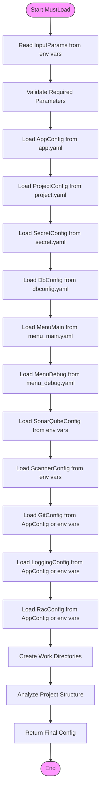
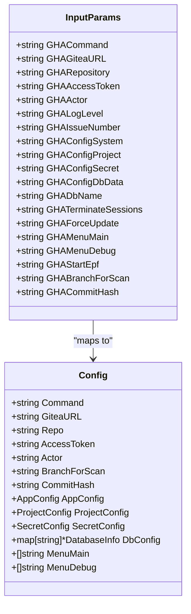
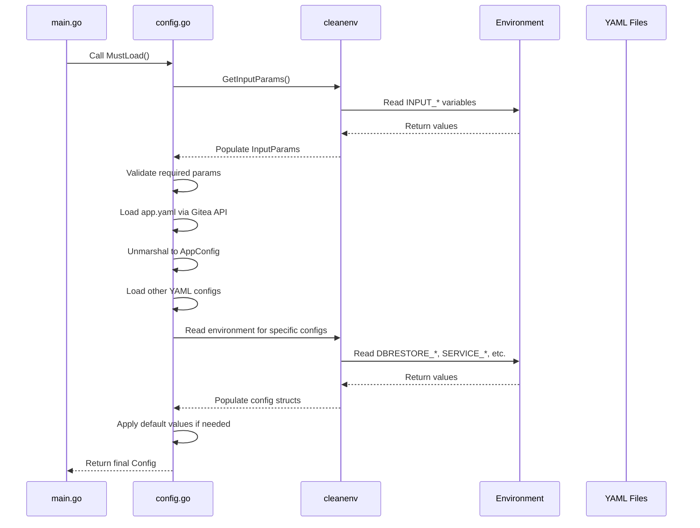
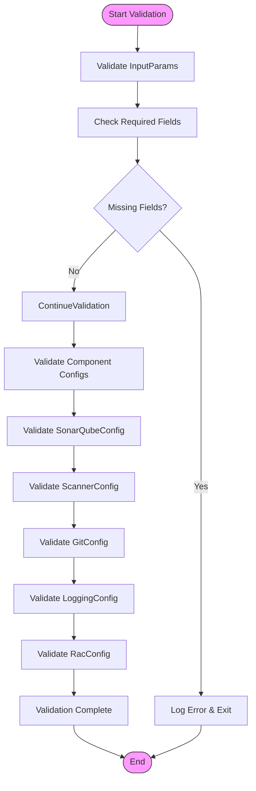
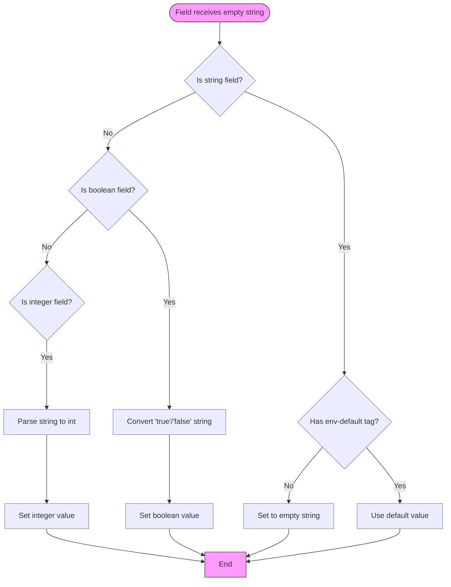
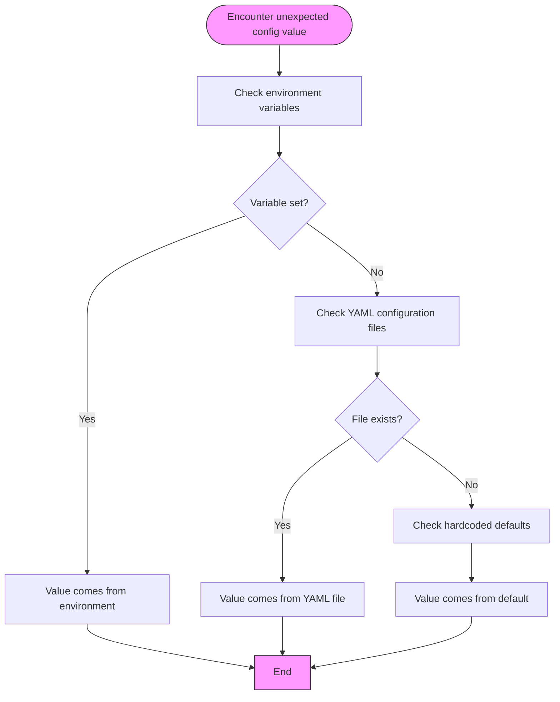
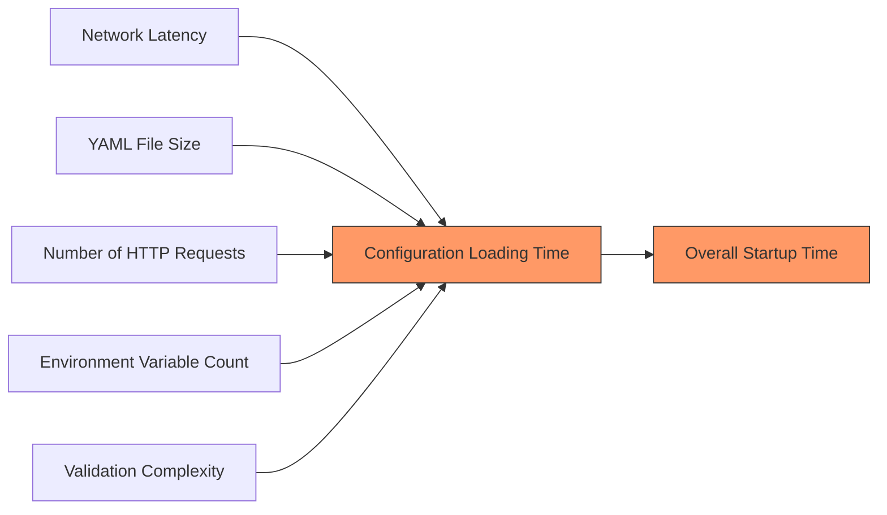

# Configuration Precedence Rules

<cite>
**Referenced Files in This Document**
- [config.go](file://internal/config/config.go)
- [main.go](file://cmd/benadis-runner/main.go)
- [app.yaml](file://config/app.yaml)
- [action.yaml](file://config/action.yaml)
- [constants.go](file://internal/constants/constants.go)
</cite>

## Table of Contents
1. [Introduction](#introduction)
2. [Configuration Loading Process](#configuration-loading-process)
3. [Configuration Precedence Hierarchy](#configuration-precedence-hierarchy)
4. [Technical Implementation with cleanenv](#technical-implementation-with-cleanenv)
5. [Validation Process](#validation-process)
6. [Edge Cases and Special Behaviors](#edge-cases-and-special-behaviors)
7. [Troubleshooting Configuration Issues](#troubleshooting-configuration-issues)
8. [Performance Considerations](#performance-considerations)

## Introduction
The benadis-runner application implements a hierarchical configuration system that determines the final values of configuration parameters through a layered approach. This document details the precedence rules where environment variables take priority over YAML file values, which in turn override hardcoded defaults in the Config struct. The system uses the cleanenv library to manage this layered configuration loading process, ensuring predictable and traceable configuration resolution.

## Configuration Loading Process
The configuration loading process in benadis-runner follows a structured sequence that begins with reading input parameters from environment variables and progresses through multiple configuration sources. The process starts in the `MustLoad` function, which orchestrates the entire configuration loading workflow.



**Diagram sources**
- [config.go](file://internal/config/config.go#L500-L699)

**Section sources**
- [config.go](file://internal/config/config.go#L500-L699)
- [main.go](file://cmd/benadis-runner/main.go#L10-L200)

## Configuration Precedence Hierarchy
The configuration precedence hierarchy in benadis-runner follows a clear order of operations, with each layer potentially overriding values from the previous layer. The hierarchy is implemented as follows:

1. **Environment Variables**: Highest priority - directly set in the execution environment
2. **YAML Configuration Files**: Medium priority - loaded from external configuration files
3. **Hardcoded Defaults**: Lowest priority - defined within the application code

This precedence is clearly demonstrated in the `InputParams` struct, where environment variables are mapped to configuration fields with specific naming conventions:



**Diagram sources**
- [config.go](file://internal/config/config.go#L100-L299)

**Section sources**
- [config.go](file://internal/config/config.go#L100-L299)
- [action.yaml](file://config/action.yaml#L1-L121)

### Environment Variable Override Example
When setting `BR_COMMAND=dbrestore`, this environment variable overrides the command field in app.yaml. This is implemented through the `InputParams` struct which maps `INPUT_COMMAND` to `GHACommand`, which is then assigned to the `Command` field in the main `Config` struct during the `MustLoad` process.

## Technical Implementation with cleanenv
The cleanenv library is used throughout the benadis-runner application to implement the layered configuration loading approach. The implementation follows a consistent pattern across different configuration components.



**Diagram sources**
- [config.go](file://internal/config/config.go#L372-L372)
- [config.go](file://internal/config/config.go#L428-L428)
- [config.go](file://internal/config/config.go#L446-L446)
- [config.go](file://internal/config/config.go#L487-L487)
- [config.go](file://internal/config/config.go#L794-L794)

**Section sources**
- [config.go](file://internal/config/config.go#L372-L499)
- [config.go](file://internal/config/config.go#L700-L899)

### Layered Loading Pattern
The technical implementation follows a consistent pattern for each configuration component:

1. Attempt to load from primary source (usually YAML file)
2. If successful, use those values as base configuration
3. Overlay environment variable values using cleanenv.ReadEnv
4. If primary source fails, fall back to default values
5. Apply any additional processing or validation

This pattern is evident in functions like `loadGitConfig`, `loadLoggingConfig`, and `loadRacConfig`, all of which first attempt to load from the AppConfig structure derived from app.yaml, then overlay environment variable values, and finally fall back to default values if necessary.

## Validation Process
After all configuration layers are applied, the system performs validation to ensure the integrity and correctness of the final configuration values. This validation occurs at multiple levels throughout the configuration loading process.



**Diagram sources**
- [config.go](file://internal/config/config.go#L400-L420)

**Section sources**
- [config.go](file://internal/config/config.go#L400-L420)
- [config.go](file://internal/config/sonarqube.go#L180-L252)

The validation process begins with checking for required parameters in the `validateRequiredParams` function, which verifies that essential fields like ACTOR, GITEAURL, REPOSITORY, ACCESSTOKEN, and COMMAND are present. If any required parameters are missing, an error is logged and returned, preventing further execution.

Additional validation occurs within specific configuration loading functions, such as `GetSonarQubeConfig` and `GetScannerConfig`, which include explicit validation steps after loading configuration from environment variables.

## Edge Cases and Special Behaviors
The configuration system handles several edge cases and special behaviors that affect how configuration values are resolved and applied.

### Empty String Overrides
When environment variables are set to empty strings, the behavior depends on the specific configuration field and its type. For string fields, an empty string environment variable will typically override the YAML value, effectively clearing that setting. However, some fields have special handling:



**Diagram sources**
- [config.go](file://internal/config/config.go#L100-L299)

**Section sources**
- [config.go](file://internal/config/config.go#L100-L299)

### Boolean Flag Handling
Boolean fields in the configuration system are handled specially. Environment variables with values of "true" or "false" (case-sensitive) are converted to their corresponding boolean values. The conversion occurs in the `MustLoad` function for specific boolean fields like `TerminateSessions` and `ForceUpdate`:

```go
cfg.TerminateSessions = inputParams.GHATerminateSessions == "true"
cfg.ForceUpdate = inputParams.GHAForceUpdate == "true"
```

### Slice/Array Merging Behavior
For slice and array fields like `MenuMain` and `MenuDebug`, the configuration system does not merge values from different sources. Instead, it completely replaces the value based on the highest precedence source. The arrays are loaded from their respective YAML files (menu_main.yaml and menu_debug.yaml) and are not modified by environment variables unless specifically designed to do so.

## Troubleshooting Configuration Issues
When diagnosing unexpected configuration values, it's important to understand the source of each final configuration value. The system provides several mechanisms for troubleshooting configuration issues.

### Tracing Configuration Source
To trace the source of a configuration value, follow these steps:

1. Check if the corresponding environment variable is set
2. Verify the value in the relevant YAML configuration file
3. Examine the hardcoded default value in the code
4. Review the configuration loading order and precedence rules



**Diagram sources**
- [config.go](file://internal/config/config.go#L500-L699)

**Section sources**
- [config.go](file://internal/config/config.go#L500-L699)

### Debugging Tips
- Enable debug logging by setting `LOG_LEVEL=Debug` or `INPUT_LOGLEVEL=Debug`
- Check the application startup logs for configuration loading messages
- Use the `runner.DisplayConfig` function output to see the final resolved configuration
- Verify that environment variable names match exactly (including case)
- Ensure YAML file paths are correct and accessible

## Performance Considerations
The configuration loading process has several performance implications that should be considered when deploying and operating the benadis-runner application.

### Configuration Loading Speed
The configuration loading speed is affected by several factors:



**Diagram sources**
- [config.go](file://internal/config/config.go#L500-L699)

**Section sources**
- [config.go](file://internal/config/config.go#L500-L699)

The most significant performance factor is network latency, as configuration files are retrieved from remote Gitea servers via HTTP requests. Each configuration file (app.yaml, project.yaml, secret.yaml, etc.) requires a separate HTTP request, creating potential bottlenecks.

### Memory Usage
Memory usage during configuration loading is generally low but can increase with:
- Large YAML configuration files
- Numerous environment variables
- Complex nested configuration structures
- Multiple simultaneous configuration loads

The memory footprint is primarily determined by the size of the configuration data and the number of configuration objects created during the loading process. The application uses pointers to configuration structs to minimize memory duplication.

### Optimization Recommendations
- Cache frequently accessed configuration files locally when possible
- Minimize the number of configuration files and consolidate where appropriate
- Use efficient YAML formatting to reduce file sizes
- Implement connection pooling for repeated HTTP requests to configuration servers
- Consider lazy loading of non-essential configuration components