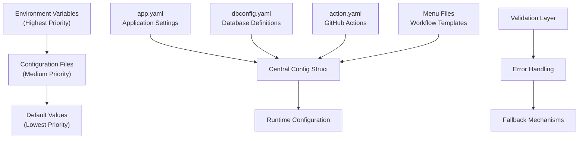
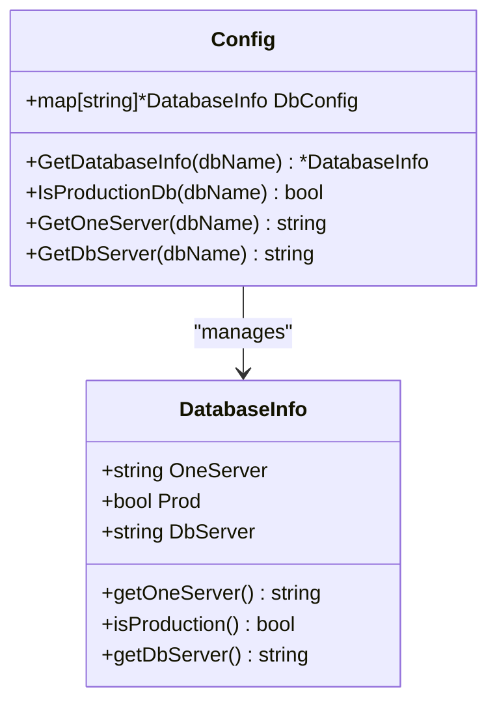
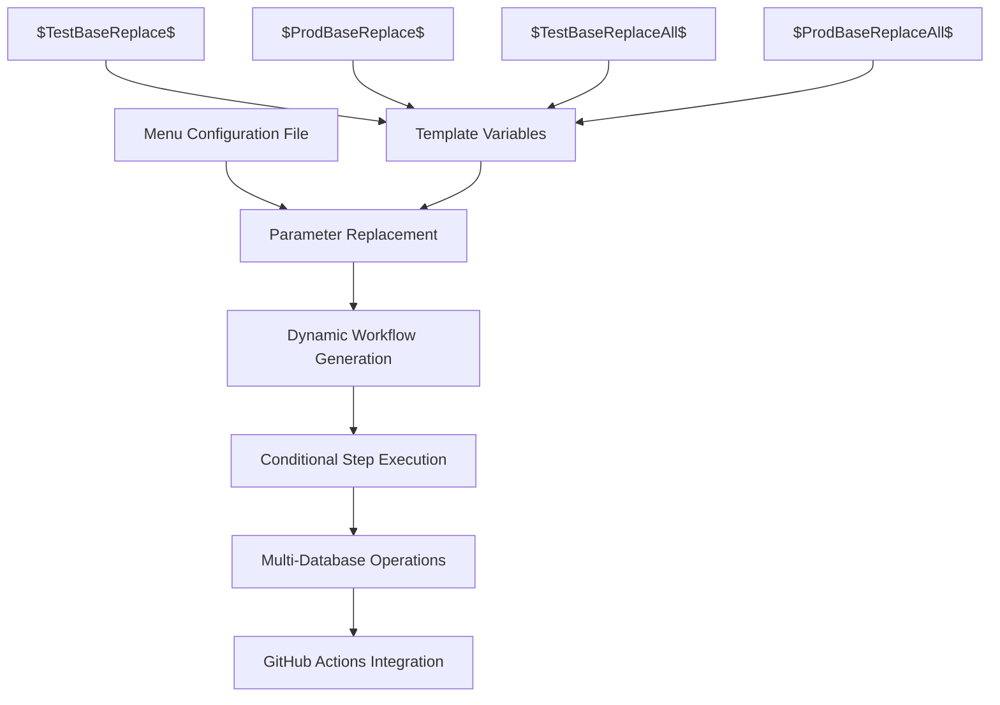
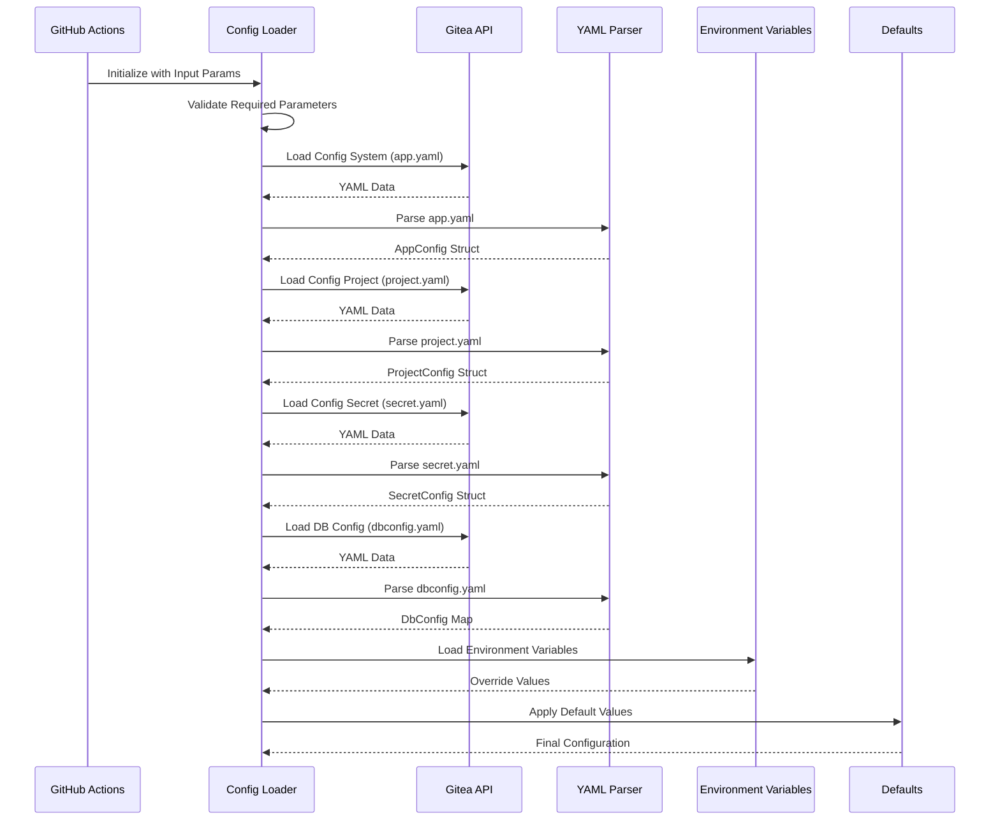

# YAML Configuration Files

<cite>
**Referenced Files in This Document**
- [app.yaml](file://config/app.yaml)
- [dbconfig.yaml](file://config/dbconfig.yaml)
- [action.yaml](file://config/action.yaml)
- [menu_main.yaml](file://config/menu_main.yaml)
- [menu_debug.yaml](file://config/menu_debug.yaml)
- [config.go](file://internal/config/config.go)
</cite>

## Table of Contents
1. [Introduction](#introduction)
2. [Configuration Architecture](#configuration-architecture)
3. [Application Configuration (app.yaml)](#application-configuration-appyaml)
4. [Database Configuration (dbconfig.yaml)](#database-configuration-dbconfigyaml)
5. [GitHub Actions Integration (action.yaml)](#github-actions-integration-actionyaml)
6. [Menu Configuration Files](#menu-configuration-files)
7. [Configuration Loading Process](#configuration-loading-process)
8. [Environment Variables and Priority](#environment-variables-and-priority)
9. [Common Configuration Patterns](#common-configuration-patterns)
10. [Error Handling and Validation](#error-handling-and-validation)
11. [Environment-Specific Configuration](#environment-specific-configuration)
12. [Best Practices](#best-practices)

## Introduction

The benadis-runner employs a sophisticated YAML-based configuration system that centralizes all application settings, database connections, and operational parameters. This system provides a unified approach to configuration management across all modules, ensuring consistency and maintainability while supporting multiple deployment environments.

The configuration system is built around four primary configuration files, each serving a specific purpose in the application's operation:

- **app.yaml**: Application-wide settings including logging, timeouts, executable paths, and service configurations
- **dbconfig.yaml**: Database connection definitions with host, port, credentials, and database names
- **action.yaml**: GitHub Actions workflow integration and parameter definitions
- **Menu configuration files**: Dynamic workflow templates for different operational scenarios

## Configuration Architecture

The configuration system follows a hierarchical structure with multiple layers of precedence:



**Diagram sources**
- [config.go](file://internal/config/config.go#L138-L141)
- [config.go](file://internal/config/config.go#L574-L577)

**Section sources**
- [config.go](file://internal/config/config.go#L138-L141)
- [config.go](file://internal/config/config.go#L574-L577)

## Application Configuration (app.yaml)

The `app.yaml` file serves as the central configuration hub for application-wide settings. It defines system-level parameters that control logging, timeouts, executable paths, and service integrations.

### Core Structure

```yaml
app:
  logLevel: "Debug"
  workDir: "/tmp/benadis"
  tmpDir: "/tmp/benadis/temp"
  timeout: 30

paths:
  bin1cv8: "/opt/1cv8/x86_64/8.3.27.1606/1cv8"
  binIbcmd: "/opt/1cv8/x86_64/8.3.27.1606/ibcmd"
  edtCli: "/opt/1C/1CE/components/1c-edt-2024.2.6+7-x86_64/1cedtcli"
  rac: "/opt/1cv8/x86_64/8.3.27.1606/rac"

rac:
  port: 1545
  timeout: 30
  retries: 3
```

### Configuration Sections

#### System Settings
- **logLevel**: Controls logging verbosity (`Debug`, `Info`, `Warn`, `Error`)
- **workDir**: Primary working directory for application operations
- **tmpDir**: Temporary directory for intermediate files
- **timeout**: Default timeout for operations in seconds

#### Executable Paths
- **bin1cv8**: Path to 1C:Enterprise runtime executable
- **binIbcmd**: Path to 1C:Enterprise database command-line tool
- **edtCli**: Path to 1C:Enterprise Development Tools CLI
- **rac**: Path to Remote Administration Console executable

#### RAC Configuration
- **port**: Port for RAC communication (default: 1545)
- **timeout**: RAC operation timeout in seconds
- **retries**: Number of retry attempts for failed operations

### SonarQube Integration

The application includes comprehensive SonarQube integration configuration:

```yaml
sonarqube:
  url: "http://sq.apkholding.ru:9000"
  timeout: "30s"
  retryAttempts: 3
  retryDelay: "1s"
  projectPrefix: ""
  defaultVisibility: "private"
  qualityGateTimeout: "5m"
```

### Scanner Configuration

```yaml
scanner:
  scannerUrl: "https://regdv.apkholding.ru/gitops-tools/sonar-scanner-cli.git"
  scannerVersion: "7.2.0.5079"
  javaOpts: "-Xmx8192m"
  timeout: "240m"
  workDir: "/tmp/4del/scanner"
  tempDir: "/tmp/4del/scanner/temp"
  properties:
    sonar.sourceEncoding: "UTF-8"
    sonar.sources: "."
    sonar.inclusions: "**/*.bsl,**/*.os,**/*.epf,**/*.erf,**/*.cf,**/*.cfe,**/*.xml,**/*.mdo,**/*.mxl,**/*.dcr,**/*.dcs,**/*.xsd,**/*.go"
    sonar.language: "bsl"
```

### Git Configuration

```yaml
git:
  userName: "benadis-runner"
  userEmail: "benadis-runner@benadis.ru"
  defaultBranch: "main"
  timeout: "30s"
  credentialHelper: "store"
  credentialTimeout: "300s"
```

**Section sources**
- [app.yaml](file://config/app.yaml#L1-L138)
- [config.go](file://internal/config/config.go#L30-L60)

## Database Configuration (dbconfig.yaml)

The `dbconfig.yaml` file defines multiple database connections with comprehensive metadata for each database instance. This file serves as the central registry for all database configurations used by the application.

### Database Definition Format

Each database entry follows a standardized format:

```yaml
DATABASE_NAME:
  one-server: SERVER_NAME
  prod: BOOLEAN
  dbserver: DATABASE_SERVER
```

### Example Database Entries

```yaml
V8_ARCH_APK_CENTER_2IS:
  one-server: MSK-AS-ARCH-001
  prod: false
  dbserver: MSK-SQL-ARCH-01

TEST_DNAVOLOTSKY_SURV:
  one-server: MSK-TS-AS-001
  prod: false
  dbserver: DEV-RZHAVKI-DB1

TEST_IKHRISTENZEN_SURV:
  one-server: MSK-TS-AS-001
  prod: false
  dbserver: TEST-16-DB-001
```

### Database Types and Categories

The configuration supports multiple database categories:

#### Production Databases
- Marked with `prod: true`
- Typically used for live operations
- Require special handling for updates and maintenance

#### Test Databases
- Marked with `prod: false`
- Used for development, testing, and staging
- Allow more flexible update procedures

#### Server Associations
- **one-server**: 1C:Enterprise server hosting the database
- **dbserver**: Microsoft SQL Server instance
- Enables cross-server operations and migrations

### Database Information Structure



**Diagram sources**
- [config.go](file://internal/config/config.go#L80-L85)
- [config.go](file://internal/config/config.go#L1250-L1270)

**Section sources**
- [dbconfig.yaml](file://config/dbconfig.yaml#L1-L799)
- [config.go](file://internal/config/config.go#L80-L85)

## GitHub Actions Integration (action.yaml)

The `action.yaml` file defines the GitHub Actions workflow interface, specifying input parameters, environment variables, and execution steps for the benadis-runner.

### Action Metadata

```yaml
name: 'gitops commander'
description: 'Запуск команд gitops'
```

### Input Parameters

The action defines comprehensive input parameters for flexible operation:

```yaml
inputs:
  giteaURL:
    description: 'Адрес сервера gitea'
    required: true
  repository:
    description: 'Полное имя репозитория'
    required: true
  accessToken:
    description: 'Токен доступа'
    required: true
  command:
    description: 'Выполняемая команда'
    required: true
```

### Advanced Configuration Parameters

```yaml
  configSystem:
    description: 'Имя файла с системной конфигурацией'
    required: false
    default: 'https://regdv.apkholding.ru/api/v1/repos/gitops-tools/gitops_congif/contents/app.yaml?ref=main'
  configProject:
    description: 'Имя файла с конфигурацией проекта'
    required: false
    default: 'project.yaml'
  configSecret:
    description: 'Имя файла с секретами'
    required: false
    default: 'https://regdv.apkholding.ru/api/v1/repos/gitops-tools/gitops_congif/contents/secret.yaml?ref=main'
  configDbData:
    description: 'Имя файла с конфигурацией базы данных'
    required: false
    default: 'https://regdv.apkholding.ru/api/v1/repos/gitops-tools/gitops_congif/contents/dbconfig.yaml?ref=main'
```

### Environment Variable Mapping

The action automatically maps inputs to environment variables:

```yaml
env:
  GITEA_URL: ${{ inputs.giteaURL }}
  REPOSITORY: ${{ inputs.repository }}
  ACCESS_TOKEN: ${{ inputs.accessToken }}
  COMMAND: ${{ inputs.command }}
  LOG_LEVEL: ${{ inputs.logLevel }}
  ISSUE_NUMBER: ${{ inputs.issueNumber }}
  CONFIG_SYSTEM: ${{ inputs.configSystem }}
  CONFIG_PROJECT: ${{ inputs.configProject }}
  CONFIG_SECRET: ${{ inputs.configSecret }}
  CONFIG_DB_DATA: ${{ inputs.configDbData }}
```

### Execution Steps

The action provides flexible execution modes:

```yaml
steps:
  - name: 'Run benadis-runner'
    run: |
      if [ "${{ inputs.debug_port }}" != "0" ]; then
        if [ "${{ inputs.wait }}" = "false" ]; then
          dlv --listen=:${{ inputs.debug_port }} --headless=true --api-version=2 --accept-multiclient --continue exec ${{ github.action_path }}/benadis-runner
        else
          dlv --listen=:${{ inputs.debug_port }} --headless=true --api-version=2 --accept-multiclient exec ${{ github.action_path }}/benadis-runner
        fi
      else
        ${{ github.action_path }}/benadis-runner
      fi
    shell: bash
```

**Section sources**
- [action.yaml](file://config/action.yaml#L1-L121)
- [config.go](file://internal/config/config.go#L106-L114)

## Menu Configuration Files

The menu configuration files provide dynamic workflow templates for different operational scenarios. These files support parameterized workflows with automatic database selection and conditional execution.

### Main Menu Configuration (menu_main.yaml)

The main menu provides structured workflows for common operations:

#### Database Update Workflows

```yaml
1. Обновление тестовых баз.yaml
run-name: ${{ gitea.event_name }} - ${{ gitea.workflow }} - ${{ gitea.actor }}
on:
  workflow_dispatch:
    inputs:
      restore_DB:
        description: 'Восстановить базу перед загрузкой конфигурации'
        required: true
        type: boolean
        default: false 
      service_mode_enable:
        description: 'Включить сервисный режим'
        required: true
        type: boolean
        default: true 
```

#### Parameterized Database Selection

The menu supports dynamic database selection with automatic replacement:

```yaml
      DbName:
        description: 'Выберите базу для загрузки конфигурации (Test)'
        required: true
        default: $TestBaseReplace$
        type: choice
        options:
$TestBaseReplaceAll$
```

### Debug Menu Configuration (menu_debug.yaml)

The debug menu provides comprehensive testing capabilities:

#### Multi-Action Testing

```yaml
name: Test All Actions
on:
  workflow_dispatch:
    inputs:
      version:
        description: 'Version of benadis-runner'
        required: true
        default: 'v1.2.4'
        type: string
      action_1:
        description: 'Enable service mode for database'
        required: false
        default: true
        type: boolean
```

#### Conditional Step Execution

```yaml
jobs:
  test-all-actions:
    runs-on: edt
    steps:
      - name: Service Mode Enable DB
        if: ${{ inputs.action_1 == true }}
        uses: https://${{ secrets.TOKEN_FULL }}:@regdv.apkholding.ru/gitops-tools/benadis-runner@${{ inputs.version }}
        with:
          giteaURL: ${{ gitea.server_url }}
          repository: ${{ gitea.repository }}
          accessToken: ${{ secrets.TOKEN_FULL }}
          actor: ${{ gitea.actor }}
          command: 'service-mode-enable'
          dbName: ${{ inputs.action_1_dbName }}
          logLevel: 'Debug'
```

### Workflow Template Structure



**Diagram sources**
- [menu_main.yaml](file://config/menu_main.yaml#L1-L50)
- [menu_debug.yaml](file://config/menu_debug.yaml#L1-L50)

**Section sources**
- [menu_main.yaml](file://config/menu_main.yaml#L1-L324)
- [menu_debug.yaml](file://config/menu_debug.yaml#L1-L257)

## Configuration Loading Process

The configuration loading process follows a systematic approach with multiple fallback mechanisms and validation layers.

### Loading Sequence



**Diagram sources**
- [config.go](file://internal/config/config.go#L580-L620)
- [config.go](file://internal/config/config.go#L852-L910)

### Configuration Loading Functions

Each configuration type has dedicated loading functions:

#### Application Configuration Loading

```go
func loadAppConfig(l *slog.Logger, cfg *Config) (*AppConfig, error) {
    giteaAPI := CreateGiteaAPI(cfg)
    data, err := giteaAPI.GetConfigData(l, cfg.ConfigSystem)
    if err != nil {
        return nil, fmt.Errorf("ошибка получения данных app.yaml: %w", err)
    }

    var appConfig AppConfig
    if err = yaml.Unmarshal(data, &appConfig); err != nil {
        return nil, fmt.Errorf("ошибка парсинга app.yaml: %w", err)
    }

    return &appConfig, nil
}
```

#### Database Configuration Loading

```go
func loadDbConfig(l *slog.Logger, cfg *Config) (map[string]*DatabaseInfo, error) {
    giteaAPI := CreateGiteaAPI(cfg)
    data, err := giteaAPI.GetConfigData(l, cfg.ConfigDbData)
    if err != nil {
        return nil, fmt.Errorf("ошибка получения данных %s: %w", cfg.ConfigDbData, err)
    }

    var dbConfig map[string]*DatabaseInfo
    if err = yaml.Unmarshal(data, &dbConfig); err != nil {
        return nil, fmt.Errorf("ошибка парсинга %s: %w", cfg.ConfigDbData, err)
    }

    return dbConfig, nil
}
```

### Error Handling and Recovery

The configuration system implements robust error handling:

```go
// If loading fails, use defaults and log warning
if cfg.AppConfig, err = loadAppConfig(l, &cfg); err != nil {
    l.Warn("ошибка загрузки конфигурации приложения", slog.String("error", err.Error()))
    cfg.AppConfig = getDefaultAppConfig()
}
```

**Section sources**
- [config.go](file://internal/config/config.go#L852-L910)
- [config.go](file://internal/config/config.go#L600-L620)

## Environment Variables and Priority

The configuration system supports environment variables with a clear priority hierarchy.

### Variable Naming Convention

Each module uses specific prefixes:

- **APP**: Application-level variables
- **BR**: Benadis Runner global variables
- **DBRESTORE**: Database restore operations
- **SERVICE**: Service mode operations
- **GIT**: Git operations
- **LOG**: Logging configuration

### Priority Order

1. **Environment Variables** (highest priority)
2. **Configuration Files** (medium priority)
3. **Default Values** (lowest priority)

### Environment Variable Mapping

```yaml
# From action.yaml
env:
  GITEA_URL: ${{ inputs.giteaURL }}
  REPOSITORY: ${{ inputs.repository }}
  ACCESS_TOKEN: ${{ inputs.accessToken }}
  COMMAND: ${{ inputs.command }}
  LOG_LEVEL: ${{ inputs.logLevel }}
```

### Cleanenv Integration

The system uses the `cleanenv` package for environment variable parsing:

```go
func GetInputParams() *InputParams {
    inputParams := &InputParams{}
    if err := cleanenv.ReadEnv(inputParams); err != nil {
        return nil
    }
    return inputParams
}
```

**Section sources**
- [config.go](file://internal/config/config.go#L106-L114)
- [config.go](file://internal/config/config.go#L470-L480)

## Common Configuration Patterns

### Database Connection Patterns

#### Production vs Test Separation

```yaml
# Production database
V8_PROD_DB:
  one-server: PROD-SERVER
  prod: true
  dbserver: PROD-MSSQL

# Test database (related to production)
V8_TEST_DB:
  one-server: TEST-SERVER
  prod: false
  dbserver: TEST-MSSQL
```

#### Cross-Server Operations

```yaml
# Define relationships between databases
FindRelatedDatabase(dbName string) (string, error) {
    // Logic to find related databases
    // Returns related database name or error
}
```

### Service Configuration Patterns

#### Timeout Configuration

```yaml
# Consistent timeout patterns
timeout: 30s
timeout: 300s
timeout: 240m
timeout: 5m
```

#### Retry Configuration

```yaml
# Retry patterns for reliability
retryAttempts: 3
retryDelay: "1s"
maxRetryDelay: "30s"
```

### Logging Configuration Patterns

```yaml
logging:
  level: "info"
  format: "json"
  output: "stdout"
  filePath: "/var/log/benadis-runner.log"
  maxSize: 100
  maxBackups: 3
  maxAge: 7
  compress: true
```

**Section sources**
- [config.go](file://internal/config/config.go#L1250-L1300)
- [app.yaml](file://config/app.yaml#L120-L138)

## Error Handling and Validation

The configuration system implements comprehensive error handling and validation mechanisms.

### Required Parameter Validation

```go
func validateRequiredParams(inputParams *InputParams, l *slog.Logger) error {
    var missingParams []string

    // Check mandatory parameters
    if inputParams.GHAActor == "" {
        missingParams = append(missingParams, "ACTOR")
    }
    if inputParams.GHAGiteaURL == "" {
        missingParams = append(missingParams, "GITEAURL")
    }
    if inputParams.GHARepository == "" {
        missingParams = append(missingParams, "REPOSITORY")
    }
    if inputParams.GHAAccessToken == "" {
        missingParams = append(missingParams, "ACCESSTOKEN")
    }
    if inputParams.GHACommand == "" {
        missingParams = append(missingParams, "COMMAND")
    }

    if len(missingParams) > 0 {
        missingParamsStr := strings.Join(missingParams, ", ")
        errorMsg := fmt.Sprintf("Отсутствуют обязательные параметры конфигурации: %s", missingParamsStr)
        l.Error(errorMsg)
        return errors.New(errorMsg)
    }

    return nil
}
```

### Configuration Validation Patterns

#### Database Configuration Validation

```go
func (cfg *Config) IsProductionDb(dbName string) bool {
    if cfg.DbConfig == nil {
        return false
    }
    if dbInfo, exists := cfg.DbConfig[dbName]; exists {
        return dbInfo.Prod
    }
    return false
}
```

#### Configuration Reloading

```go
func (cfg *Config) ReloadConfig() error {
    // Reload application configuration
    appConfig, err := loadAppConfig(cfg.Logger, cfg)
    if err != nil {
        return fmt.Errorf("failed to reload app config: %w", err)
    }
    cfg.AppConfig = appConfig

    // Reload other configurations...
    return nil
}
```

### Error Recovery Strategies

1. **Graceful Degradation**: Use defaults when configuration fails
2. **Logging**: Comprehensive error logging with context
3. **Validation**: Early detection of configuration issues
4. **Reload Capability**: Runtime configuration updates

**Section sources**
- [config.go](file://internal/config/config.go#L400-L420)
- [config.go](file://internal/config/config.go#L1200-L1250)

## Environment-Specific Configuration

The configuration system supports multiple deployment environments with environment-specific settings.

### Environment Detection

```go
func (cfg *Config) Environment() string {
    return cfg.Env
}
```

### Environment-Specific Patterns

#### Development Environment

```yaml
# Development settings
workDir: "/tmp/benadis-dev"
tmpDir: "/tmp/benadis-dev/temp"
logLevel: "Debug"
timeout: 60
```

#### Production Environment

```yaml
# Production settings
workDir: "/var/lib/benadis"
tmpDir: "/var/tmp/benadis"
logLevel: "Info"
timeout: 300
```

#### Staging Environment

```yaml
# Staging settings
workDir: "/opt/benadis/staging"
tmpDir: "/opt/benadis/staging/temp"
logLevel: "Warn"
timeout: 120
```

### Configuration File Organization

#### Centralized Configuration

```
config/
├── app.yaml                    # Base application settings
├── dbconfig.yaml              # Database definitions
├── secret.yaml                # Sensitive data
├── project.yaml               # Project-specific settings
├── menu_main.yaml             # Main workflow templates
└── menu_debug.yaml            # Debug workflow templates
```

#### Environment-Specific Overrides

```
environments/
├── dev/
│   ├── app.yaml
│   └── dbconfig.yaml
├── staging/
│   ├── app.yaml
│   └── dbconfig.yaml
└── production/
    ├── app.yaml
    └── dbconfig.yaml
```

### Deployment Strategies

#### GitOps Approach

```yaml
# Using remote configuration files
configSystem: 'https://regdv.apkholding.ru/api/v1/repos/gitops-tools/gitops_congif/contents/app.yaml?ref=main'
configSecret: 'https://regdv.apkholding.ru/api/v1/repos/gitops-tools/gitops_congif/contents/secret.yaml?ref=main'
configDbData: 'https://regdv.apkholding.ru/api/v1/repos/gitops-tools/gitops_congif/contents/dbconfig.yaml?ref=main'
```

#### Local Configuration

```yaml
# Using local configuration files
configSystem: './config/app.yaml'
configProject: './config/project.yaml'
configSecret: './config/secret.yaml'
configDbData: './config/dbconfig.yaml'
```

**Section sources**
- [config.go](file://internal/config/config.go#L135-L137)
- [action.yaml](file://config/action.yaml#L15-L35)

## Best Practices

### Configuration Management

#### 1. Use Environment Variables for Secrets

```yaml
# Good: Use environment variables for sensitive data
PASSWORD: ${DB_PASSWORD}

# Avoid: Hardcoding secrets in configuration files
PASSWORD: "supersecret123"
```

#### 2. Implement Proper Validation

```go
// Validate configuration during startup
if err := validateConfiguration(cfg); err != nil {
    log.Fatalf("Invalid configuration: %v", err)
}
```

#### 3. Use Descriptive Names

```yaml
# Good: Descriptive database names
V8_ARCH_APK_CENTER_2IS:
  one-server: MSK-AS-ARCH-001
  prod: false
  dbserver: MSK-SQL-ARCH-01

# Avoid: Generic names
DB1:
  one-server: SERVER1
  prod: false
  dbserver: MSSQL1
```

### Security Considerations

#### 1. Secure Secret Storage

```yaml
# Use encrypted secrets in CI/CD
secrets:
  DB_PASSWORD: ${{ secrets.DB_PASSWORD }}
  GITEA_TOKEN: ${{ secrets.GITEA_TOKEN }}
```

#### 2. Limit Access to Configuration Files

```bash
# Restrict file permissions
chmod 600 config/*.yaml
chown benadis:benadis config/*.yaml
```

#### 3. Audit Configuration Changes

```yaml
# Track configuration changes
audit:
  enabled: true
  log_level: "info"
  retention_days: 30
```

### Performance Optimization

#### 1. Optimize Configuration Loading

```go
// Cache frequently accessed configurations
func (cfg *Config) GetCachedDatabaseInfo(dbName string) *DatabaseInfo {
    if cached, exists := cfg.cache.Get(dbName); exists {
        return cached.(*DatabaseInfo)
    }
    return cfg.GetDatabaseInfo(dbName)
}
```

#### 2. Use Efficient Data Structures

```go
// Use maps for fast database lookups
type Config struct {
    DbConfig map[string]*DatabaseInfo
    // Other fields...
}
```

#### 3. Implement Configuration Validation

```go
// Validate configuration before use
func (cfg *Config) Validate() error {
    if cfg.AppConfig.Timeout <= 0 {
        return errors.New("invalid timeout value")
    }
    return nil
}
```

### Monitoring and Observability

#### 1. Monitor Configuration Changes

```go
// Log configuration changes
func (cfg *Config) ReloadConfig() error {
    oldConfig := cfg.AppConfig
    // Reload logic...
    if !reflect.DeepEqual(oldConfig, cfg.AppConfig) {
        cfg.Logger.Info("Configuration reloaded", "timestamp", time.Now())
    }
    return nil
}
```

#### 2. Implement Health Checks

```go
// Configuration health check
func (cfg *Config) HealthCheck() error {
    if cfg.AppConfig == nil {
        return errors.New("application configuration not loaded")
    }
    if cfg.DbConfig == nil {
        return errors.New("database configuration not loaded")
    }
    return nil
}
```

#### 3. Use Structured Logging

```go
// Log configuration with context
cfg.Logger.Info("Configuration loaded",
    "app_config", cfg.AppConfig,
    "db_count", len(cfg.DbConfig),
    "project_name", cfg.ProjectName,
)
```

### Documentation and Maintenance

#### 1. Document Configuration Options

```yaml
# Document configuration options
# logLevel: Debug | Info | Warn | Error
# timeout: Integer value in seconds
# prod: true | false
```

#### 2. Maintain Configuration Templates

```yaml
# Keep configuration templates up-to-date
templates:
  - app.yaml.template
  - dbconfig.yaml.template
  - secret.yaml.template
```

#### 3. Implement Configuration Migration

```go
// Handle configuration version upgrades
func MigrateConfig(cfg *Config) error {
    if cfg.Version < 2 {
        return migrateToV2(cfg)
    }
    return nil
}
```

**Section sources**
- [config.go](file://internal/config/config.go#L1200-L1250)
- [app.yaml](file://config/app.yaml#L1-L138)