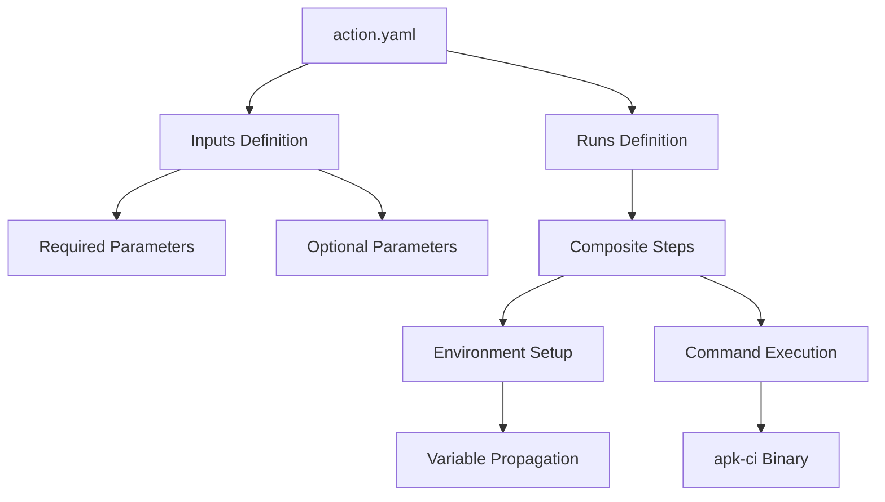
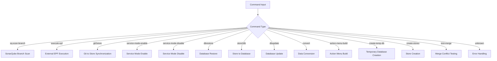
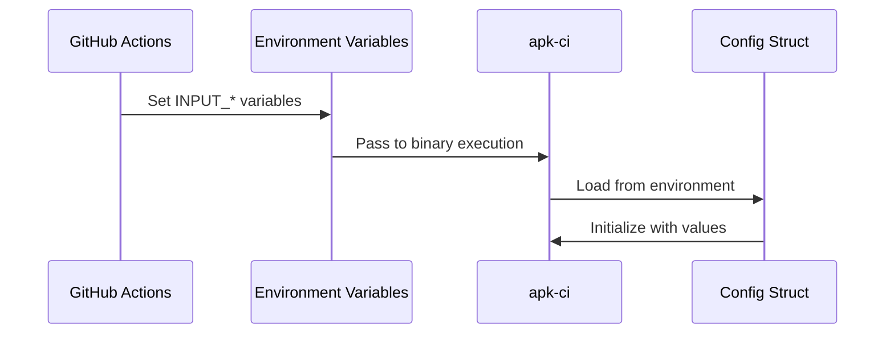
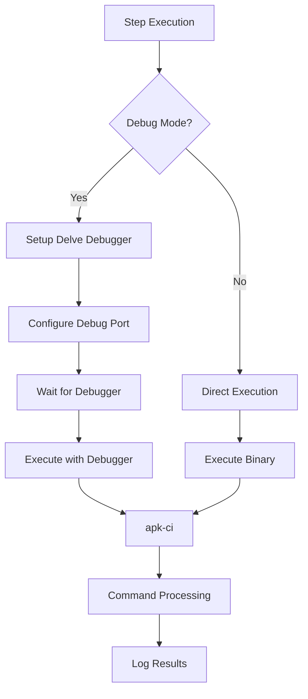

# Action.yaml Configuration

<cite>
**Referenced Files in This Document**
- [config/action.yaml](file://config/action.yaml)
- [internal/config/config.go](file://internal/config/config.go)
- [cmd/apk-ci/main.go](file://cmd/apk-ci/main.go)
- [internal/constants/constants.go](file://internal/constants/constants.go)
- [scripts/sq-scan-apk-ci.sh](file://scripts/sq-scan-apk-ci.sh)
- [old/Test all action.yaml](file://old/Test all action.yaml)
- [old/template-for-action.yaml](file://old/template-for-action.yaml)
- [README.md](file://README.md)
</cite>

## Table of Contents
1. [Introduction](#introduction)
2. [Action.yaml Structure](#actionyaml-structure)
3. [Input Parameters Mapping](#input-parameters-mapping)
4. [Command Mappings](#command-mappings)
5. [Environment Variable Bindings](#environment-variable-bindings)
6. [Execution Context](#execution-context)
7. [Real-World Workflow Examples](#real-world-workflow-examples)
8. [Common Pitfalls and Solutions](#common-pitfalls-and-solutions)
9. [Best Practices](#best-practices)
10. [Troubleshooting Guide](#troubleshooting-guide)

## Introduction

The `action.yaml` configuration file serves as the primary interface between GitHub Actions workflows and the apk-ci application. This configuration defines how external CI/CD systems can invoke apk-ci commands to automate 1C:Enterprise development tasks such as database operations, configuration management, and SonarQube integration.

The action.yaml acts as a bridge between GitHub Actions' declarative workflow syntax and the functional capabilities of apk-ci, providing a standardized way to execute complex operations through simple workflow definitions.

## Action.yaml Structure

The action.yaml follows GitHub Actions composite action format and consists of several key sections:



**Diagram sources**
- [config/action.yaml](file://config/action.yaml#L1-L121)

**Section sources**
- [config/action.yaml](file://config/action.yaml#L1-L121)

## Input Parameters Mapping

The action.yaml defines comprehensive input parameters that map directly to the Config struct's fields in the Go application. These inputs provide fine-grained control over the execution context and behavior of apk-ci commands.

### Required Inputs

```yaml
inputs:
  giteaURL:
    description: 'Адрес сервера gitea'
    required: true
  repository:
    description: 'Полное имя репозитория'
    required: true
  accessToken:
    description: 'Токен доступа'
    required: true
  command:
    description: 'Выполняемая команда'
    required: true
  actor:
    description: 'Пользователь, который запускает действие'
    required: true
```

### Optional Configuration Files

```yaml
inputs:
  configSystem:
    description: 'Имя файла с системной конфигурацией'
    required: false
    default: 'https://regdv.apkholding.ru/api/v1/repos/gitops-tools/gitops_congif/contents/app.yaml?ref=main'
  configProject:
    description: 'Имя файла с конфигурацией проекта'
    required: false
    default: 'project.yaml'
  configSecret:
    description: 'Имя файла с секретами'
    required: false
    default: 'https://regdv.apkholding.ru/api/v1/repos/gitops-tools/gitops_congif/contents/secret.yaml?ref=main'
  configDbData:
    description: 'Имя файла с конфигурацией базы данных'
    required: false
    default: 'https://regdv.apkholding.ru/api/v1/repos/gitops-tools/gitops_congif/contents/dbconfig.yaml?ref=main'
```

### Specialized Parameters

```yaml
inputs:
  dbName:
    description: 'Имя базы данных для сервисного режима'
    required: false
  terminateSessions:
    description: 'Завершить активные сеансы при включении сервисного режима'
    required: false
    default: 'true'
  force_update:
    description: 'Принудительно выполнить операцию'
    required: false
    default: 'false'
  debug_port:
    description: 'Порт для режима отладки (0 - обычный запуск)'
    required: false
    default: '0'
  wait:
    description: 'Ожидать подключения отладчика перед выполнением (true/false)'
    required: false
    default: 'false'
```

**Section sources**
- [config/action.yaml](file://config/action.yaml#L4-L121)

## Command Mappings

The action.yaml supports a comprehensive set of commands that correspond to specific functionalities within the apk-ci application. These commands are mapped to the constants defined in the application's constant package.

### Core Commands



**Diagram sources**
- [internal/constants/constants.go](file://internal/constants/constants.go#L50-L85)
- [cmd/apk-ci/main.go](file://cmd/apk-ci/main.go#L30-L250)

### Command-Specific Parameters

Each command type supports specific parameters:

**SonarQube Commands:**
- `branchForScan`: Specifies the branch to scan
- `commitHash`: Identifies the commit for scanning

**Database Operations:**
- `dbName`: Target database name
- `terminateSessions`: Controls session termination during service mode
- `force_update`: Forces operation execution regardless of state

**Development Commands:**
- `startEpf`: URL to external EPF for execution
- `debug_port`: Port for debugging sessions
- `wait`: Waits for debugger connection

**Section sources**
- [internal/constants/constants.go](file://internal/constants/constants.go#L50-L85)
- [cmd/apk-ci/main.go](file://cmd/apk-ci/main.go#L30-L250)

## Environment Variable Bindings

The action.yaml automatically propagates all input parameters as environment variables to the apk-ci binary. This creates a seamless mapping between GitHub Actions inputs and the application's configuration system.

### Environment Variable Mapping



**Diagram sources**
- [config/action.yaml](file://config/action.yaml#L85-L121)
- [internal/config/config.go](file://internal/config/config.go#L60-L85)

### Input to Environment Mapping

| Input Parameter | Environment Variable | Type |
|----------------|---------------------|------|
| `giteaURL` | `GITEA_URL` | String |
| `repository` | `REPOSITORY` | String |
| `accessToken` | `ACCESS_TOKEN` | String |
| `command` | `COMMAND` | String |
| `logLevel` | `LOG_LEVEL` | String |
| `issueNumber` | `ISSUE_NUMBER` | String |
| `dbName` | `DB_NAME` | String |
| `terminateSessions` | `TERMINATE_SESSIONS` | Boolean |
| `force_update` | `FORCE_UPDATE` | Boolean |
| `debug_port` | `DEBUG_PORT` | Integer |
| `wait` | `WAIT` | Boolean |
| `startEpf` | `STARTEPF` | String |
| `branchForScan` | `INPUT_BRANCHFORSCAN` | String |
| `commitHash` | `INPUT_COMMITHASH` | String |

### Configuration File Variables

| Input Parameter | Environment Variable | Purpose |
|----------------|---------------------|---------|
| `configSystem` | `CONFIG_SYSTEM` | System-wide configuration |
| `configProject` | `CONFIG_PROJECT` | Project-specific settings |
| `configSecret` | `CONFIG_SECRET` | Secret credentials |
| `configDbData` | `CONFIG_DB_DATA` | Database configuration |
| `menuMain` | `MENU_MAIN` | Main menu configuration |
| `menuDebug` | `MENU_DEBUG` | Debug menu configuration |

**Section sources**
- [config/action.yaml](file://config/action.yaml#L85-L121)

## Execution Context

The action.yaml defines a composite execution context that handles both standard and debug execution modes, providing flexibility for different operational scenarios.

### Composite Steps Implementation



**Diagram sources**
- [config/action.yaml](file://config/action.yaml#L60-L80)

### Debug Mode Configuration

The action.yaml supports advanced debugging capabilities through Delve integration:

```yaml
steps:
  - name: 'Run apk-ci'
    run: |
      if [ "${{ inputs.debug_port }}" != "0" ]; then
        if [ "${{ inputs.wait }}" = "false" ]; then
          dlv --listen=:${{ inputs.debug_port }} --headless=true --api-version=2 --accept-multiclient --continue exec ${{ github.action_path }}/apk-ci
        else
          dlv --listen=:${{ inputs.debug_port }} --headless=true --api-version=2 --accept-multiclient exec ${{ github.action_path }}/apk-ci
        fi
      else
        ${{ github.action_path }}/apk-ci
      fi
    shell: bash
```

### Execution Modes

1. **Standard Mode**: Direct binary execution
2. **Debug Mode**: Delve-powered debugging with configurable ports
3. **Wait Mode**: Waits for debugger connection before execution

**Section sources**
- [config/action.yaml](file://config/action.yaml#L60-L80)

## Real-World Workflow Examples

The following examples demonstrate practical implementations of apk-ci actions in various CI/CD scenarios.

### Database Update Workflow

```yaml
name: Database Update Pipeline
on:
  workflow_dispatch:
    inputs:
      database:
        description: 'Target database name'
        required: true
        type: string
      service_mode:
        description: 'Enable service mode'
        required: true
        type: boolean
        default: true
      force_update:
        description: 'Force update operation'
        required: false
        type: boolean
        default: false

jobs:
  update-database:
    runs-on: ubuntu-latest
    steps:
      - name: Enable Service Mode
        if: ${{ inputs.service_mode == true }}
        uses: gitops-tools/apk-ci@latest
        with:
          giteaURL: ${{ secrets.GITEA_URL }}
          repository: ${{ github.repository }}
          accessToken: ${{ secrets.GITEA_TOKEN }}
          actor: ${{ github.actor }}
          command: 'service-mode-enable'
          dbName: ${{ inputs.database }}
          logLevel: 'Debug'
          
      - name: Update Database Configuration
        uses: gitops-tools/apk-ci@latest
        with:
          giteaURL: ${{ secrets.GITEA_URL }}
          repository: ${{ github.repository }}
          accessToken: ${{ secrets.GITEA_TOKEN }}
          actor: ${{ github.actor }}
          command: 'dbupdate'
          dbName: ${{ inputs.database }}
          force_update: ${{ inputs.force_update }}
          logLevel: 'Info'
          
      - name: Disable Service Mode
        if: ${{ inputs.service_mode == true }}
        uses: gitops-tools/apk-ci@latest
        with:
          giteaURL: ${{ secrets.GITEA_URL }}
          repository: ${{ github.repository }}
          accessToken: ${{ secrets.GITEA_TOKEN }}
          actor: ${{ github.actor }}
          command: 'service-mode-disable'
          dbName: ${{ inputs.database }}
          logLevel: 'Debug'
```

### SonarQube Integration Workflow

```yaml
name: SonarQube Quality Scan
on:
  pull_request:
    types: [opened, synchronize, reopened]
  workflow_dispatch:
    inputs:
      branch:
        description: 'Branch to scan'
        required: false
        default: ''

jobs:
  sonarqube-scan:
    runs-on: ubuntu-latest
    steps:
      - name: Checkout Repository
        uses: actions/checkout@v4
        with:
          fetch-depth: 0
          
      - name: Run SonarQube Scan
        uses: gitops-tools/apk-ci@latest
        with:
          giteaURL: ${{ secrets.GITEA_URL }}
          repository: ${{ github.repository }}
          accessToken: ${{ secrets.GITEA_TOKEN }}
          actor: ${{ github.actor }}
          command: 'sq-scan-pr'
          branchForScan: ${{ github.head_ref || github.ref_name }}
          commitHash: ${{ github.sha }}
          logLevel: 'Debug'
        env:
          SONAR_TOKEN: ${{ secrets.SONAR_TOKEN }}
          SONAR_HOST_URL: ${{ secrets.SONAR_HOST_URL }}
```

### Automated Configuration Deployment

```yaml
name: Configuration Deployment
on:
  push:
    branches: [main]
  workflow_dispatch:
    inputs:
      restore_database:
        description: 'Restore database before deployment'
        required: false
        type: boolean
        default: false

jobs:
  deploy-configuration:
    runs-on: ubuntu-latest
    steps:
      - name: Restore Database (if requested)
        if: ${{ inputs.restore_database == true }}
        uses: gitops-tools/apk-ci@latest
        with:
          giteaURL: ${{ secrets.GITEA_URL }}
          repository: ${{ github.repository }}
          accessToken: ${{ secrets.GITEA_TOKEN }}
          actor: ${{ github.actor }}
          command: 'dbrestore'
          dbName: ${{ secrets.DB_NAME }}
          logLevel: 'Debug'
          
      - name: Load Configuration from Git
        uses: gitops-tools/apk-ci@latest
        with:
          giteaURL: ${{ secrets.GITEA_URL }}
          repository: ${{ github.repository }}
          accessToken: ${{ secrets.GITEA_TOKEN }}
          actor: ${{ github.actor }}
          command: 'git2store'
          logLevel: 'Info'
          
      - name: Apply Configuration
        uses: gitops-tools/apk-ci@latest
        with:
          giteaURL: ${{ secrets.GITEA_URL }}
          repository: ${{ github.repository }}
          accessToken: ${{ secrets.GITEA_TOKEN }}
          actor: ${{ github.actor }}
          command: 'store2db'
          dbName: ${{ secrets.DB_NAME }}
          logLevel: 'Debug'
          
      - name: Update Database
        uses: gitops-tools/apk-ci@latest
        with:
          giteaURL: ${{ secrets.GITEA_URL }}
          repository: ${{ github.repository }}
          accessToken: ${{ secrets.GITEA_TOKEN }}
          actor: ${{ github.actor }}
          command: 'dbupdate'
          dbName: ${{ secrets.DB_NAME }}
          logLevel: 'Debug'
```

**Section sources**
- [old/Test all action.yaml](file://old/Test all action.yaml#L1-L256)
- [old/template-for-action.yaml](file://old/template-for-action.yaml#L1-L220)

## Common Pitfalls and Solutions

### Incorrect Command Naming

**Problem**: Using non-existent or misspelled commands
```yaml
# ❌ Wrong
command: 'servicemode-enable'

# ✅ Correct
command: 'service-mode-enable'
```

**Solution**: Always use the exact command names defined in the constants package.

### Missing Environment Propagation

**Problem**: Not setting required environment variables
```yaml
# ❌ Missing required inputs
with:
  command: 'dbrestore'
  # Missing giteaURL, repository, accessToken, actor
```

**Solution**: Ensure all required inputs are provided:
```yaml
with:
  giteaURL: ${{ secrets.GITEA_URL }}
  repository: ${{ github.repository }}
  accessToken: ${{ secrets.GITEA_TOKEN }}
  actor: ${{ github.actor }}
  command: 'dbrestore'
```

### Permission Issues in CI Environments

**Problem**: Insufficient permissions for Gitea operations
```yaml
# ❌ Using wrong token scope
accessToken: ${{ secrets.READER_TOKEN }}
```

**Solution**: Use appropriate token scopes:
```yaml
accessToken: ${{ secrets.TOKEN_FULL }}  # Full access token
```

### Debug Mode Configuration Issues

**Problem**: Incorrect debug port configuration
```yaml
# ❌ Invalid port range
debug_port: '70000'  # Out of valid range

# ✅ Valid port
debug_port: '2345'
```

**Solution**: Use valid port numbers (typically 1024-65535):
```yaml
debug_port: '2345'
wait: 'true'  # Wait for debugger connection
```

### Configuration File Path Issues

**Problem**: Incorrect or inaccessible configuration URLs
```yaml
# ❌ Hardcoded insecure URL
configSystem: 'http://example.com/config.yaml'

# ✅ Secure HTTPS URL
configSystem: 'https://secure-domain.com/config.yaml'
```

**Solution**: Use secure HTTPS URLs and ensure accessibility:
```yaml
configSystem: 'https://regdv.apkholding.ru/api/v1/repos/gitops-tools/gitops_congif/contents/app.yaml?ref=main'
```

## Best Practices

### Security Best Practices

1. **Token Management**:
   ```yaml
   # Use environment variables for sensitive data
   accessToken: ${{ secrets.GITEA_TOKEN }}
   ```

2. **Access Control**:
   ```yaml
   # Use minimal required permissions
   accessToken: ${{ secrets.READER_TOKEN }}  # For read-only operations
   ```

3. **Secret Rotation**:
   ```yaml
   # Regularly rotate secrets
   # Update secrets in GitHub Actions settings
   ```

### Reproducible Builds

1. **Fixed Version Pinning**:
   ```yaml
   uses: gitops-tools/apk-ci@v1.2.3  # Pin to specific version
   ```

2. **Consistent Configuration**:
   ```yaml
   # Use consistent configuration file locations
   configSystem: 'https://regdv.apkholding.ru/api/v1/repos/gitops-tools/gitops_congif/contents/app.yaml?ref=main'
   ```

3. **Environment Consistency**:
   ```yaml
   # Maintain consistent environment variables across runs
   logLevel: 'Info'  # Standard logging level
   ```

### Error Handling

1. **Conditional Execution**:
   ```yaml
   - name: Conditional Step
     if: ${{ inputs.enable_feature == true }}
     uses: gitops-tools/apk-ci@latest
     with:
       ...
   ```

2. **Graceful Degradation**:
   ```yaml
   - name: Backup Operation
     continue-on-error: true
     uses: gitops-tools/apk-ci@latest
     with:
       ...
   ```

### Performance Optimization

1. **Parallel Execution**:
   ```yaml
   jobs:
     parallel-job-1:
       # Parallel job definition
     parallel-job-2:
       # Parallel job definition
   ```

2. **Resource Management**:
   ```yaml
   runs-on: ubuntu-latest
   timeout-minutes: 30
   ```

## Troubleshooting Guide

### Debugging Workflow Failures

1. **Enable Debug Logging**:
   ```yaml
   logLevel: 'Debug'
   ```

2. **Check Environment Variables**:
   ```yaml
   # Verify all required variables are set
   echo "GITEA_URL: ${{ secrets.GITEA_URL }}"
   echo "REPOSITORY: ${{ github.repository }}"
   ```

3. **Validate Configuration Files**:
   ```yaml
   # Test configuration file accessibility
   curl -I ${{ inputs.configSystem }}
   ```

### Common Error Messages

**Missing Required Parameters**:
```
Ошибка: Отсутствуют обязательные параметры конфигурации: GITEAURL, REPOSITORY, ACCESSTOKEN
```

**Command Not Found**:
```
Ошибка: неизвестная команда BR_ACTION
```

**Permission Denied**:
```
Ошибка: доступ к репозиторию запрещен
```

### Diagnostic Steps

1. **Verify Input Values**:
   ```yaml
   - name: Debug Inputs
     run: |
       echo "GITEA_URL: ${{ inputs.giteaURL }}"
       echo "COMMAND: ${{ inputs.command }}"
       echo "ACTOR: ${{ inputs.actor }}"
   ```

2. **Check Network Connectivity**:
   ```yaml
   - name: Test Network
     run: |
       ping $(echo ${{ inputs.giteaURL }} | cut -d'/' -f3)
   ```

3. **Validate Configuration Access**:
   ```yaml
   - name: Validate Config
     run: |
       wget -qO- ${{ inputs.configSystem }} > /dev/null
   ```

**Section sources**
- [internal/config/config.go](file://internal/config/config.go#L600-L650)
- [cmd/apk-ci/main.go](file://cmd/apk-ci/main.go#L240-L252)