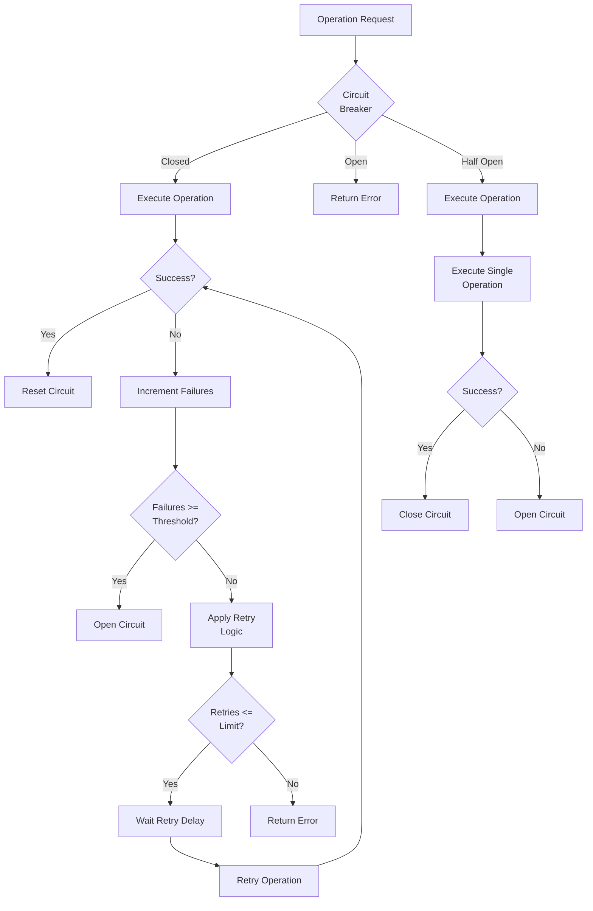
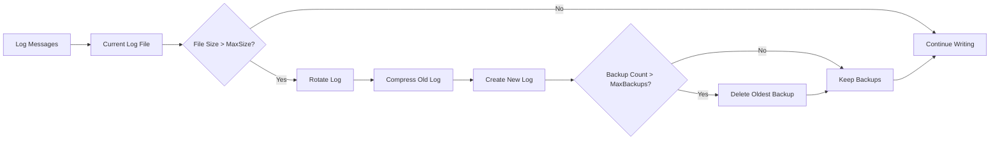
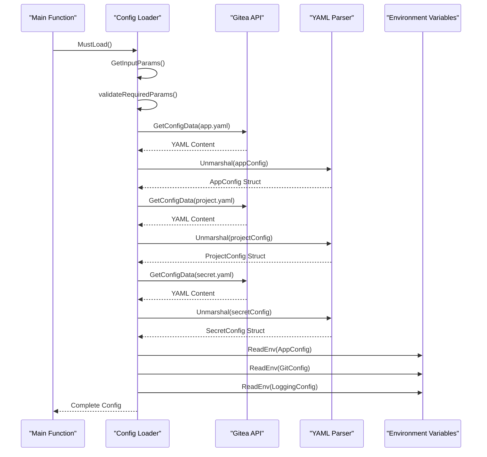
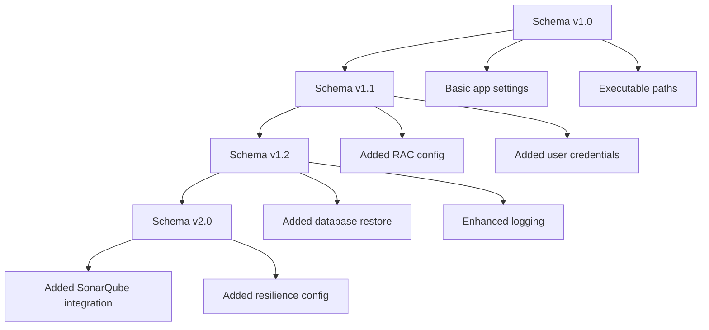

# app.yaml Configuration

<cite>
**Referenced Files in This Document**
- [config/app.yaml](file://config/app.yaml)
- [internal/config/config.go](file://internal/config/config.go)
- [cmd/benadis-runner/main.go](file://cmd/benadis-runner/main.go)
- [internal/constants/constants.go](file://internal/constants/constants.go)
- [config/action.yaml](file://config/action.yaml)
</cite>

## Table of Contents
1. [Introduction](#introduction)
2. [Configuration Structure Overview](#configuration-structure-overview)
3. [Core Application Settings](#core-application-settings)
4. [Executable Paths Configuration](#executable-paths-configuration)
5. [RAC Configuration](#rac-configuration)
6. [User Credentials](#user-credentials)
7. [Database Restore Settings](#database-restore-settings)
8. [SonarQube Integration](#sonarqube-integration)
9. [SonarQube Scanner Configuration](#sonarqube-scanner-configuration)
10. [Git Configuration](#git-configuration)
11. [Resilience Configuration](#resilience-configuration)
12. [Logging Configuration](#logging-configuration)
13. [Environment-Specific Configurations](#environment-specific-configurations)
14. [Configuration Loading Process](#configuration-loading-process)
15. [Best Practices and Troubleshooting](#best-practices-and-troubleshooting)
16. [Migration and Compatibility](#migration-and-compatibility)

## Introduction

The `app.yaml` configuration file serves as the central configuration hub for the benadis-runner application, defining application-wide settings that control system behavior, timeouts, file paths, and integration parameters. This configuration file is essential for proper application initialization and determines how the runner interacts with various external systems including 1C:Enterprise, Git repositories, SonarQube, and database systems.

The configuration follows a hierarchical structure with clear separation of concerns, allowing for environment-specific customization while maintaining consistency across deployments. The file is designed to be human-readable and easily maintainable, with comprehensive documentation embedded directly in the YAML structure.

## Configuration Structure Overview

The `app.yaml` file is organized into logical sections, each controlling specific aspects of the application's behavior:

```mermaid
graph TD
A["app.yaml"] --> B["Application Settings"]
A --> C["Executable Paths"]
A --> D["RAC Configuration"]
A --> E["User Credentials"]
A --> F["Database Restore"]
A --> G["SonarQube Integration"]
A --> H["SonarQube Scanner"]
A --> I["Git Configuration"]
A --> J["Resilience Settings"]
A --> K["Logging Configuration"]
B --> B1["Log Level"]
B --> B2["Working Directories"]
B --> B3["Timeout Settings"]
C --> C1["1C Executables"]
C --> C2["EDT CLI"]
C --> C3["RAC Path"]
D --> D1["Port Configuration"]
D --> D2["Connection Settings"]
E --> E1["RAC Users"]
E --> E2["Database Users"]
F --> F1["Database Settings"]
F --> F2["Timeout Configuration"]
G --> G1["Server URL"]
G --> G2["Authentication"]
G --> G3["Quality Gates"]
H --> H1["Download URLs"]
H --> H2["JVM Options"]
H --> H3["Analysis Properties"]
I --> I1["User Information"]
I --> I2["Credential Management"]
J --> J1["Retry Policies"]
J --> J2["Circuit Breaker"]
K --> K1["Output Formats"]
K --> K2["File Rotation"]
```



**Diagram sources**
- [config/app.yaml](file://config/app.yaml#L1-L138)
- [internal/config/config.go](file://internal/config/config.go#L30-L60)

## Core Application Settings

The core application settings define fundamental operational parameters that control the basic behavior of the benadis-runner:

### Basic Configuration Parameters

```yaml
app:
  logLevel: "Debug"
  workDir: "/tmp/benadis"
  tmpDir: "/tmp/benadis/temp"
  timeout: 30
```

**Field Descriptions:**

- **logLevel**: Controls the verbosity of application logging. Accepts values: "Debug", "Info", "Warn", "Error". Determines which log messages are processed and displayed.
- **workDir**: Root directory for application working files and temporary data storage.
- **tmpDir**: Dedicated temporary directory for short-lived files and intermediate processing data.
- **timeout**: Default timeout in seconds for most operations, affecting network requests, database connections, and external process executions.

### Configuration Mapping

The core application settings map directly to the `AppConfig` struct in Go:

```go
type AppConfig struct {
    LogLevel string `yaml:"logLevel"`
    WorkDir  string `yaml:"workDir"`
    TmpDir   string `yaml:"tmpDir"`
    Timeout  int    `yaml:"timeout"`
}
```

**Section sources**
- [config/app.yaml](file://config/app.yaml#L1-L10)
- [internal/config/config.go](file://internal/config/config.go#L30-L40)

## Executable Paths Configuration

The executable paths section defines the locations of critical 1C:Enterprise executables and tools required for the application's operation:

```yaml
paths:
  bin1cv8: "/opt/1cv8/x86_64/8.3.27.1606/1cv8"
  binIbcmd: "/opt/1cv8/x86_64/8.3.27.1606/ibcmd"
  edtCli: "/opt/1C/1CE/components/1c-edt-2024.2.6+7-x86_64/1cedtcli"
  rac: "/opt/1cv8/x86_64/8.3.27.1606/rac"
```

### Path Specifications

Each path field corresponds to a specific executable:

- **bin1cv8**: Main 1C:Enterprise runtime executable for database operations and configuration management
- **binIbcmd**: 1C:Enterprise command-line interface for database administration tasks
- **edtCli**: Enterprise Development Tools CLI for project conversion and analysis
- **rac**: Remote Administration Console executable for cluster management and maintenance

### Environment Variable Overrides

The configuration supports environment variable overrides for flexible deployment scenarios:

```bash
# Example environment variable overrides
export BR_CONFIG_SYSTEM="/custom/path/app.yaml"
export BR_CONFIG_SECRET="/secure/secrets/secret.yaml"
```

**Section sources**
- [config/app.yaml](file://config/app.yaml#L12-L16)
- [internal/config/config.go](file://internal/config/config.go#L41-L47)

## RAC Configuration

The RAC (Remote Administration Console) configuration controls connectivity and management of 1C:Enterprise clusters:

```yaml
rac:
  port: 1545
  timeout: 30
  retries: 3
```

### RAC Parameters

- **port**: Network port for RAC communication (default: 1545)
- **timeout**: Connection timeout in seconds for RAC operations
- **retries**: Number of retry attempts for failed RAC operations

### Integration with User Credentials

The RAC configuration integrates with user credentials defined in the users section:

```yaml
users:
  rac: "gitops"
  db: "gitops"
  mssql: "gitops"
  storeAdmin: "gitops"
```

### Default Values and Environment Variables

The RAC configuration supports default values and environment variable overrides:

```go
// Default RAC configuration
func getDefaultRacConfig() *RacConfig {
    return &RacConfig{
        RacPath:     "/opt/1cv8/x86_64/8.3.25.1257/rac",
        RacServer:   "localhost",
        RacPort:     1545,
        RacUser:     "",
        RacPassword: "",
        DbUser:      "",
        DbPassword:  "",
        Timeout:     30 * time.Second,
        Retries:     3,
    }
}
```

**Section sources**
- [config/app.yaml](file://config/app.yaml#L18-L22)
- [internal/config/config.go](file://internal/config/config.go#L500-L520)

## User Credentials

The user credentials section defines authentication identities for various system components:

```yaml
users:
  rac: "gitops"
  db: "gitops"
  mssql: "gitops"
  storeAdmin: "gitops"
```

### User Roles and Responsibilities

- **rac**: User account for RAC administrative operations
- **db**: General database user for 1C:Enterprise operations
- **mssql**: Microsoft SQL Server user for database management
- **storeAdmin**: Store administrator for configuration management

### Security Considerations

User credentials are typically stored in separate `secret.yaml` files for enhanced security:

```yaml
passwords:
  rac: "secure_rac_password"
  db: "secure_db_password"
  mssql: "secure_mssql_password"
  storeAdminPassword: "secure_store_password"
```

### Environment Variable Integration

Credentials can be overridden via environment variables for secure deployment:

```bash
export RAC_PASSWORD="production_rac_password"
export DB_PASSWORD="production_db_password"
```

**Section sources**
- [config/app.yaml](file://config/app.yaml#L24-L28)
- [internal/config/config.go](file://internal/config/config.go#L48-L53)

## Database Restore Settings

The database restore configuration controls backup and restoration operations for 1C:Enterprise databases:

```yaml
dbrestore:
  database: "master"
  timeout: "3600s"
  autotimeout: true
```

### Configuration Parameters

- **database**: Target database name for restoration operations (default: "master")
- **timeout**: Maximum duration for restore operations (default: "3600s" = 1 hour)
- **autotimeout**: Automatic timeout calculation flag

### Duration Format

Time values use Go's duration format:
- "30s" = 30 seconds
- "1h" = 1 hour
- "2h30m" = 2 hours and 30 minutes

### Integration with Database Configuration

The database restore settings integrate with the broader database configuration system:

```go
// Database restore configuration loading
func LoadDBRestoreConfig(cfg *Config, dbName string) (*DBRestoreConfig, error) {
    dbCfg := &DBRestoreConfig{
        Server:  "localhost",
        Timeout: 30 * time.Second,
    }
    
    // Load from app.yaml
    if cfg.AppConfig != nil {
        if cfg.AppConfig.Dbrestore.Database != "" {
            dbCfg.Database = cfg.AppConfig.Dbrestore.Database
        }
        if cfg.AppConfig.Dbrestore.Timeout != "" {
            if timeout, err := time.ParseDuration(cfg.AppConfig.Dbrestore.Timeout); err == nil {
                dbCfg.Timeout = timeout
            }
        }
        dbCfg.Autotimeout = cfg.AppConfig.Dbrestore.Autotimeout
    }
    
    return dbCfg, nil
}
```

**Section sources**
- [config/app.yaml](file://config/app.yaml#L30-L34)
- [internal/config/config.go](file://internal/config/config.go#L750-L800)

## SonarQube Integration

The SonarQube integration section configures the connection and authentication for code quality analysis:

```yaml
sonarqube:
  url: "http://sq.apkholding.ru:9000"
  timeout: "30s"
  retryAttempts: 3
  retryDelay: "1s"
  projectPrefix: ""
  defaultVisibility: "private"
  qualityGateTimeout: "5m"
```

### Integration Parameters

- **url**: SonarQube server URL for analysis requests
- **timeout**: Request timeout for SonarQube operations
- **retryAttempts**: Number of retry attempts for failed requests
- **retryDelay**: Delay between retry attempts
- **projectPrefix**: Prefix for automatically created projects
- **defaultVisibility**: Default project visibility setting
- **qualityGateTimeout**: Timeout for quality gate evaluations

### Quality Gate Configuration

Quality gates are crucial for automated code quality enforcement:

```yaml
# Quality gate evaluation timeout
qualityGateTimeout: "5m"
```

This setting ensures that quality gate evaluations don't hang indefinitely, with a default timeout of 5 minutes.

**Section sources**
- [config/app.yaml](file://config/app.yaml#L36-L46)

## SonarQube Scanner Configuration

The SonarQube scanner configuration defines the scanning engine parameters and analysis settings:

```yaml
scanner:
  scannerUrl: "https://regdv.apkholding.ru/gitops-tools/sonar-scanner-cli.git"
  scannerVersion: "7.2.0.5079"
  javaOpts: "-Xmx8192m"
  timeout: "240m"
  workDir: "/tmp/4del/scanner"
  tempDir: "/tmp/4del/scanner/temp"
  properties:
    sonar.sourceEncoding: "UTF-8"
    sonar.sources: "."
    sonar.inclusions: "**/*.bsl,**/*.os,**/*.epf,**/*.erf,**/*.cf,**/*.cfe,**/*.xml,**/*.mdo,**/*.mxl,**/*.dcr,**/*.dcs,**/*.xsd,**/*.go"
    sonar.language: "bsl"
    sonar.bsl.file.suffixes: ".bsl,.os"
    sonar.bsl.languageserver.enabled: "true"
    sonar.bsl.languageserver.diagnosticLanguage: "ru"
    sonar.exclusions: "**/*_test.go,**/vendor/**,**/node_modules/**,**/Ext/**,**/bin/**,**/obj/**,**/*.dt,**/*.1cd,**/*.cf.bak,**/Backup/**,**/logs/**"
    sonar.test.exclusions: "**/Forms/**,**/Templates/**,**/Pictures/**"
    sonar.profile: "1C (BSL) Community"
    sonar.bsl.sqale.duplicationExclusions: "**/*.xml,**/*.mdo"
```

### Scanner Parameters

- **scannerUrl**: Git repository URL for downloading the SonarQube scanner
- **scannerVersion**: Specific version of the scanner to use
- **javaOpts**: JVM options for scanner execution (memory allocation)
- **timeout**: Maximum duration for scanning operations
- **workDir**: Working directory for scanner operations
- **tempDir**: Temporary directory for scanner data

### Analysis Properties

The scanner properties section defines comprehensive analysis settings:

#### File Type Associations
```yaml
sonar.inclusions: "**/*.bsl,**/*.os,**/*.epf,**/*.erf,**/*.cf,**/*.cfe,**/*.xml,**/*.mdo,**/*.mxl,**/*.dcr,**/*.dcs,**/*.xsd,**/*.go"
```

#### 1C:Enterprise Specific Settings
```yaml
sonar.language: "bsl"
sonar.bsl.file.suffixes: ".bsl,.os"
sonar.bsl.languageserver.enabled: "true"
sonar.bsl.languageserver.diagnosticLanguage: "ru"
```

#### Exclusion Patterns
```yaml
sonar.exclusions: "**/*_test.go,**/vendor/**,**/node_modules/**,**/Ext/**,**/bin/**,**/obj/**,**/*.dt,**/*.1cd,**/*.cf.bak,**/Backup/**,**/logs/**"
sonar.test.exclusions: "**/Forms/**,**/Templates/**,**/Pictures/**"
```

#### Quality Profiles
```yaml
sonar.profile: "1C (BSL) Community"
sonar.bsl.sqale.duplicationExclusions: "**/*.xml,**/*.mdo"
```

**Section sources**
- [config/app.yaml](file://config/app.yaml#L48-L95)
- [internal/config/config.go](file://internal/config/config.go#L100-L120)

## Git Configuration

The Git configuration section controls version control operations and repository management:

```yaml
git:
  userName: "benadis-runner"
  userEmail: "benadis-runner@benadis.ru"
  defaultBranch: "main"
  timeout: "30s"
  credentialHelper: "store"
  credentialTimeout: "300s"
```

### Git Parameters

- **userName**: Default Git user name for commits
- **userEmail**: Default Git user email for commits
- **defaultBranch**: Default branch for new repositories
- **timeout**: Operation timeout for Git commands
- **credentialHelper**: Git credential helper configuration
- **credentialTimeout**: Credential cache timeout

### Default Values and Environment Variables

The Git configuration supports environment variable overrides:

```go
// Default Git configuration
func getDefaultGitConfig() *GitConfig {
    return &GitConfig{
        UserName:          "benadis-runner",
        UserEmail:         "runner@benadis.ru",
        DefaultBranch:     "main",
        Timeout:           30 * time.Second,
        CredentialHelper:  "store",
        CredentialTimeout: 300 * time.Second,
    }
}
```

### Integration with Environment Variables

Git settings can be customized via environment variables:

```bash
export GIT_USER_NAME="custom-git-user"
export GIT_USER_EMAIL="custom@email.com"
export GIT_TIMEOUT="60s"
```

**Section sources**
- [config/app.yaml](file://config/app.yaml#L97-L105)
- [internal/config/config.go](file://internal/config/config.go#L522-L535)

## Resilience Configuration

The resilience configuration defines fault tolerance and recovery mechanisms:

```yaml
resilience:
  retryAttempts: 3
  retryDelay: "1s"
  maxRetryDelay: "30s"
  circuitBreakerFailureThreshold: 5
  circuitBreakerTimeout: "60s"
  circuitBreakerRecoveryTimeout: "30s"
```

### Resilience Parameters

- **retryAttempts**: Maximum number of retry attempts for failed operations
- **retryDelay**: Initial delay between retry attempts
- **maxRetryDelay**: Maximum delay between retry attempts
- **circuitBreakerFailureThreshold**: Failure threshold for circuit breaker activation
- **circuitBreakerTimeout**: Circuit breaker timeout duration
- **circuitBreakerRecoveryTimeout**: Recovery timeout for circuit breaker

### Fault Tolerance Design

The resilience configuration implements several fault tolerance patterns:



**Diagram sources**
- [config/app.yaml](file://config/app.yaml#L107-L115)

**Section sources**
- [config/app.yaml](file://config/app.yaml#L107-L115)

## Logging Configuration

The logging configuration controls application logging behavior and output formats:

```yaml
logging:
  level: "info"
  format: "json"
  output: "stdout"
  filePath: "/var/log/benadis-runner.log"
  maxSize: 100
  maxBackups: 3
  maxAge: 28
  compress: true
```

### Logging Parameters

- **level**: Log level (debug, info, warn, error)
- **format**: Log format (json, text)
- **output**: Log output destination (stdout, stderr, file)
- **filePath**: Log file path (when output=file)
- **maxSize**: Maximum log file size in MB
- **maxBackups**: Maximum number of backup files
- **maxAge**: Maximum age of backup files in days
- **compress**: Whether to compress backup files

### Default Logging Configuration

```go
// Default logging configuration
func getDefaultLoggingConfig() *LoggingConfig {
    return &LoggingConfig{
        Level:      "info",
        Format:     "json",
        Output:     "stdout",
        FilePath:   "/var/log/benadis-runner.log",
        MaxSize:    100,
        MaxBackups: 3,
        MaxAge:     7,
        Compress:   true,
    }
}
```

### Log Rotation and Management

The logging configuration supports automatic log rotation:



**Diagram sources**
- [config/app.yaml](file://config/app.yaml#L117-L138)
- [internal/config/config.go](file://internal/config/config.go#L537-L550)

### Environment Variable Overrides

Logging settings support environment variable overrides:

```bash
export LOG_LEVEL="debug"
export LOG_FORMAT="text"
export LOG_OUTPUT="file"
export LOG_FILE_PATH="/custom/log/path.log"
```

**Section sources**
- [config/app.yaml](file://config/app.yaml#L117-L138)
- [internal/config/config.go](file://internal/config/config.go#L537-L550)

## Environment-Specific Configurations

Different environments require tailored configuration approaches to accommodate varying infrastructure and operational requirements.

### Development Environment

Development configurations prioritize flexibility and debugging capabilities:

```yaml
# Development Environment Configuration
app:
  logLevel: "Debug"
  workDir: "/tmp/benadis/dev"
  tmpDir: "/tmp/benadis/dev/temp"
  timeout: 60

paths:
  bin1cv8: "/opt/1cv8/dev/8.3.27.1606/1cv8"
  binIbcmd: "/opt/1cv8/dev/8.3.27.1606/ibcmd"
  edtCli: "/opt/1C/1CE/dev/1c-edt-2024.2.6+7-x86_64/1cedtcli"
  rac: "/opt/1cv8/dev/8.3.27.1606/rac"

logging:
  level: "debug"
  format: "text"
  output: "stdout"
```

### Staging Environment

Staging configurations balance performance and observability:

```yaml
# Staging Environment Configuration
app:
  logLevel: "Info"
  workDir: "/tmp/benadis/staging"
  tmpDir: "/tmp/benadis/staging/temp"
  timeout: 120

sonarqube:
  url: "http://staging-sq.company.com:9000"
  timeout: "60s"
  qualityGateTimeout: "10m"

logging:
  level: "info"
  format: "json"
  output: "file"
  filePath: "/var/log/benadis-runner-staging.log"
  maxSize: 200
  maxBackups: 5
```

### Production Environment

Production configurations emphasize reliability and performance:

```yaml
# Production Environment Configuration
app:
  logLevel: "Warn"
  workDir: "/var/lib/benadis"
  tmpDir: "/var/tmp/benadis"
  timeout: 300

sonarqube:
  url: "http://prod-sq.company.com:9000"
  timeout: "120s"
  qualityGateTimeout: "15m"

logging:
  level: "warn"
  format: "json"
  output: "file"
  filePath: "/var/log/benadis-runner-prod.log"
  maxSize: 500
  maxBackups: 10
  maxAge: 90
  compress: true
```

## Configuration Loading Process

The configuration loading process follows a structured approach to ensure reliable initialization and error handling.

### Loading Sequence



**Diagram sources**
- [cmd/benadis-runner/main.go](file://cmd/benadis-runner/main.go#L15-L25)
- [internal/config/config.go](file://internal/config/config.go#L600-L650)

### Error Handling and Defaults

The configuration loading process implements robust error handling:

```go
// Configuration loading with fallback defaults
func MustLoad() (*Config, error) {
    var cfg Config
    var err error
    
    // Load application configuration
    if cfg.AppConfig, err = loadAppConfig(l, &cfg); err != nil {
        l.Warn("ошибка загрузки конфигурации приложения", slog.String("error", err.Error()))
        // Use default values
        cfg.AppConfig = getDefaultAppConfig()
    }
    
    // Continue with other configurations...
    return &cfg, nil
}
```

### Validation and Verification

The configuration loading process includes validation:

```go
// Required parameter validation
func validateRequiredParams(inputParams *InputParams, l *slog.Logger) error {
    var missingParams []string
    
    if inputParams.GHAActor == "" {
        missingParams = append(missingParams, "ACTOR")
    }
    if inputParams.GHAGiteaURL == "" {
        missingParams = append(missingParams, "GITEAURL")
    }
    if inputParams.GHARepository == "" {
        missingParams = append(missingParams, "REPOSITORY")
    }
    
    if len(missingParams) > 0 {
        return fmt.Errorf("Отсутствуют обязательные параметры: %s", 
            strings.Join(missingParams, ", "))
    }
    return nil
}
```

**Section sources**
- [cmd/benadis-runner/main.go](file://cmd/benadis-runner/main.go#L15-L25)
- [internal/config/config.go](file://internal/config/config.go#L600-L650)

## Best Practices and Troubleshooting

### Configuration Best Practices

1. **Hierarchical Organization**: Structure configurations logically by functional areas
2. **Environment Separation**: Use different configuration files for different environments
3. **Secret Management**: Store sensitive information in separate secret files
4. **Validation**: Implement configuration validation to catch errors early
5. **Documentation**: Include comments and documentation within configuration files

### Common Issues and Solutions

#### Incorrect Path Specifications

**Problem**: Executable paths are incorrect or inaccessible
```
Error: failed to execute 1cv8: no such file or directory
```

**Solution**: Verify executable paths and permissions
```bash
# Check path accessibility
ls -la /opt/1cv8/x86_64/8.3.27.1606/1cv8

# Verify permissions
chmod +x /opt/1cv8/x86_64/8.3.27.1606/1cv8
```

#### Invalid Timeout Values

**Problem**: Timeout values are improperly formatted
```
Error: invalid duration "30seconds"
```

**Solution**: Use proper Go duration format
```yaml
# Correct format
timeout: "30s"
timeout: "1h30m"
timeout: "2h"
```

#### Misconfigured Logging Parameters

**Problem**: Logging configuration causes file permission errors
```
Error: failed to open log file: permission denied
```

**Solution**: Verify file paths and permissions
```bash
# Create log directory with proper permissions
mkdir -p /var/log
chown benadis-runner:benadis-runner /var/log
chmod 755 /var/log
```

### Configuration Validation

Implement configuration validation to catch issues early:

```go
// Configuration validation example
func validateAppConfig(config *AppConfig) error {
    if config.Timeout <= 0 {
        return fmt.Errorf("invalid timeout value: %d", config.Timeout)
    }
    
    if config.WorkDir == "" {
        return fmt.Errorf("workDir cannot be empty")
    }
    
    if config.TmpDir == "" {
        return fmt.Errorf("tmpDir cannot be empty")
    }
    
    return nil
}
```

### Monitoring and Observability

Monitor configuration loading and application startup:

```go
// Startup monitoring
func monitorStartup(config *Config) {
    logger.Info("Application started with configuration",
        slog.String("workDir", config.WorkDir),
        slog.Int("timeout", config.Timeout),
        slog.String("logLevel", config.AppConfig.LogLevel),
    )
}
```

## Migration and Compatibility

### Schema Evolution

The configuration schema evolves over time to accommodate new features and requirements:



### Backward Compatibility

Maintain backward compatibility through careful schema design:

```go
// Version migration example
func migrateConfig(oldConfig map[string]interface{}) (*AppConfig, error) {
    newConfig := getDefaultAppConfig()
    
    // Handle legacy keys
    if val, ok := oldConfig["log_level"]; ok {
        newConfig.LogLevel = val.(string)
    }
    
    // Handle renamed keys
    if val, ok := oldConfig["working_dir"]; ok {
        newConfig.WorkDir = val.(string)
    }
    
    return newConfig, nil
}
```

### Configuration Updates

Plan configuration updates carefully:

1. **Version Control**: Track configuration schema versions
2. **Gradual Migration**: Implement gradual migration strategies
3. **Testing**: Thoroughly test configuration changes
4. **Rollback Plan**: Prepare rollback procedures for failed updates

### Future Enhancements

Consider future configuration enhancements:

```yaml
# Proposed future additions
future_features:
  # Enhanced security settings
  security:
    encryption: true
    audit_logging: true
  
  # Advanced monitoring
  monitoring:
    metrics_enabled: true
    tracing_enabled: true
    health_check_interval: "30s"
```

**Section sources**
- [internal/config/config.go](file://internal/config/config.go#L900-L950)
- [internal/config/config.go](file://internal/config/config.go#L1200-L1250)