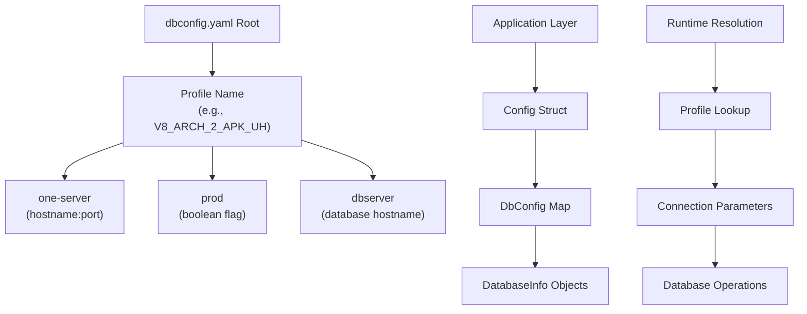
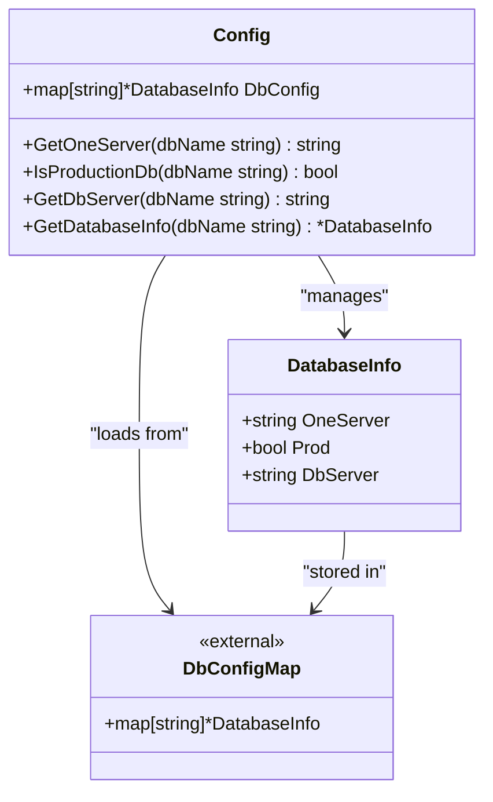
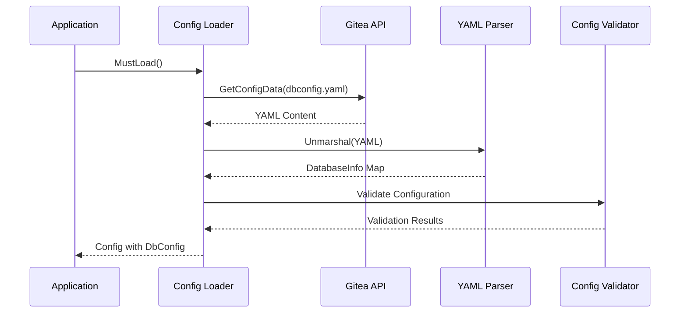
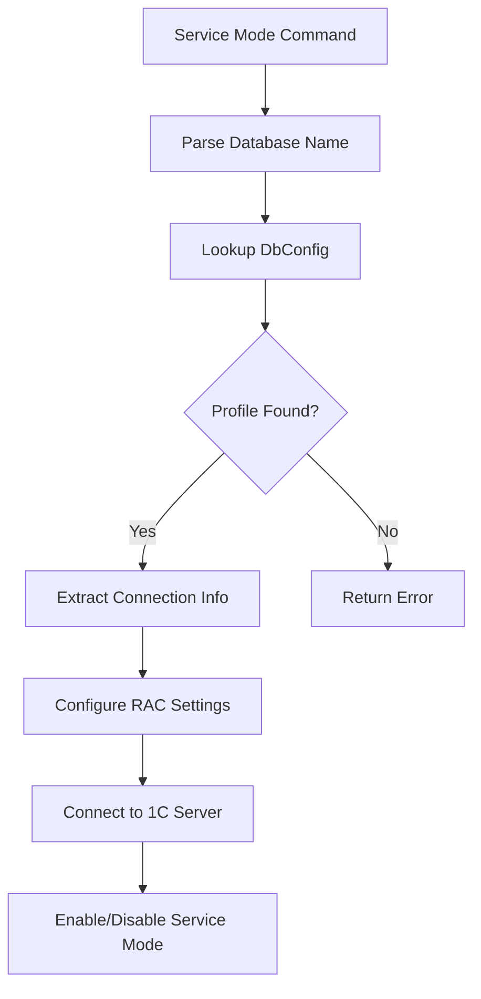
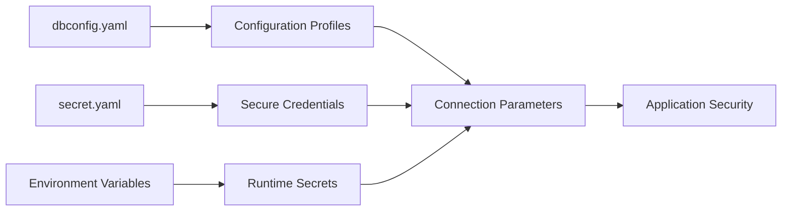
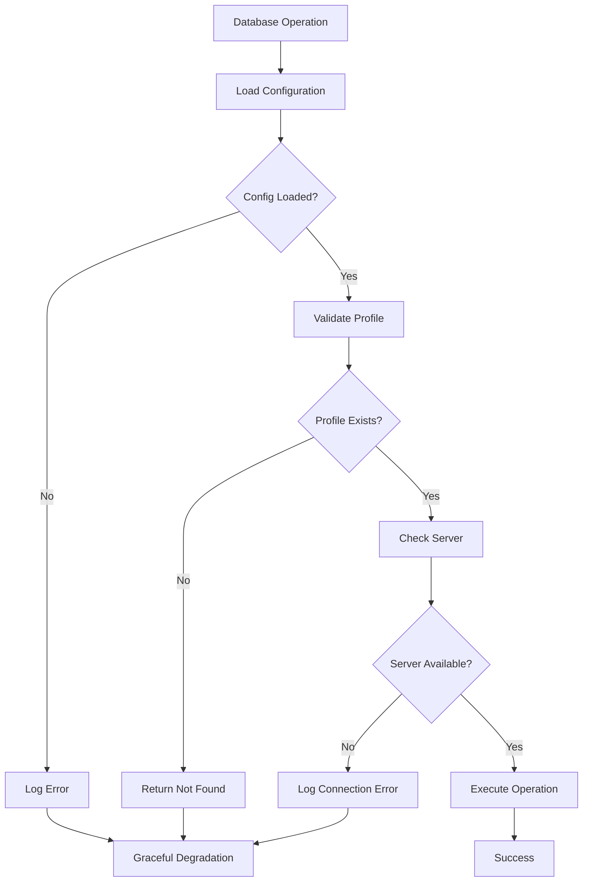
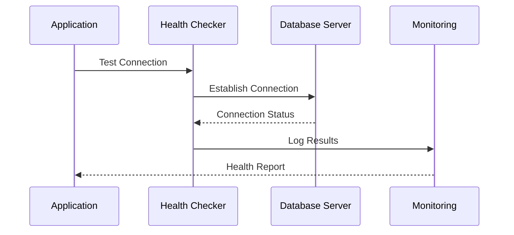

# dbconfig.yaml Configuration

<cite>
**Referenced Files in This Document**
- [dbconfig.yaml](file://config/dbconfig.yaml)
- [config.go](file://internal/config/config.go)
- [dbrestore.go](file://internal/entity/dbrestore/dbrestore.go)
- [main.go](file://cmd/benadis-runner/main.go)
- [app.go](file://internal/app/app.go)
</cite>

## Table of Contents
1. [Introduction](#introduction)
2. [Configuration Structure](#configuration-structure)
3. [DatabaseInfo Struct Mapping](#databaseinfo-struct-mapping)
4. [Configuration Loading Process](#configuration-loading-process)
5. [Database Profile Examples](#database-profile-examples)
6. [Integration with Commands](#integration-with-commands)
7. [Security Considerations](#security-considerations)
8. [Validation and Error Handling](#validation-and-error-handling)
9. [Environment-Specific Overrides](#environment-specific-overrides)
10. [Testing Connectivity](#testing-connectivity)
11. [Best Practices](#best-practices)

## Introduction

The `dbconfig.yaml` file serves as the central configuration hub for managing multiple database connection profiles in the benadis-runner application. This YAML-based configuration file defines database connections for various 1C:Enterprise environments, including both development and production systems. The configuration enables automated database operations, service mode management, and seamless integration with CI/CD pipelines through GitHub Actions.

The dbconfig.yaml file organizes database configurations into named profiles, each containing essential connection parameters including server addresses, database names, and operational flags. These profiles support both local and remote MSSQL instances commonly used in 1C:Enterprise deployments.

## Configuration Structure

The dbconfig.yaml follows a hierarchical structure where each top-level key represents a unique database profile identifier. Each profile contains three primary configuration parameters:



**Diagram sources**
- [config.go](file://internal/config/config.go#L91-L98)
- [dbconfig.yaml](file://config/dbconfig.yaml#L1-L50)

Each database profile consists of three mandatory fields:

- **one-server**: Specifies the 1C Enterprise server address and port
- **prod**: Boolean flag indicating whether this is a production database
- **dbserver**: Hostname of the underlying MS SQL Server

**Section sources**
- [config.go](file://internal/config/config.go#L91-L98)
- [dbconfig.yaml](file://config/dbconfig.yaml#L1-L100)

## DatabaseInfo Struct Mapping

The DatabaseInfo struct in Go code directly corresponds to the YAML structure defined in dbconfig.yaml:



**Diagram sources**
- [config.go](file://internal/config/config.go#L91-L98)
- [config.go](file://internal/config/config.go#L100-L150)

The struct definition ensures type safety and provides methods for runtime database resolution:

```go
type DatabaseInfo struct {
    OneServer string `yaml:"one-server"`
    Prod      bool   `yaml:"prod"`
    DbServer  string `yaml:"dbserver"`
}
```

**Section sources**
- [config.go](file://internal/config/config.go#L91-L98)

## Configuration Loading Process

The configuration loading process follows a structured approach that integrates with the broader application configuration system:



**Diagram sources**
- [config.go](file://internal/config/config.go#L880-L890)
- [config.go](file://internal/config/config.go#L900-L910)

The loadDbConfig function handles the actual loading process:

```go
func loadDbConfig(l *slog.Logger, cfg *Config) (map[string]*DatabaseInfo, error) {
    giteaAPI := CreateGiteaAPI(cfg)
    data, err := giteaAPI.GetConfigData(l, cfg.ConfigDbData)
    if err != nil {
        return nil, fmt.Errorf("ошибка получения данных %s: %w", cfg.ConfigDbData, err)
    }

    var dbConfig map[string]*DatabaseInfo
    if err = yaml.Unmarshal(data, &dbConfig); err != nil {
        return nil, fmt.Errorf("ошибка парсинга %s: %w", cfg.ConfigDbData, err)
    }

    return dbConfig, nil
}
```

**Section sources**
- [config.go](file://internal/config/config.go#L880-L890)

## Database Profile Examples

### Local Development Environment

```yaml
V8_DEMO_APK_EDO:
    one-server: DEMO-16-AS-001
    prod: false
    dbserver: DEMO-16-DB-001
```

### Production Environment

```yaml
V8_ARCH_APK_MOSCOW:
    one-server: MSK-AS-ARCH-001
    prod: true
    dbserver: MSK-SQL-ARCH-01
```

### Remote Testing Environment

```yaml
TEST_DNAVOLOTSKY_SURV:
    one-server: MSK-TS-AS-001
    prod: false
    dbserver: DEV-RZHAVKI-DB1
```

### Complex Production Setup

```yaml
V8_ARCH_PR_APKKURSK_BUH_2011_2021:
    one-server: MSK-AS-ARCH-001
    prod: true
    dbserver: MSK-SQL-ARCH-01
```

**Section sources**
- [dbconfig.yaml](file://config/dbconfig.yaml#L1-L100)

## Integration with Commands

The dbconfig.yaml integrates seamlessly with various benadis-runner commands, particularly those involving database operations:

### Service Mode Operations



**Diagram sources**
- [app.go](file://internal/app/app.go#L150-L200)
- [config.go](file://internal/config/config.go#L100-L150)

### Database Restore Operations

The dbrestore functionality utilizes dbconfig.yaml for determining source and destination servers:

```go
func (cfg *Config) DetermineSrcAndDstServers(dbName string) (srcServer, dstServer, srcDB, dstDB string, err error) {
    // Find related database
    relatedDB, err := cfg.FindRelatedDatabase(dbName)
    if err != nil {
        return "", "", "", "", fmt.Errorf("failed to find related database: %w", err)
    }

    // Determine production vs test databases
    var prodDB, testDB string
    if cfg.IsProductionDb(dbName) {
        prodDB = dbName
        testDB = relatedDB
    } else {
        prodDB = relatedDB
        testDB = dbName
    }

    // Get servers for both databases
    prodServer, err := cfg.GetDatabaseServer(prodDB)
    if err != nil {
        return "", "", "", "", fmt.Errorf("failed to get server for production database %s: %w", prodDB, err)
    }

    testServer, err := cfg.GetDatabaseServer(testDB)
    if err != nil {
        return "", "", "", "", fmt.Errorf("failed to get server for test database %s: %w", testDB, err)
    }

    return prodServer, testServer, prodDB, testDB, nil
}
```

**Section sources**
- [config.go](file://internal/config/config.go#L1358-L1390)
- [dbrestore.go](file://internal/entity/dbrestore/dbrestore.go#L200-L250)

## Security Considerations

### Credential Storage

While dbconfig.yaml itself does not store sensitive credentials, it integrates with the secret.yaml configuration for secure credential management:



**Diagram sources**
- [config.go](file://internal/config/config.go#L50-L70)

### Validation Rules

The application enforces several validation rules for database configurations:

1. **Profile Name Validation**: Profile names must be unique and follow naming conventions
2. **Server Address Format**: one-server field must contain valid hostname:port format
3. **Boolean Flags**: prod field must be either true or false
4. **Server Existence**: dbserver field must reference existing database servers

### Access Control

The configuration system implements role-based access control:

- **Development Profiles**: Marked with prod: false for non-production environments
- **Production Profiles**: Marked with prod: true for production environments
- **Access Restrictions**: Different access levels based on profile type

**Section sources**
- [config.go](file://internal/config/config.go#L100-L150)

## Validation and Error Handling

### Configuration Validation

The application performs comprehensive validation during startup:

```go
func validateRequiredParams(inputParams *InputParams, l *slog.Logger) error {
    var missingParams []string

    // Check required parameters
    if inputParams.GHAActor == "" {
        missingParams = append(missingParams, "ACTOR")
    }
    if inputParams.GHAGiteaURL == "" {
        missingParams = append(missingParams, "GITEAURL")
    }
    if inputParams.GHARepository == "" {
        missingParams = append(missingParams, "REPOSITORY")
    }
    if inputParams.GHAAccessToken == "" {
        missingParams = append(missingParams, "ACCESSTOKEN")
    }
    if inputParams.GHACommand == "" {
        missingParams = append(missingParams, "COMMAND")
    }

    if len(missingParams) > 0 {
        missingParamsStr := strings.Join(missingParams, ", ")
        errorMsg := fmt.Sprintf("Отсутствуют обязательные параметры конфигурации: %s", missingParamsStr)
        l.Error(errorMsg)
        return errors.New(errorMsg)
    }

    return nil
}
```

### Error Handling Patterns

The application implements robust error handling for database configuration issues:



**Diagram sources**
- [config.go](file://internal/config/config.go#L700-L750)

**Section sources**
- [config.go](file://internal/config/config.go#L700-L750)

## Environment-Specific Overrides

### Variable Precedence

The configuration system supports environment-specific overrides through a precedence hierarchy:

1. **Command Line Arguments**: Highest priority
2. **Environment Variables**: Medium priority  
3. **Configuration Files**: Lowest priority

### Runtime Configuration Updates

The application supports dynamic configuration reloading:

```go
func (cfg *Config) ReloadConfig() error {
    // Reload application configuration
    appConfig, err := loadAppConfig(cfg.Logger, cfg)
    if err != nil {
        return fmt.Errorf("failed to reload app config: %w", err)
    }
    cfg.AppConfig = appConfig

    // Reload database configuration
    dbConfig, err := loadDbConfig(cfg.Logger, cfg)
    if err != nil {
        cfg.Logger.Warn("ошибка перезагрузки конфигурации БД", slog.String("error", err.Error()))
    } else {
        cfg.DbConfig = dbConfig
    }

    return nil
}
```

**Section sources**
- [config.go](file://internal/config/config.go#L1200-L1250)

## Testing Connectivity

### Connection Validation

The application provides built-in connectivity testing capabilities:

```go
func (dbR *DBRestore) Connect(ctx context.Context) error {
    connString := fmt.Sprintf("server=%s;user id=%s;password=%s;port=%d;database=%s;encrypt=disable",
        dbR.Server, dbR.User, dbR.Password, dbR.Port, dbR.Database)

    db, err := sql.Open("sqlserver", connString)
    if err != nil {
        return fmt.Errorf("ошибка подключения: %w", err)
    }
    dbR.Db = db

    // Test connection
    if err := dbR.Db.PingContext(ctx); err != nil {
        return fmt.Errorf("ping ошибка: %w", err)
    }

    return nil
}
```

### Health Check Implementation



**Diagram sources**
- [dbrestore.go](file://internal/entity/dbrestore/dbrestore.go#L400-L450)

**Section sources**
- [dbrestore.go](file://internal/entity/dbrestore/dbrestore.go#L400-L450)

## Best Practices

### Configuration Management

1. **Version Control**: Store dbconfig.yaml in version control systems
2. **Environment Separation**: Use different configurations for development, staging, and production
3. **Documentation**: Maintain clear documentation for each database profile
4. **Regular Audits**: Periodically review and audit database configurations

### Operational Guidelines

1. **Profile Naming Conventions**: Use consistent naming patterns (e.g., V8_ARCH_, TEST_, DEMO_)
2. **Server Assignment**: Assign appropriate servers based on environment needs
3. **Production Flags**: Accurately mark production versus non-production databases
4. **Regular Maintenance**: Update configurations regularly to reflect infrastructure changes

### Security Recommendations

1. **Credential Rotation**: Regularly rotate database credentials
2. **Access Logging**: Enable logging for database access attempts
3. **Network Security**: Implement network-level security controls
4. **Monitoring**: Monitor database access patterns for anomalies

### Performance Optimization

1. **Connection Pooling**: Configure appropriate connection pool sizes
2. **Timeout Settings**: Set reasonable timeout values for database operations
3. **Resource Monitoring**: Monitor database resource utilization
4. **Batch Operations**: Optimize batch operations for large datasets

The dbconfig.yaml configuration system provides a robust foundation for managing database connections in the benadis-runner application. By following these guidelines and leveraging the built-in validation and error handling mechanisms, organizations can ensure reliable and secure database operations across their 1C:Enterprise environments.