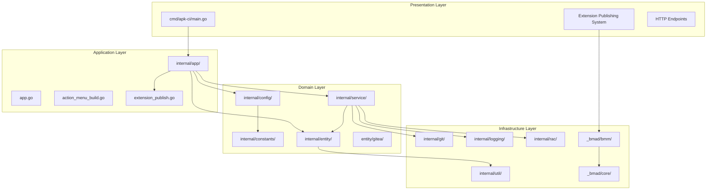
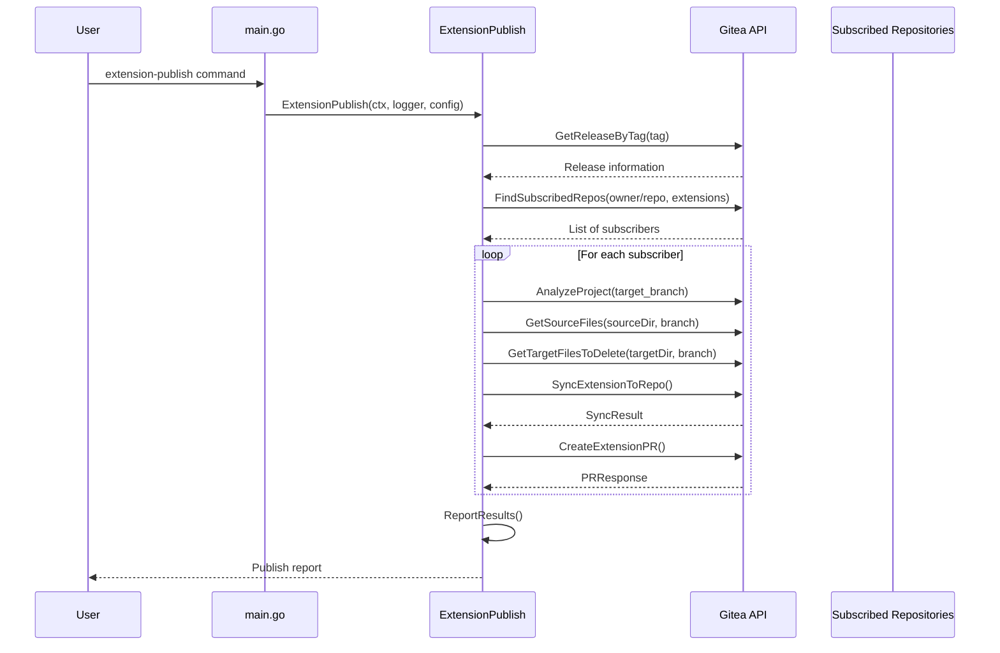
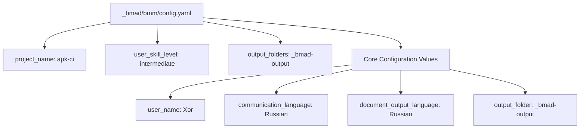
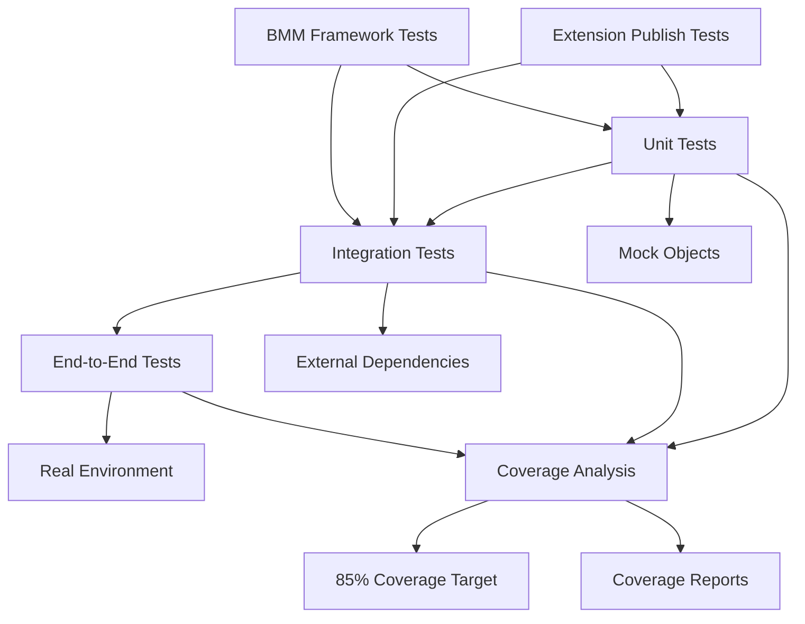
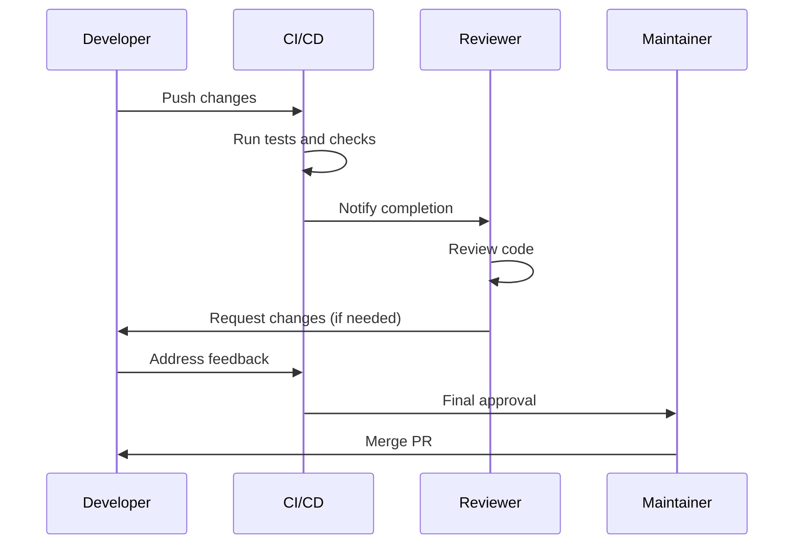

# Development Guide

<cite>
**Referenced Files in This Document**
- [main.go](file://cmd/apk-ci/main.go)
- [extension_publish.go](file://internal/app/extension_publish.go)
- [extension_publish_test.go](file://internal/app/extension_publish_test.go)
- [extension_publish_integration_test.go](file://internal/app/extension_publish_integration_test.go)
- [constants.go](file://internal/constants/constants.go)
- [config.yaml](file://_bmad/core/config.yaml)
- [_bmad/bmm/config.yaml](file://_bmad/bmm/config.yaml)
- [error_handling.go](file://internal/service/sonarqube/error_handling.go)
- [error_handling_test.go](file://internal/service/sonarqube/error_handling_test.go)
- [config.go](file://internal/config/config.go)
- [sonarqube.go](file://internal/config/sonarqube.go)
- [main_test.go](file://cmd/apk-ci/main_test.go)
</cite>

## Update Summary
- Added comprehensive documentation for the new Extension Publishing System with BMM framework integration
- Documented the new extension-publish command and its complete workflow
- Added BMM (Business Model Canvas) framework documentation with configuration examples
- Updated architecture diagrams to reflect the new Extension Publishing System
- Enhanced testing strategy documentation with integration test examples
- Added new sections covering Extension Publishing System, BMM Framework, and Extension Publishing Workflow

## Table of Contents
1. [Introduction](#introduction)
2. [Project Architecture](#project-architecture)
3. [Codebase Structure](#codebase-structure)
4. [Extension Publishing System](#extension-publishing-system)
5. [BMM Framework Integration](#bmm-framework-integration)
6. [Adding New Commands](#adding-new-commands)
7. [Testing Strategy](#testing-strategy)
8. [Build and Release Process](#build-and-release-process)
9. [Coding Standards](#coding-standards)
10. [Debugging and Profiling](#debugging-and-profiling)
11. [Contribution Workflow](#contribution-workflow)
12. [Best Practices](#best-practices)
13. [Context Support](#context-support)
14. [Error Handling Patterns](#error-handling-patterns)
15. [Configuration Management](#configuration-management)

## Introduction

apk-ci is a comprehensive automation tool for 1C:Enterprise systems that provides modular functionality for database operations, configuration conversion, service mode management, and integration with development tools. The project now includes a sophisticated Extension Publishing System with BMM (Business Model Canvas) framework integration, enabling automated distribution of 1C extensions across multiple subscribed repositories.

The development guide covers the essential aspects of contributing to the project, including understanding the codebase architecture, implementing new features, maintaining test coverage, and following established coding standards. The new Extension Publishing System adds significant capabilities for managing 1C extension distribution across organizational repositories.

## Project Architecture

apk-ci follows a modular architecture with distinct layers that separate concerns and promote maintainability. The architecture now includes enhanced support for the Extension Publishing System and BMM framework integration.



**Diagram sources**
- [cmd/apk-ci/main.go](file://cmd/apk-ci/main.go#L1-L262)
- [internal/app/extension_publish.go](file://internal/app/extension_publish.go#L1-L1253)
- [internal/app/app.go](file://internal/app/app.go#L1-L1307)
- [internal/config/config.go](file://internal/config/config.go#L1-L800)

### Architectural Principles

1. **Separation of Concerns**: Each package has a specific responsibility
2. **Dependency Inversion**: Higher-level modules depend on abstractions
3. **Single Responsibility**: Each component has one primary function
4. **Clean Interfaces**: Well-defined contracts between modules
5. **Extension System**: Modular extension publishing capabilities
6. **BMM Integration**: Business model canvas framework integration

**Section sources**
- [cmd/apk-ci/main.go](file://cmd/apk-ci/main.go#L1-L262)
- [internal/app/extension_publish.go](file://internal/app/extension_publish.go#L1-L1253)
- [internal/app/app.go](file://internal/app/app.go#L1-L1307)

## Codebase Structure

The project is organized into several key directories, each serving a specific purpose. The structure now includes dedicated directories for the Extension Publishing System and BMM framework.

### Directory Structure

```mermaid
graph TD
ROOT[apk-ci/] --> CMD[cmd/apk-ci/]
ROOT --> CONFIG[config/]
ROOT --> INTERNAL[internal/]
ROOT --> SCRIPTS[scripts/]
ROOT --> OLD[old/]
ROOT --> PROMTS[promts/]
ROOT --> BMA_CONFIG[_bmad/_config/]
ROOT --> BMA_BMM[_bmad/bmm/]
ROOT --> BMA_CORE[_bmad/core/]
INTERNAL --> APP[app/]
INTERNAL --> CONFIG_PKG[config/]
INTERNAL --> CONSTANTS[constants/]
INTERNAL --> ENTITY[entity/]
INTERNAL --> SERVICE[service/]
INTERNAL --> GIT[git/]
INTERNAL --> LOGGING[logging/]
INTERNAL --> RAC[rac/]
INTERNAL --> UTIL[util/]
ENTITY --> DBRESTORE[dbrestore/]
ENTITY --> FILER[filer/]
ENTITY --> GITEA[gitea/]
ENTITY --> SONARQUBE[sonarqube/]
ENTITY --> ONE[one/]
SERVICE --> SONARQUBE_SERVICE[sonarqube/]
SERVICE --> CONFIG_ANALYZER[config_analyzer.go]
SERVICE --> GITEA_SERVICE[gitea_service.go]
APP --> EXTENSION_PUBLISH[extension_publish.go]
BMA_CONFIG --> AGENTS[agents/]
BMA_CONFIG --> IDES[ides/]
BMA_CONFIG --> MANIFESTS[manifest.yaml]
BMA_BMM --> AGENTS[agents/]
BMA_BMM --> DATA[data/]
BMA_BMM --> TEAMS[teams/]
BMA_BMM --> WORKFLOWS[workflows/]
BMA_CORE --> AGENTS[agents/]
BMA_CORE --> RESOURCES[resources/]
BMA_CORE --> TASKS[tasks/]
BMA_CORE --> WORKFLOWS[workflows/]
```



**Diagram sources**
- [internal/app/extension_publish.go](file://internal/app/extension_publish.go#L1-L1253)
- [internal/app/app.go](file://internal/app/app.go#L1-L1307)
- [internal/config/config.go](file://internal/config/config.go#L1-L800)

### Package Descriptions

- **cmd/apk-ci/**: Entry point and command-line interface with extension-publish command support
- **internal/app/**: Core business logic including the new Extension Publishing System
- **internal/config/**: Configuration management and loading
- **internal/constants/**: Application constants including new extension-publish action
- **internal/entity/**: Domain entities and data structures including Gitea integration
- **internal/service/**: Business logic services and integrations
- **internal/git/**: Git operations and repository management
- **internal/logging/**: Logging infrastructure and adapters
- **internal/rac/**: Remote Administration Console operations
- **internal/util/**: Utility functions and helpers
- **_bmad/**: BMM (Business Model Canvas) framework with configuration and workflows
- **_bmad/bmm/**: BMM methodology implementation with agents, workflows, and templates
- **_bmad/core/**: Core BMM configuration and resources

**Section sources**
- [internal/app/extension_publish.go](file://internal/app/extension_publish.go#L1-L1253)
- [internal/app/app.go](file://internal/app/app.go#L1-L1307)
- [internal/config/config.go](file://internal/config/config.go#L1-L800)

## Extension Publishing System

The Extension Publishing System is a comprehensive framework for automating the distribution of 1C extensions across multiple subscribed repositories. It leverages Gitea's subscription mechanism to manage extension updates efficiently.

### Extension Publishing Workflow



**Diagram sources**
- [cmd/apk-ci/main.go](file://cmd/apk-ci/main.go#L244-L253)
- [internal/app/extension_publish.go](file://internal/app/extension_publish.go#L998-L1252)

### Key Components

#### Subscription Management
The system uses Gitea's subscription mechanism where subscribers create special branches in the source repository to indicate interest in receiving updates.

```go
// Subscription branch format: {Org}_{Repo}_{ExtDir}
// Example: "APKHolding_ERP_cfe_CommonExt"
// This indicates: Organization=APKHolding, Repository=ERP, Directory=cfe/CommonExt
```

#### Extension Publication Process
The Extension Publishing System performs the following steps:

1. **Release Detection**: Identifies the release tag from GitHub/Gitea
2. **Subscriber Discovery**: Finds all repositories subscribed to receive updates
3. **File Synchronization**: Synchronizes extension files between source and target repositories
4. **Pull Request Creation**: Creates automated pull requests for review
5. **Reporting**: Generates comprehensive reports on publication results

#### Configuration Requirements

| Environment Variable | Description | Required | Default |
|---------------------|-------------|----------|---------|
| `GITHUB_REPOSITORY` | Source repository (owner/repo) | Yes | - |
| `GITHUB_REF_NAME` | Release tag (e.g., v1.2.3) | Yes | main |
| `BR_EXT_DIR` | Extension directory path | No | Root of repository |
| `BR_DRY_RUN` | Enable dry-run mode | No | false |
| `BR_OUTPUT_JSON` | Output JSON format | No | false |

**Section sources**
- [internal/app/extension_publish.go](file://internal/app/extension_publish.go#L1-L1253)
- [cmd/apk-ci/main.go](file://cmd/apk-ci/main.go#L244-L253)
- [internal/constants/constants.go](file://internal/constants/constants.go#L100-L101)

## BMM Framework Integration

The BMM (Business Model Canvas) framework provides a comprehensive methodology for business modeling and project planning. The integration includes configuration management, agent definitions, and workflow templates.

### BMM Configuration Structure



**Diagram sources**
- [_bmad/bmm/config.yaml](file://_bmad/bmm/config.yaml#L1-L19)
- [_bmad/core/config.yaml](file://_bmad/core/config.yaml#L1-L10)

### BMM Components

#### Agents
The BMM framework defines specialized agents for different roles:

- **Analyst**: Business analysis and requirements gathering
- **Architect**: System architecture and design
- **Developer**: Implementation and development
- **Project Manager**: Project coordination and timeline management
- **Technical Writer**: Documentation and knowledge transfer
- **UX Designer**: User experience and interface design
- **QA Engineer**: Quality assurance and testing

#### Workflows
The framework includes comprehensive workflows for different phases:

1. **Analysis Phase**: Market research, competitive analysis, domain analysis
2. **Planning Phase**: Product requirements, UX design, PRD creation
3. **Solutioning Phase**: Architecture design, implementation planning
4. **Implementation Phase**: Development, testing, code review
5. **Documentation Phase**: Project documentation, knowledge transfer

#### Data Management
The BMM framework includes standardized templates and documentation standards:

- **Project Context Templates**: Standardized project context documentation
- **Documentation Standards**: Consistent documentation formats
- **Knowledge Management**: Organized knowledge sharing templates

**Section sources**
- [_bmad/bmm/config.yaml](file://_bmad/bmm/config.yaml#L1-L19)
- [_bmad/core/config.yaml](file://_bmad/core/config.yaml#L1-L10)
- [internal/app/extension_publish.go](file://internal/app/extension_publish.go#L1-L1253)

## Adding New Commands

Adding new commands to apk-ci involves several steps to ensure proper integration with the existing architecture and Extension Publishing System:

### Step 1: Define Command Constants

Add the new command constant to `internal/constants/constants.go`:

```go
// Add to the command constants section
const (
    // Existing commands...
    ActNewCommand = "new-command"
    ActExtensionPublish = "extension-publish"
)
```

### Step 2: Register Command in main.go

Extend the switch statement in `cmd/apk-ci/main.go`:

```go
switch cfg.Command {
case constants.ActNewCommand:
    err = app.NewCommand(&ctx, l, cfg)
    if err != nil {
        l.Error("Error executing new command",
            slog.String("error", err.Error()),
            slog.String(constants.MsgErrProcessing, constants.MsgAppExit),
        )
        os.Exit(8)
    }
    l.Info("New command executed successfully")
case constants.ActExtensionPublish:
    err = app.ExtensionPublish(&ctx, l, cfg)
    if err != nil {
        l.Error("Error executing extension publish",
            slog.String("error", err.Error()),
            slog.String(constants.MsgErrProcessing, constants.MsgAppExit),
        )
        os.Exit(8)
    }
    l.Info("Extension publish executed successfully")
default:
    // Handle unknown commands
}
```

### Step 3: Implement Business Logic

Create the implementation in `internal/app/app.go` or dedicated file:

```go
// NewCommand implements the business logic for the new command
func NewCommand(ctx *context.Context, l *slog.Logger, cfg *config.Config) error {
    // Implementation here
    l.Info("Executing new command")
    
    // Business logic...
    
    return nil
}
```

### Step 4: Create Configuration Support

Extend the configuration structure in `internal/config/config.go`:

```go
// Add to Config struct
type Config struct {
    // Existing fields...
    NewCommandParam string `env:"NEW_COMMAND_PARAM" env-default:""`
    ExtensionPublishConfig *ExtensionPublishConfig `env-prefix:"EP_"` // For extension publish specific config
}
```

### Step 5: Write Unit Tests

Create comprehensive tests in the corresponding `_test.go` file:

```go
func TestNewCommand(t *testing.T) {
    t.Run("successful_execution", func(t *testing.T) {
        // Test implementation
    })
    
    t.Run("error_handling", func(t *testing.T) {
        // Error case tests
    })
}
```

### Step 6: Integration Testing

For Extension Publishing System, implement integration tests:

```go
func TestIntegration_ExtensionPublish_RealGitea(t *testing.T) {
    // Integration test implementation
    // Requires GITEA_URL, GITEA_TOKEN, GITHUB_REPOSITORY, GITHUB_REF_NAME
}
```

**Section sources**
- [cmd/apk-ci/main.go](file://cmd/apk-ci/main.go#L244-L253)
- [internal/app/extension_publish.go](file://internal/app/extension_publish.go#L998-L1252)
- [internal/constants/constants.go](file://internal/constants/constants.go#L100-L101)

## Testing Strategy

apk-ci employs a comprehensive testing strategy with multiple layers of test coverage, including extensive testing for the new Extension Publishing System and BMM framework integration.

### Testing Architecture



**Diagram sources**
- [internal/app/extension_publish_test.go](file://internal/app/extension_publish_test.go#L1-L2633)
- [internal/app/extension_publish_integration_test.go](file://internal/app/extension_publish_integration_test.go#L1-L297)

### Test Types and Coverage

1. **Unit Tests**: Isolated testing of individual functions and methods
2. **Integration Tests**: Testing component interactions with external dependencies
3. **End-to-End Tests**: Complete workflow testing with real environments
4. **Mock Tests**: Testing with simulated external dependencies
5. **Extension Publish Tests**: Comprehensive testing for the new Extension Publishing System
6. **BMM Framework Tests**: Testing BMM configuration and workflow execution

### Coverage Goals

- **Overall Project**: Minimum 85% code coverage
- **Critical Modules**: 90%+ coverage for core functionality
- **Business Logic**: 100% branch coverage where applicable
- **Extension Publishing System**: 95%+ coverage for new functionality
- **BMM Framework**: 85%+ coverage for configuration and workflows

### Writing Effective Tests

Follow these patterns observed in existing test files:

```go
// Table-driven tests for multiple scenarios
func TestExample(t *testing.T) {
    tests := []struct {
        name     string
        input    string
        expected string
    }{
        {"valid_input", "test", "expected"},
        {"edge_case", "", ""},
    }
    
    for _, tt := range tests {
        t.Run(tt.name, func(t *testing.T) {
            result := functionUnderTest(tt.input)
            assert.Equal(t, tt.expected, result)
        })
    }
}
```

### Extension Publishing System Testing

The Extension Publishing System includes comprehensive testing strategies:

#### Unit Testing
- Subscription branch parsing validation
- File synchronization operations
- Pull request creation workflows
- Error handling scenarios

#### Integration Testing
- Real Gitea server interaction
- Multi-repository synchronization
- Release detection and processing
- Automated pull request creation

#### Mock Implementation Pattern

```go
// Mock interfaces for external dependencies
type MockGiteaAPI struct {
    // Fields for tracking calls
    Calls []string
    Releases map[string]*gitea.Release
}

func (m *MockGiteaAPI) GetReleaseByTag(tag string) (*gitea.Release, error) {
    if release, exists := m.Releases[tag]; exists {
        return release, nil
    }
    return nil, fmt.Errorf("release not found")
}
```

**Section sources**
- [internal/app/extension_publish_test.go](file://internal/app/extension_publish_test.go#L1-L2633)
- [internal/app/extension_publish_integration_test.go](file://internal/app/extension_publish_integration_test.go#L1-L297)

## Build and Release Process

apk-ci uses a dual build system with both Makefile and Taskfile.yml for flexibility, with enhanced support for the new Extension Publishing System and BMM framework.

### Makefile Features

The Makefile provides comprehensive build automation:

```makefile
# Primary targets
build: # Compile the application
test: # Run all tests
test-coverage: # Generate coverage reports
lint: # Run static analysis
fmt: # Format code
clean: # Clean build artifacts

# Platform-specific builds
build-linux: # Linux binaries
build-windows: # Windows executables
build-darwin: # macOS binaries

# Extension publishing targets
build-extension-publish: # Build with extension publish support
test-extension-publish: # Test extension publishing functionality
```

### Taskfile Features

Taskfile.yml offers modern task orchestration:

```yaml
tasks:
  build:
    desc: "Build binary for production"
    cmds:
      - go build -o bin/apk-ci ./cmd/apk-ci
  
  debug:
    desc: "Build debug binary with debug info"
    cmds:
      - go build -gcflags="-N -l" -o bin/apk-ci ./cmd/apk-ci
  
  test-extension-publish:
    desc: "Run extension publish tests"
    cmds:
      - go test -tags=integration ./internal/app/... -run TestIntegration_ExtensionPublish
```

### Release Process

1. **Code Quality Checks**: `make check` (fmt, vet, lint, test)
2. **Platform Builds**: `make build-all` or Taskfile equivalent
3. **Documentation Generation**: `make docs`
4. **Version Management**: Automatic version embedding
5. **Extension Publish Testing**: `make test-extension-publish`
6. **BMM Framework Validation**: Validate BMM configuration and workflows

### Continuous Integration

The project integrates with CI/CD pipelines for automated testing and deployment:

```yaml
# Example CI configuration
name: Tests
on: [push, pull_request]
jobs:
  test:
    runs-on: ubuntu-latest
    steps:
      - uses: actions/checkout@v3
      - uses: actions/setup-go@v3
      - run: go test -v -race -coverprofile=coverage.out ./...
      - name: Test Extension Publish
        if: github.ref == 'refs/heads/main'
        run: go test -tags=integration ./internal/app/... -run TestIntegration_ExtensionPublish
```

**Section sources**
- [Makefile](file://Makefile#L1-L100)
- [Taskfile.yml](file://Taskfile.yml#L1-L100)

## Coding Standards

### Go Language Guidelines

1. **Naming Conventions**:
   - Use camelCase for variables and functions
   - Use PascalCase for exported types and methods
   - Use snake_case for constants

2. **Error Handling**:
   ```go
   // Proper error handling pattern
   result, err := expensiveOperation()
   if err != nil {
       return fmt.Errorf("failed to perform operation: %w", err)
   }
   ```

3. **Logging**:
   ```go
   // Use structured logging with slog
   l.Info("Operation completed successfully",
       "operation", "example",
       "duration", duration)
   ```

4. **Context Usage**:
   ```go
   // Use context for cancellation and timeouts
   ctx, cancel := context.WithTimeout(context.Background(), 30*time.Second)
   defer cancel()
   ```

### Code Organization

1. **Package Structure**: Follow the established directory layout
2. **Import Organization**: Group imports systematically
3. **Documentation**: Comment public APIs and complex logic
4. **Extension Publishing**: Follow new patterns for extension-related functionality

### File Naming Conventions

- Use descriptive names for files and functions
- `_test.go` suffix for test files
- `_additional_test.go` for supplementary test cases
- `_coverage_test.go` for coverage-specific tests
- `_integration_test.go` for integration test files

**Section sources**
- [internal/app/extension_publish.go](file://internal/app/extension_publish.go#L1-L1253)
- [internal/app/app.go](file://internal/app/app.go#L1-L1307)
- [internal/config/config.go](file://internal/config/config.go#L1-L800)

## Debugging and Profiling

### Development Tools Setup

The project includes comprehensive tool installation scripts:

```bash
# Install development tools
./scripts/install-dev-tools.sh

# Available tools:
# - Delve (dlv) - Go debugger
# - golangci-lint - Advanced linter
# - goimports - Import formatter
# - godoc - Documentation server
```

### Debugging with Taskfile

```yaml
tasks:
  debug:
    desc: "Run with debugger for VS Code"
    cmds:
      - dlv debug ./cmd/apk-ci \
        --headless --listen=127.0.0.1:2345 --api-version=2
```

### Performance Profiling

```bash
# CPU profiling
go test -cpuprofile=cpu.prof ./...

# Memory profiling
go test -memprofile=mem.prof ./...

# Generate profile visualization
go tool pprof cpu.prof
```

### Extension Publishing Debugging

For debugging the Extension Publishing System:

```bash
# Enable debug logging
export BR_LOG_LEVEL=Debug

# Enable dry-run mode for safe testing
export BR_DRY_RUN=true

# Enable JSON output for detailed reporting
export BR_OUTPUT_JSON=true

# Test extension publish functionality
go test -tags=integration ./internal/app/... -run TestIntegration_ExtensionPublish -v
```

### Common Debugging Scenarios

1. **Service Mode Issues**: Check RAC connectivity and timeouts
2. **Git Operations**: Verify repository access and credentials
3. **Configuration Problems**: Validate YAML parsing and environment variables
4. **External Dependencies**: Monitor network connectivity and API responses
5. **Extension Publishing Issues**: Debug subscription branch parsing and file synchronization
6. **BMM Framework Problems**: Validate configuration files and workflow execution

**Section sources**
- [scripts/install-dev-tools.sh](file://scripts/install-dev-tools.sh#L1-L100)
- [Taskfile.yml](file://Taskfile.yml#L50-L100)

## Contribution Workflow

### Development Process

1. **Fork and Clone**: Fork the repository and create local clone
2. **Feature Branch**: Create branch for new feature or fix
3. **Implementation**: Follow coding standards and write tests
4. **Testing**: Ensure all tests pass and coverage meets requirements
5. **Documentation**: Update relevant documentation
6. **Pull Request**: Submit PR with clear description

### Code Review Process



### Quality Gates

- **Code Coverage**: Minimum 85% achieved
- **Static Analysis**: No critical issues reported
- **Test Execution**: All tests passing
- **Code Review**: Approved by reviewer
- **Extension Publish Testing**: Integration tests passing
- **BMM Framework Validation**: Configuration files valid

**Section sources**
- [test_coverage_improvement_plan.md](file://test_coverage_improvement_plan.md#L100-L200)

## Best Practices

### Development Guidelines

1. **Modular Design**: Keep functionality focused and reusable
2. **Error Propagation**: Pass errors up the call stack appropriately
3. **Resource Management**: Always clean up resources (files, connections)
4. **Configuration Management**: Use centralized configuration system
5. **Extension Publishing**: Follow established patterns for extension distribution
6. **BMM Integration**: Leverage framework for business modeling and planning

### Testing Best Practices

1. **Test Coverage**: Aim for comprehensive coverage of business logic
2. **Edge Cases**: Test boundary conditions and error scenarios
3. **Mock External Dependencies**: Use mocks for unreliable external systems
4. **Continuous Testing**: Run tests frequently during development
5. **Extension Publish Testing**: Include integration tests for real Gitea environments
6. **BMM Framework Testing**: Validate configuration and workflow execution

### Performance Considerations

1. **Memory Management**: Avoid memory leaks in long-running operations
2. **Network Operations**: Implement timeouts and retries for external calls
3. **Concurrency**: Use goroutines appropriately for I/O-bound operations
4. **Profiling**: Regularly profile critical code paths
5. **Extension Publishing**: Optimize batch operations and API calls
6. **BMM Processing**: Efficient handling of large configuration files

### Security Considerations

1. **Environment Variables**: Never log sensitive configuration data
2. **File Permissions**: Set appropriate permissions for generated files
3. **Input Validation**: Validate all external inputs
4. **Access Control**: Implement proper authentication and authorization
5. **Extension Distribution**: Secure handling of extension files and metadata

### Maintenance and Monitoring

1. **Logging**: Implement comprehensive structured logging
2. **Metrics**: Track key performance indicators
3. **Health Checks**: Implement application health monitoring
4. **Documentation**: Keep documentation current with code changes
5. **Extension Publishing**: Monitor publication success rates and error patterns
6. **BMM Framework**: Track framework adoption and effectiveness

**Section sources**
- [internal/app/extension_publish.go](file://internal/app/extension_publish.go#L1-L1253)
- [internal/app/app.go](file://internal/app/app.go#L1-L1307)
- [internal/config/config.go](file://internal/config/config.go#L1-L800)

## Context Support

apk-ci implements comprehensive context support for managing request lifecycles, cancellation, and timeouts across the application, including the new Extension Publishing System.

### Context Creation and Management

The application creates a context at the entry point in `main.go` and propagates it through all function calls:

```go
func main() {
    ctx := context.Background()
    cfg, err := config.MustLoad()
    if err != nil || cfg == nil {
        fmt.Fprintf(os.Stderr, "Failed to load configuration: %v\n", err)
        os.Exit(5)
    }
    
    // Context is passed to all command handlers
    switch cfg.Command {
    case constants.ActConvert:
        err = app.Convert(&ctx, l, cfg)
        // ...
    case constants.ActExtensionPublish:
        err = app.ExtensionPublish(&ctx, l, cfg)
        // Extension publish also receives context
    }
}
```

### Context Testing

The application includes comprehensive tests for context handling:

```go
func TestMain_ContextAndSignalHandling(t *testing.T) {
    // Test context creation
    ctx := context.Background()
    if ctx == nil {
        t.Error("Failed to create context")
    }

    // Test context with cancel
    ctx, cancel := context.WithCancel(ctx)
    defer cancel()

    // Test that context responds to cancellation
    select {
    case <-ctx.Done():
        // Expected behavior after cancel
    default:
        // Expected behavior initially
    }
}
```

### Context Propagation

All functions that perform I/O operations accept a context parameter to enable cancellation and timeout handling:

```go
// In service/sonarqube/error_handling.go
func (e *ErrorHandlingService) ExecuteWithTimeout(ctx context.Context, timeout time.Duration, fn func() error) error {
    // Create a context with timeout
    timeoutCtx, cancel := context.WithTimeout(ctx, timeout)
    defer cancel()
    
    // Execute function with timeout context
    resultChan := make(chan error, 1)
    go func() {
        resultChan <- fn()
    }()
    
    // Wait for function completion or context cancellation
    select {
    case err := <-resultChan:
        return err
    case <-timeoutCtx.Done():
        return timeoutCtx.Err()
    }
}
```

**Section sources**
- [cmd/apk-ci/main.go](file://cmd/apk-ci/main.go#L18-L20)
- [main_test.go](file://cmd/apk-ci/main_test.go#L886-L924)
- [error_handling.go](file://internal/service/sonarqube/error_handling.go#L210-L232)

## Error Handling Patterns

apk-ci implements a comprehensive error handling system with multiple resilience patterns to ensure robust operation in production environments, including enhanced patterns for the Extension Publishing System.

### Error Handling Service

The `ErrorHandlingService` provides a unified interface for implementing various error handling patterns:

```go
// In internal/service/sonarqube/error_handling.go
type ErrorHandlingService struct {
    maxRetries       int
    retryDelay       time.Duration
    maxDelay         time.Duration
    failureThreshold int
    successThreshold int
    timeout          time.Duration
    currentState     CircuitBreakerState
    failureCount     int
    successCount     int
    lastFailureTime  time.Time
}
```

### Retry Mechanism with Exponential Backoff

The service implements exponential backoff retry mechanism:

```go
func (e *ErrorHandlingService) ExecuteWithRetry(ctx context.Context, fn func() error) error {
    // Check circuit breaker state
    if err := e.checkCircuitBreaker(); err != nil {
        return err
    }

    var lastErr error
    delay := e.retryDelay

    for i := 0; i <= e.maxRetries; i++ {
        err := fn()
        if err == nil {
            e.onSuccess()
            return nil
        }

        e.onFailure()
        lastErr = err

        if i == e.maxRetries {
            break
        }

        // Wait for the delay or context cancellation
        select {
        case <-ctx.Done():
            return ctx.Err()
        case <-time.After(delay):
            // Continue to next attempt
        }

        // Increase delay exponentially, but cap it at maxDelay
        delay *= 2
        if delay > e.maxDelay {
            delay = e.maxDelay
        }
    }

    return fmt.Errorf("operation failed after %d retries: %w", e.maxRetries+1, lastErr)
}
```

### Circuit Breaker Pattern

The implementation includes a circuit breaker pattern to prevent cascading failures:

```go
func (e *ErrorHandlingService) checkCircuitBreaker() error {
    switch e.currentState {
    case Open:
        // Check if timeout has passed
        if time.Since(e.lastFailureTime) >= e.timeout {
            // Move to HalfOpen state
            e.currentState = HalfOpen
            e.successCount = 0
            return nil
        }
        return &sonarqube.Error{
            Code:    503,
            Message: "Service unavailable due to circuit breaker",
            Details: "The circuit breaker is open, preventing further requests",
        }
    case HalfOpen:
        // In HalfOpen state, we allow limited requests
        return nil
    default:
        // Closed state, allow requests
        return nil
    }
}
```

### Error Type Checking

The service provides methods to check specific error types:

```go
func (e *ErrorHandlingService) IsSonarQubeError(err error) bool {
    _, ok := err.(*sonarqube.Error)
    return ok
}

func (e *ErrorHandlingService) IsScannerError(err error) bool {
    _, ok := err.(*sonarqube.ScannerError)
    return ok
}

func (e *ErrorHandlingService) IsValidationError(err error) bool {
    _, ok := err.(*sonarqube.ValidationError)
    return ok
}
```

### Error Wrapping

The service implements error wrapping for better context:

```go
func (e *ErrorHandlingService) WrapError(err error, context string) error {
    return fmt.Errorf("%s: %w", context, err)
}
```

### Timeout Handling

The service provides timeout functionality using context:

```go
func (e *ErrorHandlingService) ExecuteWithTimeout(ctx context.Context, timeout time.Duration, fn func() error) error {
    // Create a context with timeout
    timeoutCtx, cancel := context.WithTimeout(ctx, timeout)
    defer cancel()

    // Channel to receive the result of the function
    resultChan := make(chan error, 1)

    // Execute the function in a goroutine
    go func() {
        resultChan <- fn()
    }()

    // Wait for either the function to complete or the context to be cancelled
    select {
    case err := <-resultChan:
        // Function completed
        return err
    case <-timeoutCtx.Done():
        // Timeout or cancellation
        return timeoutCtx.Err()
    }
}
```

**Section sources**
- [error_handling.go](file://internal/service/sonarqube/error_handling.go#L1-L311)
- [error_handling_test.go](file://internal/service/sonarqube/error_handling_test.go#L1-L363)

## Configuration Management

apk-ci implements a robust configuration management system with multiple sources and validation, including enhanced support for the Extension Publishing System and BMM framework.

### Configuration Structure

The configuration system uses a hierarchical structure with multiple configuration files:

```go
// In internal/config/config.go
type Config struct {
    // System settings
    Actor   string `env:"BR_ACTOR" env-default:""`
    Env     string `env:"BR_ENV" env-default:""`
    Command string `env:"BR_COMMAND" env-default:""`
    Logger  *slog.Logger

    // Configuration files
    ConfigSystem    string `env:"BR_CONFIG_SYSTEM" env-default:""`
    ConfigProject   string `env:"BR_CONFIG_PROJECT" env-default:""`
    ConfigSecret    string `env:"BR_CONFIG_SECRET" env-default:""`
    ConfigDbData    string `env:"BR_CONFIG_DBDATA" env-default:""`

    // Application configuration (from app.yaml)
    AppConfig *AppConfig

    // Project configuration (from project.yaml)
    ProjectConfig *ProjectConfig

    // Secrets (from secret.yaml)
    SecretConfig *SecretConfig

    // Database configuration (from dbconfig.yaml)
    DbConfig map[string]*DatabaseInfo

    // SonarQube configuration
    SonarQubeConfig *SonarQubeConfig

    // Scanner configuration
    ScannerConfig *ScannerConfig

    // Git configuration
    GitConfig *GitConfig

    // Logging configuration
    LoggingConfig *LoggingConfig

    // RAC configuration
    RacConfig *RacConfig

    // Extension Publishing configuration
    ExtensionPublishConfig *ExtensionPublishConfig

    // BMM Framework configuration
    BMMConfig *BMMConfig
}
```

### Extension Publishing Configuration

The Extension Publishing System includes specialized configuration:

```go
// Extension Publishing specific configuration
type ExtensionPublishConfig struct {
    ReleaseTag string `env:"GITHUB_REF_NAME" env-default:"main"`
    Extensions []string `env:"BR_EXT_DIR" env-default:""`
    DryRun bool `env:"BR_DRY_RUN" env-default:"false"`
    OutputJSON bool `env:"BR_OUTPUT_JSON" env-default:"false"`
    GiteaURL string `env:"GITEA_URL"`
    AccessToken string `env:"GITEA_TOKEN"`
}

// BMM Framework configuration
type BMMConfig struct {
    ProjectName string `env:"BMM_PROJECT_NAME" env-default:"apk-ci"`
    SkillLevel string `env:"BMM_USER_SKILL_LEVEL" env-default:"intermediate"`
    OutputFolder string `env:"BMM_OUTPUT_FOLDER"`
    CommunicationLanguage string `env:"BMM_COMMUNICATION_LANGUAGE" env-default:"Russian"`
    DocumentOutputLanguage string `env:"BMM_DOCUMENT_OUTPUT_LANGUAGE" env-default:"Russian"`
}
```

### Configuration Loading Priority

The configuration system follows a specific priority order:

1. **Environment Variables**: Highest priority
2. **Configuration Files**: Medium priority
3. **Default Values**: Lowest priority

```go
// In internal/config/config.go
func MustLoad() (*Config, error) {
    // Load from environment variables (highest priority)
    if err := cleanenv.ReadEnv(config); err != nil {
        l.Warn("Error loading config from environment variables",
            slog.String("error", err.Error()),
        )
    }
    
    // Load from configuration files (medium priority)
    if cfg.AppConfig != nil {
        // Copy values from AppConfig
    }
    
    // Use default values (lowest priority)
    if cfg.AppConfig == nil {
        cfg.AppConfig = getDefaultAppConfig()
    }
}
```

### Configuration Validation

The system includes comprehensive validation for configuration values:

```go
// In internal/config/sonarqube.go
func (s *SonarQubeConfig) Validate() error {
    if s.URL == "" {
        return fmt.Errorf("SonarQube URL is required")
    }

    if s.Token == "" {
        return fmt.Errorf("SonarQube token is required")
    }

    if s.Timeout <= 0 {
        return fmt.Errorf("SonarQube timeout must be positive")
    }

    if s.RetryAttempts < 0 {
        return fmt.Errorf("SonarQube retry attempts cannot be negative")
    }

    if s.RetryDelay <= 0 {
        return fmt.Errorf("SonarQube retry delay must be positive")
    }

    if s.DefaultVisibility != "private" && s.DefaultVisibility != "public" {
        return fmt.Errorf("SonarQube default visibility must be 'private' or 'public'")
    }

    if s.QualityGateTimeout <= 0 {
        return fmt.Errorf("SonarQube quality gate timeout must be positive")
    }

    return nil
}
```

### Environment Variable Support

The configuration system supports environment variables for all settings:

```go
// In internal/config/sonarqube.go
type SonarQubeConfig struct {
    URL string `yaml:"url" env:"SONARQUBE_URL"`
    Token string `yaml:"token" env:"SONARQUBE_TOKEN"`
    Timeout time.Duration `yaml:"timeout" env:"SONARQUBE_TIMEOUT"`
    RetryAttempts int `yaml:"retryAttempts" env:"SONARQUBE_RETRY_ATTEMPTS"`
    RetryDelay time.Duration `yaml:"retryDelay" env:"SONARQUBE_RETRY_DELAY"`
    ProjectPrefix string `yaml:"projectPrefix" env:"SONARQUBE_PROJECT_PREFIX"`
    DefaultVisibility string `yaml:"defaultVisibility" env:"SONARQUBE_DEFAULT_VISIBILITY"`
    QualityGateTimeout time.Duration `yaml:"qualityGateTimeout" env:"SONARQUBE_QUALITY_GATE_TIMEOUT"`
}
```

### Default Configuration Values

The system provides sensible default values for all configuration options:

```go
// In internal/config/sonarqube.go
func GetDefaultSonarQubeConfig() *SonarQubeConfig {
    return &SonarQubeConfig{
        URL:                   "http://localhost:9000",
        Timeout:               30 * time.Second,
        RetryAttempts:         3,
        RetryDelay:            5 * time.Second,
        ProjectPrefix:         "benadis",
        DefaultVisibility:     "private",
        QualityGateTimeout:    300 * time.Second,
        DisableBranchAnalysis: true,
    }
}
```

**Section sources**
- [config.go](file://internal/config/config.go#L1-L800)
- [sonarqube.go](file://internal/config/sonarqube.go#L1-L253)
- [internal/app/extension_publish.go](file://internal/app/extension_publish.go#L998-L1252)