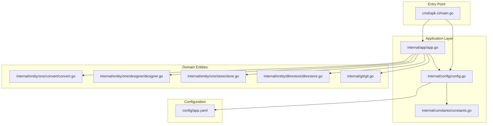
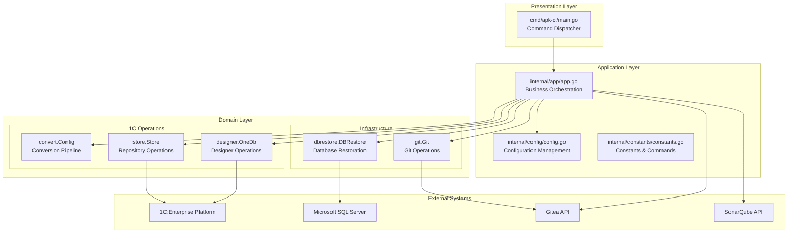
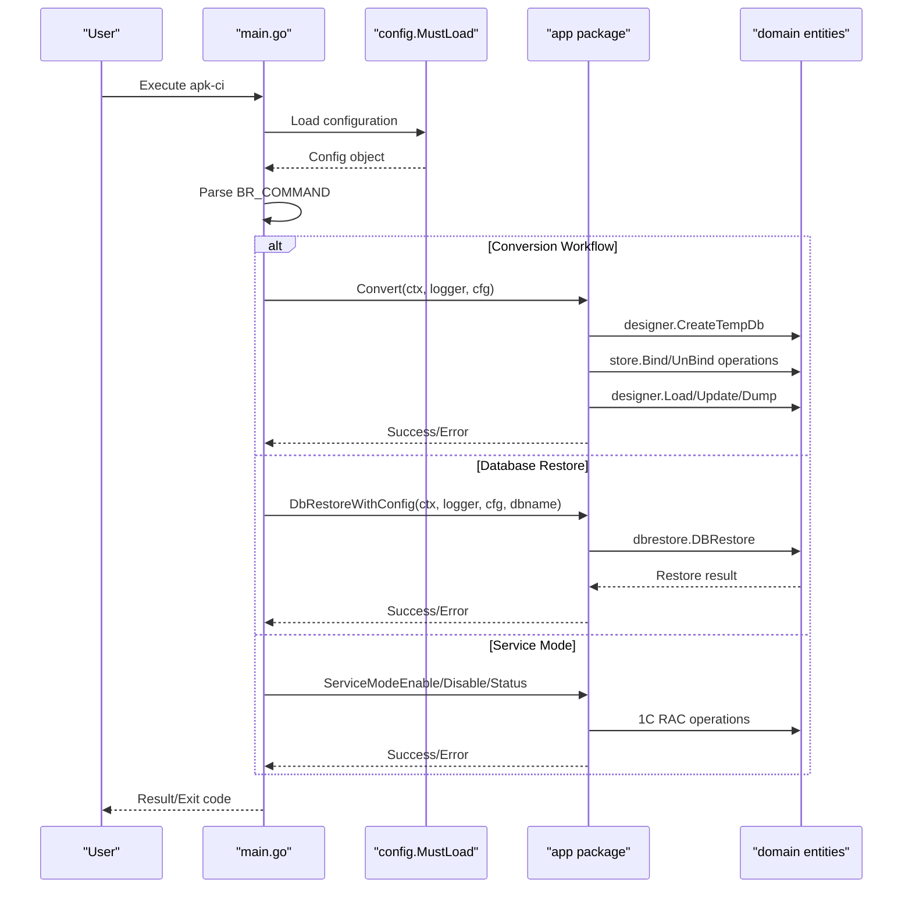
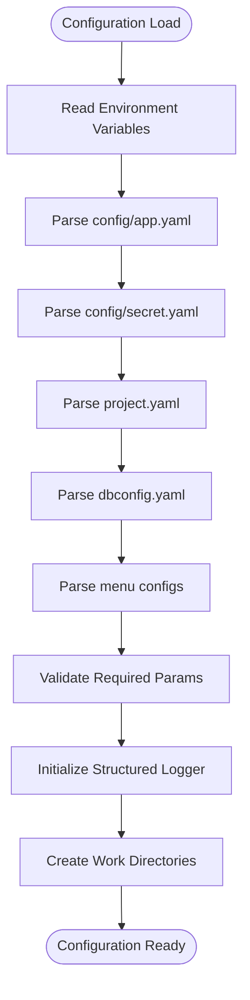
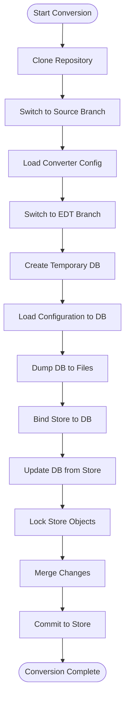
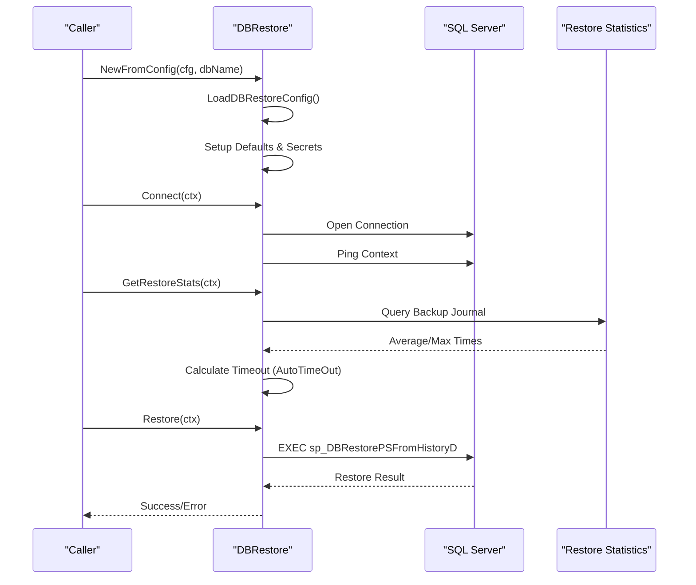
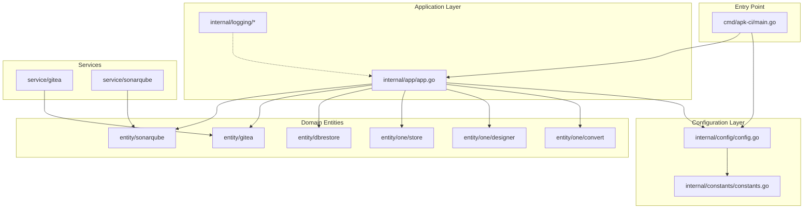

# Architectural Foundation

<cite>
**Referenced Files in This Document**
- [README.md](file://README.md)
- [go.mod](file://go.mod)
- [cmd/apk-ci/main.go](file://cmd/apk-ci/main.go)
- [internal/app/app.go](file://internal/app/app.go)
- [internal/config/config.go](file://internal/config/config.go)
- [internal/constants/constants.go](file://internal/constants/constants.go)
- [internal/entity/one/convert/convert.go](file://internal/entity/one/convert/convert.go)
- [internal/entity/dbrestore/dbrestore.go](file://internal/entity/dbrestore/dbrestore.go)
- [internal/entity/one/designer/designer.go](file://internal/entity/one/designer/designer.go)
- [internal/entity/one/store/store.go](file://internal/entity/one/store/store.go)
- [internal/git/git.go](file://internal/git/git.go)
- [config/app.yaml](file://config/app.yaml)
- [docs/architecture/dependency-map.md](file://docs/architecture/dependency-map.md)
</cite>

## Table of Contents
1. [Introduction](#introduction)
2. [Project Structure](#project-structure)
3. [Core Components](#core-components)
4. [Architecture Overview](#architecture-overview)
5. [Detailed Component Analysis](#detailed-component-analysis)
6. [Dependency Analysis](#dependency-analysis)
7. [Performance Considerations](#performance-considerations)
8. [Troubleshooting Guide](#troubleshooting-guide)
9. [Conclusion](#conclusion)

## Introduction
This document establishes the architectural foundation for the apk-ci project, a Go-based automation toolkit for 1C:Enterprise environments. It covers the system's modular architecture, configuration management, core workflows, and integration patterns. The project emphasizes centralized configuration, layered design, and robust operational procedures for tasks such as database restoration, configuration conversion, service mode management, and SonarQube integration.

## Project Structure
The project follows a layered architecture with clear separation of concerns:
- Command entry point in cmd/apk-ci/main.go orchestrates operations via internal/app functions
- Centralized configuration loading in internal/config handles environment variables, YAML files, and defaults
- Domain-specific modules under internal/entity implement business capabilities (conversion, database restore, 1C operations)
- Utility packages provide cross-cutting concerns (git operations, logging adapters)

**Diagram sources**
- [cmd/apk-ci/main.go](file://cmd/apk-ci/main.go#L1-L262)
- [internal/app/app.go](file://internal/app/app.go#L1-L800)
- [internal/config/config.go](file://internal/config/config.go#L1-L800)
- [internal/constants/constants.go](file://internal/constants/constants.go#L1-L225)
- [internal/entity/one/convert/convert.go](file://internal/entity/one/convert/convert.go#L1-L724)
- [internal/entity/one/designer/designer.go](file://internal/entity/one/designer/designer.go#L1-L527)
- [internal/entity/one/store/store.go](file://internal/entity/one/store/store.go#L1-L800)
- [internal/entity/dbrestore/dbrestore.go](file://internal/entity/dbrestore/dbrestore.go#L1-L594)
- [internal/git/git.go](file://internal/git/git.go#L1-L800)
- [config/app.yaml](file://config/app.yaml#L1-L138)

**Section sources**
- [README.md](file://README.md#L1-L220)
- [go.mod](file://go.mod#L1-L27)

## Core Components
The core components form the backbone of the system:

### Configuration Management
- Centralized configuration loading with environment variable precedence and YAML fallback
- Structured configuration groups: AppConfig, ProjectConfig, SecretConfig, DbConfig
- Dynamic logging configuration and runtime parameter resolution

### Application Orchestration
- Command dispatch based on BR_COMMAND environment variable
- Cross-module coordination for conversion, database operations, and integrations
- Context-aware execution with timeouts and structured logging

### Domain Modules
- **Convert**: 1C configuration conversion pipeline with Git integration
- **DBRestore**: MSSQL database restoration with statistics-driven timeout calculation
- **Designer**: 1C Designer operations for base creation, loading, dumping, and updates
- **Store**: 1C Configuration Repository operations (lock, bind, merge, commit)
- **Git**: Robust Git operations with index.lock handling and retry mechanisms

**Section sources**
- [internal/config/config.go](file://internal/config/config.go#L1-L800)
- [internal/app/app.go](file://internal/app/app.go#L1-L800)
- [internal/entity/one/convert/convert.go](file://internal/entity/one/convert/convert.go#L1-L724)
- [internal/entity/dbrestore/dbrestore.go](file://internal/entity/dbrestore/dbrestore.go#L1-L594)
- [internal/entity/one/designer/designer.go](file://internal/entity/one/designer/designer.go#L1-L527)
- [internal/entity/one/store/store.go](file://internal/entity/one/store/store.go#L1-L800)
- [internal/git/git.go](file://internal/git/git.go#L1-L800)

## Architecture Overview
The system employs a layered architecture with clear boundaries between presentation, application, and domain layers:

**Diagram sources**
- [cmd/apk-ci/main.go](file://cmd/apk-ci/main.go#L1-L262)
- [internal/app/app.go](file://internal/app/app.go#L1-L800)
- [internal/config/config.go](file://internal/config/config.go#L1-L800)
- [internal/constants/constants.go](file://internal/constants/constants.go#L1-L225)
- [internal/entity/one/convert/convert.go](file://internal/entity/one/convert/convert.go#L1-L724)
- [internal/entity/one/designer/designer.go](file://internal/entity/one/designer/designer.go#L1-L527)
- [internal/entity/one/store/store.go](file://internal/entity/one/store/store.go#L1-L800)
- [internal/entity/dbrestore/dbrestore.go](file://internal/entity/dbrestore/dbrestore.go#L1-L594)
- [internal/git/git.go](file://internal/git/git.go#L1-L800)

## Detailed Component Analysis

### Command Dispatch and Execution Flow
The command dispatch mechanism provides a clean separation between user input and business logic execution:

**Diagram sources**
- [cmd/apk-ci/main.go](file://cmd/apk-ci/main.go#L16-L262)
- [internal/app/app.go](file://internal/app/app.go#L58-L800)
- [internal/entity/one/designer/designer.go](file://internal/entity/one/designer/designer.go#L414-L527)
- [internal/entity/dbrestore/dbrestore.go](file://internal/entity/dbrestore/dbrestore.go#L128-L259)

### Configuration Loading and Resolution
The configuration system implements a multi-source resolution strategy:

**Diagram sources**
- [internal/config/config.go](file://internal/config/config.go#L542-L702)
- [config/app.yaml](file://config/app.yaml#L1-L138)

**Section sources**
- [internal/config/config.go](file://internal/config/config.go#L542-L702)
- [config/app.yaml](file://config/app.yaml#L1-L138)

### Conversion Pipeline Architecture
The conversion pipeline coordinates between Git, Designer, and Store operations:

**Diagram sources**
- [internal/app/app.go](file://internal/app/app.go#L58-L131)
- [internal/entity/one/convert/convert.go](file://internal/entity/one/convert/convert.go#L269-L332)
- [internal/entity/one/designer/designer.go](file://internal/entity/one/designer/designer.go#L38-L73)
- [internal/entity/one/store/store.go](file://internal/entity/one/store/store.go#L296-L371)

**Section sources**
- [internal/app/app.go](file://internal/app/app.go#L58-L131)
- [internal/entity/one/convert/convert.go](file://internal/entity/one/convert/convert.go#L269-L332)

### Database Restoration Process
The DBRestore module implements a robust restoration workflow with automatic timeout calculation:

**Diagram sources**
- [internal/entity/dbrestore/dbrestore.go](file://internal/entity/dbrestore/dbrestore.go#L128-L259)
- [internal/entity/dbrestore/dbrestore.go](file://internal/entity/dbrestore/dbrestore.go#L427-L508)

**Section sources**
- [internal/entity/dbrestore/dbrestore.go](file://internal/entity/dbrestore/dbrestore.go#L128-L259)
- [internal/entity/dbrestore/dbrestore.go](file://internal/entity/dbrestore/dbrestore.go#L427-L508)

## Dependency Analysis
The dependency map reveals the current architectural state and areas for improvement:

**Diagram sources**
- [docs/architecture/dependency-map.md](file://docs/architecture/dependency-map.md#L1-L80)
- [cmd/apk-ci/main.go](file://cmd/apk-ci/main.go#L1-L262)
- [internal/app/app.go](file://internal/app/app.go#L1-L800)
- [internal/config/config.go](file://internal/config/config.go#L1-L800)

### Dependency Quality Metrics
The dependency analysis identifies several architectural concerns:

**High Coupling Areas:**
- Configuration layer creates concrete implementations directly (violates Dependency Inversion Principle)
- Application layer depends on specific entity implementations rather than abstractions
- Logging uses concrete *slog.Logger instead of StructuredLogger interface

**Medium Coupling Areas:**
- Service factories duplicate client creation logic
- Broad interfaces (Gitea APIInterface, SonarQube APIInterface) increase coupling surface

**Low Coupling Areas:**
- Service layer maintains relatively clean separation through entity interfaces

**Section sources**
- [docs/architecture/dependency-map.md](file://docs/architecture/dependency-map.md#L48-L80)

## Performance Considerations
The system incorporates several performance optimization strategies:

### Timeout Management
- Configurable operation timeouts with sensible defaults (30s-60m)
- Context-aware cancellation for long-running operations
- Automatic timeout calculation based on historical statistics for database restoration

### Resource Management
- Temporary directory cleanup and isolation
- Process execution with controlled resource allocation
- Connection pooling and reuse where applicable

### Scalability Patterns
- Modular design allows parallel execution of independent operations
- Configurable concurrency through command orchestration
- Stateless operations where possible for horizontal scaling

## Troubleshooting Guide

### Common Issues and Solutions

**Git Index Lock Problems**
- Symptom: Git operations fail with "index.lock" errors
- Solution: The system implements automatic lock detection and waiting with 60-minute timeout
- Prevention: Ensure proper cleanup of temporary directories and avoid concurrent Git operations

**Database Restoration Failures**
- Symptom: Restore operations exceed timeout or fail with SQL errors
- Solution: Enable AutoTimeOut to calculate appropriate timeouts based on historical data
- Monitoring: Check restore statistics in BackupRequestJournal table

**1C Operation Failures**
- Symptom: Designer or Store operations fail with "unknown error" messages
- Solution: Verify connection strings and credentials in configuration
- Validation: Check for proper licensing and network connectivity to 1C services

**Configuration Loading Issues**
- Symptom: Application fails to start with configuration errors
- Solution: Validate YAML syntax and ensure all required environment variables are set
- Debugging: Enable debug logging to see detailed configuration resolution

**Section sources**
- [internal/git/git.go](file://internal/git/git.go#L363-L406)
- [internal/entity/dbrestore/dbrestore.go](file://internal/entity/dbrestore/dbrestore.go#L427-L508)
- [internal/config/config.go](file://internal/config/config.go#L542-L702)

## Conclusion
The apk-ci project demonstrates a well-structured, modular architecture designed for reliability and maintainability. The centralized configuration system, layered design, and robust error handling provide a solid foundation for automation tasks in 1C:Enterprise environments. While the current architecture shows good separation of concerns, the dependency analysis highlights opportunities to improve adherence to SOLID principles, particularly around dependency inversion and interface segregation. The system's focus on configurability, logging, and operational safety positions it well for future enhancements and scaling requirements.