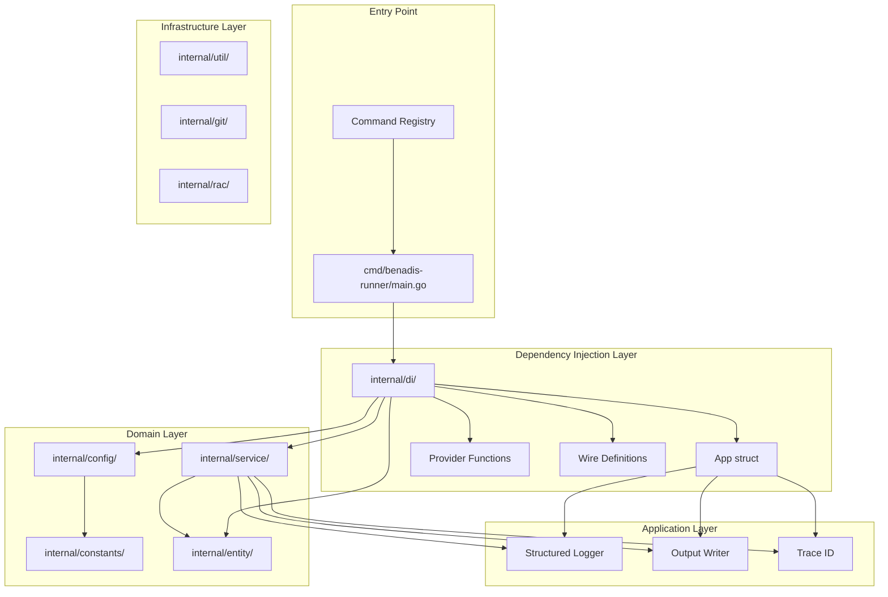
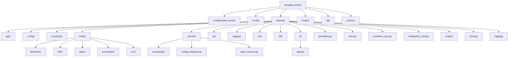
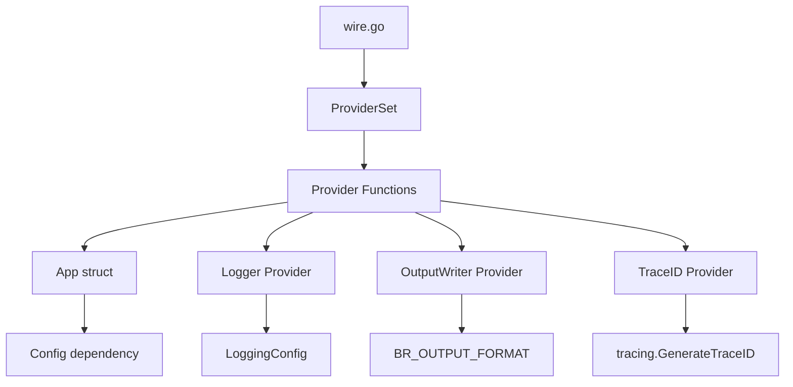
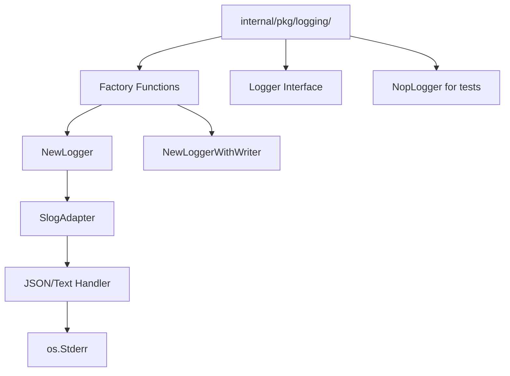
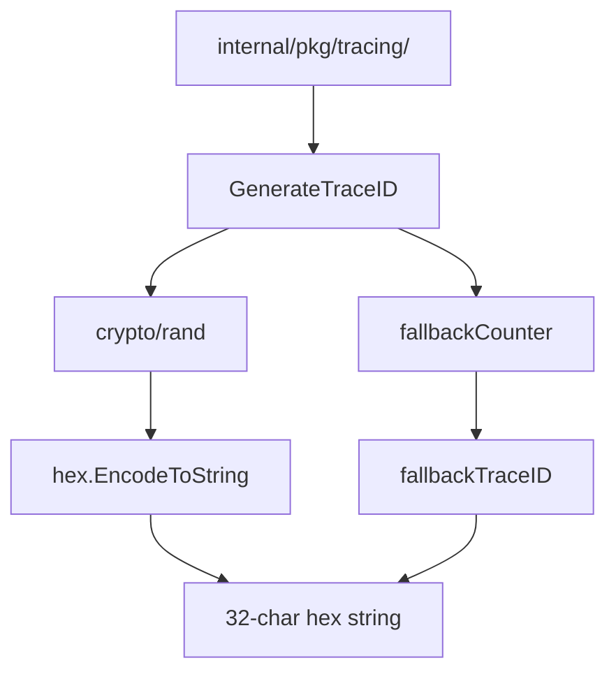
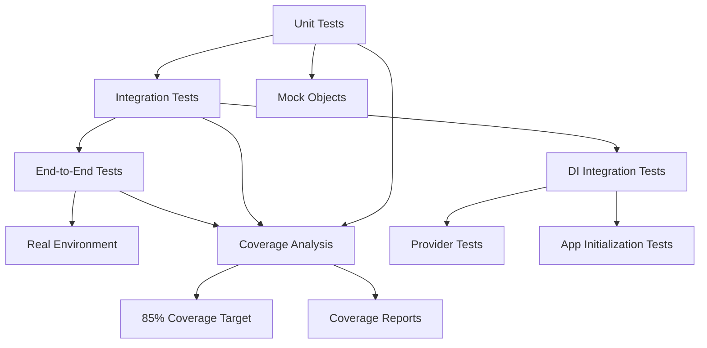
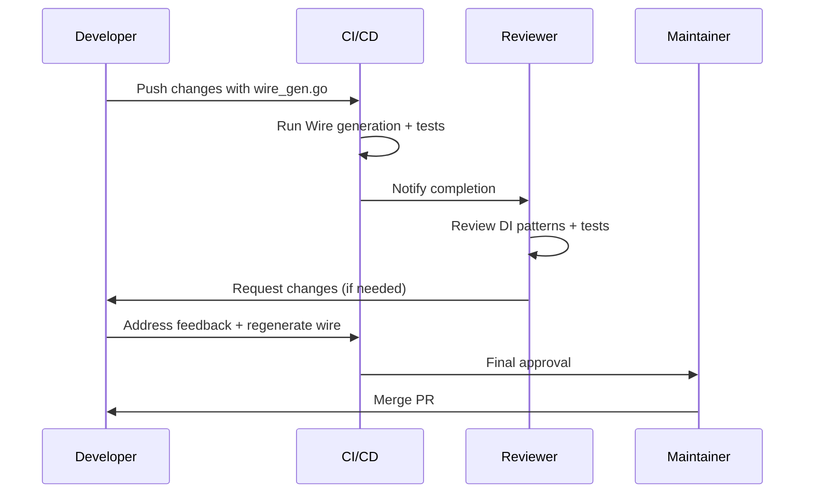

# Development Guide

<cite>
**Referenced Files in This Document**
- [main.go](file://cmd/benadis-runner/main.go)
- [wire.go](file://internal/di/wire.go)
- [app.go](file://internal/di/app.go)
- [providers.go](file://internal/di/providers.go)
- [providers_test.go](file://internal/di/providers_test.go)
- [integration_test.go](file://internal/di/integration_test.go)
- [factory.go](file://internal/pkg/logging/factory.go)
- [interfaces.go](file://internal/logging/interfaces.go)
- [nop.go](file://internal/pkg/logging/nop.go)
- [factory.go](file://internal/pkg/output/factory.go)
- [writer.go](file://internal/pkg/output/writer.go)
- [json.go](file://internal/pkg/output/json.go)
- [text.go](file://internal/pkg/output/text.go)
- [traceid.go](file://internal/pkg/tracing/traceid.go)
- [integration_test.go](file://internal/pkg/tracing/integration_test.go)
- [config.go](file://internal/config/config.go)
- [handler.go](file://internal/command/handler.go)
- [registry.go](file://internal/command/registry.go)
- [README.md](file://internal/di/README.md)
- [1-7-wire-di-setup-providers.md](file://_bmad-output/implementation-artifacts/stories/1-7-wire-di-setup-providers.md)
- [1-6-config-extensions.md](file://_bmad-output/implementation-artifacts/stories/1-6-config-extensions.md)
- [1-5-trace-id-generation.md](file://_bmad-output/implementation-artifacts/stories/1-5-trace-id-generation.md)
</cite>

## Update Summary
**Changes Made**
- Added comprehensive documentation for Google Wire dependency injection architecture
- Documented structured output system with JSON and text formatting capabilities
- Updated logging infrastructure with slog adapter and structured logging patterns
- Added tracing capabilities with trace ID generation and correlation
- Enhanced configuration management with ImplementationsConfig
- Updated architecture diagrams to reflect new DI-based design
- Added new sections covering dependency injection patterns and testing strategies

## Table of Contents
1. [Introduction](#introduction)
2. [Project Architecture](#project-architecture)
3. [Codebase Structure](#codebase-structure)
4. [Dependency Injection with Google Wire](#dependency-injection-with-google-wire)
5. [Structured Output System](#structured-output-system)
6. [Logging Infrastructure Redesign](#logging-infrastructure-redesign)
7. [Tracing Capabilities](#tracing-capabilities)
8. [Adding New Commands](#adding-new-commands)
9. [Testing Strategy](#testing-strategy)
10. [Build and Release Process](#build-and-release-process)
11. [Coding Standards](#coding-standards)
12. [Debugging and Profiling](#debugging-and-profiling)
13. [Contribution Workflow](#contribution-workflow)
14. [Best Practices](#best-practices)

## Introduction

Benadis-runner is a comprehensive automation tool for 1C:Enterprise systems that provides modular functionality for database operations, configuration conversion, service mode management, and integration with development tools. The project follows a clean architecture pattern with clear separation of concerns across multiple packages.

**Updated** The project has undergone a major architectural transformation with the introduction of Google Wire dependency injection, structured output system, redesigned logging infrastructure, and comprehensive tracing capabilities.

The development guide covers the essential aspects of contributing to the project, including understanding the new DI-based architecture, implementing new features with dependency injection, maintaining test coverage, and following established coding standards.

## Project Architecture

Benadis-runner follows a modular architecture with distinct layers that separate concerns and promote maintainability. The architecture has been enhanced with dependency injection and structured output capabilities:



**Diagram sources**
- [main.go](file://cmd/benadis-runner/main.go#L25-L60)
- [wire.go](file://internal/di/wire.go#L20-L25)
- [app.go](file://internal/di/app.go#L18-L34)

### Architectural Principles

1. **Dependency Injection**: All dependencies are injected via Google Wire for compile-time safety
2. **Structured Output**: Unified output system supporting JSON and text formats
3. **Comprehensive Tracing**: Trace ID generation and correlation across all operations
4. **Redesigned Logging**: Structured logging with slog adapter and configurable formats
5. **Self-Registration**: Commands register themselves automatically via init() functions
6. **Interface Segregation**: Clear separation between interfaces and implementations

**Section sources**
- [wire.go](file://internal/di/wire.go#L1-L51)
- [app.go](file://internal/di/app.go#L1-L35)
- [README.md](file://internal/di/README.md#L1-L130)

## Codebase Structure

The project is organized into several key directories, each serving a specific purpose. The structure has been enhanced to support the new dependency injection architecture:

### Directory Structure



**Diagram sources**
- [internal/di/app.go](file://internal/di/app.go#L1-L35)
- [internal/di/providers.go](file://internal/di/providers.go#L1-L63)

### Package Descriptions

- **cmd/benadis-runner/**: Entry point and command-line interface with command registry
- **internal/di/**: Dependency injection layer with Google Wire integration
- **internal/pkg/output/**: Structured output system with JSON and text formatting
- **internal/pkg/logging/**: Redesigned logging infrastructure with slog adapter
- **internal/pkg/tracing/**: Trace ID generation and correlation utilities
- **internal/config/**: Enhanced configuration management with ImplementationsConfig
- **internal/command/**: Self-registering command handlers with registry pattern

**Section sources**
- [wire.go](file://internal/di/wire.go#L1-L51)
- [app.go](file://internal/di/app.go#L1-L35)
- [factory.go](file://internal/pkg/output/factory.go#L1-L23)

## Dependency Injection with Google Wire

The project now uses Google Wire for compile-time dependency injection, eliminating runtime reflection overhead and providing type safety.

### Wire Architecture



**Diagram sources**
- [wire.go](file://internal/di/wire.go#L20-L25)
- [providers.go](file://internal/di/providers.go#L20-L63)

### App Structure

The `App` struct serves as the central dependency container:

```go
type App struct {
    // Config contains application configuration.
    // Passed from outside through InitializeApp().
    Config *config.Config

    // Logger provides structured logging.
    // Created through ProvideLogger based on LoggingConfig.
    Logger logging.Logger

    // OutputWriter formats command results.
    // Created through ProvideOutputWriter based on BR_OUTPUT_FORMAT.
    OutputWriter output.Writer

    // TraceID contains unique identifier for log correlation.
    // Generated through ProvideTraceID.
    TraceID string
}
```

### Provider Functions

Provider functions encapsulate dependency creation logic:

```go
// ProvideLogger creates Logger based on LoggingConfig.
func ProvideLogger(cfg *config.Config) logging.Logger {
    logCfg := logging.Config{
        Level:  cfg.LoggingConfig.Level,
        Format: cfg.LoggingConfig.Format,
        Output: cfg.LoggingConfig.Output,
    }
    return logging.NewLogger(logCfg)
}

// ProvideOutputWriter creates OutputWriter based on BR_OUTPUT_FORMAT.
func ProvideOutputWriter() output.Writer {
    format := os.Getenv("BR_OUTPUT_FORMAT")
    if format == "" {
        format = output.FormatText
    }
    return output.NewWriter(format)
}

// ProvideTraceID generates unique trace_id.
func ProvideTraceID() string {
    return tracing.GenerateTraceID()
}
```

### Initialization Process

```go
// InitializeApp creates and initializes App through Wire DI.
func InitializeApp(cfg *config.Config) (*App, error) {
    wire.Build(ProviderSet)
    return nil, nil // Wire replaces this with generated implementation
}
```

**Section sources**
- [wire.go](file://internal/di/wire.go#L1-L51)
- [app.go](file://internal/di/app.go#L1-L35)
- [providers.go](file://internal/di/providers.go#L1-L63)
- [README.md](file://internal/di/README.md#L26-L130)

## Structured Output System

The output system provides unified formatting capabilities with support for both JSON and text formats.

### Output Writer Interface

```go
// Writer defines interface for formatting command results.
type Writer interface {
    // Write formats result and writes to w.
    // Returns error if serialization or write failed.
    Write(w io.Writer, result *Result) error
}
```

### Supported Formats

The system supports two output formats:

1. **JSON Format**: Human-readable JSON with indentation
2. **Text Format**: Human-friendly text output

### Format Selection

Output format is determined by the `BR_OUTPUT_FORMAT` environment variable:

```go
// NewWriter creates Writer based on specified format.
// Supported formats: "json", "text".
// Unknown format returns TextWriter (default).
func NewWriter(format string) Writer {
    switch format {
    case FormatJSON:
        return NewJSONWriter()
    case FormatText:
        return NewTextWriter()
    default:
        // Default to text format for readability
        return NewTextWriter()
    }
}
```

### JSON Output Format

```go
// JSONWriter formats Result in JSON.
type JSONWriter struct{}

func (j *JSONWriter) Write(w io.Writer, result *Result) error {
    encoder := json.NewEncoder(w)
    encoder.SetIndent("", "  ")
    return encoder.Encode(result)
}
```

### Text Output Format

```go
// TextWriter formats Result in human-readable text.
type TextWriter struct{}

func (t *TextWriter) Write(w io.Writer, result *Result) error {
    if result == nil {
        return nil
    }

    // Basic format: Command: status
    if _, err := fmt.Fprintf(w, "%s: %s\n", result.Command, result.Status); err != nil {
        return err
    }

    // Error details if present
    if result.Error != nil {
        if _, err := fmt.Fprintf(w, "Error [%s]: %s\n", result.Error.Code, result.Error.Message); err != nil {
            return err
        }
    }

    // Data as JSON if present
    if result.Data != nil {
        dataJSON, err := json.MarshalIndent(result.Data, "", "  ")
        if err != nil {
            return fmt.Errorf("failed to serialize Data: %w", err)
        }
        if _, err := fmt.Fprintf(w, "Data: %s\n", dataJSON); err != nil {
            return err
        }
    }

    // Duration if present
    if result.Metadata != nil && result.Metadata.DurationMs > 0 {
        if _, err := fmt.Fprintf(w, "Duration: %dms\n", result.Metadata.DurationMs); err != nil {
            return err
        }
    }

    return nil
}
```

**Section sources**
- [writer.go](file://internal/pkg/output/writer.go#L1-L12)
- [factory.go](file://internal/pkg/output/factory.go#L1-L23)
- [json.go](file://internal/pkg/output/json.go#L1-L23)
- [text.go](file://internal/pkg/output/text.go#L1-L55)

## Logging Infrastructure Redesign

The logging system has been redesigned with structured logging capabilities using slog adapter.

### Logging Architecture



**Diagram sources**
- [factory.go](file://internal/pkg/logging/factory.go#L9-L38)
- [interfaces.go](file://internal/logging/interfaces.go#L35-L88)

### Logger Interface

```go
// Logger defines interface for structured logging.
type Logger interface {
    Debug(msg string, args ...any)
    Info(msg string, args ...any)
    Warn(msg string, args ...any)
    Error(msg string, args ...any)
    With(args ...any) Logger
}
```

### Slog Adapter Implementation

The system uses a slog adapter for structured logging:

```go
// NewLogger creates Logger with configured settings.
// Always writes to os.Stderr for separation of concerns.
func NewLogger(config Config) Logger {
    return NewLoggerWithWriter(config, os.Stderr)
}

// NewLoggerWithWriter creates Logger with custom writer.
func NewLoggerWithWriter(config Config, w io.Writer) Logger {
    // Parse log level
    level := parseLevel(config.Level)
    
    // Create handler based on format
    opts := &slog.HandlerOptions{Level: level}
    var handler slog.Handler
    
    switch config.Format {
    case FormatJSON:
        handler = slog.NewJSONHandler(w, opts)
    default:
        handler = slog.NewTextHandler(w, opts)
    }
    
    return NewSlogAdapter(slog.New(handler))
}
```

### Log Levels and Formatting

Supported log levels and their mapping to slog levels:

| Custom Level | Slog Level | Description |
|--------------|------------|-------------|
| debug | slog.LevelDebug | Detailed debug information |
| info | slog.LevelInfo | General information |
| warn | slog.LevelWarn | Warning messages |
| error | slog.LevelError | Error conditions |

### NopLogger for Testing

A no-operation logger implementation for testing scenarios:

```go
// NopLogger ignores all log messages.
// Useful for unit tests where logging is not important.
type NopLogger struct{}

func (n *NopLogger) Debug(_ string, _ ...any) {}
func (n *NopLogger) Info(_ string, _ ...any) {}
func (n *NopLogger) Warn(_ string, _ ...any) {}
func (n *NopLogger) Error(_ string, _ ...any) {}
func (n *NopLogger) With(_ ...any) Logger { return n }
```

**Section sources**
- [factory.go](file://internal/pkg/logging/factory.go#L1-L54)
- [interfaces.go](file://internal/logging/interfaces.go#L35-L88)
- [nop.go](file://internal/pkg/logging/nop.go#L1-L29)

## Tracing Capabilities

The project implements comprehensive tracing capabilities with automatic trace ID generation and correlation.

### Trace ID Generation



**Diagram sources**
- [traceid.go](file://internal/pkg/tracing/traceid.go#L28-L56)

### Trace ID Format

Trace IDs follow a 32-character hexadecimal format compatible with W3C Trace Context:

```go
// GenerateTraceID generates unique trace ID.
// Format: 32 character hex string (16 bytes), e.g., "a1b2c3d4e5f6a7b8c9d0e1f2a3b4c5d6"
//
// Uses crypto/rand for cryptographically secure generation.
// On crypto/rand failure, falls back to timestamp-based ID.
func GenerateTraceID() string {
    b := make([]byte, 16)
    if _, err := rand.Read(b); err != nil {
        // Fallback on extremely rare crypto/rand failure
        return fallbackTraceID()
    }
    return hex.EncodeToString(b)
}
```

### Trace ID Usage Pattern

```go
// Typical usage pattern in main.go:
traceID := tracing.GenerateTraceID()
ctx := tracing.WithTraceID(ctx, traceID)
logger := logger.With("trace_id", tracing.TraceIDFromContext(ctx))
```

### Integration with Output System

Trace IDs are included in output metadata:

```go
result.Metadata = &output.Metadata{
    TraceID:    tracing.TraceIDFromContext(ctx),
    DurationMs: elapsed.Milliseconds(),
    APIVersion: "v1",
}
```

**Section sources**
- [traceid.go](file://internal/pkg/tracing/traceid.go#L1-L57)
- [integration_test.go](file://internal/pkg/tracing/integration_test.go#L39-L62)
- [1-5-trace-id-generation.md](file://_bmad-output/implementation-artifacts/stories/1-5-trace-id-generation.md#L1-L91)

## Adding New Commands

Adding new commands to benadis-runner leverages the self-registration pattern and dependency injection architecture.

### Step 1: Create Command Handler

Create a new handler in `internal/command/handlers/`:

```go
// Example handler structure
type MyCommandHandler struct{}

func (h *MyCommandHandler) Name() string {
    return "my-command"
}

func (h *MyCommandHandler) Description() string {
    return "Description of my command"
}

func (h *MyCommandHandler) Execute(ctx context.Context, cfg *config.Config) error {
    // Implementation using injected dependencies
    app := cfg.App // Access application dependencies
    return nil
}
```

### Step 2: Register Handler Automatically

Add blank import in main.go for self-registration:

```go
import (
    // ... existing imports
    _ "github.com/Kargones/apk-ci/internal/command/handlers/mycommandhandler"
)
```

### Step 3: Implement Business Logic

Use dependency injection in your handler:

```go
func (h *MyCommandHandler) Execute(ctx context.Context, cfg *config.Config) error {
    // Access injected dependencies
    logger := cfg.Logger // From DI container
    outputWriter := cfg.OutputWriter // From DI container
    traceID := cfg.TraceID // From DI container
    
    // Use dependencies in business logic
    logger.With("trace_id", traceID).Info("Executing my command")
    
    return nil
}
```

### Step 4: Write Comprehensive Tests

```go
func TestMyCommandHandler_Execute(t *testing.T) {
    // Test implementation with DI
    cfg := &config.Config{
        Command: "my-command",
        Logger: logging.NewNopLogger(),
    }
    
    handler := &MyCommandHandler{}
    err := handler.Execute(context.Background(), cfg)
    
    assert.NoError(t, err)
}
```

**Section sources**
- [handler.go](file://internal/command/handler.go#L1-L28)
- [registry.go](file://internal/command/registry.go#L19-L55)
- [main.go](file://cmd/benadis-runner/main.go#L16-L23)

## Testing Strategy

Benadis-runner employs a comprehensive testing strategy with multiple layers of test coverage, enhanced by the dependency injection architecture.

### Testing Architecture with DI



**Diagram sources**
- [providers_test.go](file://internal/di/providers_test.go#L137-L210)
- [integration_test.go](file://internal/di/integration_test.go#L14-L201)

### Test Types and Coverage

1. **Unit Tests**: Isolated testing of individual functions and methods
2. **Integration Tests**: Testing component interactions and external dependencies
3. **End-to-End Tests**: Complete workflow testing with real environments
4. **Dependency Injection Tests**: Testing provider functions and App initialization
5. **Mock Tests**: Testing with simulated external dependencies

### Dependency Injection Testing Patterns

#### Provider Function Testing

```go
func TestProvideLogger_ReturnsNonNil(t *testing.T) {
    // Arrange
    cfg := &config.Config{
        LoggingConfig: &config.LoggingConfig{
            Level:  "debug",
            Format: "json",
        },
    }

    // Act
    logger := ProvideLogger(cfg)

    // Assert
    assert.NotNil(t, logger, "Logger should be non-nil")
}

func TestProvideOutputWriter_ReturnsNonNil(t *testing.T) {
    // Act
    writer := ProvideOutputWriter()

    // Assert
    assert.NotNil(t, writer, "Writer should be non-nil")
    assert.IsType(t, output.NewWriter("text"), writer, "Should default to TextWriter")
}
```

#### App Initialization Testing

```go
func TestInitializeApp_AllFieldsNonNil(t *testing.T) {
    // Arrange
    cfg := &config.Config{
        LoggingConfig: &config.LoggingConfig{
            Level:  "debug",
            Format: "json",
        },
    }

    // Act
    app, err := InitializeApp(cfg)

    // Assert
    require.NoError(t, err, "InitializeApp should not return error")
    require.NotNil(t, app, "InitializeApp should return non-nil App")

    assert.NotNil(t, app.Config, "App.Config should be non-nil")
    assert.NotNil(t, app.Logger, "App.Logger should be non-nil")
    assert.NotNil(t, app.OutputWriter, "App.OutputWriter should be non-nil")
    assert.NotEmpty(t, app.TraceID, "App.TraceID should be non-empty")
}
```

### Coverage Goals

- **Overall Project**: Minimum 85% code coverage
- **Critical Modules**: 90%+ coverage for core functionality
- **Business Logic**: 100% branch coverage where applicable
- **Dependency Injection**: 100% coverage for provider functions

### Writing Effective Tests

Follow these patterns observed in existing test files:

```go
// Table-driven tests for multiple scenarios
func TestExample(t *testing.T) {
    tests := []struct {
        name     string
        input    string
        expected string
    }{
        {"valid_input", "test", "expected"},
        {"edge_case", "", ""},
    }
    
    for _, tt := range tests {
        t.Run(tt.name, func(t *testing.T) {
            result := functionUnderTest(tt.input)
            assert.Equal(t, tt.expected, result)
        })
    }
}
```

### Mock Implementation Pattern

```go
// Mock interfaces for external dependencies
type MockDependency struct {
    // Fields for tracking calls
    Calls []string
}

func (m *MockDependency) Method(param string) error {
    m.Calls = append(m.Calls, param)
    return nil
}
```

**Section sources**
- [providers_test.go](file://internal/di/providers_test.go#L137-L210)
- [integration_test.go](file://internal/di/integration_test.go#L14-L201)
- [README.md](file://internal/di/README.md#L109-L130)

## Build and Release Process

Benadis-runner uses a dual build system with both Makefile and Taskfile.yml for flexibility, enhanced with dependency injection support.

### Makefile Features

The Makefile provides comprehensive build automation with DI support:

```makefile
# Primary targets
build: # Compile the application
test: # Run all tests
test-coverage: # Generate coverage reports
lint: # Run static analysis
fmt: # Format code
clean: # Clean build artifacts
generate-wire: # Generate Wire DI code

# Platform-specific builds
build-linux: # Linux binaries
build-windows: # Windows executables
build-darwin: # macOS binaries

# Wire generation target
generate-wire:
	go generate ./internal/di/...
```

### Taskfile Features

Taskfile.yml offers modern task orchestration with DI integration:

```yaml
tasks:
  build:
    desc: "Build binary for production"
    cmds:
      - go build -o bin/benadis-runner ./cmd/benadis-runner
  
  debug:
    desc: "Build debug binary with debug info"
    cmds:
      - go build -gcflags="-N -l" -o bin/benadis-runner ./cmd/benadis-runner
  
  generate-wire:
    desc: "Generate Wire dependency injection code"
    cmds:
      - go generate ./internal/di/...
```

### Wire Generation Process

The dependency injection system requires code generation:

```bash
# Generate Wire code
go generate ./internal/di/

# Or use make target
make generate-wire

# Or use Taskfile
task generate-wire
```

### Release Process

1. **Wire Generation**: `make generate-wire` (ensures wire_gen.go is up-to-date)
2. **Code Quality Checks**: `make check` (fmt, vet, lint, test)
3. **Platform Builds**: `make build-all` or Taskfile equivalent
4. **Documentation Generation**: `make docs`
5. **Version Management**: Automatic version embedding

### Continuous Integration

The project integrates with CI/CD pipelines for automated testing and deployment with DI validation:

```yaml
# Example CI configuration with Wire validation
name: Tests
on: [push, pull_request]
jobs:
  test:
    runs-on: ubuntu-latest
    steps:
      - uses: actions/checkout@v3
      - uses: actions/setup-go@v3
      - run: go generate ./internal/di/...
      - run: go test -v -race -coverprofile=coverage.out ./...
      - run: go test ./internal/di/... -run ".*Wire.*"
```

**Section sources**
- [Makefile](file://Makefile#L1-L100)
- [Taskfile.yml](file://Taskfile.yml#L1-L100)
- [wire.go](file://internal/di/wire.go#L11-L11)

## Coding Standards

### Go Language Guidelines

1. **Naming Conventions**:
   - Use camelCase for variables and functions
   - Use PascalCase for exported types and methods
   - Use snake_case for constants

2. **Error Handling**:
   ```go
   // Proper error handling pattern
   result, err := expensiveOperation()
   if err != nil {
       return fmt.Errorf("failed to perform operation: %w", err)
   }
   ```

3. **Logging**:
   ```go
   // Use structured logging with slog
   l.Info("Operation completed successfully",
       "operation", "example",
       "duration", duration)
   ```

4. **Dependency Injection**:
   ```go
   // Use injected dependencies via DI container
   logger := cfg.Logger
   outputWriter := cfg.OutputWriter
   traceID := cfg.TraceID
   ```

### Code Organization

1. **Package Structure**: Follow the established directory layout with DI support
2. **Import Organization**: Group imports systematically
3. **Documentation**: Comment public APIs and complex logic
4. **Provider Functions**: Keep provider functions simple and focused

### File Naming Conventions

- Use descriptive names for files and functions
- `_test.go` suffix for test files
- `_additional_test.go` for supplementary test cases
- `_coverage_test.go` for coverage-specific tests
- `wire_gen.go` for generated Wire code (auto-generated)

**Section sources**
- [wire.go](file://internal/di/wire.go#L1-L51)
- [app.go](file://internal/di/app.go#L1-L35)
- [providers.go](file://internal/di/providers.go#L1-L63)

## Debugging and Profiling

### Development Tools Setup

The project includes comprehensive tool installation scripts with DI debugging support:

```bash
# Install development tools
./scripts/install-dev-tools.sh

# Available tools:
# - Delve (dlv) - Go debugger
# - golangci-lint - Advanced linter
# - goimports - Import formatter
# - godoc - Documentation server
```

### Debugging with Taskfile

```yaml
tasks:
  debug:
    desc: "Run with debugger for VS Code"
    cmds:
      - dlv debug ./cmd/benadis-runner \
        --headless --listen=127.0.0.1:2345 --api-version=2
```

### Performance Profiling

```bash
# CPU profiling
go test -cpuprofile=cpu.prof ./...

# Memory profiling
go test -memprofile=mem.prof ./...

# Generate profile visualization
go tool pprof cpu.prof
```

### Common Debugging Scenarios

1. **Service Mode Issues**: Check RAC connectivity and timeouts
2. **Git Operations**: Verify repository access and credentials
3. **Configuration Problems**: Validate YAML parsing and environment variables
4. **Dependency Injection Issues**: Check Wire provider functions and App initialization
5. **External Dependencies**: Monitor network connectivity and API responses

### DI Debugging Techniques

```go
// Debug DI initialization
func DebugDIInitialization() {
    cfg := config.MustLoad()
    app, err := di.InitializeApp(cfg)
    if err != nil {
        log.Printf("DI initialization failed: %v", err)
        return
    }
    
    log.Printf("App initialized with Logger: %T", app.Logger)
    log.Printf("App initialized with OutputWriter: %T", app.OutputWriter)
    log.Printf("TraceID: %s", app.TraceID)
}
```

**Section sources**
- [scripts/install-dev-tools.sh](file://scripts/install-dev-tools.sh#L1-L100)
- [Taskfile.yml](file://Taskfile.yml#L50-L100)
- [integration_test.go](file://internal/di/integration_test.go#L14-L201)

## Contribution Workflow

### Development Process

1. **Fork and Clone**: Fork the repository and create local clone
2. **Feature Branch**: Create branch for new feature or fix
3. **Implementation**: Follow coding standards and write tests with DI support
4. **Wire Generation**: Run `make generate-wire` to update generated code
5. **Testing**: Ensure all tests pass and coverage meets requirements
6. **Documentation**: Update relevant documentation
7. **Pull Request**: Submit PR with clear description

### Code Review Process



### Quality Gates

- **Wire Generation**: `make generate-wire` succeeds without conflicts
- **Code Coverage**: Minimum 85% achieved
- **Static Analysis**: No critical issues reported
- **Test Execution**: All tests passing including DI tests
- **Code Review**: Approved by reviewer

**Section sources**
- [README.md](file://internal/di/README.md#L109-L130)
- [1-7-wire-di-setup-providers.md](file://_bmad-output/implementation-artifacts/stories/1-7-wire-di-setup-providers.md#L17-L22)

## Best Practices

### Development Guidelines

1. **Modular Design**: Keep functionality focused and reusable
2. **Error Propagation**: Pass errors up the call stack appropriately
3. **Resource Management**: Always clean up resources (files, connections)
4. **Configuration Management**: Use centralized configuration system
5. **Dependency Injection**: Use DI container for all dependencies
6. **Structured Output**: Use unified output system for consistent formatting
7. **Tracing**: Include trace IDs in all log entries and outputs

### Testing Best Practices

1. **Test Coverage**: Aim for comprehensive coverage of business logic
2. **Edge Cases**: Test boundary conditions and error scenarios
3. **Mock External Dependencies**: Use mocks for unreliable external systems
4. **Continuous Testing**: Run tests frequently during development
5. **DI Testing**: Test provider functions and App initialization
6. **Integration Testing**: Test complete workflows with real dependencies

### Performance Considerations

1. **Memory Management**: Avoid memory leaks in long-running operations
2. **Network Operations**: Implement timeouts and retries for external calls
3. **Concurrency**: Use goroutines appropriately for I/O-bound operations
4. **Profiling**: Regularly profile critical code paths
5. **DI Overhead**: Wire provides compile-time injection with zero runtime overhead

### Security Considerations

1. **Environment Variables**: Never log sensitive configuration data
2. **File Permissions**: Set appropriate permissions for generated files
3. **Input Validation**: Validate all external inputs
4. **Access Control**: Implement proper authentication and authorization
5. **Trace ID Security**: Trace IDs are non-sensitive correlation identifiers

### Maintenance and Monitoring

1. **Logging**: Implement comprehensive structured logging
2. **Metrics**: Track key performance indicators
3. **Health Checks**: Implement application health monitoring
4. **Documentation**: Keep documentation current with code changes
5. **DI Maintenance**: Keep provider functions and App struct updated

**Section sources**
- [wire.go](file://internal/di/wire.go#L1-L51)
- [app.go](file://internal/di/app.go#L1-L35)
- [factory.go](file://internal/pkg/logging/factory.go#L1-L54)
- [traceid.go](file://internal/pkg/tracing/traceid.go#L1-L57)