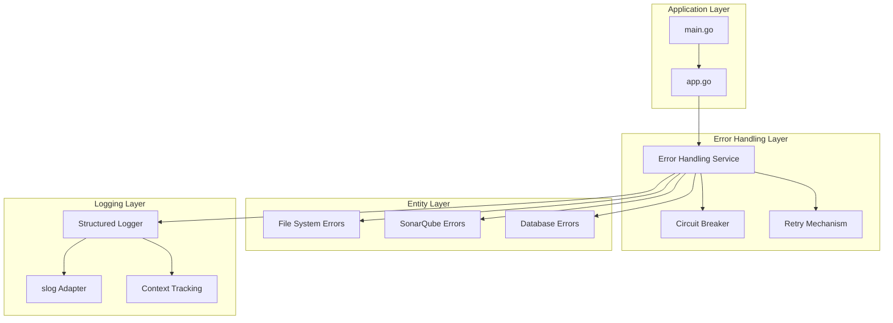
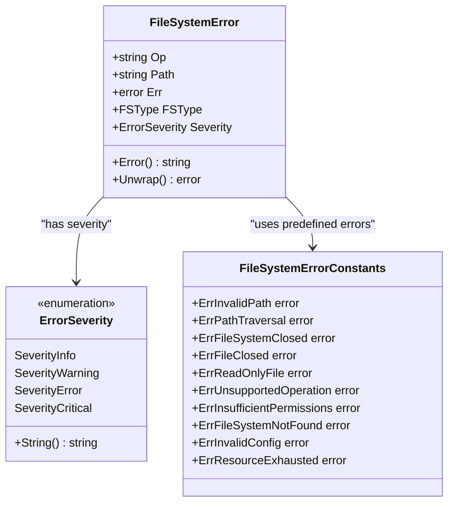
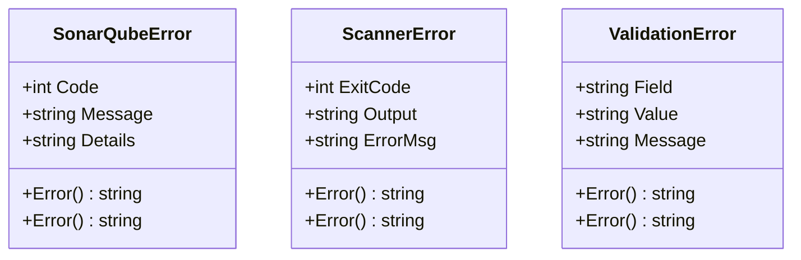
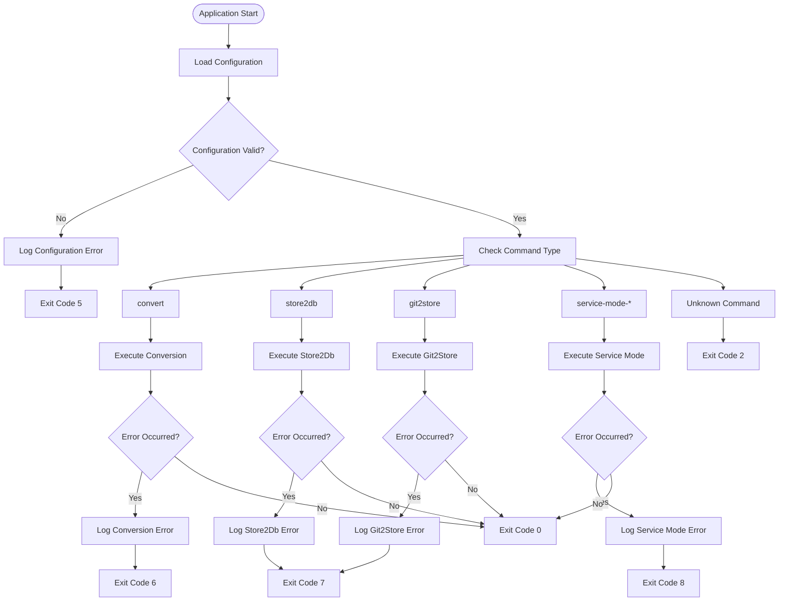
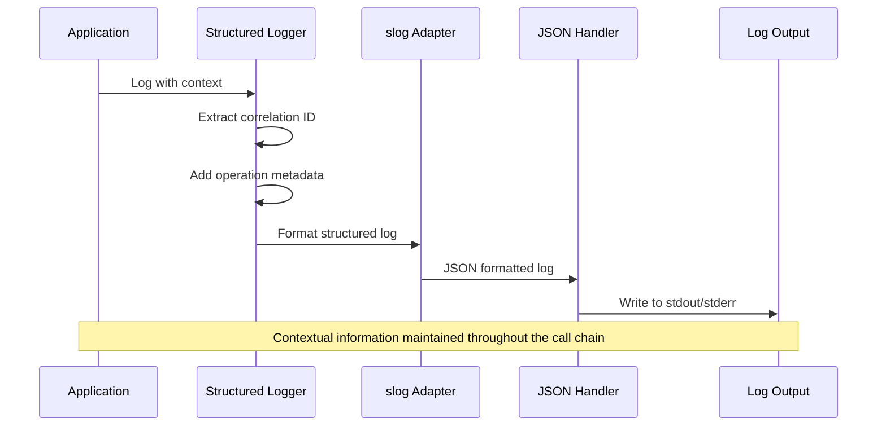
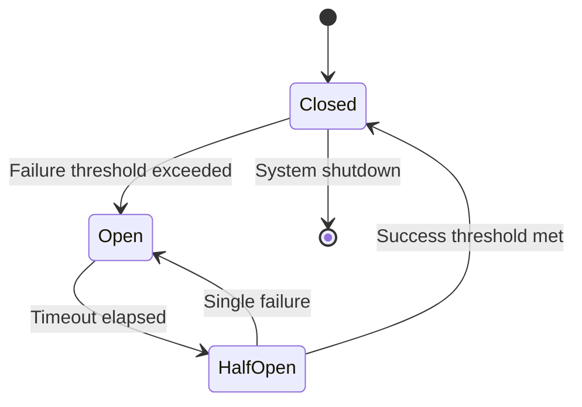
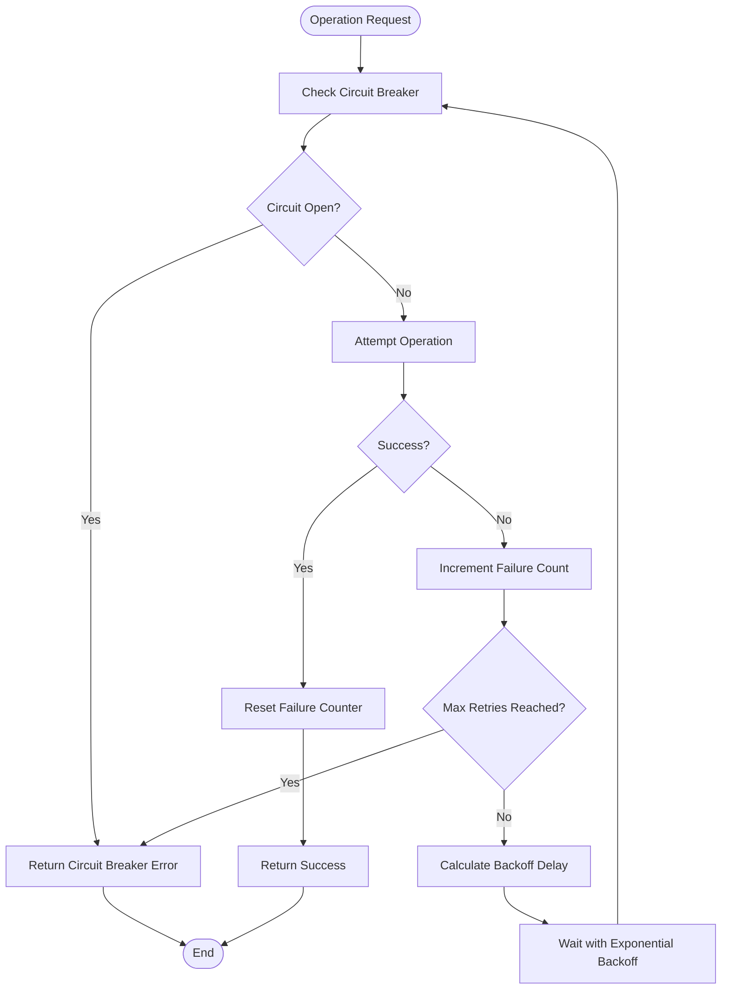

# Error Handling & Exit Codes

<cite>
**Referenced Files in This Document**
- [cmd/benadis-runner/main.go](file://cmd/benadis-runner/main.go)
- [internal/constants/constants.go](file://internal/constants/constants.go)
- [internal/logging/utils.go](file://internal/logging/utils.go)
- [internal/entity/filer/errors.go](file://internal/entity/filer/errors.go)
- [internal/entity/sonarqube/errors.go](file://internal/entity/sonarqube/errors.go)
- [internal/config/config.go](file://internal/config/config.go)
- [internal/app/app.go](file://internal/app/app.go)
- [internal/service/sonarqube/error_handling.go](file://internal/service/sonarqube/error_handling.go)
- [QWEN.md](file://QWEN.md)
- [README.md](file://README.md)
- [Makefile](file://Makefile)
</cite>

## Table of Contents
1. [Introduction](#introduction)
2. [Centralized Error Handling Architecture](#centralized-error-handling-architecture)
3. [Custom Error Types](#custom-error-types)
4. [Exit Code System](#exit-code-system)
5. [Structured Logging Implementation](#structured-logging-implementation)
6. [Error Recovery Strategies](#error-recovery-strategies)
7. [Common Error Scenarios](#common-error-scenarios)
8. [Troubleshooting Guide](#troubleshooting-guide)
9. [Best Practices](#best-practices)
10. [Conclusion](#conclusion)

## Introduction

benadis-runner implements a comprehensive error handling and exit code system designed to provide robust error management for automation scripts and CI/CD pipelines. The system features centralized error handling, structured logging, custom error types, and intelligent error recovery mechanisms that ensure reliable operation across diverse deployment environments.

The error handling architecture follows modern Go best practices with emphasis on:
- **Structured logging** with contextual information
- **Typed error handling** with specific error categories
- **Automatic retry mechanisms** for transient failures
- **Graceful degradation** when external systems fail
- **Clear exit codes** for automation script integration

## Centralized Error Handling Architecture

The error handling system in benadis-runner is built around a layered architecture that separates concerns and provides consistent error management across all modules.



**Diagram sources**
- [cmd/benadis-runner/main.go](file://cmd/benadis-runner/main.go#L1-L252)
- [internal/service/sonarqube/error_handling.go](file://internal/service/sonarqube/error_handling.go#L1-L311)
- [internal/logging/utils.go](file://internal/logging/utils.go#L1-L190)

The architecture ensures that:
- All errors pass through a central error handling service
- Different error types are handled appropriately
- Logging maintains context throughout the error chain
- Recovery mechanisms are applied consistently

**Section sources**
- [cmd/benadis-runner/main.go](file://cmd/benadis-runner/main.go#L1-L252)
- [internal/service/sonarqube/error_handling.go](file://internal/service/sonarqube/error_handling.go#L1-L311)

## Custom Error Types

benadis-runner defines several categories of custom error types to handle different failure scenarios with appropriate context and recovery strategies.

### File System Error Types

The file system module implements a comprehensive error system with severity levels and contextual information:



**Diagram sources**
- [internal/entity/filer/errors.go](file://internal/entity/filer/errors.go#L25-L100)

### SonarQube Error Types

The SonarQube integration provides specialized error handling for API communication and scanning operations:



**Diagram sources**
- [internal/entity/sonarqube/errors.go](file://internal/entity/sonarqube/errors.go#L1-L50)

### Error Classification and Severity

The system implements a four-tier severity classification:

1. **SeverityInfo**: Informational messages (no action required)
2. **SeverityWarning**: Recoverable issues (may require attention)
3. **SeverityError**: Non-critical errors (should be addressed)
4. **SeverityCritical**: Fatal errors requiring immediate attention

**Section sources**
- [internal/entity/filer/errors.go](file://internal/entity/filer/errors.go#L25-L100)
- [internal/entity/sonarqube/errors.go](file://internal/entity/sonarqube/errors.go#L1-L50)

## Exit Code System

benadis-runner uses a standardized exit code system to facilitate automation script integration and CI/CD pipeline decision-making.

### Standard Exit Codes

| Exit Code | Meaning | Triggering Conditions |
|-----------|---------|----------------------|
| 0 | Success | Operation completed successfully |
| 2 | Unknown Command | Invalid or unrecognized command |
| 5 | Configuration Error | Failed to load or validate configuration |
| 6 | Conversion Error | Error during data conversion process |
| 7 | Storage Operation Error | Issues with storage operations |
| 8 | Service Mode Error | Problems with service mode operations |

### Exit Code Implementation

The main application implements exit code handling based on the executed command:



**Diagram sources**
- [cmd/benadis-runner/main.go](file://cmd/benadis-runner/main.go#L30-L252)

### Command-Specific Exit Codes

Each command type has specific error conditions that trigger different exit codes:

- **Convert Command (exit code 6)**: Issues with data conversion, file access, or format validation
- **Storage Operations (exit codes 7)**: Problems with database connections, storage locks, or permission issues
- **Service Mode Operations (exit code 8)**: RAC connectivity issues, invalid base names, or session management problems

**Section sources**
- [cmd/benadis-runner/main.go](file://cmd/benadis-runner/main.go#L30-L252)

## Structured Logging Implementation

benadis-runner implements a sophisticated structured logging system using Go's standard `log/slog` package with custom adapters and context tracking.

### Logging Architecture



**Diagram sources**
- [internal/logging/utils.go](file://internal/logging/utils.go#L1-L190)

### Logging Features

The logging system provides:

1. **Structured Context**: Maintains operation context across async operations
2. **Correlation Tracking**: Links related log entries with correlation IDs
3. **Level-Based Filtering**: Configurable log levels (Debug, Info, Warn, Error)
4. **Format Flexibility**: JSON and text output formats
5. **Source Location**: Automatic source file and line number inclusion

### Logging Best Practices

The system enforces consistent logging patterns:

```go
// Example of structured logging with context
logger.LogInfo(ctx, "Operation started", 
    slog.String("operation", "service_mode_enable"),
    slog.String("infobase", infobaseName),
    slog.Bool("terminate_sessions", terminateSessions))

logger.LogError(ctx, "Operation failed", 
    slog.String("error", err.Error()),
    slog.String("operation", "service_mode_enable"),
    slog.String("infobase", infobaseName))
```

**Section sources**
- [internal/logging/utils.go](file://internal/logging/utils.go#L1-L190)
- [cmd/benadis-runner/main.go](file://cmd/benadis-runner/main.go#L20-L30)

## Error Recovery Strategies

benadis-runner implements multiple error recovery strategies to handle transient failures and ensure system resilience.

### Circuit Breaker Pattern

The system implements a circuit breaker pattern to prevent cascading failures:



**Diagram sources**
- [internal/service/sonarqube/error_handling.go](file://internal/service/sonarqube/error_handling.go#L10-L25)

### Retry Mechanisms

The retry system implements exponential backoff with jitter:



**Diagram sources**
- [internal/service/sonarqube/error_handling.go](file://internal/service/sonarqube/error_handling.go#L80-L120)

### Recovery Strategies by Error Type

| Error Category | Recovery Strategy | Implementation |
|---------------|-------------------|----------------|
| Network Timeouts | Exponential backoff retry | Built-in retry mechanism |
| Database Connection | Circuit breaker + retry | ErrorHandlingService |
| File System Access | Permission checking + retry | FileSystemError wrapper |
| SonarQube API | Rate limiting + caching | Circuit breaker pattern |

**Section sources**
- [internal/service/sonarqube/error_handling.go](file://internal/service/sonarqube/error_handling.go#L80-L150)
- [internal/entity/filer/errors.go](file://internal/entity/filer/errors.go#L150-L200)

## Common Error Scenarios

Based on the QWEN.md documentation and code analysis, here are the most common error scenarios encountered in benadis-runner:

### Service Mode Operation Errors

**Scenario**: Service mode operation fails due to invalid base name or RAC connectivity issues.

**Symptoms**:
- Exit code 8
- "Не указано имя информационной базы" error message
- RAC connection failures

**Root Causes**:
- Missing `BR_INFOBASE_NAME` environment variable
- Invalid 1C server configuration
- Network connectivity issues to RAC server

**Resolution Steps**:
1. Verify environment variable configuration
2. Check 1C server accessibility
3. Validate RAC server settings
4. Review network connectivity

### Configuration Loading Errors

**Scenario**: Application fails to load configuration due to missing or invalid files.

**Symptoms**:
- Exit code 5
- "Не удалось загрузить конфигурацию приложения" error
- Missing required parameters

**Root Causes**:
- Missing configuration files
- Invalid YAML/JSON syntax
- Missing required environment variables

**Resolution Steps**:
1. Validate configuration file syntax
2. Check required environment variables
3. Verify file permissions
4. Review configuration precedence order

### Database Operation Failures

**Scenario**: Database restore or update operations fail due to connectivity or permission issues.

**Symptoms**:
- Exit code 8
- Database connection errors
- Permission denied messages

**Root Causes**:
- Incorrect database credentials
- Network connectivity issues
- Database server unavailability

**Resolution Steps**:
1. Verify database connection parameters
2. Check database server status
3. Validate user permissions
4. Review timeout configurations

### File System Access Errors

**Scenario**: File operations fail due to permission issues or invalid paths.

**Symptoms**:
- FileSystemError with severity WARNING
- Path traversal attempts detected
- Insufficient permissions errors

**Root Causes**:
- Invalid file paths
- Permission restrictions
- Virtual file system limitations

**Resolution Steps**:
1. Validate file path security
2. Check directory permissions
3. Review virtual file system configuration
4. Implement path sanitization

**Section sources**
- [QWEN.md](file://QWEN.md#L200-L268)
- [cmd/benadis-runner/main.go](file://cmd/benadis-runner/main.go#L30-L252)

## Troubleshooting Guide

### Diagnostic Commands

Use these commands to diagnose common error scenarios:

```bash
# Check configuration loading
./benadis-runner --help

# Enable debug logging
export LOG_LEVEL=debug
./benadis-runner service-mode-status --infobase MyInfobase

# Test RAC connectivity
./benadis-runner service-mode-status --infobase MyInfobase --debug
```

### Log Analysis Patterns

Common log patterns and their meanings:

| Log Pattern | Meaning | Action Required |
|-------------|---------|-----------------|
| "Не указано имя информационной базы" | Missing environment variable | Set BR_INFOBASE_NAME |
| "Ошибка подключения" | Database connectivity issue | Check database config |
| "Попытка выхода за пределы файловой системы" | Path security violation | Review file paths |
| "Service unavailable due to circuit breaker" | External service timeout | Check external service health |

### Error Recovery Checklist

1. **Environment Setup**
   - Verify all required environment variables
   - Check configuration file syntax
   - Validate file permissions

2. **Network Connectivity**
   - Test RAC server accessibility
   - Verify database server reachability
   - Check proxy and firewall settings

3. **Resource Availability**
   - Confirm disk space availability
   - Check memory allocation
   - Verify concurrent operation limits

4. **External Dependencies**
   - Validate 1C platform installation
   - Check SonarQube service status
   - Verify Git/Gitea connectivity

### Automated Recovery Scripts

Example recovery script for common scenarios:

```bash
#!/bin/bash
# Recovery script for benadis-runner errors

# Check exit code and attempt recovery
case $? in
    5)
        echo "Configuration error detected - reloading config"
        # Reload configuration and retry
        ;;
    8)
        echo "Service mode error - checking RAC connectivity"
        # Test RAC connectivity and retry
        ;;
    *)
        echo "Unknown error - manual intervention required"
        ;;
esac
```

**Section sources**
- [cmd/benadis-runner/main.go](file://cmd/benadis-runner/main.go#L30-L252)
- [internal/config/config.go](file://internal/config/config.go#L700-L800)

## Best Practices

### Error Handling Guidelines

1. **Always Log Context**: Include relevant context in error logs
2. **Use Structured Logging**: Maintain consistent log format
3. **Implement Circuit Breakers**: Prevent cascading failures
4. **Provide Clear Error Messages**: Help users understand resolution steps
5. **Use Appropriate Exit Codes**: Enable automation script integration

### Configuration Management

1. **Validate Early**: Check configuration before operation start
2. **Use Defaults Wisely**: Provide sensible default values
3. **Document Requirements**: Clearly specify required parameters
4. **Implement Validation**: Validate configuration syntax and semantics

### Monitoring and Alerting

1. **Monitor Exit Codes**: Track error patterns in CI/CD pipelines
2. **Log Aggregation**: Centralize logs for analysis
3. **Alert on Patterns**: Configure alerts for recurring errors
4. **Performance Metrics**: Monitor operation timing and success rates

### Testing Strategies

1. **Unit Tests**: Test individual error handling components
2. **Integration Tests**: Test error scenarios across modules
3. **Mock External Services**: Simulate error conditions
4. **Load Testing**: Test error recovery under stress

## Conclusion

benadis-runner's error handling and exit code system provides a robust foundation for reliable automation operations. The centralized approach ensures consistent error management across all modules while providing flexibility for specific error handling strategies.

Key strengths of the system include:

- **Comprehensive Error Types**: Specialized error handling for different failure scenarios
- **Structured Logging**: Rich contextual information for debugging and monitoring
- **Intelligent Recovery**: Automatic retry mechanisms and circuit breakers
- **Clear Exit Codes**: Standardized exit codes for automation integration
- **Modular Design**: Easy extension for new error handling patterns

The system successfully balances reliability with usability, providing developers and operators with the tools needed to build robust automation pipelines while maintaining operational visibility and control.

Future enhancements could include:
- Enhanced telemetry integration
- More granular error categorization
- Improved automated recovery mechanisms
- Advanced monitoring and alerting capabilities