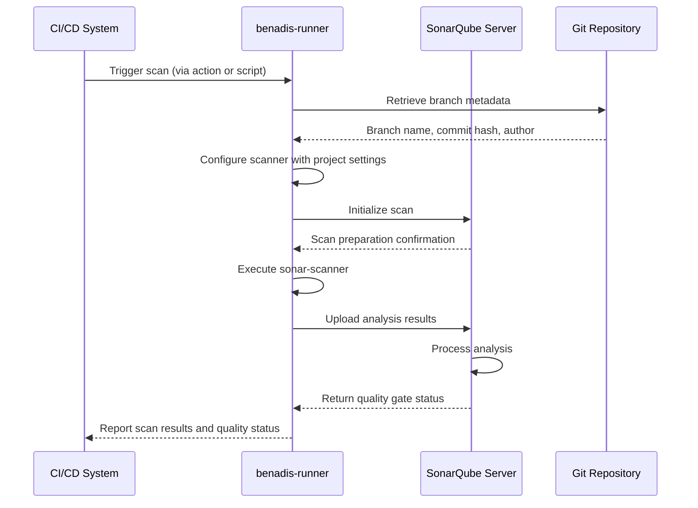

# Examples & Use Cases

<cite>
**Referenced Files in This Document**   
- [action.yaml](file://config/action.yaml)
- [dbconfig.yaml](file://config/dbconfig.yaml)
- [0-env-config.sh](file://scripts/0-env-config.sh)
- [1-ibcmd.sh](file://scripts/1-ibcmd.sh)
- [2-1cv8.sh](file://scripts/2-1cv8.sh)
- [3-1cedtcli.sh](file://scripts/3-1cedtcli.sh)
- [generate-version.sh](file://scripts/generate-version.sh)
- [install-dev-tools.sh](file://scripts/install-dev-tools.sh)
- [sq-scan-benadis-runner.sh](file://scripts/sq-scan-benadis-runner.sh)
- [sonarqube_init.go](file://internal/app/sonarqube_init.go)
- [sonarqube.go](file://internal/config/sonarqube.go)
- [command_handler.go](file://internal/service/sonarqube/command_handler.go)
- [branch_scanner.go](file://internal/entity/sonarqube/branch_scanner.go)
- [branch_scanner_service.go](file://internal/service/sonarqube/branch_scanner_service.go)
</cite>

## Table of Contents
1. [CI/CD Pipeline with GitHub Actions](#cicd-pipeline-with-github-actions)
2. [Database Restore Automation](#database-restore-automation)
3. [Quality Gates with SonarQube Scanning](#quality-gates-with-sonarqube-scanning)
4. [Environment Setup and Version Management](#environment-setup-and-version-management)
5. [Container Operations](#container-operations)
6. [1C Project Conversion](#1c-project-conversion)
7. [Configuration Synchronization](#configuration-synchronization)
8. [Service Mode State Management](#service-mode-state-management)

## CI/CD Pipeline with GitHub Actions

The benadis-runner can be integrated into GitHub Actions workflows using the action.yaml configuration file. This enables automated execution of various commands through GitHub Actions, providing a seamless CI/CD experience for 1C development projects.

The action.yaml file defines a composite action that accepts multiple inputs including Gitea URL, repository information, access tokens, and specific commands to execute. The action is designed to run the benadis-runner binary with environment variables mapped from the input parameters, allowing for flexible configuration of different operations.

Key features of the GitHub Actions integration include:
- Debug mode support with configurable debug port and wait options
- Support for executing external processing files (.epf) via URL
- Configuration flexibility through various input parameters
- Integration with SonarQube scanning for code quality analysis
- Environment variable mapping from action inputs

The action can be triggered on various events and supports both main and debug configurations through menu files. This enables teams to implement comprehensive automation workflows for their 1C development processes, from code analysis to deployment operations.

**Section sources**
- [action.yaml](file://config/action.yaml#L1-L120)

## Database Restore Automation

The database restore functionality in benadis-runner is configured through the dbconfig.yaml file, which contains definitions for multiple database instances across different environments. This configuration enables automated restoration and management of MSSQL databases used in 1C applications.

The dbconfig.yaml file defines database configurations with key properties:
- one-server: Specifies the application server for the database
- prod: Indicates whether the database is in production
- dbserver: Identifies the database server host

Each database entry follows a naming convention that indicates its purpose (e.g., V8_ARCH for archive databases, V8_CICD for CI/CD databases, TEST for test databases). This systematic approach allows for easy identification and management of database instances across different environments.

The configuration supports various database scenarios including:
- Production and test environments
- Archival databases
- CI/CD pipeline databases
- Development and demonstration databases

This comprehensive database configuration system enables automated database operations such as restoration, backup, and synchronization, which are critical for maintaining consistent development and testing environments in 1C projects.

**Section sources**
- [dbconfig.yaml](file://config/dbconfig.yaml#L1-L800)

## Quality Gates with SonarQube Scanning

benadis-runner integrates with SonarQube to implement quality gates in the development process. The integration is configured through several components that work together to enable code analysis and quality verification.

The SonarQube configuration is defined in the internal/config/sonarqube.go file, which specifies settings such as:
- SonarQube server URL and authentication token
- Timeout and retry configurations
- Project prefix and default visibility
- Quality gate timeout settings
- Scanner configuration including download URL and version

The service layer in internal/service/sonarqube/command_handler.go implements the SQCommandHandler that coordinates SonarQube operations. This handler provides methods for:
- Checking which commits need scanning
- Handling branch scanning commands
- Processing pull request scanning
- Managing scan results and reporting

The branch scanning functionality in internal/entity/sonarqube/branch_scanner.go retrieves Git metadata and performs SonarQube scans, while the service layer in internal/service/sonarqube/branch_scanner_service.go provides orchestration with validation, retry logic, and result processing.

A sample script (sq-scan-benadis-runner.sh) demonstrates how to execute a SonarQube scan with specific parameters including project key, source directory, server URL, and authentication token. This enables automated quality checks as part of CI/CD pipelines, ensuring code quality standards are maintained.

**Diagram sources**
- [sonarqube.go](file://internal/config/sonarqube.go#L1-L253)
- [command_handler.go](file://internal/service/sonarqube/command_handler.go#L1-L344)
- [branch_scanner.go](file://internal/entity/sonarqube/branch_scanner.go#L1-L449)
- [branch_scanner_service.go](file://internal/service/sonarqube/branch_scanner_service.go#L1-L408)
- [sq-scan-benadis-runner.sh](file://scripts/sq-scan-benadis-runner.sh#L1-L7)

**Section sources**
- [sonarqube.go](file://internal/config/sonarqube.go#L1-L253)
- [command_handler.go](file://internal/service/sonarqube/command_handler.go#L1-L344)
- [branch_scanner.go](file://internal/entity/sonarqube/branch_scanner.go#L1-L449)
- [branch_scanner_service.go](file://internal/service/sonarqube/branch_scanner_service.go#L1-L408)
- [sq-scan-benadis-runner.sh](file://scripts/sq-scan-benadis-runner.sh#L1-L7)

## Environment Setup and Version Management

The scripts directory contains several shell scripts that demonstrate environment setup and version management practices for the benadis-runner project.

The 0-env-config.sh script configures Git settings for the development environment, including user name, email, and credential caching. This ensures consistent Git configuration across development environments.

The generate-version.sh script provides automated version generation based on current date and Git commit information. Key features include:
- Automatic extraction of current date components (year, month, day)
- Retrieval of Git commit hash and message
- Incremental build numbering based on daily commits
- Generation of version.go file with constants
- Creation of version.md file with detailed build information

The version generation process follows these steps:
1. Extract current date information
2. Retrieve Git commit details
3. Determine build number (increment if same date, reset if new date)
4. Generate version.go with version constants
5. Create version.md with comprehensive build details

This automated versioning system ensures traceability and consistency across builds, making it easier to identify and track different versions of the application.

**Section sources**
- [0-env-config.sh](file://scripts/0-env-config.sh#L1-L9)
- [generate-version.sh](file://scripts/generate-version.sh#L1-L227)

## Container Operations

The scripts directory includes examples of container operations for 1C platform components. These scripts demonstrate how to interact with 1C services and databases within containerized environments.

The 1-ibcmd.sh script shows how to create an infobase using ibcmd, specifying the database path, name, and locale. This is useful for initializing 1C databases in container environments.

The 2-1cv8.sh script demonstrates launching the 1C:Enterprise designer in a container with various parameters:
- Database connection details
- Configuration repository settings
- Security options for configuration changes
- Interface behavior settings (disabling startup dialogs and messages)
- Output redirection for logging

These scripts illustrate how to automate container operations for 1C applications, enabling reproducible environment setups and streamlined development workflows. The use of command-line interfaces allows for scripting and automation of common tasks, reducing manual effort and potential errors.

**Section sources**
- [1-ibcmd.sh](file://scripts/1-ibcmd.sh#L1-L5)
- [2-1cv8.sh](file://scripts/2-1cv8.sh#L1-L4)

## 1C Project Conversion

The benadis-runner includes functionality for converting 1C projects between different formats and storage types. While specific conversion scripts are not visible in the provided context, the architecture suggests support for various conversion operations.

Based on the project structure, conversion capabilities likely include:
- Converting between file-based and database-based configuration storage
- Migrating projects between different 1C platform versions
- Transforming configuration data between formats

The conversion module would leverage the EDT (Enterprise Development Tools) integration to perform these operations programmatically. This enables automated migration of 1C configurations as part of larger development or deployment workflows.

Typical conversion scenarios might include:
- Converting a configuration from a development environment to a format suitable for version control
- Migrating legacy configurations to newer 1C platform versions
- Preparing configurations for deployment to different environments

These conversion capabilities are essential for modern 1C development practices that emphasize version control, continuous integration, and automated deployment.

## Configuration Synchronization

The 3-1cedtcli.sh script demonstrates configuration synchronization between different storage types using the 1C Enterprise Development Tools CLI. This script exports configuration files from a working copy to XML format, which is a common pattern for synchronizing 1C configurations.

The script performs the following operations:
- Exports the main configuration files to XML format
- Exports additional configuration modules separately
- Organizes output in a structured directory hierarchy

This approach enables:
- Version control of 1C configurations
- Collaboration among development teams
- Automated build and deployment processes
- Configuration auditing and change tracking

The synchronization process typically involves:
1. Exporting the current configuration from the 1C database to XML files
2. Committing the XML files to version control
3. Importing XML files to update configurations in other environments
4. Resolving any conflicts that arise during synchronization

This workflow supports modern development practices by decoupling configuration management from the database, enabling better collaboration and more reliable deployments.

**Section sources**
- [3-1cedtcli.sh](file://scripts/3-1cedtcli.sh#L1-L4)

## Service Mode State Management

The benadis-runner includes functionality for managing service mode states in 1C information bases. While specific implementation details are not fully visible in the provided context, the architecture indicates support for this critical administrative function.

Service mode management typically involves:
- Enabling service mode to restrict user access during maintenance
- Disabling service mode to return the system to normal operation
- Configuring session termination policies
- Managing maintenance windows

The system likely uses environment variables with the SERVICE_MODE_ prefix (as mentioned in the README) to configure service mode operations. This allows for flexible configuration across different environments.

Key considerations for service mode management include:
- Proper notification of users before enabling service mode
- Ensuring critical processes are completed before restricting access
- Monitoring system state during maintenance operations
- Verifying system integrity before disabling service mode

This functionality is essential for performing administrative tasks, applying updates, and conducting maintenance on 1C systems without disrupting ongoing business operations.