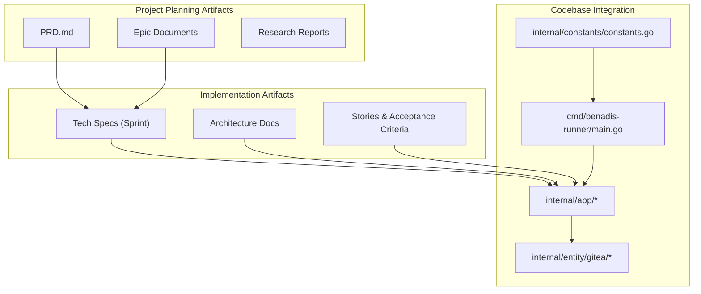
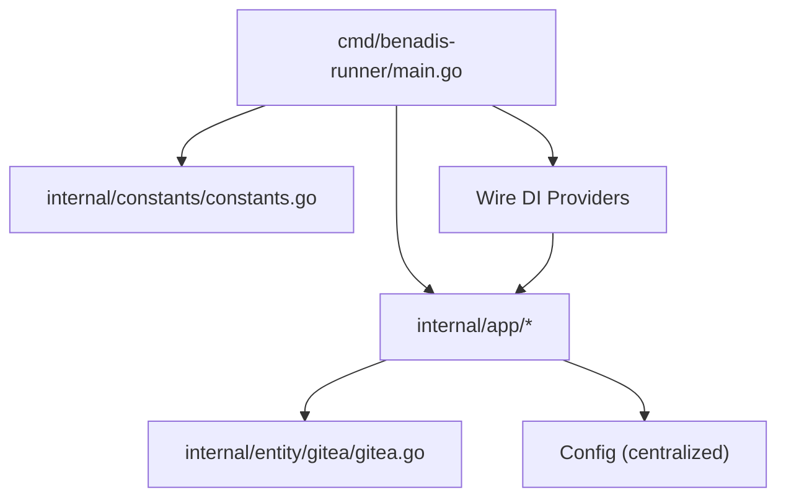
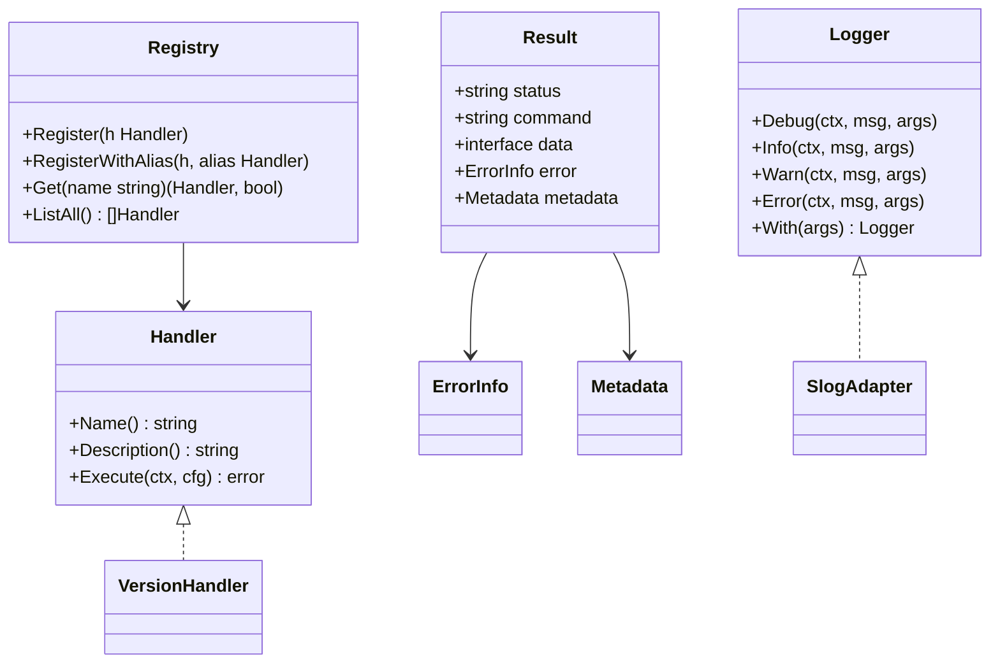
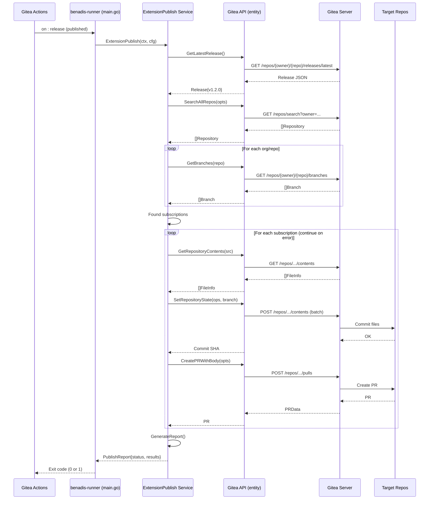
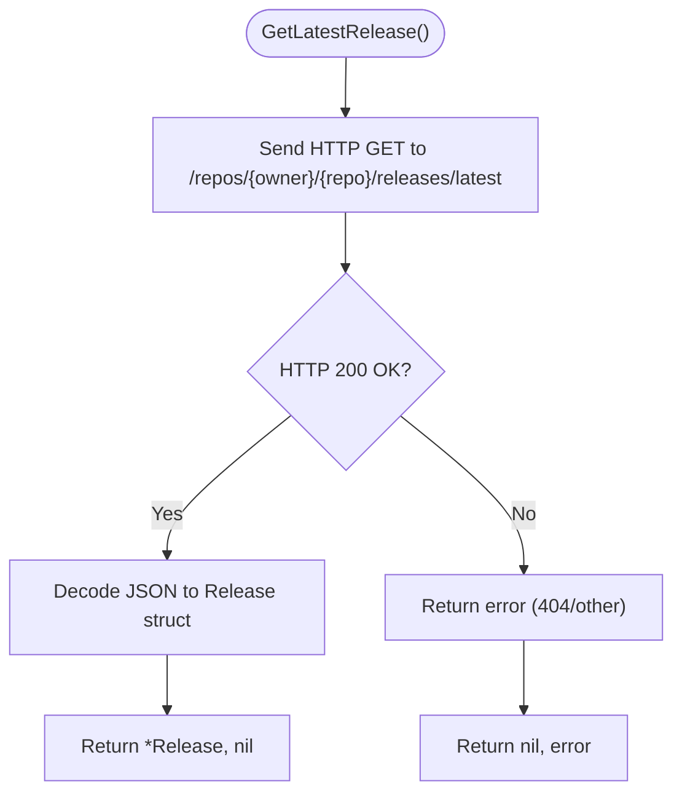
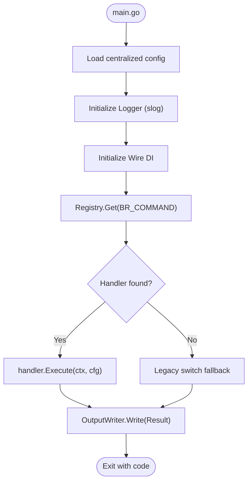
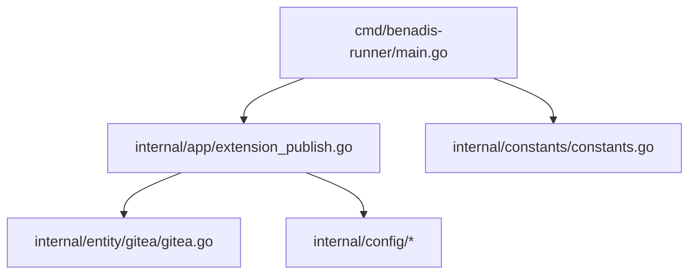

# Implementation Artifacts

<cite>
**Referenced Files in This Document**
- [README.md](file://README.md)
- [go.mod](file://go.mod)
- [main.go](file://cmd/benadis-runner/main.go)
- [constants.go](file://internal/constants/constants.go)
- [tech-spec-epic-1.md](file://_bmad-output/implementation-artifacts/sprint-artifacts/tech-spec-epic-1.md)
- [arch-epic-0-extension-publish.md](file://_bmad-output/implementation-artifacts/sprint-artifacts/arch-epic-0-extension-publish.md)
- [0-1-gitea-api-releases.md](file://_bmad-output/implementation-artifacts/stories/0-1-gitea-api-releases.md)
- [epic-0-extension-publish.md](file://_bmad-output/project-planning-artifacts/epics/epic-0-extension-publish.md)
- [prd.md](file://_bmad-output/project-planning-artifacts/prd.md)
- [extension_publish.go](file://internal/app/extension_publish.go)
- [gitea.go](file://internal/entity/gitea/gitea.go)
</cite>

## Table of Contents
1. [Introduction](#introduction)
2. [Project Structure](#project-structure)
3. [Core Components](#core-components)
4. [Architecture Overview](#architecture-overview)
5. [Detailed Component Analysis](#detailed-component-analysis)
6. [Dependency Analysis](#dependency-analysis)
7. [Performance Considerations](#performance-considerations)
8. [Troubleshooting Guide](#troubleshooting-guide)
9. [Conclusion](#conclusion)

## Introduction
This document presents the implementation artifacts produced during the development of benadis-runner v2.0, focusing on the architectural transformation toward a modular, DI-driven platform with structured output and observability foundations. It synthesizes technical specifications, architectural decisions, and concrete implementation files to provide both technical depth and accessibility for stakeholders across roles.

## Project Structure
The repository organizes implementation artifacts across three primary areas:
- Project planning artifacts: Strategic documents (PRD, Epics, Research) establishing goals, scope, and acceptance criteria.
- Implementation artifacts: Sprint deliverables (Technical Specifications, Architecture Documents, Stories) detailing design, interfaces, and workflows.
- Codebase integration: Concrete Go packages implementing the new architecture and specific commands like extension-publish.

**Diagram sources**
- [main.go](file://cmd/benadis-runner/main.go#L1-L262)
- [constants.go](file://internal/constants/constants.go#L1-L223)
- [tech-spec-epic-1.md](file://_bmad-output/implementation-artifacts/sprint-artifacts/tech-spec-epic-1.md#L1-L867)
- [arch-epic-0-extension-publish.md](file://_bmad-output/implementation-artifacts/sprint-artifacts/arch-epic-0-extension-publish.md#L1-L895)
- [extension_publish.go](file://internal/app/extension_publish.go#L1-L1253)
- [gitea.go](file://internal/entity/gitea/gitea.go#L1-L2183)

**Section sources**
- [README.md](file://README.md#L1-L220)
- [go.mod](file://go.mod#L1-L27)

## Core Components
This section outlines the foundational components that define the new architecture and the extension-publish implementation.

- Command Registry and DI Foundation (Epic 1)
  - Command Registry with self-registration via package init().
  - Wire DI providers for Config, Logger, OutputWriter.
  - Structured output contracts and error handling.
  - Trace ID generation and context propagation.
  - Backward-compatible configuration extensions.

- Extension Publish Command (Epic 0)
  - Release retrieval via Gitea API.
  - Organization-wide repository search and subscription branch detection.
  - File synchronization with batch operations.
  - Pull Request creation with release notes and metadata.
  - Comprehensive error handling and reporting.

**Section sources**
- [tech-spec-epic-1.md](file://_bmad-output/implementation-artifacts/sprint-artifacts/tech-spec-epic-1.md#L82-L133)
- [arch-epic-0-extension-publish.md](file://_bmad-output/implementation-artifacts/sprint-artifacts/arch-epic-0-extension-publish.md#L33-L115)
- [extension_publish.go](file://internal/app/extension_publish.go#L1-L1253)

## Architecture Overview
The system follows a layered architecture with clear separation of concerns:
- Entry point: CLI command routing in main.go.
- Orchestration: Application services in internal/app.
- Infrastructure: Entity adapters in internal/entity (Gitea API).
- Configuration and DI: Centralized configuration and provider wiring.
- Output and logging: Structured output and slog-based logging.

**Diagram sources**
- [main.go](file://cmd/benadis-runner/main.go#L1-L262)
- [constants.go](file://internal/constants/constants.go#L1-L223)
- [extension_publish.go](file://internal/app/extension_publish.go#L1-L1253)
- [gitea.go](file://internal/entity/gitea/gitea.go#L1-L2183)

## Detailed Component Analysis

### Command Registry and DI Foundation (Epic 1)
The technical specification establishes the architectural bedrock for modularity and maintainability:
- Command Registry: Self-registration via init() ensures discoverability without manual registration.
- Wire DI: Compile-time dependency injection eliminates runtime reflection overhead and reduces boilerplate.
- Output Contract: Standardized Result structure with status, data, error, and metadata for structured output.
- Logger Interface: slog-based abstraction enables testable logging and future exporters.
- Trace ID: Context propagation for end-to-end observability.

**Diagram sources**
- [tech-spec-epic-1.md](file://_bmad-output/implementation-artifacts/sprint-artifacts/tech-spec-epic-1.md#L212-L328)

**Section sources**
- [tech-spec-epic-1.md](file://_bmad-output/implementation-artifacts/sprint-artifacts/tech-spec-epic-1.md#L117-L180)

### Extension Publish Workflow (Epic 0)
The extension-publish command automates distribution of 1C extensions across subscribed repositories. The workflow integrates with Gitea APIs to retrieve releases, discover subscribers, synchronize files, and create pull requests.

**Diagram sources**
- [arch-epic-0-extension-publish.md](file://_bmad-output/implementation-artifacts/sprint-artifacts/arch-epic-0-extension-publish.md#L596-L665)
- [extension_publish.go](file://internal/app/extension_publish.go#L150-L267)

**Section sources**
- [arch-epic-0-extension-publish.md](file://_bmad-output/implementation-artifacts/sprint-artifacts/arch-epic-0-extension-publish.md#L596-L756)
- [extension_publish.go](file://internal/app/extension_publish.go#L456-L688)

### Gitea API Enhancements (Story 0.1)
The story extends the Gitea API client with release retrieval capabilities and supporting types, enabling the extension-publish workflow.

**Diagram sources**
- [0-1-gitea-api-releases.md](file://_bmad-output/implementation-artifacts/stories/0-1-gitea-api-releases.md#L77-L94)
- [gitea.go](file://internal/entity/gitea/gitea.go#L1-L2183)

**Section sources**
- [0-1-gitea-api-releases.md](file://_bmad-output/implementation-artifacts/stories/0-1-gitea-api-releases.md#L60-L95)
- [gitea.go](file://internal/entity/gitea/gitea.go#L1-L2183)

### Command Routing and Execution (main.go)
The entry point routes commands to either legacy handlers or new DI-managed handlers via the Command Registry. It initializes configuration, logger, and DI container, then executes the selected handler.

**Diagram sources**
- [main.go](file://cmd/benadis-runner/main.go#L16-L261)
- [constants.go](file://internal/constants/constants.go#L48-L102)

**Section sources**
- [main.go](file://cmd/benadis-runner/main.go#L16-L261)
- [constants.go](file://internal/constants/constants.go#L48-L102)

## Dependency Analysis
The implementation relies on a focused set of dependencies and internal packages:

- External dependencies (as declared in go.mod):
  - go-sqlmock, go-mssqldb, cleanenv, testify, golang.org/x/text, yaml.v3.
- Internal dependencies:
  - Config loading and logging abstractions.
  - Gitea API client with new release and search capabilities.
  - Application services orchestrating extension publishing.

**Diagram sources**
- [go.mod](file://go.mod#L5-L26)
- [extension_publish.go](file://internal/app/extension_publish.go#L1-L1253)
- [gitea.go](file://internal/entity/gitea/gitea.go#L1-L2183)
- [main.go](file://cmd/benadis-runner/main.go#L1-L262)

**Section sources**
- [go.mod](file://go.mod#L1-L27)

## Performance Considerations
- DI overhead: Wire provides compile-time DI, eliminating runtime reflection costs.
- Logging: Structured logging with slog minimizes overhead while enabling observability.
- Network operations: Gitea API calls are paginated and cached (organization repository cache) to reduce repeated queries.
- Output formatting: Dedicated OutputWriter interfaces separate formatting logic from business logic.

[No sources needed since this section provides general guidance]

## Troubleshooting Guide
Common issues and mitigation strategies derived from the implementation artifacts:

- Command not found
  - Symptom: Unknown command error.
  - Mitigation: Verify BR_COMMAND value; ensure handler is registered via self-registration; fallback to legacy switch logs the chosen path.
  - Evidence: Command execution flow and fallback behavior.

- Release retrieval failures
  - Symptom: "Release not found" or API errors.
  - Mitigation: Confirm repository permissions and release existence; verify Gitea API credentials; check network connectivity.
  - Evidence: Release retrieval methods and error handling patterns.

- Subscription discovery issues
  - Symptom: No subscribers found despite expected branches.
  - Mitigation: Validate subscription branch naming convention; confirm repository visibility and branch presence; check organization enumeration permissions.
  - Evidence: Subscription branch parsing and repository search logic.

- File synchronization errors
  - Symptom: Batch commit failures or missing files.
  - Mitigation: Inspect file paths and encoding; verify SHA correctness; ensure target directory permissions; handle 404 cases gracefully.
  - Evidence: File operation builders and batch commit logic.

- Pull Request creation failures
  - Symptom: PR creation errors or missing PR metadata.
  - Mitigation: Validate PR options (title/body/head/base); confirm branch protection rules; check assignee/label configurations.
  - Evidence: PR creation and metadata building.

**Section sources**
- [tech-spec-epic-1.md](file://_bmad-output/implementation-artifacts/sprint-artifacts/tech-spec-epic-1.md#L412-L428)
- [arch-epic-0-extension-publish.md](file://_bmad-output/implementation-artifacts/sprint-artifacts/arch-epic-0-extension-publish.md#L669-L756)
- [extension_publish.go](file://internal/app/extension_publish.go#L456-L688)

## Conclusion
The implementation artifacts demonstrate a clear architectural transformation toward a modular, DI-driven platform with structured output and robust observability foundations. The extension-publish command exemplifies this evolution by integrating cleanly with Gitea APIs, implementing resilient workflows, and maintaining backward compatibility. These artifacts provide a blueprint for extending the platform with new commands and capabilities while preserving operational excellence and developer productivity.